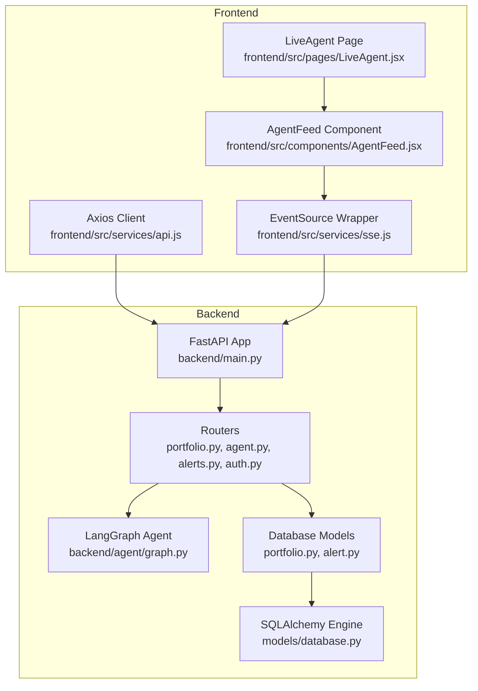
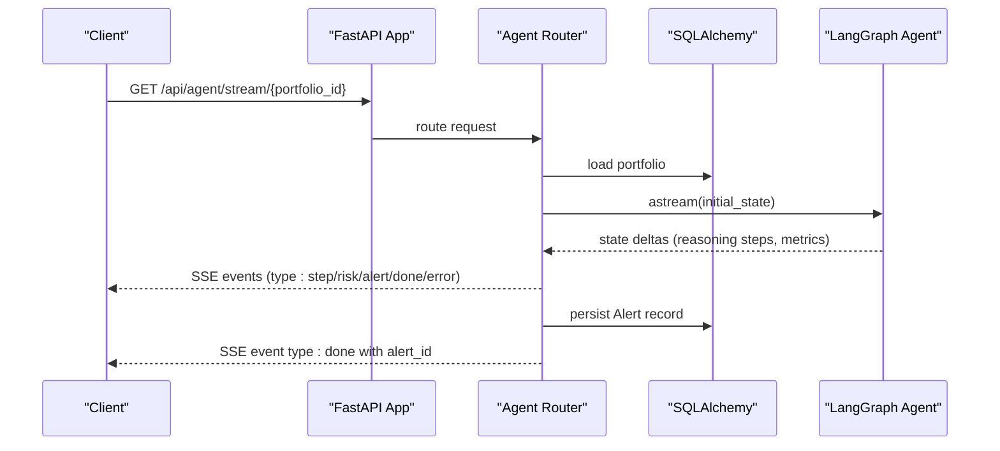
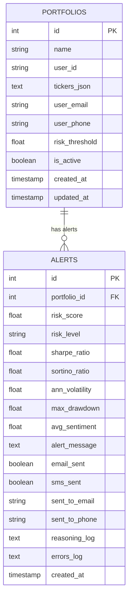
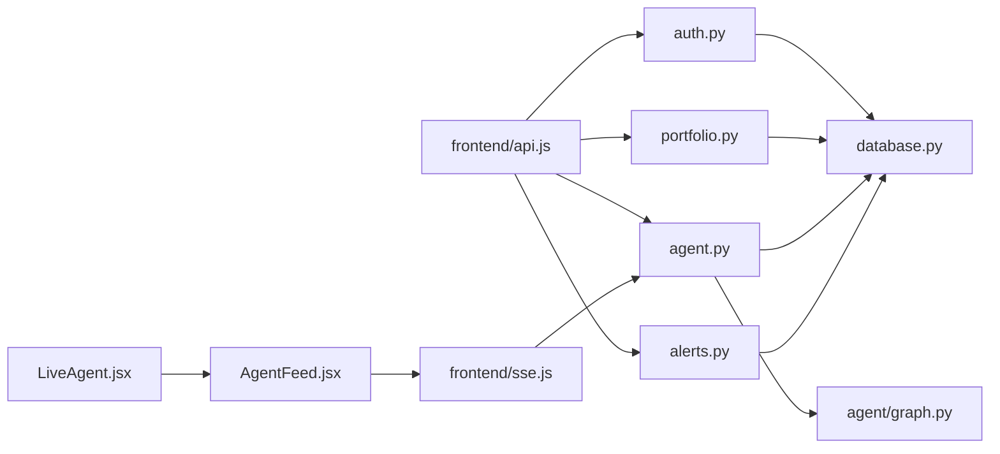

# API Documentation

<cite>
**Referenced Files in This Document**
- [backend/main.py](file://backend/main.py)
- [backend/routers/portfolio.py](file://backend/routers/portfolio.py)
- [backend/routers/agent.py](file://backend/routers/agent.py)
- [backend/routers/alerts.py](file://backend/routers/alerts.py)
- [backend/routers/auth.py](file://backend/routers/auth.py)
- [backend/models/database.py](file://backend/models/database.py)
- [backend/models/portfolio.py](file://backend/models/portfolio.py)
- [backend/models/alert.py](file://backend/models/alert.py)
- [backend/agent/graph.py](file://backend/agent/graph.py)
- [frontend/src/services/api.js](file://frontend/src/services/api.js)
- [frontend/src/services/sse.js](file://frontend/src/services/sse.js)
- [frontend/src/components/AgentFeed.jsx](file://frontend/src/components/AgentFeed.jsx)
- [frontend/src/pages/LiveAgent.jsx](file://frontend/src/pages/LiveAgent.jsx)
- [README.md](file://README.md)
</cite>

## Table of Contents
1. [Introduction](#introduction)
2. [Project Structure](#project-structure)
3. [Core Components](#core-components)
4. [Architecture Overview](#architecture-overview)
5. [Detailed Component Analysis](#detailed-component-analysis)
6. [Dependency Analysis](#dependency-analysis)
7. [Performance Considerations](#performance-considerations)
8. [Troubleshooting Guide](#troubleshooting-guide)
9. [Conclusion](#conclusion)
10. [Appendices](#appendices)

## Introduction
This document provides comprehensive API documentation for the ishwarambare-app RESTful endpoints. It covers HTTP methods, URL patterns, request/response schemas, authentication requirements, and operational details for portfolio management, agent workflow, alert system, and authentication. It also documents the Server-Sent Events (SSE) implementation for real-time agent execution streaming, including event stream format and client-side handling. Additional topics include CORS configuration, security considerations, rate limiting, pagination strategies, API versioning, client implementation guidelines, error handling strategies, and debugging techniques.

## Project Structure
The backend is a FastAPI application that exposes REST endpoints under the /api/* namespace. Routers encapsulate endpoint groups:
- /api/portfolio: CRUD operations for portfolios
- /api/agent: agent execution and streaming
- /api/alerts: alert history and statistics
- /api/auth: authentication endpoints

The frontend is a React application that consumes these APIs via Axios and SSE.

**Diagram sources**
- [backend/main.py:12-43](file://backend/main.py#L12-L43)
- [backend/routers/portfolio.py:1-124](file://backend/routers/portfolio.py#L1-L124)
- [backend/routers/agent.py:1-243](file://backend/routers/agent.py#L1-L243)
- [backend/routers/alerts.py:1-84](file://backend/routers/alerts.py#L1-L84)
- [backend/routers/auth.py:1-39](file://backend/routers/auth.py#L1-L39)
- [backend/models/database.py:1-42](file://backend/models/database.py#L1-L42)
- [backend/models/portfolio.py:1-63](file://backend/models/portfolio.py#L1-L63)
- [backend/models/alert.py:1-77](file://backend/models/alert.py#L1-L77)
- [backend/agent/graph.py:1-243](file://backend/agent/graph.py#L1-L243)
- [frontend/src/services/api.js:1-35](file://frontend/src/services/api.js#L1-L35)
- [frontend/src/services/sse.js:1-63](file://frontend/src/services/sse.js#L1-L63)
- [frontend/src/components/AgentFeed.jsx:1-175](file://frontend/src/components/AgentFeed.jsx#L1-L175)
- [frontend/src/pages/LiveAgent.jsx:1-95](file://frontend/src/pages/LiveAgent.jsx#L1-L95)

**Section sources**
- [backend/main.py:12-43](file://backend/main.py#L12-L43)
- [README.md:111-124](file://README.md#L111-L124)

## Core Components
- FastAPI Application: Defines routers, CORS, and health endpoints.
- SQLAlchemy Models: Define persistent entities for portfolios and alerts.
- Agent Graph: LangGraph StateGraph orchestrating risk analysis and optional alert dispatch.
- Frontend Services: Axios-based API client and SSE wrapper for real-time updates.

Key capabilities:
- Portfolio management: create, list, retrieve, update, delete portfolios with ticker-weight validation.
- Agent execution: synchronous run returning a JSON summary and SSE streaming of reasoning steps.
- Alert history: list alerts, filter by portfolio, retrieve detailed reasoning logs, and compute summary statistics.
- Authentication: demo login endpoint (to be replaced with JWT).

**Section sources**
- [backend/main.py:12-43](file://backend/main.py#L12-L43)
- [backend/models/database.py:1-42](file://backend/models/database.py#L1-L42)
- [backend/models/portfolio.py:1-63](file://backend/models/portfolio.py#L1-L63)
- [backend/models/alert.py:1-77](file://backend/models/alert.py#L1-L77)
- [backend/agent/graph.py:1-243](file://backend/agent/graph.py#L1-L243)
- [frontend/src/services/api.js:1-35](file://frontend/src/services/api.js#L1-L35)
- [frontend/src/services/sse.js:1-63](file://frontend/src/services/sse.js#L1-L63)

## Architecture Overview
The API follows a layered architecture:
- Entry points: FastAPI app registers routers under /api/*
- Business logic: Routers orchestrate database sessions and agent graph execution
- Persistence: SQLAlchemy models map to relational tables
- Streaming: SSE endpoint emits structured events for real-time UI updates
- Frontend consumption: Axios for REST, EventSource for SSE

**Diagram sources**
- [backend/routers/agent.py:39-168](file://backend/routers/agent.py#L39-L168)
- [backend/agent/graph.py:162-203](file://backend/agent/graph.py#L162-L203)
- [backend/models/alert.py:14-77](file://backend/models/alert.py#L14-L77)

## Detailed Component Analysis

### Authentication (/api/auth/)
- Purpose: Demo login and user info endpoint.
- Endpoints:
  - POST /api/auth/login
    - Request body: username, password
    - Response body: access_token, token_type, username
    - Errors: 401 Unauthorized for invalid credentials
  - GET /api/auth/me
    - Response body: stub user info

Security considerations:
- The login endpoint currently returns a demo token and should be replaced with proper JWT authentication and credential validation against a user database.

Example request:
- POST /api/auth/login with JSON payload containing username and password.

Example response:
- 200 OK with access_token, token_type, username.

**Section sources**
- [backend/routers/auth.py:18-39](file://backend/routers/auth.py#L18-L39)

### Portfolio Management (/api/portfolio/)
- Purpose: Manage user portfolios with ticker allocations and risk thresholds.
- Endpoints:
  - GET /api/portfolio
    - Response: Array of portfolio objects ordered by creation date (newest first)
  - POST /api/portfolio
    - Request body: PortfolioCreate schema
    - Validation: Ticker weights must approximately sum to 1.0; otherwise 422 Unprocessable Entity
    - Response: Created portfolio object
  - GET /api/portfolio/{id}
    - Response: Single portfolio object or 404 Not Found
  - PUT /api/portfolio/{id}
    - Request body: PortfolioUpdate schema
    - Response: Updated portfolio object or 404 Not Found
  - DELETE /api/portfolio/{id}
    - Response: 204 No Content or 404 Not Found

Request parameter documentation:
- PortfolioCreate:
  - name: string, default "My Portfolio"
  - tickers: object mapping ticker to weight; weights must sum to ~1.0
  - user_email: optional string
  - user_phone: optional string
  - risk_threshold: float in [0.0, 1.0], default 0.70
- PortfolioUpdate:
  - name, tickers, user_email, user_phone, risk_threshold, is_active: optional fields

Response format specifications:
- Portfolio object includes id, name, user_id, tickers, user_email, user_phone, risk_threshold, is_active, created_at, updated_at.

Common use cases:
- Create a portfolio with balanced weights
- Update risk threshold for alerting
- Retrieve portfolio details for risk analysis

**Section sources**
- [backend/routers/portfolio.py:50-124](file://backend/routers/portfolio.py#L50-L124)
- [backend/models/portfolio.py:50-63](file://backend/models/portfolio.py#L50-L63)

### Agent Workflow (/api/agent/)
- Purpose: Trigger agent runs and receive real-time streaming of reasoning steps.
- Endpoints:
  - GET /api/agent/stream/{portfolio_id}
    - Response: Server-Sent Events stream
    - Headers: Cache-Control: no-cache, X-Accel-Buffering: no, Access-Control-Allow-Origin: *
    - Events:
      - type: "start" — initial snapshot { portfolio, name }
      - type: "step" — reasoning step { node, message }
      - type: "risk" — risk metrics { risk_score, risk_level, metrics }
      - type: "alert" — alert decision { triggered }
      - type: "done" — completion { alert_id }
      - type: "error" — error message
  - POST /api/agent/run/{portfolio_id}
    - Response: JSON summary { alert_id, risk_score, risk_level, should_alert, risk_metrics }
  - GET /api/agent/status
    - Response: Agent service health info

Real-time streaming implementation:
- The SSE endpoint loads the portfolio, constructs initial state, and streams state deltas from the agent graph.
- Client-side EventSource wrapper parses messages and invokes callbacks for each event type.
- On completion, the agent persists an Alert record and emits a "done" event with the alert id.

Client-side handling:
- Use the EventSource wrapper to connect to the SSE endpoint and handle events via callbacks.
- The React component demonstrates connecting to the stream, rendering steps, updating risk metrics, and stopping the stream.

Example request:
- GET /api/agent/stream/{portfolio_id}

Example responses:
- SSE events with type "step", "risk", "alert", "done", or "error".

**Section sources**
- [backend/routers/agent.py:39-168](file://backend/routers/agent.py#L39-L168)
- [backend/routers/agent.py:186-232](file://backend/routers/agent.py#L186-L232)
- [backend/routers/agent.py:235-242](file://backend/routers/agent.py#L235-L242)
- [backend/agent/graph.py:162-203](file://backend/agent/graph.py#L162-L203)
- [frontend/src/services/sse.js:21-62](file://frontend/src/services/sse.js#L21-L62)
- [frontend/src/components/AgentFeed.jsx:48-77](file://frontend/src/components/AgentFeed.jsx#L48-L77)

### Alert System (/api/alerts/)
- Purpose: Retrieve alert history and statistics generated by agent runs.
- Endpoints:
  - GET /api/alerts
    - Query parameters: limit (default 50), portfolio_id (optional)
    - Response: Array of alert objects ordered by creation date (newest first)
  - GET /api/alerts/detail/{alert_id}
    - Response: Full alert object including reasoning steps and errors
  - GET /api/alerts/portfolio/{portfolio_id}
    - Query parameters: limit (default 20)
    - Response: Alerts for the given portfolio, newest first
  - GET /api/alerts/stats
    - Response: Summary statistics across all alerts

Response format specifications:
- Alert object includes id, portfolio_id, risk_score, risk_level, ratios, drawdown, sentiment, alert delivery flags, reasoning steps, errors, created_at.

Pagination strategies:
- Use limit query parameter to constrain result sets.
- Default limits are applied per endpoint to balance performance and usability.

Example request:
- GET /api/alerts?limit=25&portfolio_id=1

Example response:
- Array of alert objects.

**Section sources**
- [backend/routers/alerts.py:22-56](file://backend/routers/alerts.py#L22-L56)
- [backend/routers/alerts.py:35-40](file://backend/routers/alerts.py#L35-L40)
- [backend/routers/alerts.py:59-84](file://backend/routers/alerts.py#L59-L84)
- [backend/models/alert.py:57-77](file://backend/models/alert.py#L57-L77)

### Data Models

**Diagram sources**
- [backend/models/portfolio.py:16-63](file://backend/models/portfolio.py#L16-L63)
- [backend/models/alert.py:14-77](file://backend/models/alert.py#L14-L77)

**Section sources**
- [backend/models/portfolio.py:16-63](file://backend/models/portfolio.py#L16-L63)
- [backend/models/alert.py:14-77](file://backend/models/alert.py#L14-L77)

## Dependency Analysis
- Routers depend on SQLAlchemy sessions for database access.
- Agent router depends on the compiled LangGraph agent for execution.
- Frontend services depend on the backend endpoints for data and streaming.

**Diagram sources**
- [backend/routers/auth.py:1-39](file://backend/routers/auth.py#L1-L39)
- [backend/routers/portfolio.py:1-124](file://backend/routers/portfolio.py#L1-L124)
- [backend/routers/agent.py:1-243](file://backend/routers/agent.py#L1-L243)
- [backend/agent/graph.py:1-243](file://backend/agent/graph.py#L1-L243)
- [backend/routers/alerts.py:1-84](file://backend/routers/alerts.py#L1-L84)
- [backend/models/database.py:1-42](file://backend/models/database.py#L1-L42)
- [frontend/src/services/api.js:1-35](file://frontend/src/services/api.js#L1-L35)
- [frontend/src/services/sse.js:1-63](file://frontend/src/services/sse.js#L1-L63)
- [frontend/src/components/AgentFeed.jsx:1-175](file://frontend/src/components/AgentFeed.jsx#L1-L175)
- [frontend/src/pages/LiveAgent.jsx:1-95](file://frontend/src/pages/LiveAgent.jsx#L1-L95)

**Section sources**
- [backend/routers/auth.py:1-39](file://backend/routers/auth.py#L1-L39)
- [backend/routers/portfolio.py:1-124](file://backend/routers/portfolio.py#L1-L124)
- [backend/routers/agent.py:1-243](file://backend/routers/agent.py#L1-L243)
- [backend/routers/alerts.py:1-84](file://backend/routers/alerts.py#L1-L84)
- [backend/models/database.py:1-42](file://backend/models/database.py#L1-L42)
- [frontend/src/services/api.js:1-35](file://frontend/src/services/api.js#L1-L35)
- [frontend/src/services/sse.js:1-63](file://frontend/src/services/sse.js#L1-L63)
- [frontend/src/components/AgentFeed.jsx:1-175](file://frontend/src/components/AgentFeed.jsx#L1-L175)
- [frontend/src/pages/LiveAgent.jsx:1-95](file://frontend/src/pages/LiveAgent.jsx#L1-L95)

## Performance Considerations
- SSE streaming: The agent streams state deltas to keep UI responsive; a small delay is introduced for visual pacing.
- Database writes: Persisting alerts occurs in a thread executor to avoid blocking the async loop.
- Pagination: Alerts endpoints support a limit parameter to constrain result sizes.
- CORS: The backend allows all origins for SSE compatibility; production deployments should restrict origins.

[No sources needed since this section provides general guidance]

## Troubleshooting Guide
Common issues and resolutions:
- Portfolio weight validation errors: Ensure ticker weights sum to approximately 1.0 when creating or updating portfolios.
- 404 Not Found: Verify resource ids (portfolio_id, alert_id) and that the resource exists.
- SSE connection errors: The client handles connection errors and closes the stream; retry after server restart or network recovery.
- Authentication failures: The demo login endpoint returns 401 for invalid credentials; replace with JWT-based authentication.

Debugging techniques:
- Use the built-in OpenAPI docs at /docs to test endpoints interactively.
- Inspect network tab for SSE frames and HTTP responses.
- Log client-side event handling and state transitions in the frontend components.

**Section sources**
- [backend/routers/portfolio.py:58-65](file://backend/routers/portfolio.py#L58-L65)
- [backend/routers/agent.py:58-60](file://backend/routers/agent.py#L58-L60)
- [backend/routers/alerts.py:37-40](file://backend/routers/alerts.py#L37-L40)
- [frontend/src/services/sse.js:54-57](file://frontend/src/services/sse.js#L54-L57)
- [backend/main.py:47-58](file://backend/main.py#L47-L58)

## Conclusion
The ishwarambare-app API provides a cohesive set of endpoints for portfolio management, agent-driven risk analysis, and alert history. The SSE implementation enables real-time, interactive feedback during agent execution. The frontend demonstrates robust client-side handling of both REST and streaming responses. For production, integrate JWT authentication, tighten CORS policies, and consider implementing rate limiting and pagination controls.

[No sources needed since this section summarizes without analyzing specific files]

## Appendices

### Endpoint Reference Summary
- Authentication
  - POST /api/auth/login
  - GET /api/auth/me
- Portfolio
  - GET /api/portfolio
  - POST /api/portfolio
  - GET /api/portfolio/{id}
  - PUT /api/portfolio/{id}
  - DELETE /api/portfolio/{id}
- Agent
  - GET /api/agent/stream/{portfolio_id}
  - POST /api/agent/run/{portfolio_id}
  - GET /api/agent/status
- Alerts
  - GET /api/alerts
  - GET /api/alerts/detail/{alert_id}
  - GET /api/alerts/portfolio/{portfolio_id}
  - GET /api/alerts/stats

**Section sources**
- [backend/routers/auth.py:18-39](file://backend/routers/auth.py#L18-L39)
- [backend/routers/portfolio.py:50-124](file://backend/routers/portfolio.py#L50-L124)
- [backend/routers/agent.py:39-168](file://backend/routers/agent.py#L39-L168)
- [backend/routers/agent.py:186-232](file://backend/routers/agent.py#L186-L232)
- [backend/routers/agent.py:235-242](file://backend/routers/agent.py#L235-L242)
- [backend/routers/alerts.py:22-56](file://backend/routers/alerts.py#L22-L56)
- [backend/routers/alerts.py:35-40](file://backend/routers/alerts.py#L35-L40)
- [backend/routers/alerts.py:59-84](file://backend/routers/alerts.py#L59-L84)

### SSE Event Stream Format
- Event types emitted by the agent stream:
  - start: Initial snapshot including portfolio and name
  - step: New reasoning step with node and message
  - risk: Risk metrics including score, level, and metrics
  - alert: Alert decision outcome
  - done: Completion with alert id
  - error: Error message

Client-side handling:
- EventSource wrapper parses incoming messages and routes them to appropriate handlers.
- The React component renders steps, updates risk visuals, and manages lifecycle.

**Section sources**
- [backend/routers/agent.py:40-127](file://backend/routers/agent.py#L40-L127)
- [frontend/src/services/sse.js:21-62](file://frontend/src/services/sse.js#L21-L62)
- [frontend/src/components/AgentFeed.jsx:48-77](file://frontend/src/components/AgentFeed.jsx#L48-L77)

### CORS and Security Considerations
- CORS middleware allows all origins for SSE compatibility; adjust ALLOWED_ORIGINS in environment variables for production.
- Authentication is currently demo-grade; implement JWT and secure credential storage.
- Rate limiting: Not implemented; consider adding to protect resources under load.
- API versioning: The application defines a version field; adopt semantic versioning and deprecation policies.

**Section sources**
- [backend/main.py:19-30](file://backend/main.py#L19-L30)
- [backend/main.py:12-16](file://backend/main.py#L12-L16)
- [backend/routers/auth.py:20-32](file://backend/routers/auth.py#L20-L32)

### Practical Examples
- Portfolio CRUD operations:
  - Create: POST /api/portfolio with ticker weights approximately summing to 1.0
  - Update: PUT /api/portfolio/{id} with optional fields
  - Retrieve: GET /api/portfolio/{id}
  - List: GET /api/portfolio
  - Delete: DELETE /api/portfolio/{id}
- Risk analysis initiation:
  - Start streaming: GET /api/agent/stream/{portfolio_id}
  - Or trigger sync run: POST /api/agent/run/{portfolio_id}
- Alert history retrieval:
  - List alerts: GET /api/alerts?limit=50
  - Filter by portfolio: GET /api/alerts/portfolio/{portfolio_id}?limit=20
  - Detail view: GET /api/alerts/detail/{alert_id}
  - Stats: GET /api/alerts/stats

**Section sources**
- [backend/routers/portfolio.py:56-77](file://backend/routers/portfolio.py#L56-L77)
- [backend/routers/agent.py:39-168](file://backend/routers/agent.py#L39-L168)
- [backend/routers/agent.py:186-232](file://backend/routers/agent.py#L186-L232)
- [backend/routers/alerts.py:22-56](file://backend/routers/alerts.py#L22-L56)
- [backend/routers/alerts.py:35-40](file://backend/routers/alerts.py#L35-L40)
- [backend/routers/alerts.py:59-84](file://backend/routers/alerts.py#L59-L84)