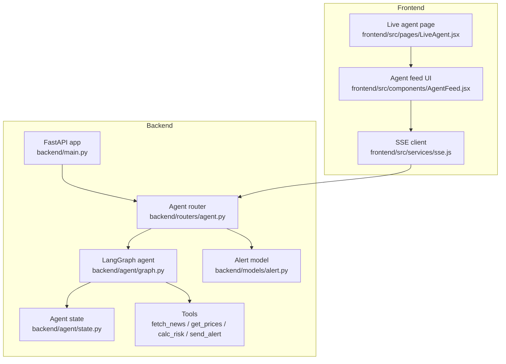
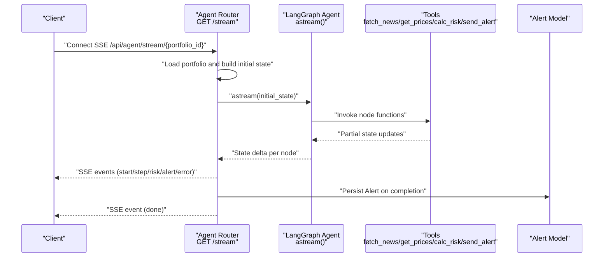
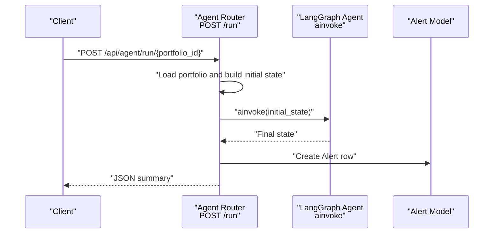
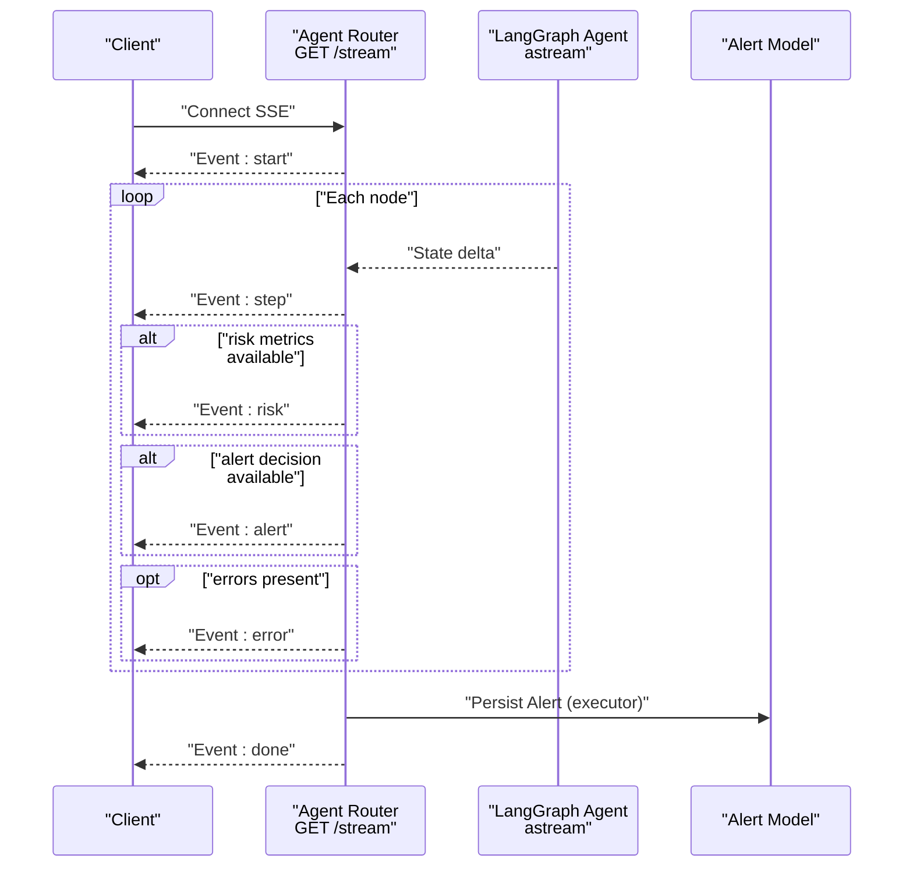
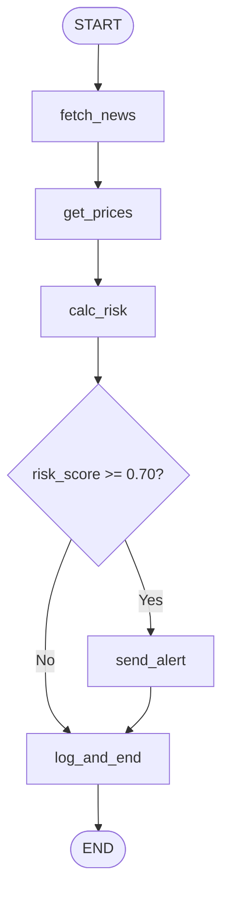
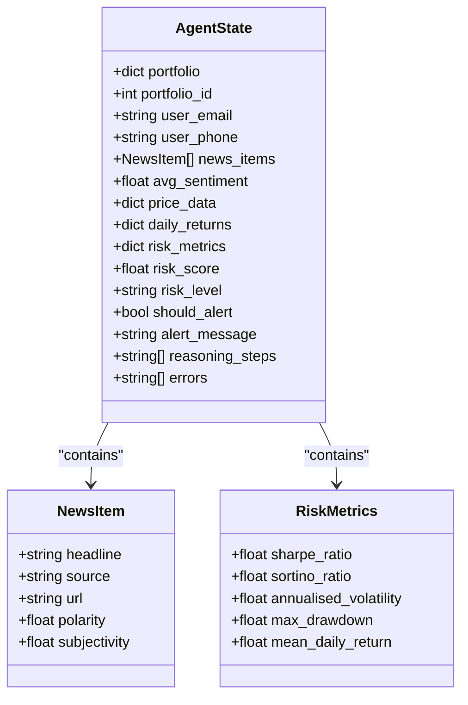
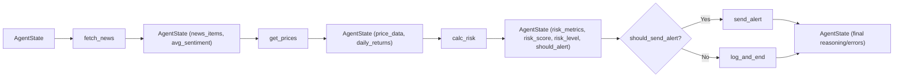
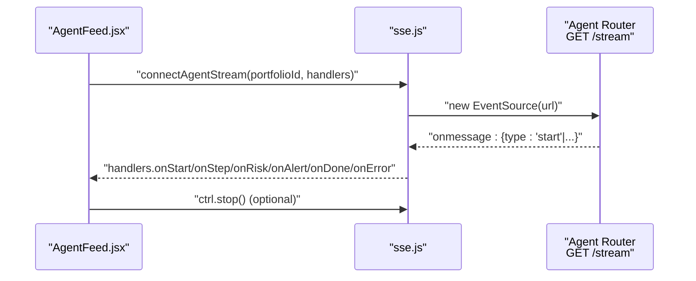
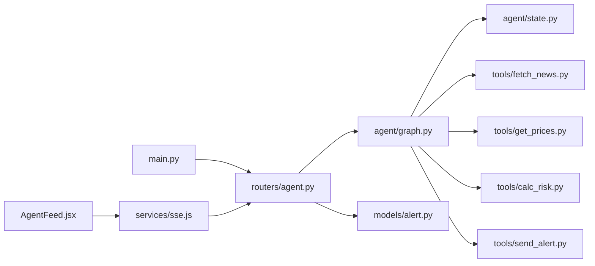

# Agent Workflow API

<cite>
**Referenced Files in This Document**
- [backend/main.py](file://backend/main.py)
- [backend/routers/agent.py](file://backend/routers/agent.py)
- [backend/agent/graph.py](file://backend/agent/graph.py)
- [backend/agent/state.py](file://backend/agent/state.py)
- [backend/agent/tools/fetch_news.py](file://backend/agent/tools/fetch_news.py)
- [backend/agent/tools/get_prices.py](file://backend/agent/tools/get_prices.py)
- [backend/agent/tools/calc_risk.py](file://backend/agent/tools/calc_risk.py)
- [backend/agent/tools/send_alert.py](file://backend/agent/tools/send_alert.py)
- [backend/models/alert.py](file://backend/models/alert.py)
- [frontend/src/services/sse.js](file://frontend/src/services/sse.js)
- [frontend/src/components/AgentFeed.jsx](file://frontend/src/components/AgentFeed.jsx)
- [frontend/src/pages/LiveAgent.jsx](file://frontend/src/pages/LiveAgent.jsx)
</cite>

## Table of Contents
1. [Introduction](#introduction)
2. [Project Structure](#project-structure)
3. [Core Components](#core-components)
4. [Architecture Overview](#architecture-overview)
5. [Detailed Component Analysis](#detailed-component-analysis)
6. [Dependency Analysis](#dependency-analysis)
7. [Performance Considerations](#performance-considerations)
8. [Troubleshooting Guide](#troubleshooting-guide)
9. [Conclusion](#conclusion)
10. [Appendices](#appendices)

## Introduction
This document provides comprehensive API documentation for the agent workflow endpoints that power LangGraph-based portfolio risk analysis. It covers:
- Synchronous execution via POST /api/agent/run/{portfolio_id}
- Real-time Server-Sent Events streaming via GET /api/agent/stream/{portfolio_id}
- The four-node LangGraph processing pipeline and state transitions
- SSE event format, event types, and client-side handling patterns
- Practical examples for initiating runs, processing updates, and handling states
- Agent state structure, tool integration points, and error propagation
- Client implementation guidelines for SSE connections, parsing, and lifecycle management
- Performance considerations, timeouts, and graceful degradation strategies

## Project Structure
The agent workflow spans backend FastAPI endpoints, a LangGraph state machine, typed state definitions, tool integrations, and a React frontend that consumes SSE events.

**Diagram sources**
- [backend/main.py:12-44](file://backend/main.py#L12-L44)
- [backend/routers/agent.py:39-168](file://backend/routers/agent.py#L39-L168)
- [backend/agent/graph.py:162-203](file://backend/agent/graph.py#L162-L203)
- [backend/agent/state.py:28-58](file://backend/agent/state.py#L28-L58)
- [backend/models/alert.py:14-77](file://backend/models/alert.py#L14-L77)
- [frontend/src/services/sse.js:21-62](file://frontend/src/services/sse.js#L21-L62)
- [frontend/src/components/AgentFeed.jsx:28-96](file://frontend/src/components/AgentFeed.jsx#L28-L96)
- [frontend/src/pages/LiveAgent.jsx:15-51](file://frontend/src/pages/LiveAgent.jsx#L15-L51)

**Section sources**
- [backend/main.py:12-44](file://backend/main.py#L12-L44)
- [backend/routers/agent.py:39-168](file://backend/routers/agent.py#L39-L168)
- [backend/agent/graph.py:162-203](file://backend/agent/graph.py#L162-L203)
- [backend/agent/state.py:28-58](file://backend/agent/state.py#L28-L58)
- [backend/models/alert.py:14-77](file://backend/models/alert.py#L14-L77)
- [frontend/src/services/sse.js:21-62](file://frontend/src/services/sse.js#L21-L62)
- [frontend/src/components/AgentFeed.jsx:28-96](file://frontend/src/components/AgentFeed.jsx#L28-L96)
- [frontend/src/pages/LiveAgent.jsx:15-51](file://frontend/src/pages/LiveAgent.jsx#L15-L51)

## Core Components
- Agent endpoints:
  - POST /api/agent/run/{portfolio_id}: synchronous run, returns a JSON summary and persists results to the Alerts table
  - GET /api/agent/stream/{portfolio_id}: SSE stream of reasoning steps, risk metrics, alert decisions, and completion/error events
  - GET /api/agent/status: health check
- LangGraph agent:
  - Four-node pipeline: fetch_news → get_prices → calc_risk → [conditional] → send_alert/log_and_end
  - Typed AgentState flows through nodes; each node returns a partial state update
- Tools:
  - fetch_news: headlines + sentiment
  - get_prices: 1-year price history + daily returns
  - calc_risk: Sharpe/Sortino/volatility/max drawdown + composite risk score
  - send_alert: optional email/SMS dispatch
- Frontend SSE client and UI:
  - EventSource wrapper emits typed events
  - AgentFeed renders live reasoning steps and risk updates

**Section sources**
- [backend/routers/agent.py:39-242](file://backend/routers/agent.py#L39-L242)
- [backend/agent/graph.py:45-140](file://backend/agent/graph.py#L45-L140)
- [backend/agent/state.py:28-58](file://backend/agent/state.py#L28-L58)
- [backend/agent/tools/fetch_news.py:98-164](file://backend/agent/tools/fetch_news.py#L98-L164)
- [backend/agent/tools/get_prices.py:84-139](file://backend/agent/tools/get_prices.py#L84-L139)
- [backend/agent/tools/calc_risk.py:149-255](file://backend/agent/tools/calc_risk.py#L149-L255)
- [backend/agent/tools/send_alert.py:157-231](file://backend/agent/tools/send_alert.py#L157-L231)
- [frontend/src/services/sse.js:21-62](file://frontend/src/services/sse.js#L21-L62)
- [frontend/src/components/AgentFeed.jsx:28-96](file://frontend/src/components/AgentFeed.jsx#L28-L96)

## Architecture Overview
The agent workflow integrates FastAPI endpoints, LangGraph state transitions, and tool invocations. The SSE endpoint streams state deltas produced by LangGraph’s astream method, enabling real-time UI updates.

**Diagram sources**
- [backend/routers/agent.py:39-168](file://backend/routers/agent.py#L39-L168)
- [backend/agent/graph.py:162-199](file://backend/agent/graph.py#L162-L199)
- [backend/models/alert.py:14-77](file://backend/models/alert.py#L14-L77)

**Section sources**
- [backend/routers/agent.py:39-168](file://backend/routers/agent.py#L39-L168)
- [backend/agent/graph.py:162-199](file://backend/agent/graph.py#L162-L199)
- [backend/models/alert.py:14-77](file://backend/models/alert.py#L14-L77)

## Detailed Component Analysis

### Endpoint: POST /api/agent/run/{portfolio_id}
- Purpose: Trigger a synchronous agent run and return a JSON summary
- Behavior:
  - Loads portfolio data from the database
  - Builds initial state using make_initial_state
  - Executes the compiled LangGraph agent via ainvoke
  - Persists results to the Alerts table
  - Returns alert_id, risk_score, risk_level, should_alert, and risk_metrics
- Typical response keys:
  - alert_id: integer
  - risk_score: number
  - risk_level: string ("LOW" | "MEDIUM" | "HIGH")
  - should_alert: boolean
  - risk_metrics: object containing sharpe_ratio, sortino_ratio, annualised_volatility, max_drawdown, mean_daily_return

**Diagram sources**
- [backend/routers/agent.py:186-232](file://backend/routers/agent.py#L186-L232)
- [backend/agent/graph.py:162-199](file://backend/agent/graph.py#L162-L199)
- [backend/models/alert.py:14-77](file://backend/models/alert.py#L14-L77)

**Section sources**
- [backend/routers/agent.py:186-232](file://backend/routers/agent.py#L186-L232)

### Endpoint: GET /api/agent/stream/{portfolio_id}
- Purpose: Real-time SSE stream of agent reasoning and results
- Behavior:
  - Loads portfolio and builds initial state
  - Streams state deltas via astream
  - Emits typed events: start, step, risk, alert, error, done
  - On completion, persists Alert asynchronously and emits done
- SSE event types:
  - start: { type: "start", portfolio: dict, name: string }
  - step: { type: "step", node: string, message: string }
  - risk: { type: "risk", risk_score: number, risk_level: string, metrics: object }
  - alert: { type: "alert", triggered: boolean }
  - error: { type: "error", message: string }
  - done: { type: "done", alert_id: number|null }

**Diagram sources**
- [backend/routers/agent.py:39-168](file://backend/routers/agent.py#L39-L168)
- [backend/agent/graph.py:162-199](file://backend/agent/graph.py#L162-L199)
- [backend/models/alert.py:14-77](file://backend/models/alert.py#L14-L77)

**Section sources**
- [backend/routers/agent.py:39-168](file://backend/routers/agent.py#L39-L168)

### LangGraph State Machine and Four-Node Pipeline
- Nodes:
  - fetch_news: collects headlines, computes avg_sentiment, appends reasoning_steps and errors
  - get_prices: downloads 1-year prices, computes daily_returns
  - calc_risk: computes Sharpe/Sortino/volatility/max drawdown, derives risk_score and risk_level, sets should_alert
  - send_alert: optional email/SMS dispatch based on risk level
  - log_and_end: terminal node logging final summary
- Conditional edge:
  - After calc_risk, routes to send_alert if risk_score >= 0.70, else to log_and_end
- State transitions:
  - Each node returns a partial update merged into AgentState
  - astream yields deltas suitable for SSE

**Diagram sources**
- [backend/agent/graph.py:6-14](file://backend/agent/graph.py#L6-L14)
- [backend/agent/graph.py:146-156](file://backend/agent/graph.py#L146-L156)
- [backend/agent/graph.py:174-197](file://backend/agent/graph.py#L174-L197)

**Section sources**
- [backend/agent/graph.py:45-140](file://backend/agent/graph.py#L45-L140)
- [backend/agent/graph.py:146-156](file://backend/agent/graph.py#L146-L156)
- [backend/agent/graph.py:174-197](file://backend/agent/graph.py#L174-L197)

### Agent State Structure
AgentState is a TypedDict that flows through all nodes. Key fields include:
- Input: portfolio, portfolio_id, user_email, user_phone
- fetch_news outputs: news_items, avg_sentiment
- get_prices outputs: price_data, daily_returns
- calc_risk outputs: risk_metrics, risk_score, risk_level, should_alert, alert_message
- Decision flags: should_alert, alert_message
- RAG context placeholder: rag_context
- Audit trail: reasoning_steps, errors

**Diagram sources**
- [backend/agent/state.py:28-58](file://backend/agent/state.py#L28-L58)

**Section sources**
- [backend/agent/state.py:28-58](file://backend/agent/state.py#L28-L58)

### Tool Integration Points
- fetch_news:
  - Inputs: portfolio
  - Outputs: news_items, avg_sentiment, reasoning_steps, errors
- get_prices:
  - Inputs: portfolio
  - Outputs: price_data, daily_returns, reasoning_steps, errors
- calc_risk:
  - Inputs: portfolio, daily_returns, avg_sentiment
  - Outputs: risk_metrics, risk_score, risk_level, should_alert, reasoning_steps, errors
- send_alert:
  - Inputs: portfolio, risk_score, risk_level, risk_metrics, news_items, alert_message, user_email, user_phone
  - Outputs: reasoning_steps, errors

**Diagram sources**
- [backend/agent/tools/fetch_news.py:98-164](file://backend/agent/tools/fetch_news.py#L98-L164)
- [backend/agent/tools/get_prices.py:84-139](file://backend/agent/tools/get_prices.py#L84-L139)
- [backend/agent/tools/calc_risk.py:149-255](file://backend/agent/tools/calc_risk.py#L149-L255)
- [backend/agent/tools/send_alert.py:157-231](file://backend/agent/tools/send_alert.py#L157-L231)
- [backend/agent/graph.py:146-156](file://backend/agent/graph.py#L146-L156)

**Section sources**
- [backend/agent/tools/fetch_news.py:98-164](file://backend/agent/tools/fetch_news.py#L98-L164)
- [backend/agent/tools/get_prices.py:84-139](file://backend/agent/tools/get_prices.py#L84-L139)
- [backend/agent/tools/calc_risk.py:149-255](file://backend/agent/tools/calc_risk.py#L149-L255)
- [backend/agent/tools/send_alert.py:157-231](file://backend/agent/tools/send_alert.py#L157-L231)
- [backend/agent/graph.py:146-156](file://backend/agent/graph.py#L146-L156)

### SSE Event Format and Client Handling
- Event format: Each event is a JSON object serialized as an SSE data field
- Event types emitted by the backend:
  - start: { type: "start", portfolio: dict, name: string }
  - step: { type: "step", node: string, message: string }
  - risk: { type: "risk", risk_score: number, risk_level: string, metrics: object }
  - alert: { type: "alert", triggered: boolean }
  - error: { type: "error", message: string }
  - done: { type: "done", alert_id: number|null }
- Client-side event handling (frontend):
  - connectAgentStream(url) returns a controller with stop()
  - Handlers: onStart, onStep, onRisk, onAlert, onDone, onError
  - onDone closes the connection; onerror logs a friendly message and closes

**Diagram sources**
- [frontend/src/components/AgentFeed.jsx:41-77](file://frontend/src/components/AgentFeed.jsx#L41-L77)
- [frontend/src/services/sse.js:21-62](file://frontend/src/services/sse.js#L21-L62)
- [backend/routers/agent.py:39-168](file://backend/routers/agent.py#L39-L168)

**Section sources**
- [frontend/src/services/sse.js:21-62](file://frontend/src/services/sse.js#L21-L62)
- [frontend/src/components/AgentFeed.jsx:41-77](file://frontend/src/components/AgentFeed.jsx#L41-L77)
- [backend/routers/agent.py:39-168](file://backend/routers/agent.py#L39-L168)

### Practical Examples
- Initiating a synchronous run:
  - Call POST /api/agent/run/{portfolio_id}
  - Expect JSON with alert_id, risk_score, risk_level, should_alert, risk_metrics
- Streaming agent runs:
  - Connect to GET /api/agent/stream/{portfolio_id} using EventSource
  - Render step messages, risk updates, and alert triggers in real time
  - Close connection on done or user action
- Handling workflow states:
  - Start: initialize UI and counters
  - Step: append reasoning step with node tag
  - Risk: update risk gauge and metrics
  - Alert: show high-risk notification
  - Done: finalize UI and persist alert_id
  - Error: surface user-friendly error message

**Section sources**
- [backend/routers/agent.py:186-232](file://backend/routers/agent.py#L186-L232)
- [backend/routers/agent.py:39-168](file://backend/routers/agent.py#L39-L168)
- [frontend/src/components/AgentFeed.jsx:41-77](file://frontend/src/components/AgentFeed.jsx#L41-L77)
- [frontend/src/pages/LiveAgent.jsx:15-51](file://frontend/src/pages/LiveAgent.jsx#L15-L51)

## Dependency Analysis
- Backend FastAPI app registers the agent router under /api/agent
- Agent router depends on:
  - LangGraph compiled graph (portfolio_agent)
  - Initial state factory (make_initial_state)
  - SQLAlchemy models (Portfolio, Alert)
- LangGraph agent depends on:
  - AgentState TypedDict
  - Tool modules (fetch_news, get_prices, calc_risk, send_alert)
- Frontend depends on:
  - SSE client service for EventSource management
  - AgentFeed component for rendering

**Diagram sources**
- [backend/main.py:39-43](file://backend/main.py#L39-L43)
- [backend/routers/agent.py:24-24](file://backend/routers/agent.py#L24-L24)
- [backend/agent/graph.py:28-32](file://backend/agent/graph.py#L28-L32)
- [backend/agent/state.py:28-58](file://backend/agent/state.py#L28-L58)
- [backend/models/alert.py:14-77](file://backend/models/alert.py#L14-L77)
- [frontend/src/components/AgentFeed.jsx:9-9](file://frontend/src/components/AgentFeed.jsx#L9-L9)
- [frontend/src/services/sse.js:19-23](file://frontend/src/services/sse.js#L19-L23)

**Section sources**
- [backend/main.py:39-43](file://backend/main.py#L39-L43)
- [backend/routers/agent.py:24-24](file://backend/routers/agent.py#L24-L24)
- [backend/agent/graph.py:28-32](file://backend/agent/graph.py#L28-L32)
- [backend/agent/state.py:28-58](file://backend/agent/state.py#L28-L58)
- [backend/models/alert.py:14-77](file://backend/models/alert.py#L14-L77)
- [frontend/src/components/AgentFeed.jsx:9-9](file://frontend/src/components/AgentFeed.jsx#L9-L9)
- [frontend/src/services/sse.js:19-23](file://frontend/src/services/sse.js#L19-L23)

## Performance Considerations
- SSE streaming:
  - Uses asyncio.sleep(0.05) between step emissions for visual pacing; adjust or remove for lower latency
  - Emits deltas only; clients reconstruct state from ordered events
- Database writes:
  - SSE persistence uses run_in_executor to avoid blocking the async loop
  - Sync endpoint performs immediate commit
- Network resilience:
  - Client checks request.is_disconnected to stop streaming early
  - Frontend EventSource handles onerror and closes connection gracefully
- Degradation:
  - Tools fall back to mock data when external APIs are unavailable
  - calc_risk validates inputs and returns defaults on insufficient data

[No sources needed since this section provides general guidance]

## Troubleshooting Guide
- 404 Portfolio not found:
  - Occurs when portfolio_id does not exist in the database
- SSE disconnects unexpectedly:
  - Client disconnected check stops streaming; retry or inspect network
- DB save failures:
  - SSE handler catches exceptions and emits error, then done with alert_id=None
- Tool errors:
  - Tools append errors to state.errors; these appear as SSE error events
- Frontend:
  - onerror handler logs a friendly message and closes the connection

**Section sources**
- [backend/routers/agent.py:58-60](file://backend/routers/agent.py#L58-L60)
- [backend/routers/agent.py:86-89](file://backend/routers/agent.py#L86-L89)
- [backend/routers/agent.py:123-126](file://backend/routers/agent.py#L123-L126)
- [backend/routers/agent.py:155-158](file://backend/routers/agent.py#L155-L158)
- [frontend/src/services/sse.js:54-57](file://frontend/src/services/sse.js#L54-L57)

## Conclusion
The agent workflow provides robust synchronous and asynchronous execution patterns for portfolio risk analysis. The SSE endpoint delivers a seamless, real-time user experience by streaming structured events derived from LangGraph’s state deltas. The modular tool architecture and typed state enable maintainable, testable extensions. The frontend client demonstrates best practices for SSE consumption, including connection lifecycle management and graceful error handling.

[No sources needed since this section summarizes without analyzing specific files]

## Appendices

### API Reference Summary
- POST /api/agent/run/{portfolio_id}
  - Description: Run agent synchronously and return JSON summary
  - Path parameters: portfolio_id (integer)
  - Response: alert_id, risk_score, risk_level, should_alert, risk_metrics
- GET /api/agent/stream/{portfolio_id}
  - Description: Stream agent reasoning and results via SSE
  - Path parameters: portfolio_id (integer)
  - Events: start, step, risk, alert, error, done
- GET /api/agent/status
  - Description: Health check
  - Response: status, agent, version, timestamp

**Section sources**
- [backend/routers/agent.py:39-242](file://backend/routers/agent.py#L39-L242)

### Client Implementation Guidelines (SSE)
- Establish connection:
  - Use EventSource with URL: /api/agent/stream/{portfolio_id}
  - Set base URL from environment variable VITE_API_URL
- Parse events:
  - onmessage parses JSON and routes by type
  - Handlers: onStart, onStep, onRisk, onAlert, onDone, onError
- Lifecycle:
  - Close on onDone
  - onerror logs a friendly message and closes
  - Expose stop() to terminate early

**Section sources**
- [frontend/src/services/sse.js:21-62](file://frontend/src/services/sse.js#L21-L62)
- [frontend/src/components/AgentFeed.jsx:41-77](file://frontend/src/components/AgentFeed.jsx#L41-L77)