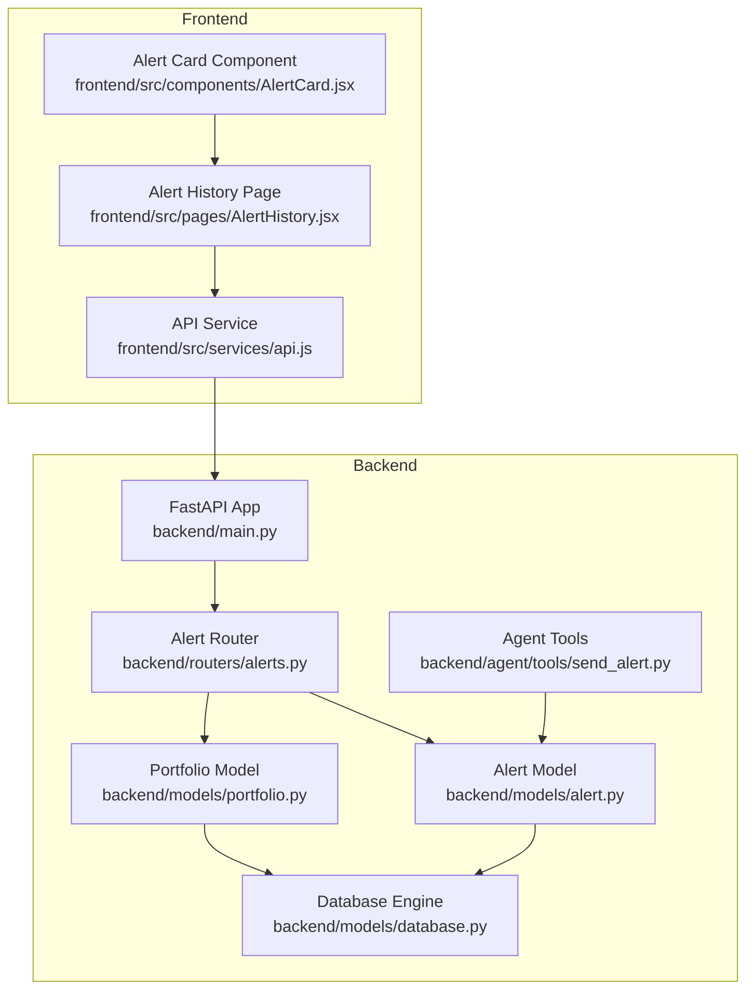
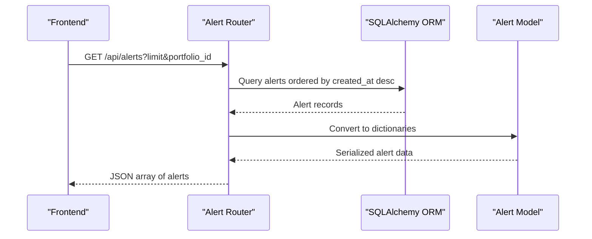
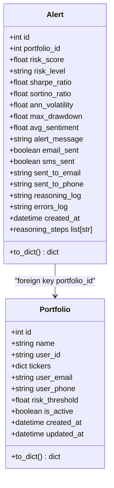
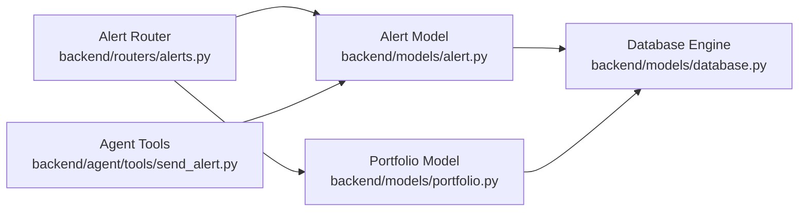

# Alert Management API

<cite>
**Referenced Files in This Document**
- [backend/main.py](file://backend/main.py)
- [backend/routers/alerts.py](file://backend/routers/alerts.py)
- [backend/models/alert.py](file://backend/models/alert.py)
- [backend/models/portfolio.py](file://backend/models/portfolio.py)
- [backend/models/database.py](file://backend/models/database.py)
- [backend/agent/tools/send_alert.py](file://backend/agent/tools/send_alert.py)
- [frontend/src/services/api.js](file://frontend/src/services/api.js)
- [frontend/src/pages/AlertHistory.jsx](file://frontend/src/pages/AlertHistory.jsx)
- [frontend/src/components/AlertCard.jsx](file://frontend/src/components/AlertCard.jsx)
</cite>

## Table of Contents
1. [Introduction](#introduction)
2. [Project Structure](#project-structure)
3. [Core Components](#core-components)
4. [Architecture Overview](#architecture-overview)
5. [Detailed Component Analysis](#detailed-component-analysis)
6. [Dependency Analysis](#dependency-analysis)
7. [Performance Considerations](#performance-considerations)
8. [Troubleshooting Guide](#troubleshooting-guide)
9. [Conclusion](#conclusion)
10. [Appendices](#appendices)

## Introduction
This document provides comprehensive API documentation for the alert management system endpoints. It focuses on retrieving alert history, including filtering, pagination, and sorting capabilities. It explains the alert data model, query parameters, response schemas, and practical examples. It also documents alert persistence, audit trail functionality, historical tracking, performance optimization strategies, indexing, and data retention considerations.

## Project Structure
The alert management system spans the backend FastAPI application and the frontend React interface. The backend exposes REST endpoints under /api/alerts, while the frontend consumes these endpoints to present alert history and analytics.

**Diagram sources**
- [backend/main.py:12-43](file://backend/main.py#L12-L43)
- [backend/routers/alerts.py:19-84](file://backend/routers/alerts.py#L19-L84)
- [backend/models/alert.py:14-77](file://backend/models/alert.py#L14-L77)
- [backend/models/portfolio.py:16-63](file://backend/models/portfolio.py#L16-L63)
- [backend/models/database.py:25-42](file://backend/models/database.py#L25-L42)
- [backend/agent/tools/send_alert.py:157-231](file://backend/agent/tools/send_alert.py#L157-L231)
- [frontend/src/services/api.js:26-32](file://frontend/src/services/api.js#L26-L32)
- [frontend/src/pages/AlertHistory.jsx:12-163](file://frontend/src/pages/AlertHistory.jsx#L12-L163)
- [frontend/src/components/AlertCard.jsx:10-89](file://frontend/src/components/AlertCard.jsx#L10-L89)

**Section sources**
- [backend/main.py:12-43](file://backend/main.py#L12-L43)
- [backend/routers/alerts.py:19-84](file://backend/routers/alerts.py#L19-L84)
- [backend/models/alert.py:14-77](file://backend/models/alert.py#L14-L77)
- [backend/models/portfolio.py:16-63](file://backend/models/portfolio.py#L16-L63)
- [backend/models/database.py:25-42](file://backend/models/database.py#L25-L42)
- [frontend/src/services/api.js:26-32](file://frontend/src/services/api.js#L26-L32)
- [frontend/src/pages/AlertHistory.jsx:12-163](file://frontend/src/pages/AlertHistory.jsx#L12-L163)
- [frontend/src/components/AlertCard.jsx:10-89](file://frontend/src/components/AlertCard.jsx#L10-L89)

## Core Components
- Alert endpoint router: Provides endpoints for listing alerts, fetching details, portfolio-scoped alerts, and summary statistics.
- Alert model: Defines the alert data schema, including risk metrics, delivery flags, reasoning logs, and timestamps.
- Portfolio model: Defines portfolio metadata and identifiers used to associate alerts with portfolios.
- Database engine: Configures SQLAlchemy engine and session management, with support for SQLite and PostgreSQL.
- Agent tools: Persist alerts and maintain reasoning logs when risk thresholds are exceeded.

Key implementation references:
- Endpoint definitions and query logic: [backend/routers/alerts.py:22-84](file://backend/routers/alerts.py#L22-L84)
- Alert schema and serialization: [backend/models/alert.py:14-77](file://backend/models/alert.py#L14-L77)
- Portfolio schema: [backend/models/portfolio.py:16-63](file://backend/models/portfolio.py#L16-L63)
- Database configuration: [backend/models/database.py:25-42](file://backend/models/database.py#L25-L42)
- Alert persistence and reasoning logs: [backend/agent/tools/send_alert.py:157-231](file://backend/agent/tools/send_alert.py#L157-L231)

**Section sources**
- [backend/routers/alerts.py:22-84](file://backend/routers/alerts.py#L22-L84)
- [backend/models/alert.py:14-77](file://backend/models/alert.py#L14-L77)
- [backend/models/portfolio.py:16-63](file://backend/models/portfolio.py#L16-L63)
- [backend/models/database.py:25-42](file://backend/models/database.py#L25-L42)
- [backend/agent/tools/send_alert.py:157-231](file://backend/agent/tools/send_alert.py#L157-L231)

## Architecture Overview
The alert management API follows a layered architecture:
- Presentation layer: FastAPI router exposing endpoints.
- Persistence layer: SQLAlchemy ORM models mapped to relational tables.
- Data access layer: Session-based queries with ordering and limits.
- Audit and reasoning: Agent tools persist reasoning logs and delivery metadata.

**Diagram sources**
- [backend/routers/alerts.py:22-32](file://backend/routers/alerts.py#L22-L32)
- [backend/models/alert.py:57-77](file://backend/models/alert.py#L57-L77)

**Section sources**
- [backend/routers/alerts.py:22-32](file://backend/routers/alerts.py#L22-L32)
- [backend/models/alert.py:57-77](file://backend/models/alert.py#L57-L77)

## Detailed Component Analysis

### Alert Data Model
The Alert model defines the alert record schema and serialization behavior. It includes risk metrics, delivery flags, and reasoning logs.

**Diagram sources**
- [backend/models/alert.py:14-77](file://backend/models/alert.py#L14-L77)
- [backend/models/portfolio.py:16-63](file://backend/models/portfolio.py#L16-L63)

Fields overview:
- Identification: id, portfolio_id, created_at
- Risk snapshot: risk_score, risk_level, sharpe_ratio, sortino_ratio, ann_volatility, max_drawdown, avg_sentiment
- Delivery: alert_message, email_sent, sms_sent, sent_to_email, sent_to_phone
- Audit trail: reasoning_log (JSON list of strings), errors_log (JSON list)
- Timestamp: created_at (UTC)

Serialization behavior:
- to_dict() returns a normalized dictionary suitable for API responses.
- reasoning_steps property converts reasoning_log JSON to a list of strings.

**Section sources**
- [backend/models/alert.py:14-77](file://backend/models/alert.py#L14-L77)
- [backend/models/portfolio.py:16-63](file://backend/models/portfolio.py#L16-L63)

### Alert Endpoints
Available endpoints:
- GET /api/alerts: List all alerts, latest first, with optional portfolio filter and limit.
- GET /api/alerts/detail/{alert_id}: Retrieve a single alert with full reasoning log.
- GET /api/alerts/portfolio/{portfolio_id}: Alerts for a specific portfolio, latest first, with limit.
- GET /api/alerts/stats: Summary statistics across all alerts.

Endpoint details:
- GET /api/alerts
  - Query parameters:
    - limit: integer, default 50
    - portfolio_id: optional integer
  - Sorting: created_at descending
  - Pagination: limit applied
  - Filtering: portfolio_id optional filter

- GET /api/alerts/detail/{alert_id}
  - Path parameter: alert_id (integer)
  - Returns full alert record including reasoning_log

- GET /api/alerts/portfolio/{portfolio_id}
  - Path parameter: portfolio_id (integer)
  - Query parameters:
    - limit: integer, default 20
  - Sorting: created_at descending
  - Pagination: limit applied

- GET /api/alerts/stats
  - Returns counts for total runs, HIGH/MEDIUM/LOW alerts, emails sent, SMS sent, average risk score, and latest run timestamp.

Response schema:
- Array of alert objects with fields from Alert.to_dict()

**Section sources**
- [backend/routers/alerts.py:22-84](file://backend/routers/alerts.py#L22-L84)
- [backend/models/alert.py:57-77](file://backend/models/alert.py#L57-L77)

### Frontend Integration
The frontend integrates with the alert endpoints to display history and analytics:
- AlertHistory page loads alerts and stats concurrently and applies client-side filtering by risk level.
- AlertCard renders compact alert summaries with risk badges, metrics, and delivery indicators.
- API service maps endpoint URLs to HTTP requests.

References:
- AlertHistory page: [frontend/src/pages/AlertHistory.jsx:19-32](file://frontend/src/pages/AlertHistory.jsx#L19-L32)
- AlertCard component: [frontend/src/components/AlertCard.jsx:10-89](file://frontend/src/components/AlertCard.jsx#L10-L89)
- API service: [frontend/src/services/api.js:26-32](file://frontend/src/services/api.js#L26-L32)

**Section sources**
- [frontend/src/pages/AlertHistory.jsx:19-32](file://frontend/src/pages/AlertHistory.jsx#L19-L32)
- [frontend/src/components/AlertCard.jsx:10-89](file://frontend/src/components/AlertCard.jsx#L10-L89)
- [frontend/src/services/api.js:26-32](file://frontend/src/services/api.js#L26-L32)

### Alert Persistence and Audit Trail
Alerts are persisted by the agent tools when risk thresholds are exceeded. The persistence includes:
- Risk metrics snapshot
- Delivery flags and contact information
- Full reasoning_log (JSON list of strings)
- Errors encountered during run
- Timestamps

References:
- Agent tool dispatch: [backend/agent/tools/send_alert.py:157-231](file://backend/agent/tools/send_alert.py#L157-L231)
- Alert model serialization: [backend/models/alert.py:57-77](file://backend/models/alert.py#L57-L77)

**Section sources**
- [backend/agent/tools/send_alert.py:157-231](file://backend/agent/tools/send_alert.py#L157-L231)
- [backend/models/alert.py:57-77](file://backend/models/alert.py#L57-L77)

## Dependency Analysis
The alert system depends on:
- FastAPI router for endpoint exposure
- SQLAlchemy ORM for data persistence
- Session factory for database transactions
- Agent tools for alert creation and reasoning log capture

**Diagram sources**
- [backend/routers/alerts.py:19-84](file://backend/routers/alerts.py#L19-L84)
- [backend/models/alert.py:14-77](file://backend/models/alert.py#L14-L77)
- [backend/models/portfolio.py:16-63](file://backend/models/portfolio.py#L16-L63)
- [backend/models/database.py:25-42](file://backend/models/database.py#L25-L42)
- [backend/agent/tools/send_alert.py:157-231](file://backend/agent/tools/send_alert.py#L157-L231)

**Section sources**
- [backend/routers/alerts.py:19-84](file://backend/routers/alerts.py#L19-L84)
- [backend/models/alert.py:14-77](file://backend/models/alert.py#L14-L77)
- [backend/models/portfolio.py:16-63](file://backend/models/portfolio.py#L16-L63)
- [backend/models/database.py:25-42](file://backend/models/database.py#L25-L42)
- [backend/agent/tools/send_alert.py:157-231](file://backend/agent/tools/send_alert.py#L157-L231)

## Performance Considerations
Current implementation characteristics:
- Sorting: Alerts are ordered by created_at descending.
- Pagination: Limit applied in queries.
- Filtering: Portfolio filter supported in list and portfolio endpoints.
- Indexing: portfolio_id and created_at are indexed in the Alert model.

Optimization opportunities:
- Composite indexes: Consider a composite index on (portfolio_id, created_at) to optimize portfolio-scoped queries.
- Partitioning: For large datasets, partition alerts by time to improve query performance.
- Materialized views: Pre-aggregate stats for frequent access.
- Caching: Cache frequently accessed alert lists with short TTL.
- Query tuning: Use EXPLAIN/ANALYZE to identify slow queries and refine filters.

Indexing strategies:
- Primary key index on id (automatic).
- Index on portfolio_id for portfolio-scoped queries.
- Index on created_at for chronological sorting and range queries.

Data retention:
- Implement a retention policy to archive or purge old alerts based on compliance and storage costs.
- Provide a dedicated endpoint to manage retention settings.

[No sources needed since this section provides general guidance]

## Troubleshooting Guide
Common issues and resolutions:
- Missing reasoning logs: Verify reasoning_log JSON is valid; the model handles decoding errors gracefully.
- Empty alert lists: Confirm portfolio_id exists and has associated alerts; adjust limit if necessary.
- Database connectivity: Ensure DATABASE_URL is set correctly; SQLite defaults are used if unset.
- CORS issues: Confirm ALLOWED_ORIGINS configuration allows frontend origin.

References:
- Alert model reasoning steps: [backend/models/alert.py:46-56](file://backend/models/alert.py#L46-L56)
- Database configuration: [backend/models/database.py:15-21](file://backend/models/database.py#L15-L21)
- Main app CORS and router inclusion: [backend/main.py:18-43](file://backend/main.py#L18-L43)

**Section sources**
- [backend/models/alert.py:46-56](file://backend/models/alert.py#L46-L56)
- [backend/models/database.py:15-21](file://backend/models/database.py#L15-L21)
- [backend/main.py:18-43](file://backend/main.py#L18-L43)

## Conclusion
The alert management API provides robust mechanisms to retrieve, filter, paginate, and analyze alert history. The Alert model captures comprehensive risk metrics and audit trails, while the router exposes efficient endpoints for common use cases. With proper indexing, caching, and retention policies, the system scales effectively for large datasets and supports advanced analytics and reporting scenarios.

[No sources needed since this section summarizes without analyzing specific files]

## Appendices

### API Reference: GET /api/alerts
- Purpose: Retrieve alert history with filtering, pagination, and sorting.
- Query parameters:
  - limit: integer, default 50
  - portfolio_id: optional integer
- Sorting: created_at descending
- Response: Array of alert objects (see Alert Data Model)

Practical examples:
- Retrieve recent alerts: GET /api/alerts?limit=50
- Filter by portfolio: GET /api/alerts?limit=50&portfolio_id=123
- Combine filters: GET /api/alerts?limit=25&portfolio_id=456

**Section sources**
- [backend/routers/alerts.py:22-32](file://backend/routers/alerts.py#L22-L32)

### API Reference: GET /api/alerts/detail/{alert_id}
- Purpose: Retrieve a single alert with full reasoning log.
- Path parameters:
  - alert_id: integer
- Response: Single alert object (see Alert Data Model)

**Section sources**
- [backend/routers/alerts.py:35-40](file://backend/routers/alerts.py#L35-L40)

### API Reference: GET /api/alerts/portfolio/{portfolio_id}
- Purpose: Retrieve alerts for a specific portfolio.
- Path parameters:
  - portfolio_id: integer
- Query parameters:
  - limit: integer, default 20
- Sorting: created_at descending
- Response: Array of alert objects (see Alert Data Model)

**Section sources**
- [backend/routers/alerts.py:43-56](file://backend/routers/alerts.py#L43-L56)

### API Reference: GET /api/alerts/stats
- Purpose: Retrieve summary statistics across all alerts.
- Response fields:
  - total_runs: integer
  - high_alerts: integer
  - medium_alerts: integer
  - low_alerts: integer
  - emails_sent: integer
  - sms_sent: integer
  - avg_risk_score: float
  - latest_run: ISO timestamp string

**Section sources**
- [backend/routers/alerts.py:59-83](file://backend/routers/alerts.py#L59-L83)

### Alert Data Model Fields
- Identification: id, portfolio_id, created_at
- Risk snapshot: risk_score, risk_level, sharpe_ratio, sortino_ratio, ann_volatility, max_drawdown, avg_sentiment
- Delivery: alert_message, email_sent, sms_sent, sent_to_email, sent_to_phone
- Audit trail: reasoning_log (JSON list), errors_log (JSON list)
- Timestamp: created_at (UTC)

Serialization behavior:
- to_dict(): Returns a normalized dictionary for API responses.
- reasoning_steps: Property that parses reasoning_log JSON to a list of strings.

**Section sources**
- [backend/models/alert.py:14-77](file://backend/models/alert.py#L14-L77)

### Frontend Usage Examples
- Load alerts and stats: [frontend/src/pages/AlertHistory.jsx:19-26](file://frontend/src/pages/AlertHistory.jsx#L19-L26)
- API calls: [frontend/src/services/api.js:26-32](file://frontend/src/services/api.js#L26-L32)
- Rendering: [frontend/src/components/AlertCard.jsx:10-89](file://frontend/src/components/AlertCard.jsx#L10-L89)

**Section sources**
- [frontend/src/pages/AlertHistory.jsx:19-26](file://frontend/src/pages/AlertHistory.jsx#L19-L26)
- [frontend/src/services/api.js:26-32](file://frontend/src/services/api.js#L26-L32)
- [frontend/src/components/AlertCard.jsx:10-89](file://frontend/src/components/AlertCard.jsx#L10-L89)