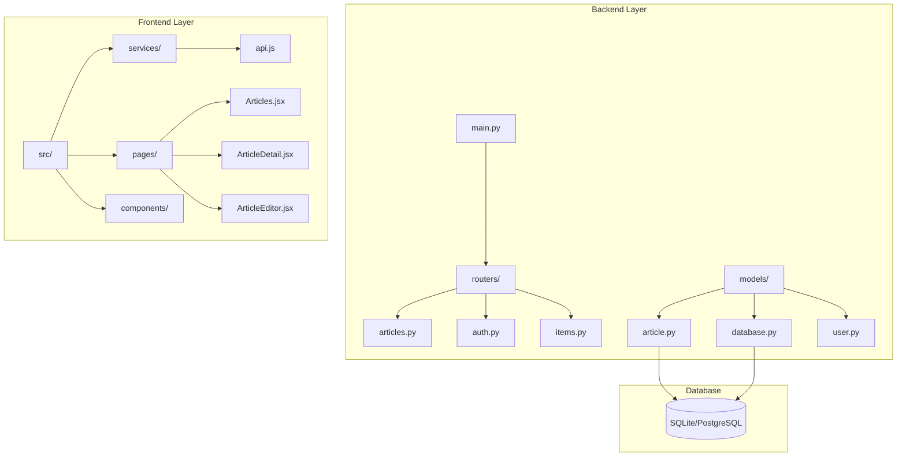
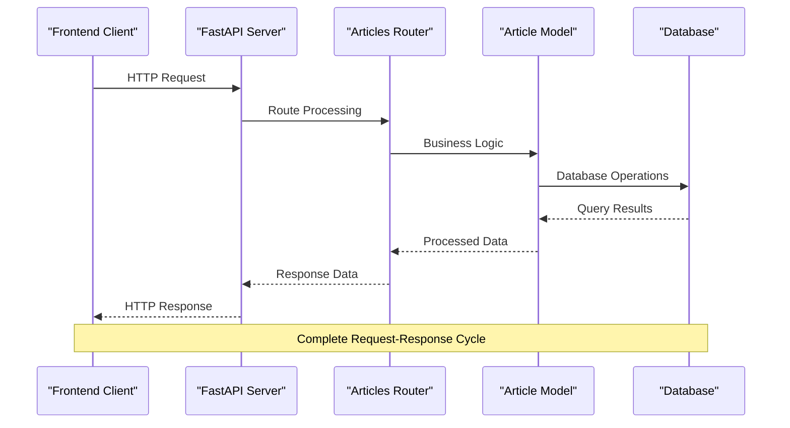
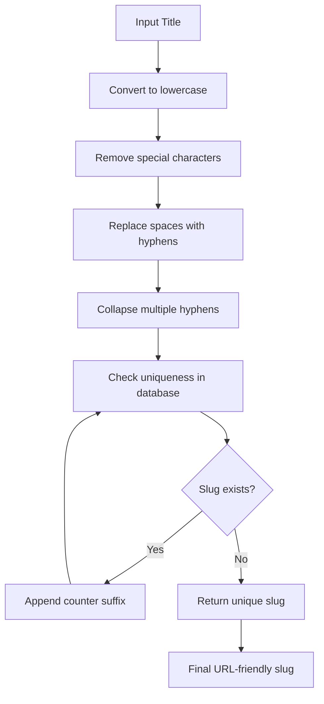
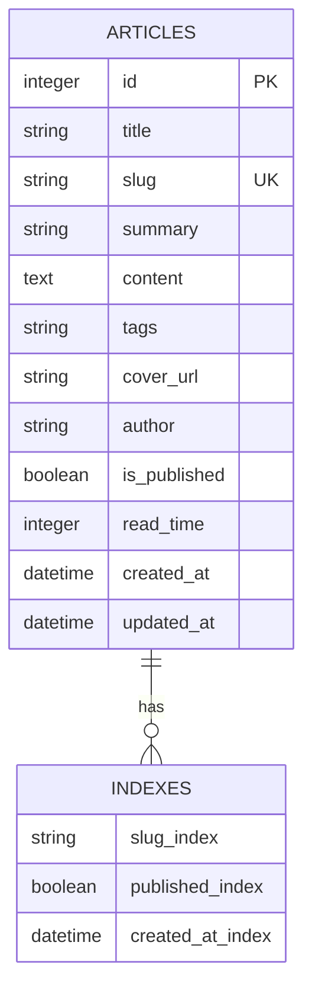

# Article Management API

<cite>
**Referenced Files in This Document**
- [backend/main.py](file://backend/main.py)
- [backend/routers/articles.py](file://backend/routers/articles.py)
- [backend/models/article.py](file://backend/models/article.py)
- [backend/models/database.py](file://backend/models/database.py)
- [frontend/src/services/api.js](file://frontend/src/services/api.js)
- [frontend/src/pages/Articles.jsx](file://frontend/src/pages/Articles.jsx)
- [frontend/src/pages/ArticleDetail.jsx](file://frontend/src/pages/ArticleDetail.jsx)
- [frontend/src/pages/ArticleEditor.jsx](file://frontend/src/pages/ArticleEditor.jsx)
- [README.md](file://README.md)
</cite>

## Table of Contents
1. [Introduction](#introduction)
2. [Project Structure](#project-structure)
3. [Core Components](#core-components)
4. [Architecture Overview](#architecture-overview)
5. [Detailed Component Analysis](#detailed-component-analysis)
6. [API Reference](#api-reference)
7. [Frontend Integration](#frontend-integration)
8. [Database Schema](#database-schema)
9. [Performance Considerations](#performance-considerations)
10. [Troubleshooting Guide](#troubleshooting-guide)
11. [Conclusion](#conclusion)

## Introduction

The Article Management API is a comprehensive content management system built with FastAPI and React, designed to handle technical articles and blog posts. This system provides full CRUD operations for articles, automatic slug generation, content filtering, and seamless integration with a React-based frontend. The API supports both published articles for public consumption and draft articles for internal editing.

The platform emphasizes technical content with Markdown support, automated reading time calculation, tag-based categorization, and responsive design for optimal user experience across devices.

## Project Structure

The Article Management system follows a clean architecture pattern with clear separation between backend and frontend components:



**Diagram sources**
- [backend/main.py:1-61](file://backend/main.py#L1-L61)
- [backend/routers/articles.py:1-185](file://backend/routers/articles.py#L1-L185)
- [backend/models/article.py:1-63](file://backend/models/article.py#L1-L63)

**Section sources**
- [backend/main.py:1-61](file://backend/main.py#L1-L61)
- [README.md:1-129](file://README.md#L1-L129)

## Core Components

### Backend Application

The FastAPI application serves as the central hub for all article management operations. It includes comprehensive middleware configuration, database initialization, and router registration.

Key features:
- **CORS Configuration**: Flexible cross-origin resource sharing for development and production environments
- **Database Initialization**: Automatic table creation on application startup
- **Router Integration**: Modular routing system for different API endpoints
- **Environment Configuration**: Support for both SQLite (development) and PostgreSQL (production)

### Article Model

The Article model defines the data structure and business logic for article management:

**Core Attributes:**
- **Identification**: Auto-incrementing ID and URL-friendly slug
- **Content**: Title, summary, full Markdown content, and cover image URL
- **Metadata**: Author information, publication status, and timestamps
- **Analytics**: Automated reading time calculation based on word count
- **Organization**: Tag system for content categorization

**Section sources**
- [backend/models/article.py:15-63](file://backend/models/article.py#L15-L63)
- [backend/models/database.py:1-42](file://backend/models/database.py#L1-L42)

## Architecture Overview

The Article Management API follows a layered architecture pattern with clear separation of concerns:



**Diagram sources**
- [backend/main.py:39-45](file://backend/main.py#L39-L45)
- [backend/routers/articles.py:78-185](file://backend/routers/articles.py#L78-L185)

The architecture ensures scalability, maintainability, and clear separation between presentation, business logic, and data persistence layers.

## Detailed Component Analysis

### Articles Router Implementation

The articles router provides comprehensive CRUD operations with sophisticated filtering and validation mechanisms:

#### Endpoint Structure

| Method | Path | Description | Authentication |
|--------|------|-------------|----------------|
| GET | `/api/articles` | List articles with filtering options | None |
| GET | `/api/articles/{slug}` | Retrieve single article by slug | None |
| POST | `/api/articles` | Create new article | Required |
| PUT | `/api/articles/{id}` | Update existing article | Required |
| DELETE | `/api/articles/{id}` | Delete article permanently | Required |
| POST | `/api/articles/{id}/publish` | Toggle publish status | Required |

#### Slug Generation System

The API implements an intelligent slug generation system that ensures URL-friendly and unique identifiers:



**Diagram sources**
- [backend/routers/articles.py:53-74](file://backend/routers/articles.py#L53-L74)

#### Validation and Sanitization

The API implements comprehensive input validation through Pydantic models:

**Article Creation Validation:**
- Title length: 1-300 characters
- Content minimum length: 1 character
- Summary maximum length: 500 characters
- Tags: Comma-separated string
- Author: Default value with override capability

**Section sources**
- [backend/routers/articles.py:31-49](file://backend/routers/articles.py#L31-L49)
- [backend/routers/articles.py:78-185](file://backend/routers/articles.py#L78-L185)

### Database Model Design

The SQLAlchemy ORM model provides robust data persistence with automatic timestamp management and relationship definitions.

#### Model Properties

| Property | Type | Constraints | Description |
|----------|------|-------------|-------------|
| `id` | Integer | Primary Key, Auto-increment | Unique identifier |
| `title` | String(300) | Not Null | Article title |
| `slug` | String(320) | Unique, Not Null | URL-friendly identifier |
| `summary` | String(500) | Nullable | Brief article description |
| `content` | Text | Not Null, Default empty | Full Markdown content |
| `tags` | String(500) | Nullable | Comma-separated tag list |
| `cover_url` | String(500) | Nullable | Featured image URL |
| `author` | String(120) | Not Null, Default "Ishwar Ambare" | Content creator |
| `is_published` | Boolean | Not Null, Default False | Publication status |
| `read_time` | Integer | Nullable | Calculated reading time |
| `created_at` | DateTime | Default current UTC | Creation timestamp |
| `updated_at` | DateTime | Default current UTC, On update | Last modification timestamp |

#### Helper Methods

The model includes several utility methods for enhanced functionality:

**Tag Processing:** Converts comma-separated tags to structured arrays
**Read Time Calculation:** Estimates reading duration based on word count (200 words/minute)
**Data Serialization:** Converts model instances to dictionary format with optional content inclusion

**Section sources**
- [backend/models/article.py:15-63](file://backend/models/article.py#L15-L63)
- [backend/models/database.py:1-42](file://backend/models/database.py#L1-L42)

### Frontend Integration Components

The React frontend provides a comprehensive user interface for article management with real-time updates and seamless navigation.

#### Articles Listing Page

The main articles page offers advanced filtering capabilities:

**Filtering Features:**
- **Tag-based Filtering:** Dynamic tag selection with visual indicators
- **Search Functionality:** Real-time search across titles, summaries, and tags
- **Draft Visibility Toggle:** Switch between published and draft articles
- **Responsive Grid Layout:** Optimized display for all screen sizes

**User Interface Elements:**
- Article cards with cover images and metadata
- Interactive tag badges
- Loading states and empty state handling
- Toast notifications for user feedback

#### Article Detail View

The detail page provides comprehensive article rendering:

**Display Features:**
- **Markdown Rendering:** Full support for Markdown syntax with GitHub Flavored Markdown
- **Reading Analytics:** Display of estimated reading time and publication metadata
- **Admin Controls:** Edit, publish/unpublish, and delete functionality
- **Responsive Design:** Optimized layout for mobile and desktop viewing

**Section sources**
- [frontend/src/pages/Articles.jsx:1-198](file://frontend/src/pages/Articles.jsx#L1-L198)
- [frontend/src/pages/ArticleDetail.jsx:1-184](file://frontend/src/pages/ArticleDetail.jsx#L1-L184)
- [frontend/src/pages/ArticleEditor.jsx:1-317](file://frontend/src/pages/ArticleEditor.jsx#L1-L317)

## API Reference

### Base URL Configuration

The API supports flexible deployment configurations:

**Development Environment:**
- Localhost: `http://localhost:8000`
- Frontend proxy: `http://localhost:5173` → Backend

**Production Environment:**
- Custom domain: `https://ishwarambare.online`
- Subdomain: `https://www.ishwarambare.online`

### Authentication Requirements

All article management endpoints require proper authentication:

- **Standard Articles:** No authentication required for reading operations
- **Management Operations:** Authentication required for create, update, delete, and publish toggling
- **Token Format:** JWT tokens via Authorization header
- **Scope Requirements:** Appropriate user roles for administrative actions

### Error Handling

The API implements comprehensive error handling:

**Common HTTP Status Codes:**
- `200 OK`: Successful GET requests and updates
- `201 Created`: Successful article creation
- `204 No Content`: Successful deletion operations
- `400 Bad Request`: Validation errors and malformed requests
- `401 Unauthorized`: Authentication failures
- `404 Not Found`: Non-existent articles or resources
- `409 Conflict`: Slug uniqueness conflicts
- `500 Internal Server Error`: Unexpected server failures

**Error Response Format:**
```json
{
  "detail": "Error message describing the issue"
}
```

**Section sources**
- [backend/routers/articles.py:78-185](file://backend/routers/articles.py#L78-L185)
- [backend/main.py:13-31](file://backend/main.py#L13-L31)

## Frontend Integration

### API Service Layer

The frontend implements a centralized API service for all article operations:

**Service Methods:**
- `articlesApi.list(params)`: Fetch articles with filtering options
- `articlesApi.get(slug)`: Retrieve single article by slug
- `articlesApi.create(data)`: Create new article
- `articlesApi.update(id, data)`: Update existing article
- `articlesApi.remove(id)`: Delete article permanently
- `articlesApi.publish(id)`: Toggle publish status

**Integration Patterns:**
- **Axios Configuration:** Centralized HTTP client with base URL and timeout settings
- **Error Handling:** Consistent error propagation and user notification
- **Loading States:** Progress indication during API operations
- **Type Safety:** TypeScript interfaces for compile-time validation

### Component Architecture

**Articles Page:**
- **State Management:** React hooks for data fetching and filtering
- **Performance Optimization:** Memoization for computed values and filtered lists
- **User Experience:** Loading skeletons, empty states, and interactive elements

**Article Editor:**
- **Real-time Preview:** Live Markdown rendering with ReactMarkdown
- **Toolbar Integration:** Rich text editing capabilities with keyboard shortcuts
- **Validation Feedback:** Immediate validation and error messaging
- **Word Count Analytics:** Real-time word count and reading time estimation

**Article Detail:**
- **Navigation Integration:** Seamless routing between views
- **Admin Functionality:** Integrated management controls
- **Social Sharing:** Metadata optimization for social media

**Section sources**
- [frontend/src/services/api.js:34-42](file://frontend/src/services/api.js#L34-L42)
- [frontend/src/pages/Articles.jsx:19-31](file://frontend/src/pages/Articles.jsx#L19-L31)
- [frontend/src/pages/ArticleEditor.jsx:123-153](file://frontend/src/pages/ArticleEditor.jsx#L123-L153)

## Database Schema

The database schema is designed for optimal performance and scalability:



**Diagram sources**
- [backend/models/article.py:18-30](file://backend/models/article.py#L18-L30)

### Database Configuration

**Connection Options:**
- **SQLite (Development):** Zero-configuration local database
- **PostgreSQL (Production):** Scalable cloud database with connection pooling
- **Thread Safety:** Multi-threaded configuration for development environments

**Connection Parameters:**
- **SQLite:** `check_same_thread=False` for FastAPI compatibility
- **PostgreSQL:** Standard connection string with SSL support
- **Timeout Settings:** Configurable connection and query timeouts

**Section sources**
- [backend/models/database.py:15-42](file://backend/models/database.py#L15-L42)

## Performance Considerations

### Database Optimization

**Indexing Strategy:**
- Primary key indexing on auto-incrementing ID
- Unique indexing on slug field for fast lookups
- Composite indexing for frequently queried combinations
- Full-text search capabilities for content filtering

**Query Optimization:**
- Lazy loading of content fields in list views
- Efficient pagination for large article collections
- Connection pooling for concurrent database operations
- Query result caching for frequently accessed data

### API Performance

**Response Optimization:**
- Selective field loading to reduce payload size
- Efficient slug-based lookups for single article retrieval
- Batch operations for bulk article management
- Compression for large content responses

**Caching Strategy:**
- Browser-side caching for static assets
- CDN integration for image delivery
- API response caching for frequently accessed endpoints
- Database query result caching for hot paths

### Frontend Performance

**Rendering Optimization:**
- Virtual scrolling for large article lists
- Lazy loading for images and content
- Code splitting for route-based loading
- Service worker integration for offline functionality

**Network Optimization:**
- Request deduplication to prevent redundant calls
- Efficient form serialization for article submissions
- Debounced search for real-time filtering
- Progressive loading for complex components

## Troubleshooting Guide

### Common Issues and Solutions

**Database Connection Problems:**
- **Issue:** SQLite database locked errors
- **Solution:** Ensure proper session management and avoid long-running transactions
- **Prevention:** Implement connection retry logic and proper error handling

**Slug Generation Conflicts:**
- **Issue:** Duplicate slug generation causing conflicts
- **Solution:** Verify uniqueness checking and counter increment logic
- **Prevention:** Implement slug validation before database insertion

**Frontend Navigation Issues:**
- **Issue:** Articles not loading after creation
- **Solution:** Clear browser cache and verify API endpoint connectivity
- **Prevention:** Implement proper state synchronization after CRUD operations

**Authentication Failures:**
- **Issue:** Management operations failing with 401 errors
- **Solution:** Verify JWT token validity and refresh expired tokens
- **Prevention:** Implement automatic token refresh and error boundary handling

### Debugging Tools

**Backend Debugging:**
- **Logging Configuration:** Structured logging for request/response tracing
- **Database Query Logging:** SQL query inspection for performance analysis
- **Error Tracking:** Comprehensive error reporting with stack traces
- **Health Checks:** Endpoint monitoring for system status verification

**Frontend Debugging:**
- **Network Inspection:** Browser developer tools for API call analysis
- **State Management:** React DevTools for component state debugging
- **Performance Profiling:** React profiling tools for rendering optimization
- **Console Logging:** Strategic console output for runtime debugging

**Section sources**
- [backend/routers/articles.py:98-101](file://backend/routers/articles.py#L98-L101)
- [frontend/src/pages/ArticleDetail.jsx:21-35](file://frontend/src/pages/ArticleDetail.jsx#L21-L35)

## Conclusion

The Article Management API provides a robust, scalable solution for technical content management with comprehensive features for both authors and readers. The system's modular architecture, comprehensive validation, and seamless frontend integration create an optimal user experience for content creation, management, and consumption.

Key strengths include:
- **Developer-Friendly Architecture:** Clean separation of concerns with clear API boundaries
- **User Experience Focus:** Intuitive interfaces with real-time feedback and responsive design
- **Scalability Planning:** Database optimization and performance considerations for growth
- **Maintenance Excellence:** Comprehensive error handling and debugging capabilities

The platform successfully balances functionality with simplicity, providing powerful content management capabilities while maintaining ease of use for both technical and non-technical users. The integration of modern web technologies ensures future extensibility and maintainability.