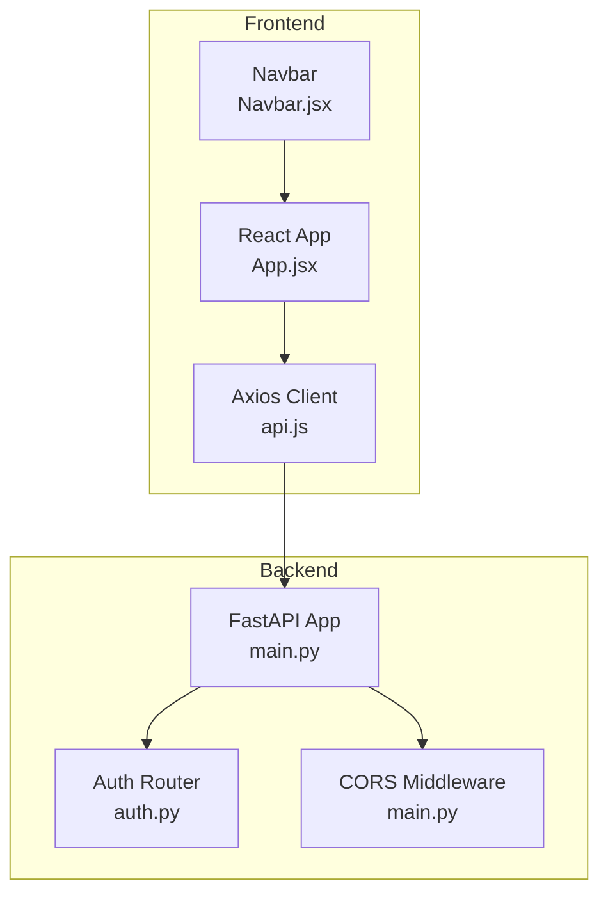
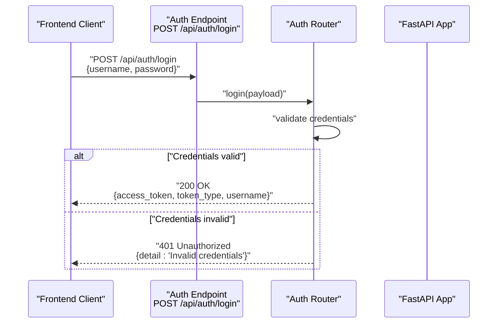
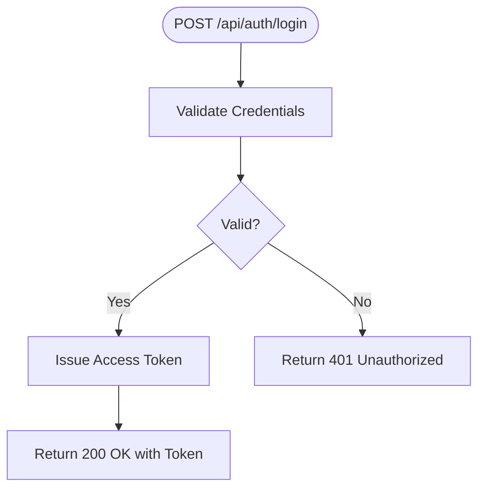
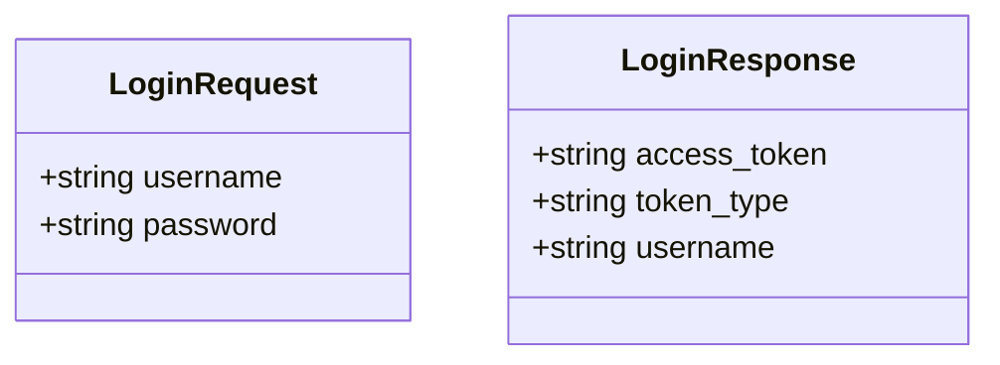
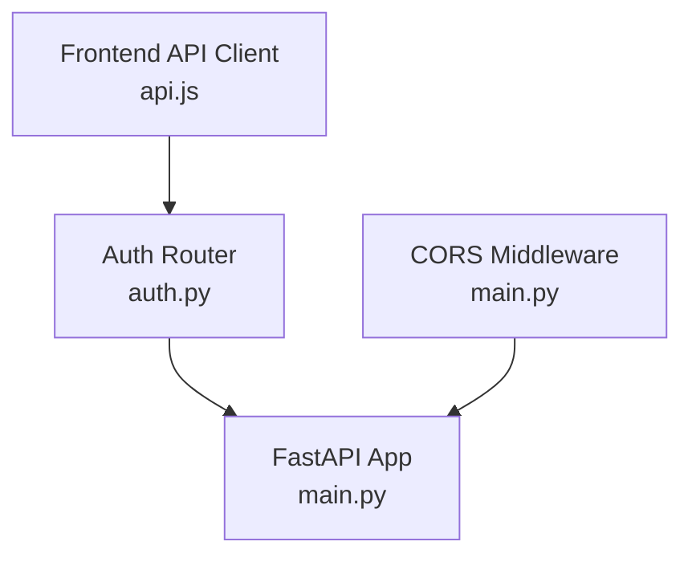

# Authentication API

<cite>
**Referenced Files in This Document**
- [auth.py](file://backend/routers/auth.py)
- [main.py](file://backend/main.py)
- [README.md](file://README.md)
- [api.js](file://frontend/src/services/api.js)
- [App.jsx](file://frontend/src/App.jsx)
- [Navbar.jsx](file://frontend/src/components/Navbar.jsx)
</cite>

## Table of Contents
1. [Introduction](#introduction)
2. [Project Structure](#project-structure)
3. [Core Components](#core-components)
4. [Architecture Overview](#architecture-overview)
5. [Detailed Component Analysis](#detailed-component-analysis)
6. [Dependency Analysis](#dependency-analysis)
7. [Performance Considerations](#performance-considerations)
8. [Troubleshooting Guide](#troubleshooting-guide)
9. [Conclusion](#conclusion)

## Introduction
This document provides comprehensive API documentation for the authentication system endpoints. It focuses on the login endpoint for user authentication, token generation, and session management. It explains the authentication flow, including credential validation, JWT token creation, and security headers. It documents request/response schemas for authentication requests, including username/password fields and response tokens. It includes examples of successful authentication responses with access tokens and error responses for invalid credentials. It also covers token expiration, refresh mechanisms, and logout procedures. CORS configuration for cross-origin authentication requests and security considerations for token transmission are addressed. Client implementation examples for handling authentication state, token storage, and automatic token renewal are included, along with common authentication errors, rate limiting for failed attempts, and security best practices for API consumption.

## Project Structure
The authentication system is implemented in the backend using FastAPI and exposed under the /api/auth route prefix. The frontend uses Axios to communicate with the backend API.



**Diagram sources**
- [main.py:12-43](file://backend/main.py#L12-L43)
- [auth.py:1-39](file://backend/routers/auth.py#L1-L39)
- [api.js:1-35](file://frontend/src/services/api.js#L1-L35)
- [App.jsx:1-21](file://frontend/src/App.jsx#L1-L21)
- [Navbar.jsx:1-51](file://frontend/src/components/Navbar.jsx#L1-L51)

**Section sources**
- [main.py:12-43](file://backend/main.py#L12-L43)
- [auth.py:1-39](file://backend/routers/auth.py#L1-L39)
- [README.md:111-123](file://README.md#L111-L123)

## Core Components
- Authentication router with login and user info endpoints
- CORS middleware configuration for cross-origin requests
- Frontend Axios client configured with base URL and headers

Key implementation details:
- Login endpoint validates credentials and returns a demo access token
- User info endpoint returns current authenticated user stub data
- CORS allows credentials and all methods/headers for SSE compatibility
- Frontend API client uses JSON content type and configurable base URL

**Section sources**
- [auth.py:18-39](file://backend/routers/auth.py#L18-L39)
- [main.py:18-30](file://backend/main.py#L18-L30)
- [api.js:1-35](file://frontend/src/services/api.js#L1-L35)

## Architecture Overview
The authentication flow connects frontend clients to backend endpoints with CORS support. The current implementation uses demo credentials and a placeholder token.



**Diagram sources**
- [auth.py:18-32](file://backend/routers/auth.py#L18-L32)
- [main.py:39-40](file://backend/main.py#L39-L40)

## Detailed Component Analysis

### Authentication Endpoints

#### Login Endpoint
- Path: POST /api/auth/login
- Purpose: Authenticate users and issue access tokens
- Request Schema: LoginRequest (username, password)
- Response Schema: LoginResponse (access_token, token_type, username)
- Security: Demo credentials "admin"/"admin"; returns demo token
- Error Responses: 401 Unauthorized for invalid credentials



**Diagram sources**
- [auth.py:18-32](file://backend/routers/auth.py#L18-L32)

**Section sources**
- [auth.py:18-32](file://backend/routers/auth.py#L18-L32)
- [README.md:121](file://README.md#L121)

#### User Info Endpoint
- Path: GET /api/auth/me
- Purpose: Return current authenticated user information
- Response: Stub data with username and role
- Note: Currently returns hardcoded admin user

**Section sources**
- [auth.py:35-39](file://backend/routers/auth.py#L35-L39)

### Data Models



**Diagram sources**
- [auth.py:7-16](file://backend/routers/auth.py#L7-L16)

**Section sources**
- [auth.py:7-16](file://backend/routers/auth.py#L7-L16)

### CORS Configuration
The backend configures CORS middleware to support cross-origin authentication requests:
- Allow all origins for SSE compatibility
- Allow credentials, methods, and headers
- Environment variable ALLOWED_ORIGINS controls allowed origins

**Section sources**
- [main.py:18-30](file://backend/main.py#L18-L30)

### Frontend API Client
The frontend uses Axios with:
- Base URL from environment variable VITE_API_URL
- JSON content type header
- Timeout configuration
- Modular API modules for different resources

**Section sources**
- [api.js:1-35](file://frontend/src/services/api.js#L1-L35)

## Dependency Analysis
The authentication system depends on FastAPI routing and CORS middleware. The frontend depends on Axios for HTTP communication.



**Diagram sources**
- [auth.py:1-39](file://backend/routers/auth.py#L1-L39)
- [main.py:12-43](file://backend/main.py#L12-L43)
- [api.js:1-35](file://frontend/src/services/api.js#L1-L35)

**Section sources**
- [auth.py:1-39](file://backend/routers/auth.py#L1-L39)
- [main.py:12-43](file://backend/main.py#L12-L43)
- [api.js:1-35](file://frontend/src/services/api.js#L1-L35)

## Performance Considerations
- Token validation overhead: Current implementation uses in-memory demo credentials
- Network latency: Frontend Axios timeout set to 30 seconds
- CORS overhead: Allow-all configuration simplifies cross-origin but reduces security
- Rate limiting: Not implemented; consider adding for failed login attempts

## Troubleshooting Guide

### Common Authentication Errors
- 401 Unauthorized: Returned when credentials are invalid
- 404 Not Found: Occurs if endpoint path is incorrect
- 500 Internal Server Error: May occur during development server restarts

### Error Response Format
```json
{
  "detail": "Invalid credentials"
}
```

### Client-Side Error Handling
- Check HTTP status codes
- Parse error messages from response body
- Implement retry logic with exponential backoff
- Clear stored tokens on 401 responses

### CORS Issues
- Verify ALLOWED_ORIGINS environment variable matches frontend origin
- Ensure credentials are enabled for cross-origin requests
- Check browser console for CORS policy violations

**Section sources**
- [auth.py:31-32](file://backend/routers/auth.py#L31-L32)
- [main.py:18-30](file://backend/main.py#L18-L30)

## Conclusion
The authentication system provides a foundation for user authentication with login and user info endpoints. The current implementation uses demo credentials and a placeholder token, designed for demonstration purposes. Production deployment requires replacing demo logic with real JWT authentication against a database, implementing proper token expiration and refresh mechanisms, and adding rate limiting for failed attempts. The CORS configuration supports cross-origin requests, and the frontend Axios client provides a clean interface for API consumption. Following the security best practices outlined in this document will help ensure a robust and secure authentication system.