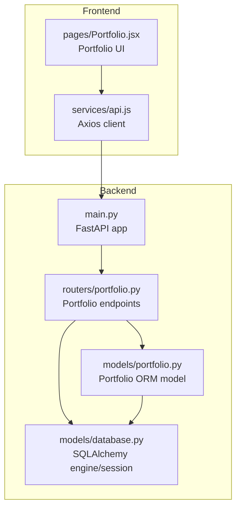
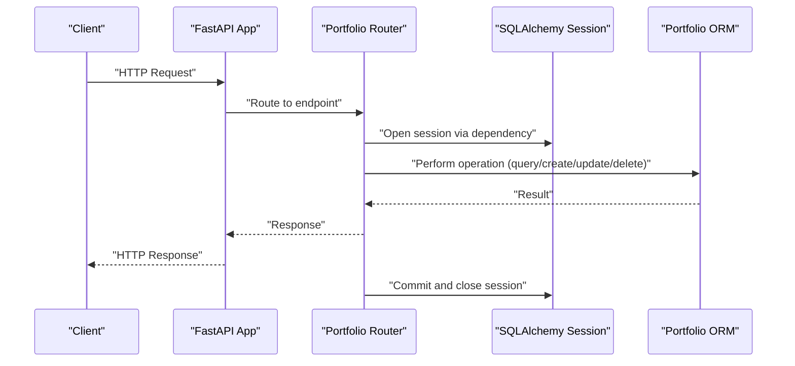
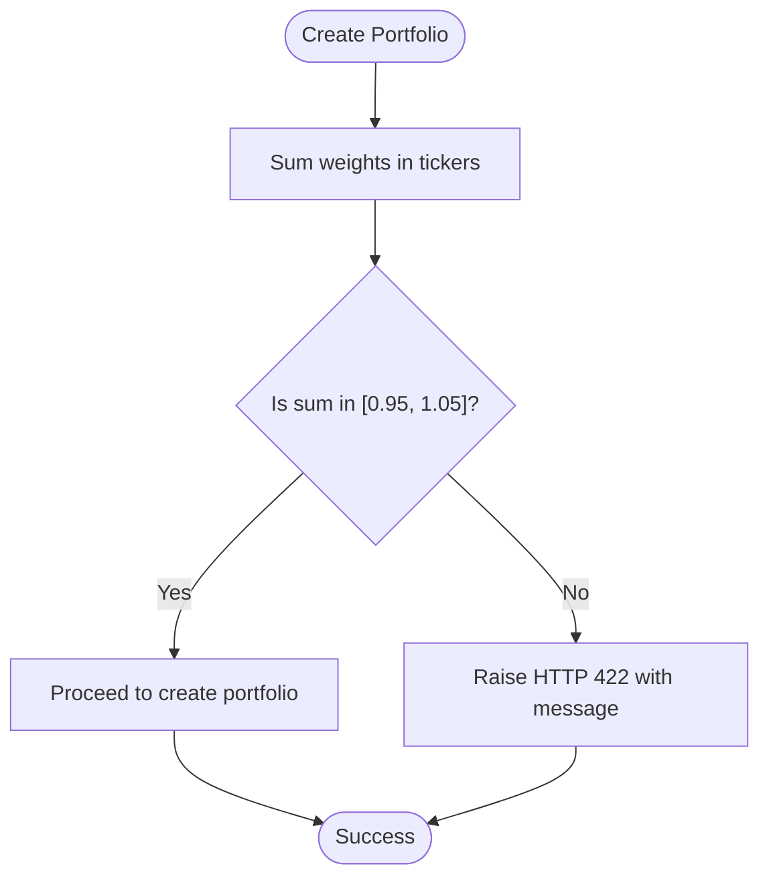
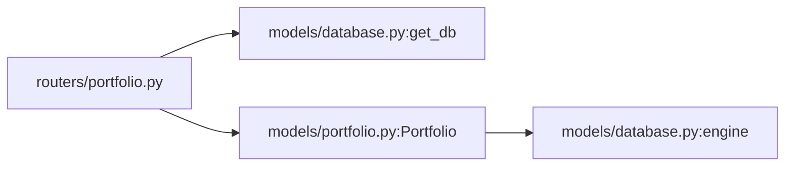

# Portfolio Management API

<cite>
**Referenced Files in This Document**
- [backend/routers/portfolio.py](file://backend/routers/portfolio.py)
- [backend/models/portfolio.py](file://backend/models/portfolio.py)
- [backend/models/database.py](file://backend/models/database.py)
- [backend/main.py](file://backend/main.py)
- [frontend/src/services/api.js](file://frontend/src/services/api.js)
- [frontend/src/pages/Portfolio.jsx](file://frontend/src/pages/Portfolio.jsx)
</cite>

## Table of Contents
1. [Introduction](#introduction)
2. [Project Structure](#project-structure)
3. [Core Components](#core-components)
4. [Architecture Overview](#architecture-overview)
5. [Detailed Component Analysis](#detailed-component-analysis)
6. [Dependency Analysis](#dependency-analysis)
7. [Performance Considerations](#performance-considerations)
8. [Troubleshooting Guide](#troubleshooting-guide)
9. [Conclusion](#conclusion)

## Introduction
This document provides comprehensive API documentation for the portfolio management endpoints. It covers all CRUD operations for portfolios, including listing, creating, retrieving, updating, and deleting portfolios. It also documents the PortfolioCreate and PortfolioUpdate Pydantic models, the ticker weight validation system, database integration patterns, and practical examples for common use cases.

## Project Structure
The portfolio management API is implemented in the backend using FastAPI and SQLAlchemy. The frontend integrates with the backend via Axios to manage portfolios.

**Diagram sources**
- [backend/main.py:12-59](file://backend/main.py#L12-L59)
- [backend/routers/portfolio.py:14-22](file://backend/routers/portfolio.py#L14-L22)
- [backend/models/portfolio.py:16-63](file://backend/models/portfolio.py#L16-L63)
- [backend/models/database.py:29-36](file://backend/models/database.py#L29-L36)
- [frontend/src/services/api.js:11-18](file://frontend/src/services/api.js#L11-L18)
- [frontend/src/pages/Portfolio.jsx:252-387](file://frontend/src/pages/Portfolio.jsx#L252-L387)

**Section sources**
- [backend/main.py:12-59](file://backend/main.py#L12-L59)
- [backend/routers/portfolio.py:14-22](file://backend/routers/portfolio.py#L14-L22)
- [backend/models/portfolio.py:16-63](file://backend/models/portfolio.py#L16-L63)
- [backend/models/database.py:29-36](file://backend/models/database.py#L29-L36)
- [frontend/src/services/api.js:11-18](file://frontend/src/services/api.js#L11-L18)
- [frontend/src/pages/Portfolio.jsx:252-387](file://frontend/src/pages/Portfolio.jsx#L252-L387)

## Core Components
- PortfolioCreate: Pydantic model for creating portfolios with validated fields and constraints.
- PortfolioUpdate: Pydantic model for updating portfolios with optional fields.
- Portfolio ORM model: Defines the database schema and JSON serialization/deserialization for tickers.
- Database session management: Provides a FastAPI dependency for scoped SQLAlchemy sessions.
- Portfolio endpoints: REST endpoints for CRUD operations with validation and error handling.

**Section sources**
- [backend/routers/portfolio.py:27-46](file://backend/routers/portfolio.py#L27-L46)
- [backend/models/portfolio.py:16-63](file://backend/models/portfolio.py#L16-L63)
- [backend/models/database.py:29-36](file://backend/models/database.py#L29-L36)

## Architecture Overview
The portfolio management API follows a layered architecture:
- Presentation layer: FastAPI router defines endpoints and request/response models.
- Application layer: Validation and business logic for portfolio operations.
- Persistence layer: SQLAlchemy ORM model and session management.

**Diagram sources**
- [backend/main.py:39-43](file://backend/main.py#L39-L43)
- [backend/routers/portfolio.py:50-123](file://backend/routers/portfolio.py#L50-L123)
- [backend/models/database.py:29-36](file://backend/models/database.py#L29-L36)
- [backend/models/portfolio.py:50-62](file://backend/models/portfolio.py#L50-L62)

## Detailed Component Analysis

### PortfolioCreate Model
The PortfolioCreate model defines the schema for creating portfolios. It includes:
- name: String with length constraints.
- tickers: Dictionary mapping ticker symbols to weights with an explanatory example.
- user_email: Optional email address.
- user_phone: Optional phone number.
- risk_threshold: Float constrained to a valid range.

Validation rules:
- name must be between 1 and 120 characters.
- tickers must be a dictionary with numeric weights.
- risk_threshold must be between 0.0 and 1.0.

Example payload:
- name: "My Portfolio"
- tickers: {"AAPL": 0.4, "MSFT": 0.3, "SPY": 0.3}
- user_email: "user@example.com"
- user_phone: "+1234567890"
- risk_threshold: 0.70

**Section sources**
- [backend/routers/portfolio.py:27-36](file://backend/routers/portfolio.py#L27-L36)

### PortfolioUpdate Model
The PortfolioUpdate model allows partial updates to existing portfolios. Fields are optional and include:
- name, tickers, user_email, user_phone, risk_threshold, is_active.

Example payload:
- name: "Updated Portfolio Name"
- tickers: {"AAPL": 0.5, "MSFT": 0.5}

**Section sources**
- [backend/routers/portfolio.py:39-46](file://backend/routers/portfolio.py#L39-L46)

### Ticker Weight Validation System
The system enforces that the weights in the tickers dictionary sum to approximately 1.0. The validation logic checks that the total weight falls within a tolerance range around 1.0.

Validation behavior:
- Sum of weights must satisfy 0.95 ≤ total_weight ≤ 1.05.
- If invalid, the endpoint returns HTTP 422 Unprocessable Entity with a descriptive message.

**Diagram sources**
- [backend/routers/portfolio.py:58-65](file://backend/routers/portfolio.py#L58-L65)

**Section sources**
- [backend/routers/portfolio.py:58-65](file://backend/routers/portfolio.py#L58-L65)

### Database Integration and Session Management
The database integration uses SQLAlchemy with a scoped session managed via a FastAPI dependency. The session lifecycle is handled automatically:
- get_db opens a session at the beginning of each request.
- The session is committed after successful operations.
- The session is closed in a finally block to ensure cleanup.

Key behaviors:
- SQLite is used by default; thread checking is disabled for SQLite to support multi-threaded environments.
- Tables are created on application startup.

**Section sources**
- [backend/models/database.py:15-36](file://backend/models/database.py#L15-L36)
- [backend/main.py:33-35](file://backend/main.py#L33-L35)

### Endpoint Specifications

#### GET /api/portfolio
- Purpose: List all portfolios ordered by creation date.
- Authentication: Not specified in the router; depends on application configuration.
- Response: Array of portfolio objects serialized via to_dict.

Response schema:
- id: integer
- name: string
- user_id: string
- tickers: object (ticker → weight)
- user_email: string or null
- user_phone: string or null
- risk_threshold: number
- is_active: boolean
- created_at: ISO timestamp or null
- updated_at: ISO timestamp or null

Status codes:
- 200 OK on success.

**Section sources**
- [backend/routers/portfolio.py:50-53](file://backend/routers/portfolio.py#L50-L53)
- [backend/models/portfolio.py:50-62](file://backend/models/portfolio.py#L50-L62)

#### POST /api/portfolio
- Purpose: Create a new portfolio.
- Request body: PortfolioCreate model.
- Validation: Ticker weight validation enforced before creation.
- Response: Created portfolio object serialized via to_dict.
- Status codes:
  - 201 Created on success.
  - 422 Unprocessable Entity if weights do not sum to approximately 1.0.

Request parameter specifications:
- name: string (1–120 characters)
- tickers: object (ticker → weight)
- user_email: string or null
- user_phone: string or null
- risk_threshold: number (0.0–1.0)

Response schema:
- Same as GET /api/portfolio.

Practical example:
- Create a portfolio with tickers {"AAPL": 0.4, "MSFT": 0.3, "SPY": 0.3} and risk_threshold 0.70.

Error scenarios:
- Weights not summing to approximately 1.0 result in HTTP 422.

**Section sources**
- [backend/routers/portfolio.py:56-77](file://backend/routers/portfolio.py#L56-L77)
- [backend/routers/portfolio.py:27-36](file://backend/routers/portfolio.py#L27-L36)
- [backend/models/portfolio.py:50-62](file://backend/models/portfolio.py#L50-L62)

#### GET /api/portfolio/{id}
- Purpose: Retrieve a single portfolio by ID.
- Path parameter: id (integer).
- Response: Portfolio object serialized via to_dict.
- Status codes:
  - 200 OK on success.
  - 404 Not Found if portfolio does not exist.

Response schema:
- Same as GET /api/portfolio.

**Section sources**
- [backend/routers/portfolio.py:80-85](file://backend/routers/portfolio.py#L80-L85)
- [backend/models/portfolio.py:50-62](file://backend/models/portfolio.py#L50-L62)

#### PUT /api/portfolio/{id}
- Purpose: Update an existing portfolio.
- Path parameter: id (integer).
- Request body: PortfolioUpdate model (partial updates allowed).
- Response: Updated portfolio object serialized via to_dict.
- Status codes:
  - 200 OK on success.
  - 404 Not Found if portfolio does not exist.

Partial update behavior:
- Only provided fields are updated; others remain unchanged.

Practical example:
- Update name and tickers while leaving other fields untouched.

**Section sources**
- [backend/routers/portfolio.py:88-113](file://backend/routers/portfolio.py#L88-L113)
- [backend/routers/portfolio.py:39-46](file://backend/routers/portfolio.py#L39-L46)
- [backend/models/portfolio.py:50-62](file://backend/models/portfolio.py#L50-L62)

#### DELETE /api/portfolio/{id}
- Purpose: Delete a portfolio by ID.
- Path parameter: id (integer).
- Response: No content.
- Status codes:
  - 204 No Content on success.
  - 404 Not Found if portfolio does not exist.

**Section sources**
- [backend/routers/portfolio.py:116-123](file://backend/routers/portfolio.py#L116-L123)

### Frontend Integration
The frontend uses Axios to communicate with the backend:
- portfolioApi.list, portfolioApi.get, portfolioApi.create, portfolioApi.update, portfolioApi.remove map to the respective endpoints.
- The Portfolio page manages portfolio creation/editing and displays validation feedback for ticker weights.

**Section sources**
- [frontend/src/services/api.js:11-18](file://frontend/src/services/api.js#L11-L18)
- [frontend/src/pages/Portfolio.jsx:252-387](file://frontend/src/pages/Portfolio.jsx#L252-L387)

## Dependency Analysis
The portfolio endpoints depend on the following components:
- FastAPI router for routing and dependency injection.
- SQLAlchemy session for database operations.
- Portfolio ORM model for persistence and serialization.

**Diagram sources**
- [backend/routers/portfolio.py:14-22](file://backend/routers/portfolio.py#L14-L22)
- [backend/models/database.py:29-36](file://backend/models/database.py#L29-L36)
- [backend/models/portfolio.py:16-35](file://backend/models/portfolio.py#L16-L35)

**Section sources**
- [backend/routers/portfolio.py:14-22](file://backend/routers/portfolio.py#L14-L22)
- [backend/models/database.py:29-36](file://backend/models/database.py#L29-L36)
- [backend/models/portfolio.py:16-35](file://backend/models/portfolio.py#L16-L35)

## Performance Considerations
- Session management: Sessions are opened per request and closed afterward, minimizing connection overhead.
- Query ordering: Listing portfolios orders by creation time, which can benefit from an index on created_at if frequently queried.
- JSON serialization: Ticker weights are stored as JSON and parsed on access; consider caching for high-frequency reads.

## Troubleshooting Guide
Common issues and resolutions:
- HTTP 404 Not Found: Occurs when querying or updating a non-existent portfolio ID. Verify the ID exists before invoking endpoints.
- HTTP 422 Unprocessable Entity during creation: Indicates ticker weights do not sum to approximately 1.0. Adjust weights so their sum is within the allowed tolerance.
- Session errors: Ensure the database URL is configured correctly and reachable. For SQLite, thread safety is handled by disabling thread checks.

**Section sources**
- [backend/routers/portfolio.py:83-84](file://backend/routers/portfolio.py#L83-L84)
- [backend/routers/portfolio.py:95-96](file://backend/routers/portfolio.py#L95-L96)
- [backend/routers/portfolio.py:61-65](file://backend/routers/portfolio.py#L61-L65)
- [backend/models/database.py:15-18](file://backend/models/database.py#L15-L18)

## Conclusion
The portfolio management API provides a robust foundation for CRUD operations on portfolios with built-in validation for ticker weights and clean database integration via SQLAlchemy. The frontend offers a user-friendly interface for creating and editing portfolios, including live validation feedback. Following the documented request/response schemas and validation rules ensures reliable operation across all endpoints.