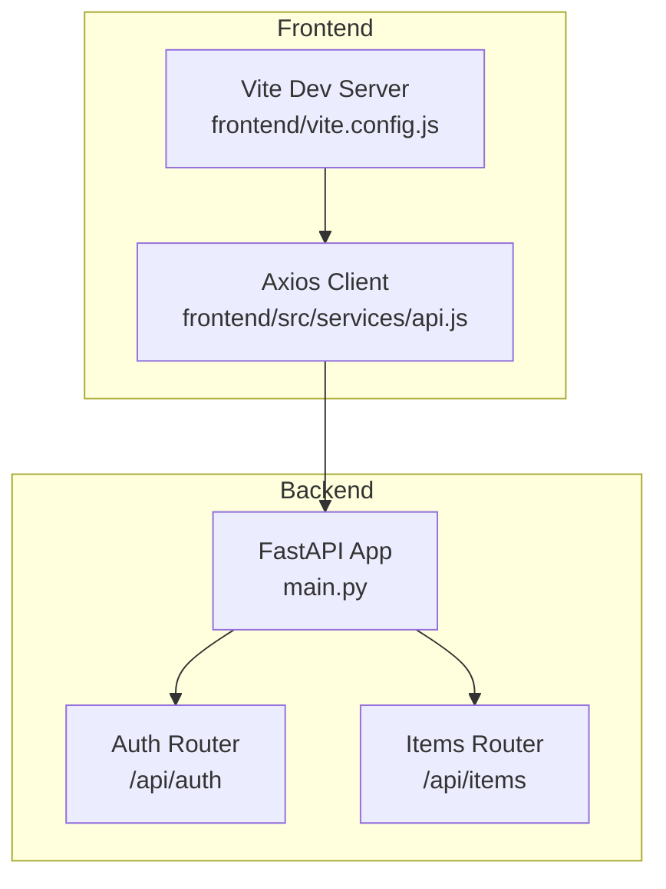
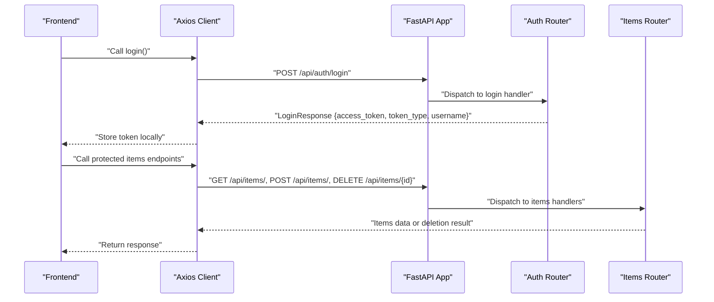
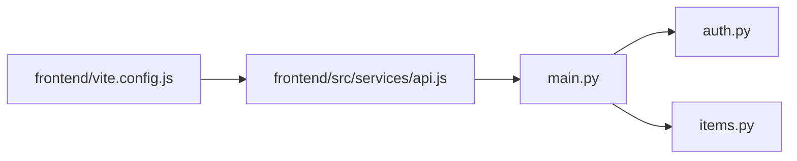

# API Reference

<cite>
**Referenced Files in This Document**
- [backend/main.py](file://backend/main.py)
- [backend/routers/auth.py](file://backend/routers/auth.py)
- [backend/routers/items.py](file://backend/routers/items.py)
- [frontend/src/services/api.js](file://frontend/src/services/api.js)
- [frontend/vite.config.js](file://frontend/vite.config.js)
- [README.md](file://README.md)
</cite>

## Table of Contents
1. [Introduction](#introduction)
2. [Project Structure](#project-structure)
3. [Core Components](#core-components)
4. [Architecture Overview](#architecture-overview)
5. [Detailed Component Analysis](#detailed-component-analysis)
6. [Dependency Analysis](#dependency-analysis)
7. [Performance Considerations](#performance-considerations)
8. [Troubleshooting Guide](#troubleshooting-guide)
9. [Conclusion](#conclusion)
10. [Appendices](#appendices)

## Introduction
This document provides a comprehensive API reference for the ishwarambare-app backend built with FastAPI. It covers all RESTful endpoints, authentication flow, request/response schemas, CORS configuration, and practical usage examples. It also outlines client-side integration patterns and highlights areas for future enhancements such as token-based authentication and rate limiting.

## Project Structure
The backend exposes two primary routers:
- Items router under /api/items with endpoints for listing, retrieving, creating, and deleting items.
- Auth router under /api/auth with endpoints for login and fetching current user information.

CORS is configured to allow requests from specified origins, and the app exposes a root and health endpoint.

**Diagram sources**
- [backend/main.py:10-32](file://backend/main.py#L10-L32)
- [backend/routers/auth.py:1-39](file://backend/routers/auth.py#L1-L39)
- [backend/routers/items.py:1-72](file://backend/routers/items.py#L1-L72)
- [frontend/src/services/api.js:1-29](file://frontend/src/services/api.js#L1-L29)
- [frontend/vite.config.js:1-23](file://frontend/vite.config.js#L1-L23)

**Section sources**
- [backend/main.py:10-44](file://backend/main.py#L10-L44)
- [README.md:111-123](file://README.md#L111-L123)

## Core Components
- FastAPI Application: Initializes the app, registers routers, and configures CORS middleware.
- Auth Router: Provides login and user info endpoints with Pydantic models for request/response validation.
- Items Router: Manages CRUD operations for items with in-memory storage and Pydantic models for schemas.

Key behaviors:
- CORS allows credentials and all methods/headers for configured origins.
- Items endpoints support listing, retrieving by ID, creating, and deleting items.
- Auth endpoints include login and a stub for current user info.

**Section sources**
- [backend/main.py:10-32](file://backend/main.py#L10-L32)
- [backend/routers/auth.py:1-39](file://backend/routers/auth.py#L1-L39)
- [backend/routers/items.py:1-72](file://backend/routers/items.py#L1-L72)

## Architecture Overview
The API follows a layered architecture:
- Entry points: FastAPI app registers routers and middleware.
- Routers: Separate modules handle items and auth concerns.
- Client integration: Axios client attaches Authorization header when a token is present.

**Diagram sources**
- [frontend/src/services/api.js:16-23](file://frontend/src/services/api.js#L16-L23)
- [backend/main.py:30-32](file://backend/main.py#L30-L32)
- [backend/routers/auth.py:18-32](file://backend/routers/auth.py#L18-L32)
- [backend/routers/items.py:36-71](file://backend/routers/items.py#L36-L71)

## Detailed Component Analysis

### Authentication Endpoints
- Base path: /api/auth
- Methods and paths:
  - POST /api/auth/login
  - GET /api/auth/me

Authentication flow:
- Clients send credentials to the login endpoint.
- On success, the server returns a token and user identity.
- Subsequent requests attach an Authorization header with the token.

Request/response schemas:
- LoginRequest: username, password
- LoginResponse: access_token, token_type, username

Behavior and validation:
- Demo login validates hardcoded credentials and returns a demo token.
- On invalid credentials, the server raises an unauthorized error.
- The current user endpoint is a stub returning a sample user profile.

Status codes:
- 200 OK: Successful login or user info retrieval.
- 401 Unauthorized: Invalid credentials during login.

Practical usage examples:
- Login:
  - curl -X POST "http://localhost:8000/api/auth/login" -H "Content-Type: application/json" -d '{"username":"admin","password":"admin"}'
- Get current user:
  - curl -X GET "http://localhost:8000/api/auth/me" -H "Authorization: Bearer <access_token>"

Client-side integration:
- Axios interceptor automatically attaches Authorization header when a token is present in local storage.

**Section sources**
- [backend/routers/auth.py:7-39](file://backend/routers/auth.py#L7-L39)
- [frontend/src/services/api.js:8-13](file://frontend/src/services/api.js#L8-L13)

### Items Management Endpoints
- Base path: /api/items
- Methods and paths:
  - GET /api/items/
  - GET /api/items/{item_id}
  - POST /api/items/
  - DELETE /api/items/{item_id}

Request/response schemas:
- Item: id, name, description, price, in_stock
- ItemCreate: name, description, price, in_stock

Behavior and validation:
- Listing returns all items.
- Retrieving by ID returns the item if found; otherwise raises not found.
- Creating persists a new item with an auto-incremented ID.
- Deleting removes an item by ID; if not found, raises not found.

Status codes:
- 200 OK: Successful retrieval or deletion.
- 201 Created: New item created.
- 404 Not Found: Item not found for get/delete.

Practical usage examples:
- List items:
  - curl -X GET "http://localhost:8000/api/items/"
- Get item by ID:
  - curl -X GET "http://localhost:8000/api/items/1"
- Create item:
  - curl -X POST "http://localhost:8000/api/items/" -H "Content-Type: application/json" -d '{"name":"Example","price":29.99}'
- Delete item:
  - curl -X DELETE "http://localhost:8000/api/items/1"

Client-side integration:
- Axios helpers wrap endpoints for listing, retrieving, creating, and deleting items.

**Section sources**
- [backend/routers/items.py:9-72](file://backend/routers/items.py#L9-L72)
- [frontend/src/services/api.js:16-19](file://frontend/src/services/api.js#L16-L19)

### Root and Health Endpoints
- GET /
  - Returns a welcome message and status.
- GET /health
  - Returns a health status.

These endpoints are useful for monitoring and initial verification of service availability.

**Section sources**
- [backend/main.py:36-43](file://backend/main.py#L36-L43)

## Dependency Analysis
- FastAPI app depends on routers for items and auth.
- Auth and items routers depend on Pydantic models for request/response validation.
- Frontend Axios client depends on environment configuration and local storage for tokens.
- Vite dev server proxies API calls to the backend during development.

**Diagram sources**
- [backend/main.py:30-32](file://backend/main.py#L30-L32)
- [backend/routers/auth.py:1-39](file://backend/routers/auth.py#L1-L39)
- [backend/routers/items.py:1-72](file://backend/routers/items.py#L1-L72)
- [frontend/src/services/api.js:1-29](file://frontend/src/services/api.js#L1-L29)
- [frontend/vite.config.js:9-16](file://frontend/vite.config.js#L9-L16)

**Section sources**
- [backend/main.py:30-32](file://backend/main.py#L30-L32)
- [frontend/src/services/api.js:1-29](file://frontend/src/services/api.js#L1-L29)
- [frontend/vite.config.js:7-16](file://frontend/vite.config.js#L7-L16)

## Performance Considerations
- In-memory storage for items is suitable for demos but should be replaced with a persistent database for production.
- Consider pagination for large item lists to reduce payload sizes.
- Implement caching strategies for frequently accessed endpoints.
- Optimize CORS configuration to restrict origins and headers to only what is necessary.

[No sources needed since this section provides general guidance]

## Troubleshooting Guide
Common issues and resolutions:
- CORS errors: Ensure ALLOWED_ORIGINS includes the frontend origin. Verify environment configuration and restart the backend.
- Token not attached: Confirm the Authorization header is set in the Axios interceptor and that the token is stored in local storage.
- 404 Not Found: Verify item IDs and endpoint paths. Ensure IDs exist before attempting retrieval or deletion.
- 401 Unauthorized: Confirm credentials for login and that the token is valid and included in requests.

**Section sources**
- [backend/main.py:17-28](file://backend/main.py#L17-L28)
- [frontend/src/services/api.js:8-13](file://frontend/src/services/api.js#L8-L13)
- [backend/routers/auth.py:31-32](file://backend/routers/auth.py#L31-L32)
- [backend/routers/items.py:48-49](file://backend/routers/items.py#L48-L49)
- [backend/routers/items.py:69-70](file://backend/routers/items.py#L69-L70)

## Conclusion
The ishwarambare-app API provides a clean, documented interface for items management and authentication. While the current implementation demonstrates basic functionality, future enhancements should focus on robust authentication, persistent storage, rate limiting, and comprehensive error handling to meet production standards.

[No sources needed since this section summarizes without analyzing specific files]

## Appendices

### CORS Configuration
- Origins: Configurable via environment variable with defaults for local and production domains.
- Credentials: Allowed.
- Methods and headers: All methods and headers permitted.

**Section sources**
- [backend/main.py:17-28](file://backend/main.py#L17-L28)

### OpenAPI/Swagger Documentation
- Auto-generated docs are available at the backend base URL.
- Accessible via the development server and production deployments.

**Section sources**
- [README.md:56](file://README.md#L56)

### Client-Side Integration Patterns
- Axios client configuration:
  - Base URL derived from environment variables.
  - Interceptor attaches Authorization header when a token exists.
- Frontend development proxy:
  - API routes are proxied to the backend during development.

**Section sources**
- [frontend/src/services/api.js:3-6](file://frontend/src/services/api.js#L3-L6)
- [frontend/src/services/api.js:8-13](file://frontend/src/services/api.js#L8-L13)
- [frontend/vite.config.js:9-16](file://frontend/vite.config.js#L9-L16)

### Endpoint Catalog
- Root and health:
  - GET / (welcome message)
  - GET /health (health status)
- Items:
  - GET /api/items/ (list)
  - GET /api/items/{id} (get)
  - POST /api/items/ (create)
  - DELETE /api/items/{id} (delete)
- Auth:
  - POST /api/auth/login (login)
  - GET /api/auth/me (current user)

**Section sources**
- [README.md:111-123](file://README.md#L111-L123)