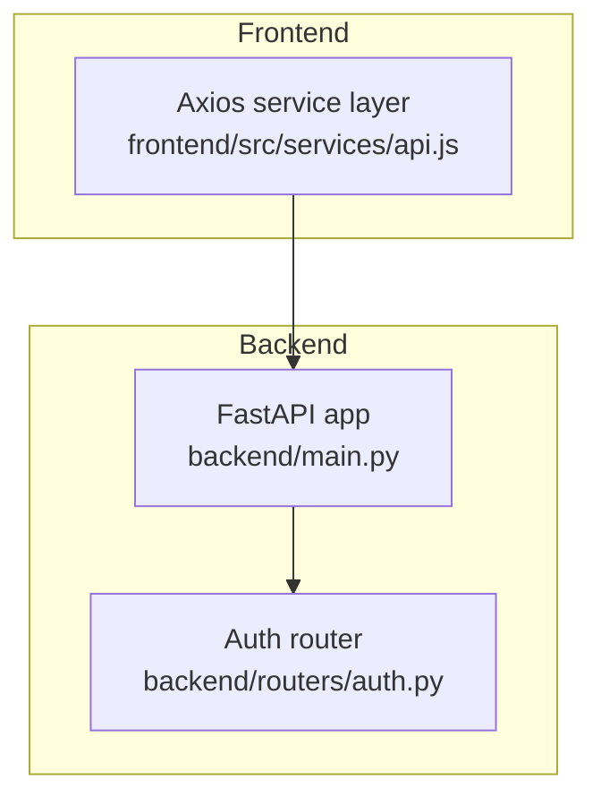
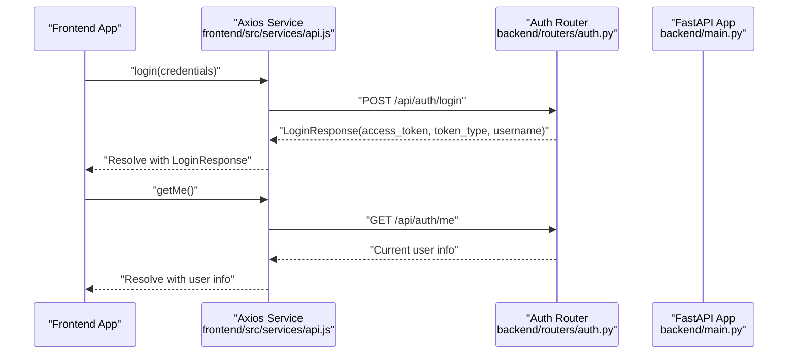
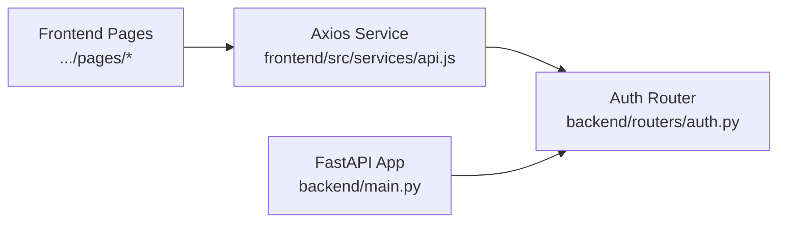

# Authentication Endpoints

<cite>
**Referenced Files in This Document**
- [backend/routers/auth.py](file://backend/routers/auth.py)
- [backend/main.py](file://backend/main.py)
- [frontend/src/services/api.js](file://frontend/src/services/api.js)
- [README.md](file://README.md)
</cite>

## Table of Contents
1. [Introduction](#introduction)
2. [Project Structure](#project-structure)
3. [Core Components](#core-components)
4. [Architecture Overview](#architecture-overview)
5. [Detailed Component Analysis](#detailed-component-analysis)
6. [Dependency Analysis](#dependency-analysis)
7. [Performance Considerations](#performance-considerations)
8. [Troubleshooting Guide](#troubleshooting-guide)
9. [Conclusion](#conclusion)

## Introduction
This document provides comprehensive API documentation for the authentication endpoints exposed by the backend. It covers:
- POST /api/auth/login: request/response schemas, authentication flow, and error handling
- GET /api/auth/me: endpoint behavior and current stub implementation
- Practical curl examples for successful login and retrieving current user info
- Current demo limitations and guidance for implementing proper JWT authentication with database validation
- Client-side integration patterns for token storage and automatic Authorization header injection

## Project Structure
The authentication endpoints are implemented in the backend FastAPI application and consumed by the frontend React application.



**Diagram sources**
- [backend/main.py:10-32](file://backend/main.py#L10-L32)
- [backend/routers/auth.py:1-39](file://backend/routers/auth.py#L1-L39)
- [frontend/src/services/api.js:1-29](file://frontend/src/services/api.js#L1-L29)

**Section sources**
- [backend/main.py:30-32](file://backend/main.py#L30-L32)
- [README.md:111-123](file://README.md#L111-L123)

## Core Components
- Auth router exposes two endpoints under /api/auth:
  - POST /login with request/response models for credential validation and token issuance
  - GET /me for returning current user information (stubbed)
- Frontend Axios service:
  - Automatically attaches Authorization: Bearer <token> header if a token exists in local storage
  - Provides login and getMe convenience methods

Key implementation references:
- Auth router and models: [backend/routers/auth.py:1-39](file://backend/routers/auth.py#L1-L39)
- Router registration: [backend/main.py:31-32](file://backend/main.py#L31-L32)
- Frontend API service and interceptors: [frontend/src/services/api.js:1-29](file://frontend/src/services/api.js#L1-L29)

**Section sources**
- [backend/routers/auth.py:12-39](file://backend/routers/auth.py#L12-L39)
- [backend/main.py:31-32](file://backend/main.py#L31-L32)
- [frontend/src/services/api.js:8-23](file://frontend/src/services/api.js#L8-L23)

## Architecture Overview
The authentication flow integrates the frontend’s Axios interceptor with the backend’s auth router.



**Diagram sources**
- [backend/routers/auth.py:18-39](file://backend/routers/auth.py#L18-L39)
- [backend/main.py:31-32](file://backend/main.py#L31-L32)
- [frontend/src/services/api.js:22-23](file://frontend/src/services/api.js#L22-L23)

## Detailed Component Analysis

### POST /api/auth/login
- Purpose: Authenticate a user and return an access token and user identity
- Request body schema (Pydantic model):
  - username: string
  - password: string
- Response schema (Pydantic model):
  - access_token: string
  - token_type: string
  - username: string
- Behavior:
  - Demo implementation validates hardcoded credentials
  - On success, returns a LoginResponse
  - On failure, raises HTTP 401 Unauthorized
- Notes:
  - Endpoint includes a comment indicating replacement with real JWT + database authentication

Example curl command (successful login):
```bash
curl -X POST "http://localhost:8000/api/auth/login" \
  -H "Content-Type: application/json" \
  -d '{"username":"admin","password":"admin"}'
```

Example curl command (failed login):
```bash
curl -X POST "http://localhost:8000/api/auth/login" \
  -H "Content-Type: application/json" \
  -d '{"username":"invalid","password":"wrong"}'
```

Current demo implementation limitations:
- Hardcoded credentials check
- Non-functional token (placeholder string)
- No database validation or user persistence
- No password hashing or secure token generation

Recommended implementation steps:
- Integrate a database ORM (e.g., SQLAlchemy) and define a User model
- Hash passwords using a secure library (e.g., bcrypt) and compare during login
- Generate a cryptographically secure JWT on successful authentication
- Store refresh tokens and implement token expiration and rotation
- Add middleware to protect routes requiring authentication

**Section sources**
- [backend/routers/auth.py:7-32](file://backend/routers/auth.py#L7-L32)
- [backend/routers/auth.py:18-32](file://backend/routers/auth.py#L18-L32)
- [README.md:121](file://README.md#L121)

### GET /api/auth/me
- Purpose: Retrieve information about the currently authenticated user
- Current behavior:
  - Returns a static stub response with username and role
  - Does not enforce authentication or validate the incoming token
- Notes:
  - Intended to be protected by authentication middleware in a production implementation

Example curl command:
```bash
curl -X GET "http://localhost:8000/api/auth/me"
```

Client-side usage:
- The frontend’s getMe method calls this endpoint after a successful login
- The Axios interceptor automatically adds the Authorization header if a token exists in local storage

**Section sources**
- [backend/routers/auth.py:35-39](file://backend/routers/auth.py#L35-L39)
- [frontend/src/services/api.js:22-23](file://frontend/src/services/api.js#L22-L23)

### Client-Side Integration Patterns
- Token storage:
  - The frontend stores the token in local storage upon successful login
  - The Axios interceptor reads the token from local storage and injects it into the Authorization header for subsequent requests
- Header injection:
  - Authorization: Bearer <token> is attached automatically if a token exists
- Example usage:
  - login method posts to /api/auth/login
  - getMe method retrieves /api/auth/me

Practical curl examples:
- Successful login:
  ```bash
  curl -X POST "http://localhost:8000/api/auth/login" \
    -H "Content-Type: application/json" \
    -d '{"username":"admin","password":"admin"}'
  ```
- Retrieve current user:
  ```bash
  curl -X GET "http://localhost:8000/api/auth/me"
  ```

**Section sources**
- [frontend/src/services/api.js:8-13](file://frontend/src/services/api.js#L8-L13)
- [frontend/src/services/api.js:22-23](file://frontend/src/services/api.js#L22-L23)

## Dependency Analysis
The backend registers the auth router under /api/auth, and the frontend consumes endpoints from the same prefix.



**Diagram sources**
- [backend/main.py:31-32](file://backend/main.py#L31-L32)
- [backend/routers/auth.py:1-39](file://backend/routers/auth.py#L1-L39)
- [frontend/src/services/api.js:1-29](file://frontend/src/services/api.js#L1-L29)

**Section sources**
- [backend/main.py:31-32](file://backend/main.py#L31-L32)
- [frontend/src/services/api.js:22-23](file://frontend/src/services/api.js#L22-L23)

## Performance Considerations
- The current demo endpoints are lightweight but lack database queries and cryptographic operations
- For production, consider:
  - Asynchronous database access patterns
  - Efficient password hashing and verification
  - Minimal JSON payload sizes
  - Proper caching and rate limiting for login attempts

## Troubleshooting Guide
Common issues and resolutions:
- HTTP 401 Unauthorized on login:
  - Cause: Credentials do not match the hardcoded demo values
  - Resolution: Use the demo credentials or implement real authentication
- Missing Authorization header:
  - Cause: Token not stored in local storage or interceptor not applied
  - Resolution: Ensure login succeeds and stores the token; confirm interceptor logic
- CORS errors:
  - Cause: Origin not permitted by backend configuration
  - Resolution: Verify ALLOWED_ORIGINS environment variable includes the frontend origin

**Section sources**
- [backend/routers/auth.py:31-32](file://backend/routers/auth.py#L31-L32)
- [backend/main.py:17-28](file://backend/main.py#L17-L28)
- [frontend/src/services/api.js:8-13](file://frontend/src/services/api.js#L8-L13)

## Conclusion
The authentication endpoints provide a foundation for user login and current user retrieval. The current implementation is a demo that demonstrates request/response schemas and client-side header injection. To build a production-grade system, integrate database-backed user validation, secure password hashing, and robust JWT generation and verification. Protect endpoints with authentication middleware and implement token lifecycle management for enhanced security and reliability.