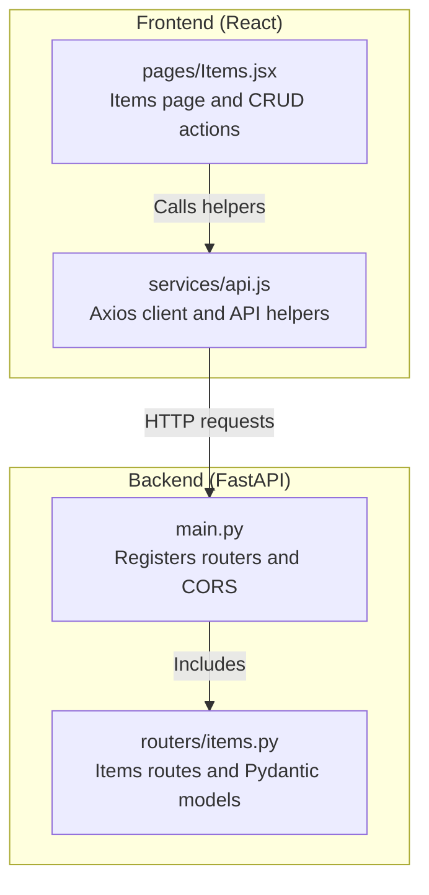
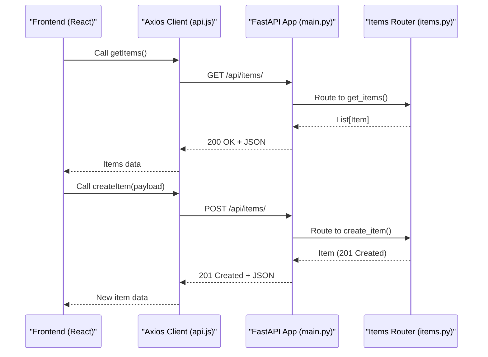
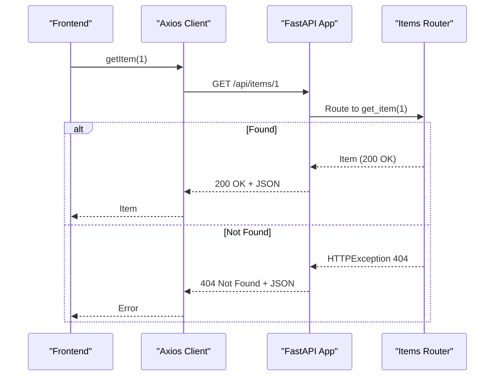
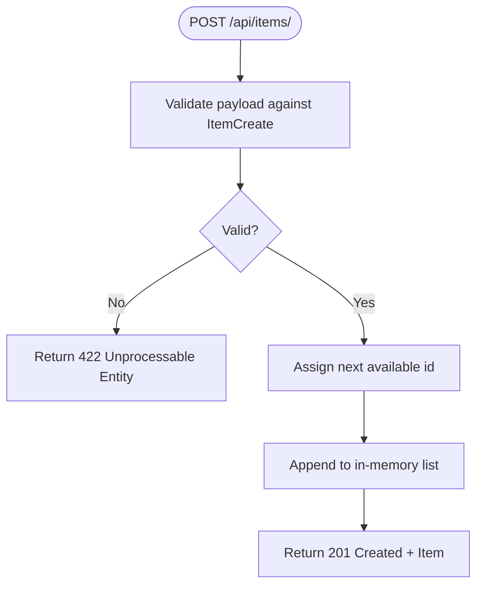
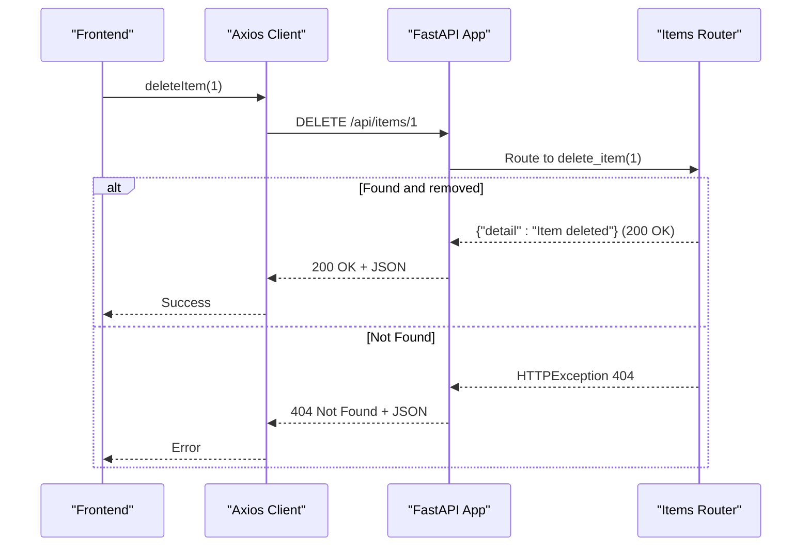

# Items Management Endpoints

<cite>
**Referenced Files in This Document**
- [backend/routers/items.py](file://backend/routers/items.py)
- [backend/main.py](file://backend/main.py)
- [frontend/src/services/api.js](file://frontend/src/services/api.js)
- [frontend/src/pages/Items.jsx](file://frontend/src/pages/Items.jsx)
- [README.md](file://README.md)
</cite>

## Table of Contents
1. [Introduction](#introduction)
2. [Project Structure](#project-structure)
3. [Core Components](#core-components)
4. [Architecture Overview](#architecture-overview)
5. [Detailed Component Analysis](#detailed-component-analysis)
6. [Dependency Analysis](#dependency-analysis)
7. [Performance Considerations](#performance-considerations)
8. [Troubleshooting Guide](#troubleshooting-guide)
9. [Conclusion](#conclusion)
10. [Appendices](#appendices)

## Introduction
This document provides comprehensive API documentation for the items management endpoints used by the ishwarambare application. It covers the GET /api/items/, GET /api/items/{id}, POST /api/items/, and DELETE /api/items/{id} endpoints, including request/response schemas, validation behavior, HTTP status codes, and practical client-side integration examples for React.

## Project Structure
The items API is implemented in the backend FastAPI application and consumed by the frontend React application. The backend registers the items router under the /api/items prefix and the frontend makes requests via an Axios service wrapper.

**Diagram sources**
- [backend/main.py:30-32](file://backend/main.py#L30-L32)
- [backend/routers/items.py:5-5](file://backend/routers/items.py#L5-L5)
- [frontend/src/services/api.js:15-19](file://frontend/src/services/api.js#L15-L19)
- [frontend/src/pages/Items.jsx:1-125](file://frontend/src/pages/Items.jsx#L1-L125)

**Section sources**
- [README.md:111-123](file://README.md#L111-L123)
- [backend/main.py:30-32](file://backend/main.py#L30-L32)
- [frontend/src/services/api.js:15-19](file://frontend/src/services/api.js#L15-L19)

## Core Components
- Items model and creation schema define the shape of items and validation rules for creation.
- In-memory database stores items and assigns incremental IDs during creation.
- Router endpoints expose list, retrieve, create, and delete operations with appropriate status codes and error handling.

Key implementation references:
- [Item model definition:9-14](file://backend/routers/items.py#L9-L14)
- [ItemCreate schema:17-21](file://backend/routers/items.py#L17-L21)
- [In-memory storage and next ID:24-31](file://backend/routers/items.py#L24-L31)
- [GET /api/items/:36-39](file://backend/routers/items.py#L36-L39)
- [GET /api/items/{id}:42-49](file://backend/routers/items.py#L42-L49)
- [POST /api/items/:52-59](file://backend/routers/items.py#L52-L59)
- [DELETE /api/items/{id}:62-71](file://backend/routers/items.py#L62-L71)

**Section sources**
- [backend/routers/items.py:9-21](file://backend/routers/items.py#L9-L21)
- [backend/routers/items.py:24-31](file://backend/routers/items.py#L24-L31)
- [backend/routers/items.py:36-59](file://backend/routers/items.py#L36-L59)
- [backend/routers/items.py:62-71](file://backend/routers/items.py#L62-L71)

## Architecture Overview
The items endpoints follow a simple layered architecture:
- Router layer defines endpoints and response models.
- Data layer uses an in-memory list with a global next-id counter.
- Frontend consumes endpoints via Axios helpers and updates React state.

**Diagram sources**
- [frontend/src/services/api.js:16-18](file://frontend/src/services/api.js#L16-L18)
- [backend/main.py:31-31](file://backend/main.py#L31-L31)
- [backend/routers/items.py:36-39](file://backend/routers/items.py#L36-L39)
- [backend/routers/items.py:52-59](file://backend/routers/items.py#L52-L59)

## Detailed Component Analysis

### GET /api/items/
- Purpose: Retrieve all items.
- Response: Array of items with fields id, name, description, price, in_stock.
- Status codes:
  - 200 OK on success.
- Validation behavior: No request body; returns the in-memory list as-is.

Response schema:
- id: integer
- name: string
- description: string or null
- price: number (float)
- in_stock: boolean

Example request:
- GET http://localhost:8000/api/items/

Example response (200 OK):
- [
  - { "id": 1, "name": "Laptop", "description": "High-performance laptop", "price": 999.99, "in_stock": true },
  - { "id": 2, "name": "Mouse", "description": "Wireless ergonomic mouse", "price": 49.99, "in_stock": true },
  - { "id": 3, "name": "Keyboard", "description": "Mechanical keyboard", "price": 129.99, "in_stock": false }
  ]

Client integration (React):
- [getItems() helper:16-16](file://frontend/src/services/api.js#L16-L16)
- [Items page loading items:13-23](file://frontend/src/pages/Items.jsx#L13-L23)

**Section sources**
- [backend/routers/items.py:36-39](file://backend/routers/items.py#L36-L39)
- [frontend/src/services/api.js:16-16](file://frontend/src/services/api.js#L16-L16)
- [frontend/src/pages/Items.jsx:13-23](file://frontend/src/pages/Items.jsx#L13-L23)

### GET /api/items/{id}
- Purpose: Retrieve a single item by ID.
- Path parameter: item_id (integer).
- Validation behavior:
  - If item exists, returns the item with 200 OK.
  - If not found, raises HTTP 404 Not Found.
- Response schema: Same as GET /api/items/.

Example request:
- GET http://localhost:8000/api/items/1

Example responses:
- 200 OK: { "id": 1, "name": "Laptop", "description": "High-performance laptop", "price": 999.99, "in_stock": true }
- 404 Not Found: { "detail": "Item not found" }

Client integration (React):
- [getItem(id) helper:17-17](file://frontend/src/services/api.js#L17-L17)
- [Items page delete action uses item ID:48-56](file://frontend/src/pages/Items.jsx#L48-L56)

**Diagram sources**
- [frontend/src/services/api.js:17-17](file://frontend/src/services/api.js#L17-L17)
- [backend/routers/items.py:42-49](file://backend/routers/items.py#L42-L49)

**Section sources**
- [backend/routers/items.py:42-49](file://backend/routers/items.py#L42-L49)
- [frontend/src/services/api.js:17-17](file://frontend/src/services/api.js#L17-L17)
- [frontend/src/pages/Items.jsx:48-56](file://frontend/src/pages/Items.jsx#L48-L56)

### POST /api/items/
- Purpose: Create a new item.
- Request body schema (ItemCreate):
  - name: string (required)
  - description: string or null (optional)
  - price: number (required)
  - in_stock: boolean (optional, defaults to true)
- Validation behavior:
  - Uses Pydantic validation to enforce field types and presence.
  - On success, assigns a new integer id and appends to the in-memory list.
- Response:
  - 201 Created with the created item.
- Error handling:
  - Pydantic validation errors are returned automatically by FastAPI.

Example request (201 Created):
- POST http://localhost:8000/api/items/
- Body: { "name": "Monitor", "description": "27-inch 1440p", "price": 299.99, "in_stock": true }

Example response (201 Created):
- { "id": 4, "name": "Monitor", "description": "27-inch 1440p", "price": 299.99, "in_stock": true }

Client integration (React):
- [createItem(data) helper:18-18](file://frontend/src/services/api.js#L18-L18)
- [Items page form submission:32-46](file://frontend/src/pages/Items.jsx#L32-L46)

**Diagram sources**
- [backend/routers/items.py:17-21](file://backend/routers/items.py#L17-L21)
- [backend/routers/items.py:52-59](file://backend/routers/items.py#L52-L59)

**Section sources**
- [backend/routers/items.py:17-21](file://backend/routers/items.py#L17-L21)
- [backend/routers/items.py:52-59](file://backend/routers/items.py#L52-L59)
- [frontend/src/services/api.js:18-18](file://frontend/src/services/api.js#L18-L18)
- [frontend/src/pages/Items.jsx:32-46](file://frontend/src/pages/Items.jsx#L32-L46)

### DELETE /api/items/{id}
- Purpose: Remove an item by ID.
- Path parameter: item_id (integer).
- Behavior:
  - If item exists, removes it from the in-memory list and returns 200 OK with a deletion message.
  - If not found, raises HTTP 404 Not Found.
- Response:
  - 200 OK: { "detail": "Item deleted" }
  - 404 Not Found: { "detail": "Item not found" }

Example request:
- DELETE http://localhost:8000/api/items/1

Example responses:
- 200 OK: { "detail": "Item deleted" }
- 404 Not Found: { "detail": "Item not found" }

Client integration (React):
- [deleteItem(id) helper:19-19](file://frontend/src/services/api.js#L19-L19)
- [Items page delete handler:48-56](file://frontend/src/pages/Items.jsx#L48-L56)

**Diagram sources**
- [frontend/src/services/api.js:19-19](file://frontend/src/services/api.js#L19-L19)
- [backend/routers/items.py:62-71](file://backend/routers/items.py#L62-L71)

**Section sources**
- [backend/routers/items.py:62-71](file://backend/routers/items.py#L62-L71)
- [frontend/src/services/api.js:19-19](file://frontend/src/services/api.js#L19-L19)
- [frontend/src/pages/Items.jsx:48-56](file://frontend/src/pages/Items.jsx#L48-L56)

## Dependency Analysis
- Backend:
  - main.py registers the items router under /api/items and enables CORS.
  - items.py defines models and endpoints.
- Frontend:
  - api.js centralizes HTTP calls and attaches auth tokens.
  - Items.jsx orchestrates fetching, creating, and deleting items.

**Diagram sources**
- [frontend/src/pages/Items.jsx:1-125](file://frontend/src/pages/Items.jsx#L1-L125)
- [frontend/src/services/api.js:1-29](file://frontend/src/services/api.js#L1-L29)
- [backend/main.py:30-32](file://backend/main.py#L30-L32)
- [backend/routers/items.py:1-72](file://backend/routers/items.py#L1-L72)

**Section sources**
- [backend/main.py:30-32](file://backend/main.py#L30-L32)
- [backend/routers/items.py:1-72](file://backend/routers/items.py#L1-L72)
- [frontend/src/services/api.js:1-29](file://frontend/src/services/api.js#L1-L29)
- [frontend/src/pages/Items.jsx:1-125](file://frontend/src/pages/Items.jsx#L1-L125)

## Performance Considerations
- In-memory storage:
  - Suitable for development and small datasets.
  - Linear search for retrieval and deletion; O(n) per operation.
  - Consider replacing with a persistent database for production scalability.
- CORS configuration:
  - Ensure ALLOWED_ORIGINS matches frontend origins to avoid preflight or blocked requests.
- Frontend state updates:
  - Optimistic UI updates (e.g., immediately removing an item from the list) improve perceived performance; synchronize with backend responses.

[No sources needed since this section provides general guidance]

## Troubleshooting Guide
Common issues and resolutions:
- 404 Not Found when retrieving or deleting items:
  - Verify the item ID exists in the in-memory list.
  - Confirm the path parameter is an integer and matches an existing record.
  - Reference: [GET /api/items/{id}:42-49](file://backend/routers/items.py#L42-L49), [DELETE /api/items/{id}:62-71](file://backend/routers/items.py#L62-L71)
- 422 Unprocessable Entity on POST:
  - Ensure the request body conforms to ItemCreate schema (name, price required; price must be numeric).
  - Reference: [ItemCreate schema:17-21](file://backend/routers/items.py#L17-L21)
- Frontend cannot connect to backend:
  - Check VITE_API_URL and CORS origins.
  - Reference: [CORS setup:17-28](file://backend/main.py#L17-L28), [API base URL:3-6](file://frontend/src/services/api.js#L3-L6)
- Frontend shows “Failed to load items”:
  - Confirm backend is running and reachable at the configured port.
  - Reference: [Items page error handling:14-22](file://frontend/src/pages/Items.jsx#L14-L22)

**Section sources**
- [backend/routers/items.py:42-49](file://backend/routers/items.py#L42-L49)
- [backend/routers/items.py:62-71](file://backend/routers/items.py#L62-L71)
- [backend/routers/items.py:17-21](file://backend/routers/items.py#L17-L21)
- [backend/main.py:17-28](file://backend/main.py#L17-L28)
- [frontend/src/services/api.js:3-6](file://frontend/src/services/api.js#L3-L6)
- [frontend/src/pages/Items.jsx:14-22](file://frontend/src/pages/Items.jsx#L14-L22)

## Conclusion
The items management endpoints provide a clean, minimal API surface for listing, retrieving, creating, and deleting items. The backend enforces schema validation via Pydantic, while the frontend integrates seamlessly with Axios helpers and React state. For production, replace in-memory storage with a persistent database and add robust error logging and rate limiting.

[No sources needed since this section summarizes without analyzing specific files]

## Appendices

### Endpoint Reference Summary
- GET /api/items/
  - Response: 200 OK with array of items
  - Example: [GET /api/items/:36-39](file://backend/routers/items.py#L36-L39)
- GET /api/items/{id}
  - Response: 200 OK with item or 404 Not Found
  - Example: [GET /api/items/{id}:42-49](file://backend/routers/items.py#L42-L49)
- POST /api/items/
  - Request: ItemCreate schema
  - Response: 201 Created with created item or 422 Unprocessable Entity
  - Example: [POST /api/items/:52-59](file://backend/routers/items.py#L52-L59)
- DELETE /api/items/{id}
  - Response: 200 OK with deletion message or 404 Not Found
  - Example: [DELETE /api/items/{id}:62-71](file://backend/routers/items.py#L62-L71)

**Section sources**
- [backend/routers/items.py:36-71](file://backend/routers/items.py#L36-L71)

### Client-Side Integration Patterns
- Fetching items:
  - Use [getItems():16-16](file://frontend/src/services/api.js#L16-L16) in [Items.jsx:13-23](file://frontend/src/pages/Items.jsx#L13-L23).
- Creating items:
  - Use [createItem(data):18-18](file://frontend/src/services/api.js#L18-L18) in [Items.jsx:32-46](file://frontend/src/pages/Items.jsx#L32-L46).
- Deleting items:
  - Use [deleteItem(id):19-19](file://frontend/src/services/api.js#L19-L19) in [Items.jsx:48-56](file://frontend/src/pages/Items.jsx#L48-L56).
- State management:
  - Maintain items, loading, error, and form state as shown in [Items.jsx:5-11](file://frontend/src/pages/Items.jsx#L5-L11).
  - Update UI optimistically and refresh data after successful operations.

**Section sources**
- [frontend/src/services/api.js:16-19](file://frontend/src/services/api.js#L16-L19)
- [frontend/src/pages/Items.jsx:5-11](file://frontend/src/pages/Items.jsx#L5-L11)
- [frontend/src/pages/Items.jsx:13-23](file://frontend/src/pages/Items.jsx#L13-L23)
- [frontend/src/pages/Items.jsx:32-46](file://frontend/src/pages/Items.jsx#L32-L46)
- [frontend/src/pages/Items.jsx:48-56](file://frontend/src/pages/Items.jsx#L48-L56)