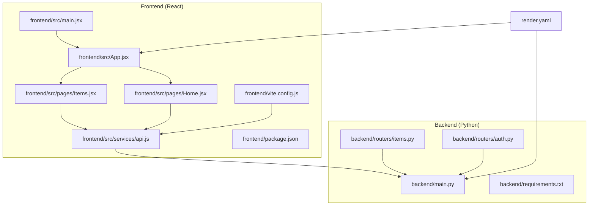
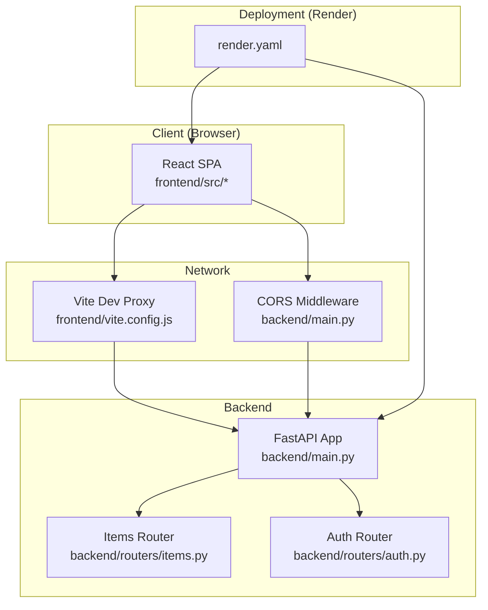
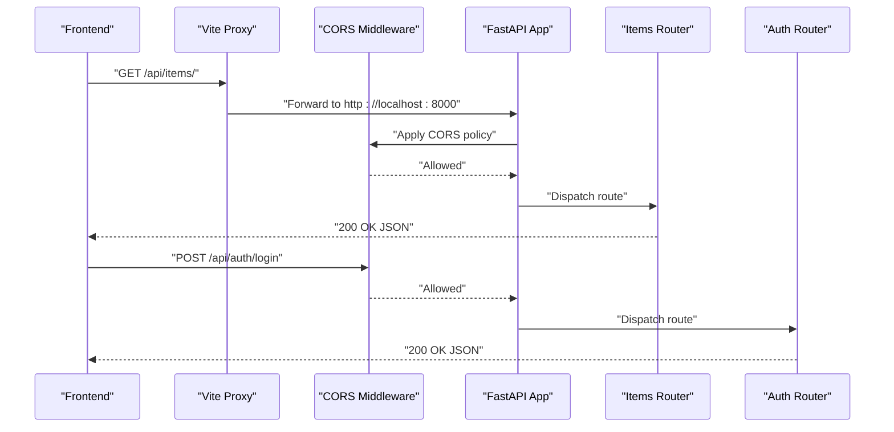
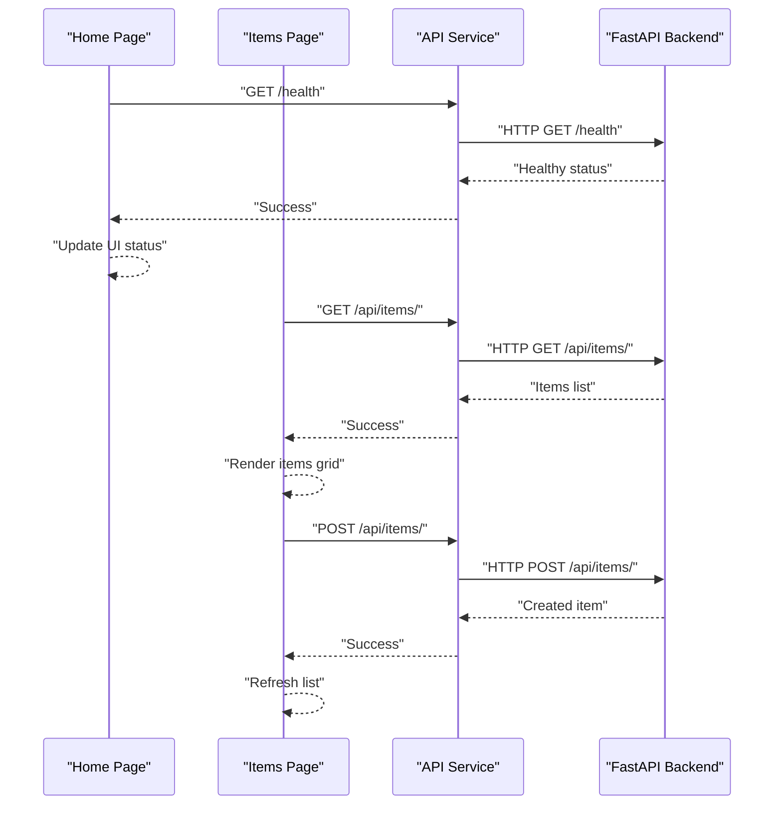
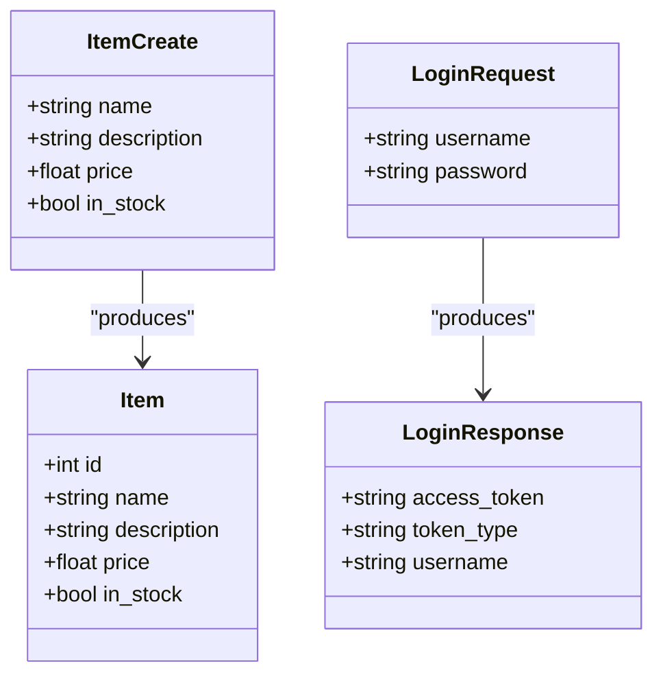
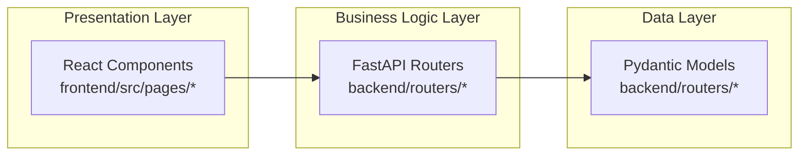
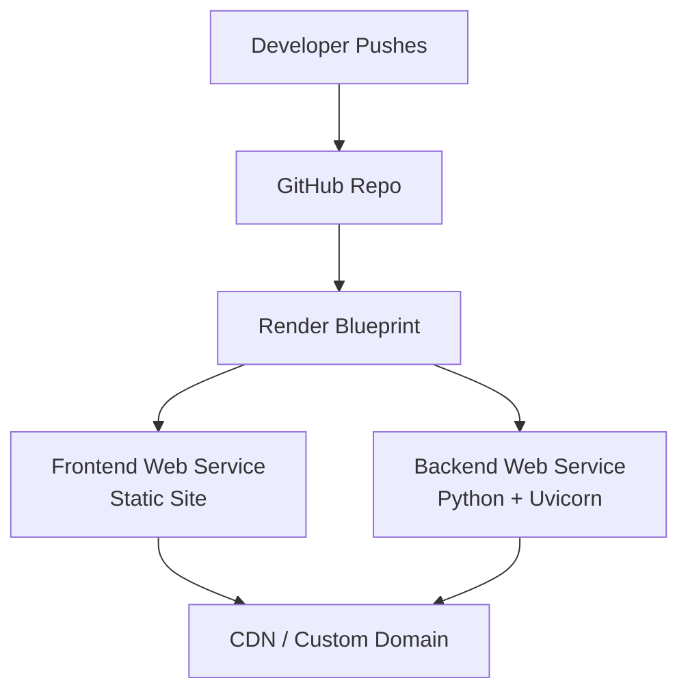
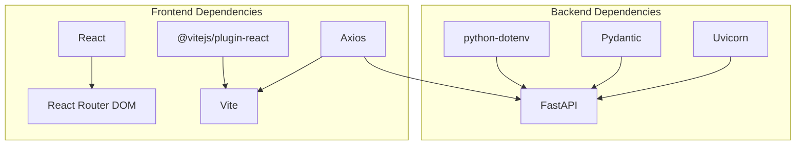

# Architecture Overview

<cite>
**Referenced Files in This Document**
- [backend/main.py](file://backend/main.py)
- [backend/routers/items.py](file://backend/routers/items.py)
- [backend/routers/auth.py](file://backend/routers/auth.py)
- [backend/requirements.txt](file://backend/requirements.txt)
- [frontend/src/main.jsx](file://frontend/src/main.jsx)
- [frontend/src/App.jsx](file://frontend/src/App.jsx)
- [frontend/src/pages/Home.jsx](file://frontend/src/pages/Home.jsx)
- [frontend/src/pages/Items.jsx](file://frontend/src/pages/Items.jsx)
- [frontend/src/services/api.js](file://frontend/src/services/api.js)
- [frontend/vite.config.js](file://frontend/vite.config.js)
- [frontend/package.json](file://frontend/package.json)
- [render.yaml](file://render.yaml)
- [README.md](file://README.md)
</cite>

## Table of Contents
1. [Introduction](#introduction)
2. [Project Structure](#project-structure)
3. [Core Components](#core-components)
4. [Architecture Overview](#architecture-overview)
5. [Detailed Component Analysis](#detailed-component-analysis)
6. [Dependency Analysis](#dependency-analysis)
7. [Performance Considerations](#performance-considerations)
8. [Troubleshooting Guide](#troubleshooting-guide)
9. [Conclusion](#conclusion)
10. [Appendices](#appendices)

## Introduction
This document describes the system architecture of ishwarambare-app, a full-stack application combining a FastAPI backend and a React frontend. It explains the separation of concerns across presentation, business logic, and data layers, documents the MVC-like roles of FastAPI routers as controllers, React components as views, and Pydantic models as data structures, and outlines the cloud-native deployment topology on the Render platform. It also covers CORS configuration, proxy setup for local development, and scalability considerations.

## Project Structure
The repository follows a clear separation between a Python FastAPI backend and a React/Vite frontend, with a shared deployment blueprint for Render.

**Diagram sources**
- [backend/main.py:1-44](file://backend/main.py#L1-L44)
- [backend/routers/items.py:1-72](file://backend/routers/items.py#L1-L72)
- [backend/routers/auth.py:1-39](file://backend/routers/auth.py#L1-L39)
- [frontend/src/main.jsx:1-11](file://frontend/src/main.jsx#L1-L11)
- [frontend/src/App.jsx:1-19](file://frontend/src/App.jsx#L1-L19)
- [frontend/src/pages/Home.jsx:1-63](file://frontend/src/pages/Home.jsx#L1-L63)
- [frontend/src/pages/Items.jsx:1-125](file://frontend/src/pages/Items.jsx#L1-L125)
- [frontend/src/services/api.js:1-29](file://frontend/src/services/api.js#L1-L29)
- [frontend/vite.config.js:1-23](file://frontend/vite.config.js#L1-L23)
- [render.yaml:1-48](file://render.yaml#L1-L48)

**Section sources**
- [README.md:5-25](file://README.md#L5-L25)
- [backend/main.py:1-44](file://backend/main.py#L1-L44)
- [frontend/src/App.jsx:1-19](file://frontend/src/App.jsx#L1-L19)

## Core Components
- Backend (FastAPI)
  - Application entrypoint and middleware configuration
  - Routers for items and authentication
  - Health checks and root endpoint
- Frontend (React)
  - Application shell with routing
  - Pages for home and items
  - Axios-based service layer for API communication
  - Vite dev server with proxy for API requests
- Deployment (Render)
  - Separate web services for backend and frontend
  - Environment variables for CORS and API base URL
  - Static site publishing and SPA fallback

**Section sources**
- [backend/main.py:10-44](file://backend/main.py#L10-L44)
- [backend/routers/items.py:1-72](file://backend/routers/items.py#L1-L72)
- [backend/routers/auth.py:1-39](file://backend/routers/auth.py#L1-L39)
- [frontend/src/App.jsx:1-19](file://frontend/src/App.jsx#L1-L19)
- [frontend/src/pages/Home.jsx:1-63](file://frontend/src/pages/Home.jsx#L1-L63)
- [frontend/src/pages/Items.jsx:1-125](file://frontend/src/pages/Items.jsx#L1-L125)
- [frontend/src/services/api.js:1-29](file://frontend/src/services/api.js#L1-L29)
- [frontend/vite.config.js:1-23](file://frontend/vite.config.js#L1-L23)
- [render.yaml:4-43](file://render.yaml#L4-L43)

## Architecture Overview
The system follows a client-server pattern with a React SPA frontend and a FastAPI REST backend. The frontend communicates with the backend via HTTP endpoints exposed by the backend. CORS is configured to allow requests from the frontend origin(s). During development, Vite proxies API requests to the backend. On Render, the frontend is served as a static site and the backend is a Python web service.

**Diagram sources**
- [frontend/vite.config.js:7-16](file://frontend/vite.config.js#L7-L16)
- [backend/main.py:16-28](file://backend/main.py#L16-L28)
- [backend/main.py:30-32](file://backend/main.py#L30-L32)
- [backend/routers/items.py:1-72](file://backend/routers/items.py#L1-L72)
- [backend/routers/auth.py:1-39](file://backend/routers/auth.py#L1-L39)
- [render.yaml:4-43](file://render.yaml#L4-L43)

## Detailed Component Analysis

### Backend: FastAPI Application
- Entry point and app configuration
  - Initializes FastAPI with metadata and registers routers under API prefixes.
  - Defines root and health endpoints for monitoring and discovery.
- CORS middleware
  - Configured via environment variable for allowed origins.
  - Allows credentials, headers, and methods for cross-origin requests.
- Routers
  - Items router: CRUD endpoints backed by an in-memory list.
  - Auth router: Login endpoint returning a demo token and a stub user info endpoint.

**Diagram sources**
- [frontend/vite.config.js:9-16](file://frontend/vite.config.js#L9-L16)
- [backend/main.py:16-28](file://backend/main.py#L16-L28)
- [backend/main.py:30-32](file://backend/main.py#L30-L32)
- [backend/routers/items.py:36-39](file://backend/routers/items.py#L36-L39)
- [backend/routers/auth.py:18-32](file://backend/routers/auth.py#L18-L32)

**Section sources**
- [backend/main.py:10-44](file://backend/main.py#L10-L44)
- [backend/routers/items.py:1-72](file://backend/routers/items.py#L1-L72)
- [backend/routers/auth.py:1-39](file://backend/routers/auth.py#L1-L39)

### Frontend: React Application
- Application shell and routing
  - Uses React Router to manage routes for home, items, and about pages.
- Pages
  - Home page: performs a health check against the backend and displays status.
  - Items page: lists items, allows adding new items, and deleting existing ones.
- Services
  - Axios-based API client with dynamic base URL from environment.
  - Request interceptor attaches a Bearer token from local storage if present.
  - Exposes convenience functions for items and auth endpoints.
- Development proxy
  - Proxies API requests to the backend during development.

**Diagram sources**
- [frontend/src/pages/Home.jsx:17-21](file://frontend/src/pages/Home.jsx#L17-L21)
- [frontend/src/pages/Items.jsx:13-23](file://frontend/src/pages/Items.jsx#L13-L23)
- [frontend/src/pages/Items.jsx:32-46](file://frontend/src/pages/Items.jsx#L32-L46)
- [frontend/src/services/api.js:15-26](file://frontend/src/services/api.js#L15-L26)
- [backend/main.py:41-43](file://backend/main.py#L41-L43)
- [backend/routers/items.py:36-59](file://backend/routers/items.py#L36-L59)

**Section sources**
- [frontend/src/App.jsx:1-19](file://frontend/src/App.jsx#L1-L19)
- [frontend/src/pages/Home.jsx:1-63](file://frontend/src/pages/Home.jsx#L1-L63)
- [frontend/src/pages/Items.jsx:1-125](file://frontend/src/pages/Items.jsx#L1-L125)
- [frontend/src/services/api.js:1-29](file://frontend/src/services/api.js#L1-L29)
- [frontend/vite.config.js:7-16](file://frontend/vite.config.js#L7-L16)

### Data Models and Pydantic Schemas
- Items model
  - Represents persisted item records with typed fields.
- Create schema
  - Used for validating incoming creation payloads.
- Auth models
  - Login request and response models for authentication.

**Diagram sources**
- [backend/routers/items.py:9-22](file://backend/routers/items.py#L9-L22)
- [backend/routers/auth.py:7-16](file://backend/routers/auth.py#L7-L16)

**Section sources**
- [backend/routers/items.py:9-22](file://backend/routers/items.py#L9-L22)
- [backend/routers/auth.py:7-16](file://backend/routers/auth.py#L7-L16)

### MVC Pattern Implementation
- Controllers (FastAPI routers)
  - Define endpoints and orchestrate business logic.
- Views (React components)
  - Present data and collect user input.
- Data structures (Pydantic models)
  - Enforce schema validation and serialization.

**Diagram sources**
- [frontend/src/pages/Home.jsx:1-63](file://frontend/src/pages/Home.jsx#L1-L63)
- [frontend/src/pages/Items.jsx:1-125](file://frontend/src/pages/Items.jsx#L1-L125)
- [backend/routers/items.py:1-72](file://backend/routers/items.py#L1-L72)
- [backend/routers/auth.py:1-39](file://backend/routers/auth.py#L1-L39)

**Section sources**
- [backend/routers/items.py:1-72](file://backend/routers/items.py#L1-L72)
- [backend/routers/auth.py:1-39](file://backend/routers/auth.py#L1-L39)
- [frontend/src/pages/Home.jsx:1-63](file://frontend/src/pages/Home.jsx#L1-L63)
- [frontend/src/pages/Items.jsx:1-125](file://frontend/src/pages/Items.jsx#L1-L125)

### Cloud-Native Deployment on Render
- Backend service
  - Python runtime, health check path, environment variables for CORS and secrets.
  - Starts with Uvicorn on the Render-assigned PORT.
- Frontend service
  - Static site publishing from dist, SPA fallback rewrite, and cache-control header.
  - Environment variable sets the API base URL to the backend service URL.
- Custom domain
  - Instructions for adding domains and DNS configuration.

**Diagram sources**
- [render.yaml:4-43](file://render.yaml#L4-L43)

**Section sources**
- [render.yaml:4-43](file://render.yaml#L4-L43)
- [README.md:78-108](file://README.md#L78-L108)

## Dependency Analysis
- Backend dependencies
  - FastAPI, Uvicorn, Pydantic, python-dotenv, and HTTP libraries.
- Frontend dependencies
  - React, React Router DOM, Axios, Vite, and React plugin.
- Inter-service dependencies
  - Frontend depends on backend endpoints and CORS configuration.
  - Backend depends on environment variables for CORS origins.

**Diagram sources**
- [backend/requirements.txt:1-20](file://backend/requirements.txt#L1-L20)
- [frontend/package.json:11-22](file://frontend/package.json#L11-L22)

**Section sources**
- [backend/requirements.txt:1-20](file://backend/requirements.txt#L1-L20)
- [frontend/package.json:11-22](file://frontend/package.json#L11-L22)

## Performance Considerations
- Backend
  - Async endpoints enable efficient I/O-bound operations.
  - In-memory data store is suitable for demos; replace with a persistent database for production.
- Frontend
  - Axios caching is not enabled; consider adding caching strategies for repeated reads.
  - SPA routing avoids full page reloads, improving perceived performance.
- Network
  - CORS configuration should restrict origins to production domains in production.
  - Proxy in development reduces cross-origin complexity.

[No sources needed since this section provides general guidance]

## Troubleshooting Guide
- CORS errors
  - Ensure ALLOWED_ORIGINS includes the frontend origin(s).
  - Verify environment variables match the deployed domains.
- API base URL mismatch
  - Confirm VITE_API_URL points to the backend service URL on Render.
- Health check failures
  - Check backend health endpoint availability and logs.
- Authentication
  - Demo login credentials are embedded; replace with secure authentication and token storage.

**Section sources**
- [backend/main.py:17-28](file://backend/main.py#L17-L28)
- [frontend/src/services/api.js:3-6](file://frontend/src/services/api.js#L3-L6)
- [frontend/src/pages/Home.jsx:17-21](file://frontend/src/pages/Home.jsx#L17-L21)
- [backend/routers/auth.py:24-32](file://backend/routers/auth.py#L24-L32)

## Conclusion
ishwarambare-app demonstrates a clean separation between a FastAPI backend and a React frontend, with CORS and proxy configurations enabling seamless development and deployment. The architecture leverages FastAPI’s async capabilities, Pydantic for robust data modeling, and Render for straightforward cloud-native deployment. For production, consider replacing the in-memory store with a persistent database, securing authentication, and optimizing caching and error handling.

[No sources needed since this section summarizes without analyzing specific files]

## Appendices

### Technology Stack Decisions and Trade-offs
- FastAPI + Uvicorn
  - Pros: excellent performance, automatic OpenAPI docs, strong typing.
  - Trade-off: requires careful environment configuration for CORS and secrets.
- React + Vite
  - Pros: fast dev server, modern DX, SPA with routing.
  - Trade-off: SPA fallback and static hosting require careful configuration.
- Render
  - Pros: simple deployment via blueprint, static site hosting, custom domains.
  - Trade-off: free tier limitations; consider upgrading for production traffic.

**Section sources**
- [backend/requirements.txt:1-20](file://backend/requirements.txt#L1-L20)
- [frontend/package.json:11-22](file://frontend/package.json#L11-L22)
- [render.yaml:4-43](file://render.yaml#L4-L43)

### API Endpoint Reference
- Root: GET /
- Health: GET /health
- Items: GET /api/items/, GET /api/items/{id}, POST /api/items/, DELETE /api/items/{id}
- Auth: POST /api/auth/login, GET /api/auth/me

**Section sources**
- [backend/main.py:36-43](file://backend/main.py#L36-L43)
- [backend/routers/items.py:36-71](file://backend/routers/items.py#L36-L71)
- [backend/routers/auth.py:18-38](file://backend/routers/auth.py#L18-L38)
- [README.md:111-122](file://README.md#L111-L122)