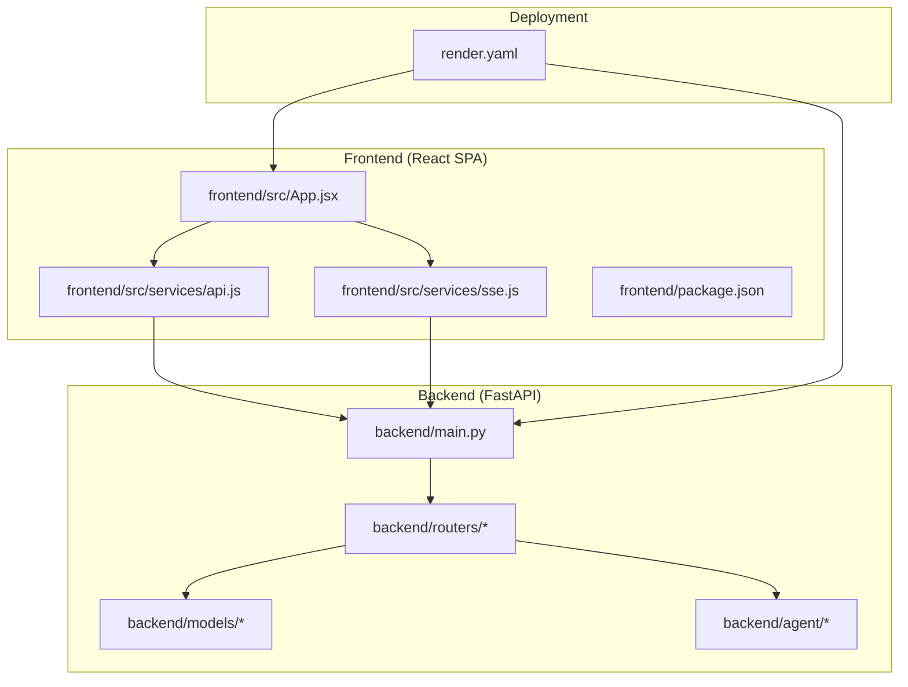
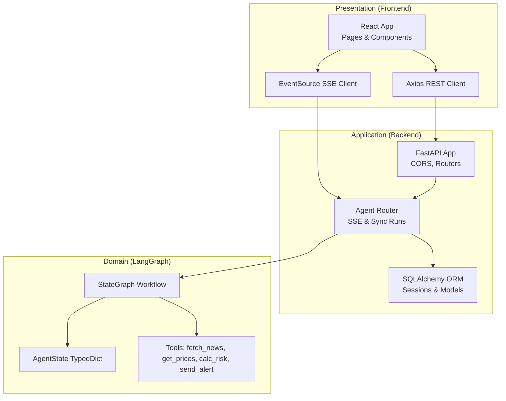
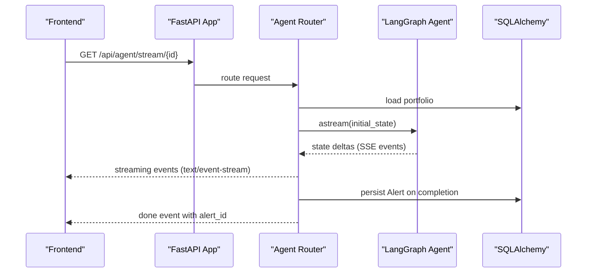
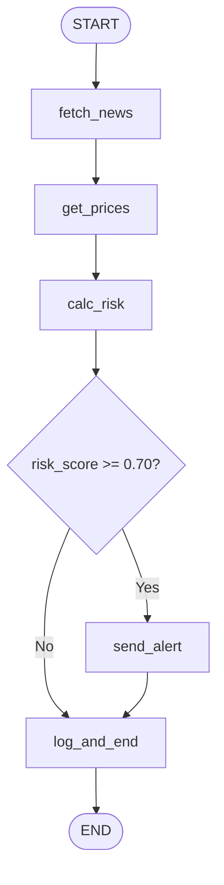
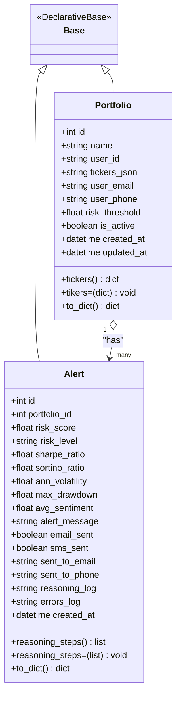
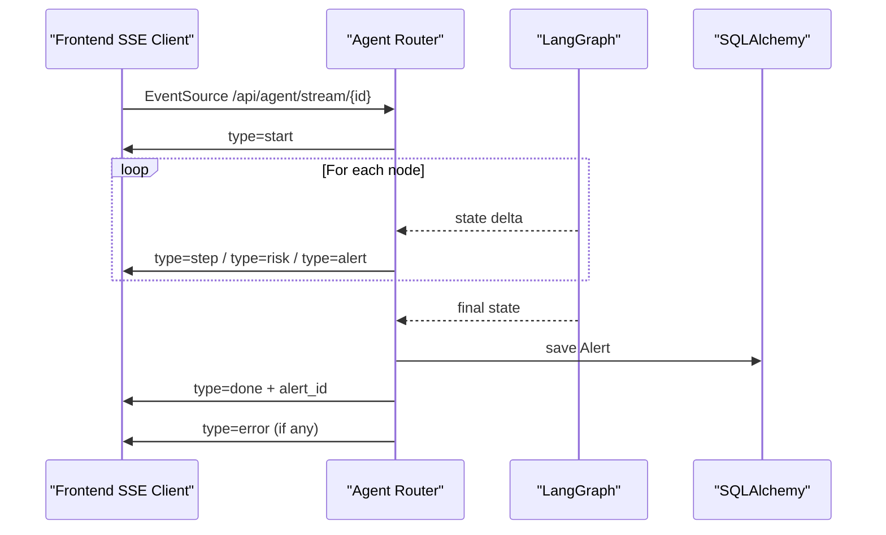
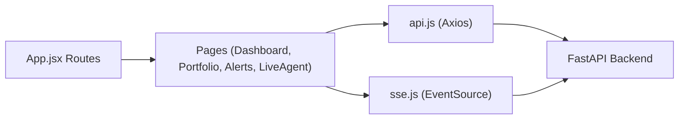
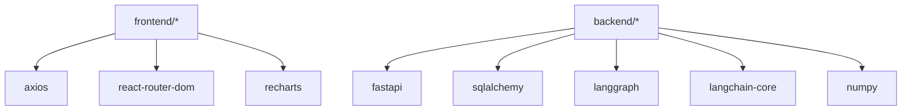
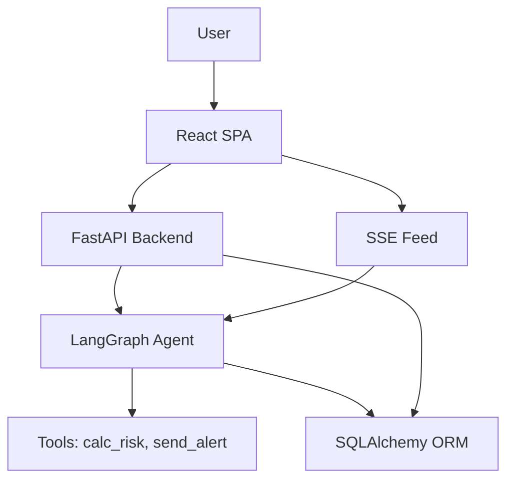

# Architecture Overview

<cite>
**Referenced Files in This Document**
- [backend/main.py](file://backend/main.py)
- [backend/routers/agent.py](file://backend/routers/agent.py)
- [backend/models/database.py](file://backend/models/database.py)
- [backend/models/portfolio.py](file://backend/models/portfolio.py)
- [backend/models/alert.py](file://backend/models/alert.py)
- [backend/agent/graph.py](file://backend/agent/graph.py)
- [backend/agent/state.py](file://backend/agent/state.py)
- [backend/agent/tools/calc_risk.py](file://backend/agent/tools/calc_risk.py)
- [backend/agent/tools/send_alert.py](file://backend/agent/tools/send_alert.py)
- [frontend/src/App.jsx](file://frontend/src/App.jsx)
- [frontend/src/services/api.js](file://frontend/src/services/api.js)
- [frontend/src/services/sse.js](file://frontend/src/services/sse.js)
- [frontend/package.json](file://frontend/package.json)
- [render.yaml](file://render.yaml)
- [README.md](file://README.md)
</cite>

## Table of Contents
1. [Introduction](#introduction)
2. [Project Structure](#project-structure)
3. [Core Components](#core-components)
4. [Architecture Overview](#architecture-overview)
5. [Detailed Component Analysis](#detailed-component-analysis)
6. [Dependency Analysis](#dependency-analysis)
7. [Performance Considerations](#performance-considerations)
8. [Troubleshooting Guide](#troubleshooting-guide)
9. [Conclusion](#conclusion)
10. [Appendices](#appendices)

## Introduction
This document describes the system architecture of ishwarambare-app, a full-stack financial portfolio risk analysis platform. The backend is a FastAPI application powered by LangGraph for AI-driven agent workflows, SQLAlchemy for ORM, and Server-Sent Events (SSE) for real-time streaming. The frontend is a React SPA using Vite for development and static hosting for production. The system integrates portfolio management, AI risk analysis, alert dispatching, and user interfaces, deployed as separate services on Render with a clear separation of concerns.

## Project Structure
The repository is organized into two primary areas:
- backend: FastAPI application with routers, models, agent workflows, and tools.
- frontend: React SPA with routing, services for API and SSE, and UI components.

**Diagram sources**
- [backend/main.py:1-59](file://backend/main.py#L1-L59)
- [backend/routers/agent.py:1-243](file://backend/routers/agent.py#L1-L243)
- [backend/models/database.py:1-42](file://backend/models/database.py#L1-L42)
- [backend/agent/graph.py:1-243](file://backend/agent/graph.py#L1-L243)
- [frontend/src/App.jsx:1-21](file://frontend/src/App.jsx#L1-L21)
- [frontend/src/services/api.js:1-35](file://frontend/src/services/api.js#L1-L35)
- [frontend/src/services/sse.js:1-63](file://frontend/src/services/sse.js#L1-L63)
- [render.yaml:1-48](file://render.yaml#L1-L48)

**Section sources**
- [README.md:5-25](file://README.md#L5-L25)
- [render.yaml:1-48](file://render.yaml#L1-L48)

## Core Components
- FastAPI Application: Central API server with CORS middleware, router registration, and health endpoints.
- Agent Workflow (LangGraph): A stateful pipeline orchestrating news fetching, price retrieval, risk calculation, and optional alert dispatching.
- Database Layer (SQLAlchemy): ORM models for portfolios and alerts, with a dependency-injected session factory.
- Frontend SPA (React + Vite): Pages and components for dashboard, portfolio, alerts, and live agent feed, with Axios for REST and EventSource for SSE.
- Deployment (Render): Separate backend and frontend services with environment variables and custom domain support.

**Section sources**
- [backend/main.py:12-59](file://backend/main.py#L12-L59)
- [backend/agent/graph.py:1-243](file://backend/agent/graph.py#L1-L243)
- [backend/models/database.py:1-42](file://backend/models/database.py#L1-L42)
- [frontend/src/App.jsx:1-21](file://frontend/src/App.jsx#L1-L21)
- [frontend/src/services/api.js:1-35](file://frontend/src/services/api.js#L1-L35)
- [frontend/src/services/sse.js:1-63](file://frontend/src/services/sse.js#L1-L63)
- [render.yaml:1-48](file://render.yaml#L1-L48)

## Architecture Overview
The system follows a clean architecture pattern with clear separation of concerns:
- Presentation Layer: React SPA handles UI and user interactions.
- Application Layer: FastAPI routers orchestrate requests and delegate to the agent workflow.
- Domain Layer: LangGraph defines the agent’s state machine and decision logic.
- Infrastructure Layer: SQLAlchemy models abstract the database, and SSE provides real-time updates.

**Diagram sources**
- [backend/main.py:12-59](file://backend/main.py#L12-L59)
- [backend/routers/agent.py:1-243](file://backend/routers/agent.py#L1-L243)
- [backend/models/database.py:1-42](file://backend/models/database.py#L1-L42)
- [backend/agent/graph.py:1-243](file://backend/agent/graph.py#L1-L243)
- [backend/agent/state.py:1-58](file://backend/agent/state.py#L1-L58)
- [backend/agent/tools/calc_risk.py:1-255](file://backend/agent/tools/calc_risk.py#L1-L255)
- [backend/agent/tools/send_alert.py:1-231](file://backend/agent/tools/send_alert.py#L1-L231)
- [frontend/src/services/api.js:1-35](file://frontend/src/services/api.js#L1-L35)
- [frontend/src/services/sse.js:1-63](file://frontend/src/services/sse.js#L1-L63)

## Detailed Component Analysis

### Backend API Gateway Pattern (FastAPI)
- CORS configuration allows all origins for SSE compatibility and restricts headers/methods via environment variables.
- Routers are mounted under /api/* prefixes for Items, Auth, Portfolio, Agent, and Alerts.
- Health checks expose root and /health endpoints.

**Diagram sources**
- [backend/main.py:18-43](file://backend/main.py#L18-L43)
- [backend/routers/agent.py:39-168](file://backend/routers/agent.py#L39-L168)
- [backend/agent/graph.py:162-203](file://backend/agent/graph.py#L162-L203)
- [backend/models/database.py:29-35](file://backend/models/database.py#L29-L35)

**Section sources**
- [backend/main.py:18-43](file://backend/main.py#L18-L43)
- [backend/routers/agent.py:39-168](file://backend/routers/agent.py#L39-L168)

### Agent Workflow (LangGraph)
- State machine with four nodes: fetch_news, get_prices, calc_risk, send_alert, and log_and_end.
- Conditional edge routes based on risk_score threshold.
- Uses astream to emit state deltas for SSE streaming.
- Initial state factory constructs AgentState with portfolio, user contact info, and audit trail.

**Diagram sources**
- [backend/agent/graph.py:6-20](file://backend/agent/graph.py#L6-L20)
- [backend/agent/graph.py:146-155](file://backend/agent/graph.py#L146-L155)
- [backend/agent/state.py:28-58](file://backend/agent/state.py#L28-L58)

**Section sources**
- [backend/agent/graph.py:1-243](file://backend/agent/graph.py#L1-L243)
- [backend/agent/state.py:1-58](file://backend/agent/state.py#L1-L58)

### Database Layer Abstraction (SQLAlchemy)
- Engine and session factory configured with SQLite by default and optional PostgreSQL via DATABASE_URL.
- Portfolio and Alert models define persisted entities and helper properties for JSON serialization.
- Dependency injection via get_db ensures per-request sessions and proper cleanup.

**Diagram sources**
- [backend/models/database.py:25-36](file://backend/models/database.py#L25-L36)
- [backend/models/portfolio.py:16-63](file://backend/models/portfolio.py#L16-L63)
- [backend/models/alert.py:14-77](file://backend/models/alert.py#L14-L77)

**Section sources**
- [backend/models/database.py:1-42](file://backend/models/database.py#L1-L42)
- [backend/models/portfolio.py:1-63](file://backend/models/portfolio.py#L1-L63)
- [backend/models/alert.py:1-77](file://backend/models/alert.py#L1-L77)

### Real-Time Communication via Server-Sent Events (SSE)
- SSE endpoint streams structured events to the client: start, step, risk, alert, done, error.
- EventSource wrapper in the frontend listens for messages and invokes callbacks.
- Executor-based persistence avoids blocking the async event loop.

**Diagram sources**
- [backend/routers/agent.py:39-168](file://backend/routers/agent.py#L39-L168)
- [frontend/src/services/sse.js:21-62](file://frontend/src/services/sse.js#L21-L62)

**Section sources**
- [backend/routers/agent.py:39-168](file://backend/routers/agent.py#L39-L168)
- [frontend/src/services/sse.js:1-63](file://frontend/src/services/sse.js#L1-L63)

### Frontend SPA and Services
- React Router manages routes for Dashboard, Portfolio, Alerts, and Live Agent.
- Axios-based API client encapsulates REST endpoints for portfolios and agent status.
- SSE client wraps EventSource for connecting to the agent stream and handling lifecycle events.

**Diagram sources**
- [frontend/src/App.jsx:1-21](file://frontend/src/App.jsx#L1-L21)
- [frontend/src/services/api.js:1-35](file://frontend/src/services/api.js#L1-L35)
- [frontend/src/services/sse.js:1-63](file://frontend/src/services/sse.js#L1-L63)

**Section sources**
- [frontend/src/App.jsx:1-21](file://frontend/src/App.jsx#L1-L21)
- [frontend/src/services/api.js:1-35](file://frontend/src/services/api.js#L1-L35)
- [frontend/src/services/sse.js:1-63](file://frontend/src/services/sse.js#L1-L63)

### Technology Stack Choices and Compatibility
- Backend: FastAPI (Python 3.14+), Uvicorn, SQLAlchemy, LangGraph, SendGrid/Twilio for alerts.
- Frontend: React 18, Vite, Axios, Recharts, react-router-dom.
- Deployment: Render with separate web services for backend and frontend, static publishing for React.

**Section sources**
- [README.md:31-34](file://README.md#L31-L34)
- [README.md:86-93](file://README.md#L86-L93)
- [frontend/package.json:11-26](file://frontend/package.json#L11-L26)
- [render.yaml:1-48](file://render.yaml#L1-L48)

## Dependency Analysis
- Backend depends on SQLAlchemy for ORM, LangGraph for workflow orchestration, and environment variables for configuration.
- Agent tools depend on NumPy and LangChain Core tools for mathematical computations and tool decoration.
- Frontend depends on Axios for HTTP and React ecosystem packages for UI and routing.

**Diagram sources**
- [frontend/package.json:11-26](file://frontend/package.json#L11-L26)
- [backend/agent/tools/calc_risk.py:43-44](file://backend/agent/tools/calc_risk.py#L43-L44)
- [backend/agent/tools/send_alert.py:19-20](file://backend/agent/tools/send_alert.py#L19-L20)

**Section sources**
- [frontend/package.json:11-26](file://frontend/package.json#L11-L26)
- [backend/agent/tools/calc_risk.py:43-44](file://backend/agent/tools/calc_risk.py#L43-L44)
- [backend/agent/tools/send_alert.py:19-20](file://backend/agent/tools/send_alert.py#L19-L20)

## Performance Considerations
- SSE streaming: The agent emits deltas incrementally; a small delay is applied for readability. Consider tuning delays and batching logs for high-frequency runs.
- Database writes: Persisting alerts occurs in a thread executor to avoid blocking the async loop; ensure executor pool sizing aligns with concurrency.
- Concurrency: For multiple concurrent agent executions, scale the backend service horizontally on Render and consider a managed database tier for PostgreSQL in production.
- Frontend rendering: Recharts and lightweight components keep UI responsive; avoid heavy computations in render cycles.

[No sources needed since this section provides general guidance]

## Troubleshooting Guide
- CORS issues: Verify ALLOWED_ORIGINS environment variable matches frontend origin; ensure "*" is acceptable for SSE.
- SSE disconnections: The backend checks for client disconnects and stops streaming gracefully; frontend should reconnect if needed.
- Missing third-party credentials: Alert tools fall back to mock mode when SendGrid/Twilio credentials are absent; confirm environment variables for production.
- Database connectivity: Switch DATABASE_URL to PostgreSQL in production; ensure migrations are handled via create_tables on startup.

**Section sources**
- [backend/main.py:18-30](file://backend/main.py#L18-L30)
- [backend/routers/agent.py:86-90](file://backend/routers/agent.py#L86-L90)
- [backend/agent/tools/send_alert.py:21-42](file://backend/agent/tools/send_alert.py#L21-L42)
- [backend/models/database.py:15-20](file://backend/models/database.py#L15-L20)

## Conclusion
ishwarambare-app applies clean architecture principles with a clear separation between presentation, application, domain, and infrastructure layers. The FastAPI backend leverages LangGraph for AI workflows, SQLAlchemy for persistence, and SSE for real-time feedback. The React frontend delivers a responsive SPA with robust API and SSE clients. Render deployment enforces system boundaries between frontend and backend services, enabling scalable and maintainable operations.

[No sources needed since this section summarizes without analyzing specific files]

## Appendices

### System Context Diagram

[No sources needed since this diagram shows conceptual workflow, not actual code structure]

### Cross-Cutting Concerns
- CORS: Configured broadly for SSE compatibility; restrict origins in production via environment variables.
- Authentication: Auth endpoints are exposed under /api/auth; integrate JWT or session-based auth as needed.
- Real-time streaming: SSE headers disable caching and buffering for Nginx; ensure reverse proxy compatibility.

**Section sources**
- [backend/main.py:18-30](file://backend/main.py#L18-L30)
- [backend/routers/agent.py:160-168](file://backend/routers/agent.py#L160-L168)