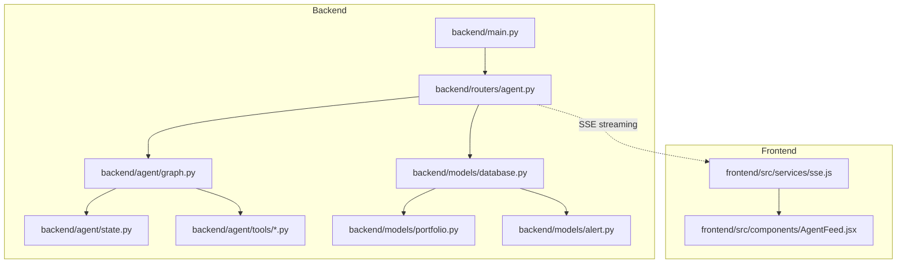
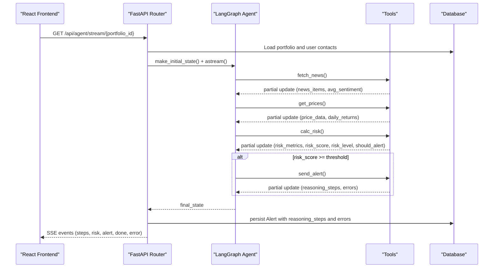
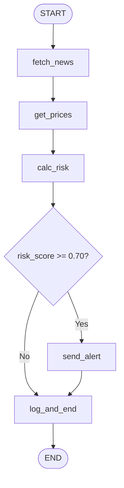
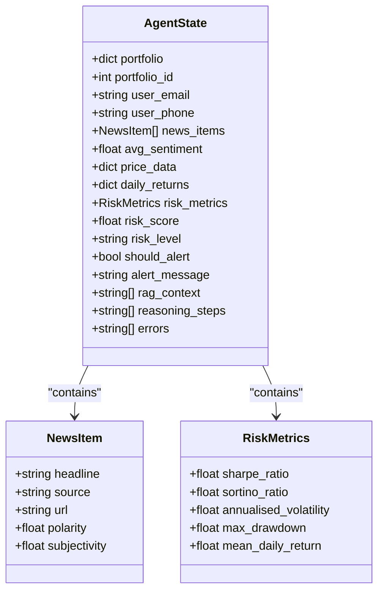
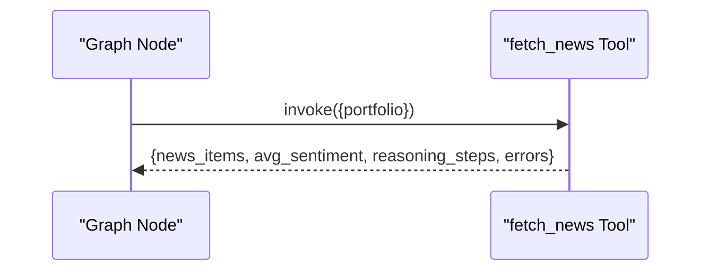
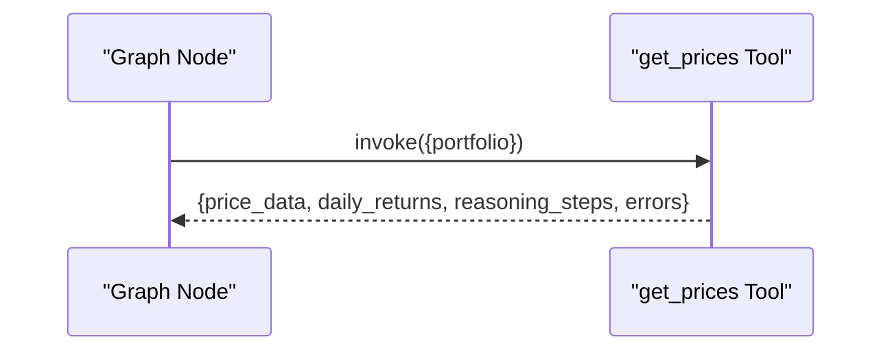
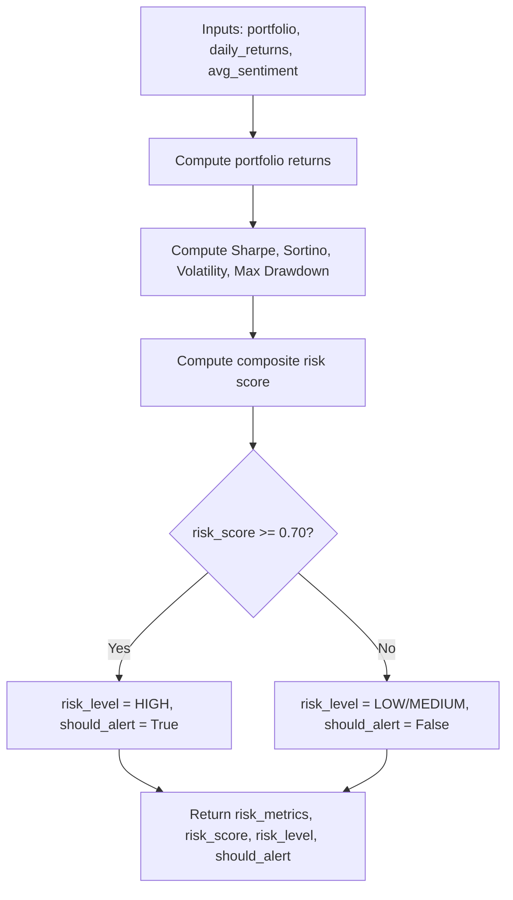
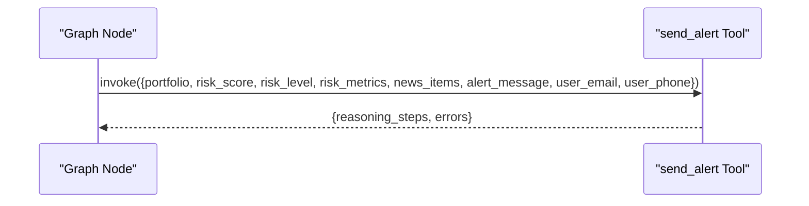
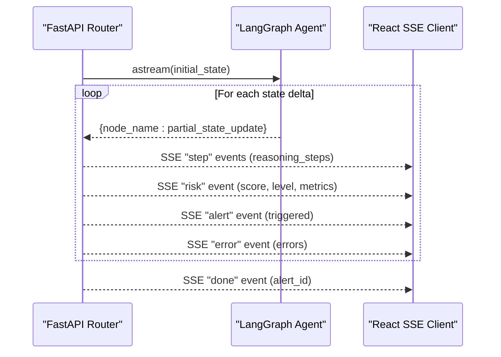
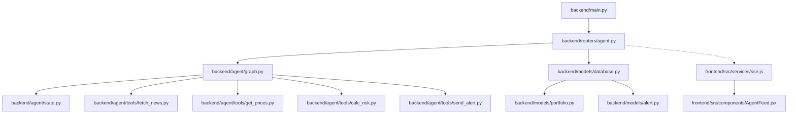

# AI Workflow Engine

<cite>
**Referenced Files in This Document**
- [README.md](file://README.md)
- [backend/main.py](file://backend/main.py)
- [backend/agent/state.py](file://backend/agent/state.py)
- [backend/agent/graph.py](file://backend/agent/graph.py)
- [backend/agent/run_agent.py](file://backend/agent/run_agent.py)
- [backend/agent/tools/fetch_news.py](file://backend/agent/tools/fetch_news.py)
- [backend/agent/tools/get_prices.py](file://backend/agent/tools/get_prices.py)
- [backend/agent/tools/calc_risk.py](file://backend/agent/tools/calc_risk.py)
- [backend/agent/tools/send_alert.py](file://backend/agent/tools/send_alert.py)
- [backend/routers/agent.py](file://backend/routers/agent.py)
- [backend/models/database.py](file://backend/models/database.py)
- [backend/models/portfolio.py](file://backend/models/portfolio.py)
- [backend/models/alert.py](file://backend/models/alert.py)
- [frontend/src/services/sse.js](file://frontend/src/services/sse.js)
- [frontend/src/components/AgentFeed.jsx](file://frontend/src/components/AgentFeed.jsx)
</cite>

## Table of Contents
1. [Introduction](#introduction)
2. [Project Structure](#project-structure)
3. [Core Components](#core-components)
4. [Architecture Overview](#architecture-overview)
5. [Detailed Component Analysis](#detailed-component-analysis)
6. [Dependency Analysis](#dependency-analysis)
7. [Performance Considerations](#performance-considerations)
8. [Troubleshooting Guide](#troubleshooting-guide)
9. [Conclusion](#conclusion)
10. [Appendices](#appendices)

## Introduction
This document describes a LangGraph-based AI workflow engine that orchestrates a portfolio risk analysis pipeline. The system is composed of a StateGraph with four nodes: fetch news, get prices, calculate risk, and conditional alert dispatch. It integrates external APIs for news sentiment and market prices, computes quantitative risk metrics, and streams real-time updates to a React frontend via Server-Sent Events (SSE). The engine supports deterministic alert routing, robust fallbacks, and persistence of results and logs.

## Project Structure
The repository follows a layered structure:
- Backend: FastAPI application, LangGraph agent, tools, routers, and SQLAlchemy models
- Frontend: React components and services for SSE streaming and UI rendering
- Deployment: Render configuration and environment guidance

**Diagram sources**
- [backend/main.py:12-43](file://backend/main.py#L12-L43)
- [backend/agent/graph.py:162-203](file://backend/agent/graph.py#L162-L203)
- [backend/routers/agent.py:39-168](file://backend/routers/agent.py#L39-L168)
- [backend/models/database.py:38-42](file://backend/models/database.py#L38-L42)

**Section sources**
- [README.md:1-129](file://README.md#L1-L129)
- [backend/main.py:12-43](file://backend/main.py#L12-L43)

## Core Components
- AgentState: Typed dictionary defining the shared state across nodes, including portfolio inputs, fetched news, price history, computed risk metrics, decision flags, and audit trails.
- StateGraph: Defines the linear workflow (news → prices → risk) plus a conditional edge to alert dispatch based on a numeric threshold.
- Tools: Independent, pluggable functions implementing news fetching, price retrieval, risk calculation, and alert delivery.
- Routers: Expose SSE streaming and synchronous endpoints to trigger runs and persist results.
- Models: Store portfolios and alerts, including reasoning logs and error logs.

**Section sources**
- [backend/agent/state.py:28-58](file://backend/agent/state.py#L28-L58)
- [backend/agent/graph.py:162-203](file://backend/agent/graph.py#L162-L203)
- [backend/routers/agent.py:39-168](file://backend/routers/agent.py#L39-L168)
- [backend/models/portfolio.py:16-63](file://backend/models/portfolio.py#L16-L63)
- [backend/models/alert.py:14-77](file://backend/models/alert.py#L14-L77)

## Architecture Overview
The workflow is a deterministic pipeline orchestrated by LangGraph:
- Initial state is constructed from a portfolio and optional user contact info.
- Nodes execute sequentially, each returning a partial state update merged into the shared state.
- After risk computation, a conditional edge routes to alert dispatch only when risk exceeds a threshold.
- Final state is persisted to the database and streamed to the frontend via SSE.

**Diagram sources**
- [backend/routers/agent.py:39-168](file://backend/routers/agent.py#L39-L168)
- [backend/agent/graph.py:45-142](file://backend/agent/graph.py#L45-L142)
- [backend/agent/tools/fetch_news.py:99-164](file://backend/agent/tools/fetch_news.py#L99-L164)
- [backend/agent/tools/get_prices.py:84-139](file://backend/agent/tools/get_prices.py#L84-L139)
- [backend/agent/tools/calc_risk.py:149-255](file://backend/agent/tools/calc_risk.py#L149-L255)
- [backend/agent/tools/send_alert.py:157-231](file://backend/agent/tools/send_alert.py#L157-L231)

## Detailed Component Analysis

### StateGraph and Node-Based Processing
- Nodes are plain async functions receiving the full AgentState and returning a partial update. LangGraph merges updates automatically.
- Execution order: fetch_news → get_prices → calc_risk → conditional edge → send_alert/log_and_end.
- The conditional edge evaluates a numeric threshold on risk_score to decide whether to send an alert.

**Diagram sources**
- [backend/agent/graph.py:171-199](file://backend/agent/graph.py#L171-L199)
- [backend/agent/graph.py:146-156](file://backend/agent/graph.py#L146-L156)

**Section sources**
- [backend/agent/graph.py:45-142](file://backend/agent/graph.py#L45-L142)
- [backend/agent/graph.py:146-156](file://backend/agent/graph.py#L146-L156)

### AgentState Definition and Data Flow
- AgentState is a TypedDict that standardizes the shared state across nodes.
- Each tool appends reasoning steps and aggregates errors; the graph merges updates and propagates them forward.
- The state includes portfolio metadata, fetched news, price history, computed risk metrics, decision flags, and audit trails.

**Diagram sources**
- [backend/agent/state.py:28-58](file://backend/agent/state.py#L28-L58)

**Section sources**
- [backend/agent/state.py:28-58](file://backend/agent/state.py#L28-L58)

### Tool: fetch_news
- Fetches recent financial news for each ticker in the portfolio.
- Uses NewsAPI when available; falls back to mock headlines otherwise.
- Computes average sentiment and logs top bearish headlines for context.
- Returns a partial update including news_items and avg_sentiment.

**Diagram sources**
- [backend/agent/graph.py:45-54](file://backend/agent/graph.py#L45-L54)
- [backend/agent/tools/fetch_news.py:99-164](file://backend/agent/tools/fetch_news.py#L99-L164)

**Section sources**
- [backend/agent/tools/fetch_news.py:99-164](file://backend/agent/tools/fetch_news.py#L99-L164)

### Tool: get_prices
- Downloads 1-year daily close prices for each ticker using yfinance.
- Provides synthetic price generation via geometric Brownian motion when offline or when yfinance is unavailable.
- Computes daily returns and logs summary statistics per ticker.

**Diagram sources**
- [backend/agent/graph.py:57-66](file://backend/agent/graph.py#L57-L66)
- [backend/agent/tools/get_prices.py:84-139](file://backend/agent/tools/get_prices.py#L84-L139)

**Section sources**
- [backend/agent/tools/get_prices.py:84-139](file://backend/agent/tools/get_prices.py#L84-L139)

### Tool: calc_risk
- Computes Sharpe, Sortino, annualized volatility, and max drawdown for the portfolio.
- Builds a composite risk score combining metrics and average sentiment.
- Determines risk level and alert eligibility based on thresholds.

**Diagram sources**
- [backend/agent/tools/calc_risk.py:149-255](file://backend/agent/tools/calc_risk.py#L149-L255)

**Section sources**
- [backend/agent/tools/calc_risk.py:149-255](file://backend/agent/tools/calc_risk.py#L149-L255)

### Tool: send_alert
- Sends an HTML email via SendGrid and optionally an SMS via Twilio when risk is high.
- In mock mode (no credentials), logs alert details to console.
- Aggregates reasoning steps and errors into the state update.

**Diagram sources**
- [backend/agent/graph.py:105-121](file://backend/agent/graph.py#L105-L121)
- [backend/agent/tools/send_alert.py:157-231](file://backend/agent/tools/send_alert.py#L157-L231)

**Section sources**
- [backend/agent/tools/send_alert.py:157-231](file://backend/agent/tools/send_alert.py#L157-L231)

### Workflow Orchestration, Error Handling, and Retry Strategies
- Orchestration: The graph compiles a StateGraph supporting both synchronous invocation and streaming via aiter.
- Error handling: Tools append errors to the state; the router streams errors to the client and persists them with the alert.
- Retry strategies: Tools implement fallbacks (e.g., mock data) when external services fail. The SSE endpoint handles client disconnection gracefully.

**Section sources**
- [backend/agent/graph.py:162-203](file://backend/agent/graph.py#L162-L203)
- [backend/routers/agent.py:76-127](file://backend/routers/agent.py#L76-L127)
- [backend/agent/tools/fetch_news.py:120-130](file://backend/agent/tools/fetch_news.py#L120-L130)
- [backend/agent/tools/get_prices.py:111-116](file://backend/agent/tools/get_prices.py#L111-L116)

### External API Integrations, Data Transformation Pipelines, and Result Aggregation
- NewsAPI integration: Fetches articles and applies TextBlob sentiment; falls back to mock data when unavailable.
- yfinance integration: Retrieves historical prices; falls back to synthetic data via GBM.
- Result aggregation: Each tool returns a partial state update; the graph merges and forwards state deltas.

**Section sources**
- [backend/agent/tools/fetch_news.py:68-96](file://backend/agent/tools/fetch_news.py#L68-L96)
- [backend/agent/tools/get_prices.py:60-82](file://backend/agent/tools/get_prices.py#L60-L82)
- [backend/agent/graph.py:45-121](file://backend/agent/graph.py#L45-L121)

### Streaming Capabilities, Real-Time Updates, and SSE Integration
- SSE endpoint streams reasoning steps, risk metrics, alert triggers, and errors to the frontend.
- The frontend connects via EventSource and renders live updates in a scrolling feed.
- The backend buffers and deduplicates reasoning steps to minimize redundant messages.

**Diagram sources**
- [backend/routers/agent.py:69-122](file://backend/routers/agent.py#L69-L122)
- [frontend/src/services/sse.js:21-62](file://frontend/src/services/sse.js#L21-L62)
- [frontend/src/components/AgentFeed.jsx:48-77](file://frontend/src/components/AgentFeed.jsx#L48-L77)

**Section sources**
- [backend/routers/agent.py:39-168](file://backend/routers/agent.py#L39-L168)
- [frontend/src/services/sse.js:21-62](file://frontend/src/services/sse.js#L21-L62)
- [frontend/src/components/AgentFeed.jsx:28-96](file://frontend/src/components/AgentFeed.jsx#L28-L96)

### Examples of Workflow Customization, Tool Extension, and Performance Optimization
- Customization examples:
  - Adjust thresholds: Modify the high-risk threshold in the graph conditional edge.
  - Extend RAG context: Populate rag_context in initial state and incorporate into reasoning.
  - Add new tools: Define a new async tool function and register it as a node.
- Tool extension ideas:
  - Add correlation analysis between assets.
  - Integrate volatility clustering or regime detection.
  - Incorporate macroeconomic indicators.
- Performance optimization:
  - Parallelize independent tool calls where feasible (current pipeline is sequential).
  - Cache price histories and news results for repeated runs.
  - Tune SSE buffering and throttling to balance responsiveness and bandwidth.

[No sources needed since this section provides general guidance]

## Dependency Analysis
The backend composes LangGraph, FastAPI, SQLAlchemy, and third-party integrations. The frontend consumes SSE endpoints and renders the agent’s reasoning feed.

**Diagram sources**
- [backend/main.py:12-43](file://backend/main.py#L12-L43)
- [backend/routers/agent.py:24-26](file://backend/routers/agent.py#L24-L26)
- [backend/agent/graph.py:28-32](file://backend/agent/graph.py#L28-L32)
- [backend/models/database.py:38-42](file://backend/models/database.py#L38-L42)

**Section sources**
- [backend/main.py:12-43](file://backend/main.py#L12-L43)
- [backend/routers/agent.py:24-26](file://backend/routers/agent.py#L24-L26)
- [backend/agent/graph.py:28-32](file://backend/agent/graph.py#L28-L32)

## Performance Considerations
- Asynchronous streaming: Use astream to emit deltas incrementally, reducing perceived latency.
- Offloading DB writes: Persist results in a separate thread to avoid blocking the event loop.
- Fallback strategies: Synthetic data generation ensures pipeline resilience during network failures.
- Frontend throttling: Introduce small delays in SSE emission to improve readability.

[No sources needed since this section provides general guidance]

## Troubleshooting Guide
- Missing API keys:
  - NewsAPI: Set NEWS_API_KEY or rely on mock mode.
  - SendGrid/Twilio: Configure credentials to enable real delivery; otherwise, alerts are logged in mock mode.
- Network failures:
  - yfinance fallback to GBM prevents stalls; check logs for errors aggregated in state.
- SSE disconnects:
  - The server detects client disconnection and stops streaming; reconnect to resume.
- Persistence errors:
  - DB save failures are caught and reported as SSE error events; inspect alert records for reasoning and errors.

**Section sources**
- [backend/agent/tools/fetch_news.py:120-130](file://backend/agent/tools/fetch_news.py#L120-L130)
- [backend/agent/tools/get_prices.py:111-116](file://backend/agent/tools/get_prices.py#L111-L116)
- [backend/agent/tools/send_alert.py:125-154](file://backend/agent/tools/send_alert.py#L125-L154)
- [backend/routers/agent.py:86-90](file://backend/routers/agent.py#L86-L90)
- [backend/routers/agent.py:155-158](file://backend/routers/agent.py#L155-L158)

## Conclusion
This LangGraph-based workflow engine combines structured numerical risk computation with real-time streaming to deliver actionable insights. Its modular design enables straightforward customization, robust error handling, and scalable integration with external services. The SSE-driven UI provides immediate feedback, while persistence ensures auditability and reproducibility.

[No sources needed since this section summarizes without analyzing specific files]

## Appendices

### Standalone Execution and Debugging
- Run the agent locally to observe reasoning steps and risk outcomes:
  - Use the standalone runner to execute the graph with sample portfolios and print each step.

**Section sources**
- [backend/agent/run_agent.py:46-92](file://backend/agent/run_agent.py#L46-L92)

### Environment and Deployment Notes
- Backend: CORS, database initialization, and router registration are configured in the main application.
- Frontend: SSE client connects to the backend API and renders the agent feed.

**Section sources**
- [backend/main.py:18-43](file://backend/main.py#L18-L43)
- [frontend/src/services/sse.js:19-62](file://frontend/src/services/sse.js#L19-L62)
- [frontend/src/components/AgentFeed.jsx:28-96](file://frontend/src/components/AgentFeed.jsx#L28-L96)