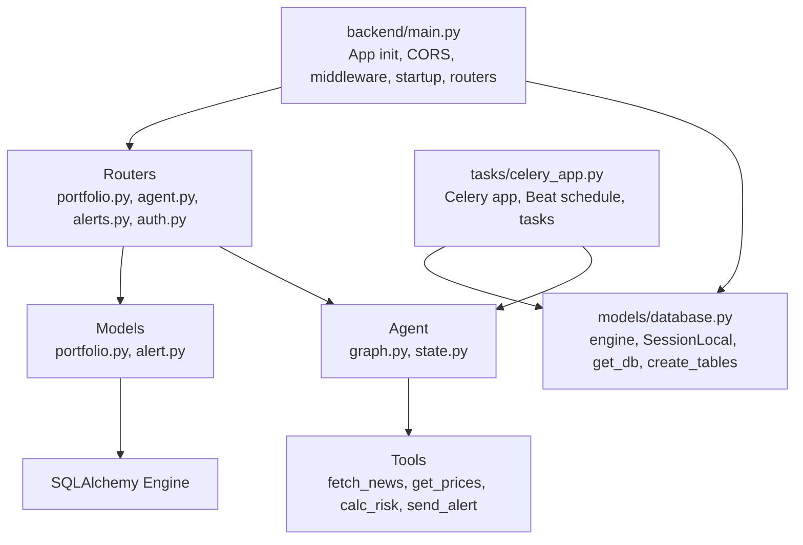
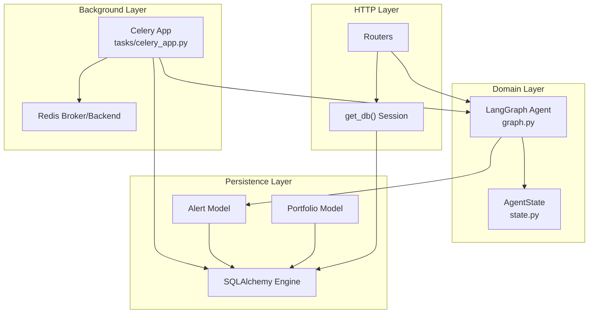
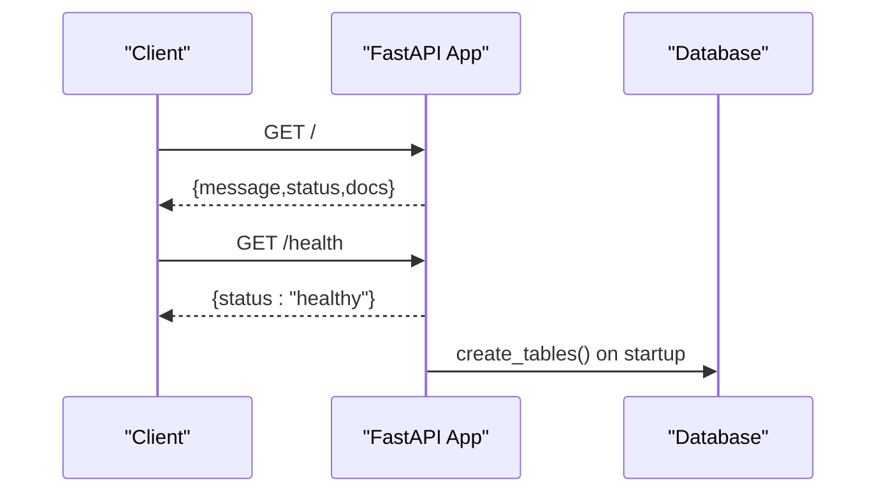
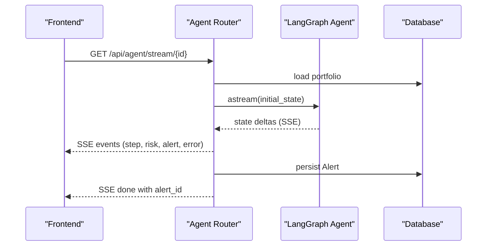
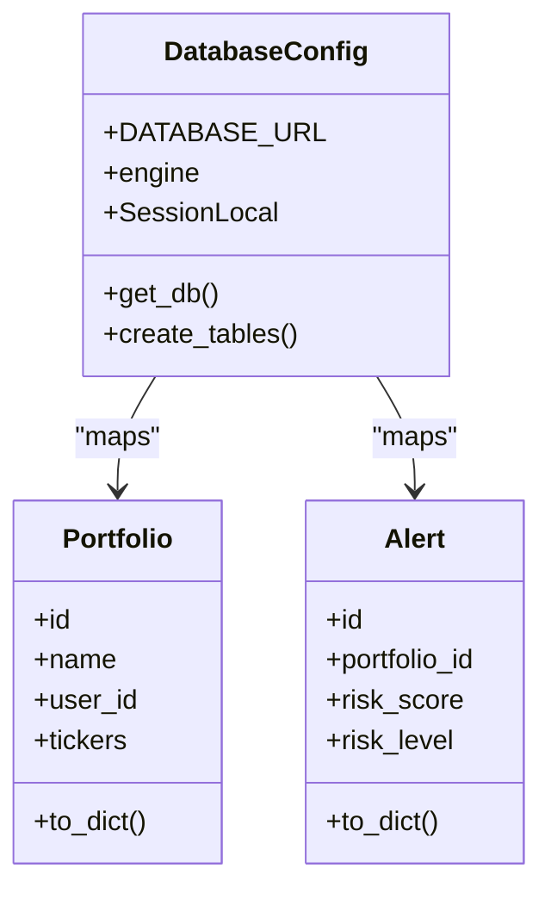
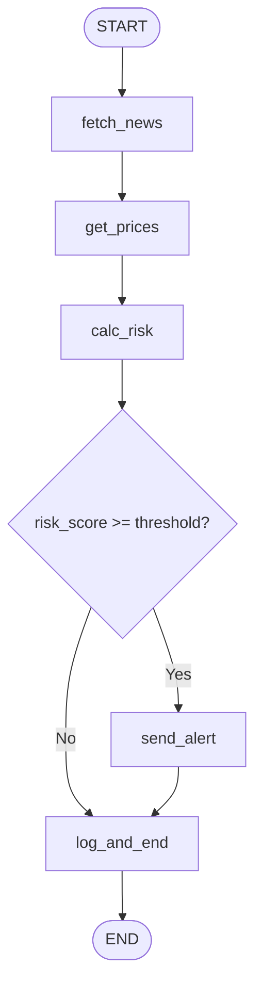
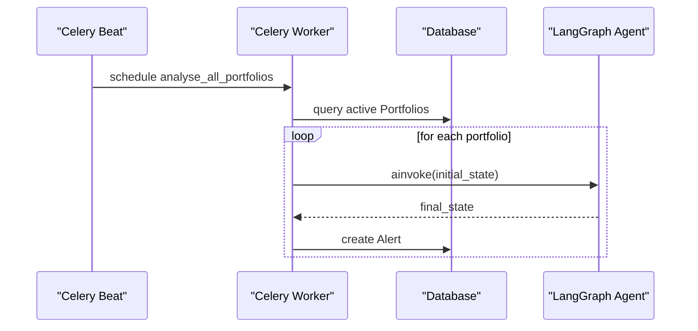
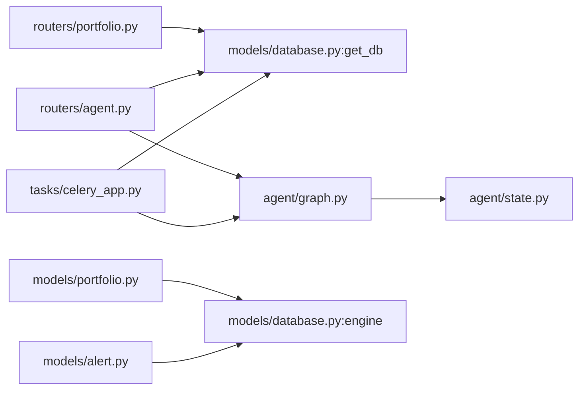

# Backend Architecture

<cite>
**Referenced Files in This Document**
- [backend/main.py](file://backend/main.py)
- [backend/models/database.py](file://backend/models/database.py)
- [backend/routers/portfolio.py](file://backend/routers/portfolio.py)
- [backend/routers/agent.py](file://backend/routers/agent.py)
- [backend/routers/alerts.py](file://backend/routers/alerts.py)
- [backend/routers/auth.py](file://backend/routers/auth.py)
- [backend/agent/graph.py](file://backend/agent/graph.py)
- [backend/agent/state.py](file://backend/agent/state.py)
- [backend/models/portfolio.py](file://backend/models/portfolio.py)
- [backend/models/alert.py](file://backend/models/alert.py)
- [backend/tasks/celery_app.py](file://backend/tasks/celery_app.py)
- [README.md](file://README.md)
</cite>

## Table of Contents
1. [Introduction](#introduction)
2. [Project Structure](#project-structure)
3. [Core Components](#core-components)
4. [Architecture Overview](#architecture-overview)
5. [Detailed Component Analysis](#detailed-component-analysis)
6. [Dependency Analysis](#dependency-analysis)
7. [Performance Considerations](#performance-considerations)
8. [Troubleshooting Guide](#troubleshooting-guide)
9. [Conclusion](#conclusion)
10. [Appendices](#appendices)

## Introduction
This document describes the backend architecture of the ishwarambare-app FastAPI application. It explains the clean architecture separation among routers, models, and services; FastAPI configuration including CORS, middleware, and startup events; routing structure for portfolio management, agent workflow, alert management, and authentication; database abstraction with SQLAlchemy; LangGraph integration for AI workflow orchestration; Celery task queue for background processing; dependency injection patterns; error handling strategies; response serialization; security configurations; logging setup; and performance optimization techniques.

## Project Structure
The backend follows a layered, feature-based organization:
- Application entrypoint initializes FastAPI, CORS, middleware, and registers routers.
- Routers define REST endpoints per feature area.
- Models define SQLAlchemy declarative base and ORM entities.
- Agent module encapsulates LangGraph workflow and tools.
- Tasks module defines Celery application and scheduled jobs.
- Environment variables control runtime behavior (CORS origins, database URL, Redis URL).

**Diagram sources**
- [backend/main.py:12-43](file://backend/main.py#L12-L43)
- [backend/models/database.py:15-41](file://backend/models/database.py#L15-L41)
- [backend/routers/portfolio.py:14-22](file://backend/routers/portfolio.py#L14-L22)
- [backend/routers/agent.py:17-27](file://backend/routers/agent.py#L17-L27)
- [backend/routers/alerts.py:12-19](file://backend/routers/alerts.py#L12-L19)
- [backend/routers/auth.py:1-4](file://backend/routers/auth.py#L1-L4)
- [backend/agent/graph.py:26-34](file://backend/agent/graph.py#L26-L34)
- [backend/agent/state.py:28-58](file://backend/agent/state.py#L28-L58)
- [backend/models/portfolio.py:16-62](file://backend/models/portfolio.py#L16-L62)
- [backend/models/alert.py:14-76](file://backend/models/alert.py#L14-L76)
- [backend/tasks/celery_app.py:35-55](file://backend/tasks/celery_app.py#L35-L55)

**Section sources**
- [backend/main.py:12-59](file://backend/main.py#L12-L59)
- [README.md:5-25](file://README.md#L5-L25)

## Core Components
- FastAPI application initialization with title, description, version, and root/health endpoints.
- CORS middleware configured to allow all origins for SSE compatibility.
- Startup event to create database tables.
- Router registration for items, auth, portfolio, agent, and alerts.
- SQLAlchemy engine and session factory with dependency provider for DI.
- LangGraph StateGraph workflow orchestrating agent nodes and conditional routing.
- Celery application with Redis broker/backend and scheduled daily analysis task.

**Section sources**
- [backend/main.py:12-59](file://backend/main.py#L12-L59)
- [backend/models/database.py:15-41](file://backend/models/database.py#L15-L41)
- [backend/agent/graph.py:162-203](file://backend/agent/graph.py#L162-L203)
- [backend/tasks/celery_app.py:35-135](file://backend/tasks/celery_app.py#L35-L135)

## Architecture Overview
The system implements a clean architecture:
- Routers handle HTTP requests and responses, delegating to domain logic.
- Services are implicit in the form of dependency-injected database sessions and agent graph invocations.
- Models encapsulate persistence and data transfer.
- Agent workflow encapsulates business logic as a state machine.
- Celery handles scheduled background work independently of the web app.

**Diagram sources**
- [backend/routers/agent.py:17-27](file://backend/routers/agent.py#L17-L27)
- [backend/models/database.py:29-35](file://backend/models/database.py#L29-L35)
- [backend/agent/graph.py:162-203](file://backend/agent/graph.py#L162-L203)
- [backend/agent/state.py:28-58](file://backend/agent/state.py#L28-L58)
- [backend/models/portfolio.py:16-62](file://backend/models/portfolio.py#L16-L62)
- [backend/models/alert.py:14-76](file://backend/models/alert.py#L14-L76)
- [backend/tasks/celery_app.py:35-135](file://backend/tasks/celery_app.py#L35-L135)

## Detailed Component Analysis

### FastAPI Application Initialization and Configuration
- App creation with metadata and startup event to initialize database tables.
- CORS middleware configured to allow all origins and credentials for SSE compatibility.
- Router registration for items, auth, portfolio, agent, and alerts with prefixes and tags.
- Root and health endpoints exposed for monitoring.

**Diagram sources**
- [backend/main.py:12-59](file://backend/main.py#L12-L59)
- [backend/models/database.py:38-41](file://backend/models/database.py#L38-L41)

**Section sources**
- [backend/main.py:12-59](file://backend/main.py#L12-L59)

### Routing Structure and Endpoints
- Portfolio endpoints: list, create, get, update, delete with weight validation and DB persistence.
- Agent endpoints: SSE streaming and sync run with state emission and persistence.
- Alerts endpoints: list, detail, portfolio-specific history, and summary statistics.
- Auth endpoints: demo login and current user stub.

**Diagram sources**
- [backend/routers/agent.py:39-168](file://backend/routers/agent.py#L39-L168)
- [backend/agent/graph.py:162-199](file://backend/agent/graph.py#L162-L199)
- [backend/models/alert.py:14-76](file://backend/models/alert.py#L14-L76)

**Section sources**
- [backend/routers/portfolio.py:50-123](file://backend/routers/portfolio.py#L50-L123)
- [backend/routers/agent.py:39-242](file://backend/routers/agent.py#L39-L242)
- [backend/routers/alerts.py:22-83](file://backend/routers/alerts.py#L22-L83)
- [backend/routers/auth.py:18-38](file://backend/routers/auth.py#L18-L38)

### Database Abstraction Layer (SQLAlchemy)
- Centralized engine and sessionmaker with SQLite default and optional PostgreSQL override.
- Thread-local session management for multi-threaded environments.
- Dependency provider yields a scoped session per request and ensures closure.
- Table creation invoked at startup to bootstrap schema.

**Diagram sources**
- [backend/models/database.py:15-41](file://backend/models/database.py#L15-L41)
- [backend/models/portfolio.py:16-62](file://backend/models/portfolio.py#L16-L62)
- [backend/models/alert.py:14-76](file://backend/models/alert.py#L14-L76)

**Section sources**
- [backend/models/database.py:15-41](file://backend/models/database.py#L15-L41)
- [backend/models/portfolio.py:16-62](file://backend/models/portfolio.py#L16-L62)
- [backend/models/alert.py:14-76](file://backend/models/alert.py#L14-L76)

### LangGraph Integration for AI Workflow Orchestration
- StateGraph with typed state flows through nodes: fetch_news → get_prices → calc_risk → conditional edge → send_alert/log_and_end.
- Nodes are plain async functions returning partial state updates.
- Conditional edge routes based on computed risk score.
- Graph supports both synchronous invocation and streaming for SSE.

**Diagram sources**
- [backend/agent/graph.py:162-199](file://backend/agent/graph.py#L162-L199)
- [backend/agent/state.py:28-58](file://backend/agent/state.py#L28-L58)

**Section sources**
- [backend/agent/graph.py:45-142](file://backend/agent/graph.py#L45-L142)
- [backend/agent/state.py:28-58](file://backend/agent/state.py#L28-L58)

### Celery Task Queue for Background Processing
- Celery app configured with Redis broker/backend and JSON serialization.
- Scheduled daily task at 08:00 UTC to analyze all active portfolios.
- Task iterates portfolios, constructs initial state, runs agent asynchronously, and persists results to Alert table.

**Diagram sources**
- [backend/tasks/celery_app.py:49-128](file://backend/tasks/celery_app.py#L49-L128)
- [backend/agent/graph.py:202-203](file://backend/agent/graph.py#L202-L203)
- [backend/models/alert.py:14-76](file://backend/models/alert.py#L14-L76)

**Section sources**
- [backend/tasks/celery_app.py:35-135](file://backend/tasks/celery_app.py#L35-L135)

### Dependency Injection Patterns
- get_db dependency provides a scoped SQLAlchemy session per request.
- Router endpoints depend on get_db to access the database.
- Agent endpoints depend on get_db for portfolio lookup and Alert persistence.
- Celery tasks import get_db and ORM models inside the task to operate in a separate process.

**Section sources**
- [backend/models/database.py:29-35](file://backend/models/database.py#L29-L35)
- [backend/routers/portfolio.py:51-123](file://backend/routers/portfolio.py#L51-L123)
- [backend/routers/agent.py:40-242](file://backend/routers/agent.py#L40-L242)
- [backend/tasks/celery_app.py:65-127](file://backend/tasks/celery_app.py#L65-L127)

### Error Handling Strategies
- Validation errors for portfolio weight sums raise HTTP 422.
- Not found errors for portfolio/alerts raise HTTP 404.
- Agent stream endpoint catches exceptions and emits error events.
- Celery task logs failures and rolls back transaction per portfolio.
- Logging configured at module level for agent and tasks.

**Section sources**
- [backend/routers/portfolio.py:58-65](file://backend/routers/portfolio.py#L58-L65)
- [backend/routers/agent.py:123-126](file://backend/routers/agent.py#L123-L126)
- [backend/tasks/celery_app.py:121-126](file://backend/tasks/celery_app.py#L121-L126)

### Response Serialization
- Pydantic models define request/response schemas for routers.
- ORM models expose to_dict() for JSON serialization.
- SSE events serialize state deltas as JSON objects.

**Section sources**
- [backend/routers/portfolio.py:27-46](file://backend/routers/portfolio.py#L27-L46)
- [backend/models/portfolio.py:50-62](file://backend/models/portfolio.py#L50-L62)
- [backend/models/alert.py:57-76](file://backend/models/alert.py#L57-L76)
- [backend/routers/agent.py:32-34](file://backend/routers/agent.py#L32-L34)

### Security Configurations
- CORS configured to allow all origins and credentials for SSE compatibility.
- Authentication endpoints are placeholders; production should implement JWT and secure credential validation.
- Environment variables control ALLOWED_ORIGINS and database/Redis URLs.

**Section sources**
- [backend/main.py:19-30](file://backend/main.py#L19-L30)
- [backend/routers/auth.py:18-38](file://backend/routers/auth.py#L18-L38)
- [README.md:90-92](file://README.md#L90-L92)

### Logging Setup
- Module-level loggers used in agent and tasks modules.
- Celery task logs start/end of analysis and per-portfolio progress.
- Agent nodes log step transitions and summaries.

**Section sources**
- [backend/agent/graph.py:34-136](file://backend/agent/graph.py#L34-L136)
- [backend/tasks/celery_app.py:27-127](file://backend/tasks/celery_app.py#L27-L127)

## Dependency Analysis
- Routers depend on get_db for database access and on agent.graph for workflow orchestration.
- Agent depends on tools for fetching news, prices, computing risk, and sending alerts.
- Celery depends on database and agent graph to run scheduled analysis.
- Models depend on SQLAlchemy Base and database engine.

**Diagram sources**
- [backend/routers/portfolio.py:19-20](file://backend/routers/portfolio.py#L19-L20)
- [backend/routers/agent.py:21-24](file://backend/routers/agent.py#L21-L24)
- [backend/agent/graph.py:26-34](file://backend/agent/graph.py#L26-L34)
- [backend/tasks/celery_app.py:65-68](file://backend/tasks/celery_app.py#L65-L68)
- [backend/models/database.py:20-22](file://backend/models/database.py#L20-L22)
- [backend/models/portfolio.py:12-13](file://backend/models/portfolio.py#L12-L13)
- [backend/models/alert.py:10-11](file://backend/models/alert.py#L10-L11)

**Section sources**
- [backend/routers/portfolio.py:14-22](file://backend/routers/portfolio.py#L14-L22)
- [backend/routers/agent.py:17-27](file://backend/routers/agent.py#L17-L27)
- [backend/agent/graph.py:26-34](file://backend/agent/graph.py#L26-L34)
- [backend/tasks/celery_app.py:35-55](file://backend/tasks/celery_app.py#L35-L55)
- [backend/models/database.py:15-22](file://backend/models/database.py#L15-L22)

## Performance Considerations
- Use lightweight SQLite in development; switch to PostgreSQL in production for concurrency.
- Keep Celery worker and Beat scheduler running for reliable daily analysis.
- Use executor threads for DB writes in SSE endpoint to avoid blocking the async loop.
- Avoid heavy computation in hot paths; delegate to tools and external APIs.
- Monitor Redis latency and throughput for Celery operations.

[No sources needed since this section provides general guidance]

## Troubleshooting Guide
- If database tables are missing, ensure startup event runs or manually call table creation.
- If SSE disconnects early, verify client disconnection checks and network stability.
- If Celery tasks fail silently, confirm Redis availability and task import inclusion.
- If portfolio weight validation fails, adjust weights to approximately sum to 1.0.

**Section sources**
- [backend/models/database.py:38-41](file://backend/models/database.py#L38-L41)
- [backend/routers/agent.py:87-89](file://backend/routers/agent.py#L87-L89)
- [backend/tasks/celery_app.py:132-135](file://backend/tasks/celery_app.py#L132-L135)
- [backend/routers/portfolio.py:60-65](file://backend/routers/portfolio.py#L60-L65)

## Conclusion
The backend employs a clean architecture with clear separation of concerns: routers for HTTP, models for persistence, agent workflow for orchestration, and Celery for background tasks. Dependency injection simplifies database access, while SSE streaming delivers real-time feedback. The design balances simplicity for development with scalability hooks for production.

[No sources needed since this section summarizes without analyzing specific files]

## Appendices

### Endpoint Reference
- Root: GET /
- Health: GET /health
- Items: GET/POST/GET/PUT/DELETE /api/items
- Auth: POST /api/auth/login, GET /api/auth/me
- Portfolio: GET/POST/GET/PUT/DELETE /api/portfolio
- Agent: GET /api/agent/stream/{id}, POST /api/agent/run/{id}, GET /api/agent/status
- Alerts: GET /api/alerts, GET /api/alerts/{portfolio_id}, GET /api/alerts/detail/{id}, GET /api/alerts/stats

**Section sources**
- [backend/main.py:47-58](file://backend/main.py#L47-L58)
- [README.md:111-123](file://README.md#L111-L123)