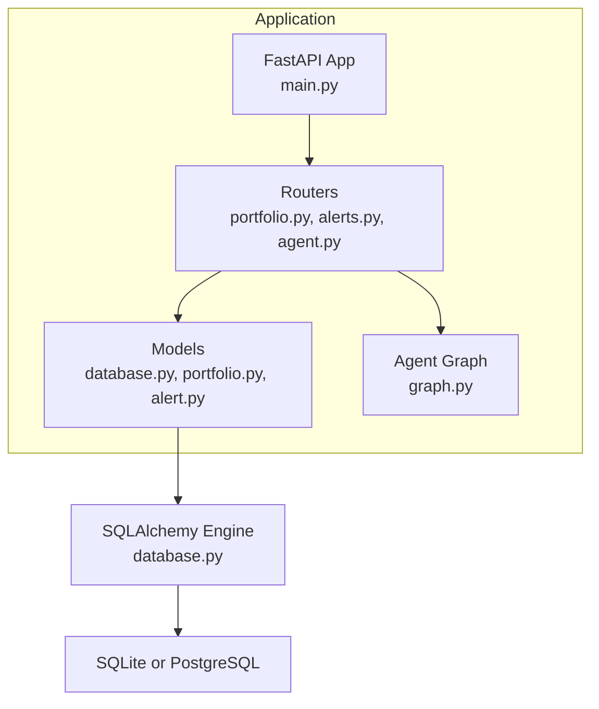
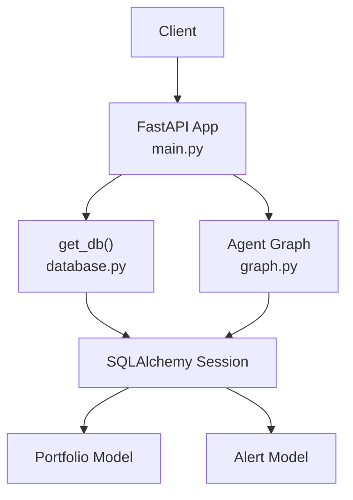
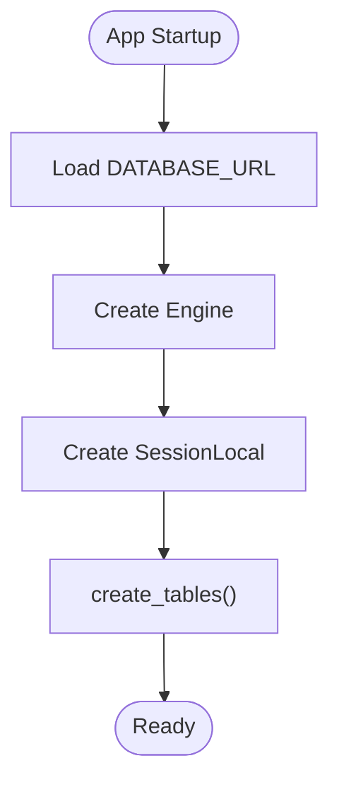
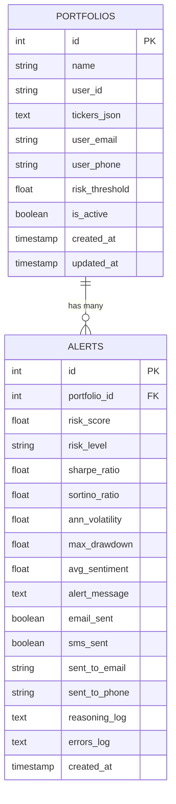
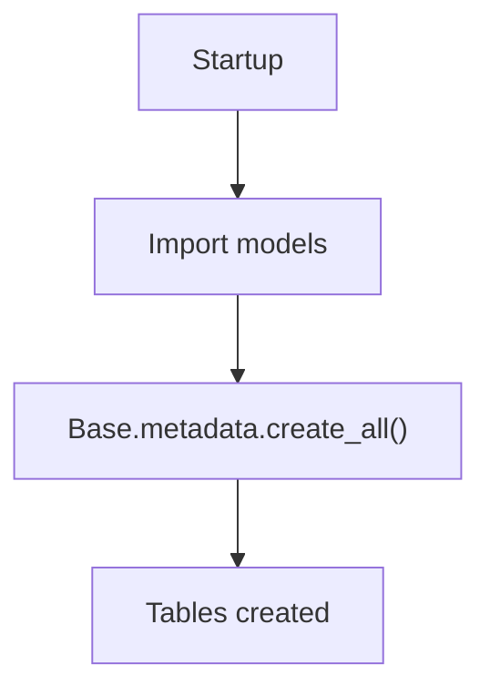
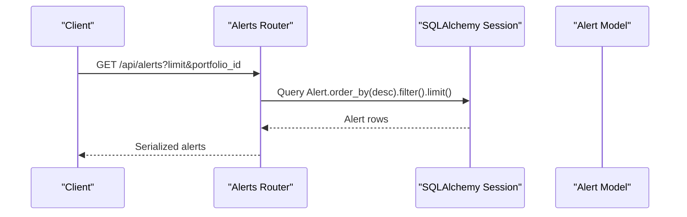
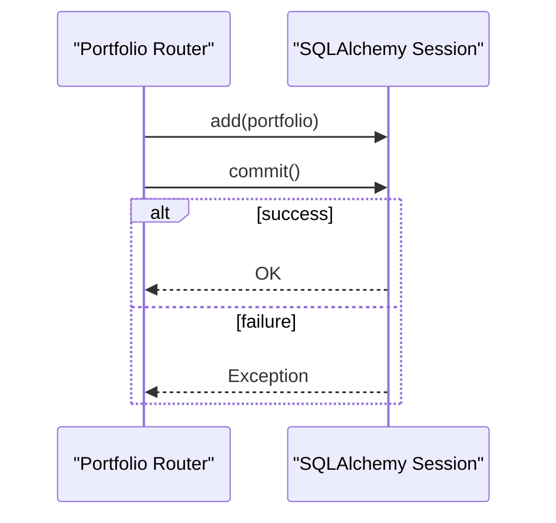
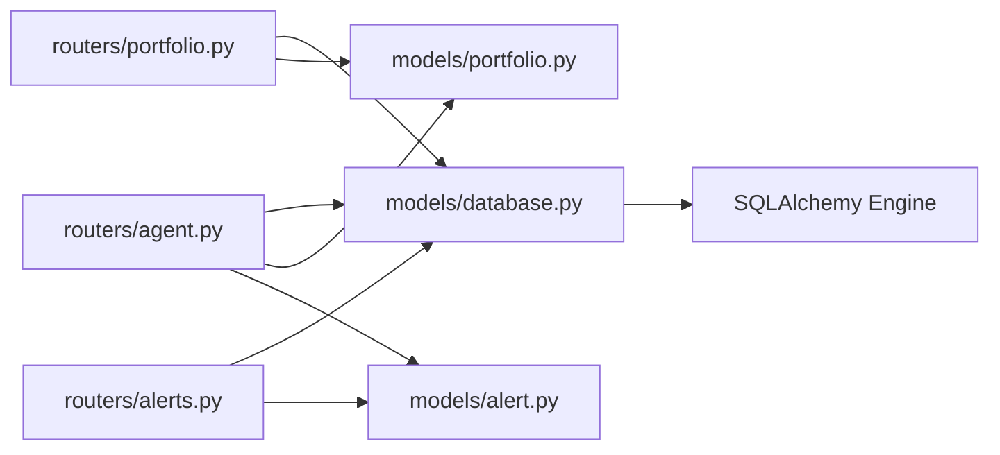

# Database Abstraction Layer

<cite>
**Referenced Files in This Document**
- [database.py](file://backend/models/database.py)
- [portfolio.py](file://backend/models/portfolio.py)
- [alert.py](file://backend/models/alert.py)
- [main.py](file://backend/main.py)
- [portfolio.py](file://backend/routers/portfolio.py)
- [alerts.py](file://backend/routers/alerts.py)
- [agent.py](file://backend/routers/agent.py)
- [graph.py](file://backend/agent/graph.py)
- [README.md](file://README.md)
</cite>

## Table of Contents
1. [Introduction](#introduction)
2. [Project Structure](#project-structure)
3. [Core Components](#core-components)
4. [Architecture Overview](#architecture-overview)
5. [Detailed Component Analysis](#detailed-component-analysis)
6. [Dependency Analysis](#dependency-analysis)
7. [Performance Considerations](#performance-considerations)
8. [Troubleshooting Guide](#troubleshooting-guide)
9. [Conclusion](#conclusion)
10. [Appendices](#appendices)

## Introduction
This document describes the SQLAlchemy database abstraction layer and ORM implementation powering the financial portfolio risk analysis system. It covers engine configuration, session management, connection pooling strategies, ORM model definitions for portfolios and alerts, schema evolution, data integrity enforcement, query optimization, transaction management, error handling, initialization and seeding, backup strategies, complex queries and aggregations, and security considerations against SQL injection.

## Project Structure
The database layer is organized under the models package and integrated with FastAPI routers. The application initializes tables on startup and exposes endpoints to manage portfolios and read alert history. The agent orchestrates risk computation and persists results as alerts.

**Diagram sources**
- [main.py:33-35](file://backend/main.py#L33-L35)
- [portfolio.py:14-21](file://backend/routers/portfolio.py#L14-L21)
- [alerts.py:16-17](file://backend/routers/alerts.py#L16-L17)
- [agent.py:21-24](file://backend/routers/agent.py#L21-L24)
- [database.py:15-22](file://backend/models/database.py#L15-L22)

**Section sources**
- [main.py:33-35](file://backend/main.py#L33-L35)
- [README.md:111-123](file://README.md#L111-L123)

## Core Components
- Database engine and sessions:
  - Engine configured via DATABASE_URL environment variable with SQLite as default and optional PostgreSQL support.
  - Session factory with autocommit disabled and explicit close semantics.
  - Dependency provider yields a per-request session and ensures closure.
  - Table creation on startup using declarative metadata.
- ORM models:
  - Portfolio: stores portfolio configuration, tickers as JSON, user contact, risk threshold, activity flag, timestamps.
  - Alert: stores risk metrics, alert delivery flags, reasoning logs, error logs, and timestamps; foreign-key relationship to Portfolio.
- Routers:
  - Portfolio CRUD endpoints with validation and JSON serialization.
  - Alerts read-only endpoints including statistics and detail retrieval.
  - Agent endpoints that stream reasoning and persist alerts.

**Section sources**
- [database.py:15-42](file://backend/models/database.py#L15-L42)
- [portfolio.py:16-63](file://backend/models/portfolio.py#L16-L63)
- [alert.py:14-77](file://backend/models/alert.py#L14-L77)
- [portfolio.py:50-77](file://backend/routers/portfolio.py#L50-L77)
- [alerts.py:22-83](file://backend/routers/alerts.py#L22-L83)
- [agent.py:39-168](file://backend/routers/agent.py#L39-L168)

## Architecture Overview
The system uses a synchronous SQLAlchemy engine with per-request sessions. The agent computes risk and writes alerts asynchronously via a thread executor to avoid blocking the event loop. Startup hooks create tables, and CORS middleware enables SSE streaming.

**Diagram sources**
- [main.py:33-35](file://backend/main.py#L33-L35)
- [database.py:29-35](file://backend/models/database.py#L29-L35)
- [portfolio.py:19-20](file://backend/models/portfolio.py#L19-L20)
- [alert.py:18](file://backend/models/alert.py#L18)
- [agent.py:171-181](file://backend/routers/agent.py#L171-L181)

## Detailed Component Analysis

### Database Engine and Session Management
- Engine configuration:
  - DATABASE_URL defaults to SQLite for zero-config development; PostgreSQL URL supported via environment variable.
  - SQLite-specific connect argument disables thread checking to enable multi-threaded usage with FastAPI.
  - Echo is disabled for production-grade silence.
- Session factory:
  - Autocommit disabled; flush behavior controlled explicitly.
  - SessionLocal bound to engine; used in dependency provider and executor-backed writer.
- Dependency provider:
  - get_db opens a session, yields it to the route handler, and guarantees closure in a finally block.
- Initialization:
  - create_tables() imports models and creates all tables on startup.

**Diagram sources**
- [database.py:15-22](file://backend/models/database.py#L15-L22)
- [database.py:38-42](file://backend/models/database.py#L38-L42)
- [main.py:33-35](file://backend/main.py#L33-L35)

**Section sources**
- [database.py:15-22](file://backend/models/database.py#L15-L22)
- [database.py:29-35](file://backend/models/database.py#L29-L35)
- [database.py:38-42](file://backend/models/database.py#L38-L42)
- [main.py:33-35](file://backend/main.py#L33-L35)

### ORM Model Definitions and Relationships
- Portfolio:
  - Primary key id; named entity with user_id; JSON field for tickers; optional user contact; risk threshold; activity flag; timestamps.
  - Helper property converts JSON tickers to dict and vice versa.
  - to_dict method serializes model state.
- Alert:
  - Primary key id; foreign key portfolio_id referencing portfolios.id; risk metrics; delivery flags; reasoning log and errors stored as JSON; created_at timestamp.
  - Helper property for reasoning steps; to_dict for serialization.
- Relationship:
  - Alert.portfolio_id → Portfolio.id enforces referential integrity.

**Diagram sources**
- [portfolio.py:19-34](file://backend/models/portfolio.py#L19-L34)
- [alert.py:17-42](file://backend/models/alert.py#L17-L42)

**Section sources**
- [portfolio.py:16-63](file://backend/models/portfolio.py#L16-L63)
- [alert.py:14-77](file://backend/models/alert.py#L14-L77)

### Schema Evolution and Data Integrity
- Schema evolution:
  - Tables created on startup via Base.metadata.create_all; no Alembic migrations present in the repository.
- Constraints and defaults:
  - Portfolio: default name, default user_id, default risk threshold, default activity flag, default timestamps.
  - Alert: default delivery flags, optional metrics; created_at indexed for ordering.
  - Foreign key constraint portfolio_id → portfolios.id.
- Indexes:
  - Portfolio.user_id and Alert.portfolio_id and Alert.created_at are indexed to optimize queries.

**Diagram sources**
- [database.py:40-41](file://backend/models/database.py#L40-L41)
- [portfolio.py:21](file://backend/models/portfolio.py#L21)
- [alert.py:18](file://backend/models/alert.py#L18)
- [alert.py:42](file://backend/models/alert.py#L42)

**Section sources**
- [database.py:38-42](file://backend/models/database.py#L38-L42)
- [portfolio.py:19-34](file://backend/models/portfolio.py#L19-L34)
- [alert.py:17-42](file://backend/models/alert.py#L17-L42)

### Query Patterns and Aggregations
- Portfolio endpoints:
  - Listing: order by created_at descending.
  - Creation: validates weights approximately sum to 1.0 before insertion.
  - Update and delete: per-ID operations with 404 handling.
- Alerts endpoints:
  - Listing with optional portfolio filter and limit.
  - Detail retrieval by id.
  - Portfolio-specific recent alerts with limit.
  - Statistics: counts by risk level, delivery channels, average risk score, and latest run timestamp.
- Aggregation example:
  - Average risk score computed by fetching all scores and averaging.

**Diagram sources**
- [alerts.py:22-32](file://backend/routers/alerts.py#L22-L32)
- [alerts.py:43-56](file://backend/routers/alerts.py#L43-L56)
- [alerts.py:59-83](file://backend/routers/alerts.py#L59-L83)

**Section sources**
- [portfolio.py:50-77](file://backend/routers/portfolio.py#L50-L77)
- [portfolio.py:80-123](file://backend/routers/portfolio.py#L80-L123)
- [alerts.py:22-83](file://backend/routers/alerts.py#L22-L83)

### Transaction Management and Error Handling
- Transactions:
  - Per-route commits; refresh after add/commit for returned resource identifiers.
- Error handling:
  - Validation errors raised as HTTP exceptions with descriptive messages.
  - 404 responses for missing resources.
  - Agent streaming captures exceptions and emits error events; database save failures reported via SSE.
- Rollback:
  - No explicit rollback logic observed; implicit rollback occurs on exception or session close without commit.

**Diagram sources**
- [portfolio.py:67-77](file://backend/routers/portfolio.py#L67-L77)

**Section sources**
- [portfolio.py:58-65](file://backend/routers/portfolio.py#L58-L65)
- [portfolio.py:74-77](file://backend/routers/portfolio.py#L74-L77)
- [alerts.py:36-40](file://backend/routers/alerts.py#L36-L40)
- [agent.py:123-126](file://backend/routers/agent.py#L123-L126)
- [agent.py:155-158](file://backend/routers/agent.py#L155-L158)

### Database Initialization, Seed Data, and Backup Strategies
- Initialization:
  - Tables created on startup via create_tables().
- Seed data:
  - No explicit seed scripts observed in the repository.
- Backups:
  - No dedicated backup scripts observed in the repository.

**Section sources**
- [main.py:33-35](file://backend/main.py#L33-L35)
- [database.py:38-42](file://backend/models/database.py#L38-L42)

### Security Considerations and SQL Injection Prevention
- Parameterized queries:
  - All ORM queries use SQLAlchemy’s query builder with filtered parameters (e.g., filter by id), preventing raw SQL injection.
- Environment-driven configuration:
  - DATABASE_URL loaded from environment, avoiding hardcoded credentials in code.
- Input validation:
  - Portfolio weight validation prevents malformed payloads.
- CORS and SSE:
  - Middleware allows origins and headers; SSE streaming is used for agent feedback.

**Section sources**
- [portfolio.py:58-65](file://backend/routers/portfolio.py#L58-L65)
- [database.py:15](file://backend/models/database.py#L15)
- [agent.py:39-168](file://backend/routers/agent.py#L39-L168)

## Dependency Analysis
- Coupling:
  - Routers depend on get_db for sessions and on models for ORM operations.
  - Agent router depends on portfolio and alert models and uses a thread executor for DB writes.
- Cohesion:
  - Models encapsulate schema and helpers; routers encapsulate HTTP concerns; database module centralizes engine/session logic.
- External dependencies:
  - SQLAlchemy ORM and engine; FastAPI; LangGraph for agent orchestration.

**Diagram sources**
- [portfolio.py:19-20](file://backend/routers/portfolio.py#L19-L20)
- [alerts.py:16-17](file://backend/routers/alerts.py#L16-L17)
- [agent.py:21-24](file://backend/routers/agent.py#L21-L24)
- [database.py:15-22](file://backend/models/database.py#L15-L22)

**Section sources**
- [portfolio.py:14-21](file://backend/routers/portfolio.py#L14-L21)
- [alerts.py:16-17](file://backend/routers/alerts.py#L16-L17)
- [agent.py:21-24](file://backend/routers/agent.py#L21-L24)
- [database.py:15-22](file://backend/models/database.py#L15-L22)

## Performance Considerations
- Indexing:
  - Portfolio.user_id, Alert.portfolio_id, Alert.created_at are indexed to accelerate filtering and sorting.
- Query patterns:
  - Use of order_by(desc) and limit in alerts listing; filter by foreign key for portfolio-specific queries.
- Asynchronous writes:
  - Executor-based DB write in agent streaming avoids blocking the async event loop.
- Engine configuration:
  - SQLite default for development; PostgreSQL recommended for production scaling.

**Section sources**
- [portfolio.py:21](file://backend/models/portfolio.py#L21)
- [alert.py:18](file://backend/models/alert.py#L18)
- [alert.py:42](file://backend/models/alert.py#L42)
- [alerts.py:28-31](file://backend/routers/alerts.py#L28-L31)
- [agent.py:149-151](file://backend/routers/agent.py#L149-L151)

## Troubleshooting Guide
- Database connectivity:
  - Verify DATABASE_URL environment variable; default SQLite path is relative to working directory.
- Table creation:
  - Ensure startup hook executes; confirm imports of models register them with metadata.
- Session lifecycle:
  - Confirm get_db is used as a dependency so sessions are closed after requests.
- Agent streaming:
  - SSE endpoints require appropriate headers; check CORS configuration and client disconnection handling.
- Validation errors:
  - Portfolio weight validation requires weights to approximately sum to 1.0.

**Section sources**
- [database.py:15](file://backend/models/database.py#L15)
- [database.py:38-42](file://backend/models/database.py#L38-L42)
- [database.py:29-35](file://backend/models/database.py#L29-L35)
- [agent.py:160-168](file://backend/routers/agent.py#L160-L168)
- [portfolio.py:58-65](file://backend/routers/portfolio.py#L58-L65)

## Conclusion
The database abstraction layer leverages SQLAlchemy ORM with a synchronous engine and per-request sessions. It provides a clean separation of concerns, robust initialization, and straightforward CRUD and read-only endpoints. The agent integrates tightly with the ORM to stream results and persist alerts. While migrations and advanced performance tuning are not present, the current design is suitable for development and can be extended for production with PostgreSQL, Alembic migrations, and additional indexing and connection pooling strategies.

## Appendices
- Endpoint coverage:
  - Portfolios: list, create, get, update, delete.
  - Alerts: list, detail, portfolio-specific list, stats.
  - Agent: stream, run, status.

**Section sources**
- [portfolio.py:50-123](file://backend/routers/portfolio.py#L50-L123)
- [alerts.py:22-83](file://backend/routers/alerts.py#L22-L83)
- [agent.py:39-242](file://backend/routers/agent.py#L39-L242)
- [README.md:111-123](file://README.md#L111-L123)