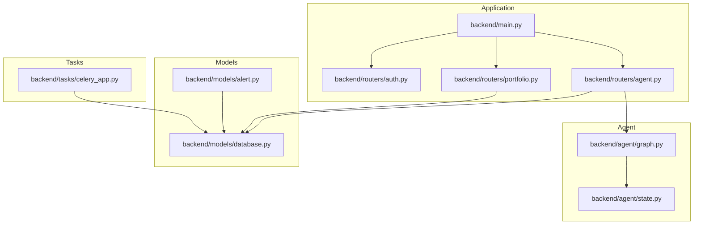
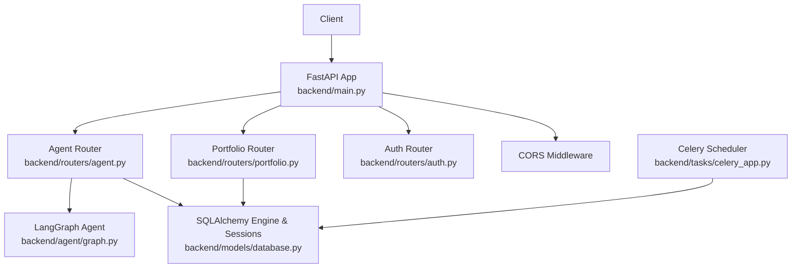
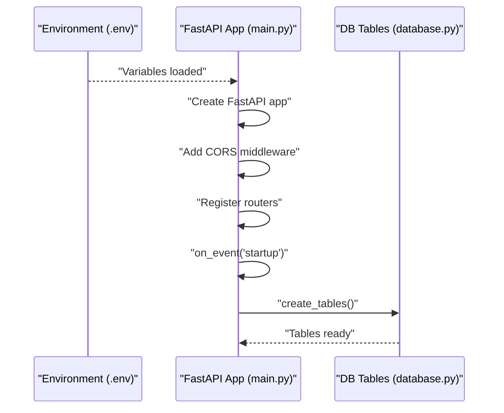
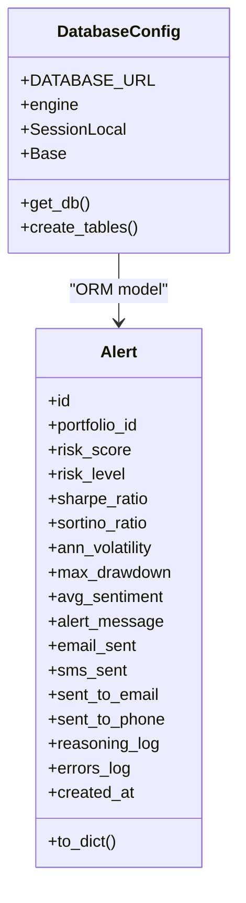
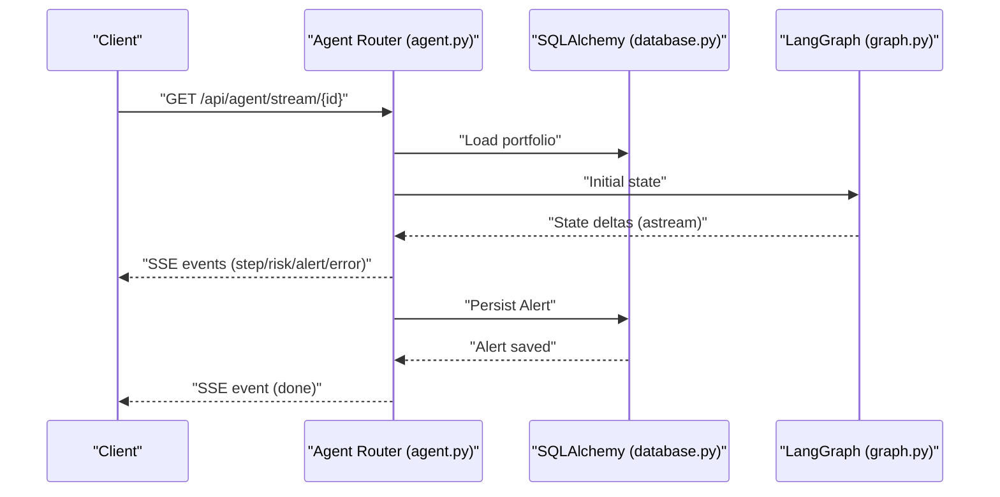
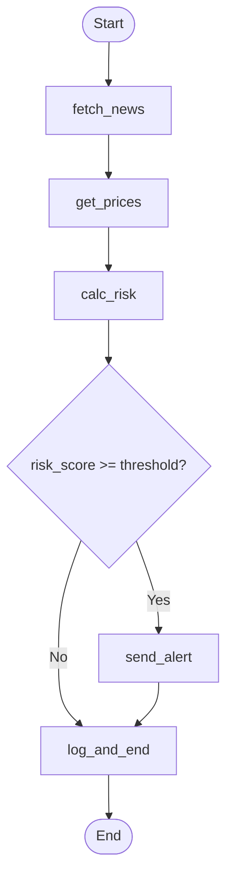
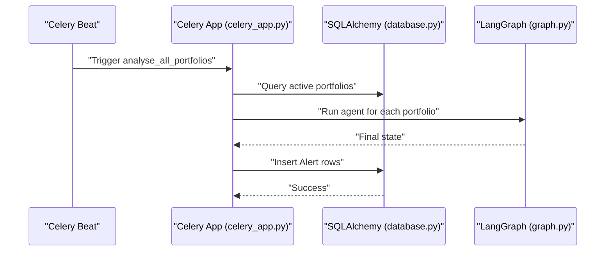
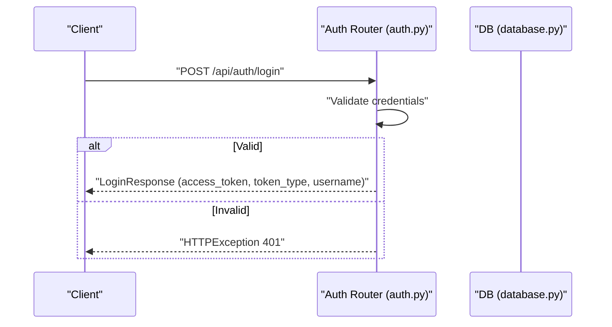
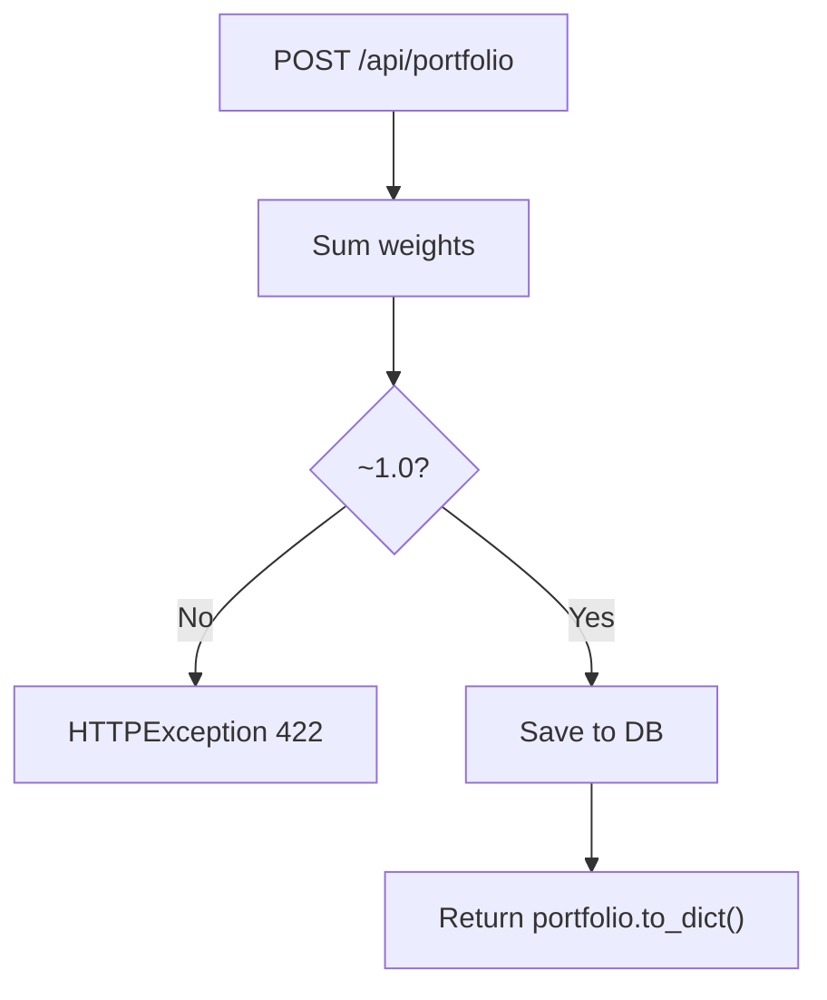
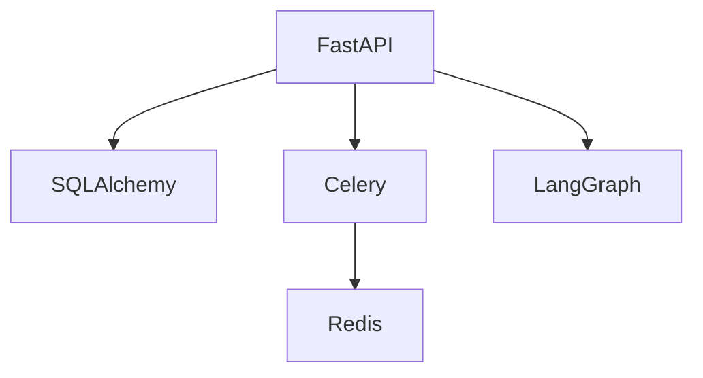

# FastAPI Application Configuration

<cite>
**Referenced Files in This Document**
- [main.py](file://backend/main.py)
- [database.py](file://backend/models/database.py)
- [celery_app.py](file://backend/tasks/celery_app.py)
- [auth.py](file://backend/routers/auth.py)
- [portfolio.py](file://backend/routers/portfolio.py)
- [agent.py](file://backend/routers/agent.py)
- [graph.py](file://backend/agent/graph.py)
- [state.py](file://backend/agent/state.py)
- [alert.py](file://backend/models/alert.py)
- [README.md](file://README.md)
- [requirements.txt](file://backend/requirements.txt)
</cite>

## Table of Contents
1. [Introduction](#introduction)
2. [Project Structure](#project-structure)
3. [Core Components](#core-components)
4. [Architecture Overview](#architecture-overview)
5. [Detailed Component Analysis](#detailed-component-analysis)
6. [Dependency Analysis](#dependency-analysis)
7. [Performance Considerations](#performance-considerations)
8. [Troubleshooting Guide](#troubleshooting-guide)
9. [Conclusion](#conclusion)
10. [Appendices](#appendices)

## Introduction
This document explains the FastAPI application configuration and initialization for the Financial Portfolio Agent API. It covers the application entry point setup, CORS configuration, middleware registration, startup/shutdown event handling, database connection management, session factory setup, dependency injection patterns, application lifecycle events, error handling, logging configuration, environment variable loading, configuration validation, service initialization, security headers, rate limiting, and performance optimization settings. It also provides examples of custom middleware implementation and application customization patterns.

## Project Structure
The backend is organized around a FastAPI application with modular routers, SQLAlchemy models, an agent graph powered by LangGraph, and Celery-based scheduled tasks. The main application wires together routers, middleware, and lifecycle hooks, while models define the database schema and dependency injection pattern.

**Diagram sources**
- [main.py](file://backend/main.py)
- [auth.py](file://backend/routers/auth.py)
- [portfolio.py](file://backend/routers/portfolio.py)
- [agent.py](file://backend/routers/agent.py)
- [database.py](file://backend/models/database.py)
- [alert.py](file://backend/models/alert.py)
- [graph.py](file://backend/agent/graph.py)
- [state.py](file://backend/agent/state.py)
- [celery_app.py](file://backend/tasks/celery_app.py)

**Section sources**
- [main.py](file://backend/main.py)
- [README.md](file://README.md)

## Core Components
- Application entry point and configuration:
  - Environment loading via dotenv.
  - FastAPI app creation with metadata (title, description, version).
  - CORS middleware configured for broad compatibility with SSE.
  - Startup event to initialize database tables.
  - Router inclusion for items, auth, portfolio, agent, alerts.
  - Root and health endpoints.
- Database and dependency injection:
  - Engine and session factory creation with SQLite default and optional PostgreSQL override.
  - Dependency provider for per-request sessions.
  - Table creation on startup.
- Agent and streaming:
  - SSE endpoint for live agent reasoning and metrics.
  - Synchronous run endpoint with persisted results.
  - LangGraph state machine with typed state and conditional routing.
- Task scheduling:
  - Celery app with Redis broker/backend.
  - Daily scheduled task to analyze all active portfolios.

**Section sources**
- [main.py](file://backend/main.py)
- [database.py](file://backend/models/database.py)
- [agent.py](file://backend/routers/agent.py)
- [graph.py](file://backend/agent/graph.py)
- [celery_app.py](file://backend/tasks/celery_app.py)

## Architecture Overview
The application initializes environment variables, sets up CORS, registers routers, and performs database bootstrapping on startup. Requests are handled by routers that depend on SQLAlchemy sessions injected via a dependency provider. The agent router streams results via SSE using a LangGraph state machine, while Celery performs periodic analysis off the request path.

**Diagram sources**
- [main.py](file://backend/main.py)
- [auth.py](file://backend/routers/auth.py)
- [portfolio.py](file://backend/routers/portfolio.py)
- [agent.py](file://backend/routers/agent.py)
- [database.py](file://backend/models/database.py)
- [graph.py](file://backend/agent/graph.py)
- [celery_app.py](file://backend/tasks/celery_app.py)

## Detailed Component Analysis

### Application Entry Point and Initialization
- Environment loading:
  - Loads environment variables from a .env file prior to app creation.
- App metadata:
  - Sets title, description, and version for OpenAPI documentation.
- CORS configuration:
  - Adds CORSMiddleware with permissive settings to support SSE.
- Startup event:
  - Calls a function to create database tables on application start.
- Router registration:
  - Includes routers under prefixed paths with tags for grouping.
- Root and health endpoints:
  - Provides a friendly welcome and a health check endpoint.

**Diagram sources**
- [main.py](file://backend/main.py)
- [database.py](file://backend/models/database.py)

**Section sources**
- [main.py](file://backend/main.py)

### Database Connection Management and Dependency Injection
- Engine and session factory:
  - Creates engine with optional SQLite or PostgreSQL based on DATABASE_URL.
  - Uses SQLite-specific connection argument for multi-threading.
  - Builds a session factory bound to the engine.
- Base declarative class:
  - Provides a base class for ORM models.
- Dependency provider:
  - get_db yields a scoped session per request and ensures closure.
- Table creation:
  - create_tables imports models and creates all tables on startup.

**Diagram sources**
- [database.py](file://backend/models/database.py)
- [alert.py](file://backend/models/alert.py)

**Section sources**
- [database.py](file://backend/models/database.py)
- [alert.py](file://backend/models/alert.py)

### Agent Streaming and SSE Endpoint
- SSE endpoint:
  - Streams agent reasoning steps, risk metrics, alert decisions, and errors.
  - Emits structured messages with types for client-side rendering.
  - Applies headers to disable caching and buffer for Nginx compatibility.
- Persistence:
  - Saves final results to the Alerts table after streaming completes.
- Sync run:
  - Provides a synchronous endpoint that returns a JSON summary and persists results.

**Diagram sources**
- [agent.py](file://backend/routers/agent.py)
- [database.py](file://backend/models/database.py)
- [graph.py](file://backend/agent/graph.py)

**Section sources**
- [agent.py](file://backend/routers/agent.py)
- [graph.py](file://backend/agent/graph.py)

### LangGraph State Machine
- State definition:
  - Typed dictionary defines the shared state flowing through nodes.
- Nodes:
  - fetch_news, get_prices, calc_risk, send_alert, log_and_end.
- Conditional routing:
  - Routes to send_alert if risk score exceeds a threshold; otherwise logs and ends.
- Compilation:
  - Builds and compiles the graph for synchronous invocation and streaming.

**Diagram sources**
- [graph.py](file://backend/agent/graph.py)
- [state.py](file://backend/agent/state.py)

**Section sources**
- [graph.py](file://backend/agent/graph.py)
- [state.py](file://backend/agent/state.py)

### Celery Scheduled Tasks
- Configuration:
  - Creates Celery app with Redis broker and backend.
  - Enables JSON serialization and UTC timezone.
  - Schedules a daily task at 08:00 UTC.
- Task implementation:
  - Iterates active portfolios, constructs initial state, runs agent asynchronously in a new event loop, and persists results to the Alerts table.
- Graceful handling:
  - Logs exceptions, rolls back on failure, and closes sessions.

**Diagram sources**
- [celery_app.py](file://backend/tasks/celery_app.py)
- [database.py](file://backend/models/database.py)
- [graph.py](file://backend/agent/graph.py)

**Section sources**
- [celery_app.py](file://backend/tasks/celery_app.py)

### Authentication Router
- Endpoints:
  - Login endpoint with demo credentials and token response.
  - Protected profile endpoint stub.
- Validation:
  - Raises HTTPException on invalid credentials.

**Diagram sources**
- [auth.py](file://backend/routers/auth.py)
- [database.py](file://backend/models/database.py)

**Section sources**
- [auth.py](file://backend/routers/auth.py)

### Portfolio Router and Validation
- Endpoints:
  - List, create, get, update, delete portfolios.
- Validation:
  - Ensures weights approximately sum to 1.0 on creation.
- Dependencies:
  - Uses get_db dependency for SQLAlchemy operations.

**Diagram sources**
- [portfolio.py](file://backend/routers/portfolio.py)
- [database.py](file://backend/models/database.py)

**Section sources**
- [portfolio.py](file://backend/routers/portfolio.py)

### Logging Configuration
- Logging setup:
  - Celery app uses standard logging with a module-specific logger.
  - Agent router uses a module-specific logger for runtime events.
- Recommendations:
  - Configure root logger level and handlers in production.
  - Use structured logging with correlation IDs for distributed tracing.

**Section sources**
- [celery_app.py](file://backend/tasks/celery_app.py)
- [agent.py](file://backend/routers/agent.py)

### Security Headers and Rate Limiting
- Security headers:
  - SSE endpoint sets Cache-Control and X-Accel-Buffering for Nginx compatibility.
  - CORS allows all origins/methods/headers for SSE compatibility.
- Rate limiting:
  - No built-in rate limiting middleware is present.
  - Recommendation: Integrate a rate-limiting middleware for production.

**Section sources**
- [main.py](file://backend/main.py)
- [agent.py](file://backend/routers/agent.py)

### Environment Variable Loading and Configuration Validation
- Environment loading:
  - Loads .env variables before app creation.
- Configuration:
  - DATABASE_URL defaults to SQLite; can be overridden for PostgreSQL.
  - ALLOWED_ORIGINS defaults are applied from environment.
- Validation:
  - Portfolio weight validation occurs in the portfolio router.
  - Celery availability is guarded with a try/except block.

**Section sources**
- [main.py](file://backend/main.py)
- [database.py](file://backend/models/database.py)
- [portfolio.py](file://backend/routers/portfolio.py)
- [celery_app.py](file://backend/tasks/celery_app.py)

### Application Lifecycle Events
- Startup:
  - Initializes database tables.
- Shutdown:
  - Not implemented; consider adding cleanup for long-running tasks or connections.

**Section sources**
- [main.py](file://backend/main.py)

### Error Handling Middleware
- Built-in error handling:
  - Routers raise HTTPException on validation failures and missing resources.
  - Agent router catches exceptions and emits an error SSE event.
  - Celery task logs exceptions and rolls back on failure.
- Recommendations:
  - Add centralized exception handlers for uncaught exceptions.
  - Implement response wrappers for consistent error payloads.

**Section sources**
- [portfolio.py](file://backend/routers/portfolio.py)
- [agent.py](file://backend/routers/agent.py)
- [celery_app.py](file://backend/tasks/celery_app.py)

### Performance Optimization Settings
- Async streaming:
  - SSE streaming uses async iteration and small delays for readability.
- Executor usage:
  - DB writes in agent router are executed in a thread pool to avoid blocking the event loop.
- Recommendations:
  - Tune concurrency limits and connection pooling.
  - Use connection pooling parameters appropriate for deployment scale.

**Section sources**
- [agent.py](file://backend/routers/agent.py)

### Examples of Custom Middleware Implementation
- CORS:
  - Broadly permissive for SSE compatibility.
- Custom middleware example:
  - Implement a middleware to enforce request size limits, add tracing headers, or apply custom rate limiting.
  - Register middleware early in the app initialization pipeline.

[No sources needed since this section provides conceptual guidance]

### Application Customization Patterns
- Extending routers:
  - Add new endpoints under existing prefixes or new prefixes.
- Adding new models:
  - Define ORM models and import them in the table creation call.
- Integrating external services:
  - Use dependency injection to inject clients and services into routers.
- Deployment customization:
  - Set environment variables for production (ALLOWED_ORIGINS, DATABASE_URL, REDIS_URL).

[No sources needed since this section provides conceptual guidance]

## Dependency Analysis
The application depends on FastAPI, SQLAlchemy, Celery with Redis, and LangGraph for the agent. The routers depend on the database dependency provider, and the agent router depends on the compiled LangGraph.

**Diagram sources**
- [requirements.txt](file://backend/requirements.txt)
- [main.py](file://backend/main.py)
- [database.py](file://backend/models/database.py)
- [celery_app.py](file://backend/tasks/celery_app.py)
- [agent.py](file://backend/routers/agent.py)
- [graph.py](file://backend/agent/graph.py)

**Section sources**
- [requirements.txt](file://backend/requirements.txt)

## Performance Considerations
- Use asynchronous patterns for IO-bound operations (SSE streaming, external API calls).
- Offload blocking operations to thread pools or separate workers.
- Configure connection pooling and tune engine parameters for production workloads.
- Monitor and limit concurrent SSE connections to prevent resource exhaustion.

[No sources needed since this section provides general guidance]

## Troubleshooting Guide
- Database connectivity:
  - Verify DATABASE_URL and credentials; ensure the database is reachable.
- CORS issues:
  - Confirm ALLOWED_ORIGINS and middleware configuration for development and production domains.
- Celery not available:
  - Ensure Redis is running and REDIS_URL is configured; verify Celery installation.
- SSE not working:
  - Check headers and network proxy configurations; confirm client disconnect handling.

**Section sources**
- [main.py](file://backend/main.py)
- [celery_app.py](file://backend/tasks/celery_app.py)
- [agent.py](file://backend/routers/agent.py)

## Conclusion
The FastAPI application is structured around a clear separation of concerns: environment-driven configuration, robust database integration via SQLAlchemy, streaming agent execution with SSE, and scheduled tasks via Celery. The design emphasizes modularity, dependency injection, and extensibility, enabling straightforward customization and production hardening through middleware, logging, and performance tuning.

[No sources needed since this section summarizes without analyzing specific files]

## Appendices
- Environment variables:
  - ALLOWED_ORIGINS, DATABASE_URL, REDIS_URL.
- Deployment:
  - Follow the README’s local development and deployment instructions.

**Section sources**
- [README.md](file://README.md)