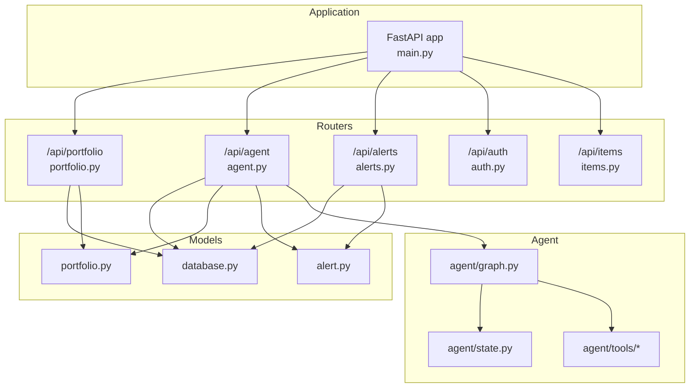
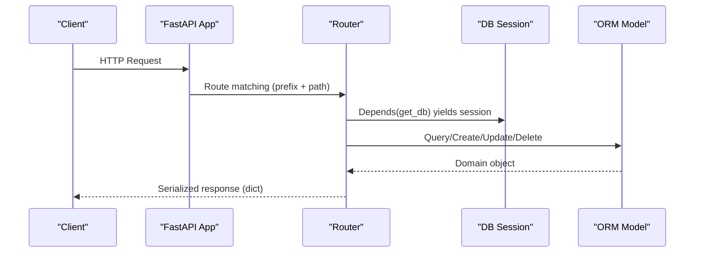
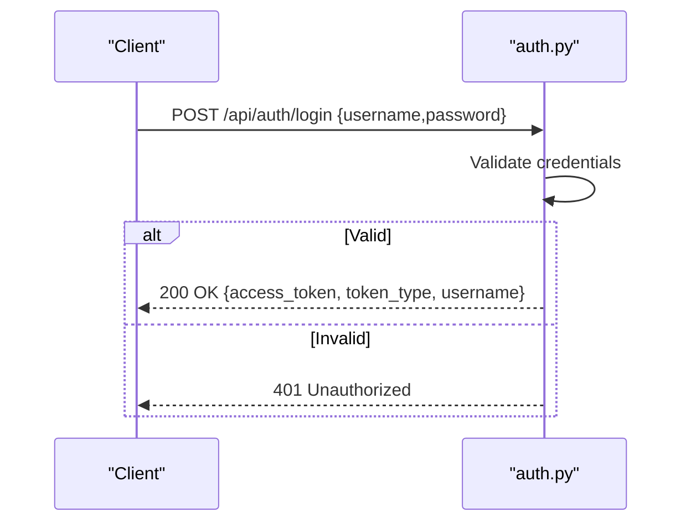
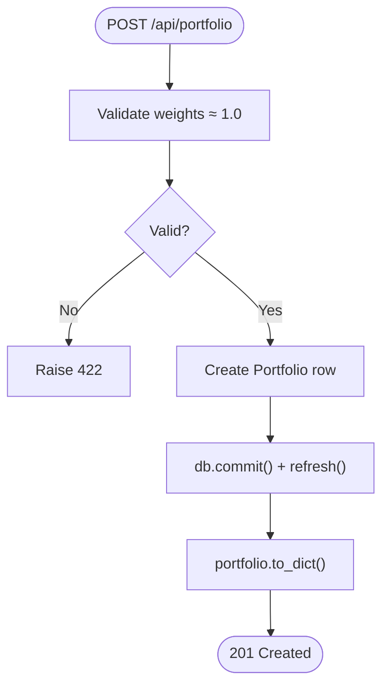
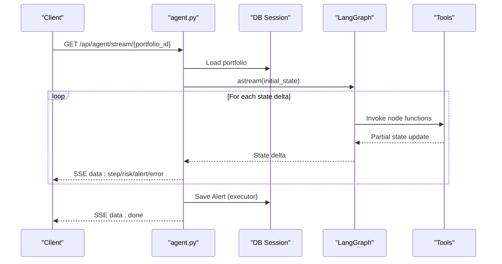
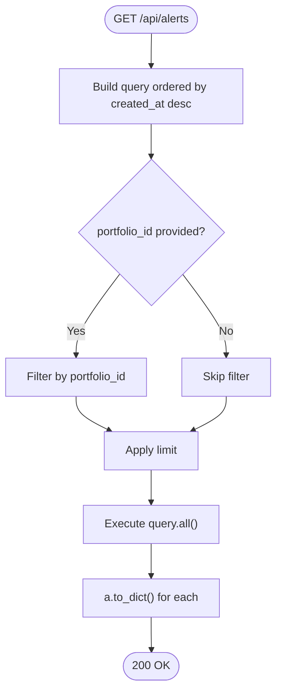
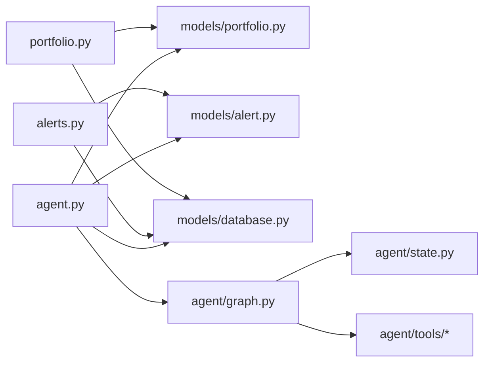

# Routing Layer Design

<cite>
**Referenced Files in This Document**
- [main.py](file://backend/main.py)
- [portfolio.py](file://backend/routers/portfolio.py)
- [agent.py](file://backend/routers/agent.py)
- [alerts.py](file://backend/routers/alerts.py)
- [auth.py](file://backend/routers/auth.py)
- [items.py](file://backend/routers/items.py)
- [database.py](file://backend/models/database.py)
- [portfolio.py](file://backend/models/portfolio.py)
- [alert.py](file://backend/models/alert.py)
- [graph.py](file://backend/agent/graph.py)
- [state.py](file://backend/agent/state.py)
- [fetch_news.py](file://backend/agent/tools/fetch_news.py)
- [get_prices.py](file://backend/agent/tools/get_prices.py)
- [calc_risk.py](file://backend/agent/tools/calc_risk.py)
- [send_alert.py](file://backend/agent/tools/send_alert.py)
</cite>

## Table of Contents
1. [Introduction](#introduction)
2. [Project Structure](#project-structure)
3. [Core Components](#core-components)
4. [Architecture Overview](#architecture-overview)
5. [Detailed Component Analysis](#detailed-component-analysis)
6. [Dependency Analysis](#dependency-analysis)
7. [Performance Considerations](#performance-considerations)
8. [Troubleshooting Guide](#troubleshooting-guide)
9. [Conclusion](#conclusion)
10. [Appendices](#appendices)

## Introduction
This document describes the FastAPI routing layer design and endpoint organization for the Financial Portfolio Agent API. It covers router structure, endpoint definitions, HTTP method mappings, URL patterns, request/response schemas, dependency injection, error handling, response serialization, authentication and permissions, validation mechanisms, API versioning, endpoint grouping, documentation generation, performance considerations, caching strategies, rate limiting, and integration with the database layer.

## Project Structure
The backend is organized around feature-based routers grouped under the routers package, with models for SQLAlchemy ORM and an agent subsystem implementing a LangGraph workflow. The main application wires routers behind a common prefix and tags them for documentation grouping.

**Diagram sources**
- [main.py:38-44](file://backend/main.py#L38-L44)
- [portfolio.py:14-22](file://backend/routers/portfolio.py#L14-L22)
- [agent.py:17-27](file://backend/routers/agent.py#L17-L27)
- [alerts.py:12-19](file://backend/routers/alerts.py#L12-L19)
- [auth.py:1-4](file://backend/routers/auth.py#L1-L4)
- [items.py:1-5](file://backend/routers/items.py#L1-L5)
- [database.py:29-35](file://backend/models/database.py#L29-L35)
- [portfolio.py:16-63](file://backend/models/portfolio.py#L16-L63)
- [alert.py:14-77](file://backend/models/alert.py#L14-L77)
- [graph.py:202-243](file://backend/agent/graph.py#L202-L243)
- [state.py:28-58](file://backend/agent/state.py#L28-L58)

**Section sources**
- [main.py:38-44](file://backend/main.py#L38-L44)
- [main.py:12-16](file://backend/main.py#L12-L16)

## Core Components
- Application bootstrap and router registration define the API surface and metadata.
- Routers encapsulate CRUD and workflow endpoints with explicit HTTP methods and URL patterns.
- Pydantic models define request/response schemas and validation rules.
- SQLAlchemy dependency injection provides database sessions per request.
- Agent workflow integrates external tools and persists results to the Alerts model.

Key implementation patterns:
- Endpoint grouping via router prefixes and tags for OpenAPI documentation.
- Dependency injection using a generator function that yields a scoped database session.
- Validation via Pydantic models and manual checks (e.g., portfolio weight normalization).
- Response serialization via model helper methods returning dictionaries.

**Section sources**
- [main.py:38-44](file://backend/main.py#L38-L44)
- [portfolio.py:27-46](file://backend/routers/portfolio.py#L27-L46)
- [database.py:29-35](file://backend/models/database.py#L29-L35)
- [portfolio.py:50-77](file://backend/routers/portfolio.py#L50-L77)

## Architecture Overview
The routing layer exposes five primary groups:
- Authentication: login and identity endpoints.
- Portfolio: CRUD endpoints for portfolio configurations.
- Agent: streaming and synchronous execution endpoints backed by a LangGraph workflow.
- Alerts: read-only endpoints for alert history and statistics.
- Items: auxiliary CRUD endpoints for demonstration.

**Diagram sources**
- [main.py:38-44](file://backend/main.py#L38-L44)
- [database.py:29-35](file://backend/models/database.py#L29-L35)
- [portfolio.py:50-77](file://backend/routers/portfolio.py#L50-L77)
- [alerts.py:22-32](file://backend/routers/alerts.py#L22-L32)

## Detailed Component Analysis

### Authentication Router
- Purpose: Demo login and user info endpoints.
- Endpoints:
  - POST /api/auth/login — validates credentials and returns a token-like response model.
  - GET /api/auth/me — returns stub user info.
- Authentication decorators and permissions: Not enforced in current implementation; intended for future JWT integration.
- Validation: Pydantic models for request/response.
- Error handling: HTTPException raised on invalid credentials.

**Diagram sources**
- [auth.py:18-32](file://backend/routers/auth.py#L18-L32)

**Section sources**
- [auth.py:18-39](file://backend/routers/auth.py#L18-L39)

### Portfolio Router
- Purpose: Manage user portfolios (CRUD).
- Endpoints:
  - GET /api/portfolio — list all portfolios.
  - POST /api/portfolio — create portfolio with validation.
  - GET /api/portfolio/{id} — get single portfolio.
  - PUT /api/portfolio/{id} — update portfolio.
  - DELETE /api/portfolio/{id} — delete portfolio.
- Request/response schemas:
  - PortfolioCreate: name, tickers (weight map), optional contact, risk threshold.
  - PortfolioUpdate: optional fields for name, tickers, contact, risk threshold, activation flag.
- Validation:
  - PortfolioCreate enforces weights approximately sum to 1.0.
  - PortfolioUpdate allows partial updates.
- Error handling: 404 Not Found for missing resources; 422 Unprocessable Entity for invalid weights.
- Response serialization: to_dict() helper on Portfolio model.

**Diagram sources**
- [portfolio.py:56-77](file://backend/routers/portfolio.py#L56-L77)
- [portfolio.py:27-46](file://backend/routers/portfolio.py#L27-L46)

**Section sources**
- [portfolio.py:50-124](file://backend/routers/portfolio.py#L50-L124)
- [portfolio.py:16-63](file://backend/models/portfolio.py#L16-L63)

### Agent Router
- Purpose: Trigger agent runs and stream results via Server-Sent Events (SSE).
- Endpoints:
  - GET /api/agent/stream/{portfolio_id} — SSE stream of reasoning steps, risk metrics, alert decisions, and completion.
  - POST /api/agent/run/{portfolio_id} — synchronous run and return summary.
  - GET /api/agent/status — health check.
- Workflow integration:
  - Uses LangGraph StateGraph with nodes for fetching news, getting prices, calculating risk, and optionally sending alerts.
  - Streams state deltas via aynchronous generator to clients.
- Persistence:
  - On completion, writes an Alert row with risk metrics, reasoning steps, and delivery flags.
- SSE headers: disables caching and sets CORS header for Nginx compatibility.
- Executor pattern: database writes offloaded to thread pool to keep async loop responsive.

**Diagram sources**
- [agent.py:39-168](file://backend/routers/agent.py#L39-L168)
- [graph.py:162-203](file://backend/agent/graph.py#L162-L203)
- [graph.py:210-243](file://backend/agent/graph.py#L210-L243)
- [send_alert.py:157-231](file://backend/agent/tools/send_alert.py#L157-L231)

**Section sources**
- [agent.py:39-243](file://backend/routers/agent.py#L39-L243)
- [graph.py:45-140](file://backend/agent/graph.py#L45-L140)
- [state.py:28-58](file://backend/agent/state.py#L28-L58)
- [fetch_news.py:98-164](file://backend/agent/tools/fetch_news.py#L98-L164)
- [get_prices.py:84-139](file://backend/agent/tools/get_prices.py#L84-L139)
- [calc_risk.py:149-255](file://backend/agent/tools/calc_risk.py#L149-L255)
- [send_alert.py:157-231](file://backend/agent/tools/send_alert.py#L157-L231)

### Alerts Router
- Purpose: Read-only access to alert history and statistics.
- Endpoints:
  - GET /api/alerts — list alerts with optional portfolio filter and limit.
  - GET /api/alerts/detail/{alert_id} — full alert detail including reasoning logs.
  - GET /api/alerts/portfolio/{portfolio_id} — alerts for a specific portfolio.
  - GET /api/alerts/stats — summary statistics across all alerts.
- Filtering and ordering: latest-first ordering; optional filters applied.
- Response serialization: to_dict() helper on Alert model.

**Diagram sources**
- [alerts.py:22-32](file://backend/routers/alerts.py#L22-L32)
- [alerts.py:35-40](file://backend/routers/alerts.py#L35-L40)
- [alerts.py:43-56](file://backend/routers/alerts.py#L43-L56)
- [alerts.py:59-83](file://backend/routers/alerts.py#L59-L83)

**Section sources**
- [alerts.py:22-84](file://backend/routers/alerts.py#L22-L84)
- [alert.py:14-77](file://backend/models/alert.py#L14-L77)

### Items Router
- Purpose: Demonstration CRUD endpoints for items.
- Endpoints:
  - GET /api/items — list all items.
  - GET /api/items/{item_id} — get item by ID.
  - POST /api/items — create item.
  - DELETE /api/items/{item_id} — delete item.
- Notes: Uses an in-memory list; included for structural completeness.

**Section sources**
- [items.py:36-72](file://backend/routers/items.py#L36-L72)

## Dependency Analysis
- Router-to-model dependencies:
  - Portfolio router depends on Portfolio ORM and database session.
  - Alerts router depends on Alert ORM and database session.
  - Agent router depends on Portfolio and Alert ORM, database session, and LangGraph workflow.
- Dependency injection:
  - get_db yields a scoped SQLAlchemy session; ensures cleanup after request.
- External integrations:
  - Agent tools integrate with NewsAPI, yfinance, SendGrid, and Twilio (optional).
- Cohesion and coupling:
  - Routers are cohesive around domain features; coupling is primarily through models and the database session.

**Diagram sources**
- [portfolio.py:19-20](file://backend/routers/portfolio.py#L19-L20)
- [alerts.py:16-17](file://backend/routers/alerts.py#L16-L17)
- [agent.py:21-24](file://backend/routers/agent.py#L21-L24)
- [database.py:29-35](file://backend/models/database.py#L29-L35)
- [graph.py:202-243](file://backend/agent/graph.py#L202-L243)
- [state.py:28-58](file://backend/agent/state.py#L28-L58)

**Section sources**
- [portfolio.py:19-20](file://backend/routers/portfolio.py#L19-L20)
- [alerts.py:16-17](file://backend/routers/alerts.py#L16-L17)
- [agent.py:21-24](file://backend/routers/agent.py#L21-L24)
- [database.py:29-35](file://backend/models/database.py#L29-L35)

## Performance Considerations
- Asynchronous streaming:
  - SSE endpoint streams state deltas asynchronously; client receives incremental updates.
  - A small delay is introduced for visual pacing; adjust as needed.
- Database writes:
  - Long-running persistence in agent stream is executed in a thread pool to avoid blocking the event loop.
- Query limits:
  - Alerts listing applies a default limit to control payload size.
- Caching and rate limiting:
  - No built-in caching or rate limiting middleware; consider adding throttling and cache headers for production workloads.
- Serialization overhead:
  - to_dict() helpers serialize model instances; ensure minimal transformations in hot paths.

[No sources needed since this section provides general guidance]

## Troubleshooting Guide
- 404 Not Found:
  - Portfolio and Alert endpoints raise 404 when requested resource does not exist.
- 422 Unprocessable Entity:
  - Portfolio creation validates that weights approximately sum to 1.0; adjust weights accordingly.
- SSE disconnects:
  - The server checks for client disconnection and stops streaming gracefully.
- Agent failures:
  - Exceptions during agent run are caught and emitted as SSE error events; DB persistence attempts are logged and handled.
- Authentication:
  - Current login is a demo; replace with JWT and database-backed validation.

**Section sources**
- [portfolio.py:60-65](file://backend/routers/portfolio.py#L60-L65)
- [portfolio.py:82-84](file://backend/routers/portfolio.py#L82-L84)
- [alerts.py:37-39](file://backend/routers/alerts.py#L37-L39)
- [agent.py:86-89](file://backend/routers/agent.py#L86-L89)
- [agent.py:123-126](file://backend/routers/agent.py#L123-L126)

## Conclusion
The routing layer is cleanly organized by feature, with explicit HTTP semantics, robust validation, and clear separation of concerns. Dependency injection and ORM models provide predictable data access. The agent workflow demonstrates advanced streaming and persistence patterns. Future enhancements should focus on authentication, caching, and rate limiting for production readiness.

[No sources needed since this section summarizes without analyzing specific files]

## Appendices

### API Versioning and Documentation
- Versioning strategy:
  - FastAPI app defines a version field; routers are grouped under prefixed paths for namespace separation.
- Documentation generation:
  - OpenAPI docs are generated automatically; routers are tagged for logical grouping.

**Section sources**
- [main.py:12-16](file://backend/main.py#L12-L16)
- [main.py:39-43](file://backend/main.py#L39-L43)

### Endpoint Reference Summary
- Authentication
  - POST /api/auth/login — Login with credentials.
  - GET /api/auth/me — Get current user info.
- Portfolio
  - GET /api/portfolio — List portfolios.
  - POST /api/portfolio — Create portfolio.
  - GET /api/portfolio/{id} — Get portfolio.
  - PUT /api/portfolio/{id} — Update portfolio.
  - DELETE /api/portfolio/{id} — Delete portfolio.
- Agent
  - GET /api/agent/stream/{portfolio_id} — Stream agent run via SSE.
  - POST /api/agent/run/{portfolio_id} — Run agent synchronously.
  - GET /api/agent/status — Agent health status.
- Alerts
  - GET /api/alerts — List alerts.
  - GET /api/alerts/detail/{alert_id} — Get alert detail.
  - GET /api/alerts/portfolio/{portfolio_id} — Alerts for portfolio.
  - GET /api/alerts/stats — Summary statistics.
- Items
  - GET /api/items — List items.
  - GET /api/items/{item_id} — Get item.
  - POST /api/items — Create item.
  - DELETE /api/items/{item_id} — Delete item.

**Section sources**
- [auth.py:18-39](file://backend/routers/auth.py#L18-L39)
- [portfolio.py:50-124](file://backend/routers/portfolio.py#L50-L124)
- [agent.py:39-243](file://backend/routers/agent.py#L39-L243)
- [alerts.py:22-84](file://backend/routers/alerts.py#L22-L84)
- [items.py:36-72](file://backend/routers/items.py#L36-L72)