# Data Flow Architecture

<cite>
**Referenced Files in This Document**
- [backend/main.py](file://backend/main.py)
- [backend/models/database.py](file://backend/models/database.py)
- [backend/models/portfolio.py](file://backend/models/portfolio.py)
- [backend/models/alert.py](file://backend/models/alert.py)
- [backend/routers/agent.py](file://backend/routers/agent.py)
- [backend/routers/portfolio.py](file://backend/routers/portfolio.py)
- [backend/routers/alerts.py](file://backend/routers/alerts.py)
- [backend/agent/state.py](file://backend/agent/state.py)
- [backend/agent/graph.py](file://backend/agent/graph.py)
- [backend/agent/tools/fetch_news.py](file://backend/agent/tools/fetch_news.py)
- [backend/agent/tools/get_prices.py](file://backend/agent/tools/get_prices.py)
- [backend/agent/tools/calc_risk.py](file://backend/agent/tools/calc_risk.py)
- [backend/agent/tools/send_alert.py](file://backend/agent/tools/send_alert.py)
- [frontend/src/services/sse.js](file://frontend/src/services/sse.js)
- [frontend/src/components/AgentFeed.jsx](file://frontend/src/components/AgentFeed.jsx)
- [frontend/src/pages/LiveAgent.jsx](file://frontend/src/pages/LiveAgent.jsx)
- [frontend/src/services/api.js](file://frontend/src/services/api.js)
</cite>

## Table of Contents
1. [Introduction](#introduction)
2. [Project Structure](#project-structure)
3. [Core Components](#core-components)
4. [Architecture Overview](#architecture-overview)
5. [Detailed Component Analysis](#detailed-component-analysis)
6. [Dependency Analysis](#dependency-analysis)
7. [Performance Considerations](#performance-considerations)
8. [Troubleshooting Guide](#troubleshooting-guide)
9. [Conclusion](#conclusion)
10. [Appendices](#appendices)

## Introduction
This document describes the end-to-end data flow architecture of the ishwarambare-app system. It covers the complete pipeline from portfolio creation and configuration through AI-driven risk analysis powered by a LangGraph StateGraph workflow, real-time visualization via Server-Sent Events (SSE), and persistence of results and alerts. It also documents the portfolio data model, alert system data flow, validation strategies, error propagation, and consistency mechanisms. Sequence diagrams illustrate typical user workflows for portfolio analysis, real-time monitoring, and alert management.

## Project Structure
The system follows a layered architecture:
- Backend: FastAPI application exposing REST and SSE endpoints, SQLAlchemy ORM models, LangGraph agent, and tool modules.
- Frontend: React SPA using Axios for API calls and EventSource for SSE streaming.

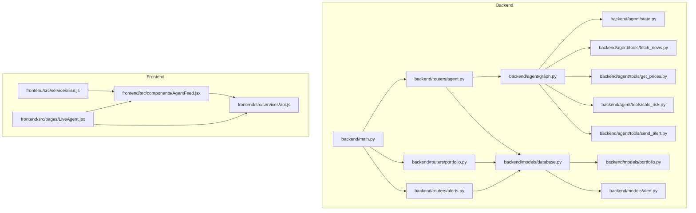

**Diagram sources**
- [backend/main.py:12-43](file://backend/main.py#L12-L43)
- [backend/routers/agent.py:39-168](file://backend/routers/agent.py#L39-L168)
- [backend/routers/portfolio.py:50-123](file://backend/routers/portfolio.py#L50-L123)
- [backend/routers/alerts.py:22-83](file://backend/routers/alerts.py#L22-L83)
- [backend/agent/graph.py:162-203](file://backend/agent/graph.py#L162-L203)
- [backend/models/database.py:29-41](file://backend/models/database.py#L29-L41)
- [frontend/src/services/sse.js:21-62](file://frontend/src/services/sse.js#L21-L62)
- [frontend/src/components/AgentFeed.jsx:28-96](file://frontend/src/components/AgentFeed.jsx#L28-L96)
- [frontend/src/pages/LiveAgent.jsx:15-94](file://frontend/src/pages/LiveAgent.jsx#L15-L94)
- [frontend/src/services/api.js:11-32](file://frontend/src/services/api.js#L11-L32)

**Section sources**
- [backend/main.py:12-43](file://backend/main.py#L12-L43)
- [backend/models/database.py:29-41](file://backend/models/database.py#L29-L41)

## Core Components
- LangGraph StateGraph workflow orchestrates four nodes: fetch_news, get_prices, calc_risk, and conditional send_alert/log_and_end. The workflow emits state deltas suitable for SSE streaming.
- SSE endpoint streams structured events to the frontend, including reasoning steps, risk metrics, alert triggers, and completion status.
- Portfolio and Alert models define JSON-based ticker storage and persisted reasoning/logs.
- Frontend components consume SSE and present live agent reasoning and risk visualization.

**Section sources**
- [backend/agent/graph.py:45-142](file://backend/agent/graph.py#L45-L142)
- [backend/agent/state.py:28-58](file://backend/agent/state.py#L28-L58)
- [backend/routers/agent.py:39-168](file://backend/routers/agent.py#L39-L168)
- [backend/models/portfolio.py:16-63](file://backend/models/portfolio.py#L16-L63)
- [backend/models/alert.py:14-77](file://backend/models/alert.py#L14-L77)
- [frontend/src/services/sse.js:21-62](file://frontend/src/services/sse.js#L21-L62)
- [frontend/src/components/AgentFeed.jsx:28-96](file://frontend/src/components/AgentFeed.jsx#L28-L96)

## Architecture Overview
The system integrates three major data flows:
1. Portfolio lifecycle: Create/update/delete portfolios with ticker-weight mappings stored as JSON.
2. Agent execution: SSE-driven streaming of agent reasoning and risk metrics.
3. Alert persistence: Save alert records with risk metrics, reasoning logs, and delivery status.

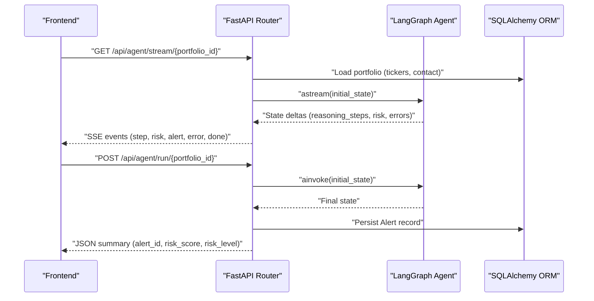

**Diagram sources**
- [backend/routers/agent.py:39-168](file://backend/routers/agent.py#L39-L168)
- [backend/agent/graph.py:162-203](file://backend/agent/graph.py#L162-L203)
- [backend/models/alert.py:14-77](file://backend/models/alert.py#L14-L77)

## Detailed Component Analysis

### LangGraph StateGraph Workflow
The workflow defines a linear pipeline with a conditional branch:
- Nodes: fetch_news → get_prices → calc_risk → [conditional] → send_alert/log_and_end
- Initial state factory constructs AgentState with portfolio, contact info, and audit trails.
- Conditional edge routes based on risk_score threshold.

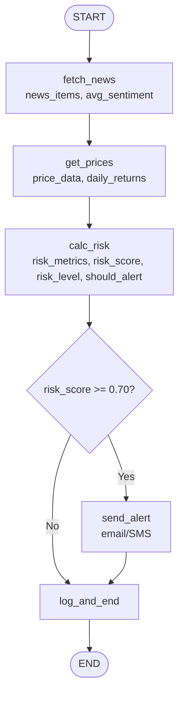

**Diagram sources**
- [backend/agent/graph.py:146-197](file://backend/agent/graph.py#L146-L197)
- [backend/agent/graph.py:210-242](file://backend/agent/graph.py#L210-L242)

**Section sources**
- [backend/agent/graph.py:162-203](file://backend/agent/graph.py#L162-L203)
- [backend/agent/state.py:28-58](file://backend/agent/state.py#L28-L58)

### Agent State Schema and Transitions
AgentState is a TypedDict carrying:
- Inputs: portfolio, portfolio_id, user_email, user_phone
- Intermediate: news_items, avg_sentiment, price_data, daily_returns, risk_metrics, risk_score, risk_level
- Control flags: should_alert, alert_message
- Audit: rag_context, reasoning_steps, errors

Each node returns a partial update; LangGraph merges updates into the shared state automatically.

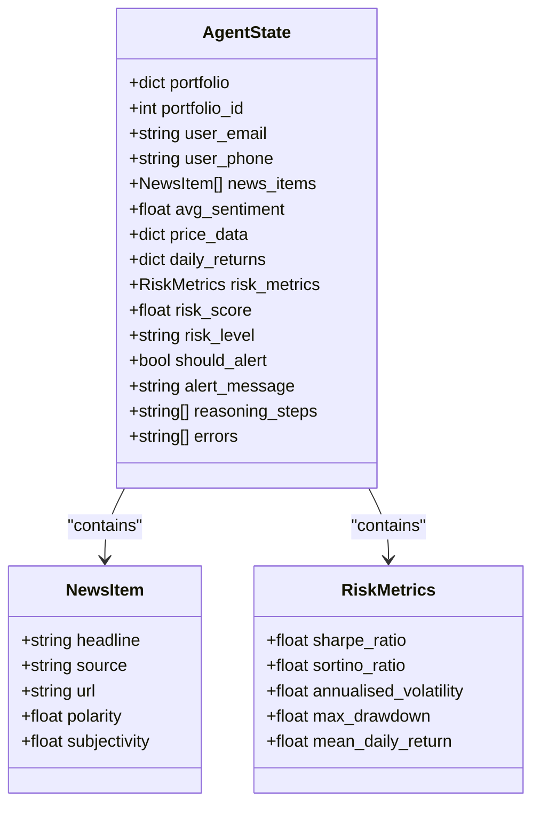

**Diagram sources**
- [backend/agent/state.py:12-58](file://backend/agent/state.py#L12-L58)

**Section sources**
- [backend/agent/state.py:28-58](file://backend/agent/state.py#L28-L58)

### Tools and Data Transformations
- fetch_news: Retrieves headlines and computes avg_sentiment; returns reasoning steps and errors.
- get_prices: Downloads 1-year histories (yfinance) or synthetic data; computes daily_returns.
- calc_risk: Computes Sharpe/Sortino/volatility/max_drawdown and a composite risk_score; determines risk_level and should_alert.
- send_alert: Sends email/SMS when appropriate; logs steps and errors.

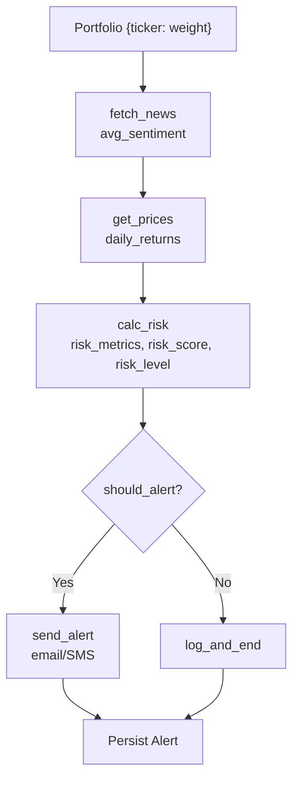

**Diagram sources**
- [backend/agent/tools/fetch_news.py:98-164](file://backend/agent/tools/fetch_news.py#L98-L164)
- [backend/agent/tools/get_prices.py:84-139](file://backend/agent/tools/get_prices.py#L84-L139)
- [backend/agent/tools/calc_risk.py:149-255](file://backend/agent/tools/calc_risk.py#L149-L255)
- [backend/agent/tools/send_alert.py:157-231](file://backend/agent/tools/send_alert.py#L157-L231)

**Section sources**
- [backend/agent/tools/fetch_news.py:98-164](file://backend/agent/tools/fetch_news.py#L98-L164)
- [backend/agent/tools/get_prices.py:84-139](file://backend/agent/tools/get_prices.py#L84-L139)
- [backend/agent/tools/calc_risk.py:149-255](file://backend/agent/tools/calc_risk.py#L149-L255)
- [backend/agent/tools/send_alert.py:157-231](file://backend/agent/tools/send_alert.py#L157-L231)

### Server-Sent Events Implementation
The SSE endpoint streams:
- type=start: initial handshake with portfolio metadata
- type=step: new reasoning step per node
- type=risk: risk_score, risk_level, risk_metrics
- type=alert: should_alert flag
- type=error: error messages
- type=done: alert_id when persistence completes

The backend snapshots DB state for the run and persists the Alert record after streaming completes.

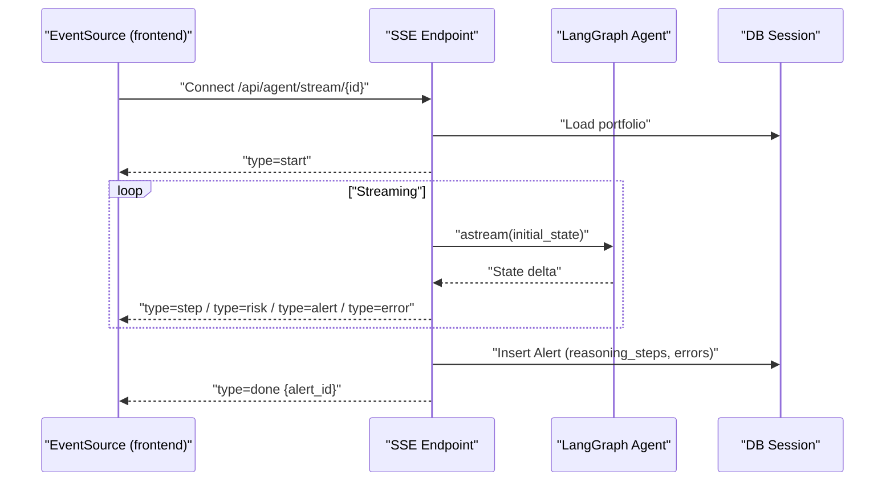

**Diagram sources**
- [backend/routers/agent.py:39-168](file://backend/routers/agent.py#L39-L168)
- [frontend/src/services/sse.js:21-62](file://frontend/src/services/sse.js#L21-L62)

**Section sources**
- [backend/routers/agent.py:39-168](file://backend/routers/agent.py#L39-L168)
- [frontend/src/services/sse.js:21-62](file://frontend/src/services/sse.js#L21-L62)

### Data Persistence Patterns
- Portfolio model stores tickers as JSON and exposes a property to parse/serialize weights.
- Alert model persists risk metrics, reasoning logs, errors, and delivery flags.
- The agent router persists Alert records after streaming completes, using a thread executor to avoid blocking the async loop.

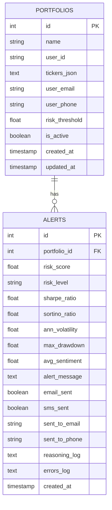

**Diagram sources**
- [backend/models/portfolio.py:16-63](file://backend/models/portfolio.py#L16-L63)
- [backend/models/alert.py:14-77](file://backend/models/alert.py#L14-L77)

**Section sources**
- [backend/models/portfolio.py:16-63](file://backend/models/portfolio.py#L16-L63)
- [backend/models/alert.py:14-77](file://backend/models/alert.py#L14-L77)
- [backend/routers/agent.py:171-182](file://backend/routers/agent.py#L171-L182)

### Portfolio Data Model and Validation
- Portfolio tickers are stored as JSON and parsed via a property; weights are validated on creation to sum approximately to 1.0.
- The portfolio router enforces weight normalization and exposes CRUD endpoints.

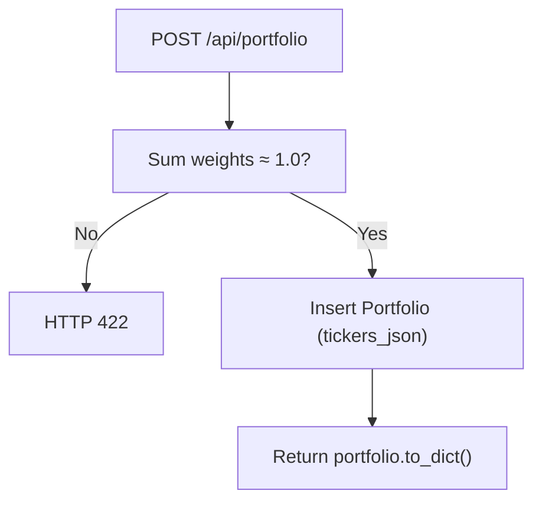

**Diagram sources**
- [backend/routers/portfolio.py:56-77](file://backend/routers/portfolio.py#L56-L77)
- [backend/models/portfolio.py:38-48](file://backend/models/portfolio.py#L38-L48)

**Section sources**
- [backend/routers/portfolio.py:56-77](file://backend/routers/portfolio.py#L56-L77)
- [backend/models/portfolio.py:38-48](file://backend/models/portfolio.py#L38-L48)

### Alert System Data Flow
- Risk threshold detection occurs in calc_risk; should_alert triggers conditional routing to send_alert.
- send_alert conditionally sends email/SMS and logs steps/errors; the agent router persists Alert with reasoning logs and delivery flags.

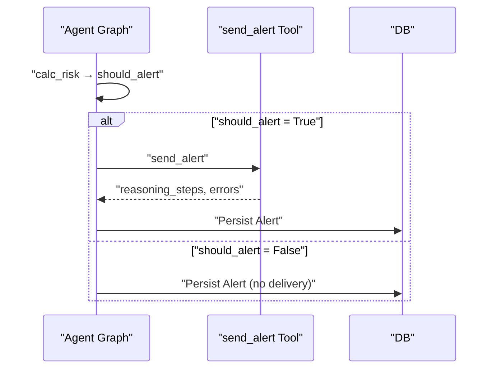

**Diagram sources**
- [backend/agent/graph.py:146-155](file://backend/agent/graph.py#L146-L155)
- [backend/agent/tools/send_alert.py:157-231](file://backend/agent/tools/send_alert.py#L157-L231)
- [backend/routers/agent.py:128-158](file://backend/routers/agent.py#L128-L158)

**Section sources**
- [backend/agent/tools/send_alert.py:157-231](file://backend/agent/tools/send_alert.py#L157-L231)
- [backend/routers/agent.py:128-158](file://backend/routers/agent.py#L128-L158)

### Real-Time Visualization
- AgentFeed consumes SSE events and renders live reasoning steps, risk metrics, and alert triggers.
- LiveAgent page pairs the AgentFeed with a RiskGauge component to visualize risk_score and risk_level.

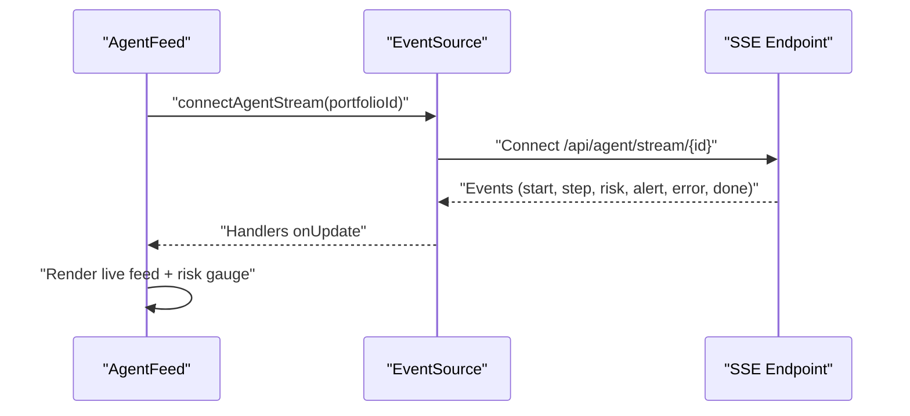

**Diagram sources**
- [frontend/src/services/sse.js:21-62](file://frontend/src/services/sse.js#L21-L62)
- [frontend/src/components/AgentFeed.jsx:28-96](file://frontend/src/components/AgentFeed.jsx#L28-L96)
- [frontend/src/pages/LiveAgent.jsx:53-71](file://frontend/src/pages/LiveAgent.jsx#L53-L71)

**Section sources**
- [frontend/src/services/sse.js:21-62](file://frontend/src/services/sse.js#L21-L62)
- [frontend/src/components/AgentFeed.jsx:28-96](file://frontend/src/components/AgentFeed.jsx#L28-L96)
- [frontend/src/pages/LiveAgent.jsx:53-71](file://frontend/src/pages/LiveAgent.jsx#L53-L71)

## Dependency Analysis
- Backend FastAPI app wires routers and initializes DB tables on startup.
- Agent router depends on the compiled LangGraph agent and SQLAlchemy models.
- Tools depend on external APIs (NewsAPI, yfinance) with fallbacks to mock data.
- Frontend depends on Axios for REST and EventSource for SSE.

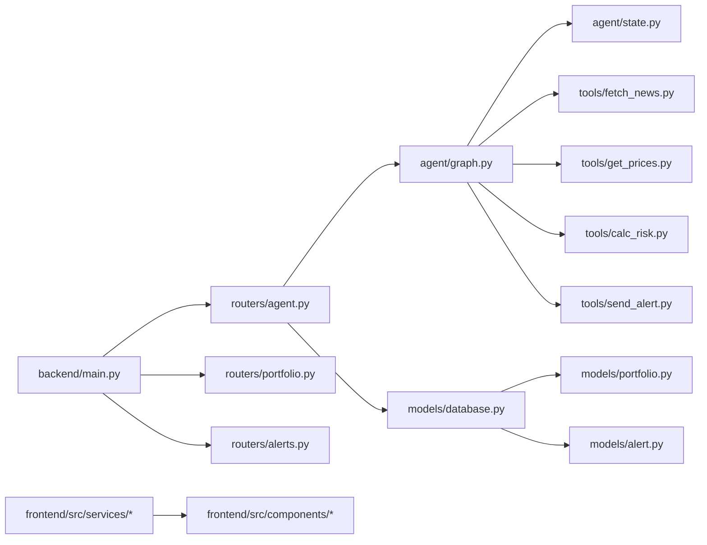

**Diagram sources**
- [backend/main.py:39-43](file://backend/main.py#L39-L43)
- [backend/routers/agent.py:24-24](file://backend/routers/agent.py#L24-L24)
- [backend/agent/graph.py:26-32](file://backend/agent/graph.py#L26-L32)
- [backend/models/database.py:39-41](file://backend/models/database.py#L39-L41)

**Section sources**
- [backend/main.py:39-43](file://backend/main.py#L39-L43)
- [backend/routers/agent.py:24-24](file://backend/routers/agent.py#L24-L24)
- [backend/agent/graph.py:26-32](file://backend/agent/graph.py#L26-L32)
- [backend/models/database.py:39-41](file://backend/models/database.py#L39-L41)

## Performance Considerations
- SSE streaming introduces latency proportional to network and event frequency; a small delay is applied to improve readability.
- DB writes occur after streaming completes; using a thread executor prevents blocking the async loop.
- Tools include offline fallbacks (mock data) to maintain responsiveness under network failures.
- Risk calculation validates input sizes and returns defaults when insufficient data is available.

[No sources needed since this section provides general guidance]

## Troubleshooting Guide
- SSE connection errors: The frontend handler logs a generic message when the connection fails or the server restarts.
- Agent run failures: The backend catches exceptions and streams an error event; the run continues to persist Alert with minimal data.
- Validation errors: Portfolio creation requires weights to sum approximately to 1.0; otherwise returns HTTP 422.
- External API failures: Tools log fallback behavior (e.g., mock data) and continue execution.

**Section sources**
- [frontend/src/services/sse.js:54-57](file://frontend/src/services/sse.js#L54-L57)
- [backend/routers/agent.py:123-126](file://backend/routers/agent.py#L123-L126)
- [backend/routers/portfolio.py:60-65](file://backend/routers/portfolio.py#L60-L65)
- [backend/agent/tools/fetch_news.py:123-130](file://backend/agent/tools/fetch_news.py#L123-L130)
- [backend/agent/tools/get_prices.py:111-116](file://backend/agent/tools/get_prices.py#L111-L116)
- [backend/agent/tools/calc_risk.py:178-202](file://backend/agent/tools/calc_risk.py#L178-L202)

## Conclusion
The ishwarambare-app system integrates a LangGraph-powered agent with robust SSE streaming and SQLAlchemy persistence. The portfolio data model uses JSON-based ticker storage with validation, while the alert system tracks risk events and delivery outcomes. The frontend provides real-time visualization and responsive user controls. The architecture balances reliability with flexibility through tool-level fallbacks and asynchronous persistence.

[No sources needed since this section summarizes without analyzing specific files]

## Appendices

### Typical User Workflows

#### Portfolio Analysis Workflow
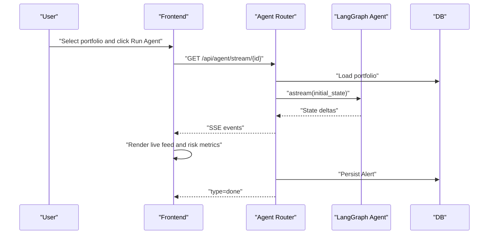

**Diagram sources**
- [backend/routers/agent.py:39-168](file://backend/routers/agent.py#L39-L168)
- [frontend/src/components/AgentFeed.jsx:48-77](file://frontend/src/components/AgentFeed.jsx#L48-L77)

#### Real-Time Monitoring Workflow
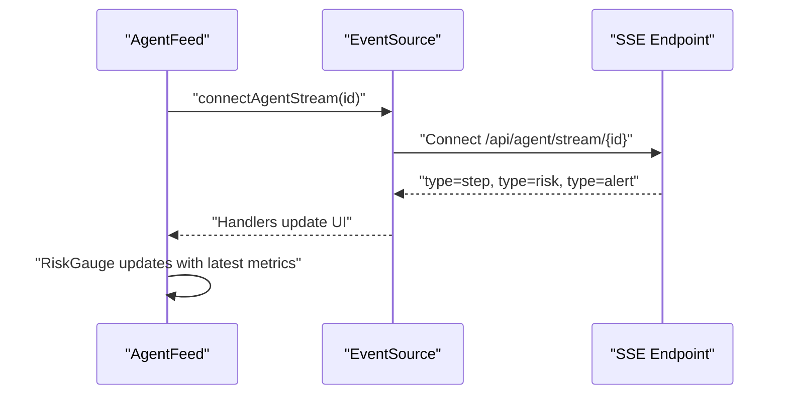

**Diagram sources**
- [frontend/src/services/sse.js:21-62](file://frontend/src/services/sse.js#L21-L62)
- [frontend/src/components/AgentFeed.jsx:56-64](file://frontend/src/components/AgentFeed.jsx#L56-L64)

#### Alert Management Workflow
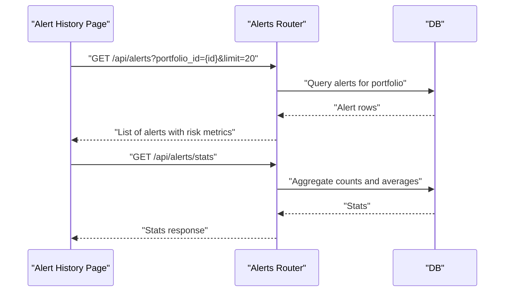

**Diagram sources**
- [backend/routers/alerts.py:43-56](file://backend/routers/alerts.py#L43-L56)
- [backend/routers/alerts.py:59-83](file://backend/routers/alerts.py#L59-L83)