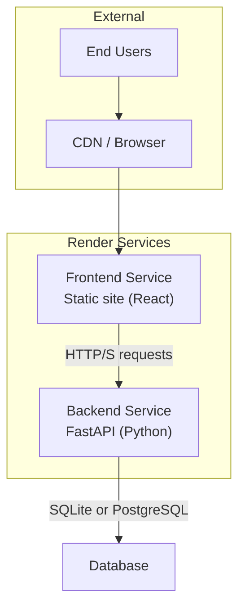
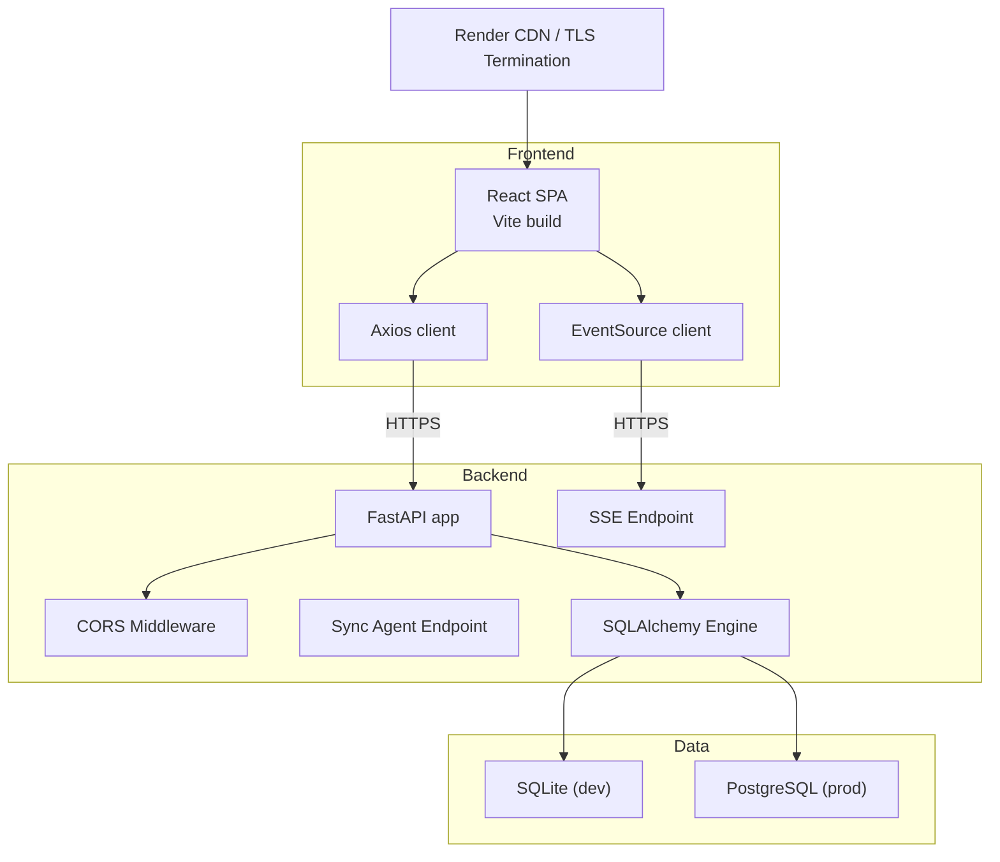
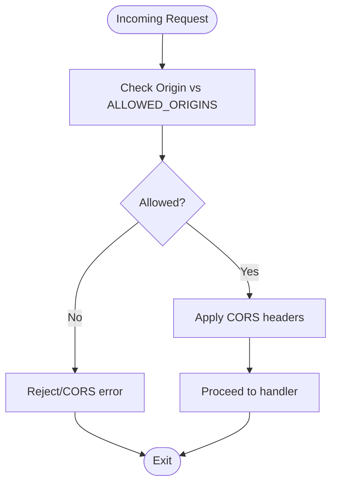
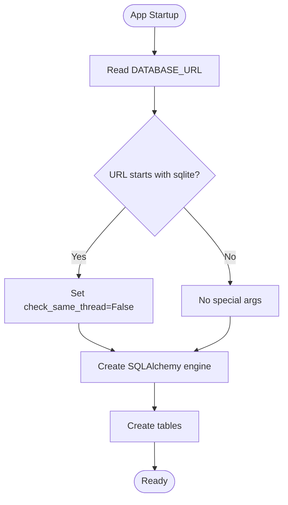
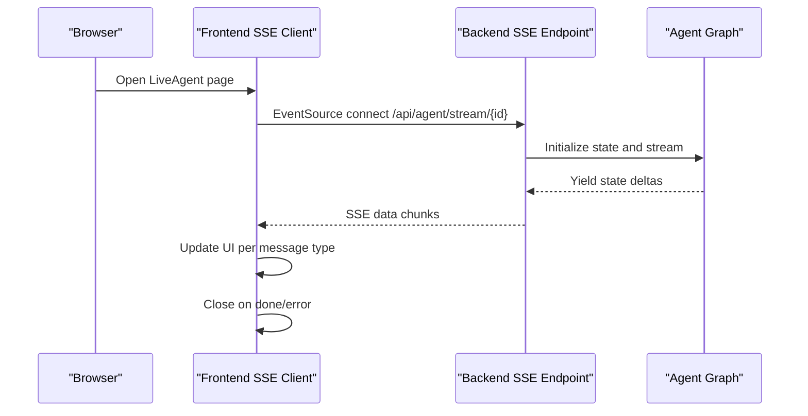
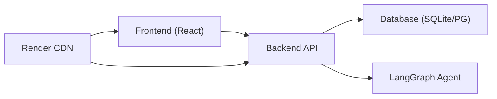

# Deployment Architecture

<cite>
**Referenced Files in This Document**
- [render.yaml](file://render.yaml)
- [README.md](file://README.md)
- [backend/main.py](file://backend/main.py)
- [backend/routers/agent.py](file://backend/routers/agent.py)
- [backend/models/database.py](file://backend/models/database.py)
- [backend/requirements.txt](file://backend/requirements.txt)
- [frontend/vite.config.js](file://frontend/vite.config.js)
- [frontend/package.json](file://frontend/package.json)
- [frontend/src/services/sse.js](file://frontend/src/services/sse.js)
- [frontend/src/services/api.js](file://frontend/src/services/api.js)
- [backend/agent/graph.py](file://backend/agent/graph.py)
- [backend/models/alert.py](file://backend/models/alert.py)
- [backend/models/portfolio.py](file://backend/models/portfolio.py)
- [backend/routers/auth.py](file://backend/routers/auth.py)
</cite>

## Table of Contents
1. [Introduction](#introduction)
2. [Project Structure](#project-structure)
3. [Core Components](#core-components)
4. [Architecture Overview](#architecture-overview)
5. [Detailed Component Analysis](#detailed-component-analysis)
6. [Dependency Analysis](#dependency-analysis)
7. [Performance Considerations](#performance-considerations)
8. [Troubleshooting Guide](#troubleshooting-guide)
9. [Conclusion](#conclusion)
10. [Appendices](#appendices)

## Introduction
This document describes the deployment architecture for the ishwarambare-app system on the Render platform. It covers the Render blueprint configuration for separate frontend and backend services, environment variable management, containerization approach, database configuration for development and production, CORS configuration, deployment pipeline, scaling considerations, security configurations, infrastructure diagrams, and monitoring/logging guidance.

## Project Structure
The repository is organized into two primary parts:
- backend: FastAPI application with routers, models, agent graph, and Celery task support
- frontend: React + Vite single-page application with API and SSE clients

**Diagram sources**
- [render.yaml:4-43](file://render.yaml#L4-L43)
- [backend/main.py:12-59](file://backend/main.py#L12-L59)
- [backend/models/database.py:15-20](file://backend/models/database.py#L15-L20)

**Section sources**
- [README.md:5-25](file://README.md#L5-L25)
- [render.yaml:4-43](file://render.yaml#L4-L43)

## Core Components
- Render blueprint defines two services:
  - Backend: Python web service serving FastAPI with health checks and environment variables
  - Frontend: Static site built by Vite with SPA fallback and cache-control headers
- Environment variables:
  - Backend: ALLOWED_ORIGINS, ENVIRONMENT, SECRET_KEY
  - Frontend: VITE_API_URL pointing to the backend service URL on Render
- CORS middleware configured in backend to support SSE and cross-origin requests
- Database defaults to SQLite for development; production can use PostgreSQL via DATABASE_URL

**Section sources**
- [render.yaml:6-21](file://render.yaml#L6-L21)
- [render.yaml:24-42](file://render.yaml#L24-L42)
- [backend/main.py:18-30](file://backend/main.py#L18-L30)
- [backend/models/database.py:15-18](file://backend/models/database.py#L15-L18)

## Architecture Overview
The system consists of:
- Frontend service hosting a static React application
- Backend service hosting a FastAPI application exposing REST APIs and SSE endpoints
- Database abstraction supporting SQLite (development) and PostgreSQL (production)
- CORS configuration enabling browser-to-backend communication and SSE compatibility
- Health checks and automatic deployment via Render blueprint

**Diagram sources**
- [render.yaml:4-43](file://render.yaml#L4-L43)
- [backend/main.py:18-30](file://backend/main.py#L18-L30)
- [backend/routers/agent.py:39-168](file://backend/routers/agent.py#L39-L168)
- [backend/models/database.py:15-20](file://backend/models/database.py#L15-L20)

## Detailed Component Analysis

### Render Blueprint Configuration
- Backend service:
  - Runtime: Python
  - Region: Singapore
  - Plan: Free
  - Root directory: backend
  - Build command installs requirements
  - Start command runs Uvicorn with PORT
  - Health check path: /health
  - Environment variables include allowed origins, environment flag, and generated secret key
- Frontend service:
  - Runtime: static
  - Region: Singapore
  - Plan: Free
  - Root directory: frontend
  - Build command installs dependencies and builds dist
  - Static publish path: dist
  - Headers set Cache-Control to no-cache
  - Routes include SPA rewrite to index.html
  - Environment variable sets VITE_API_URL to the backend service URL

**Section sources**
- [render.yaml:6-21](file://render.yaml#L6-L21)
- [render.yaml:24-42](file://render.yaml#L24-L42)

### CORS Configuration
- Backend enables CORS middleware with broad allowances to support SSE and cross-origin requests
- ALLOWED_ORIGINS is loaded from environment with a default fallback origin
- SSE endpoint sets per-response headers to ensure compatibility

**Diagram sources**
- [backend/main.py:18-30](file://backend/main.py#L18-L30)
- [backend/routers/agent.py:160-168](file://backend/routers/agent.py#L160-L168)

**Section sources**
- [backend/main.py:18-30](file://backend/main.py#L18-L30)
- [backend/routers/agent.py:160-168](file://backend/routers/agent.py#L160-L168)

### Database Configuration
- Default database URL falls back to SQLite for local development
- Production can override DATABASE_URL to use PostgreSQL
- SQLite requires specific connection arguments for multi-threaded operation
- Startup hook creates tables on first run

**Diagram sources**
- [backend/models/database.py:15-20](file://backend/models/database.py#L15-L20)
- [backend/models/database.py:38-42](file://backend/models/database.py#L38-L42)
- [backend/main.py:33-35](file://backend/main.py#L33-L35)

**Section sources**
- [backend/models/database.py:15-18](file://backend/models/database.py#L15-L18)
- [backend/models/database.py:38-42](file://backend/models/database.py#L38-L42)
- [backend/main.py:33-35](file://backend/main.py#L33-L35)

### Real-Time Streaming (SSE)
- SSE endpoint streams agent reasoning steps, risk metrics, and alerts
- Client connects via EventSource and handles typed messages
- Backend sets appropriate headers for streaming and disables caching
- Agent graph emits deltas suitable for streaming

**Diagram sources**
- [frontend/src/services/sse.js:21-62](file://frontend/src/services/sse.js#L21-L62)
- [backend/routers/agent.py:39-168](file://backend/routers/agent.py#L39-L168)
- [backend/agent/graph.py:162-200](file://backend/agent/graph.py#L162-L200)

**Section sources**
- [frontend/src/services/sse.js:19-23](file://frontend/src/services/sse.js#L19-L23)
- [backend/routers/agent.py:39-168](file://backend/routers/agent.py#L39-L168)
- [backend/agent/graph.py:162-200](file://backend/agent/graph.py#L162-L200)

### Frontend API Integration
- Axios client configured with base URL from VITE_API_URL
- API module exposes portfolio, agent, and alerts endpoints
- Development proxy forwards /api to backend during local dev

**Section sources**
- [frontend/src/services/api.js:3-9](file://frontend/src/services/api.js#L3-L9)
- [frontend/src/services/api.js:21-24](file://frontend/src/services/api.js#L21-L24)
- [frontend/vite.config.js:9-16](file://frontend/vite.config.js#L9-L16)

### Authentication Router
- Demo login endpoint returns a bearer token stub
- Me endpoint returns a demo user profile
- Intended to be replaced with JWT and database-backed auth

**Section sources**
- [backend/routers/auth.py:18-38](file://backend/routers/auth.py#L18-L38)

### Data Models
- Portfolio model stores ticker weights and user contact for alerts
- Alert model persists risk metrics, alert decisions, reasoning logs, and errors
- These models are created on startup and used by agent endpoints

**Section sources**
- [backend/models/portfolio.py:16-62](file://backend/models/portfolio.py#L16-L62)
- [backend/models/alert.py:14-76](file://backend/models/alert.py#L14-L76)
- [backend/models/database.py:38-42](file://backend/models/database.py#L38-L42)

## Dependency Analysis
- Frontend depends on backend for API and SSE endpoints
- Backend depends on SQLAlchemy for ORM and database connectivity
- Backend depends on LangGraph for agent orchestration
- Render manages environment variables and routing between services

**Diagram sources**
- [render.yaml:4-43](file://render.yaml#L4-L43)
- [backend/models/database.py:15-20](file://backend/models/database.py#L15-L20)
- [backend/agent/graph.py:26-34](file://backend/agent/graph.py#L26-L34)

**Section sources**
- [backend/requirements.txt:1-20](file://backend/requirements.txt#L1-L20)
- [frontend/package.json:11-19](file://frontend/package.json#L11-L19)

## Performance Considerations
- Containerization approach:
  - Backend service uses Python runtime with explicit build/start commands
  - Frontend service uses static runtime with build and publish path
  - No Dockerfile present; Render builds using runtime and commands
- Database:
  - SQLite is zero-config for development; PostgreSQL recommended for production
  - Use DATABASE_URL to switch environments
- Streaming:
  - SSE endpoint emits incremental updates; ensure client-side buffering and backpressure handling
- Concurrency:
  - Agent runs are CPU-bound; scale horizontally by adding more backend instances
  - SSE connections are long-lived; plan for connection limits and keep-alive behavior

[No sources needed since this section provides general guidance]

## Troubleshooting Guide
- Health checks:
  - Backend exposes /health; verify status is healthy after deployment
- CORS errors:
  - Confirm ALLOWED_ORIGINS includes frontend domains
  - Verify frontend VITE_API_URL points to the backend service URL
- Database connectivity:
  - For SQLite, ensure tables are created on startup
  - For PostgreSQL, confirm DATABASE_URL credentials and network accessibility
- SSE issues:
  - Check backend SSE headers and client EventSource handling
  - Validate agent endpoint availability and agent status

**Section sources**
- [backend/main.py:56-58](file://backend/main.py#L56-L58)
- [backend/main.py:18-30](file://backend/main.py#L18-L30)
- [backend/models/database.py:38-42](file://backend/models/database.py#L38-L42)
- [backend/routers/agent.py:235-242](file://backend/routers/agent.py#L235-L242)

## Conclusion
The ishwarambare-app deployment leverages Render’s blueprint to host a React frontend and a FastAPI backend with integrated SSE streaming. Environment variables manage CORS and secrets, while the database supports both SQLite for development and PostgreSQL for production. The architecture is designed for scalability and maintainability, with clear separation of concerns and straightforward operational controls.

[No sources needed since this section summarizes without analyzing specific files]

## Appendices

### Deployment Pipeline and Rollback Procedures
- Automatic deployment:
  - Push to GitHub; Render reads render.yaml and provisions services
- Health checks:
  - Backend health endpoint ensures readiness
- Rollback:
  - Render allows redeploying previous commits or switching to stable releases via dashboard controls

**Section sources**
- [README.md:78-86](file://README.md#L78-L86)
- [render.yaml:14](file://render.yaml#L14)

### Security Configurations
- SSL/TLS:
  - Render terminates TLS at CDN; ensure custom domain certificates are configured in the dashboard
- Secrets:
  - SECRET_KEY is generated by Render; configure additional secrets via environment variables
- Access control:
  - Authentication endpoints are demo-only; replace with JWT and database-backed auth

**Section sources**
- [README.md:96-108](file://README.md#L96-L108)
- [render.yaml:20](file://render.yaml#L20)
- [backend/routers/auth.py:18-38](file://backend/routers/auth.py#L18-L38)

### Monitoring and Logging
- Logging:
  - Backend logs exceptions and agent events; integrate with Render logs
- Metrics:
  - Track backend health, uptime, and request latency via Render dashboard
- Observability:
  - Consider adding structured logging and external monitoring for production

**Section sources**
- [backend/routers/agent.py:123-126](file://backend/routers/agent.py#L123-L126)
- [backend/main.py:12-16](file://backend/main.py#L12-L16)