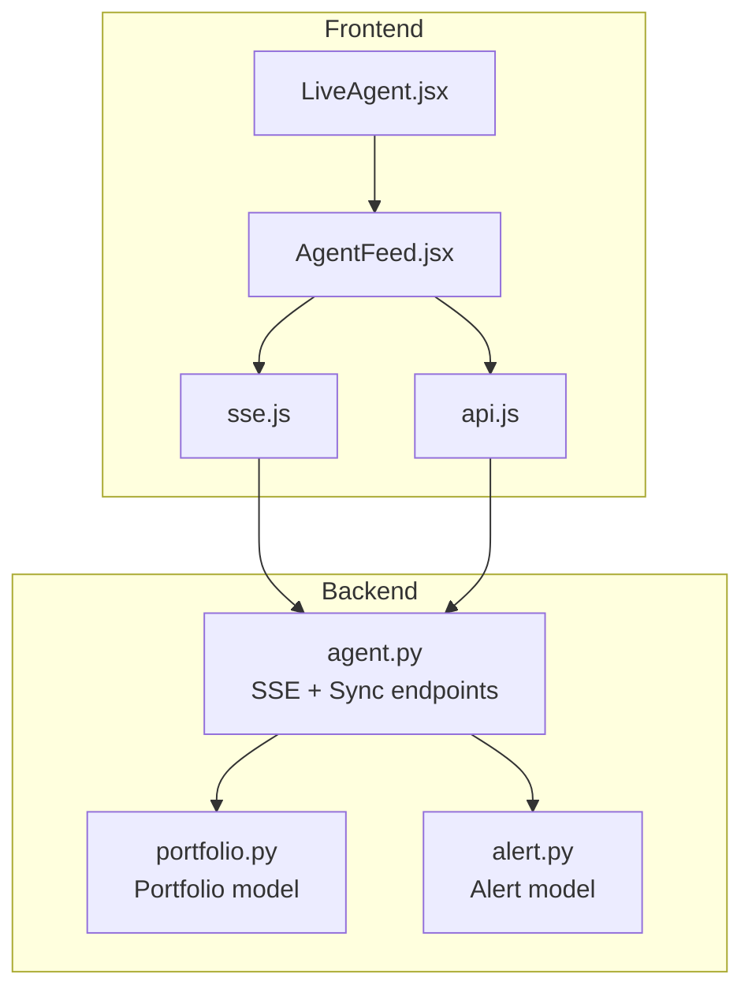
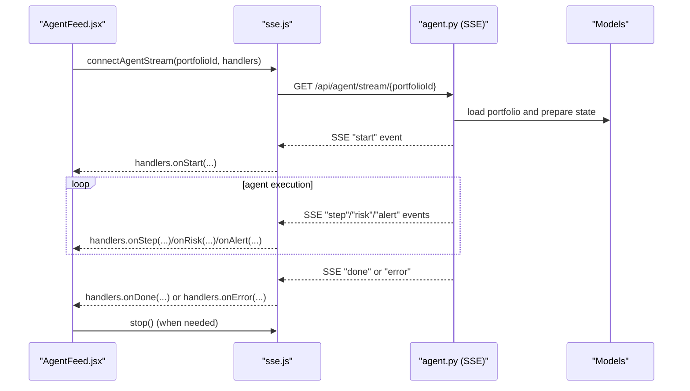
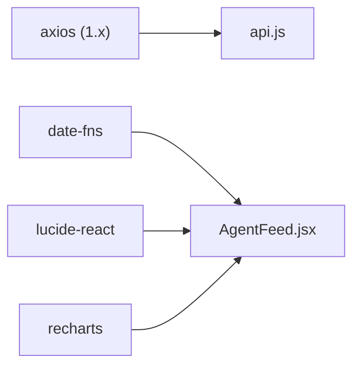

# API Integration Layer

<cite>
**Referenced Files in This Document**
- [api.js](file://frontend/src/services/api.js)
- [sse.js](file://frontend/src/services/sse.js)
- [LiveAgent.jsx](file://frontend/src/pages/LiveAgent.jsx)
- [AgentFeed.jsx](file://frontend/src/components/AgentFeed.jsx)
- [agent.py](file://backend/routers/agent.py)
- [portfolio.py](file://backend/models/portfolio.py)
- [alert.py](file://backend/models/alert.py)
- [package.json](file://frontend/package.json)
</cite>

## Table of Contents
1. [Introduction](#introduction)
2. [Project Structure](#project-structure)
3. [Core Components](#core-components)
4. [Architecture Overview](#architecture-overview)
5. [Detailed Component Analysis](#detailed-component-analysis)
6. [Dependency Analysis](#dependency-analysis)
7. [Performance Considerations](#performance-considerations)
8. [Troubleshooting Guide](#troubleshooting-guide)
9. [Conclusion](#conclusion)

## Introduction
This document describes the frontend API integration layer used by the ishwarambare-app React application. It focuses on:
- Axios-based HTTP client configuration and API surface
- Server-Sent Events (SSE) implementation for real-time streaming of agent execution data
- Integration patterns, data transformation, and error handling
- Backend endpoint contracts and schemas
- Performance optimizations and offline handling considerations

## Project Structure
The frontend API integration layer is organized around two primary modules:
- Services: Axios-based HTTP client and SSE wrapper
- Pages and Components: Consumers of the services for live agent runs and portfolio management

**Diagram sources**
- [LiveAgent.jsx](file://frontend/src/pages/LiveAgent.jsx)
- [AgentFeed.jsx](file://frontend/src/components/AgentFeed.jsx)
- [api.js](file://frontend/src/services/api.js)
- [sse.js](file://frontend/src/services/sse.js)
- [agent.py](file://backend/routers/agent.py)
- [portfolio.py](file://backend/models/portfolio.py)
- [alert.py](file://backend/models/alert.py)

**Section sources**
- [api.js](file://frontend/src/services/api.js)
- [sse.js](file://frontend/src/services/sse.js)
- [LiveAgent.jsx](file://frontend/src/pages/LiveAgent.jsx)
- [AgentFeed.jsx](file://frontend/src/components/AgentFeed.jsx)
- [agent.py](file://backend/routers/agent.py)

## Core Components
- Axios HTTP client module defines base URL, timeouts, headers, and API method groups for portfolio, agent, and alerts.
- SSE module wraps EventSource to connect to the backend’s agent stream endpoint and dispatches typed events to handler callbacks.
- Consumer components orchestrate lifecycle, rendering, and state updates based on API responses and SSE events.

Key characteristics:
- Base URL resolution via environment variable with sensible fallback
- Centralized API method grouping for clean usage
- SSE event routing to handlers with graceful error handling and connection closure
- Real-time UI updates driven by SSE messages

**Section sources**
- [api.js](file://frontend/src/services/api.js)
- [sse.js](file://frontend/src/services/sse.js)

## Architecture Overview
The integration layer follows a unidirectional data flow:
- Components trigger actions (e.g., start agent run)
- Services call backend endpoints (HTTP or SSE)
- Backend responds with structured data or streams events
- Services forward parsed data to consumers
- Consumers update UI state and render results

**Diagram sources**
- [AgentFeed.jsx](file://frontend/src/components/AgentFeed.jsx)
- [sse.js](file://frontend/src/services/sse.js)
- [agent.py](file://backend/routers/agent.py)

## Detailed Component Analysis

### Axios HTTP Client (api.js)
Responsibilities:
- Configure base URL, timeout, and default headers
- Expose typed API groups:
  - Portfolio: list, get, create, update, delete
  - Agent: run, status
  - Alerts: list, detail, stats, forPortfolio

Behavior highlights:
- Base URL resolved from environment variable with local fallback
- Timeout configured for long-running operations
- JSON content-type header standardized

Usage patterns:
- Components import specific API groups and call exported functions
- Returned promises resolve to Axios responses with data, status, headers

Integration points:
- Used by LiveAgent page to populate portfolio selection
- Can be extended to support interceptors for auth tokens

**Section sources**
- [api.js](file://frontend/src/services/api.js)
- [LiveAgent.jsx](file://frontend/src/pages/LiveAgent.jsx)

### Server-Sent Events Wrapper (sse.js)
Responsibilities:
- Construct SSE URL from base URL and portfolio ID
- Open EventSource connection
- Parse incoming messages and route by type
- Dispatch typed callbacks: onStart, onStep, onRisk, onAlert, onDone, onError
- Close connection on done or error and expose stop()

Event types:
- start: initial handshake with portfolio metadata
- step: incremental reasoning step from a node
- risk: computed risk metrics
- alert: alert decision outcome
- done: run completion with optional alert ID
- error: error message string

Error handling:
- JSON parse guard prevents malformed payloads
- onerror handler notifies consumer and closes connection
- Default error message indicates possible server restart or completion

Connection management:
- Returns a controller with stop() to close the EventSource
- Consumers should call stop() on cleanup or when switching runs

**Section sources**
- [sse.js](file://frontend/src/services/sse.js)
- [AgentFeed.jsx](file://frontend/src/components/AgentFeed.jsx)

### Consumer Integration (AgentFeed.jsx)
Responsibilities:
- Manage run state: idle, running, done, error
- Track step count and log lines
- Render real-time feed with node classification and status indicators
- Start/stop SSE stream via controller
- Update risk gauge via callback

Lifecycle:
- On mount, initialize empty state
- On start, clear logs, reset counters, open SSE stream with handlers
- On stop, close stream and reset UI state
- On done, mark completion and optionally notify parent

Rendering:
- Auto-scroll to latest line
- Color-coded node tags and severity-based message classes
- Status bar reflects current state

**Section sources**
- [AgentFeed.jsx](file://frontend/src/components/AgentFeed.jsx)

### Backend Endpoint Contracts (agent.py)
SSE endpoint:
- Path: GET /api/agent/stream/{portfolio_id}
- Media type: text/event-stream
- Events:
  - start: { type: "start", name: string, portfolio: dict }
  - step: { type: "step", node: string, message: string }
  - risk: { type: "risk", risk_score: number, risk_level: string, metrics: dict }
  - alert: { type: "alert", triggered: boolean }
  - done: { type: "done", alert_id?: int }
  - error: { type: "error", message: string }

Headers:
- Cache-Control: no-cache
- X-Accel-Buffering: no (for Nginx)
- Access-Control-Allow-Origin: *

Sync run endpoint:
- POST /api/agent/run/{portfolio_id}
- Returns JSON summary with alert_id, risk_score, risk_level, should_alert, risk_metrics

Status endpoint:
- GET /api/agent/status
- Returns readiness and metadata

Persistence:
- After streaming completes, backend persists alert record with risk metrics, reasoning steps, and delivery flags

**Section sources**
- [agent.py](file://backend/routers/agent.py)

### Data Models (portfolio.py, alert.py)
Portfolio model:
- Stores portfolio name, user association, ticker weights (JSON), contact info, risk threshold, and timestamps
- Provides helper to_dict for serialization

Alert model:
- Stores risk metrics, delivery flags, reasoning steps (JSON array), errors log (JSON array), and timestamps
- Provides to_dict for serialization and property helpers to manage JSON fields

These models underpin the backend’s SSE and persistence behavior, ensuring consistent data flow to the frontend.

**Section sources**
- [portfolio.py](file://backend/models/portfolio.py)
- [alert.py](file://backend/models/alert.py)

## Dependency Analysis
External dependencies relevant to the integration layer:
- Axios: HTTP client used by api.js
- date-fns: used by other components for time formatting
- lucide-react: UI icons used by AgentFeed and others
- recharts: charting library used by PortfolioChart and related components

**Diagram sources**
- [package.json](file://frontend/package.json)
- [AgentFeed.jsx](file://frontend/src/components/AgentFeed.jsx)

**Section sources**
- [package.json](file://frontend/package.json)

## Performance Considerations
- SSE buffering and pacing:
  - Backend intentionally delays between steps for readability; frontend should remain responsive by avoiding heavy synchronous work per event.
- Rendering efficiency:
  - AgentFeed appends lines and relies on React reconciliation; keep message parsing lightweight.
- Network timeouts:
  - Axios timeout is set to balance responsiveness with long-running operations; adjust based on deployment latency.
- Connection lifecycle:
  - Always call stop() on SSE controller to prevent resource leaks when switching runs or unmounting.
- Backend persistence:
  - Database writes occur after streaming; ensure backend remains responsive and consider connection pooling tuning.

[No sources needed since this section provides general guidance]

## Troubleshooting Guide
Common issues and resolutions:
- SSE connection fails or closes unexpectedly:
  - Verify backend endpoint availability and CORS headers.
  - Confirm portfolio_id exists in the database.
  - Check browser console for network errors.
- No events received after start:
  - Ensure portfolio has tickers and the agent graph can execute.
  - Validate that the backend is not rate-limiting or restarting frequently.
- Error events:
  - The SSE wrapper emits a generic error message when the connection drops; inspect backend logs for root causes.
- Port forwarding or environment:
  - Confirm VITE_API_URL points to the correct backend host/port.

Operational checks:
- Health endpoints:
  - Use the backend’s /health and /api/agent/status to confirm service readiness.
- Frontend health:
  - Use the home page’s health check pattern to verify connectivity.

**Section sources**
- [agent.py](file://backend/routers/agent.py)
- [LiveAgent.jsx](file://frontend/src/pages/LiveAgent.jsx)

## Conclusion
The frontend API integration layer cleanly separates concerns:
- api.js centralizes HTTP interactions with a clear contract for portfolio, agent, and alerts operations.
- sse.js encapsulates SSE connection management and event routing, enabling robust real-time UI updates.
- Backend endpoints provide structured SSE events and deterministic persistence, ensuring reliable data flow.

Future enhancements could include:
- Adding Axios interceptors for centralized auth token injection
- Implementing retry and exponential backoff for SSE connections
- Introducing caching strategies for portfolio lists and alert history
- Offline handling via service workers or local storage for partial resilience

[No sources needed since this section summarizes without analyzing specific files]