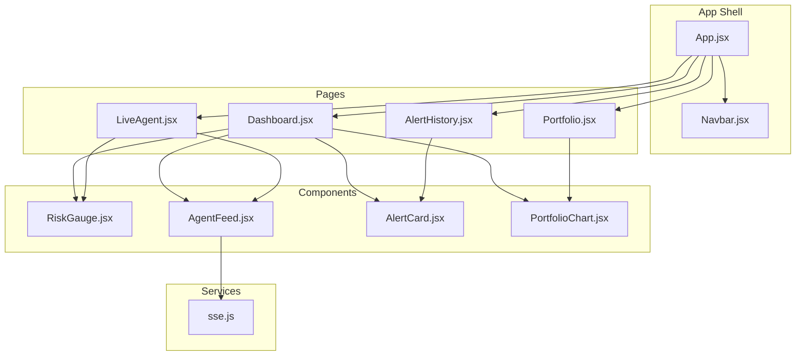
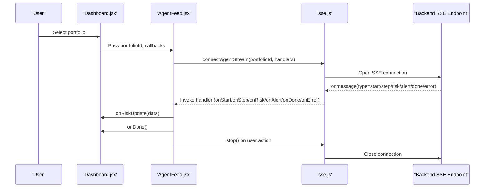
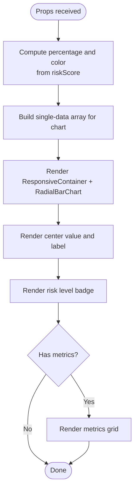
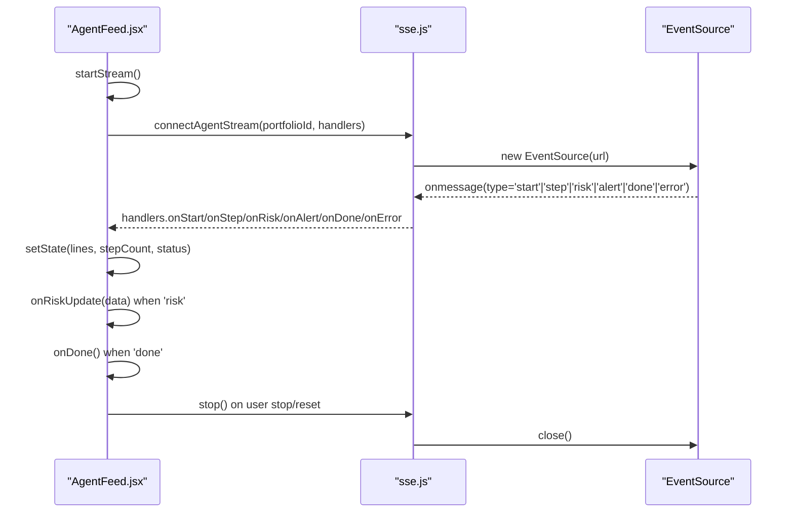
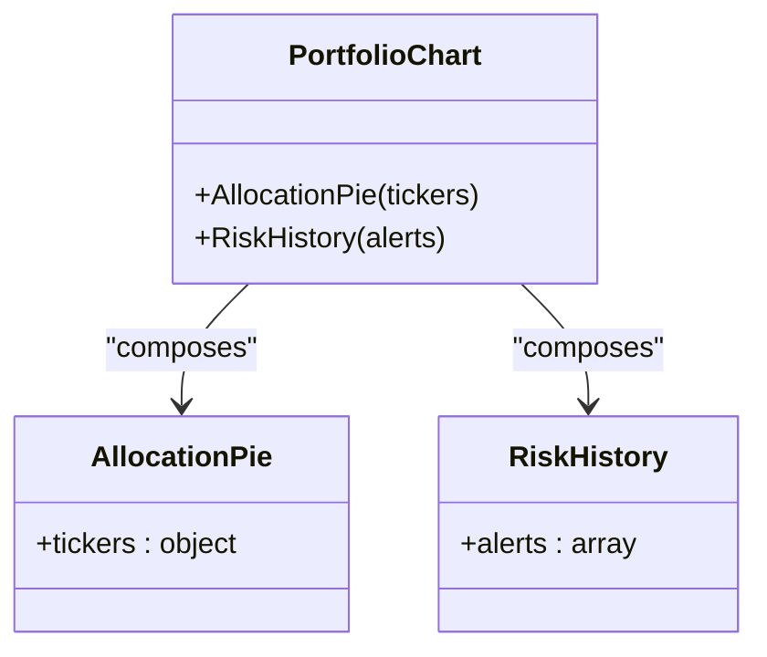
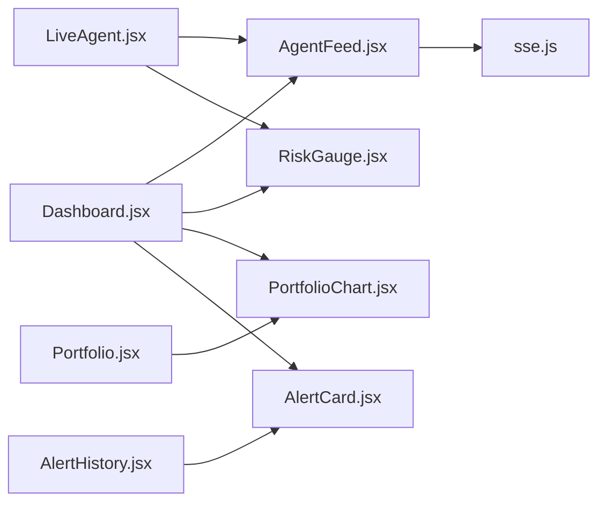

# Component Library

<cite>
**Referenced Files in This Document**
- [Navbar.jsx](file://frontend/src/components/Navbar.jsx)
- [RiskGauge.jsx](file://frontend/src/components/RiskGauge.jsx)
- [AgentFeed.jsx](file://frontend/src/components/AgentFeed.jsx)
- [AlertCard.jsx](file://frontend/src/components/AlertCard.jsx)
- [PortfolioChart.jsx](file://frontend/src/components/PortfolioChart.jsx)
- [sse.js](file://frontend/src/services/sse.js)
- [App.jsx](file://frontend/src/App.jsx)
- [Dashboard.jsx](file://frontend/src/pages/Dashboard.jsx)
- [Portfolio.jsx](file://frontend/src/pages/Portfolio.jsx)
- [AlertHistory.jsx](file://frontend/src/pages/AlertHistory.jsx)
- [LiveAgent.jsx](file://frontend/src/pages/LiveAgent.jsx)
- [index.css](file://frontend/src/index.css)
- [package.json](file://frontend/package.json)
</cite>

## Table of Contents
1. [Introduction](#introduction)
2. [Project Structure](#project-structure)
3. [Core Components](#core-components)
4. [Architecture Overview](#architecture-overview)
5. [Detailed Component Analysis](#detailed-component-analysis)
6. [Dependency Analysis](#dependency-analysis)
7. [Performance Considerations](#performance-considerations)
8. [Troubleshooting Guide](#troubleshooting-guide)
9. [Conclusion](#conclusion)
10. [Appendices](#appendices)

## Introduction
This document describes the React component library used in the ishwarambare-app frontend. It focuses on five reusable UI components:
- Navbar: Navigation shell for the app
- RiskGauge: Radial visualization of composite risk score with metrics
- AgentFeed: Real-time streaming of agent reasoning steps via SSE
- AlertCard: Compact card for displaying historical alerts
- PortfolioChart: Composite visualization combining an allocation pie and risk history area chart

For each component, we explain props, state, events, styling, composition patterns, performance, accessibility, testing strategies, and maintainability.

## Project Structure
The component library resides under frontend/src/components and is integrated by page components under frontend/src/pages. Styling is centralized in frontend/src/index.css with a dark glassmorphic theme and reusable design tokens. Services for SSE and API are under frontend/src/services.

**Diagram sources**
- [App.jsx:1-21](file://frontend/src/App.jsx#L1-L21)
- [Navbar.jsx:1-51](file://frontend/src/components/Navbar.jsx#L1-L51)
- [Dashboard.jsx:1-211](file://frontend/src/pages/Dashboard.jsx#L1-L211)
- [Portfolio.jsx:1-387](file://frontend/src/pages/Portfolio.jsx#L1-L387)
- [AlertHistory.jsx:1-163](file://frontend/src/pages/AlertHistory.jsx#L1-L163)
- [LiveAgent.jsx:1-95](file://frontend/src/pages/LiveAgent.jsx#L1-L95)
- [AgentFeed.jsx:1-175](file://frontend/src/components/AgentFeed.jsx#L1-L175)
- [RiskGauge.jsx:1-101](file://frontend/src/components/RiskGauge.jsx#L1-L101)
- [AlertCard.jsx:1-89](file://frontend/src/components/AlertCard.jsx#L1-L89)
- [PortfolioChart.jsx:1-119](file://frontend/src/components/PortfolioChart.jsx#L1-L119)
- [sse.js:1-63](file://frontend/src/services/sse.js#L1-L63)

**Section sources**
- [App.jsx:1-21](file://frontend/src/App.jsx#L1-L21)
- [index.css:1-504](file://frontend/src/index.css#L1-L504)
- [package.json:1-27](file://frontend/package.json#L1-L27)

## Core Components
This section summarizes the responsibilities, props, state, events, and styling approach for each component.

- Navbar
  - Purpose: Top navigation bar with links to Dashboard, Portfolio, Alert History, and Live Agent
  - Props: None
  - State: None
  - Events: None
  - Styling: Uses CSS classes from index.css for navbar, links, and active states
  - Composition: Rendered by App.jsx routing

- RiskGauge
  - Purpose: Radial gauge showing risk score and risk level, plus metrics grid
  - Props: riskScore (number 0..1), riskLevel (string), metrics (object)
  - State: None
  - Events: None
  - Styling: Uses CSS classes and inline styles; responsive container; color derived from score

- AgentFeed
  - Purpose: Real-time feed of agent reasoning steps via SSE; controls to start/stop/reset
  - Props: portfolioId (number), onRiskUpdate (callback), onDone (callback)
  - State: lines (array), running (boolean), status ('idle' | 'running' | 'done' | 'error'), stepCount (number)
  - Events: Emits onRiskUpdate and onDone callbacks; manages internal stream lifecycle
  - Styling: Uses CSS classes for cards, buttons, and feed; animated entries; status dot

- AlertCard
  - Purpose: Compact card for a single alert with risk level, metrics, and delivery badges
  - Props: alert (object), onClick (callback)
  - State: None
  - Events: onClick callback invoked when card is clicked
  - Styling: Uses CSS classes for cards, badges, and metric typography

- PortfolioChart
  - Purpose: Composite visualization with AllocationPie and RiskHistory
  - Props: AllocationPie.tickes (object), RiskHistory.alerts (array)
  - State: None
  - Events: None
  - Styling: Uses CSS classes for responsive containers and tooltips

**Section sources**
- [Navbar.jsx:1-51](file://frontend/src/components/Navbar.jsx#L1-L51)
- [RiskGauge.jsx:1-101](file://frontend/src/components/RiskGauge.jsx#L1-L101)
- [AgentFeed.jsx:1-175](file://frontend/src/components/AgentFeed.jsx#L1-L175)
- [AlertCard.jsx:1-89](file://frontend/src/components/AlertCard.jsx#L1-L89)
- [PortfolioChart.jsx:1-119](file://frontend/src/components/PortfolioChart.jsx#L1-L119)

## Architecture Overview
The components integrate with page-level state and services. AgentFeed connects to SSE to stream agent events and emits updates to parent components. Dashboard composes multiple components and orchestrates data loading and updates. PortfolioChart is composed by Dashboard and Portfolio pages.

**Diagram sources**
- [Dashboard.jsx:16-48](file://frontend/src/pages/Dashboard.jsx#L16-L48)
- [AgentFeed.jsx:28-96](file://frontend/src/components/AgentFeed.jsx#L28-L96)
- [sse.js:21-62](file://frontend/src/services/sse.js#L21-L62)

## Detailed Component Analysis

### Navbar
- Props: None
- State: None
- Behavior: Renders brand and navigation links; active link highlighting via react-router-dom
- Styling: Uses .navbar, .nav-link, .active classes from index.css
- Accessibility: Links are keyboard focusable; active state indicated visually

**Section sources**
- [Navbar.jsx:1-51](file://frontend/src/components/Navbar.jsx#L1-L51)
- [index.css:152-203](file://frontend/src/index.css#L152-L203)

### RiskGauge
- Props: riskScore (number), riskLevel (string), metrics (object)
- State: None
- Rendering:
  - RadialBarChart with background track and colored segment
  - Center label with score and unit
  - Risk level badge
  - Metrics grid with formatted values
- Styling: Responsive container; color and label computed from props; CSS variables for colors

**Diagram sources**
- [RiskGauge.jsx:20-101](file://frontend/src/components/RiskGauge.jsx#L20-L101)

**Section sources**
- [RiskGauge.jsx:1-101](file://frontend/src/components/RiskGauge.jsx#L1-L101)
- [index.css:410-423](file://frontend/src/index.css#L410-L423)

### AgentFeed
- Props: portfolioId (number), onRiskUpdate (function), onDone (function)
- Internal state:
  - lines: array of {id, node, message}
  - running: boolean
  - status: 'idle' | 'running' | 'done' | 'error'
  - stepCount: number
- Lifecycle:
  - startStream: validates portfolioId, clears state, opens SSE stream, subscribes to handlers
  - stopStream: closes stream via controller.stop()
  - reset: stops stream and resets state
- Events:
  - onRiskUpdate: called with risk data from 'risk' SSE messages
  - onDone: called when 'done' SSE message arrives
  - onError: sets error status and logs error
- Rendering:
  - Header with status dot, step count, and control buttons
  - Feed list with node classification and severity classes
  - Status bar with status text and line count
- Styling: Uses .card, .agent-feed, .feed-line, .feed-node-tag, .feed-text, .feed-status-bar

**Diagram sources**
- [AgentFeed.jsx:41-96](file://frontend/src/components/AgentFeed.jsx#L41-L96)
- [sse.js:21-62](file://frontend/src/services/sse.js#L21-L62)

**Section sources**
- [AgentFeed.jsx:1-175](file://frontend/src/components/AgentFeed.jsx#L1-L175)
- [index.css:324-399](file://frontend/src/index.css#L324-L399)
- [sse.js:1-63](file://frontend/src/services/sse.js#L1-L63)

### AlertCard
- Props: alert (object), onClick (function)
- Rendering:
  - Risk level badge and portfolio ID
  - Timestamp computed with date-fns
  - Metrics grid with labels and values
  - Delivery badges for email/SMS and informational badges
- Styling: Uses .card, .badge, and inline styles for borders and typography

**Section sources**
- [AlertCard.jsx:1-89](file://frontend/src/components/AlertCard.jsx#L1-L89)
- [index.css:248-264](file://frontend/src/index.css#L248-L264)

### PortfolioChart
- Composition:
  - AllocationPie: renders a responsive pie chart from ticker weights
  - RiskHistory: renders a responsive area chart from alert history
- Props:
  - AllocationPie.tickes: object mapping ticker to weight
  - RiskHistory.alerts: array of alert objects
- Styling: Uses .card, .empty-state, and Recharts components with custom tooltip

**Diagram sources**
- [PortfolioChart.jsx:34-75](file://frontend/src/components/PortfolioChart.jsx#L34-L75)
- [PortfolioChart.jsx:77-119](file://frontend/src/components/PortfolioChart.jsx#L77-L119)

**Section sources**
- [PortfolioChart.jsx:1-119](file://frontend/src/components/PortfolioChart.jsx#L1-L119)
- [index.css:107-121](file://frontend/src/index.css#L107-L121)

## Dependency Analysis
- Component dependencies:
  - Dashboard imports AgentFeed, RiskGauge, PortfolioChart, AlertCard
  - Portfolio imports PortfolioChart
  - LiveAgent imports AgentFeed, RiskGauge
  - AlertHistory imports AlertCard
- External libraries:
  - Recharts for gauges and charts
  - date-fns for timestamps
  - lucide-react for icons
  - react-router-dom for navigation
- Service dependencies:
  - sse.js wraps EventSource and exposes a stop controller

**Diagram sources**
- [Dashboard.jsx:10-14](file://frontend/src/pages/Dashboard.jsx#L10-L14)
- [Portfolio.jsx:10-11](file://frontend/src/pages/Portfolio.jsx#L10-L11)
- [LiveAgent.jsx:9-11](file://frontend/src/pages/LiveAgent.jsx#L9-L11)
- [AlertHistory.jsx:9-10](file://frontend/src/pages/AlertHistory.jsx#L9-L10)
- [AgentFeed.jsx:8-9](file://frontend/src/components/AgentFeed.jsx#L8-L9)
- [sse.js:19-22](file://frontend/src/services/sse.js#L19-L22)

**Section sources**
- [package.json:11-18](file://frontend/package.json#L11-L18)
- [Dashboard.jsx:10-14](file://frontend/src/pages/Dashboard.jsx#L10-L14)
- [Portfolio.jsx:10-11](file://frontend/src/pages/Portfolio.jsx#L10-L11)
- [LiveAgent.jsx:9-11](file://frontend/src/pages/LiveAgent.jsx#L9-L11)
- [AlertHistory.jsx:9-10](file://frontend/src/pages/AlertHistory.jsx#L9-L10)
- [AgentFeed.jsx:8-9](file://frontend/src/components/AgentFeed.jsx#L8-L9)
- [sse.js:19-22](file://frontend/src/services/sse.js#L19-L22)

## Performance Considerations
- Recharts rendering:
  - Prefer memoization for large datasets; consider virtualization for long feeds
  - Use ResponsiveContainer to avoid layout thrashing on resize
- AgentFeed:
  - Efficiently append lines; consider limiting max lines to cap memory growth
  - Debounce or throttle SSE-driven updates if needed
- Styling:
  - CSS variables minimize repaints; avoid excessive inline styles
- Routing:
  - react-router-dom lazy loading can be considered for larger apps

[No sources needed since this section provides general guidance]

## Troubleshooting Guide
- AgentFeed does not start:
  - Ensure portfolioId is provided; controls are disabled when missing
  - Verify VITE_API_URL points to a reachable backend
- SSE errors:
  - The service emits an error handler and closes the connection; check browser network tab
- Gauge shows unexpected colors:
  - riskScore should be normalized to 0..1; color thresholds are at 0.4 and 0.7
- Charts empty states:
  - AllocationPie shows empty state when tickers are missing
  - RiskHistory shows empty state when alerts array is empty

**Section sources**
- [AgentFeed.jsx:119-127](file://frontend/src/components/AgentFeed.jsx#L119-L127)
- [AgentFeed.jsx:71-76](file://frontend/src/components/AgentFeed.jsx#L71-L76)
- [sse.js:54-57](file://frontend/src/services/sse.js#L54-L57)
- [RiskGauge.jsx:10-14](file://frontend/src/components/RiskGauge.jsx#L10-L14)
- [PortfolioChart.jsx:40-44](file://frontend/src/components/PortfolioChart.jsx#L40-L44)
- [PortfolioChart.jsx:88-93](file://frontend/src/components/PortfolioChart.jsx#L88-L93)

## Conclusion
The component library provides a cohesive set of reusable UI elements with clear separation of concerns. Components are designed for composability, minimal props, and consistent styling via CSS variables. Integration with SSE and Recharts enables real-time data visualization. Following the composition patterns and performance tips outlined here will help maintain a scalable and accessible UI.

[No sources needed since this section summarizes without analyzing specific files]

## Appendices

### Props Reference

- Navbar
  - None

- RiskGauge
  - riskScore: number (0..1)
  - riskLevel: string (LOW/MEDIUM/HIGH or equivalent)
  - metrics: object (e.g., sharpe_ratio, sortino_ratio, annualised_volatility, max_drawdown, avg_sentiment)

- AgentFeed
  - portfolioId: number
  - onRiskUpdate: function(data)
  - onDone: function()

- AlertCard
  - alert: object (risk_score, risk_level, portfolio_id, created_at, sharpe_ratio, sortino_ratio, ann_volatility, avg_sentiment, email_sent, sms_sent)
  - onClick: function(alert)

- PortfolioChart
  - AllocationPie.tickes: object (ticker -> weight)
  - RiskHistory.alerts: array (alert objects)

**Section sources**
- [RiskGauge.jsx:20](file://frontend/src/components/RiskGauge.jsx#L20)
- [AgentFeed.jsx:28](file://frontend/src/components/AgentFeed.jsx#L28)
- [AlertCard.jsx:10](file://frontend/src/components/AlertCard.jsx#L10)
- [PortfolioChart.jsx:34](file://frontend/src/components/PortfolioChart.jsx#L34)
- [PortfolioChart.jsx:77](file://frontend/src/components/PortfolioChart.jsx#L77)

### Integration Examples (paths only)
- Dashboard composes AgentFeed, RiskGauge, PortfolioChart, AlertCard
  - [Dashboard.jsx:133-173](file://frontend/src/pages/Dashboard.jsx#L133-L173)
- LiveAgent composes AgentFeed and RiskGauge
  - [LiveAgent.jsx:54-71](file://frontend/src/pages/LiveAgent.jsx#L54-L71)
- Portfolio page composes AllocationPie
  - [Portfolio.jsx:355](file://frontend/src/pages/Portfolio.jsx#L355)
- AlertHistory page composes AlertCard
  - [AlertHistory.jsx:101-106](file://frontend/src/pages/AlertHistory.jsx#L101-L106)

**Section sources**
- [Dashboard.jsx:133-173](file://frontend/src/pages/Dashboard.jsx#L133-L173)
- [LiveAgent.jsx:54-71](file://frontend/src/pages/LiveAgent.jsx#L54-L71)
- [Portfolio.jsx:355](file://frontend/src/pages/Portfolio.jsx#L355)
- [AlertHistory.jsx:101-106](file://frontend/src/pages/AlertHistory.jsx#L101-L106)

### Testing Strategies
- Unit tests:
  - Snapshot tests for static components (Navbar, AlertCard)
  - Prop-driven rendering tests for RiskGauge and PortfolioChart
- Interaction tests:
  - Simulate SSE events for AgentFeed using a mock EventSource
  - Test onRiskUpdate and onDone callbacks
- Accessibility tests:
  - Verify keyboard navigation and focus order
  - Confirm sufficient color contrast for risk badges and gauges
- Performance tests:
  - Measure render times for large alert histories
  - Validate chart responsiveness under resize

[No sources needed since this section provides general guidance]

### Maintainability Guidelines
- Keep component props minimal and typed
- Centralize shared styles in index.css; avoid component-local CSS where global themes apply
- Encapsulate external integrations (SSE, Recharts) behind small service modules
- Use CSS variables for theme tokens; avoid hardcoded colors
- Document prop shapes and event signatures in component files

[No sources needed since this section provides general guidance]