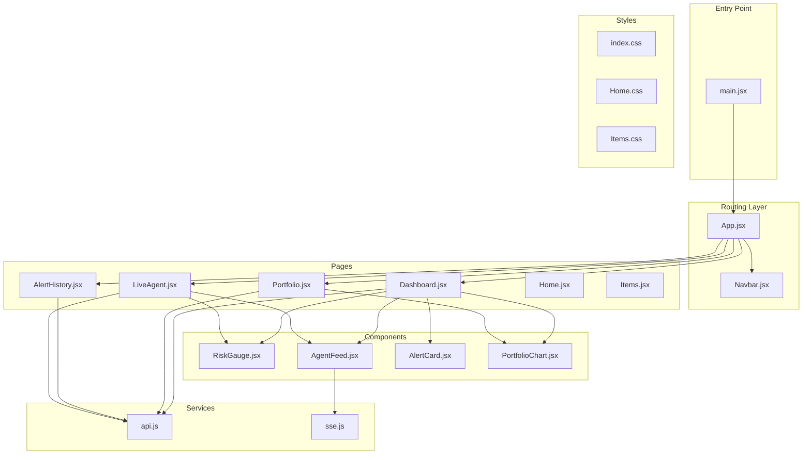
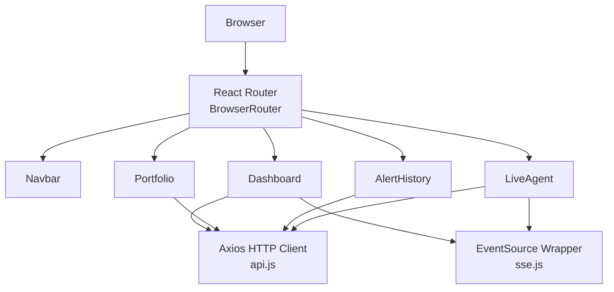
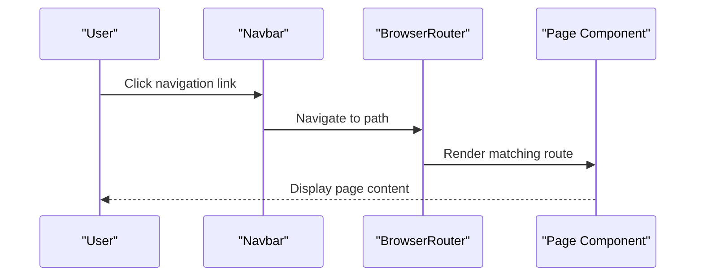
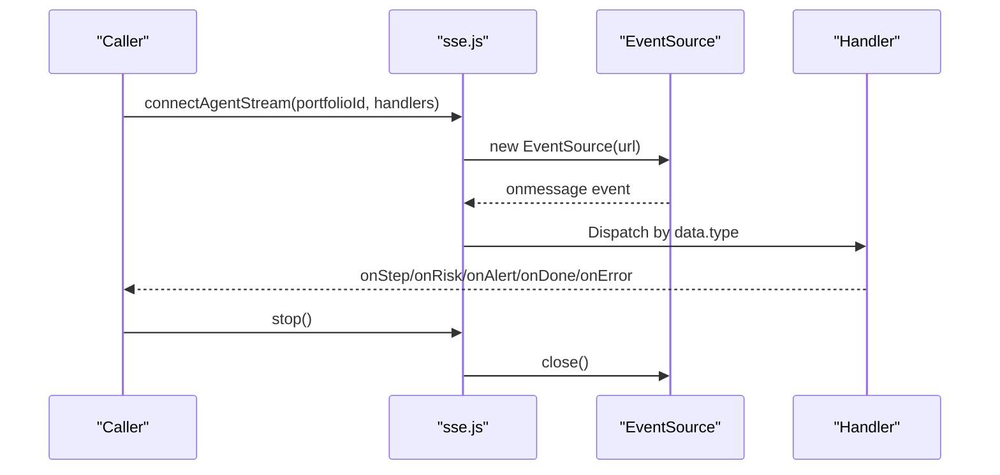
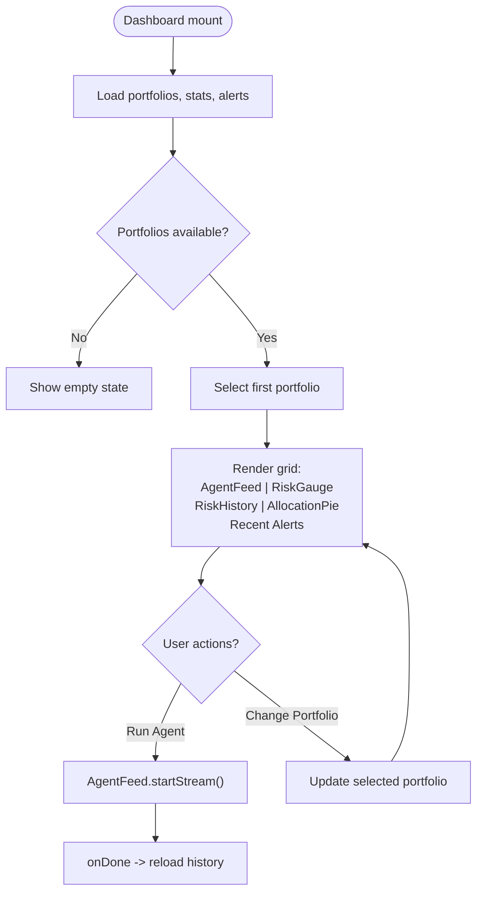
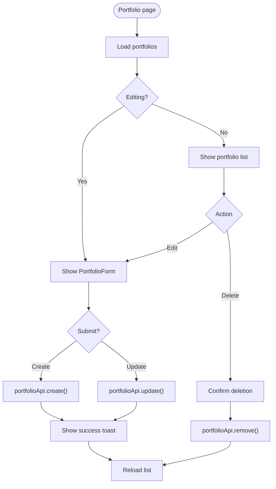
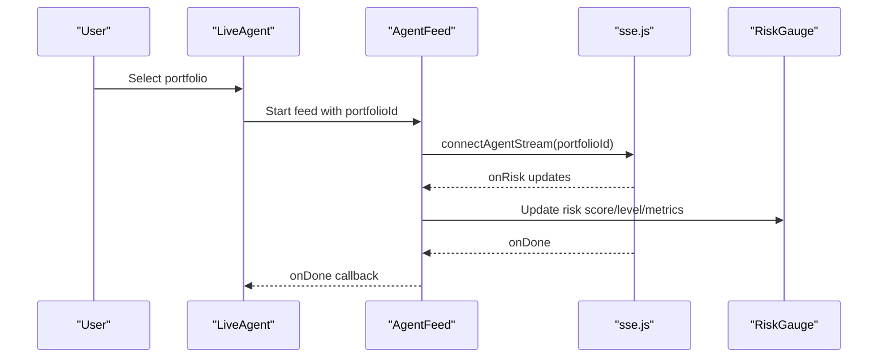
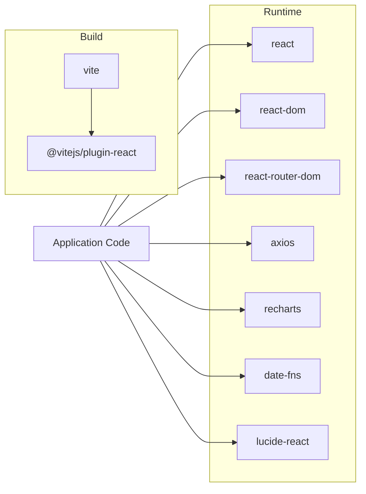

# Frontend Architecture

<cite>
**Referenced Files in This Document**
- [main.jsx](file://frontend/src/main.jsx)
- [App.jsx](file://frontend/src/App.jsx)
- [Navbar.jsx](file://frontend/src/components/Navbar.jsx)
- [RiskGauge.jsx](file://frontend/src/components/RiskGauge.jsx)
- [AgentFeed.jsx](file://frontend/src/components/AgentFeed.jsx)
- [AlertCard.jsx](file://frontend/src/components/AlertCard.jsx)
- [PortfolioChart.jsx](file://frontend/src/components/PortfolioChart.jsx)
- [Dashboard.jsx](file://frontend/src/pages/Dashboard.jsx)
- [Portfolio.jsx](file://frontend/src/pages/Portfolio.jsx)
- [LiveAgent.jsx](file://frontend/src/pages/LiveAgent.jsx)
- [AlertHistory.jsx](file://frontend/src/pages/AlertHistory.jsx)
- [Home.jsx](file://frontend/src/pages/Home.jsx)
- [Items.jsx](file://frontend/src/pages/Items.jsx)
- [api.js](file://frontend/src/services/api.js)
- [sse.js](file://frontend/src/services/sse.js)
- [index.css](file://frontend/src/index.css)
- [Home.css](file://frontend/src/styles/Home.css)
- [Items.css](file://frontend/src/styles/Items.css)
- [vite.config.js](file://frontend/vite.config.js)
- [package.json](file://frontend/package.json)
</cite>

## Table of Contents
1. [Introduction](#introduction)
2. [Project Structure](#project-structure)
3. [Core Components](#core-components)
4. [Architecture Overview](#architecture-overview)
5. [Detailed Component Analysis](#detailed-component-analysis)
6. [Dependency Analysis](#dependency-analysis)
7. [Performance Considerations](#performance-considerations)
8. [Troubleshooting Guide](#troubleshooting-guide)
9. [Conclusion](#conclusion)
10. [Appendices](#appendices)

## Introduction
This document describes the frontend architecture of the ishwarambare-app React Single Page Application. It explains the component hierarchy separating pages, components, and services, details the React Router configuration, and documents the service layer using Axios and Server-Sent Events. It also covers styling with CSS custom properties and responsive design, the Vite build configuration, environment variable handling, and deployment optimizations. Finally, it provides architectural diagrams illustrating component relationships and data flow patterns.

## Project Structure
The frontend follows a conventional React project layout with clear separation of concerns:
- Pages: Top-level route components (Dashboard, Portfolio, LiveAgent, AlertHistory, Home, Items)
- Components: Reusable UI building blocks (Navbar, RiskGauge, AgentFeed, AlertCard, PortfolioChart)
- Services: HTTP client and SSE utilities
- Styles: Global design system and page-specific styles
- Config: Vite configuration and package dependencies

**Diagram sources**
- [main.jsx:1-11](file://frontend/src/main.jsx#L1-L11)
- [App.jsx:1-21](file://frontend/src/App.jsx#L1-L21)
- [Navbar.jsx:1-51](file://frontend/src/components/Navbar.jsx#L1-L51)
- [Dashboard.jsx:1-211](file://frontend/src/pages/Dashboard.jsx#L1-L211)
- [Portfolio.jsx:1-387](file://frontend/src/pages/Portfolio.jsx#L1-L387)
- [LiveAgent.jsx:1-95](file://frontend/src/pages/LiveAgent.jsx#L1-L95)
- [AlertHistory.jsx](file://frontend/src/pages/AlertHistory.jsx)
- [Home.jsx](file://frontend/src/pages/Home.jsx)
- [Items.jsx](file://frontend/src/pages/Items.jsx)
- [RiskGauge.jsx:1-101](file://frontend/src/components/RiskGauge.jsx#L1-L101)
- [AgentFeed.jsx:1-175](file://frontend/src/components/AgentFeed.jsx#L1-L175)
- [AlertCard.jsx:1-89](file://frontend/src/components/AlertCard.jsx#L1-L89)
- [PortfolioChart.jsx:1-119](file://frontend/src/components/PortfolioChart.jsx#L1-L119)
- [api.js:1-35](file://frontend/src/services/api.js#L1-L35)
- [sse.js:1-63](file://frontend/src/services/sse.js#L1-L63)
- [index.css:1-504](file://frontend/src/index.css#L1-L504)
- [Home.css:1-66](file://frontend/src/styles/Home.css#L1-L66)
- [Items.css:1-30](file://frontend/src/styles/Items.css#L1-L30)

**Section sources**
- [main.jsx:1-11](file://frontend/src/main.jsx#L1-L11)
- [App.jsx:1-21](file://frontend/src/App.jsx#L1-L21)
- [index.css:1-504](file://frontend/src/index.css#L1-L504)

## Core Components
This section documents the reusable UI components that compose the application.

- Navbar: Navigation bar with links to Dashboard, Portfolio, Alert History, and Live Agent. Uses Lucide icons and active state styling.
- RiskGauge: Radial gauge rendering risk score with Recharts, including metrics grid and risk level badge.
- AgentFeed: Real-time streaming agent logs via EventSource, with controls to start/stop/reset and status indicators.
- AlertCard: Compact card for alert history entries with risk-level coloring and delivery badges.
- PortfolioChart: Recharts-based allocation pie and risk history area chart.

**Section sources**
- [Navbar.jsx:1-51](file://frontend/src/components/Navbar.jsx#L1-L51)
- [RiskGauge.jsx:1-101](file://frontend/src/components/RiskGauge.jsx#L1-L101)
- [AgentFeed.jsx:1-175](file://frontend/src/components/AgentFeed.jsx#L1-L175)
- [AlertCard.jsx:1-89](file://frontend/src/components/AlertCard.jsx#L1-L89)
- [PortfolioChart.jsx:1-119](file://frontend/src/components/PortfolioChart.jsx#L1-L119)

## Architecture Overview
The application uses React Router for client-side routing and a clean separation between pages, components, and services. The service layer encapsulates HTTP requests and SSE connections behind typed APIs. Styling is centralized via CSS custom properties and global classes with page-specific overrides.

**Diagram sources**
- [App.jsx:1-21](file://frontend/src/App.jsx#L1-L21)
- [Navbar.jsx:1-51](file://frontend/src/components/Navbar.jsx#L1-L51)
- [Dashboard.jsx:1-211](file://frontend/src/pages/Dashboard.jsx#L1-L211)
- [Portfolio.jsx:1-387](file://frontend/src/pages/Portfolio.jsx#L1-L387)
- [LiveAgent.jsx:1-95](file://frontend/src/pages/LiveAgent.jsx#L1-L95)
- [AlertHistory.jsx](file://frontend/src/pages/AlertHistory.jsx)
- [api.js:1-35](file://frontend/src/services/api.js#L1-L35)
- [sse.js:1-63](file://frontend/src/services/sse.js#L1-L63)

## Detailed Component Analysis

### Routing and Navigation
React Router configures four primary routes under a shared Navbar:
- "/" -> Dashboard
- "/portfolio" -> Portfolio
- "/alerts" -> AlertHistory
- "/live" -> LiveAgent

The Navbar uses NavLink to reflect active routes and integrates Lucide icons for visual cues.

**Diagram sources**
- [App.jsx:1-21](file://frontend/src/App.jsx#L1-L21)
- [Navbar.jsx:1-51](file://frontend/src/components/Navbar.jsx#L1-L51)

**Section sources**
- [App.jsx:1-21](file://frontend/src/App.jsx#L1-L21)
- [Navbar.jsx:1-51](file://frontend/src/components/Navbar.jsx#L1-L51)

### Service Layer: HTTP Client and SSE
The service layer provides two modules:
- api.js: Axios-based HTTP client with base URL from environment variables and typed endpoints for portfolio, agent, and alerts.
- sse.js: EventSource wrapper for agent streams, returning a controller with a stop method.

**Diagram sources**
- [sse.js:1-63](file://frontend/src/services/sse.js#L1-L63)

**Section sources**
- [api.js:1-35](file://frontend/src/services/api.js#L1-L35)
- [sse.js:1-63](file://frontend/src/services/sse.js#L1-L63)

### Dashboard Page
The Dashboard orchestrates:
- Loading portfolios, stats, and recent alerts concurrently
- Portfolio selection and risk data updates
- AgentFeed integration for live reasoning steps
- RiskGauge and PortfolioChart for visualization
- AlertCard rendering for recent alerts

**Diagram sources**
- [Dashboard.jsx:1-211](file://frontend/src/pages/Dashboard.jsx#L1-L211)
- [AgentFeed.jsx:1-175](file://frontend/src/components/AgentFeed.jsx#L1-L175)
- [RiskGauge.jsx:1-101](file://frontend/src/components/RiskGauge.jsx#L1-L101)
- [PortfolioChart.jsx:1-119](file://frontend/src/components/PortfolioChart.jsx#L1-L119)
- [AlertCard.jsx:1-89](file://frontend/src/components/AlertCard.jsx#L1-L89)

**Section sources**
- [Dashboard.jsx:1-211](file://frontend/src/pages/Dashboard.jsx#L1-L211)

### Portfolio Management Page
The Portfolio page manages CRUD operations:
- Inline ticker/weight editor with live validation and preset templates
- Form submission to create/update portfolios
- List view with edit/delete actions and allocation visualization

**Diagram sources**
- [Portfolio.jsx:1-387](file://frontend/src/pages/Portfolio.jsx#L1-L387)
- [api.js:1-35](file://frontend/src/services/api.js#L1-L35)

**Section sources**
- [Portfolio.jsx:1-387](file://frontend/src/pages/Portfolio.jsx#L1-L387)

### Live Agent Execution Page
The LiveAgent page provides a dedicated full-screen experience:
- Portfolio selector
- AgentFeed for live reasoning
- Real-time RiskGauge synchronized with SSE events

**Diagram sources**
- [LiveAgent.jsx:1-95](file://frontend/src/pages/LiveAgent.jsx#L1-L95)
- [AgentFeed.jsx:1-175](file://frontend/src/components/AgentFeed.jsx#L1-L175)
- [RiskGauge.jsx:1-101](file://frontend/src/components/RiskGauge.jsx#L1-L101)
- [sse.js:1-63](file://frontend/src/services/sse.js#L1-L63)

**Section sources**
- [LiveAgent.jsx:1-95](file://frontend/src/pages/LiveAgent.jsx#L1-L95)

### Reusable Components
- RiskGauge: Renders a Recharts RadialBarChart with color-coded segments and metrics grid.
- AgentFeed: Manages SSE lifecycle, maintains a scrolling log, and exposes callbacks for risk updates and completion.
- AlertCard: Displays alert metadata, risk metrics, and delivery status with appropriate styling.
- PortfolioChart: Provides AllocationPie and RiskHistory charts using Recharts.

**Section sources**
- [RiskGauge.jsx:1-101](file://frontend/src/components/RiskGauge.jsx#L1-L101)
- [AgentFeed.jsx:1-175](file://frontend/src/components/AgentFeed.jsx#L1-L175)
- [AlertCard.jsx:1-89](file://frontend/src/components/AlertCard.jsx#L1-L89)
- [PortfolioChart.jsx:1-119](file://frontend/src/components/PortfolioChart.jsx#L1-L119)

## Dependency Analysis
External libraries and their roles:
- react, react-dom: UI framework
- react-router-dom: Client-side routing
- axios: HTTP client for API calls
- recharts: Charting library for gauges and area charts
- date-fns: Date formatting utilities
- lucide-react: Icons

Build and tooling:
- vite: Build tool and dev server
- @vitejs/plugin-react: Fast React transform

**Diagram sources**
- [package.json:1-27](file://frontend/package.json#L1-L27)

**Section sources**
- [package.json:1-27](file://frontend/package.json#L1-L27)

## Performance Considerations
- Lazy loading and code splitting: Recommended for heavy pages like LiveAgent and Portfolio to reduce initial bundle size. Split routes using React.lazy and Suspense.
- Bundle optimization: Enable tree-shaking and minification via Vite defaults; avoid importing unused Recharts components to reduce bundle size.
- Chart performance: Use responsive containers and memoized data to prevent unnecessary re-renders in charts.
- Network efficiency: Leverage concurrent data fetching in Dashboard; consider caching strategies for static lists.
- Streaming: SSE is efficient for real-time updates; ensure proper cleanup on unmount to avoid memory leaks.

[No sources needed since this section provides general guidance]

## Troubleshooting Guide
Common issues and resolutions:
- API connectivity: Verify VITE_API_URL environment variable and CORS configuration on the backend.
- SSE errors: The SSE wrapper emits an error handler and closes the connection; check backend stream endpoint and network conditions.
- Navigation: Ensure routes match Navbar links and that active state styling is applied correctly.
- Styling: Confirm CSS custom properties are defined and page-specific styles do not override critical layout classes unintentionally.

**Section sources**
- [api.js:1-35](file://frontend/src/services/api.js#L1-L35)
- [sse.js:1-63](file://frontend/src/services/sse.js#L1-L63)
- [index.css:1-504](file://frontend/src/index.css#L1-L504)

## Conclusion
The frontend architecture cleanly separates pages, components, and services, enabling maintainable growth. React Router provides straightforward navigation, Axios handles HTTP requests, and SSE delivers real-time agent updates. The design system built on CSS custom properties ensures consistent theming and responsive layouts. With strategic code splitting and bundle optimization, the app can scale efficiently while maintaining a smooth user experience.

[No sources needed since this section summarizes without analyzing specific files]

## Appendices

### Build Configuration and Environment Variables
- Vite configuration sets up the dev server, proxy for API calls, and production build settings.
- Environment variables are accessed via import.meta.env.VITE_API_URL to configure the Axios base URL.

**Section sources**
- [vite.config.js:1-23](file://frontend/vite.config.js#L1-L23)
- [api.js:1-35](file://frontend/src/services/api.js#L1-L35)

### Styling Architecture and Responsive Patterns
- Global design system: CSS custom properties define dark theme tokens, typography, spacing, and component styles.
- Component-level styles: Use scoped classes and global design tokens for consistency.
- Responsive breakpoints: Media queries adjust grid layouts and spacing for smaller screens.

**Section sources**
- [index.css:1-504](file://frontend/src/index.css#L1-L504)
- [Home.css:1-66](file://frontend/src/styles/Home.css#L1-L66)
- [Items.css:1-30](file://frontend/src/styles/Items.css#L1-L30)