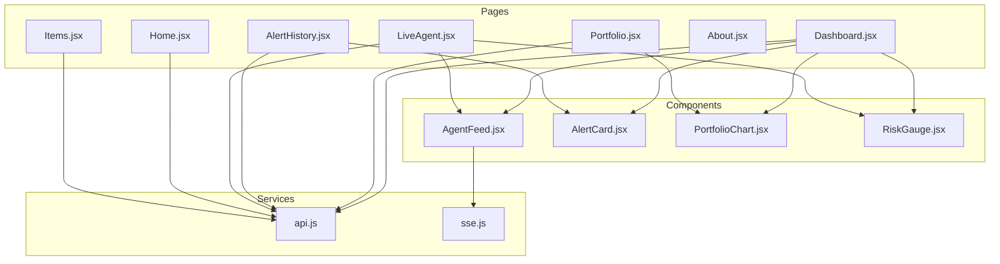
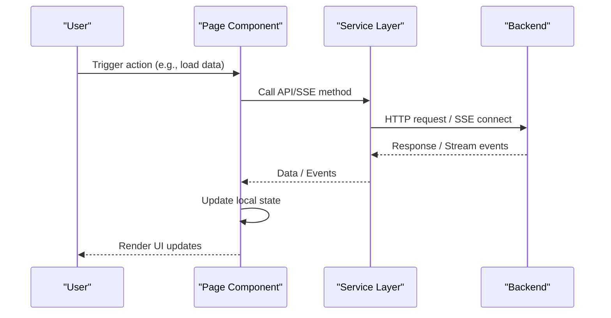
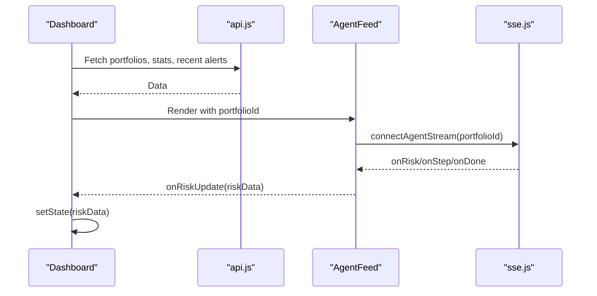
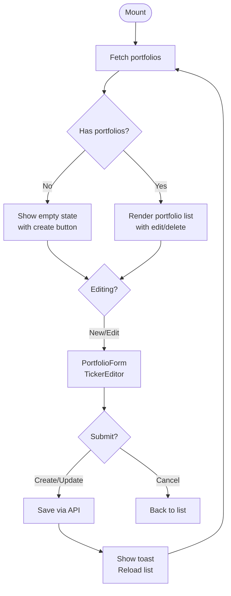
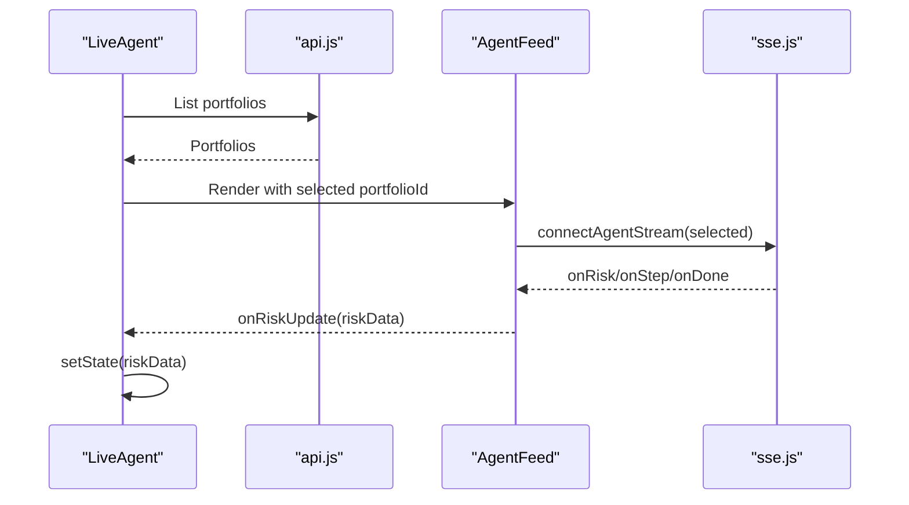
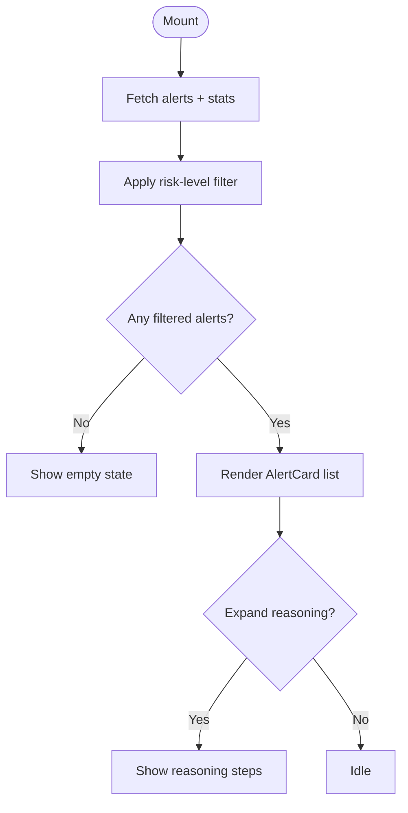
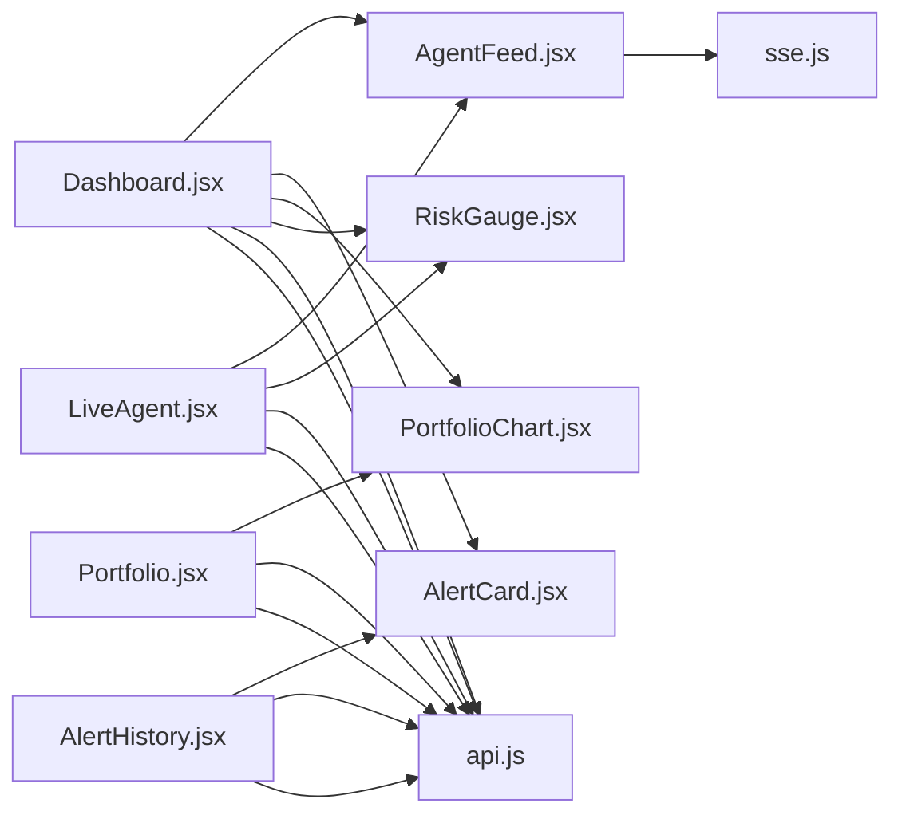

# Page Components

<cite>
**Referenced Files in This Document**
- [Dashboard.jsx](file://frontend/src/pages/Dashboard.jsx)
- [Portfolio.jsx](file://frontend/src/pages/Portfolio.jsx)
- [LiveAgent.jsx](file://frontend/src/pages/LiveAgent.jsx)
- [AlertHistory.jsx](file://frontend/src/pages/AlertHistory.jsx)
- [Home.jsx](file://frontend/src/pages/Home.jsx)
- [About.jsx](file://frontend/src/pages/About.jsx)
- [Items.jsx](file://frontend/src/pages/Items.jsx)
- [AgentFeed.jsx](file://frontend/src/components/AgentFeed.jsx)
- [AlertCard.jsx](file://frontend/src/components/AlertCard.jsx)
- [PortfolioChart.jsx](file://frontend/src/components/PortfolioChart.jsx)
- [RiskGauge.jsx](file://frontend/src/components/RiskGauge.jsx)
- [api.js](file://frontend/src/services/api.js)
- [sse.js](file://frontend/src/services/sse.js)
- [Home.css](file://frontend/src/styles/Home.css)
- [Items.css](file://frontend/src/styles/Items.css)
</cite>

## Table of Contents
1. [Introduction](#introduction)
2. [Project Structure](#project-structure)
3. [Core Components](#core-components)
4. [Architecture Overview](#architecture-overview)
5. [Detailed Component Analysis](#detailed-component-analysis)
6. [Dependency Analysis](#dependency-analysis)
7. [Performance Considerations](#performance-considerations)
8. [Troubleshooting Guide](#troubleshooting-guide)
9. [Conclusion](#conclusion)
10. [Appendices](#appendices)

## Introduction
This document describes the page-level components of the ishwarambare-app frontend. It focuses on the main application pages: Dashboard, Portfolio, LiveAgent, AlertHistory, and auxiliary pages: Home, About, and Items. For each page, we explain data fetching patterns, state management integration, component composition, styling and responsiveness, user interactions, navigation, parameter handling, error states, lifecycle, performance considerations, and SEO-related aspects.

## Project Structure
The frontend is organized around pages under the pages directory, shared components under components, a service layer for API and SSE under services, and CSS modules for page-specific styles. Pages compose reusable components and integrate with the service layer to fetch and mutate data.

**Diagram sources**
- [Dashboard.jsx](file://frontend/src/pages/Dashboard.jsx)
- [Portfolio.jsx](file://frontend/src/pages/Portfolio.jsx)
- [LiveAgent.jsx](file://frontend/src/pages/LiveAgent.jsx)
- [AlertHistory.jsx](file://frontend/src/pages/AlertHistory.jsx)
- [Home.jsx](file://frontend/src/pages/Home.jsx)
- [About.jsx](file://frontend/src/pages/About.jsx)
- [Items.jsx](file://frontend/src/pages/Items.jsx)
- [AgentFeed.jsx](file://frontend/src/components/AgentFeed.jsx)
- [AlertCard.jsx](file://frontend/src/components/AlertCard.jsx)
- [PortfolioChart.jsx](file://frontend/src/components/PortfolioChart.jsx)
- [RiskGauge.jsx](file://frontend/src/components/RiskGauge.jsx)
- [api.js](file://frontend/src/services/api.js)
- [sse.js](file://frontend/src/services/sse.js)

**Section sources**
- [Dashboard.jsx](file://frontend/src/pages/Dashboard.jsx)
- [Portfolio.jsx](file://frontend/src/pages/Portfolio.jsx)
- [LiveAgent.jsx](file://frontend/src/pages/LiveAgent.jsx)
- [AlertHistory.jsx](file://frontend/src/pages/AlertHistory.jsx)
- [Home.jsx](file://frontend/src/pages/Home.jsx)
- [About.jsx](file://frontend/src/pages/About.jsx)
- [Items.jsx](file://frontend/src/pages/Items.jsx)
- [AgentFeed.jsx](file://frontend/src/components/AgentFeed.jsx)
- [AlertCard.jsx](file://frontend/src/components/AlertCard.jsx)
- [PortfolioChart.jsx](file://frontend/src/components/PortfolioChart.jsx)
- [RiskGauge.jsx](file://frontend/src/components/RiskGauge.jsx)
- [api.js](file://frontend/src/services/api.js)
- [sse.js](file://frontend/src/services/sse.js)

## Core Components
- Dashboard: Orchestrates portfolio selection, risk metrics, recent alerts, and agent feed. Uses parallel data loading and composes AgentFeed, RiskGauge, PortfolioChart, and AlertCard.
- Portfolio: Manages creation, editing, deletion of portfolios with inline ticker/weight editor and validation. Integrates with PortfolioChart for allocations.
- LiveAgent: Dedicated full-screen page for live agent execution with real-time feed and risk gauge.
- AlertHistory: Lists and filters historical alerts with expandable reasoning logs and statistics.
- Home: Landing page with stack highlights and API health check.
- About: Describes the tech stack and project structure.
- Items: CRUD interface for items with form validation and optimistic updates.

**Section sources**
- [Dashboard.jsx](file://frontend/src/pages/Dashboard.jsx)
- [Portfolio.jsx](file://frontend/src/pages/Portfolio.jsx)
- [LiveAgent.jsx](file://frontend/src/pages/LiveAgent.jsx)
- [AlertHistory.jsx](file://frontend/src/pages/AlertHistory.jsx)
- [Home.jsx](file://frontend/src/pages/Home.jsx)
- [About.jsx](file://frontend/src/pages/About.jsx)
- [Items.jsx](file://frontend/src/pages/Items.jsx)

## Architecture Overview
The pages rely on a thin service layer for HTTP and SSE:
- api.js: Axios-based REST client exposing portfolio, agent, and alerts endpoints.
- sse.js: EventSource wrapper for agent streaming with a stop controller.

**Diagram sources**
- [api.js](file://frontend/src/services/api.js)
- [sse.js](file://frontend/src/services/sse.js)

## Detailed Component Analysis

### Dashboard
- Purpose: Overview and analytics hub with portfolio selector, risk metrics, recent alerts, and agent feed.
- Data fetching pattern:
  - Parallel fetch of portfolios, alert stats, and recent alerts during mount.
  - Auto-selects first portfolio if none selected.
- State management:
  - Local state for portfolios, selected portfolio, stats, recent alerts, risk data, and loading flag.
  - Callbacks passed down to AgentFeed for risk updates and completion handling.
- Component composition:
  - AgentFeed for live execution logs and SSE-driven updates.
  - RiskGauge for live risk visualization.
  - PortfolioChart.AllocationPie and RiskHistory for static and dynamic charts.
  - AlertCard for compact alert previews.
- Styling and responsiveness:
  - CSS grid layout with two-column main area; responsive wrapping for smaller screens.
  - Stat cards and ticker chips for dense information display.
- User interactions:
  - Refresh button, create portfolio link, portfolio selector dropdown, and links to alerts/history.
- Navigation:
  - Links to Portfolio and Alerts pages.
- Parameter handling:
  - Uses selected portfolio ID for AgentFeed and RiskHistory.
- Error state management:
  - Centralized try/catch around fetches; loading spinners and empty states.
- Lifecycle:
  - useEffect triggers initial load; callbacks update risk metrics and refresh history.
- Performance considerations:
  - Parallel requests reduce total load time.
  - Recharts charts are responsive and optimized via ResponsiveContainer.
- SEO:
  - Minimal SEO hooks; relies on meta tags at the app root.

**Diagram sources**
- [Dashboard.jsx](file://frontend/src/pages/Dashboard.jsx)
- [AgentFeed.jsx](file://frontend/src/components/AgentFeed.jsx)
- [api.js](file://frontend/src/services/api.js)
- [sse.js](file://frontend/src/services/sse.js)

**Section sources**
- [Dashboard.jsx](file://frontend/src/pages/Dashboard.jsx)
- [AgentFeed.jsx](file://frontend/src/components/AgentFeed.jsx)
- [AlertCard.jsx](file://frontend/src/components/AlertCard.jsx)
- [PortfolioChart.jsx](file://frontend/src/components/PortfolioChart.jsx)
- [RiskGauge.jsx](file://frontend/src/components/RiskGauge.jsx)
- [api.js](file://frontend/src/services/api.js)
- [sse.js](file://frontend/src/services/sse.js)

### Portfolio
- Purpose: Portfolio management with inline ticker/weight editor and validation.
- Data fetching pattern:
  - Single fetch on mount to list portfolios.
- State management:
  - Local state for portfolios, editing mode, loading, and toast notifications.
  - TickerEditor maintains rows and validates total weights.
- Component composition:
  - TickerEditor handles inline editing and live validation feedback.
  - PortfolioForm encapsulates create/edit logic and error handling.
  - PortfolioChart.AllocationPie renders allocation visuals.
- Styling and responsiveness:
  - Grid layouts and responsive breakpoints for form inputs.
- User interactions:
  - Create/Edit/Delete actions with confirmations; quick preset buttons.
- Navigation:
  - Back to Dashboard via router links.
- Parameter handling:
  - Uses portfolio ID for update/delete operations.
- Error state management:
  - Error messages surfaced from API responses; toast notifications.
- Lifecycle:
  - useEffect triggers initial load; save/delete operations refresh list.
- Performance considerations:
  - Lightweight inline editor avoids unnecessary re-renders; validation computed on change.
- SEO:
  - N/A for this page.

**Diagram sources**
- [Portfolio.jsx](file://frontend/src/pages/Portfolio.jsx)
- [PortfolioChart.jsx](file://frontend/src/components/PortfolioChart.jsx)

**Section sources**
- [Portfolio.jsx](file://frontend/src/pages/Portfolio.jsx)
- [PortfolioChart.jsx](file://frontend/src/components/PortfolioChart.jsx)

### LiveAgent
- Purpose: Full-screen live agent run with real-time feed and risk gauge.
- Data fetching pattern:
  - Loads portfolios on mount; allows selecting a portfolio to run.
- State management:
  - Local state for portfolios, selected portfolio, and risk data.
- Component composition:
  - AgentFeed with SSE streaming and risk callbacks.
  - RiskGauge for live risk visualization.
- Styling and responsiveness:
  - Two-column grid layout; responsive adjustments for smaller screens.
- User interactions:
  - Select portfolio, start/stop agent run, back to Dashboard.
- Navigation:
  - Back link to root.
- Parameter handling:
  - Uses selected portfolio ID for AgentFeed.
- Error state management:
  - AgentFeed manages internal status; LiveAgent surfaces risk updates.
- Lifecycle:
  - Resets risk data when changing portfolio.
- Performance considerations:
  - SSE stream is controlled and can be stopped; minimal re-renders.
- SEO:
  - N/A for this page.

**Diagram sources**
- [LiveAgent.jsx](file://frontend/src/pages/LiveAgent.jsx)
- [AgentFeed.jsx](file://frontend/src/components/AgentFeed.jsx)
- [api.js](file://frontend/src/services/api.js)
- [sse.js](file://frontend/src/services/sse.js)

**Section sources**
- [LiveAgent.jsx](file://frontend/src/pages/LiveAgent.jsx)
- [AgentFeed.jsx](file://frontend/src/components/AgentFeed.jsx)
- [RiskGauge.jsx](file://frontend/src/components/RiskGauge.jsx)
- [api.js](file://frontend/src/services/api.js)
- [sse.js](file://frontend/src/services/sse.js)

### AlertHistory
- Purpose: Historical tracking of agent runs with filtering and expandable reasoning logs.
- Data fetching pattern:
  - Parallel fetch of alerts list and stats on mount.
- State management:
  - Local state for alerts, stats, loading, filter, and expanded item.
- Component composition:
  - AlertCard for each alert with delivery badges and metrics.
- Styling and responsiveness:
  - Grid-based stat cards; responsive filter controls.
- User interactions:
  - Filter by risk level; expand/collapse reasoning logs; refresh button.
- Navigation:
  - N/A (standalone history page).
- Parameter handling:
  - Uses risk level filter; pagination handled server-side via list params.
- Error state management:
  - Centralized try/catch; loading and empty states.
- Lifecycle:
  - useEffect triggers initial load; refresh button reloads data.
- Performance considerations:
  - Renders a list with expandable panels; reasoning logs are lazy-loaded per item.
- SEO:
  - N/A for this page.

**Diagram sources**
- [AlertHistory.jsx](file://frontend/src/pages/AlertHistory.jsx)
- [AlertCard.jsx](file://frontend/src/components/AlertCard.jsx)

**Section sources**
- [AlertHistory.jsx](file://frontend/src/pages/AlertHistory.jsx)
- [AlertCard.jsx](file://frontend/src/components/AlertCard.jsx)

### Home
- Purpose: Landing page showcasing features and API health.
- Data fetching pattern:
  - Health check on mount to verify backend availability.
- State management:
  - Local state for API status and OK flag.
- Styling and responsiveness:
  - Hero section with gradient text and animated dot; responsive grid for features.
- User interactions:
  - Navigate to Items and About pages.
- Navigation:
  - Router links to other pages.
- Parameter handling:
  - N/A.
- Error state management:
  - Handles errors from health check; displays status indicators.
- Lifecycle:
  - useEffect runs once to check health.
- Performance considerations:
  - Minimal DOM; lightweight health check.
- SEO:
  - Good candidate for meta tags at the app root; page title and description should be set in the app shell.

**Section sources**
- [Home.jsx](file://frontend/src/pages/Home.jsx)
- [Home.css](file://frontend/src/styles/Home.css)

### About
- Purpose: Describes the tech stack and project structure.
- Data fetching pattern:
  - N/A.
- State management:
  - N/A.
- Styling and responsiveness:
  - Grid-based cards with colored accents; preformatted project structure.
- User interactions:
  - N/A.
- Navigation:
  - N/A.
- Parameter handling:
  - N/A.
- Error state management:
  - N/A.
- Lifecycle:
  - Static content rendered.
- Performance considerations:
  - Static content; no network calls.
- SEO:
  - Good informational page; meta tags recommended at the app root.

**Section sources**
- [About.jsx](file://frontend/src/pages/About.jsx)

### Items
- Purpose: CRUD interface for items with live data from backend.
- Data fetching pattern:
  - Fetch items on mount; optimistic updates after create/delete.
- State management:
  - Local state for items, loading, error, form, saving, and message.
- Styling and responsiveness:
  - Grid layout for items; responsive form layout; badges for stock status.
- User interactions:
  - Add item form with validation; delete item with confirmation.
- Navigation:
  - N/A.
- Parameter handling:
  - Parses numeric price; toggles stock checkbox.
- Error state management:
  - Error messages for load/create/delete failures; success messages.
- Lifecycle:
  - useEffect triggers initial load; form resets after successful create.
- Performance considerations:
  - Simple list rendering; minimal state churn.
- SEO:
  - N/A.

**Section sources**
- [Items.jsx](file://frontend/src/pages/Items.jsx)
- [Items.css](file://frontend/src/styles/Items.css)

## Dependency Analysis
- Pages depend on:
  - api.js for REST endpoints.
  - sse.js for agent streaming.
  - Shared components for UI and data visualization.
- Coupling:
  - Pages are cohesive around their domain but share common services and components.
  - AgentFeed couples tightly to SSE; Dashboard and LiveAgent coordinate risk updates.
- External dependencies:
  - Recharts for charts.
  - date-fns for time formatting.
  - Lucide icons for UI.

**Diagram sources**
- [Dashboard.jsx](file://frontend/src/pages/Dashboard.jsx)
- [Portfolio.jsx](file://frontend/src/pages/Portfolio.jsx)
- [LiveAgent.jsx](file://frontend/src/pages/LiveAgent.jsx)
- [AlertHistory.jsx](file://frontend/src/pages/AlertHistory.jsx)
- [AgentFeed.jsx](file://frontend/src/components/AgentFeed.jsx)
- [AlertCard.jsx](file://frontend/src/components/AlertCard.jsx)
- [PortfolioChart.jsx](file://frontend/src/components/PortfolioChart.jsx)
- [RiskGauge.jsx](file://frontend/src/components/RiskGauge.jsx)
- [api.js](file://frontend/src/services/api.js)
- [sse.js](file://frontend/src/services/sse.js)

**Section sources**
- [Dashboard.jsx](file://frontend/src/pages/Dashboard.jsx)
- [Portfolio.jsx](file://frontend/src/pages/Portfolio.jsx)
- [LiveAgent.jsx](file://frontend/src/pages/LiveAgent.jsx)
- [AlertHistory.jsx](file://frontend/src/pages/AlertHistory.jsx)
- [AgentFeed.jsx](file://frontend/src/components/AgentFeed.jsx)
- [AlertCard.jsx](file://frontend/src/components/AlertCard.jsx)
- [PortfolioChart.jsx](file://frontend/src/components/PortfolioChart.jsx)
- [RiskGauge.jsx](file://frontend/src/components/RiskGauge.jsx)
- [api.js](file://frontend/src/services/api.js)
- [sse.js](file://frontend/src/services/sse.js)

## Performance Considerations
- Parallel data loading reduces perceived latency (Dashboard, AlertHistory).
- Recharts charts are responsive and efficient; avoid unnecessary re-computation by passing stable props.
- SSE streams should be stopped when unmounting or switching portfolios to prevent memory leaks (AgentFeed).
- Minimize re-renders by keeping state local where possible and using memoization for derived data.
- Lazy-load reasoning logs in AlertHistory to keep the initial render fast.

## Troubleshooting Guide
- API connectivity:
  - Home health check indicates backend status; verify VITE_API_URL and CORS configuration.
- SSE issues:
  - AgentFeed shows an error status and closes the stream on error; ensure the backend SSE endpoint is reachable.
- Portfolio operations:
  - Portfolio form displays API errors; confirm portfolio data validity (weights sum to 100%).
- Alert history:
  - Filtering and expansion require data to be loaded; ensure initial load succeeds.

**Section sources**
- [Home.jsx](file://frontend/src/pages/Home.jsx)
- [AgentFeed.jsx](file://frontend/src/components/AgentFeed.jsx)
- [Portfolio.jsx](file://frontend/src/pages/Portfolio.jsx)
- [AlertHistory.jsx](file://frontend/src/pages/AlertHistory.jsx)

## Conclusion
The page components are structured around a clean separation of concerns: pages orchestrate data and compose shared components, services abstract backend integrations, and components encapsulate UI and visualization. The Dashboard and LiveAgent pages provide rich, real-time experiences through SSE, while Portfolio and AlertHistory offer robust management and historical insights. Styling is modular and responsive, and lifecycle patterns emphasize efficient data fetching and user feedback.

## Appendices
- Navigation patterns:
  - Use React Router links within pages for internal navigation.
  - Parameter handling:
    - Selected portfolio ID passed to AgentFeed and RiskGauge.
    - Filter parameter for AlertHistory.
- SEO optimization:
  - Set page titles and meta descriptions at the app shell level.
  - Ensure canonical URLs and robots.txt are configured for production.