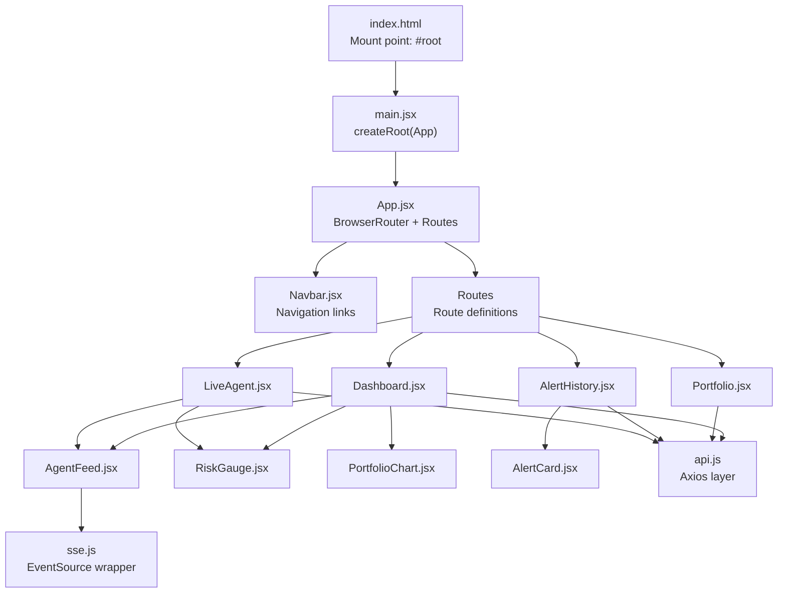
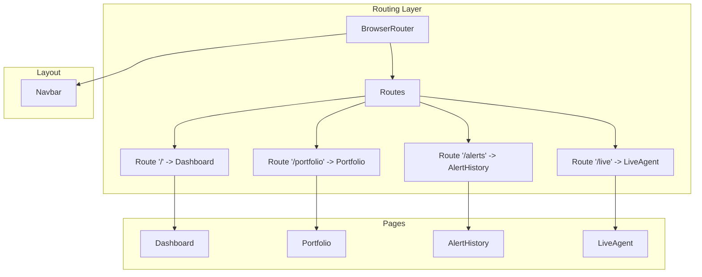
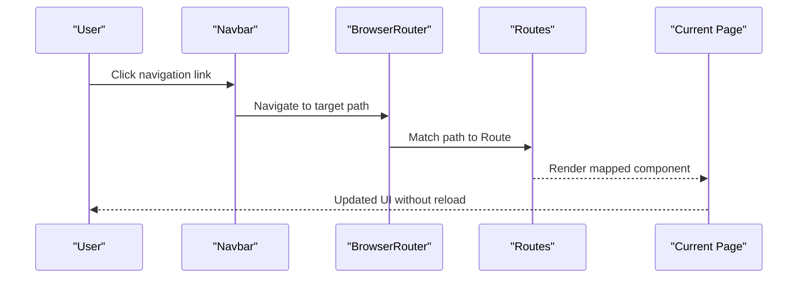
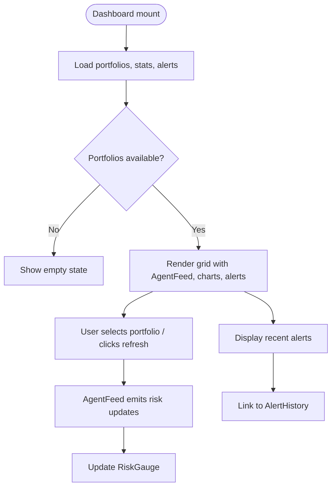
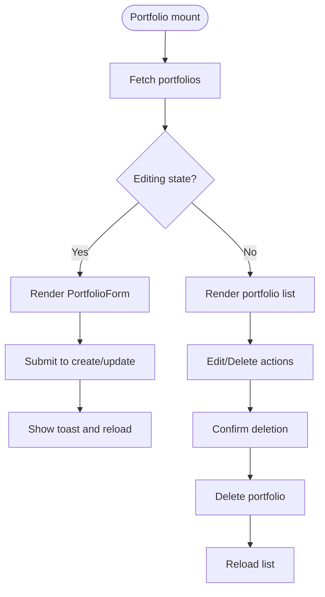
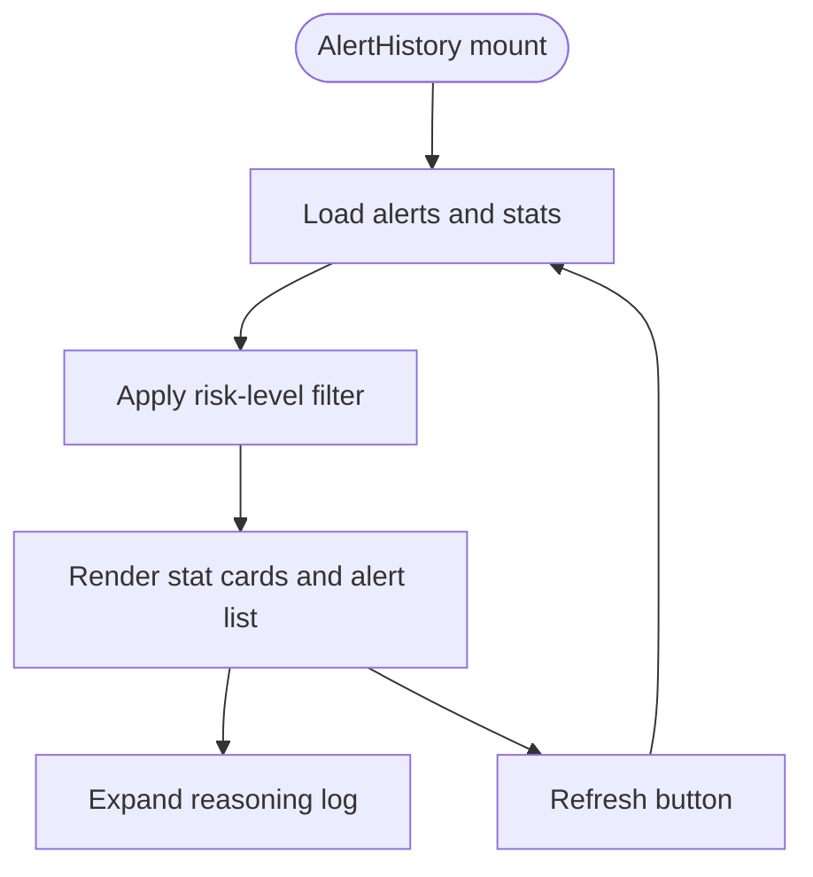
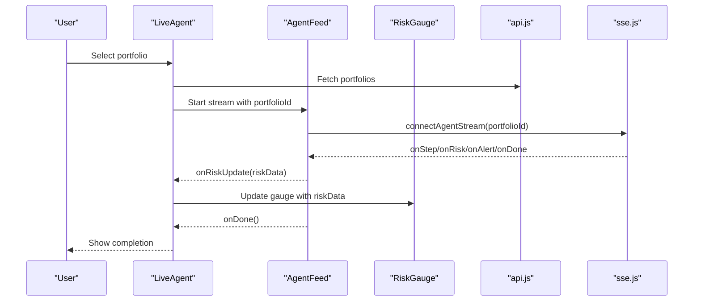
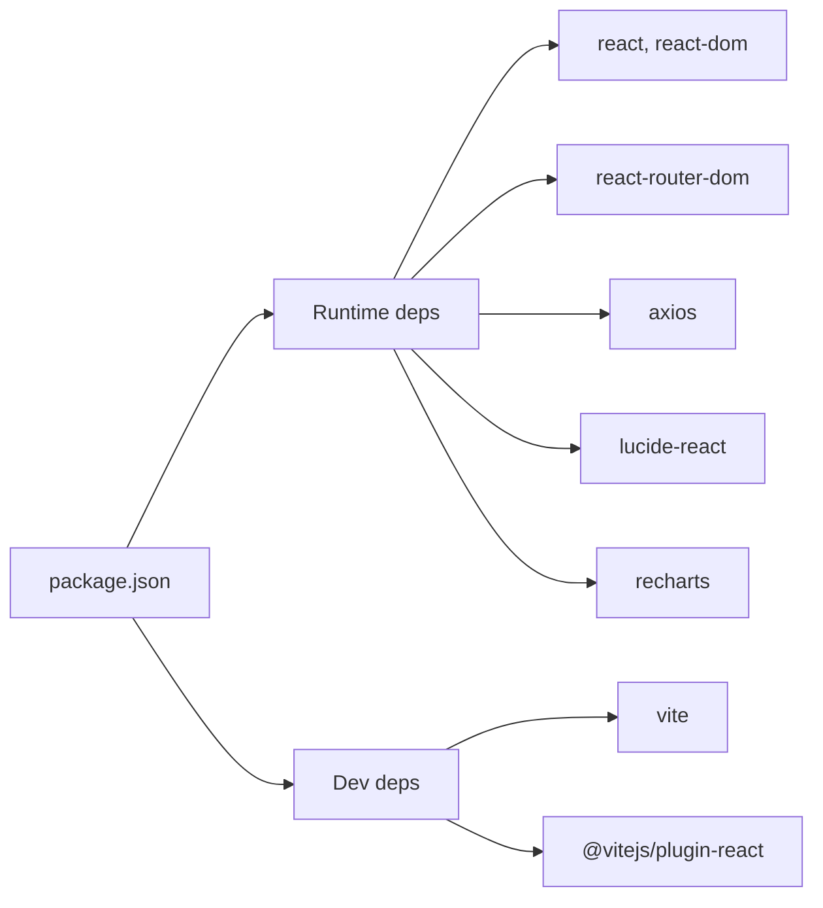

# React Application Structure

<cite>
**Referenced Files in This Document**
- [main.jsx](file://frontend/src/main.jsx)
- [App.jsx](file://frontend/src/App.jsx)
- [Navbar.jsx](file://frontend/src/components/Navbar.jsx)
- [Dashboard.jsx](file://frontend/src/pages/Dashboard.jsx)
- [Portfolio.jsx](file://frontend/src/pages/Portfolio.jsx)
- [AlertHistory.jsx](file://frontend/src/pages/AlertHistory.jsx)
- [LiveAgent.jsx](file://frontend/src/pages/LiveAgent.jsx)
- [AgentFeed.jsx](file://frontend/src/components/AgentFeed.jsx)
- [AlertCard.jsx](file://frontend/src/components/AlertCard.jsx)
- [RiskGauge.jsx](file://frontend/src/components/RiskGauge.jsx)
- [PortfolioChart.jsx](file://frontend/src/components/PortfolioChart.jsx)
- [api.js](file://frontend/src/services/api.js)
- [sse.js](file://frontend/src/services/sse.js)
- [package.json](file://frontend/package.json)
- [vite.config.js](file://frontend/vite.config.js)
- [index.html](file://frontend/index.html)
</cite>

## Table of Contents
1. [Introduction](#introduction)
2. [Project Structure](#project-structure)
3. [Core Components](#core-components)
4. [Architecture Overview](#architecture-overview)
5. [Detailed Component Analysis](#detailed-component-analysis)
6. [Dependency Analysis](#dependency-analysis)
7. [Performance Considerations](#performance-considerations)
8. [Troubleshooting Guide](#troubleshooting-guide)
9. [Conclusion](#conclusion)

## Introduction
This document explains the React application structure of ishwarambare-app with a focus on the frontend. It covers the component hierarchy starting from the root App.jsx, the React Router configuration, the Vite build setup, and the single-page application (SPA) navigation model. It also documents the routing configuration, key dependencies, initialization process, and performance considerations.

## Project Structure
The frontend is organized around a clear separation of concerns:
- Entry point initializes the React app and mounts it to the DOM.
- App.jsx defines the routing and layout.
- Pages represent route-specific views.
- Components encapsulate reusable UI and logic.
- Services abstract API and SSE connections.
- Vite handles development and production builds.



**Diagram sources**
- [index.html:14](file://frontend/index.html#L14)
- [main.jsx:6-10](file://frontend/src/main.jsx#L6-L10)
- [App.jsx:10-19](file://frontend/src/App.jsx#L10-L19)
- [Navbar.jsx:4-49](file://frontend/src/components/Navbar.jsx#L4-L49)
- [Dashboard.jsx:16](file://frontend/src/pages/Dashboard.jsx#L16)
- [Portfolio.jsx:252](file://frontend/src/pages/Portfolio.jsx#L252)
- [AlertHistory.jsx:12](file://frontend/src/pages/AlertHistory.jsx#L12)
- [LiveAgent.jsx:15](file://frontend/src/pages/LiveAgent.jsx#L15)
- [AgentFeed.jsx:28](file://frontend/src/components/AgentFeed.jsx#L28)
- [AlertCard.jsx:10](file://frontend/src/components/AlertCard.jsx#L10)
- [RiskGauge.jsx:20](file://frontend/src/components/RiskGauge.jsx#L20)
- [PortfolioChart.jsx:34](file://frontend/src/components/PortfolioChart.jsx#L34)
- [api.js:1](file://frontend/src/services/api.js#L1)
- [sse.js:19](file://frontend/src/services/sse.js#L19)

**Section sources**
- [index.html:13-17](file://frontend/index.html#L13-L17)
- [main.jsx:1-11](file://frontend/src/main.jsx#L1-L11)
- [App.jsx:1-21](file://frontend/src/App.jsx#L1-L21)

## Core Components
- main.jsx: Initializes the React root and renders the App inside StrictMode.
- App.jsx: Wraps the app with BrowserRouter and defines routes for Dashboard, Portfolio, AlertHistory, and LiveAgent. It also renders the global Navbar.
- Navbar.jsx: Provides navigation links using react-router-dom’s NavLink, highlighting active routes.
- Services:
  - api.js: Axios-based HTTP client with base URLs and convenience methods for portfolio, agent, and alerts APIs.
  - sse.js: EventSource wrapper for connecting to the agent streaming endpoint and returning a stop controller.

**Section sources**
- [main.jsx:6-10](file://frontend/src/main.jsx#L6-L10)
- [App.jsx:8-20](file://frontend/src/App.jsx#L8-L20)
- [Navbar.jsx:4-49](file://frontend/src/components/Navbar.jsx#L4-L49)
- [api.js:1](file://frontend/src/services/api.js#L1)
- [sse.js:19](file://frontend/src/services/sse.js#L19)

## Architecture Overview
The SPA uses React Router for client-side navigation without page reloads. The BrowserRouter provides routing context, while Routes and Route map paths to page components. Components communicate via props and shared services.



**Diagram sources**
- [App.jsx:10-19](file://frontend/src/App.jsx#L10-L19)
- [Navbar.jsx:13-46](file://frontend/src/components/Navbar.jsx#L13-L46)

## Detailed Component Analysis

### Routing Configuration
- Paths and components:
  - "/" → Dashboard
  - "/portfolio" → Portfolio
  - "/alerts" → AlertHistory
  - "/live" → LiveAgent
- Navigation uses NavLink with an end flag for exact matching on the root route.



**Diagram sources**
- [App.jsx:12-17](file://frontend/src/App.jsx#L12-L17)
- [Navbar.jsx:14-45](file://frontend/src/components/Navbar.jsx#L14-L45)

**Section sources**
- [App.jsx:13-16](file://frontend/src/App.jsx#L13-L16)
- [Navbar.jsx:13-46](file://frontend/src/components/Navbar.jsx#L13-L46)

### Dashboard Component
- Responsibilities:
  - Loads portfolios, stats, and recent alerts concurrently.
  - Manages active portfolio selection and risk data.
  - Renders AgentFeed, RiskGauge, allocation pie, and recent alerts.
- Composition pattern:
  - Uses AgentFeed with callbacks to update risk and trigger refreshes.
  - Uses RiskGauge and PortfolioChart components for visualization.
  - Integrates AlertCard for alert previews.



**Diagram sources**
- [Dashboard.jsx:24-47](file://frontend/src/pages/Dashboard.jsx#L24-L47)
- [Dashboard.jsx:133-137](file://frontend/src/pages/Dashboard.jsx#L133-L137)
- [Dashboard.jsx:160-164](file://frontend/src/pages/Dashboard.jsx#L160-L164)
- [Dashboard.jsx:178-194](file://frontend/src/pages/Dashboard.jsx#L178-L194)

**Section sources**
- [Dashboard.jsx:16-47](file://frontend/src/pages/Dashboard.jsx#L16-L47)
- [Dashboard.jsx:133-194](file://frontend/src/pages/Dashboard.jsx#L133-L194)

### Portfolio Component
- Responsibilities:
  - Lists, creates, edits, and deletes portfolios.
  - Inline ticker/weight editor with live validation and preset suggestions.
  - Displays portfolio metrics and alert thresholds.
- Composition pattern:
  - TickerEditor component manages rows and validates weights.
  - PortfolioForm composes inputs and controls for create/edit.
  - Uses AllocationPie for visualization.



**Diagram sources**
- [Portfolio.jsx:258-287](file://frontend/src/pages/Portfolio.jsx#L258-L287)
- [Portfolio.jsx:20-151](file://frontend/src/pages/Portfolio.jsx#L20-L151)
- [Portfolio.jsx:153-250](file://frontend/src/pages/Portfolio.jsx#L153-L250)

**Section sources**
- [Portfolio.jsx:252-386](file://frontend/src/pages/Portfolio.jsx#L252-L386)
- [Portfolio.jsx:20-151](file://frontend/src/pages/Portfolio.jsx#L20-L151)

### AlertHistory Component
- Responsibilities:
  - Lists alerts with filtering by risk level.
  - Shows stats and expandable reasoning logs.
- Composition pattern:
  - Uses AlertCard for each alert.
  - Supports filtering and pagination-like loading of recent alerts.



**Diagram sources**
- [AlertHistory.jsx:19-32](file://frontend/src/pages/AlertHistory.jsx#L19-L32)
- [AlertHistory.jsx:66-85](file://frontend/src/pages/AlertHistory.jsx#L66-L85)
- [AlertHistory.jsx:101-157](file://frontend/src/pages/AlertHistory.jsx#L101-L157)

**Section sources**
- [AlertHistory.jsx:12-162](file://frontend/src/pages/AlertHistory.jsx#L12-L162)

### LiveAgent Component
- Responsibilities:
  - Dedicated full-screen live agent run page.
  - Selects portfolio, streams agent steps, and displays live risk gauge.
- Composition pattern:
  - Uses AgentFeed and RiskGauge side-by-side.
  - Provides back navigation to the dashboard.



**Diagram sources**
- [LiveAgent.jsx:15-25](file://frontend/src/pages/LiveAgent.jsx#L15-L25)
- [LiveAgent.jsx:54-58](file://frontend/src/pages/LiveAgent.jsx#L54-L58)
- [AgentFeed.jsx:41-77](file://frontend/src/components/AgentFeed.jsx#L41-L77)
- [sse.js:21-62](file://frontend/src/services/sse.js#L21-L62)

**Section sources**
- [LiveAgent.jsx:15-94](file://frontend/src/pages/LiveAgent.jsx#L15-L94)
- [AgentFeed.jsx:28-96](file://frontend/src/components/AgentFeed.jsx#L28-L96)

### Supporting Components
- AgentFeed: Streams agent reasoning via SSE, exposes lifecycle callbacks, and renders categorized messages.
- AlertCard: Displays alert metadata, metrics, and delivery status.
- RiskGauge: Renders a radial gauge using Recharts with color-coded risk levels.
- PortfolioChart: Provides allocation pie and risk history area chart.

```mermaid
classDiagram
class AgentFeed {
+startStream()
+stopStream()
+reset()
+appendLine()
}
class AlertCard {
+alert
+onClick
}
class RiskGauge {
+riskScore
+riskLevel
+metrics
}
class PortfolioChart {
+AllocationPie()
+RiskHistory()
}
AgentFeed --> SSE["sse.js"]
Dashboard --> AgentFeed
Dashboard --> RiskGauge
Dashboard --> PortfolioChart
AlertHistory --> AlertCard
LiveAgent --> AgentFeed
LiveAgent --> RiskGauge
```

**Diagram sources**
- [AgentFeed.jsx:28](file://frontend/src/components/AgentFeed.jsx#L28)
- [AlertCard.jsx:10](file://frontend/src/components/AlertCard.jsx#L10)
- [RiskGauge.jsx:20](file://frontend/src/components/RiskGauge.jsx#L20)
- [PortfolioChart.jsx:34](file://frontend/src/components/PortfolioChart.jsx#L34)

**Section sources**
- [AgentFeed.jsx:28-175](file://frontend/src/components/AgentFeed.jsx#L28-L175)
- [AlertCard.jsx:10-89](file://frontend/src/components/AlertCard.jsx#L10-L89)
- [RiskGauge.jsx:20-101](file://frontend/src/components/RiskGauge.jsx#L20-L101)
- [PortfolioChart.jsx:34-119](file://frontend/src/components/PortfolioChart.jsx#L34-L119)

## Dependency Analysis
- Runtime dependencies (selected):
  - react, react-dom: UI library and renderer.
  - react-router-dom: Client-side routing.
  - axios: HTTP client for API communication.
  - lucide-react: Icons.
  - recharts: Charts for risk history and allocations.
- Dev dependencies (selected):
  - vite: Build tool and dev server.
  - @vitejs/plugin-react: React fast-refresh support.
- Scripts:
  - dev: Starts Vite dev server.
  - build: Produces optimized production bundle.
  - preview: Serves the build locally.



**Diagram sources**
- [package.json:11-26](file://frontend/package.json#L11-L26)

**Section sources**
- [package.json:6-10](file://frontend/package.json#L6-L10)
- [package.json:11-26](file://frontend/package.json#L11-L26)

## Performance Considerations
- Concurrent data fetching: Dashboard uses Promise.all to load portfolios, stats, and recent alerts efficiently.
- Conditional rendering: Empty states and loading spinners prevent unnecessary work until data is available.
- Chart libraries: Recharts components are responsive and suitable for moderate datasets; avoid excessive real-time updates for large series.
- Build configuration: Vite provides fast development and optimized production builds; source maps are disabled in production for smaller bundles.
- Navigation: SPA navigation avoids full page reloads, improving perceived performance.

[No sources needed since this section provides general guidance]

## Troubleshooting Guide
- API connectivity:
  - Verify VITE_API_URL environment variable if using a custom backend URL.
  - Confirm the backend is running and reachable at the configured target.
- SSE streaming:
  - AgentFeed relies on the SSE endpoint; errors are surfaced via onError handlers and logged to the console.
  - Ensure the portfolioId is selected before starting the stream.
- Navigation issues:
  - Ensure routes match the defined paths and that NavLink isActive logic behaves as expected.
- Build and dev server:
  - Use the dev script to start Vite; confirm port and proxy settings if integrating with a backend.
  - Production builds disable source maps by default; enable for debugging if needed.

**Section sources**
- [api.js:3](file://frontend/src/services/api.js#L3)
- [sse.js:54-57](file://frontend/src/services/sse.js#L54-L57)
- [vite.config.js:5-22](file://frontend/vite.config.js#L5-L22)

## Conclusion
The ishwarambare-app frontend follows a clean, modular structure centered on React Router for SPA navigation. App.jsx orchestrates routing and layout, while pages and components encapsulate functionality and reuse shared services for API and SSE communication. The Vite configuration supports rapid development and efficient production builds. Together, these pieces enable seamless, interactive navigation without page reloads and a responsive user experience.