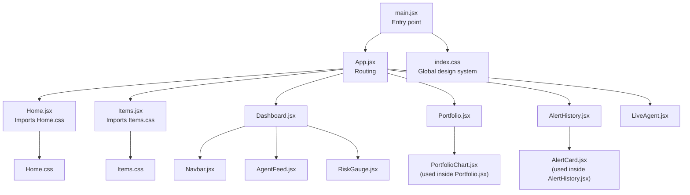
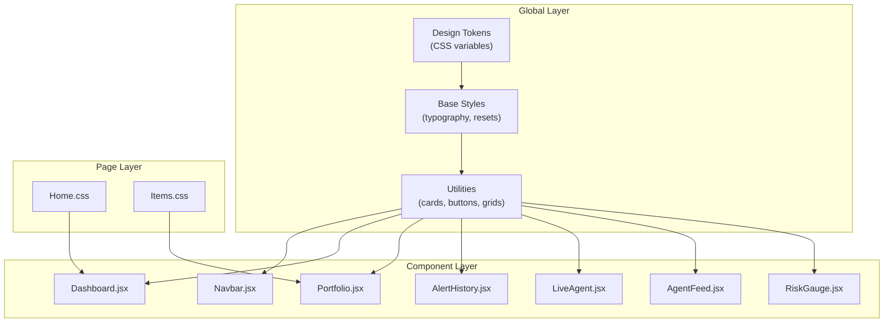
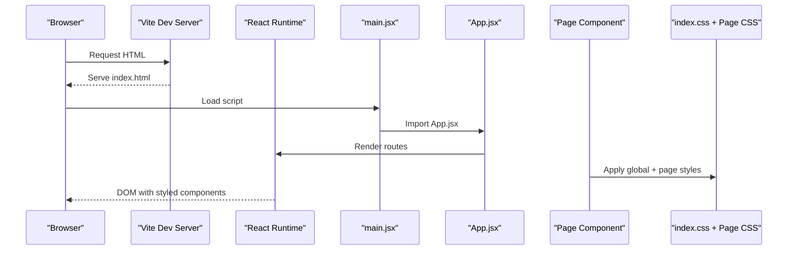
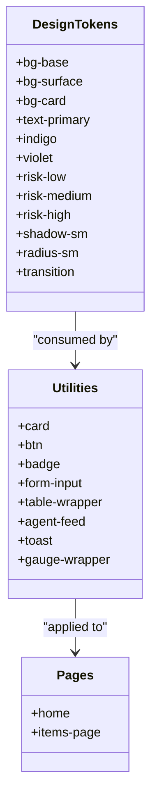
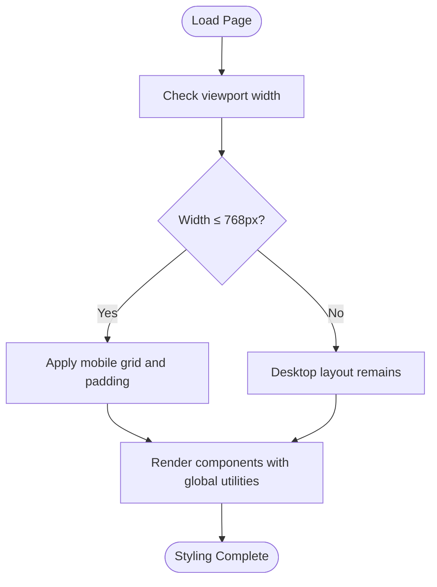
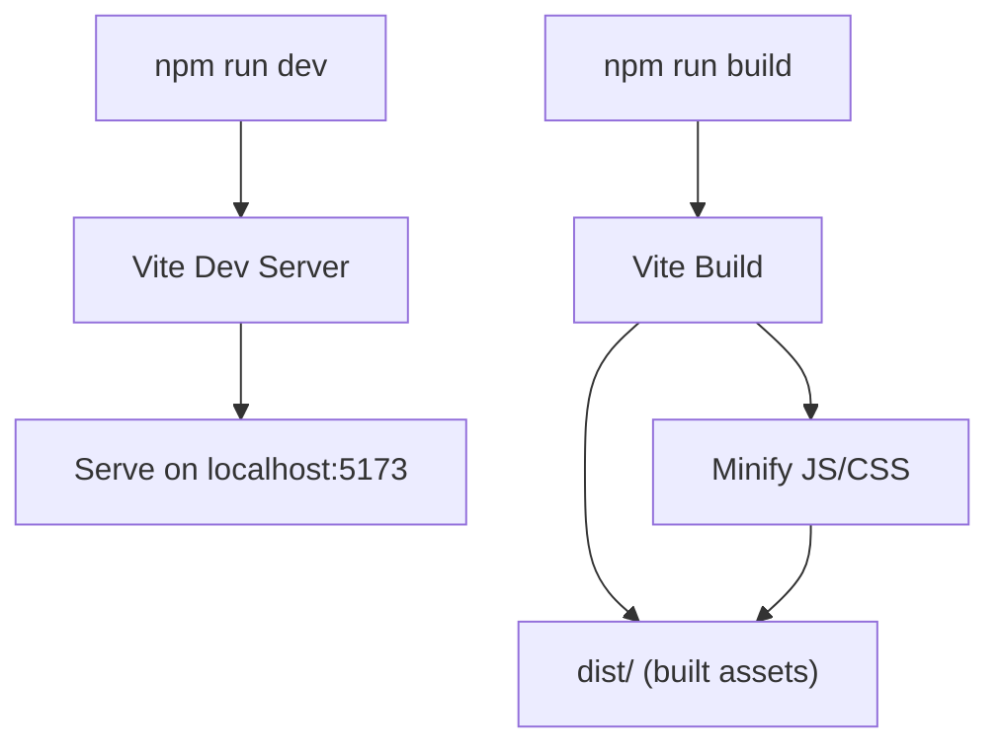
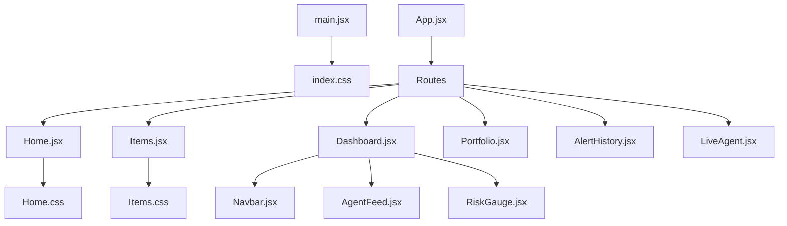

# Styling Framework

<cite>
**Referenced Files in This Document**
- [index.css](file://frontend/src/index.css)
- [Home.css](file://frontend/src/styles/Home.css)
- [Items.css](file://frontend/src/styles/Items.css)
- [main.jsx](file://frontend/src/main.jsx)
- [App.jsx](file://frontend/src/App.jsx)
- [Navbar.jsx](file://frontend/src/components/Navbar.jsx)
- [Home.jsx](file://frontend/src/pages/Home.jsx)
- [Items.jsx](file://frontend/src/pages/Items.jsx)
- [Dashboard.jsx](file://frontend/src/pages/Dashboard.jsx)
- [Portfolio.jsx](file://frontend/src/pages/Portfolio.jsx)
- [AlertHistory.jsx](file://frontend/src/pages/AlertHistory.jsx)
- [LiveAgent.jsx](file://frontend/src/pages/LiveAgent.jsx)
- [AgentFeed.jsx](file://frontend/src/components/AgentFeed.jsx)
- [RiskGauge.jsx](file://frontend/src/components/RiskGauge.jsx)
- [vite.config.js](file://frontend/vite.config.js)
- [package.json](file://frontend/package.json)
</cite>

## Table of Contents
1. [Introduction](#introduction)
2. [Project Structure](#project-structure)
3. [Core Components](#core-components)
4. [Architecture Overview](#architecture-overview)
5. [Detailed Component Analysis](#detailed-component-analysis)
6. [Dependency Analysis](#dependency-analysis)
7. [Performance Considerations](#performance-considerations)
8. [Troubleshooting Guide](#troubleshooting-guide)
9. [Conclusion](#conclusion)

## Introduction
This document describes the frontend styling framework used in ishwarambare-app. It explains how global styles are organized, how component-specific styles are integrated, and how the design system enforces a cohesive dark glassmorphism theme with indigo and violet accents. It covers CSS methodology, naming conventions, responsive design, and the build pipeline for CSS compilation and minification. It also documents dynamic styling approaches, CSS variables, and theme usage across React components.

## Project Structure
The styling architecture is layered:
- Global baseline and design tokens are defined in a single global stylesheet.
- Component pages import page-scoped styles.
- React components apply global utility classes and, when necessary, inline styles for dynamic values.

**Diagram sources**
- [main.jsx:1-11](file://frontend/src/main.jsx#L1-L11)
- [App.jsx:1-21](file://frontend/src/App.jsx#L1-L21)
- [index.css:1-504](file://frontend/src/index.css#L1-L504)
- [Home.jsx:1-63](file://frontend/src/pages/Home.jsx#L1-L63)
- [Items.jsx:1-125](file://frontend/src/pages/Items.jsx#L1-L125)
- [Home.css:1-66](file://frontend/src/styles/Home.css#L1-L66)
- [Items.css:1-30](file://frontend/src/styles/Items.css#L1-L30)
- [Dashboard.jsx:1-211](file://frontend/src/pages/Dashboard.jsx#L1-L211)
- [Portfolio.jsx:1-387](file://frontend/src/pages/Portfolio.jsx#L1-L387)
- [AlertHistory.jsx:1-163](file://frontend/src/pages/AlertHistory.jsx#L1-L163)
- [LiveAgent.jsx:1-95](file://frontend/src/pages/LiveAgent.jsx#L1-L95)
- [AgentFeed.jsx:1-175](file://frontend/src/components/AgentFeed.jsx#L1-L175)
- [RiskGauge.jsx:1-101](file://frontend/src/components/RiskGauge.jsx#L1-L101)

**Section sources**
- [main.jsx:1-11](file://frontend/src/main.jsx#L1-L11)
- [App.jsx:1-21](file://frontend/src/App.jsx#L1-L21)
- [index.css:1-504](file://frontend/src/index.css#L1-L504)
- [Home.jsx:1-63](file://frontend/src/pages/Home.jsx#L1-L63)
- [Items.jsx:1-125](file://frontend/src/pages/Items.jsx#L1-L125)
- [Home.css:1-66](file://frontend/src/styles/Home.css#L1-L66)
- [Items.css:1-30](file://frontend/src/styles/Items.css#L1-L30)

## Core Components
- Global design system and CSS custom properties define a cohesive dark theme with glassmorphism, typography, spacing, and motion.
- Utility classes provide layout scaffolding (page wrappers, grids), cards, buttons, badges, forms, tables, and reusable animations.
- Page-level styles encapsulate layout and presentation specifics for each route.
- Components consume global utilities and, when needed, apply inline styles for dynamic values (e.g., colors, sizes).

Key characteristics:
- CSS custom properties for theme tokens enable consistent theming across components.
- Utility-first classes promote reuse and reduce duplication.
- Page-specific styles augment global utilities with page-level layout and branding.
- Inline styles are used sparingly for dynamic values (e.g., computed colors, progress widths).

**Section sources**
- [index.css:8-50](file://frontend/src/index.css#L8-L50)
- [index.css:107-151](file://frontend/src/index.css#L107-L151)
- [index.css:205-247](file://frontend/src/index.css#L205-L247)
- [Home.jsx:24-61](file://frontend/src/pages/Home.jsx#L24-L61)
- [Items.jsx:59-122](file://frontend/src/pages/Items.jsx#L59-L122)

## Architecture Overview
The styling architecture follows a global + modular approach:
- Global CSS defines base styles, design tokens, and reusable utilities.
- Page components import page-specific styles to tailor layout and presentation.
- Components apply global utility classes and use inline styles for dynamic values.

**Diagram sources**
- [index.css:8-504](file://frontend/src/index.css#L8-L504)
- [Home.css:1-66](file://frontend/src/styles/Home.css#L1-L66)
- [Items.css:1-30](file://frontend/src/styles/Items.css#L1-L30)
- [Navbar.jsx:1-51](file://frontend/src/components/Navbar.jsx#L1-L51)
- [AgentFeed.jsx:1-175](file://frontend/src/components/AgentFeed.jsx#L1-L175)
- [RiskGauge.jsx:1-101](file://frontend/src/components/RiskGauge.jsx#L1-L101)
- [Dashboard.jsx:1-211](file://frontend/src/pages/Dashboard.jsx#L1-L211)
- [Portfolio.jsx:1-387](file://frontend/src/pages/Portfolio.jsx#L1-L387)
- [AlertHistory.jsx:1-163](file://frontend/src/pages/AlertHistory.jsx#L1-L163)
- [LiveAgent.jsx:1-95](file://frontend/src/pages/LiveAgent.jsx#L1-L95)

## Detailed Component Analysis

### Global Design System (index.css)
- Design tokens: CSS variables for backgrounds, borders, text, accents, shadows, radii, and transitions.
- Base styles: normalize/reset, body background image, font stack, and typography scaling.
- Utilities: layout scaffolding (page wrapper, header), grid helpers, card and stat-card patterns, navbar, buttons, badges, forms, tables, agent feed, spinner/pulse, risk gauge wrapper, toasts, ticker chips, progress bars, dividers, empty states, and global scrollbar.
- Responsive: a single breakpoint for mobile-first adjustments.

Implementation highlights:
- Motion primitives use a shared transition timing function.
- Glassmorphism effects rely on backdrop filters and semi-transparent backgrounds.
- Color accents are applied consistently via variables for low/medium/high risk and indigo/violet palette.

**Section sources**
- [index.css:8-50](file://frontend/src/index.css#L8-L50)
- [index.css:52-67](file://frontend/src/index.css#L52-L67)
- [index.css:69-81](file://frontend/src/index.css#L69-L81)
- [index.css:83-104](file://frontend/src/index.css#L83-L104)
- [index.css:106-151](file://frontend/src/index.css#L106-L151)
- [index.css:152-203](file://frontend/src/index.css#L152-L203)
- [index.css:204-247](file://frontend/src/index.css#L204-L247)
- [index.css:248-296](file://frontend/src/index.css#L248-L296)
- [index.css:297-323](file://frontend/src/index.css#L297-L323)
- [index.css:324-386](file://frontend/src/index.css#L324-L386)
- [index.css:387-409](file://frontend/src/index.css#L387-L409)
- [index.css:410-423](file://frontend/src/index.css#L410-L423)
- [index.css:424-448](file://frontend/src/index.css#L424-L448)
- [index.css:449-462](file://frontend/src/index.css#L449-L462)
- [index.css:464-476](file://frontend/src/index.css#L464-L476)
- [index.css:477-482](file://frontend/src/index.css#L477-L482)
- [index.css:484-492](file://frontend/src/index.css#L484-L492)
- [index.css:493-497](file://frontend/src/index.css#L493-L497)
- [index.css:498-504](file://frontend/src/index.css#L498-L504)

### Page-Specific Styles

#### Home.css
- Page-level layout and hero presentation with gradient text and animated glow.
- API status indicator with animated dot and state classes.
- Feature grid using global grid utilities.

Integration:
- Imported by Home page and applied to semantic sections and cards.

**Section sources**
- [Home.css:1-66](file://frontend/src/styles/Home.css#L1-L66)
- [Home.jsx:24-61](file://frontend/src/pages/Home.jsx#L24-L61)

#### Items.css
- Items page container and typography.
- Add item form layout with grid rows and checkbox styling.
- Item cards grid and footer layout.
- Mobile-first responsive adjustments for form layout.

Integration:
- Imported by Items page and applied to form and grid containers.

**Section sources**
- [Items.css:1-30](file://frontend/src/styles/Items.css#L1-L30)
- [Items.jsx:59-122](file://frontend/src/pages/Items.jsx#L59-L122)

### Component Styling Patterns

#### Navbar.jsx
- Uses global navbar and nav-link utilities for consistent spacing, hover, and active states.
- Branding uses a gradient background via CSS variable.

**Section sources**
- [Navbar.jsx:4-49](file://frontend/src/components/Navbar.jsx#L4-L49)
- [index.css:152-203](file://frontend/src/index.css#L152-L203)

#### AgentFeed.jsx
- Uses global card and agent-feed utilities for container and scrolling.
- Uses global badge and feed-* utilities for node tagging and text coloring.
- Inline styles for dynamic colors and layout adjustments.

**Section sources**
- [AgentFeed.jsx:100-173](file://frontend/src/components/AgentFeed.jsx#L100-L173)
- [index.css:324-386](file://frontend/src/index.css#L324-L386)

#### RiskGauge.jsx
- Uses global gauge-wrapper and gauge-* utilities for layout.
- Inline styles for chart sizing and center label positioning.
- Dynamic colors derived from props mapped to CSS variables.

**Section sources**
- [RiskGauge.jsx:20-99](file://frontend/src/components/RiskGauge.jsx#L20-L99)
- [index.css:410-423](file://frontend/src/index.css#L410-L423)

#### Dashboard.jsx
- Uses global page-wrapper and page-header utilities for layout.
- Uses global grid utilities and stat-card for summary cards.
- Inline styles for dynamic colors and layout.

**Section sources**
- [Dashboard.jsx:51-198](file://frontend/src/pages/Dashboard.jsx#L51-L198)
- [index.css:83-104](file://frontend/src/index.css#L83-L104)
- [index.css:136-151](file://frontend/src/index.css#L136-L151)

#### Portfolio.jsx
- Uses global form utilities and divider.
- Inline styles for dynamic progress bars and validation indicators.
- Uses global ticker-chip and toast utilities.

**Section sources**
- [Portfolio.jsx:153-249](file://frontend/src/pages/Portfolio.jsx#L153-L249)
- [index.css:265-296](file://frontend/src/index.css#L265-L296)
- [index.css:449-462](file://frontend/src/index.css#L449-L462)
- [index.css:424-448](file://frontend/src/index.css#L424-L448)

#### AlertHistory.jsx
- Uses global page-wrapper and page-header utilities.
- Uses global grid utilities and stat-card for summary.
- Uses global agent-feed and toast utilities for expandable reasoning logs.

**Section sources**
- [AlertHistory.jsx:37-160](file://frontend/src/pages/AlertHistory.jsx#L37-L160)
- [index.css:83-104](file://frontend/src/index.css#L83-L104)
- [index.css:136-151](file://frontend/src/index.css#L136-L151)
- [index.css:324-386](file://frontend/src/index.css#L324-L386)
- [index.css:424-448](file://frontend/src/index.css#L424-L448)

#### LiveAgent.jsx
- Uses global page-wrapper and page-header utilities.
- Uses global card utility for layout.
- Integrates AgentFeed and RiskGauge with global utilities.

**Section sources**
- [LiveAgent.jsx:27-93](file://frontend/src/pages/LiveAgent.jsx#L27-L93)
- [index.css:83-104](file://frontend/src/index.css#L83-L104)

### CSS Methodology, Naming Conventions, and Organization Principles
- Methodology: Utility-first with global design tokens and page-level augmentation.
- Naming: BEM-like modifiers (e.g., .btn-primary, .stat-delta.up) and state suffixed classes (e.g., .api-status--ok).
- Organization: Global base and utilities, page-specific styles, component usage of utilities, and selective inline styles for dynamic values.

**Section sources**
- [index.css:107-151](file://frontend/src/index.css#L107-L151)
- [index.css:204-247](file://frontend/src/index.css#L204-L247)
- [Home.css:1-66](file://frontend/src/styles/Home.css#L1-L66)
- [Items.css:1-30](file://frontend/src/styles/Items.css#L1-L30)

### Responsive Design and Mobile-First Approach
- Mobile-first breakpoints: a single media query adjusts grid layouts and paddings for narrow screens.
- Flexible grids: CSS Grid with repeat and minmax for adaptive card layouts.
- Typography scaling: clamp for fluid headings.

**Section sources**
- [index.css:498-504](file://frontend/src/index.css#L498-L504)
- [index.css:102-104](file://frontend/src/index.css#L102-L104)
- [Home.css:28-31](file://frontend/src/styles/Home.css#L28-L31)
- [Items.css:27-29](file://frontend/src/styles/Items.css#L27-L29)

### Style Encapsulation and Dynamic Styling
- Encapsulation: global utilities and page styles provide consistent styling; components apply classes and use minimal inline styles for dynamic values.
- Dynamic styling: inline styles for computed colors, progress widths, and layout adjustments; CSS variables for theme tokens.

**Section sources**
- [AgentFeed.jsx:103-132](file://frontend/src/components/AgentFeed.jsx#L103-L132)
- [RiskGauge.jsx:49-57](file://frontend/src/components/RiskGauge.jsx#L49-L57)
- [Portfolio.jsx:84-98](file://frontend/src/pages/Portfolio.jsx#L84-L98)
- [Dashboard.jsx:201-210](file://frontend/src/pages/Dashboard.jsx#L201-L210)

### Theme Implementation and CSS Variables
- Theme tokens: CSS variables for backgrounds, borders, text, accents, shadows, radii, and transitions.
- Usage: Across utilities and components via var(--token-name).
- Consistency: Risk colors, indigo/violet palette, and glassmorphism effects rely on variables.

**Section sources**
- [index.css:8-50](file://frontend/src/index.css#L8-L50)
- [index.css:32-36](file://frontend/src/index.css#L32-L36)
- [index.css:221-229](file://frontend/src/index.css#L221-L229)
- [AgentFeed.jsx:98-99](file://frontend/src/components/AgentFeed.jsx#L98-L99)

## Architecture Overview

**Diagram sources**
- [main.jsx:1-11](file://frontend/src/main.jsx#L1-L11)
- [App.jsx:1-21](file://frontend/src/App.jsx#L1-L21)
- [index.css:1-504](file://frontend/src/index.css#L1-L504)
- [Home.css:1-66](file://frontend/src/styles/Home.css#L1-L66)
- [Items.css:1-30](file://frontend/src/styles/Items.css#L1-L30)

## Detailed Component Analysis

### Global CSS Architecture

**Diagram sources**
- [index.css:8-50](file://frontend/src/index.css#L8-L50)
- [index.css:106-151](file://frontend/src/index.css#L106-L151)
- [index.css:204-247](file://frontend/src/index.css#L204-L247)
- [index.css:248-296](file://frontend/src/index.css#L248-L296)
- [index.css:297-323](file://frontend/src/index.css#L297-L323)
- [index.css:324-386](file://frontend/src/index.css#L324-L386)
- [index.css:424-448](file://frontend/src/index.css#L424-L448)
- [index.css:410-423](file://frontend/src/index.css#L410-L423)
- [Home.css:1-66](file://frontend/src/styles/Home.css#L1-L66)
- [Items.css:1-30](file://frontend/src/styles/Items.css#L1-L30)

### Responsive Breakpoints Flow

**Diagram sources**
- [index.css:498-504](file://frontend/src/index.css#L498-L504)

### Build and Compilation Pipeline

**Diagram sources**
- [package.json:6-10](file://frontend/package.json#L6-L10)
- [vite.config.js:1-23](file://frontend/vite.config.js#L1-L23)

**Section sources**
- [package.json:6-10](file://frontend/package.json#L6-L10)
- [vite.config.js:18-22](file://frontend/vite.config.js#L18-L22)

## Dependency Analysis

**Diagram sources**
- [main.jsx:1-11](file://frontend/src/main.jsx#L1-L11)
- [App.jsx:1-21](file://frontend/src/App.jsx#L1-L21)
- [Home.jsx:1-63](file://frontend/src/pages/Home.jsx#L1-L63)
- [Items.jsx:1-125](file://frontend/src/pages/Items.jsx#L1-L125)
- [Dashboard.jsx:1-211](file://frontend/src/pages/Dashboard.jsx#L1-L211)
- [Portfolio.jsx:1-387](file://frontend/src/pages/Portfolio.jsx#L1-L387)
- [AlertHistory.jsx:1-163](file://frontend/src/pages/AlertHistory.jsx#L1-L163)
- [LiveAgent.jsx:1-95](file://frontend/src/pages/LiveAgent.jsx#L1-L95)
- [Navbar.jsx:1-51](file://frontend/src/components/Navbar.jsx#L1-L51)
- [AgentFeed.jsx:1-175](file://frontend/src/components/AgentFeed.jsx#L1-L175)
- [RiskGauge.jsx:1-101](file://frontend/src/components/RiskGauge.jsx#L1-L101)
- [Home.css:1-66](file://frontend/src/styles/Home.css#L1-L66)
- [Items.css:1-30](file://frontend/src/styles/Items.css#L1-L30)

**Section sources**
- [main.jsx:1-11](file://frontend/src/main.jsx#L1-L11)
- [App.jsx:1-21](file://frontend/src/App.jsx#L1-L21)
- [Home.jsx:1-63](file://frontend/src/pages/Home.jsx#L1-L63)
- [Items.jsx:1-125](file://frontend/src/pages/Items.jsx#L1-L125)
- [Dashboard.jsx:1-211](file://frontend/src/pages/Dashboard.jsx#L1-L211)
- [Portfolio.jsx:1-387](file://frontend/src/pages/Portfolio.jsx#L1-L387)
- [AlertHistory.jsx:1-163](file://frontend/src/pages/AlertHistory.jsx#L1-L163)
- [LiveAgent.jsx:1-95](file://frontend/src/pages/LiveAgent.jsx#L1-L95)
- [Navbar.jsx:1-51](file://frontend/src/components/Navbar.jsx#L1-L51)
- [AgentFeed.jsx:1-175](file://frontend/src/components/AgentFeed.jsx#L1-L175)
- [RiskGauge.jsx:1-101](file://frontend/src/components/RiskGauge.jsx#L1-L101)
- [Home.css:1-66](file://frontend/src/styles/Home.css#L1-L66)
- [Items.css:1-30](file://frontend/src/styles/Items.css#L1-L30)

## Performance Considerations
- Critical CSS: Keep global base styles minimal and essential; defer non-critical page styles until needed.
- CSS delivery: Vite builds and serves optimized assets; ensure only necessary styles are bundled.
- Animations: Prefer CSS transitions and transforms; avoid layout thrashing.
- Variables: Use CSS variables for theme tokens to reduce repaint costs and enable runtime switching.
- Media queries: Place mobile-first styles inline with global utilities to minimize reflows.

[No sources needed since this section provides general guidance]

## Troubleshooting Guide
- Missing styles: Verify global stylesheet import in the entry point and page-specific imports in components.
- Theming inconsistencies: Ensure CSS variables are defined in the global stylesheet and used consistently.
- Responsive issues: Confirm media queries are present and breakpoints align with component layouts.
- Inline style conflicts: Review inline styles for dynamic values and ensure they do not override global utilities unintentionally.

**Section sources**
- [main.jsx:4-4](file://frontend/src/main.jsx#L4-L4)
- [Home.jsx:4-4](file://frontend/src/pages/Home.jsx#L4-L4)
- [Items.jsx:3-3](file://frontend/src/pages/Items.jsx#L3-L3)
- [index.css:8-50](file://frontend/src/index.css#L8-L50)
- [index.css:498-504](file://frontend/src/index.css#L498-L504)

## Conclusion
The styling framework employs a global design system with CSS custom properties, utility-first classes, and page-specific augmentation. It enforces a cohesive dark glassmorphism theme, supports responsive design with a mobile-first approach, and integrates seamlessly with React components. The build pipeline leverages Vite for development and optimized asset generation, ensuring maintainable and performant styling across the application.