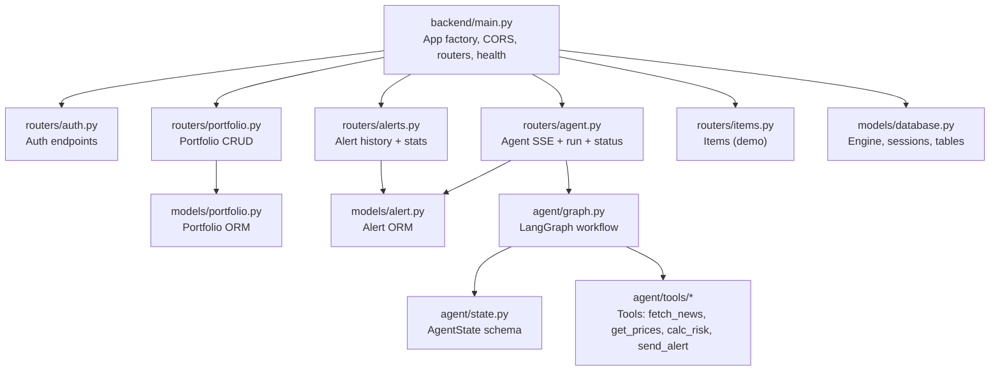
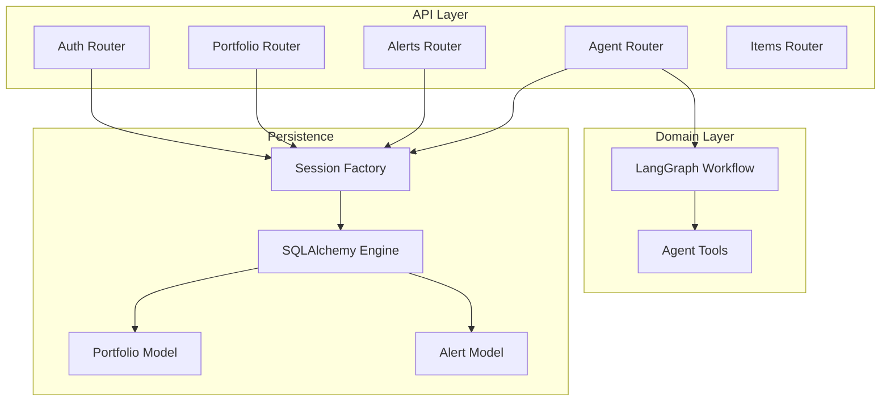
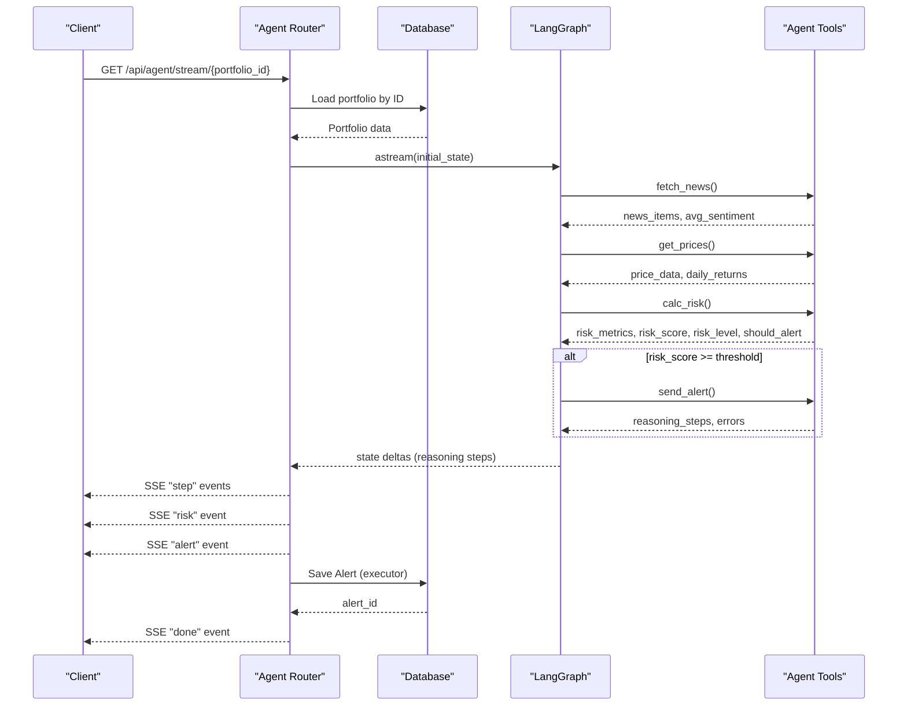
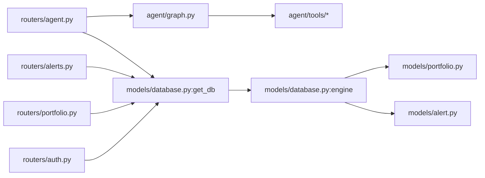

# API Endpoints Reference

<cite>
**Referenced Files in This Document**
- [backend/main.py](file://backend/main.py)
- [backend/routers/__init__.py](file://backend/routers/__init__.py)
- [backend/routers/auth.py](file://backend/routers/auth.py)
- [backend/routers/portfolio.py](file://backend/routers/portfolio.py)
- [backend/routers/agent.py](file://backend/routers/agent.py)
- [backend/routers/alerts.py](file://backend/routers/alerts.py)
- [backend/routers/items.py](file://backend/routers/items.py)
- [backend/models/database.py](file://backend/models/database.py)
- [backend/models/portfolio.py](file://backend/models/portfolio.py)
- [backend/models/alert.py](file://backend/models/alert.py)
- [backend/agent/graph.py](file://backend/agent/graph.py)
- [backend/agent/state.py](file://backend/agent/state.py)
- [backend/agent/tools/fetch_news.py](file://backend/agent/tools/fetch_news.py)
- [backend/agent/tools/get_prices.py](file://backend/agent/tools/get_prices.py)
- [backend/agent/tools/calc_risk.py](file://backend/agent/tools/calc_risk.py)
- [backend/agent/tools/send_alert.py](file://backend/agent/tools/send_alert.py)
</cite>

## Table of Contents
1. [Introduction](#introduction)
2. [Project Structure](#project-structure)
3. [Core Components](#core-components)
4. [Architecture Overview](#architecture-overview)
5. [Detailed Component Analysis](#detailed-component-analysis)
6. [Dependency Analysis](#dependency-analysis)
7. [Performance Considerations](#performance-considerations)
8. [Troubleshooting Guide](#troubleshooting-guide)
9. [Conclusion](#conclusion)
10. [Appendices](#appendices)

## Introduction
This document provides comprehensive API documentation for the ishwarambare-app backend. It covers all router modules, endpoint specifications, request/response schemas, authentication requirements, and operational guidance. The API is organized into logical groups:
- Authentication endpoints
- Portfolio management endpoints (CRUD with JSON-based ticker storage and weight management)
- Agent workflow endpoints (SSE streaming, agent execution control, and real-time data transmission)
- Alert management endpoints (history retrieval, statistics, and configuration options)
- Items endpoints (placeholder for future expansion)

The backend is built with FastAPI, uses SQLAlchemy for persistence, and integrates LangGraph for agent workflows. API versioning is exposed via the application metadata.

## Project Structure
The backend is structured around routers, models, agent logic, and tasks. Routers define the HTTP surface, models define persistence, agent logic defines the workflow, and tasks orchestrate asynchronous operations.

**Diagram sources**
- [backend/main.py:38-43](file://backend/main.py#L38-L43)
- [backend/routers/auth.py:1-39](file://backend/routers/auth.py#L1-L39)
- [backend/routers/portfolio.py:1-124](file://backend/routers/portfolio.py#L1-L124)
- [backend/routers/agent.py:1-243](file://backend/routers/agent.py#L1-L243)
- [backend/routers/alerts.py:1-84](file://backend/routers/alerts.py#L1-L84)
- [backend/routers/items.py:1-72](file://backend/routers/items.py#L1-L72)
- [backend/models/database.py:1-42](file://backend/models/database.py#L1-L42)
- [backend/models/portfolio.py:1-63](file://backend/models/portfolio.py#L1-L63)
- [backend/models/alert.py:1-77](file://backend/models/alert.py#L1-L77)
- [backend/agent/graph.py:1-243](file://backend/agent/graph.py#L1-L243)
- [backend/agent/state.py:1-58](file://backend/agent/state.py#L1-L58)
- [backend/agent/tools/fetch_news.py:1-164](file://backend/agent/tools/fetch_news.py#L1-L164)
- [backend/agent/tools/get_prices.py:1-139](file://backend/agent/tools/get_prices.py#L1-L139)
- [backend/agent/tools/calc_risk.py:1-255](file://backend/agent/tools/calc_risk.py#L1-L255)
- [backend/agent/tools/send_alert.py:1-231](file://backend/agent/tools/send_alert.py#L1-L231)

**Section sources**
- [backend/main.py:12-43](file://backend/main.py#L12-L43)

## Core Components
- Application metadata and versioning: The API exposes version information via the FastAPI app metadata.
- CORS policy: Configured to allow all origins for SSE compatibility.
- Database initialization: Tables are created on startup.
- Router registration: Each router is mounted under a versioned prefix with descriptive tags.

Key behaviors:
- Versioning: The application version is declared in the FastAPI metadata.
- Health checks: Root and health endpoints provide operational status.
- Persistence: SQLAlchemy engine and session management are centralized.

**Section sources**
- [backend/main.py:12-16](file://backend/main.py#L12-L16)
- [backend/main.py:24-30](file://backend/main.py#L24-L30)
- [backend/main.py:33-35](file://backend/main.py#L33-L35)
- [backend/main.py:39-43](file://backend/main.py#L39-L43)
- [backend/main.py:47-58](file://backend/main.py#L47-L58)
- [backend/models/database.py:15-42](file://backend/models/database.py#L15-L42)

## Architecture Overview
The API follows a layered architecture:
- Routers expose HTTP endpoints and validate requests.
- Models encapsulate persistence and data shaping.
- Agent workflow orchestrates multi-step analysis and optional alert dispatch.
- Tools implement domain-specific logic (news, prices, risk calculation, alerting).
- Database provides relational persistence for portfolios and alerts.

**Diagram sources**
- [backend/main.py:38-43](file://backend/main.py#L38-L43)
- [backend/routers/auth.py:1-39](file://backend/routers/auth.py#L1-L39)
- [backend/routers/portfolio.py:1-124](file://backend/routers/portfolio.py#L1-L124)
- [backend/routers/agent.py:1-243](file://backend/routers/agent.py#L1-L243)
- [backend/routers/alerts.py:1-84](file://backend/routers/alerts.py#L1-L84)
- [backend/routers/items.py:1-72](file://backend/routers/items.py#L1-L72)
- [backend/models/database.py:29-42](file://backend/models/database.py#L29-L42)
- [backend/models/portfolio.py:16-63](file://backend/models/portfolio.py#L16-L63)
- [backend/models/alert.py:14-77](file://backend/models/alert.py#L14-L77)
- [backend/agent/graph.py:162-203](file://backend/agent/graph.py#L162-L203)

## Detailed Component Analysis

### Authentication Endpoints
- Purpose: Demonstration login and user info retrieval.
- Notes: Current implementation is a demo; replace with JWT and database-backed authentication.

Endpoints
- POST /api/auth/login
  - Description: Authenticate user and return tokens.
  - Authentication: None (demo).
  - Request body: LoginRequest
    - Fields: username (string), password (string)
  - Response body: LoginResponse
    - Fields: access_token (string), token_type (string), username (string)
  - Success: 200 OK
  - Errors: 401 Unauthorized (invalid credentials)
  - Example curl:
    - curl -X POST http://localhost:8000/api/auth/login -H "Content-Type: application/json" -d '{"username":"admin","password":"admin"}'

- GET /api/auth/me
  - Description: Return current authenticated user info (stub).
  - Authentication: None (demo).
  - Response body: object
    - Fields: username (string), role (string)
  - Success: 200 OK

Validation rules
- Login requires non-empty username and password.
- Demo credentials: admin/admin.

Rate limiting
- Not implemented in the current code.

Integration guidelines
- Replace demo login with JWT issuance and database validation.
- Protect downstream endpoints with authentication middleware.

**Section sources**
- [backend/routers/auth.py:18-38](file://backend/routers/auth.py#L18-L38)
- [backend/routers/auth.py:7-16](file://backend/routers/auth.py#L7-L16)
- [backend/routers/auth.py:12-16](file://backend/routers/auth.py#L12-L16)

### Portfolio Management Endpoints
Purpose
- Manage user portfolios with JSON-based ticker storage and weight management.

Endpoints
- GET /api/portfolio
  - Description: List all portfolios.
  - Authentication: None.
  - Response: Array of portfolio objects.
  - Success: 200 OK.

- POST /api/portfolio
  - Description: Create a new portfolio.
  - Authentication: None.
  - Request body: PortfolioCreate
    - Fields:
      - name (string, default "My Portfolio", length 1–120)
      - tickers (object, ticker → weight mapping; weights must sum to ~1.0)
      - user_email (optional string)
      - user_phone (optional string)
      - risk_threshold (float, 0.0–1.0, default 0.70)
  - Response: Portfolio object.
  - Success: 201 Created.
  - Errors: 422 Unprocessable Entity (weights must sum to ~1.0), 404 Not Found (on get).
  - Validation: Weight sum checked server-side.

- GET /api/portfolio/{id}
  - Description: Get portfolio by ID.
  - Path parameter: portfolio_id (integer).
  - Response: Portfolio object.
  - Success: 200 OK.
  - Errors: 404 Not Found.

- PUT /api/portfolio/{id}
  - Description: Update portfolio.
  - Path parameter: portfolio_id (integer).
  - Request body: PortfolioUpdate (all fields optional)
    - Fields: name, tickers, user_email, user_phone, risk_threshold, is_active.
  - Response: Portfolio object.
  - Success: 200 OK.
  - Errors: 404 Not Found.

- DELETE /api/portfolio/{id}
  - Description: Delete portfolio.
  - Path parameter: portfolio_id (integer).
  - Response: Empty body.
  - Success: 204 No Content.
  - Errors: 404 Not Found.

Portfolio object
- Fields:
  - id (integer)
  - name (string)
  - user_id (string, default "admin")
  - tickers (object, ticker → weight mapping)
  - user_email (optional string)
  - user_phone (optional string)
  - risk_threshold (float)
  - is_active (boolean)
  - created_at (ISO 8601 string)
  - updated_at (ISO 8601 string)

Weight validation logic
- On creation, the server validates that weights sum to approximately 1.0 (within ±0.05).
- If invalid, returns 422 with a descriptive message.

Example curl
- Create portfolio:
  - curl -X POST http://localhost:8000/api/portfolio -H "Content-Type: application/json" -d '{"name":"Tech Growth","tickers":{"AAPL":0.5,"MSFT":0.5},"risk_threshold":0.7}'
- Update portfolio:
  - curl -X PUT http://localhost:8000/api/portfolio/1 -H "Content-Type: application/json" -d '{"risk_threshold":0.65}'
- Delete portfolio:
  - curl -X DELETE http://localhost:8000/api/portfolio/1

**Section sources**
- [backend/routers/portfolio.py:50-123](file://backend/routers/portfolio.py#L50-L123)
- [backend/routers/portfolio.py:27-46](file://backend/routers/portfolio.py#L27-L46)
- [backend/models/portfolio.py:16-63](file://backend/models/portfolio.py#L16-L63)

### Agent Workflow Endpoints
Purpose
- Trigger agent runs and stream results via Server-Sent Events (SSE).
- Provide a synchronous run option and a health check.

Endpoints
- GET /api/agent/stream/{portfolio_id}
  - Description: Real-time SSE stream of agent reasoning steps, risk metrics, alert decisions, and completion status.
  - Path parameter: portfolio_id (integer).
  - Authentication: None.
  - Response: text/event-stream.
  - SSE events:
    - type: "start", payload: { portfolio, name }
    - type: "step", payload: { node, message }
    - type: "risk", payload: { risk_score, risk_level, metrics }
    - type: "alert", payload: { triggered }
    - type: "error", payload: { message }
    - type: "done", payload: { alert_id }
  - Headers:
    - Cache-Control: no-cache
    - X-Accel-Buffering: no
    - Access-Control-Allow-Origin: *
  - Notes: Emits incremental reasoning steps and risk metrics as they become available.
  - Example curl:
    - curl -N http://localhost:8000/api/agent/stream/1

- POST /api/agent/run/{portfolio_id}
  - Description: Synchronously run agent, persist results, and return a JSON summary.
  - Path parameter: portfolio_id (integer).
  - Authentication: None.
  - Response body: object
    - Fields: alert_id (integer), risk_score (number), risk_level (string), should_alert (boolean), risk_metrics (object)
  - Errors: 404 Not Found.

- GET /api/agent/status
  - Description: Agent service health check.
  - Authentication: None.
  - Response body: object
    - Fields: status (string), agent (string), version (string), timestamp (ISO 8601)

Agent workflow (LangGraph)
- Nodes:
  - fetch_news: retrieves headlines and computes average sentiment.
  - get_prices: downloads 1-year price history and computes daily returns.
  - calc_risk: computes Sharpe, Sortino, volatility, max drawdown, and composite risk score.
  - send_alert: optional alert dispatch (email/SMS) for HIGH risk.
  - log_and_end: terminal node.
- Conditional edge: routes to send_alert if risk_score ≥ 0.70, otherwise ends.
- Initial state: constructed from portfolio weights, optional user contact info, and empty working fields.

SSE streaming behavior
- Emits "start" with portfolio data and name.
- Emits "step" messages for each new reasoning step.
- Emits "risk" metrics when available.
- Emits "alert" decision when computed.
- Emits "error" messages on exceptions.
- Emits "done" with alert_id after persistence.

Synchronous run behavior
- Executes the full graph and returns a summary with risk metrics and alert decision.

Health check
- Returns readiness status, agent identity, version, and timestamp.

curl examples
- SSE stream:
  - curl -N http://localhost:8000/api/agent/stream/1
- Synchronous run:
  - curl -X POST http://localhost:8000/api/agent/run/1

**Section sources**
- [backend/routers/agent.py:39-168](file://backend/routers/agent.py#L39-L168)
- [backend/routers/agent.py:186-232](file://backend/routers/agent.py#L186-L232)
- [backend/routers/agent.py:235-242](file://backend/routers/agent.py#L235-L242)
- [backend/agent/graph.py:45-122](file://backend/agent/graph.py#L45-L122)
- [backend/agent/graph.py:146-156](file://backend/agent/graph.py#L146-L156)
- [backend/agent/graph.py:210-242](file://backend/agent/graph.py#L210-L242)
- [backend/agent/state.py:28-58](file://backend/agent/state.py#L28-L58)

#### Agent Execution Flow (SSE)

**Diagram sources**
- [backend/routers/agent.py:69-168](file://backend/routers/agent.py#L69-L168)
- [backend/agent/graph.py:162-203](file://backend/agent/graph.py#L162-L203)
- [backend/agent/tools/fetch_news.py:99-164](file://backend/agent/tools/fetch_news.py#L99-L164)
- [backend/agent/tools/get_prices.py:84-139](file://backend/agent/tools/get_prices.py#L84-L139)
- [backend/agent/tools/calc_risk.py:149-255](file://backend/agent/tools/calc_risk.py#L149-L255)
- [backend/agent/tools/send_alert.py:157-231](file://backend/agent/tools/send_alert.py#L157-L231)

### Alert Management Endpoints
Purpose
- Retrieve alert history, detailed reasoning logs, and summary statistics.

Endpoints
- GET /api/alerts
  - Description: List all alerts, latest first.
  - Query parameters:
    - limit (integer, default 50)
    - portfolio_id (optional integer)
  - Response: Array of alert objects.

- GET /api/alerts/detail/{alert_id}
  - Description: Get full alert detail including reasoning log.
  - Path parameter: alert_id (integer).
  - Response: Alert object.
  - Errors: 404 Not Found.

- GET /api/alerts/portfolio/{portfolio_id}
  - Description: Alerts for a specific portfolio, latest first.
  - Path parameter: portfolio_id (integer).
  - Query parameter: limit (integer, default 20).
  - Response: Array of alert objects.

- GET /api/alerts/stats
  - Description: Summary statistics across all alerts.
  - Response body: object
    - Fields:
      - total_runs (integer)
      - high_alerts (integer)
      - medium_alerts (integer)
      - low_alerts (integer)
      - emails_sent (integer)
      - sms_sent (integer)
      - avg_risk_score (number)
      - latest_run (ISO 8601 string or null)

Alert object
- Fields:
  - id (integer)
  - portfolio_id (integer)
  - risk_score (number)
  - risk_level (string)
  - sharpe_ratio (number or null)
  - sortino_ratio (number or null)
  - ann_volatility (number or null)
  - max_drawdown (number or null)
  - avg_sentiment (number or null)
  - alert_message (text or null)
  - email_sent (boolean)
  - sms_sent (boolean)
  - sent_to_email (string or null)
  - sent_to_phone (string or null)
  - reasoning_steps (array of strings)
  - errors (array of strings)
  - created_at (ISO 8601 string)

curl examples
- List alerts:
  - curl "http://localhost:8000/api/alerts?limit=20&portfolio_id=1"
- Detail:
  - curl http://localhost:8000/api/alerts/detail/1
- Portfolio alerts:
  - curl "http://localhost:8000/api/alerts/portfolio/1?limit=10"
- Stats:
  - curl http://localhost:8000/api/alerts/stats

**Section sources**
- [backend/routers/alerts.py:22-83](file://backend/routers/alerts.py#L22-L83)
- [backend/models/alert.py:14-77](file://backend/models/alert.py#L14-L77)

### Items Endpoints
Purpose
- Placeholder endpoints for demonstration (in-memory list).

Endpoints
- GET /api/items
  - Description: Return all items.
  - Response: Array of Item objects.

- GET /api/items/{item_id}
  - Description: Return a single item by ID.
  - Path parameter: item_id (integer).
  - Response: Item object.
  - Errors: 404 Not Found.

- POST /api/items
  - Description: Create a new item.
  - Request body: ItemCreate
  - Response: Item object.
  - Success: 201 Created.

- DELETE /api/items/{item_id}
  - Description: Delete an item by ID.
  - Path parameter: item_id (integer).
  - Response: object
    - Fields: detail (string)
  - Success: 200 OK.
  - Errors: 404 Not Found.

Item object
- Fields:
  - id (integer)
  - name (string)
  - description (string or null)
  - price (number)
  - in_stock (boolean)

curl examples
- List items:
  - curl http://localhost:8000/api/items
- Get item:
  - curl http://localhost:8000/api/items/1
- Create item:
  - curl -X POST http://localhost:8000/api/items -H "Content-Type: application/json" -d '{"name":"Monitor","price":199.99}'
- Delete item:
  - curl -X DELETE http://localhost:8000/api/items/1

**Section sources**
- [backend/routers/items.py:36-71](file://backend/routers/items.py#L36-L71)

## Dependency Analysis
This section maps dependencies among routers, models, and agent components.

**Diagram sources**
- [backend/routers/auth.py:17-17](file://backend/routers/auth.py#L17-L17)
- [backend/routers/portfolio.py:19-20](file://backend/routers/portfolio.py#L19-L20)
- [backend/routers/alerts.py:16-17](file://backend/routers/alerts.py#L16-L17)
- [backend/routers/agent.py:21-24](file://backend/routers/agent.py#L21-L24)
- [backend/models/database.py:29-42](file://backend/models/database.py#L29-L42)
- [backend/models/portfolio.py:12-13](file://backend/models/portfolio.py#L12-L13)
- [backend/models/alert.py:10-11](file://backend/models/alert.py#L10-L11)
- [backend/agent/graph.py:26-34](file://backend/agent/graph.py#L26-L34)

**Section sources**
- [backend/routers/portfolio.py:19-20](file://backend/routers/portfolio.py#L19-L20)
- [backend/routers/alerts.py:16-17](file://backend/routers/alerts.py#L16-L17)
- [backend/routers/agent.py:21-24](file://backend/routers/agent.py#L21-L24)
- [backend/models/database.py:29-42](file://backend/models/database.py#L29-L42)

## Performance Considerations
- SSE streaming: Uses async generators and yields incremental updates; includes a small delay for visual pacing.
- Database writes: Persisting alerts occurs in a thread executor to avoid blocking the async loop.
- Weight validation: Per-request validation ensures portfolio integrity without additional overhead.
- Tool fallbacks: Price and news tools fall back to synthetic data when external APIs are unavailable, preventing pipeline stalls.
- Caching: No explicit caching is implemented; consider adding cache headers or Redis for frequently accessed endpoints.

[No sources needed since this section provides general guidance]

## Troubleshooting Guide
Common issues and resolutions
- Portfolio weight mismatch
  - Symptom: 422 Unprocessable Entity on creation.
  - Cause: Weights do not sum to approximately 1.0.
  - Resolution: Adjust weights so their sum is within the allowed tolerance.

- Portfolio not found
  - Symptom: 404 Not Found on GET/PUT/DELETE.
  - Cause: Non-existent portfolio_id.
  - Resolution: Verify portfolio exists or create it first.

- SSE client disconnect
  - Symptom: Stream terminates early.
  - Cause: Client disconnected.
  - Resolution: Reconnect; server logs disconnection events.

- External API failures
  - Symptom: Tool failures (news/prices).
  - Cause: Network issues or missing API keys.
  - Resolution: Enable mock modes or configure API keys; server falls back to synthetic data.

- Rate limiting
  - Status: Not implemented.
  - Recommendation: Introduce rate limiting middleware or use upstream quotas.

**Section sources**
- [backend/routers/portfolio.py:58-65](file://backend/routers/portfolio.py#L58-L65)
- [backend/routers/agent.py:87-89](file://backend/routers/agent.py#L87-L89)
- [backend/agent/tools/fetch_news.py:121-130](file://backend/agent/tools/fetch_news.py#L121-L130)
- [backend/agent/tools/get_prices.py:106-117](file://backend/agent/tools/get_prices.py#L106-L117)

## Conclusion
The ishwarambare-app backend provides a clear, modular API surface with strong separation between routers, models, and agent logic. Portfolio management supports robust JSON-based ticker storage with weight validation. Agent workflow endpoints deliver real-time insights via SSE and a synchronous run option. Alert endpoints enable historical tracking and statistics. Authentication is currently a demo and should be hardened with JWT and database-backed validation. The API is designed for extensibility and can accommodate additional features such as rate limiting, caching, and advanced analytics.

[No sources needed since this section summarizes without analyzing specific files]

## Appendices

### API Versioning and Backward Compatibility
- Versioning strategy: Exposed via application metadata; current version is declared in the FastAPI app.
- Backward compatibility: No explicit deprecation policy is present; maintain semver and introduce new endpoints rather than modifying existing ones.

**Section sources**
- [backend/main.py:12-16](file://backend/main.py#L12-L16)

### Request/Response Examples Index
- Authentication
  - POST /api/auth/login: curl example provided in Authentication Endpoints.
- Portfolio
  - POST /api/portfolio: curl example provided in Portfolio Management Endpoints.
  - PUT /api/portfolio/{id}: curl example provided in Portfolio Management Endpoints.
  - DELETE /api/portfolio/{id}: curl example provided in Portfolio Management Endpoints.
- Agent
  - GET /api/agent/stream/{portfolio_id}: curl example provided in Agent Workflow Endpoints.
  - POST /api/agent/run/{portfolio_id}: curl example provided in Agent Workflow Endpoints.
- Alerts
  - GET /api/alerts: curl example provided in Alert Management Endpoints.
  - GET /api/alerts/detail/{alert_id}: curl example provided in Alert Management Endpoints.
  - GET /api/alerts/portfolio/{portfolio_id}: curl example provided in Alert Management Endpoints.
  - GET /api/alerts/stats: curl example provided in Alert Management Endpoints.
- Items
  - GET /api/items: curl example provided in Items Endpoints.
  - GET /api/items/{item_id}: curl example provided in Items Endpoints.
  - POST /api/items: curl example provided in Items Endpoints.
  - DELETE /api/items/{item_id}: curl example provided in Items Endpoints.

[No sources needed since this section indexes previously cited examples]