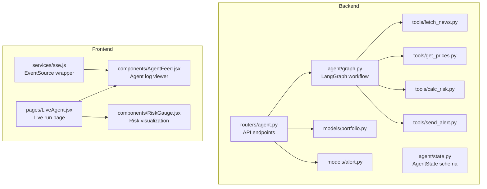
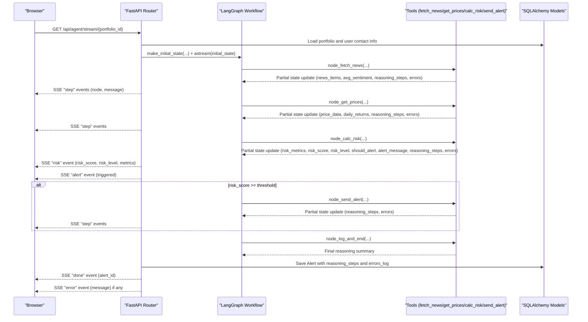
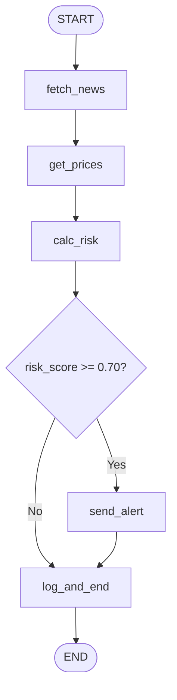
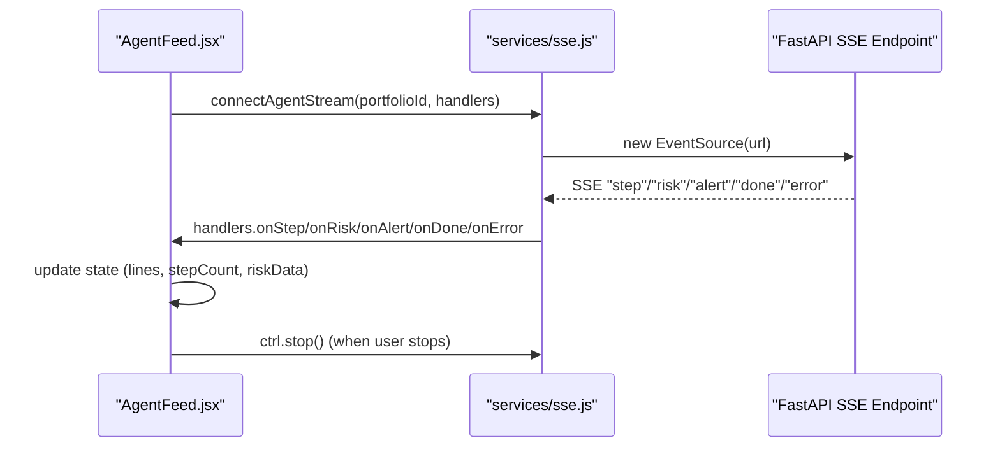
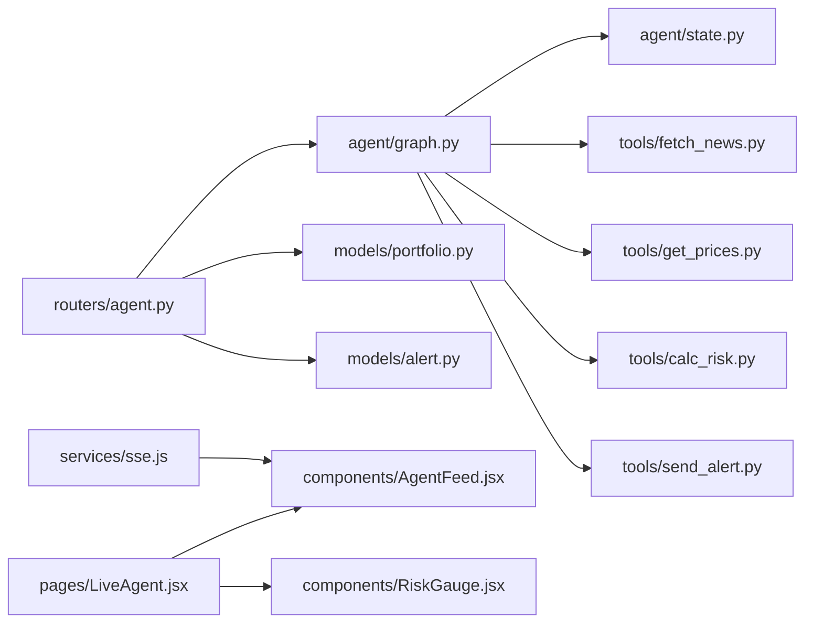

# Agent Workflow API

<cite>
**Referenced Files in This Document**
- [backend/routers/agent.py](file://backend/routers/agent.py)
- [backend/agent/graph.py](file://backend/agent/graph.py)
- [backend/agent/state.py](file://backend/agent/state.py)
- [backend/agent/tools/fetch_news.py](file://backend/agent/tools/fetch_news.py)
- [backend/agent/tools/get_prices.py](file://backend/agent/tools/get_prices.py)
- [backend/agent/tools/calc_risk.py](file://backend/agent/tools/calc_risk.py)
- [backend/agent/tools/send_alert.py](file://backend/agent/tools/send_alert.py)
- [backend/models/portfolio.py](file://backend/models/portfolio.py)
- [backend/models/alert.py](file://backend/models/alert.py)
- [backend/agent/run_agent.py](file://backend/agent/run_agent.py)
- [frontend/src/services/sse.js](file://frontend/src/services/sse.js)
- [frontend/src/components/AgentFeed.jsx](file://frontend/src/components/AgentFeed.jsx)
- [frontend/src/pages/LiveAgent.jsx](file://frontend/src/pages/LiveAgent.jsx)
- [frontend/src/components/RiskGauge.jsx](file://frontend/src/components/RiskGauge.jsx)
</cite>

## Table of Contents
1. [Introduction](#introduction)
2. [Project Structure](#project-structure)
3. [Core Components](#core-components)
4. [Architecture Overview](#architecture-overview)
5. [Detailed Component Analysis](#detailed-component-analysis)
6. [Dependency Analysis](#dependency-analysis)
7. [Performance Considerations](#performance-considerations)
8. [Troubleshooting Guide](#troubleshooting-guide)
9. [Conclusion](#conclusion)
10. [Appendices](#appendices)

## Introduction
This document provides comprehensive API documentation for the agent workflow endpoints focused on real-time risk analysis execution. It covers:
- Server-Sent Events (SSE) streaming endpoint GET /api/agent/stream/{portfolio_id} for live agent execution visualization
- Synchronous execution endpoint POST /api/agent/run/{portfolio_id} returning a JSON summary
- The LangGraph workflow integration, state machine transitions, and real-time data transmission protocol
- Client-side SSE handling, event parsing, and error recovery mechanisms
- Practical curl examples and typical agent execution scenarios with real-time feedback

## Project Structure
The agent workflow spans backend FastAPI endpoints, a LangGraph state machine, modular tools, SQLAlchemy models, and a React frontend with SSE handling.

**Diagram sources**
- [backend/routers/agent.py:1-243](file://backend/routers/agent.py#L1-L243)
- [backend/agent/graph.py:1-243](file://backend/agent/graph.py#L1-L243)
- [backend/agent/state.py:1-58](file://backend/agent/state.py#L1-L58)
- [backend/agent/tools/fetch_news.py:1-164](file://backend/agent/tools/fetch_news.py#L1-L164)
- [backend/agent/tools/get_prices.py:1-139](file://backend/agent/tools/get_prices.py#L1-L139)
- [backend/agent/tools/calc_risk.py:1-255](file://backend/agent/tools/calc_risk.py#L1-L255)
- [backend/agent/tools/send_alert.py:1-231](file://backend/agent/tools/send_alert.py#L1-L231)
- [backend/models/portfolio.py:1-63](file://backend/models/portfolio.py#L1-L63)
- [backend/models/alert.py:1-77](file://backend/models/alert.py#L1-L77)
- [frontend/src/services/sse.js:1-63](file://frontend/src/services/sse.js#L1-L63)
- [frontend/src/components/AgentFeed.jsx:1-175](file://frontend/src/components/AgentFeed.jsx#L1-L175)
- [frontend/src/pages/LiveAgent.jsx:1-95](file://frontend/src/pages/LiveAgent.jsx#L1-L95)
- [frontend/src/components/RiskGauge.jsx:1-101](file://frontend/src/components/RiskGauge.jsx#L1-L101)

**Section sources**
- [backend/routers/agent.py:1-243](file://backend/routers/agent.py#L1-L243)
- [backend/agent/graph.py:1-243](file://backend/agent/graph.py#L1-L243)
- [backend/agent/state.py:1-58](file://backend/agent/state.py#L1-L58)
- [frontend/src/services/sse.js:1-63](file://frontend/src/services/sse.js#L1-L63)
- [frontend/src/components/AgentFeed.jsx:1-175](file://frontend/src/components/AgentFeed.jsx#L1-L175)
- [frontend/src/pages/LiveAgent.jsx:1-95](file://frontend/src/pages/LiveAgent.jsx#L1-L95)
- [frontend/src/components/RiskGauge.jsx:1-101](file://frontend/src/components/RiskGauge.jsx#L1-L101)

## Core Components
- API Router: Exposes SSE streaming and synchronous execution endpoints, orchestrates DB queries, and persists results.
- LangGraph Workflow: Defines a four-node pipeline with conditional routing based on computed risk score.
- Tools: Modular functions implementing fetching news, downloading prices, computing risk metrics, and dispatching alerts.
- State Schema: Typed dictionary defining the shared state across nodes and emitted events.
- Frontend SSE Client: Wraps EventSource, parses events, and updates UI components.

Key endpoints:
- GET /api/agent/stream/{portfolio_id}: Streams agent reasoning, risk updates, alert decisions, and completion/error notifications.
- POST /api/agent/run/{portfolio_id}: Runs the agent synchronously and returns a JSON summary.
- GET /api/agent/status: Health check endpoint.

**Section sources**
- [backend/routers/agent.py:39-242](file://backend/routers/agent.py#L39-L242)
- [backend/agent/graph.py:45-199](file://backend/agent/graph.py#L45-L199)
- [backend/agent/state.py:28-58](file://backend/agent/state.py#L28-L58)
- [backend/agent/tools/fetch_news.py:98-164](file://backend/agent/tools/fetch_news.py#L98-L164)
- [backend/agent/tools/get_prices.py:84-139](file://backend/agent/tools/get_prices.py#L84-L139)
- [backend/agent/tools/calc_risk.py:149-255](file://backend/agent/tools/calc_risk.py#L149-L255)
- [backend/agent/tools/send_alert.py:157-231](file://backend/agent/tools/send_alert.py#L157-L231)

## Architecture Overview
The agent workflow integrates FastAPI, LangGraph, and a modular toolset. The SSE endpoint streams state deltas produced by LangGraph’s astream method. The frontend renders live updates and persists results to the database upon completion.

**Diagram sources**
- [backend/routers/agent.py:39-168](file://backend/routers/agent.py#L39-L168)
- [backend/agent/graph.py:45-199](file://backend/agent/graph.py#L45-L199)
- [backend/agent/tools/fetch_news.py:98-164](file://backend/agent/tools/fetch_news.py#L98-L164)
- [backend/agent/tools/get_prices.py:84-139](file://backend/agent/tools/get_prices.py#L84-L139)
- [backend/agent/tools/calc_risk.py:149-255](file://backend/agent/tools/calc_risk.py#L149-L255)
- [backend/agent/tools/send_alert.py:157-231](file://backend/agent/tools/send_alert.py#L157-L231)
- [backend/models/alert.py:14-77](file://backend/models/alert.py#L14-L77)

## Detailed Component Analysis

### API Endpoints
- GET /api/agent/stream/{portfolio_id}
  - Purpose: Real-time streaming of agent execution via SSE.
  - Behavior:
    - Loads portfolio and user contact info from DB.
    - Emits an initial "start" event with portfolio metadata.
    - Streams "step" events for each new reasoning step.
    - Emits "risk" event when risk metrics are available.
    - Emits "alert" event when the decision to alert is made.
    - Emits "error" events for tool failures.
    - On completion, persists Alert to DB and emits "done" with alert_id.
  - Headers: Cache-Control: no-cache, X-Accel-Buffering: no, Access-Control-Allow-Origin: *
  - SSE event types:
    - { type: "start", portfolio: dict, name: string }
    - { type: "step", node: string, message: string }
    - { type: "risk", risk_score: float, risk_level: string, metrics: dict }
    - { type: "alert", triggered: bool }
    - { type: "done", alert_id: int }
    - { type: "error", message: string }

- POST /api/agent/run/{portfolio_id}
  - Purpose: Synchronous execution returning a JSON summary.
  - Behavior:
    - Builds initial state from portfolio and user contact info.
    - Executes the full graph via ainvoke.
    - Persists Alert to DB with risk metrics and reasoning logs.
    - Returns JSON with alert_id, risk_score, risk_level, should_alert, and risk_metrics.

- GET /api/agent/status
  - Purpose: Health check endpoint returning service status and metadata.

**Section sources**
- [backend/routers/agent.py:39-168](file://backend/routers/agent.py#L39-L168)
- [backend/routers/agent.py:186-242](file://backend/routers/agent.py#L186-L242)

### LangGraph Workflow and State Machine
- Nodes:
  - fetch_news: Collects market news and computes average sentiment.
  - get_prices: Downloads 1-year price history and computes daily returns.
  - calc_risk: Computes Sharpe, Sortino, volatility, and composite risk score; sets risk_level and should_alert.
  - send_alert: Conditionally sends email/SMS when risk_level is HIGH.
  - log_and_end: Terminal node logging final summary.
- Edges:
  - Linear: fetch_news → get_prices → calc_risk.
  - Conditional: calc_risk routes to send_alert if risk_score ≥ 0.70, else to log_and_end.
  - Both paths lead to END.
- Initial State Factory:
  - Creates AgentState with portfolio, optional user contact info, and empty working fields.

**Diagram sources**
- [backend/agent/graph.py:162-199](file://backend/agent/graph.py#L162-L199)
- [backend/agent/graph.py:210-242](file://backend/agent/graph.py#L210-L242)

**Section sources**
- [backend/agent/graph.py:45-156](file://backend/agent/graph.py#L45-L156)
- [backend/agent/graph.py:162-204](file://backend/agent/graph.py#L162-L204)
- [backend/agent/state.py:28-58](file://backend/agent/state.py#L28-L58)

### Tool Modules
- fetch_news:
  - Fetches headlines (real via NewsAPI or mock) and computes avg_sentiment.
  - Returns news_items, avg_sentiment, reasoning_steps, and errors.
- get_prices:
  - Downloads 1-year close prices (yfinance) or falls back to synthetic GBM data.
  - Returns price_data, daily_returns, reasoning_steps, and errors.
- calc_risk:
  - Computes Sharpe, Sortino, annualised volatility, and max drawdown.
  - Builds composite risk_score and risk_level; determines should_alert.
  - Returns risk_metrics, risk_score, risk_level, should_alert, alert_message, reasoning_steps, and errors.
- send_alert:
  - Sends email (SendGrid) and/or SMS (Twilio) depending on risk_level and user contact info.
  - Returns reasoning_steps and errors; logs in mock mode when credentials are missing.

**Section sources**
- [backend/agent/tools/fetch_news.py:98-164](file://backend/agent/tools/fetch_news.py#L98-L164)
- [backend/agent/tools/get_prices.py:84-139](file://backend/agent/tools/get_prices.py#L84-L139)
- [backend/agent/tools/calc_risk.py:149-255](file://backend/agent/tools/calc_risk.py#L149-L255)
- [backend/agent/tools/send_alert.py:157-231](file://backend/agent/tools/send_alert.py#L157-L231)

### Data Models
- Portfolio:
  - Stores name, user_id, tickers JSON, user_email, user_phone, risk_threshold, and timestamps.
  - Provides tickers property to parse JSON to dict.
- Alert:
  - Stores risk snapshot, alert delivery flags, alert_message, and serialized reasoning_steps and errors_log.
  - Provides reasoning_steps property to load from JSON.

**Section sources**
- [backend/models/portfolio.py:16-63](file://backend/models/portfolio.py#L16-L63)
- [backend/models/alert.py:14-77](file://backend/models/alert.py#L14-L77)

### Client-Side SSE Handling
- EventSource Wrapper:
  - connectAgentStream(portfolioId, handlers) returns a controller with stop().
  - Parses incoming messages and dispatches to handlers: onStart, onStep, onRisk, onAlert, onDone, onError.
  - Closes connection on "done" or SSE error.
- AgentFeed Component:
  - Renders live reasoning steps, highlights categories (alert/good/warn/error), auto-scrolls to bottom.
  - Updates risk data via onRiskUpdate and final alert ID via onDone.
- RiskGauge Component:
  - Visualizes risk score as a radial gauge and displays key metrics.
- LiveAgent Page:
  - Provides a full-screen layout with AgentFeed and RiskGauge side-by-side.

**Diagram sources**
- [frontend/src/services/sse.js:21-62](file://frontend/src/services/sse.js#L21-L62)
- [frontend/src/components/AgentFeed.jsx:28-96](file://frontend/src/components/AgentFeed.jsx#L28-L96)
- [backend/routers/agent.py:39-168](file://backend/routers/agent.py#L39-L168)

**Section sources**
- [frontend/src/services/sse.js:1-63](file://frontend/src/services/sse.js#L1-L63)
- [frontend/src/components/AgentFeed.jsx:1-175](file://frontend/src/components/AgentFeed.jsx#L1-L175)
- [frontend/src/pages/LiveAgent.jsx:1-95](file://frontend/src/pages/LiveAgent.jsx#L1-L95)
- [frontend/src/components/RiskGauge.jsx:1-101](file://frontend/src/components/RiskGauge.jsx#L1-L101)

### Standalone Agent Runner
- Standalone script demonstrates how to run the agent outside the API for testing and development.
- Iterates over predefined portfolios and prints reasoning steps and risk summaries.

**Section sources**
- [backend/agent/run_agent.py:46-93](file://backend/agent/run_agent.py#L46-L93)

## Dependency Analysis
- Backend API depends on:
  - LangGraph workflow for orchestration
  - Tools for data fetching and computations
  - SQLAlchemy models for persistence
- Frontend depends on:
  - SSE service for real-time updates
  - UI components for rendering agent logs and risk metrics

**Diagram sources**
- [backend/routers/agent.py:17-27](file://backend/routers/agent.py#L17-L27)
- [backend/agent/graph.py:26-34](file://backend/agent/graph.py#L26-L34)
- [backend/agent/state.py:9-18](file://backend/agent/state.py#L9-L18)
- [backend/agent/tools/fetch_news.py:22-24](file://backend/agent/tools/fetch_news.py#L22-L24)
- [backend/agent/tools/get_prices.py:17-19](file://backend/agent/tools/get_prices.py#L17-L19)
- [backend/agent/tools/calc_risk.py:43-44](file://backend/agent/tools/calc_risk.py#L43-L44)
- [backend/agent/tools/send_alert.py:19-20](file://backend/agent/tools/send_alert.py#L19-L20)
- [backend/models/portfolio.py:10-13](file://backend/models/portfolio.py#L10-L13)
- [backend/models/alert.py:10-11](file://backend/models/alert.py#L10-L11)
- [frontend/src/services/sse.js:19](file://frontend/src/services/sse.js#L19)
- [frontend/src/components/AgentFeed.jsx:8-11](file://frontend/src/components/AgentFeed.jsx#L8-L11)
- [frontend/src/pages/LiveAgent.jsx:8-13](file://frontend/src/pages/LiveAgent.jsx#L8-L13)
- [frontend/src/components/RiskGauge.jsx:8](file://frontend/src/components/RiskGauge.jsx#L8)

**Section sources**
- [backend/routers/agent.py:17-27](file://backend/routers/agent.py#L17-L27)
- [backend/agent/graph.py:26-34](file://backend/agent/graph.py#L26-L34)
- [backend/agent/state.py:9-18](file://backend/agent/state.py#L9-L18)
- [backend/agent/tools/fetch_news.py:22-24](file://backend/agent/tools/fetch_news.py#L22-L24)
- [backend/agent/tools/get_prices.py:17-19](file://backend/agent/tools/get_prices.py#L17-L19)
- [backend/agent/tools/calc_risk.py:43-44](file://backend/agent/tools/calc_risk.py#L43-L44)
- [backend/agent/tools/send_alert.py:19-20](file://backend/agent/tools/send_alert.py#L19-L20)
- [backend/models/portfolio.py:10-13](file://backend/models/portfolio.py#L10-L13)
- [backend/models/alert.py:10-11](file://backend/models/alert.py#L10-L11)
- [frontend/src/services/sse.js:19](file://frontend/src/services/sse.js#L19)
- [frontend/src/components/AgentFeed.jsx:8-11](file://frontend/src/components/AgentFeed.jsx#L8-L11)
- [frontend/src/pages/LiveAgent.jsx:8-13](file://frontend/src/pages/LiveAgent.jsx#L8-L13)
- [frontend/src/components/RiskGauge.jsx:8](file://frontend/src/components/RiskGauge.jsx#L8)

## Performance Considerations
- SSE Streaming:
  - Uses astream to emit state deltas incrementally, minimizing latency and memory overhead.
  - Includes a small artificial delay for visual pacing; adjust or remove for lower latency.
- Database Persistence:
  - Saving Alert is offloaded to a thread executor to avoid blocking the async loop.
- Network Resilience:
  - Tools gracefully fall back to mock data when external APIs are unavailable.
- Frontend Rendering:
  - Efficiently appends new lines and auto-scrolls; consider virtualization for very long feeds.

[No sources needed since this section provides general guidance]

## Troubleshooting Guide
- SSE Connection Issues:
  - Verify CORS and buffering headers are set correctly on the server.
  - Confirm the client uses EventSource and handles onerror to recover.
- Missing Portfolio:
  - The SSE endpoint returns 404 if portfolio_id is not found; ensure the ID exists.
- Tool Failures:
  - Errors are streamed as "error" events; inspect reasoning_steps and errors_log in the persisted Alert.
- Alert Delivery:
  - When credentials are missing, alerts are logged to console; configure SendGrid/Twilio for production.
- Frontend Not Updating:
  - Ensure handlers are provided to connectAgentStream and that onRiskUpdate is passed down to AgentFeed.

**Section sources**
- [backend/routers/agent.py:58-61](file://backend/routers/agent.py#L58-L61)
- [backend/routers/agent.py:123-126](file://backend/routers/agent.py#L123-L126)
- [backend/agent/tools/send_alert.py:125-155](file://backend/agent/tools/send_alert.py#L125-L155)
- [frontend/src/services/sse.js:54-57](file://frontend/src/services/sse.js#L54-L57)

## Conclusion
The agent workflow API provides a robust, real-time risk analysis pipeline powered by LangGraph and modular tools. The SSE streaming endpoint delivers live insights, while the synchronous endpoint offers immediate results. The frontend integrates seamlessly with EventSource to visualize agent reasoning, risk metrics, and alert decisions, enabling transparent and actionable financial monitoring.

[No sources needed since this section summarizes without analyzing specific files]

## Appendices

### API Definitions

- GET /api/agent/stream/{portfolio_id}
  - Path parameters:
    - portfolio_id: integer
  - Response:
    - Server-Sent Events stream with the following event types:
      - start: { type: "start", portfolio: dict, name: string }
      - step: { type: "step", node: string, message: string }
      - risk: { type: "risk", risk_score: float, risk_level: string, metrics: dict }
      - alert: { type: "alert", triggered: bool }
      - done: { type: "done", alert_id: int }
      - error: { type: "error", message: string }
  - Notes:
    - Emits "start" before streaming steps.
    - Emits "risk" when calc_risk completes.
    - Emits "alert" when should_alert is true.
    - Emits "done" with alert_id after saving to DB.
    - Emits "error" for tool exceptions or DB save failures.

- POST /api/agent/run/{portfolio_id}
  - Path parameters:
    - portfolio_id: integer
  - Response:
    - JSON object with:
      - alert_id: integer
      - risk_score: number
      - risk_level: string
      - should_alert: boolean
      - risk_metrics: object

- GET /api/agent/status
  - Response:
    - JSON object with:
      - status: string
      - agent: string
      - version: string
      - timestamp: ISO timestamp

**Section sources**
- [backend/routers/agent.py:39-168](file://backend/routers/agent.py#L39-L168)
- [backend/routers/agent.py:186-242](file://backend/routers/agent.py#L186-L242)

### SSE Event Formats
- step
  - node: string (one of fetch_news, get_prices, calc_risk, send_alert, log_and_end)
  - message: string (reasoning step text)
- risk
  - risk_score: number (0.0–1.0)
  - risk_level: string ("LOW" | "MEDIUM" | "HIGH")
  - metrics: object (e.g., sharpe_ratio, sortino_ratio, annualised_volatility, max_drawdown)
- alert
  - triggered: boolean
- done
  - alert_id: integer
- error
  - message: string

**Section sources**
- [backend/routers/agent.py:50-56](file://backend/routers/agent.py#L50-L56)

### Client-Side SSE Handling Example
- Initialize SSE:
  - Use connectAgentStream(portfolioId, handlers) to create an EventSource connection.
  - Handlers: onStart, onStep, onRisk, onAlert, onDone, onError.
- Stop Streaming:
  - Call ctrl.stop() to close the connection.

**Section sources**
- [frontend/src/services/sse.js:21-62](file://frontend/src/services/sse.js#L21-L62)

### Curl Examples
- Establish SSE connection:
  - curl -N -H "Accept: text/event-stream" "http://localhost:8000/api/agent/stream/{portfolio_id}"
- Trigger synchronous run:
  - curl -X POST "http://localhost:8000/api/agent/run/{portfolio_id}"

Notes:
- Replace localhost:8000 with your backend host/port.
- Ensure portfolio_id corresponds to an existing portfolio.

**Section sources**
- [backend/routers/agent.py:39-168](file://backend/routers/agent.py#L39-L168)
- [backend/routers/agent.py:186-242](file://backend/routers/agent.py#L186-L242)

### Typical Execution Scenarios
- Low-Risk Portfolio:
  - Steps: fetch_news → get_prices → calc_risk (LOW/MEDIUM risk) → log_and_end
  - Alerts: none
  - Outcome: "done" with alert_id; "risk" event emitted
- High-Risk Portfolio:
  - Steps: fetch_news → get_prices → calc_risk (HIGH risk) → send_alert → log_and_end
  - Alerts: email and SMS if user_email/user_phone configured
  - Outcome: "done" with alert_id; "alert" event emitted as true

**Section sources**
- [backend/agent/graph.py:146-156](file://backend/agent/graph.py#L146-L156)
- [backend/agent/tools/send_alert.py:157-231](file://backend/agent/tools/send_alert.py#L157-L231)