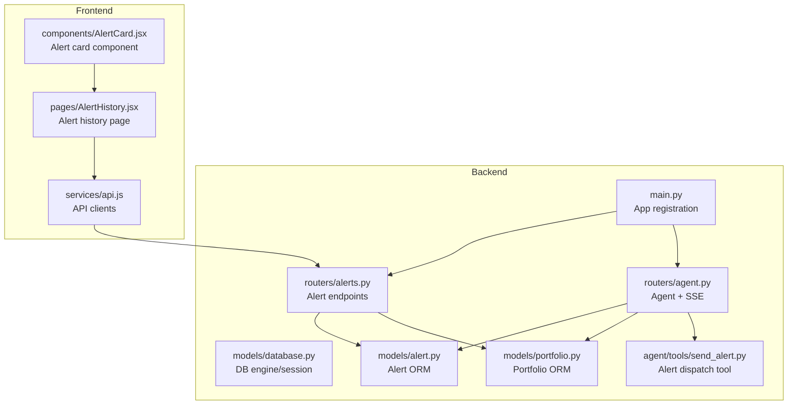
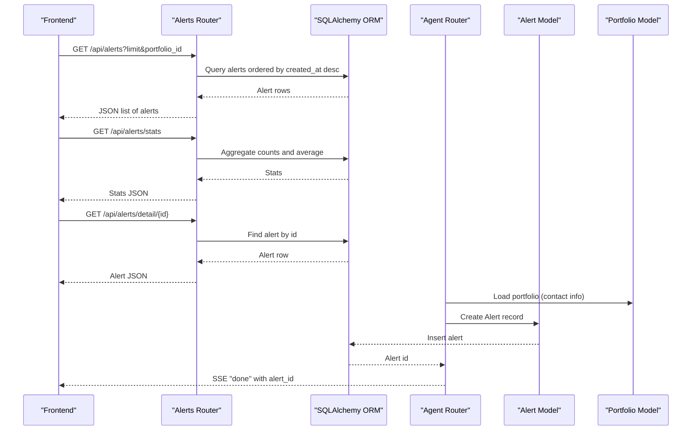
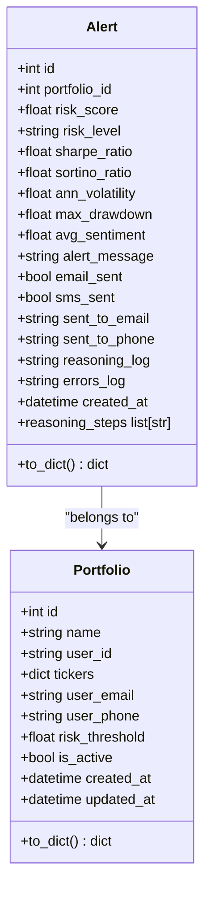
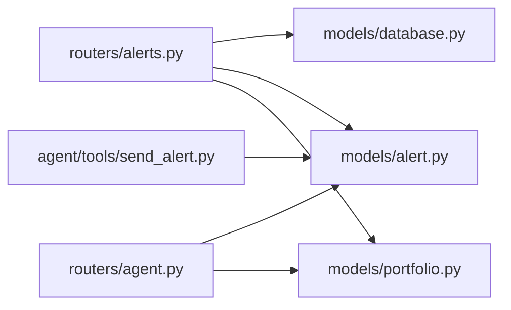

# Alert Management API

<cite>
**Referenced Files in This Document**
- [backend/main.py](file://backend/main.py)
- [backend/routers/alerts.py](file://backend/routers/alerts.py)
- [backend/models/alert.py](file://backend/models/alert.py)
- [backend/models/portfolio.py](file://backend/models/portfolio.py)
- [backend/models/database.py](file://backend/models/database.py)
- [backend/routers/agent.py](file://backend/routers/agent.py)
- [backend/agent/tools/send_alert.py](file://backend/agent/tools/send_alert.py)
- [frontend/src/services/api.js](file://frontend/src/services/api.js)
- [frontend/src/pages/AlertHistory.jsx](file://frontend/src/pages/AlertHistory.jsx)
- [frontend/src/components/AlertCard.jsx](file://frontend/src/components/AlertCard.jsx)
</cite>

## Table of Contents
1. [Introduction](#introduction)
2. [Project Structure](#project-structure)
3. [Core Components](#core-components)
4. [Architecture Overview](#architecture-overview)
5. [Detailed Component Analysis](#detailed-component-analysis)
6. [Dependency Analysis](#dependency-analysis)
7. [Performance Considerations](#performance-considerations)
8. [Troubleshooting Guide](#troubleshooting-guide)
9. [Conclusion](#conclusion)
10. [Appendices](#appendices)

## Introduction
This document provides comprehensive API documentation for the alert management endpoints that power portfolio risk monitoring and alert delivery. It covers:
- Retrieving alert history with filtering and pagination
- Aggregated statistics across alerts
- Individual alert details including reasoning logs
- Alert data models and relationships to portfolio risk thresholds
- Error handling for missing alerts
- Examples of alert configuration and management workflows

The system integrates a LangGraph-powered agent that computes portfolio risk, optionally dispatches alerts via email/SMS, and persists alert records for historical analysis.

## Project Structure
The alert management system spans backend FastAPI routers, SQLAlchemy models, and a React frontend that consumes the APIs.

**Diagram sources**
- [backend/main.py:38-43](file://backend/main.py#L38-L43)
- [backend/routers/alerts.py:19-84](file://backend/routers/alerts.py#L19-L84)
- [backend/routers/agent.py:27-243](file://backend/routers/agent.py#L27-L243)
- [backend/models/alert.py:14-77](file://backend/models/alert.py#L14-L77)
- [backend/models/portfolio.py:16-63](file://backend/models/portfolio.py#L16-L63)
- [backend/agent/tools/send_alert.py:157-231](file://backend/agent/tools/send_alert.py#L157-L231)
- [frontend/src/services/api.js:26-32](file://frontend/src/services/api.js#L26-L32)
- [frontend/src/pages/AlertHistory.jsx:12-163](file://frontend/src/pages/AlertHistory.jsx#L12-L163)
- [frontend/src/components/AlertCard.jsx:10-89](file://frontend/src/components/AlertCard.jsx#L10-L89)

**Section sources**
- [backend/main.py:38-43](file://backend/main.py#L38-L43)
- [backend/routers/alerts.py:19-84](file://backend/routers/alerts.py#L19-L84)
- [backend/routers/agent.py:27-243](file://backend/routers/agent.py#L27-L243)
- [frontend/src/services/api.js:26-32](file://frontend/src/services/api.js#L26-L32)

## Core Components
- Alert endpoints: list all alerts, list by portfolio, get detailed alert, and summary statistics
- Alert model: persisted alert entity with risk metrics, delivery status, reasoning logs, and timestamps
- Portfolio model: stores user contact info and risk threshold that influences alerting decisions
- Agent integration: triggers runs, streams reasoning, computes risk, and persists alerts
- Frontend consumers: list alerts, show statistics, and expand reasoning logs

Key implementation references:
- Endpoints and pagination/filtering: [backend/routers/alerts.py:22-56](file://backend/routers/alerts.py#L22-L56)
- Statistics aggregation: [backend/routers/alerts.py:59-83](file://backend/routers/alerts.py#L59-L83)
- Alert model fields and serialization: [backend/models/alert.py:14-77](file://backend/models/alert.py#L14-L77)
- Portfolio risk threshold: [backend/models/portfolio.py:29](file://backend/models/portfolio.py#L29)
- Agent persistence of alerts: [backend/routers/agent.py:128-158](file://backend/routers/agent.py#L128-L158)

**Section sources**
- [backend/routers/alerts.py:22-83](file://backend/routers/alerts.py#L22-L83)
- [backend/models/alert.py:14-77](file://backend/models/alert.py#L14-L77)
- [backend/models/portfolio.py:29](file://backend/models/portfolio.py#L29)
- [backend/routers/agent.py:128-158](file://backend/routers/agent.py#L128-L158)

## Architecture Overview
The alert management architecture centers around:
- FastAPI routers exposing read-only alert endpoints
- SQLAlchemy ORM mapping alerts and portfolios
- Agent pipeline that computes risk and persists alerts
- Optional alert delivery via SendGrid and Twilio
- Frontend consuming alert endpoints to render history and statistics

**Diagram sources**
- [backend/routers/alerts.py:22-83](file://backend/routers/alerts.py#L22-L83)
- [backend/routers/agent.py:128-158](file://backend/routers/agent.py#L128-L158)
- [backend/models/alert.py:14-77](file://backend/models/alert.py#L14-L77)
- [backend/models/portfolio.py:16-63](file://backend/models/portfolio.py#L16-L63)

## Detailed Component Analysis

### Alert Endpoints
- GET /api/alerts
  - Purpose: Retrieve recent alerts, optionally filtered by portfolio
  - Query parameters:
    - limit: integer, default 50
    - portfolio_id: optional integer
  - Sorting: latest first by created_at descending
  - Response: Array of alert objects
  - Implementation: [backend/routers/alerts.py:22-32](file://backend/routers/alerts.py#L22-L32)

- GET /api/alerts/portfolio/{portfolio_id}
  - Purpose: Retrieve alerts for a specific portfolio
  - Path parameter: portfolio_id
  - Query parameters:
    - limit: integer, default 20
  - Sorting: latest first by created_at descending
  - Response: Array of alert objects
  - Implementation: [backend/routers/alerts.py:43-56](file://backend/routers/alerts.py#L43-L56)

- GET /api/alerts/detail/{alert_id}
  - Purpose: Retrieve a single alert with full reasoning log
  - Path parameter: alert_id
  - Response: Single alert object
  - Error handling: 404 Not Found if alert does not exist
  - Implementation: [backend/routers/alerts.py:35-40](file://backend/routers/alerts.py#L35-L40)

- GET /api/alerts/stats
  - Purpose: Summary statistics across all alerts
  - Response fields:
    - total_runs: integer
    - high_alerts: integer
    - medium_alerts: integer
    - low_alerts: integer
    - emails_sent: integer
    - sms_sent: integer
    - avg_risk_score: float
    - latest_run: ISO timestamp or null
  - Implementation: [backend/routers/alerts.py:59-83](file://backend/routers/alerts.py#L59-L83)

Frontend usage examples:
- List alerts with limit: [frontend/src/services/api.js:28](file://frontend/src/services/api.js#L28)
- Fetch stats: [frontend/src/services/api.js:30](file://frontend/src/services/api.js#L30)
- Detail view: [frontend/src/services/api.js:29](file://frontend/src/services/api.js#L29)

**Section sources**
- [backend/routers/alerts.py:22-83](file://backend/routers/alerts.py#L22-L83)
- [frontend/src/services/api.js:26-32](file://frontend/src/services/api.js#L26-L32)

### Alert Data Model
The Alert entity captures risk assessment outcomes, delivery status, and reasoning artifacts.

Fields:
- id: integer, primary key
- portfolio_id: integer, foreign key to portfolios
- risk_score: float, 0.0–1.0
- risk_level: string, "LOW" | "MEDIUM" | "HIGH"
- sharpe_ratio: float, optional
- sortino_ratio: float, optional
- ann_volatility: float, optional
- max_drawdown: float, optional
- avg_sentiment: float, optional
- alert_message: text, optional
- email_sent: boolean, default false
- sms_sent: boolean, default false
- sent_to_email: string, optional
- sent_to_phone: string, optional
- reasoning_log: text (JSON list of strings)
- errors_log: text (JSON list)
- created_at: datetime, UTC, indexed

Serialization helper:
- to_dict(): returns a normalized dictionary representation suitable for API responses
- reasoning_steps property: getter/setter for reasoning_log JSON field

Relationships:
- Belongs to a Portfolio via portfolio_id

**Diagram sources**
- [backend/models/alert.py:14-77](file://backend/models/alert.py#L14-L77)
- [backend/models/portfolio.py:16-63](file://backend/models/portfolio.py#L16-L63)

**Section sources**
- [backend/models/alert.py:14-77](file://backend/models/alert.py#L14-L77)
- [backend/models/portfolio.py:16-63](file://backend/models/portfolio.py#L16-L63)

### Portfolio Risk Threshold and Alerting
- Portfolio model includes risk_threshold (default 0.70), which influences whether an alert is triggered during agent runs
- Agent logic determines should_alert based on computed risk_score vs risk_threshold and risk_level
- Alert persistence sets email_sent/sms_sent based on user contact info and risk level

References:
- Risk threshold definition: [backend/models/portfolio.py:29](file://backend/models/portfolio.py#L29)
- Agent alert decision and persistence: [backend/routers/agent.py:128-158](file://backend/routers/agent.py#L128-L158)
- Alert dispatch tool behavior: [backend/agent/tools/send_alert.py:6-12](file://backend/agent/tools/send_alert.py#L6-L12)

**Section sources**
- [backend/models/portfolio.py:29](file://backend/models/portfolio.py#L29)
- [backend/routers/agent.py:128-158](file://backend/routers/agent.py#L128-L158)
- [backend/agent/tools/send_alert.py:6-12](file://backend/agent/tools/send_alert.py#L6-L12)

### Filtering, Pagination, and Sorting
- Pagination:
  - limit parameter controls the number of alerts returned
  - Defaults: 50 for general list, 20 for portfolio-specific list
- Filtering:
  - portfolio_id filters alerts by portfolio
  - Frontend applies risk_level filtering client-side on the alert list
- Sorting:
  - Alerts are sorted by created_at descending (latest first)

References:
- General list with limit and optional portfolio filter: [backend/routers/alerts.py:22-32](file://backend/routers/alerts.py#L22-L32)
- Portfolio-specific list with limit: [backend/routers/alerts.py:43-56](file://backend/routers/alerts.py#L43-L56)
- Client-side filtering in frontend: [frontend/src/pages/AlertHistory.jsx:34](file://frontend/src/pages/AlertHistory.jsx#L34)

**Section sources**
- [backend/routers/alerts.py:22-56](file://backend/routers/alerts.py#L22-L56)
- [frontend/src/pages/AlertHistory.jsx:34](file://frontend/src/pages/AlertHistory.jsx#L34)

### Error Handling
- Missing alert:
  - GET /api/alerts/detail/{alert_id} returns 404 Not Found if alert does not exist
  - Reference: [backend/routers/alerts.py:38-39](file://backend/routers/alerts.py#L38-L39)

**Section sources**
- [backend/routers/alerts.py:38-39](file://backend/routers/alerts.py#L38-L39)

### Request and Response Schemas
Below are the canonical schemas for alert entities and statistics.

Alert entity schema:
- id: integer
- portfolio_id: integer
- risk_score: number
- risk_level: string enum "LOW" | "MEDIUM" | "HIGH"
- sharpe_ratio: number or null
- sortino_ratio: number or null
- ann_volatility: number or null
- max_drawdown: number or null
- avg_sentiment: number or null
- alert_message: string or null
- email_sent: boolean
- sms_sent: boolean
- sent_to_email: string or null
- sent_to_phone: string or null
- reasoning_steps: array of strings
- errors: array of strings
- created_at: ISO timestamp string

Statistics schema:
- total_runs: integer
- high_alerts: integer
- medium_alerts: integer
- low_alerts: integer
- emails_sent: integer
- sms_sent: integer
- avg_risk_score: number
- latest_run: ISO timestamp or null

**Section sources**
- [backend/models/alert.py:57-76](file://backend/models/alert.py#L57-L76)
- [backend/routers/alerts.py:74-83](file://backend/routers/alerts.py#L74-L83)

### Example Workflows

#### Workflow 1: Retrieve Alert History
- Steps:
  - Call GET /api/alerts with desired limit and optional portfolio_id
  - Optionally call GET /api/alerts/stats for summary metrics
- Frontend usage:
  - [frontend/src/services/api.js:28](file://frontend/src/services/api.js#L28)
  - [frontend/src/services/api.js:30](file://frontend/src/services/api.js#L30)

#### Workflow 2: View Detailed Alert with Reasoning Log
- Steps:
  - Call GET /api/alerts/detail/{alert_id}
  - Display reasoning_steps and errors arrays
- Frontend usage:
  - [frontend/src/services/api.js:29](file://frontend/src/services/api.js#L29)

#### Workflow 3: Manage Alert Configuration via Portfolio
- Steps:
  - Update portfolio risk_threshold and contact info (email/phone)
  - Trigger agent run to compute risk and decide alerting
  - Review alert history and statistics
- References:
  - Risk threshold: [backend/models/portfolio.py:29](file://backend/models/portfolio.py#L29)
  - Agent run and persistence: [backend/routers/agent.py:186-232](file://backend/routers/agent.py#L186-L232)

**Section sources**
- [frontend/src/services/api.js:26-32](file://frontend/src/services/api.js#L26-L32)
- [backend/models/portfolio.py:29](file://backend/models/portfolio.py#L29)
- [backend/routers/agent.py:186-232](file://backend/routers/agent.py#L186-L232)

## Dependency Analysis
The alert endpoints depend on:
- Database session factory for ORM queries
- Alert and Portfolio models for data access
- Agent pipeline for alert creation and persistence

**Diagram sources**
- [backend/routers/alerts.py:16-17](file://backend/routers/alerts.py#L16-L17)
- [backend/models/database.py:29-35](file://backend/models/database.py#L29-L35)
- [backend/models/alert.py:14-77](file://backend/models/alert.py#L14-L77)
- [backend/models/portfolio.py:16-63](file://backend/models/portfolio.py#L16-L63)
- [backend/routers/agent.py:21-24](file://backend/routers/agent.py#L21-L24)
- [backend/agent/tools/send_alert.py:157-231](file://backend/agent/tools/send_alert.py#L157-L231)

**Section sources**
- [backend/routers/alerts.py:16-17](file://backend/routers/alerts.py#L16-L17)
- [backend/models/database.py:29-35](file://backend/models/database.py#L29-L35)
- [backend/routers/agent.py:21-24](file://backend/routers/agent.py#L21-L24)

## Performance Considerations
- Indexing:
  - Alert.created_at is indexed to support efficient ordering and pagination
  - Alert.portfolio_id is indexed to accelerate portfolio-scoped queries
- Query patterns:
  - Use limit to constrain result size
  - Prefer portfolio_id filter for targeted queries
- Serialization:
  - to_dict() avoids heavy computations and returns only necessary fields
- Asynchronous persistence:
  - Agent writes alerts in a thread executor to prevent blocking the async event loop

**Section sources**
- [backend/models/alert.py:42](file://backend/models/alert.py#L42)
- [backend/models/alert.py:18](file://backend/models/alert.py#L18)
- [backend/routers/agent.py:149-158](file://backend/routers/agent.py#L149-L158)

## Troubleshooting Guide
- 404 Not Found when fetching a detail:
  - Ensure the alert_id exists in the database
  - Verify the alert was persisted by the agent pipeline
  - Reference: [backend/routers/alerts.py:38-39](file://backend/routers/alerts.py#L38-L39)

- Missing reasoning log:
  - reasoning_steps defaults to an empty list if JSON parsing fails
  - Check reasoning_log storage and JSON validity
  - Reference: [backend/models/alert.py:46-56](file://backend/models/alert.py#L46-L56)

- No alerts returned:
  - Confirm agent runs were executed and alerts persisted
  - Adjust limit or portfolio_id filter
  - Reference: [backend/routers/alerts.py:22-32](file://backend/routers/alerts.py#L22-L32)

**Section sources**
- [backend/routers/alerts.py:38-39](file://backend/routers/alerts.py#L38-L39)
- [backend/models/alert.py:46-56](file://backend/models/alert.py#L46-L56)
- [backend/routers/alerts.py:22-32](file://backend/routers/alerts.py#L22-L32)

## Conclusion
The alert management API provides robust endpoints for retrieving alert history, statistics, and detailed alert records. Alerts capture comprehensive risk metrics, delivery status, and reasoning logs, enabling transparent auditability and operational insights. The system’s design cleanly separates concerns between agent-driven computation, persistent storage, and frontend consumption, while offering flexible filtering and pagination.

## Appendices

### Endpoint Reference Summary
- GET /api/alerts
  - Query: limit, portfolio_id
  - Response: Array of alert objects
  - Reference: [backend/routers/alerts.py:22-32](file://backend/routers/alerts.py#L22-L32)

- GET /api/alerts/portfolio/{portfolio_id}
  - Query: limit
  - Response: Array of alert objects
  - Reference: [backend/routers/alerts.py:43-56](file://backend/routers/alerts.py#L43-L56)

- GET /api/alerts/detail/{alert_id}
  - Response: Single alert object
  - Error: 404 Not Found if absent
  - Reference: [backend/routers/alerts.py:35-40](file://backend/routers/alerts.py#L35-L40)

- GET /api/alerts/stats
  - Response: Stats object
  - Reference: [backend/routers/alerts.py:59-83](file://backend/routers/alerts.py#L59-L83)

### Frontend Integration Notes
- API client usage:
  - [frontend/src/services/api.js:26-32](file://frontend/src/services/api.js#L26-L32)
- Alert history page:
  - [frontend/src/pages/AlertHistory.jsx:12-163](file://frontend/src/pages/AlertHistory.jsx#L12-L163)
- Alert card component:
  - [frontend/src/components/AlertCard.jsx:10-89](file://frontend/src/components/AlertCard.jsx#L10-L89)