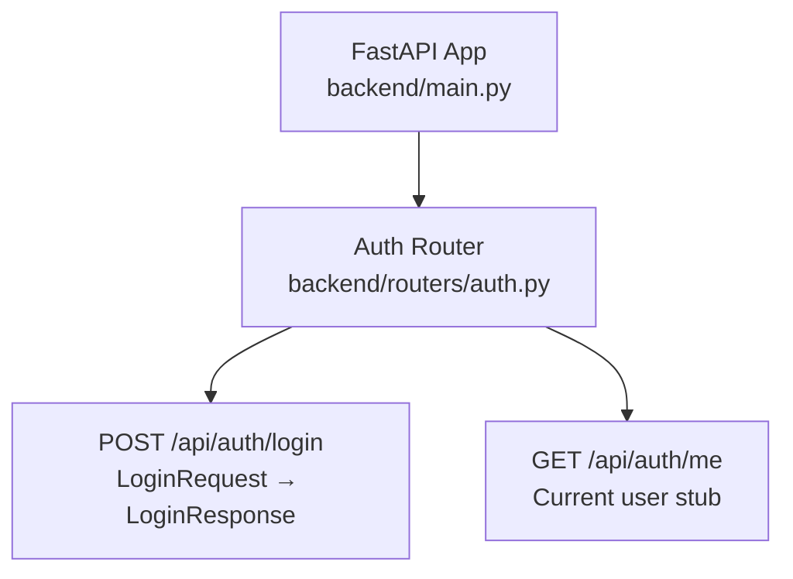
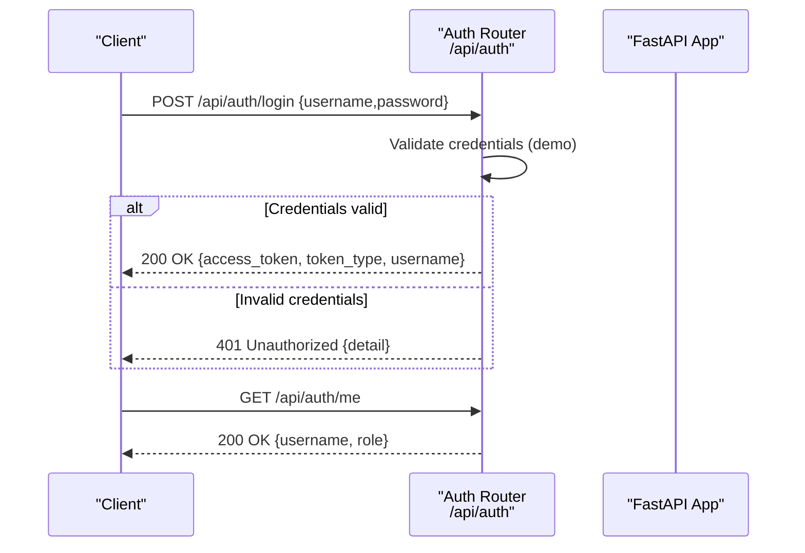
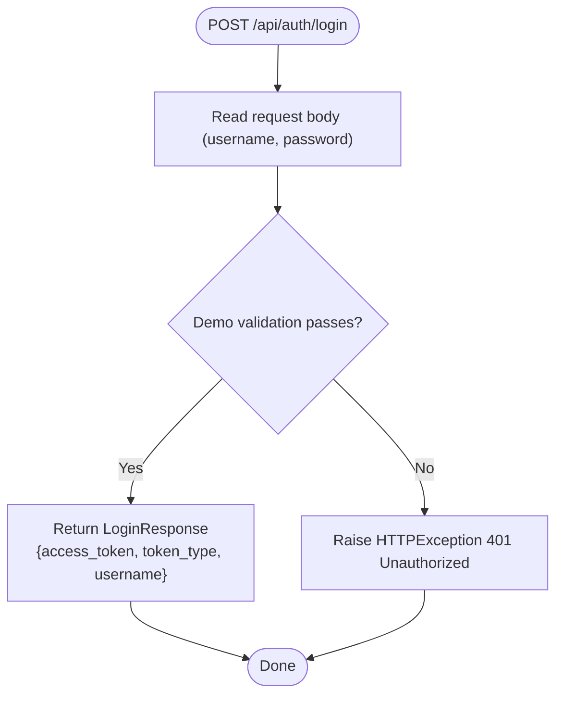
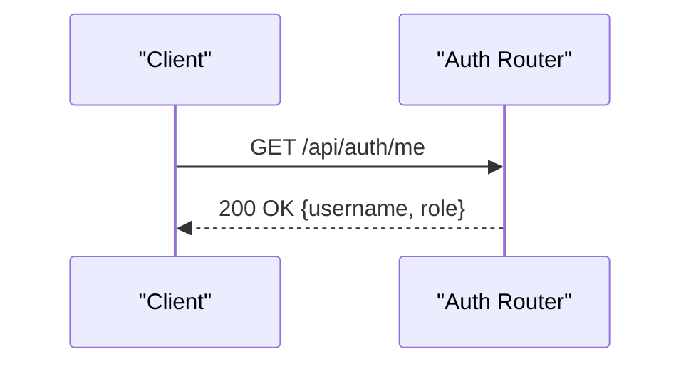
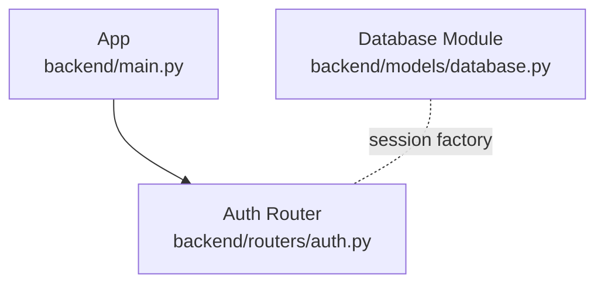

# Authentication API

<cite>
**Referenced Files in This Document**
- [backend/main.py](file://backend/main.py)
- [backend/routers/auth.py](file://backend/routers/auth.py)
- [backend/models/database.py](file://backend/models/database.py)
- [README.md](file://README.md)
</cite>

## Table of Contents
1. [Introduction](#introduction)
2. [Project Structure](#project-structure)
3. [Core Components](#core-components)
4. [Architecture Overview](#architecture-overview)
5. [Detailed Component Analysis](#detailed-component-analysis)
6. [Dependency Analysis](#dependency-analysis)
7. [Performance Considerations](#performance-considerations)
8. [Troubleshooting Guide](#troubleshooting-guide)
9. [Conclusion](#conclusion)
10. [Appendices](#appendices)

## Introduction
This document provides detailed API documentation for the authentication endpoints in the backend service. It covers the login endpoint, token issuance, and user identity retrieval. It also documents request/response schemas, error handling, and outlines the current limitations and migration path to production-grade authentication using JWT tokens and database-backed user validation.

## Project Structure
The authentication endpoints are exposed under the `/api/auth` route prefix and are registered in the main application. The authentication router defines the login and user info endpoints.

**Diagram sources**
- [backend/main.py:39-43](file://backend/main.py#L39-L43)
- [backend/routers/auth.py:18-38](file://backend/routers/auth.py#L18-L38)

**Section sources**
- [backend/main.py:39-43](file://backend/main.py#L39-L43)
- [backend/routers/auth.py:18-38](file://backend/routers/auth.py#L18-L38)
- [README.md:121-122](file://README.md#L121-L122)

## Core Components
- Authentication Router: Defines the `/api/auth` endpoints for login and retrieving the current user.
- Login Endpoint: Validates credentials and returns a bearer token response.
- Current User Endpoint: Returns a stubbed user profile.

Key implementation references:
- Router registration and endpoint definitions: [backend/routers/auth.py:18-38](file://backend/routers/auth.py#L18-L38)
- Application routing and prefixing: [backend/main.py:39-43](file://backend/main.py#L39-L43)

**Section sources**
- [backend/routers/auth.py:18-38](file://backend/routers/auth.py#L18-L38)
- [backend/main.py:39-43](file://backend/main.py#L39-L43)

## Architecture Overview
The authentication flow is a simple demo that validates hardcoded credentials and returns a bearer token. The current user endpoint returns a stubbed user object. The backend does not yet implement token verification or refresh mechanisms.

**Diagram sources**
- [backend/routers/auth.py:18-38](file://backend/routers/auth.py#L18-L38)
- [backend/main.py:39-43](file://backend/main.py#L39-L43)

## Detailed Component Analysis

### Login Endpoint
- Path: `/api/auth/login`
- Method: POST
- Purpose: Authenticate a user and return an access token.
- Request Schema: LoginRequest
  - Fields:
    - username: string
    - password: string
- Response Schema: LoginResponse
  - Fields:
    - access_token: string
    - token_type: string
    - username: string
- Behavior:
  - Demo validation checks for a hardcoded admin/admin pair.
  - On success, returns a bearer token and the username.
  - On failure, raises a 401 Unauthorized error with a detail message.
- Notes:
  - The endpoint includes a comment indicating that real JWT and database validation are pending.

**Diagram sources**
- [backend/routers/auth.py:18-32](file://backend/routers/auth.py#L18-L32)

**Section sources**
- [backend/routers/auth.py:18-32](file://backend/routers/auth.py#L18-L32)

### Current User Endpoint
- Path: `/api/auth/me`
- Method: GET
- Purpose: Return the currently authenticated user’s information.
- Response Schema: object
  - Fields:
    - username: string
    - role: string
- Notes:
  - The endpoint is a stub and does not enforce authentication.

**Diagram sources**
- [backend/routers/auth.py:35-38](file://backend/routers/auth.py#L35-L38)

**Section sources**
- [backend/routers/auth.py:35-38](file://backend/routers/auth.py#L35-L38)

### Token Management and Validation
- Issuance:
  - The login endpoint returns an access token with token_type set to bearer.
  - The returned token is currently a demo string and not a real JWT.
- Validation:
  - No token verification middleware is implemented in the current codebase.
- Expiration:
  - There is no token expiration handling in the current implementation.
- Logout:
  - No logout endpoint exists in the current codebase.

Recommendations for production:
- Implement JWT signing and verification with a secret key.
- Add token expiration and refresh mechanisms.
- Implement logout by maintaining blacklists or short-lived tokens with refresh rotation.

**Section sources**
- [backend/routers/auth.py:20-32](file://backend/routers/auth.py#L20-L32)

### Request/Response Schemas
- LoginRequest
  - username: string
  - password: string
- LoginResponse
  - access_token: string
  - token_type: string
  - username: string
- Current User Response
  - username: string
  - role: string

Note: These schemas are defined in the authentication router module.

**Section sources**
- [backend/routers/auth.py:7-16](file://backend/routers/auth.py#L7-L16)
- [backend/routers/auth.py:35-38](file://backend/routers/auth.py#L35-L38)

### Error Responses
- 401 Unauthorized
  - Triggered when login credentials are invalid.
  - Response includes a detail field describing the failure.
- 404 Not Found
  - Example of related error handling pattern in other routers (not for auth).
  - Demonstrates consistent HTTP semantics across the API.

**Section sources**
- [backend/routers/auth.py:31-32](file://backend/routers/auth.py#L31-L32)

### Security Considerations
- Transport Security:
  - Enforce HTTPS in production to protect tokens in transit.
- Token Storage:
  - Avoid storing tokens in localStorage. Prefer httpOnly cookies for web apps.
- Secret Management:
  - Store the JWT signing secret in environment variables.
- Credential Validation:
  - Replace demo validation with database-backed user lookup and secure password hashing.
- CORS:
  - The application enables broad CORS for SSE compatibility. Review and restrict origins in production.

**Section sources**
- [backend/main.py:18-30](file://backend/main.py#L18-L30)

### Integration Examples
- Client Usage Pattern:
  - Send a POST request to `/api/auth/login` with JSON body containing username and password.
  - On success, store the returned access token securely (e.g., httpOnly cookie).
  - Include the token in subsequent requests using the Authorization header with the Bearer scheme.
- Current User:
  - After login, call GET `/api/auth/me` to retrieve the current user’s profile.

References:
- Endpoint definitions: [backend/routers/auth.py:18-38](file://backend/routers/auth.py#L18-L38)
- API documentation listing: [README.md:121-122](file://README.md#L121-L122)

**Section sources**
- [backend/routers/auth.py:18-38](file://backend/routers/auth.py#L18-L38)
- [README.md:121-122](file://README.md#L121-L122)

## Dependency Analysis
- Router Registration:
  - The auth router is included in the main application with the `/api/auth` prefix.
- Database Model:
  - The database module sets up SQLAlchemy and provides a session factory. While not directly used by the auth endpoints, it supports future user model persistence.

**Diagram sources**
- [backend/main.py:39-43](file://backend/main.py#L39-L43)
- [backend/models/database.py:29-36](file://backend/models/database.py#L29-L36)

**Section sources**
- [backend/main.py:39-43](file://backend/main.py#L39-L43)
- [backend/models/database.py:29-36](file://backend/models/database.py#L29-L36)

## Performance Considerations
- Current Implementation:
  - The login endpoint performs a constant-time comparison and returns immediately.
- Recommendations:
  - Use asynchronous database queries and bcrypt for password hashing.
  - Implement rate limiting to prevent brute-force attacks.
  - Cache frequently accessed user metadata to reduce database load.

[No sources needed since this section provides general guidance]

## Troubleshooting Guide
- Invalid Credentials
  - Symptom: 401 Unauthorized on login.
  - Resolution: Verify username/password match the demo validation criteria or implement proper credential checking.
- Missing or Incorrect Headers
  - Symptom: Unexpected 401 or 403 responses if token-based auth is introduced.
  - Resolution: Ensure Authorization header is present and formatted as Bearer <token>.
- CORS Issues
  - Symptom: Preflight or blocked requests in the browser.
  - Resolution: Confirm allowed origins and credentials settings in the CORS middleware.

**Section sources**
- [backend/routers/auth.py:31-32](file://backend/routers/auth.py#L31-L32)
- [backend/main.py:18-30](file://backend/main.py#L18-L30)

## Conclusion
The authentication endpoints currently provide a demo login flow returning a bearer token and a stubbed current user endpoint. To operate securely and reliably in production, integrate JWT-based authentication, implement robust credential validation, add token expiration and refresh mechanisms, and incorporate logout support. Apply the recommended security practices for token storage and transport.

[No sources needed since this section summarizes without analyzing specific files]

## Appendices

### API Reference Summary
- POST /api/auth/login
  - Request: LoginRequest {username, password}
  - Success: 200 LoginResponse {access_token, token_type, username}
  - Failure: 401 Unauthorized {detail}
- GET /api/auth/me
  - Success: 200 {username, role}

**Section sources**
- [backend/routers/auth.py:18-38](file://backend/routers/auth.py#L18-L38)
- [README.md:121-122](file://README.md#L121-L122)