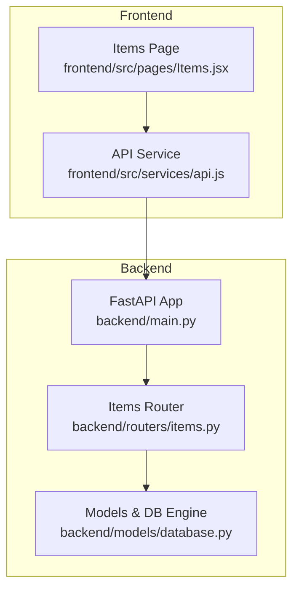
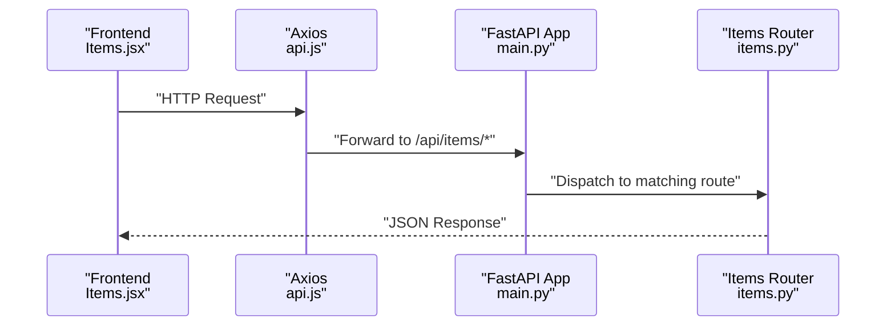
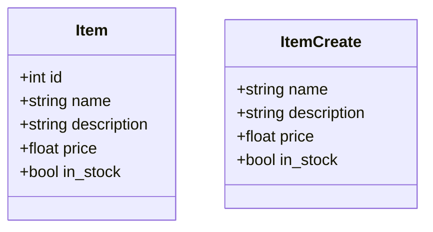
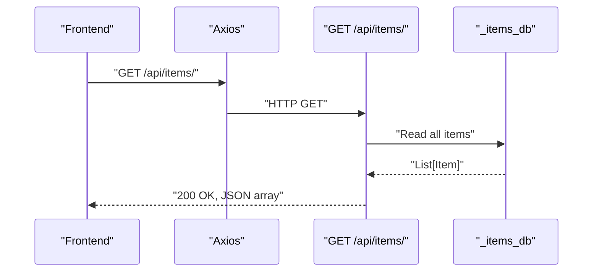
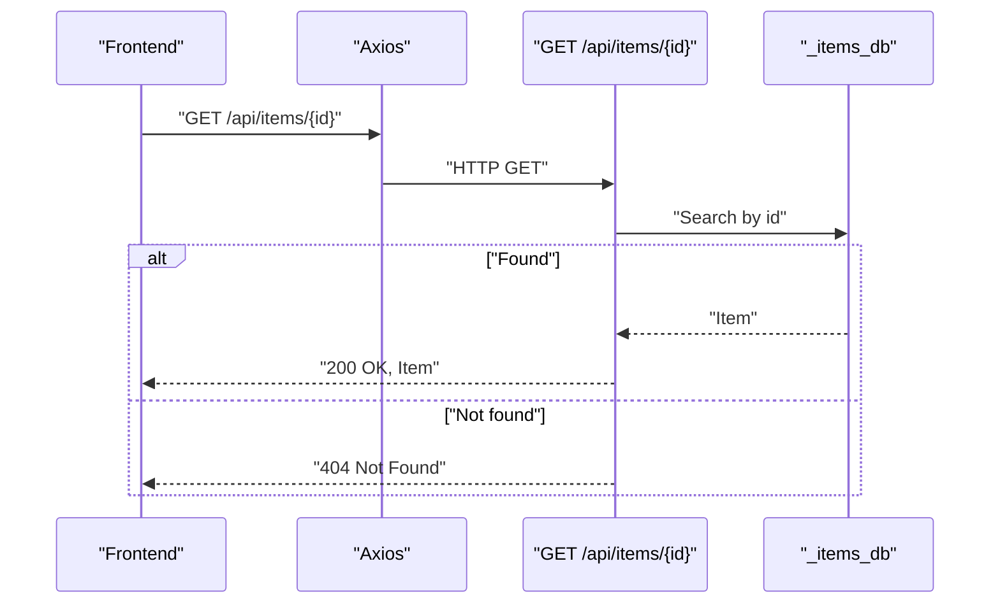
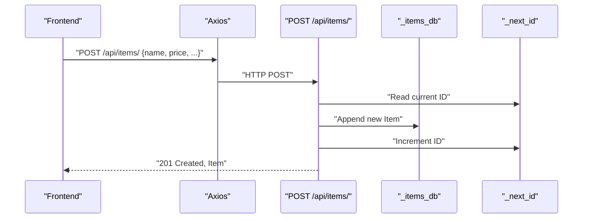
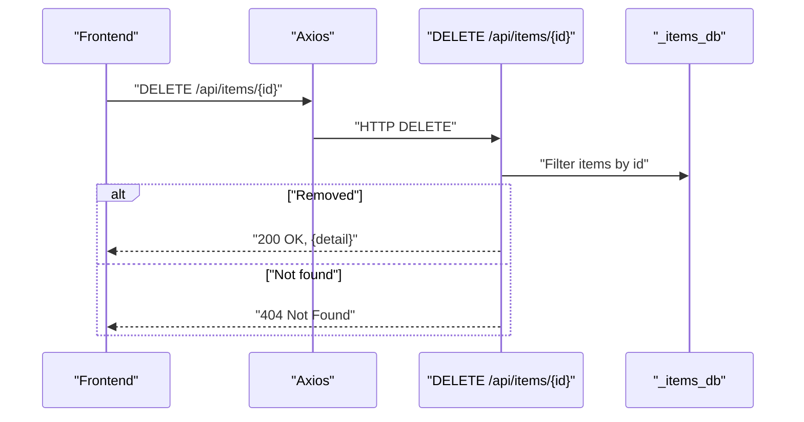
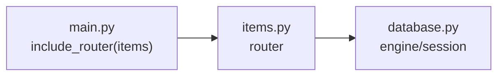

# Items API

<cite>
**Referenced Files in This Document**
- [items.py](file://backend/routers/items.py)
- [main.py](file://backend/main.py)
- [database.py](file://backend/models/database.py)
- [Items.jsx](file://frontend/src/pages/Items.jsx)
- [api.js](file://frontend/src/services/api.js)
- [README.md](file://README.md)
</cite>

## Table of Contents
1. [Introduction](#introduction)
2. [Project Structure](#project-structure)
3. [Core Components](#core-components)
4. [Architecture Overview](#architecture-overview)
5. [Detailed Component Analysis](#detailed-component-analysis)
6. [Dependency Analysis](#dependency-analysis)
7. [Performance Considerations](#performance-considerations)
8. [Troubleshooting Guide](#troubleshooting-guide)
9. [Conclusion](#conclusion)
10. [Appendices](#appendices)

## Introduction
This document describes the Items API, which provides standard CRUD operations for managing items. It covers endpoint definitions, request/response schemas, validation rules, business logic constraints, filtering/searching/sorting capabilities, error handling, and practical curl examples for common tasks. The API is implemented with FastAPI and served under the /api/items base path.

## Project Structure
The Items API is part of a larger full-stack application composed of:
- Backend: FastAPI application with routers and models
- Frontend: React application that consumes the API

Key locations:
- Items endpoints: backend/routers/items.py
- Application wiring: backend/main.py
- Database model and engine: backend/models/database.py
- Frontend consumption: frontend/src/pages/Items.jsx and frontend/src/services/api.js
- API overview and endpoints: README.md

**Diagram sources**
- [main.py:39](file://backend/main.py#L39)
- [items.py:36-71](file://backend/routers/items.py#L36-L71)
- [database.py:29-41](file://backend/models/database.py#L29-L41)
- [Items.jsx:1-124](file://frontend/src/pages/Items.jsx#L1-L124)
- [api.js:1-35](file://frontend/src/services/api.js#L1-L35)

**Section sources**
- [README.md:111-124](file://README.md#L111-L124)
- [main.py:39](file://backend/main.py#L39)

## Core Components
- Items data model
  - Fields: id (integer), name (string), description (optional string), price (float), in_stock (boolean, default true)
  - Validation: enforced by Pydantic schema; price must be numeric; in_stock defaults to true if omitted
- Item creation payload
  - Required fields: name, price
  - Optional fields: description, in_stock (defaults to true)
- In-memory storage
  - Items are stored in a list with auto-incrementing integer IDs
  - Next ID is tracked globally

Endpoints
- GET /api/items/ - List all items
- GET /api/items/{id} - Retrieve a single item by ID
- POST /api/items/ - Create a new item
- DELETE /api/items/{id} - Delete an item by ID

Response behavior
- GET /api/items/ returns a JSON array of items
- GET /api/items/{id} returns a single item object
- POST /api/items/ returns the created item with generated ID
- DELETE /api/items/{id} returns a success message when item is removed

Validation and constraints
- Missing item ID during retrieval or deletion results in HTTP 404 Not Found
- Price must be a positive number; the frontend enforces numeric input and minimum value
- Name and price are required for creation; description is optional

Filtering, searching, and sorting
- No filtering, searching, or sorting parameters are currently supported by the backend
- Sorting follows insertion order (auto-incremented ID order)

Bulk operations
- No bulk create/update/delete endpoints are implemented

**Section sources**
- [items.py:9-21](file://backend/routers/items.py#L9-L21)
- [items.py:26-31](file://backend/routers/items.py#L26-L31)
- [items.py:36-71](file://backend/routers/items.py#L36-L71)
- [Items.jsx:34-37](file://frontend/src/pages/Items.jsx#L34-L37)

## Architecture Overview
The Items API is mounted under /api/items and integrates with the FastAPI application. Requests flow from the frontend through Axios to the backend, which serves responses directly from memory.

**Diagram sources**
- [Items.jsx:16](file://frontend/src/pages/Items.jsx#L16)
- [api.js:3](file://frontend/src/services/api.js#L3)
- [main.py:39](file://backend/main.py#L39)
- [items.py:36-71](file://backend/routers/items.py#L36-L71)

## Detailed Component Analysis

### Data Models

- Item: response model for listing and retrieval
- ItemCreate: request model for creation
- Both enforce field presence and types; optional fields default when omitted

**Diagram sources**
- [items.py:9-21](file://backend/routers/items.py#L9-L21)

**Section sources**
- [items.py:9-21](file://backend/routers/items.py#L9-L21)

### Endpoint Workflows

#### List Items
- Route: GET /api/items/
- Behavior: Returns all items from in-memory storage
- Response: Array of Item objects

**Diagram sources**
- [items.py:36-39](file://backend/routers/items.py#L36-L39)

**Section sources**
- [items.py:36-39](file://backend/routers/items.py#L36-L39)

#### Get Item by ID
- Route: GET /api/items/{id}
- Behavior: Iterates items to find a match by ID
- Response: Single Item object or 404 Not Found

**Diagram sources**
- [items.py:42-49](file://backend/routers/items.py#L42-L49)

**Section sources**
- [items.py:42-49](file://backend/routers/items.py#L42-L49)

#### Create Item
- Route: POST /api/items/
- Behavior: Creates a new item with next available integer ID, appends to storage
- Response: Created Item with assigned ID and 201 Created

**Diagram sources**
- [items.py:52-59](file://backend/routers/items.py#L52-L59)

**Section sources**
- [items.py:52-59](file://backend/routers/items.py#L52-L59)

#### Delete Item
- Route: DELETE /api/items/{id}
- Behavior: Filters out item by ID; returns success if removal occurred
- Response: Success message or 404 Not Found

**Diagram sources**
- [items.py:62-71](file://backend/routers/items.py#L62-L71)

**Section sources**
- [items.py:62-71](file://backend/routers/items.py#L62-L71)

### Filtering, Searching, and Sorting
- Filtering: Not implemented
- Searching: Not implemented
- Sorting: Not implemented
- Current behavior: Returns items in insertion order

**Section sources**
- [items.py:36-39](file://backend/routers/items.py#L36-L39)

### Bulk Operations
- Not implemented

**Section sources**
- [items.py:36-71](file://backend/routers/items.py#L36-L71)

## Dependency Analysis
- Router registration
  - The Items router is included at /api/items with tag "Items"
- Cross-Origin Resource Sharing
  - CORS middleware allows requests from configured origins
- Database integration
  - The items module does not currently use the SQLAlchemy engine; items are stored in memory
  - The database module defines engine and session factory for potential future persistence

**Diagram sources**
- [main.py:39](file://backend/main.py#L39)
- [items.py:1-71](file://backend/routers/items.py#L1-L71)
- [database.py:15-41](file://backend/models/database.py#L15-L41)

**Section sources**
- [main.py:18-30](file://backend/main.py#L18-L30)
- [main.py:39](file://backend/main.py#L39)
- [database.py:15-41](file://backend/models/database.py#L15-L41)

## Performance Considerations
- In-memory storage
  - Retrieval and deletion are O(n) due to linear scans
  - Creation is O(1) amortized append
- Recommendations
  - Replace in-memory list with a persistent database (e.g., PostgreSQL via SQLAlchemy)
  - Add pagination for large collections
  - Implement indexing on ID and other frequently queried fields
  - Add caching for read-heavy workloads

[No sources needed since this section provides general guidance]

## Troubleshooting Guide
Common issues and resolutions:
- 404 Not Found when retrieving or deleting items
  - Cause: Item ID does not exist
  - Resolution: Verify ID exists or refresh item list
- Frontend errors loading items
  - Cause: Backend not running or network issues
  - Resolution: Confirm backend is started locally or deployed service is healthy
- Price validation errors
  - Cause: Non-numeric or negative price
  - Resolution: Ensure price is a positive number with appropriate decimal places

**Section sources**
- [items.py:48-49](file://backend/routers/items.py#L48-L49)
- [items.py:68-70](file://backend/routers/items.py#L68-L70)
- [Items.jsx:18-22](file://frontend/src/pages/Items.jsx#L18-L22)
- [Items.jsx:34-37](file://frontend/src/pages/Items.jsx#L34-L37)

## Conclusion
The Items API provides a minimal but functional CRUD interface for items backed by in-memory storage. It is suitable for development and small-scale usage. For production, integrate a persistent database, add filtering/searching/sorting, and implement bulk operations and pagination.

[No sources needed since this section summarizes without analyzing specific files]

## Appendices

### API Reference

- Base URL
  - Local: http://localhost:8000
  - Frontend proxy: http://localhost:5173 (proxies to backend)

- Endpoints
  - GET /api/items/ - List all items
  - GET /api/items/{id} - Get item by ID
  - POST /api/items/ - Create item
  - DELETE /api/items/{id} - Delete item

- Request/Response Schemas

  - Item (response)
    - id: integer
    - name: string
    - description: string (optional)
    - price: number (float)
    - in_stock: boolean

  - ItemCreate (request)
    - name: string (required)
    - description: string (optional)
    - price: number (float, required)
    - in_stock: boolean (optional, default true)

- Validation Rules
  - Name: required
  - Price: required, numeric, non-negative
  - in_stock: optional, defaults to true
  - ID: auto-generated integer

- Error Codes
  - 404 Not Found: item not found for GET/DELETE by ID

**Section sources**
- [README.md:111-124](file://README.md#L111-L124)
- [items.py:9-21](file://backend/routers/items.py#L9-L21)
- [items.py:36-71](file://backend/routers/items.py#L36-L71)

### Curl Examples

- List items
  - curl -X GET http://localhost:8000/api/items/

- Get item by ID
  - curl -X GET http://localhost:8000/api/items/1

- Create item
  - curl -X POST http://localhost:8000/api/items/ \
    -H "Content-Type: application/json" \
    -d '{"name":"Example","price":29.99,"in_stock":true}'

- Delete item
  - curl -X DELETE http://localhost:8000/api/items/1

**Section sources**
- [README.md:111-124](file://README.md#L111-L124)
- [items.py:52-59](file://backend/routers/items.py#L52-L59)

### Integration Guidelines

- Frontend consumption
  - The frontend page fetches items and submits creation/deletion actions
  - Ensure VITE_API_URL points to the backend base URL
  - Respect required fields (name, price) and numeric constraints

- Backend integration
  - Mount the Items router under /api/items
  - Configure CORS origins appropriately
  - Plan migration to persistent storage for production

**Section sources**
- [Items.jsx:1-124](file://frontend/src/pages/Items.jsx#L1-L124)
- [api.js:3](file://frontend/src/services/api.js#L3)
- [main.py:39](file://backend/main.py#L39)
- [README.md:73-74](file://README.md#L73-L74)