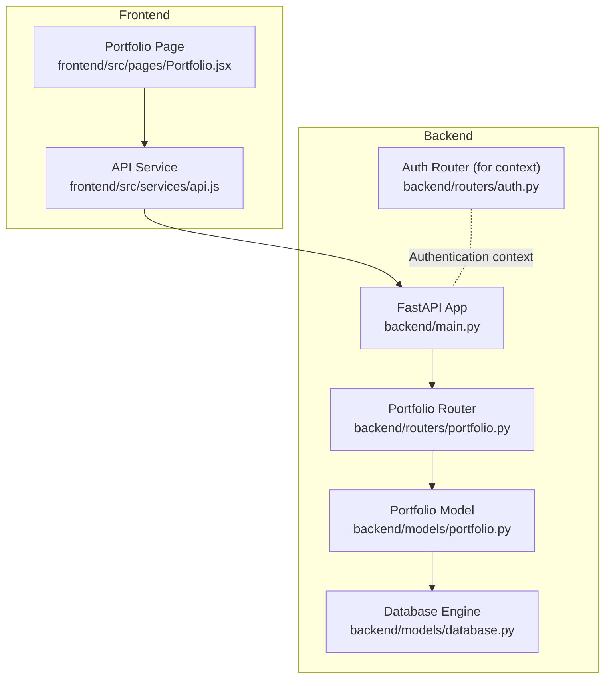
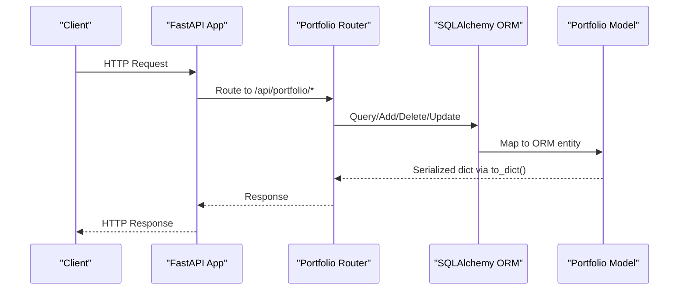
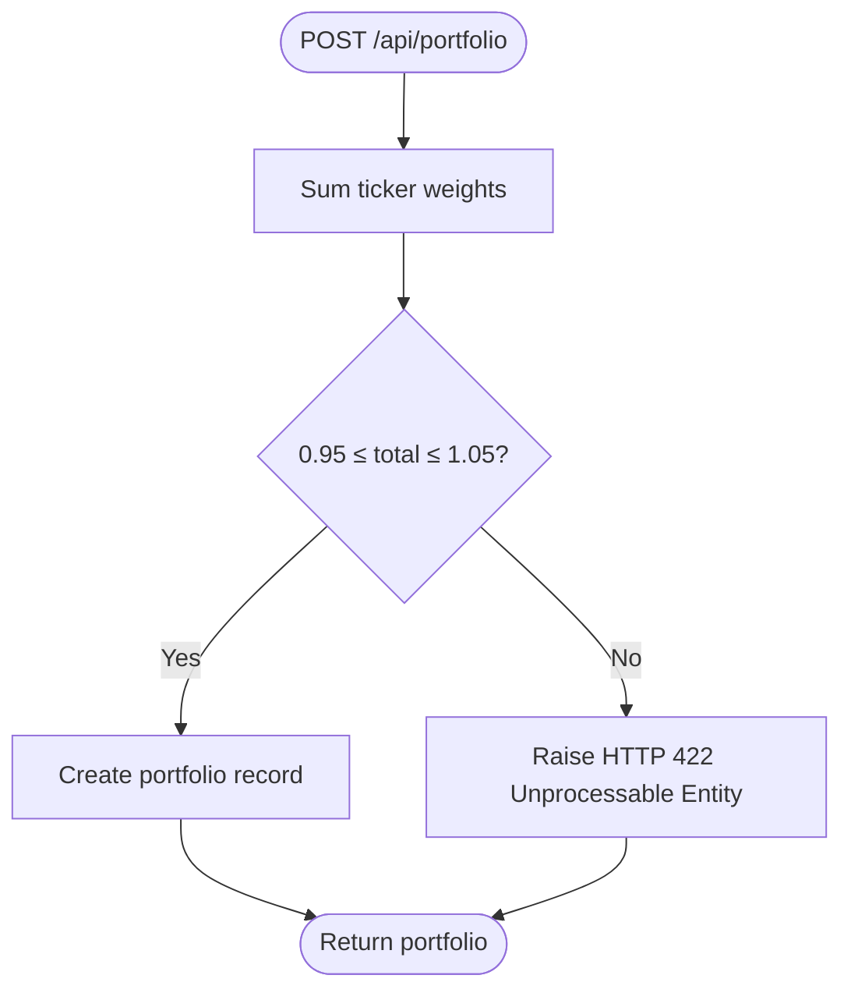
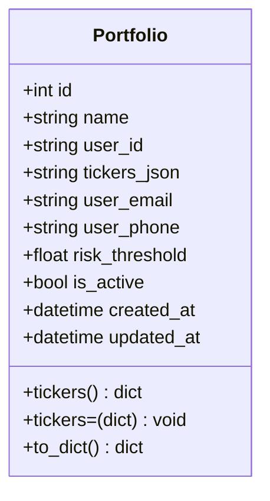
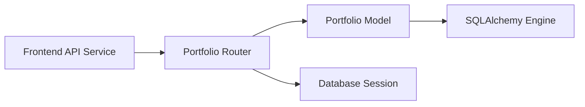

# Portfolio Management API

<cite>
**Referenced Files in This Document**
- [backend/main.py](file://backend/main.py)
- [backend/routers/portfolio.py](file://backend/routers/portfolio.py)
- [backend/models/portfolio.py](file://backend/models/portfolio.py)
- [backend/models/database.py](file://backend/models/database.py)
- [backend/routers/auth.py](file://backend/routers/auth.py)
- [frontend/src/services/api.js](file://frontend/src/services/api.js)
- [frontend/src/pages/Portfolio.jsx](file://frontend/src/pages/Portfolio.jsx)
</cite>

## Table of Contents
1. [Introduction](#introduction)
2. [Project Structure](#project-structure)
3. [Core Components](#core-components)
4. [Architecture Overview](#architecture-overview)
5. [Detailed Component Analysis](#detailed-component-analysis)
6. [Dependency Analysis](#dependency-analysis)
7. [Performance Considerations](#performance-considerations)
8. [Troubleshooting Guide](#troubleshooting-guide)
9. [Conclusion](#conclusion)
10. [Appendices](#appendices)

## Introduction
This document provides comprehensive API documentation for the portfolio management endpoints. It covers all CRUD operations for portfolios, including request/response schemas, validation rules, authentication requirements, error handling, and practical curl examples. It also explains the JSON-based ticker storage format and weight management system.

## Project Structure
The portfolio management API is implemented in a FastAPI backend with SQLAlchemy ORM. The API is mounted under the /api/portfolio route and integrates with a SQLite database by default. The frontend demonstrates usage of the endpoints and includes client-side validation for weights.



**Diagram sources**
- [backend/main.py:12-44](file://backend/main.py#L12-L44)
- [backend/routers/portfolio.py:22-124](file://backend/routers/portfolio.py#L22-L124)
- [backend/models/portfolio.py:16-63](file://backend/models/portfolio.py#L16-L63)
- [backend/models/database.py:15-42](file://backend/models/database.py#L15-L42)
- [backend/routers/auth.py:1-39](file://backend/routers/auth.py#L1-L39)
- [frontend/src/services/api.js:12-18](file://frontend/src/services/api.js#L12-L18)
- [frontend/src/pages/Portfolio.jsx:10-L18]

**Section sources**
- [backend/main.py:12-44](file://backend/main.py#L12-L44)
- [backend/routers/portfolio.py:22-124](file://backend/routers/portfolio.py#L22-L124)
- [backend/models/portfolio.py:16-63](file://backend/models/portfolio.py#L16-L63)
- [backend/models/database.py:15-42](file://backend/models/database.py#L15-L42)
- [frontend/src/services/api.js:12-18](file://frontend/src/services/api.js#L12-L18)
- [frontend/src/pages/Portfolio.jsx:10-L18]

## Core Components
- Portfolio Router: Defines endpoints for listing, creating, retrieving, updating, and deleting portfolios.
- Portfolio Model: ORM model representing portfolios with JSON-based ticker storage and helper methods for serialization/deserialization.
- Database Engine: Configures SQLAlchemy engine and session management, defaults to SQLite.
- Authentication Router: Provides demo login and user info endpoints; useful for understanding authentication context.

Key responsibilities:
- Enforce weight validation during creation.
- Store tickers as JSON in the database.
- Provide consistent response shapes via to_dict().
- Manage database sessions with FastAPI dependency injection.

**Section sources**
- [backend/routers/portfolio.py:27-46](file://backend/routers/portfolio.py#L27-L46)
- [backend/models/portfolio.py:16-63](file://backend/models/portfolio.py#L16-L63)
- [backend/models/database.py:29-36](file://backend/models/database.py#L29-L36)
- [backend/routers/auth.py:18-39](file://backend/routers/auth.py#L18-L39)

## Architecture Overview
The API follows a layered architecture:
- Application Layer: FastAPI app and routers.
- Business Logic Layer: Portfolio router endpoints.
- Persistence Layer: SQLAlchemy ORM mapped to the Portfolio model.
- Data Storage: JSON column for tickers; default SQLite with optional PostgreSQL.



**Diagram sources**
- [backend/main.py:39-43](file://backend/main.py#L39-L43)
- [backend/routers/portfolio.py:50-124](file://backend/routers/portfolio.py#L50-L124)
- [backend/models/portfolio.py:50-63](file://backend/models/portfolio.py#L50-L63)

## Detailed Component Analysis

### Endpoint Definitions and Behavior
- GET /api/portfolio
  - Lists all portfolios ordered by creation date descending.
  - Returns an array of portfolio objects serialized via to_dict().
- POST /api/portfolio
  - Creates a new portfolio.
  - Validates that weights sum approximately to 1.0 (within a small tolerance).
  - Stores tickers as JSON in the tickers_json column.
- GET /api/portfolio/{id}
  - Retrieves a single portfolio by ID.
  - Returns 404 if not found.
- PUT /api/portfolio/{id}
  - Updates an existing portfolio.
  - Allows partial updates to name, tickers, contact info, risk threshold, and activation status.
  - Returns 404 if not found.
- DELETE /api/portfolio/{id}
  - Deletes a portfolio.
  - Returns 404 if not found.

Validation and error handling:
- 404 Not Found: Returned when a portfolio does not exist for GET, PUT, or DELETE.
- 422 Validation Error: Returned when ticker weights do not sum to approximately 1.0 on creation.

Weight validation logic:
- Sums all weights in the tickers dictionary.
- Raises HTTP 422 if the total is outside the acceptable range around 1.0.

JSON-based ticker storage:
- Tickertuple pairs are stored as JSON in the tickers_json column.
- The model exposes a tickers property that serializes/deserializes JSON safely.

Authentication:
- The portfolio endpoints are not protected by authentication middleware in the provided code.
- The demo auth endpoints show how authentication could be integrated.

**Section sources**
- [backend/routers/portfolio.py:50-124](file://backend/routers/portfolio.py#L50-L124)
- [backend/models/portfolio.py:38-48](file://backend/models/portfolio.py#L38-L48)
- [backend/routers/auth.py:18-39](file://backend/routers/auth.py#L18-L39)

### Request/Response Schemas
PortfolioCreate
- Fields:
  - name: string, required, length bounds enforced.
  - tickers: dict of ticker to weight, required, JSON-based storage.
  - user_email: optional string.
  - user_phone: optional string.
  - risk_threshold: float, bounded between 0.0 and 1.0.
- Validation:
  - Weights must sum to approximately 1.0.

PortfolioUpdate
- Fields:
  - name: optional string.
  - tickers: optional dict of ticker to weight.
  - user_email: optional string.
  - user_phone: optional string.
  - risk_threshold: optional float.
  - is_active: optional boolean.

Response shape (common fields):
- id: integer.
- name: string.
- user_id: string.
- tickers: dict of ticker to weight.
- user_email: optional string.
- user_phone: optional string.
- risk_threshold: float.
- is_active: boolean.
- created_at: ISO timestamp.
- updated_at: ISO timestamp.

Notes:
- The frontend demonstrates creating presets and editing tickers with percentage-based input, while the backend expects decimal weights.

**Section sources**
- [backend/routers/portfolio.py:27-46](file://backend/routers/portfolio.py#L27-L46)
- [backend/models/portfolio.py:50-63](file://backend/models/portfolio.py#L50-L63)
- [frontend/src/pages/Portfolio.jsx:13-18](file://frontend/src/pages/Portfolio.jsx#L13-L18)

### Weight Validation Logic
The validation ensures that the total weight equals approximately 1.0. The logic sums the weights and checks whether the total falls within a small tolerance around 1.0.



**Diagram sources**
- [backend/routers/portfolio.py:58-65](file://backend/routers/portfolio.py#L58-L65)

**Section sources**
- [backend/routers/portfolio.py:58-65](file://backend/routers/portfolio.py#L58-L65)

### Database Model and JSON Storage
The Portfolio model defines:
- Primary key id.
- Name, user_id, tickers_json (JSON), user_email, user_phone, risk_threshold, is_active, timestamps.
- Property tickers that converts JSON to a dict and setter that writes JSON.
- Helper to_dict() for consistent serialization.



**Diagram sources**
- [backend/models/portfolio.py:16-63](file://backend/models/portfolio.py#L16-L63)

**Section sources**
- [backend/models/portfolio.py:16-63](file://backend/models/portfolio.py#L16-L63)

### API Usage Patterns (Frontend)
The frontend demonstrates typical usage of the portfolio endpoints:
- Listing portfolios.
- Creating/updating portfolios with a payload containing name, tickers, optional contact info, and risk threshold.
- Deleting portfolios by ID.

These patterns inform the expected request/response shapes and help validate API behavior.

**Section sources**
- [frontend/src/services/api.js:12-18](file://frontend/src/services/api.js#L12-L18)
- [frontend/src/pages/Portfolio.jsx:162-178](file://frontend/src/pages/Portfolio.jsx#L162-L178)

## Dependency Analysis
- Router-to-Model coupling:
  - The portfolio router depends on the Portfolio model for persistence and serialization.
- Router-to-Database coupling:
  - Uses a FastAPI dependency to supply a database session.
- Database configuration:
  - Engine configured via environment variable with SQLite default and optional PostgreSQL support.
- Frontend-to-API coupling:
  - The frontend uses axios to call the portfolio endpoints.



**Diagram sources**
- [backend/routers/portfolio.py:19-20](file://backend/routers/portfolio.py#L19-L20)
- [backend/models/database.py:29-36](file://backend/models/database.py#L29-L36)
- [backend/models/portfolio.py:16-35](file://backend/models/portfolio.py#L16-L35)
- [frontend/src/services/api.js:12-18](file://frontend/src/services/api.js#L12-L18)

**Section sources**
- [backend/routers/portfolio.py:19-20](file://backend/routers/portfolio.py#L19-L20)
- [backend/models/database.py:29-36](file://backend/models/database.py#L29-L36)
- [backend/models/portfolio.py:16-35](file://backend/models/portfolio.py#L16-L35)
- [frontend/src/services/api.js:12-18](file://frontend/src/services/api.js#L12-L18)

## Performance Considerations
- JSON serialization/deserialization overhead is minimal for typical portfolio sizes.
- SQLite is suitable for development and small-scale usage; consider PostgreSQL for production scalability.
- The weight validation is O(n) over the number of tickers and occurs only on creation.

[No sources needed since this section provides general guidance]

## Troubleshooting Guide
Common issues and resolutions:
- 404 Not Found
  - Cause: Accessing a portfolio that does not exist.
  - Resolution: Verify the portfolio ID or list all portfolios to confirm existence.
- 422 Validation Error (Creation)
  - Cause: Ticker weights do not sum to approximately 1.0.
  - Resolution: Adjust weights so their sum falls within the acceptable range around 1.0.
- Database connectivity
  - Cause: Incorrect DATABASE_URL or missing migrations.
  - Resolution: Ensure DATABASE_URL is set and tables are created on startup.

**Section sources**
- [backend/routers/portfolio.py:83-85](file://backend/routers/portfolio.py#L83-L85)
- [backend/routers/portfolio.py:119-121](file://backend/routers/portfolio.py#L119-L121)
- [backend/routers/portfolio.py:61-65](file://backend/routers/portfolio.py#L61-L65)
- [backend/models/database.py:38-42](file://backend/models/database.py#L38-L42)

## Conclusion
The portfolio management API provides a clean, JSON-backed interface for managing investment portfolios with robust validation for weight distributions. The endpoints are straightforward to integrate, and the frontend demonstrates practical usage patterns. For production, consider adding authentication middleware and migrating to PostgreSQL.

[No sources needed since this section summarizes without analyzing specific files]

## Appendices

### API Endpoints Reference

- GET /api/portfolio
  - Description: List all portfolios.
  - Response: Array of portfolio objects.
  - Example curl:
    ```bash
    curl -X GET http://localhost:8000/api/portfolio
    ```

- POST /api/portfolio
  - Description: Create a new portfolio.
  - Request body: PortfolioCreate.
  - Response: Portfolio object.
  - Validation: Weights must sum to approximately 1.0.
  - Example curl:
    ```bash
    curl -X POST http://localhost:8000/api/portfolio \
      -H "Content-Type: application/json" \
      -d '{"name":"Tech Portfolio","tickers":{"AAPL":0.5,"MSFT":0.5},"risk_threshold":0.7}'
    ```

- GET /api/portfolio/{id}
  - Description: Get a single portfolio by ID.
  - Response: Portfolio object.
  - Example curl:
    ```bash
    curl -X GET http://localhost:8000/api/portfolio/1
    ```

- PUT /api/portfolio/{id}
  - Description: Update an existing portfolio.
  - Request body: PortfolioUpdate (partial fields allowed).
  - Response: Portfolio object.
  - Example curl:
    ```bash
    curl -X PUT http://localhost:8000/api/portfolio/1 \
      -H "Content-Type: application/json" \
      -d '{"name":"Updated Name","risk_threshold":0.75}'
    ```

- DELETE /api/portfolio/{id}
  - Description: Delete a portfolio.
  - Response: No content (204).
  - Example curl:
    ```bash
    curl -X DELETE http://localhost:8000/api/portfolio/1
    ```

**Section sources**
- [backend/routers/portfolio.py:50-124](file://backend/routers/portfolio.py#L50-L124)

### Authentication Notes
- The portfolio endpoints are not currently protected by authentication.
- The demo auth endpoints illustrate how to issue tokens and retrieve current user info.

**Section sources**
- [backend/routers/auth.py:18-39](file://backend/routers/auth.py#L18-L39)

### Database Configuration
- Default: SQLite (zero configuration).
- Production: Set DATABASE_URL to a PostgreSQL connection string.
- Tables are created on application startup.

**Section sources**
- [backend/models/database.py:15-18](file://backend/models/database.py#L15-L18)
- [backend/models/database.py:38-42](file://backend/models/database.py#L38-L42)