# Agent Workflow Engine

<cite>
**Referenced Files in This Document**
- [graph.py](file://backend/agent/graph.py)
- [state.py](file://backend/agent/state.py)
- [run_agent.py](file://backend/agent/run_agent.py)
- [calc_risk.py](file://backend/agent/tools/calc_risk.py)
- [fetch_news.py](file://backend/agent/tools/fetch_news.py)
- [get_prices.py](file://backend/agent/tools/get_prices.py)
- [send_alert.py](file://backend/agent/tools/send_alert.py)
- [agent.py](file://backend/routers/agent.py)
- [main.py](file://backend/main.py)
- [database.py](file://backend/models/database.py)
- [portfolio.py](file://backend/models/portfolio.py)
- [alert.py](file://backend/models/alert.py)
- [celery_app.py](file://backend/tasks/celery_app.py)
- [README.md](file://README.md)
</cite>

## Table of Contents
1. [Introduction](#introduction)
2. [Project Structure](#project-structure)
3. [Core Components](#core-components)
4. [Architecture Overview](#architecture-overview)
5. [Detailed Component Analysis](#detailed-component-analysis)
6. [Dependency Analysis](#dependency-analysis)
7. [Performance Considerations](#performance-considerations)
8. [Troubleshooting Guide](#troubleshooting-guide)
9. [Conclusion](#conclusion)
10. [Appendices](#appendices)

## Introduction
This document describes the LangGraph AI agent workflow engine that performs portfolio risk analysis and optional alert delivery. It covers the StateGraph implementation with a four-node workflow, the AgentState TypedDict data model, tool implementations for risk calculation, news fetching, price retrieval, and alert dispatch, the standalone agent runner for local testing, the agent execution lifecycle, examples of state transitions and tool invocations, error handling strategies, performance and scalability considerations, and debugging/logging techniques.

## Project Structure
The backend is organized around a FastAPI application with routers, SQLAlchemy models, and an agent subsystem built on LangGraph. The agent module defines the state schema and the workflow graph, while tools encapsulate external integrations. Routers expose endpoints for streaming and synchronous runs, and Celery powers scheduled runs.

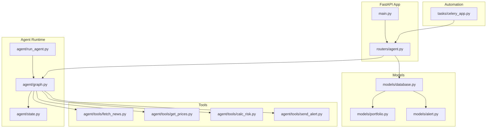

**Diagram sources**
- [main.py:12-59](file://backend/main.py#L12-L59)
- [agent.py:39-243](file://backend/routers/agent.py#L39-L243)
- [graph.py:162-204](file://backend/agent/graph.py#L162-L204)
- [state.py:28-58](file://backend/agent/state.py#L28-L58)
- [run_agent.py:46-93](file://backend/agent/run_agent.py#L46-L93)
- [fetch_news.py:98-164](file://backend/agent/tools/fetch_news.py#L98-L164)
- [get_prices.py:84-139](file://backend/agent/tools/get_prices.py#L84-L139)
- [calc_risk.py:149-255](file://backend/agent/tools/calc_risk.py#L149-L255)
- [send_alert.py:157-231](file://backend/agent/tools/send_alert.py#L157-L231)
- [database.py:29-42](file://backend/models/database.py#L29-L42)
- [portfolio.py:16-63](file://backend/models/portfolio.py#L16-L63)
- [alert.py:14-77](file://backend/models/alert.py#L14-L77)
- [celery_app.py:57-128](file://backend/tasks/celery_app.py#L57-L128)

**Section sources**
- [README.md:1-129](file://README.md#L1-L129)
- [main.py:12-59](file://backend/main.py#L12-L59)

## Core Components
- StateGraph and Nodes: The workflow is a linear chain of four nodes plus a conditional branch after risk calculation, yielding state deltas suitable for SSE streaming.
- AgentState TypedDict: A comprehensive schema capturing portfolio holdings, market data, risk metrics, decision flags, RAG context, reasoning logs, and errors.
- Tools: Independent, pluggable functions implementing news sentiment, price history retrieval, risk scoring, and alert dispatch with robust fallbacks.
- Router and Endpoints: SSE streaming and synchronous run endpoints integrate the agent with the UI and persist results to the database.
- Scheduled Execution: Celery orchestrates daily automated runs across all active portfolios.

**Section sources**
- [graph.py:45-142](file://backend/agent/graph.py#L45-L142)
- [state.py:28-58](file://backend/agent/state.py#L28-L58)
- [agent.py:39-243](file://backend/routers/agent.py#L39-L243)
- [celery_app.py:57-128](file://backend/tasks/celery_app.py#L57-L128)

## Architecture Overview
The agent runtime composes a StateGraph with deterministic nodes and a conditional edge. The graph is compiled once and reused for both streaming and synchronous execution. Tools are LangGraph-compatible functions that return partial state updates. The router exposes endpoints that drive the graph and persist outcomes.

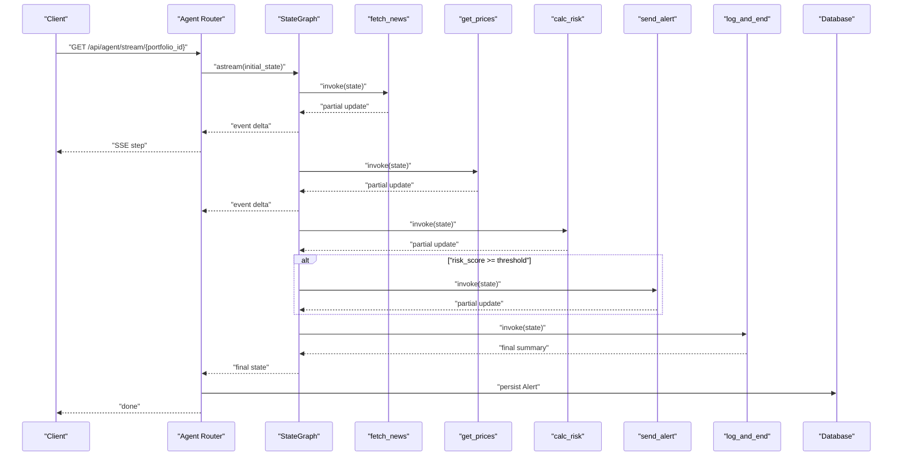

**Diagram sources**
- [agent.py:39-168](file://backend/routers/agent.py#L39-L168)
- [graph.py:162-204](file://backend/agent/graph.py#L162-L204)
- [graph.py:45-142](file://backend/agent/graph.py#L45-L142)
- [alert.py:14-77](file://backend/models/alert.py#L14-L77)

## Detailed Component Analysis

### StateGraph and Four-Node Workflow
- Nodes:
  - fetch_news: Retrieves headlines and computes average sentiment; enriches state with news_items and avg_sentiment.
  - get_prices: Downloads 1-year price history and daily returns; enriches state with price_data and daily_returns.
  - calc_risk: Computes Sharpe, Sortino, volatility, and max drawdown; builds composite risk_score and risk_level; prepares alert_message.
  - send_alert: Conditionally sends email/SMS when risk is high; logs steps and errors.
  - log_and_end: Finalizes run with summary logs.
- Conditional Edge:
  - After calc_risk, routes to send_alert if risk_score meets threshold; otherwise to log_and_end.
- Compilation:
  - The graph is compiled once and supports invoke and astream for sync and streaming respectively.

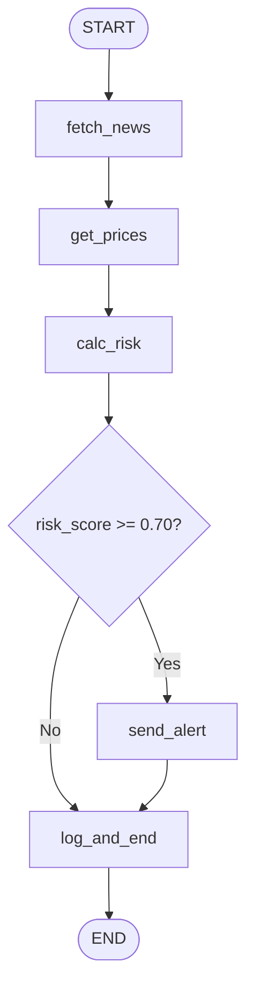

**Diagram sources**
- [graph.py:146-156](file://backend/agent/graph.py#L146-L156)
- [graph.py:174-198](file://backend/agent/graph.py#L174-L198)

**Section sources**
- [graph.py:45-142](file://backend/agent/graph.py#L45-L142)
- [graph.py:162-204](file://backend/agent/graph.py#L162-L204)

### AgentState TypedDict
AgentState is a TypedDict that flows through all nodes. It includes:
- Inputs: portfolio, portfolio_id, user_email, user_phone.
- News: news_items, avg_sentiment.
- Prices: price_data, daily_returns.
- Risk: risk_metrics, risk_score, risk_level.
- Decision: should_alert, alert_message.
- Context/RAG: rag_context.
- Audit: reasoning_steps, errors.

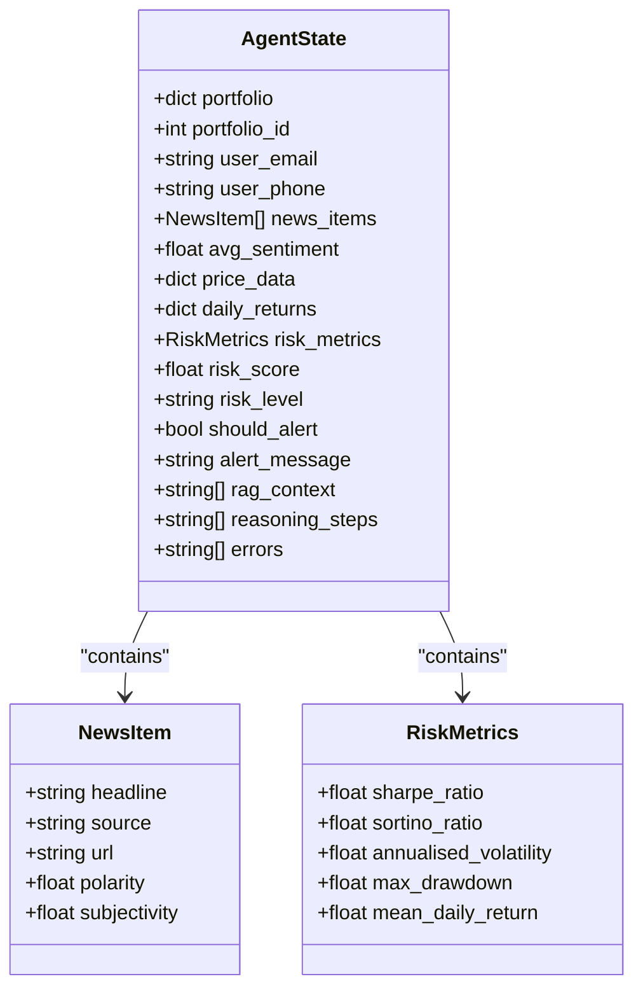

**Diagram sources**
- [state.py:28-58](file://backend/agent/state.py#L28-L58)
- [state.py:12-26](file://backend/agent/state.py#L12-L26)

**Section sources**
- [state.py:28-58](file://backend/agent/state.py#L28-L58)

### Tool Implementations

#### fetch_news
- Purpose: Retrieve recent financial news for portfolio tickers and compute average sentiment.
- Modes:
  - Real: Uses NewsAPI if available and configured.
  - Mock: Generates synthetic headlines when API key is absent.
- Outputs: news_items, avg_sentiment, reasoning_steps, errors.

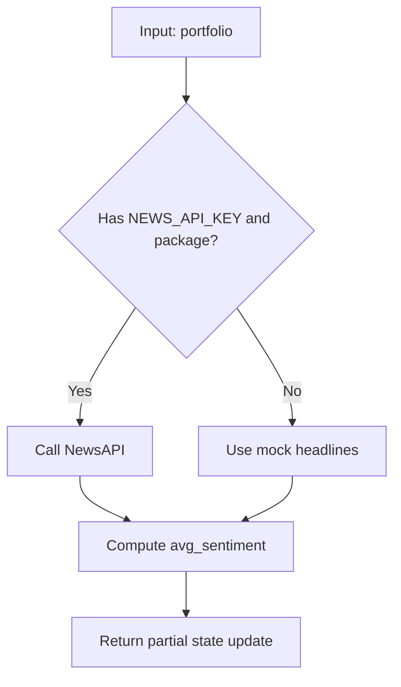

**Diagram sources**
- [fetch_news.py:98-164](file://backend/agent/tools/fetch_news.py#L98-L164)

**Section sources**
- [fetch_news.py:98-164](file://backend/agent/tools/fetch_news.py#L98-L164)

#### get_prices
- Purpose: Download 1-year daily close prices and compute daily returns.
- Modes:
  - Real: Uses yfinance if available.
  - Mock: Synthesizes prices via geometric Brownian motion when disabled or failing.
- Outputs: price_data, daily_returns, reasoning_steps, errors.

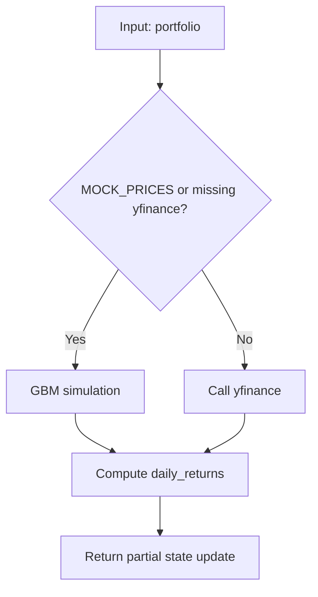

**Diagram sources**
- [get_prices.py:84-139](file://backend/agent/tools/get_prices.py#L84-L139)

**Section sources**
- [get_prices.py:84-139](file://backend/agent/tools/get_prices.py#L84-L139)

#### calc_risk
- Purpose: Compute portfolio-level risk metrics and a composite risk_score.
- Metrics: Sharpe, Sortino, annualized volatility, max drawdown, mean daily return.
- Logic: Builds risk_score from multiple signals and thresholds; sets risk_level and should_alert.
- Outputs: risk_metrics, risk_score, risk_level, should_alert, alert_message, reasoning_steps, errors.

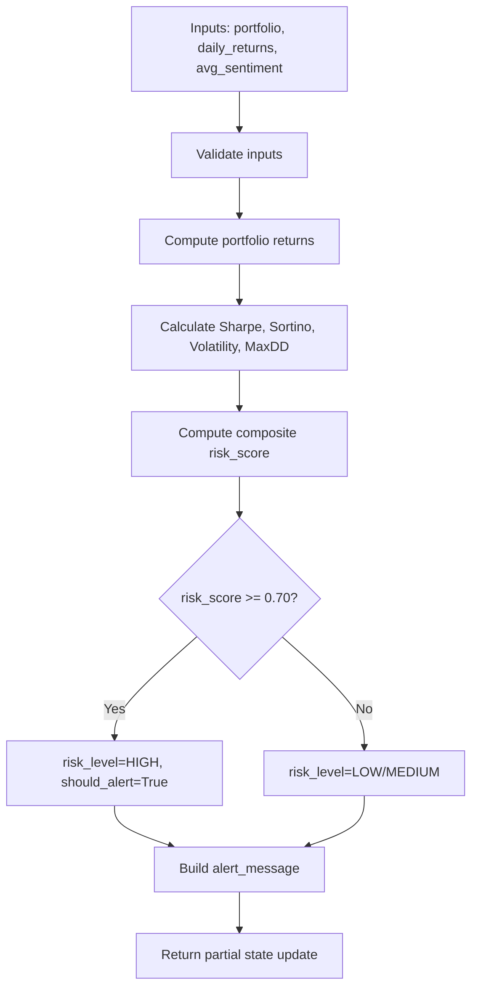

**Diagram sources**
- [calc_risk.py:149-255](file://backend/agent/tools/calc_risk.py#L149-L255)

**Section sources**
- [calc_risk.py:149-255](file://backend/agent/tools/calc_risk.py#L149-L255)

#### send_alert
- Purpose: Dispatch email/SMS alerts when risk is high.
- Channels:
  - Email: SendGrid if configured; logs to console in mock mode.
  - SMS: Twilio if configured; skipped for non-high risk.
- Outputs: reasoning_steps, errors.

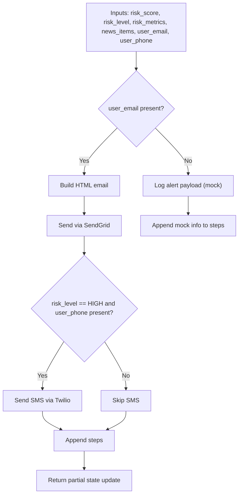

**Diagram sources**
- [send_alert.py:157-231](file://backend/agent/tools/send_alert.py#L157-L231)

**Section sources**
- [send_alert.py:157-231](file://backend/agent/tools/send_alert.py#L157-L231)

### Standalone Agent Runner
- Purpose: Test and develop the agent outside the API.
- Behavior: Creates initial state, streams node-by-node updates, prints reasoning steps and errors, and summarizes risk results.

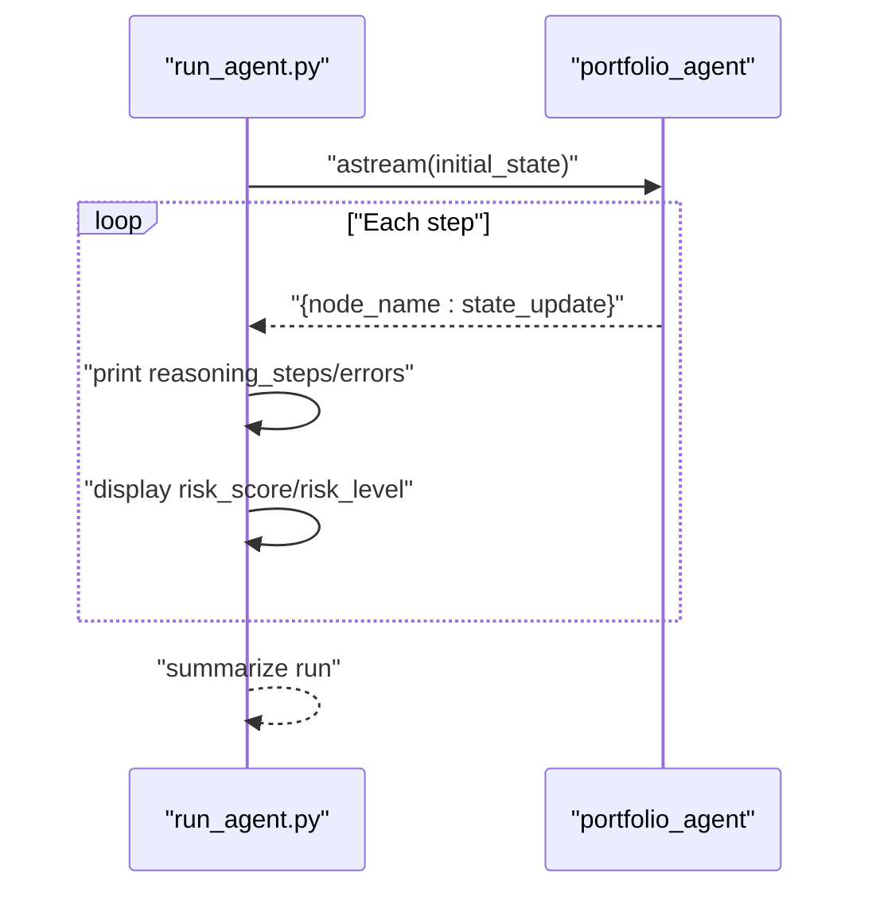

**Diagram sources**
- [run_agent.py:46-93](file://backend/agent/run_agent.py#L46-L93)
- [graph.py:202-243](file://backend/agent/graph.py#L202-L243)

**Section sources**
- [run_agent.py:46-93](file://backend/agent/run_agent.py#L46-L93)

### Agent Execution Lifecycle
- Initialization: make_initial_state constructs a clean AgentState with portfolio metadata and empty data fields.
- Execution:
  - fetch_news → get_prices → calc_risk (linear).
  - Conditional: calc_risk → send_alert (high risk) or log_and_end (otherwise).
- Persistence: Router persists Alert records with risk metrics, reasoning logs, and errors.

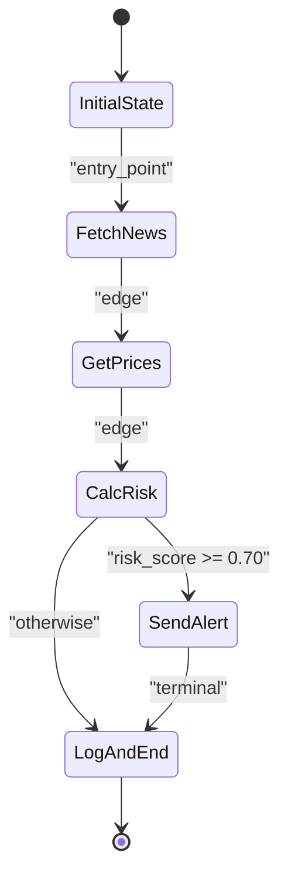

**Diagram sources**
- [graph.py:210-243](file://backend/agent/graph.py#L210-L243)
- [graph.py:174-198](file://backend/agent/graph.py#L174-L198)

**Section sources**
- [graph.py:210-243](file://backend/agent/graph.py#L210-L243)
- [agent.py:186-232](file://backend/routers/agent.py#L186-L232)

## Dependency Analysis
- Internal Dependencies:
  - graph.py depends on state.py and tools modules.
  - routers/agent.py depends on graph.py and models.
  - Celery task depends on graph.py and models.
- External Dependencies:
  - Tools depend on third-party packages (NewsAPI, yfinance, SendGrid, Twilio) with graceful fallbacks.
  - Database uses SQLAlchemy with configurable engine.

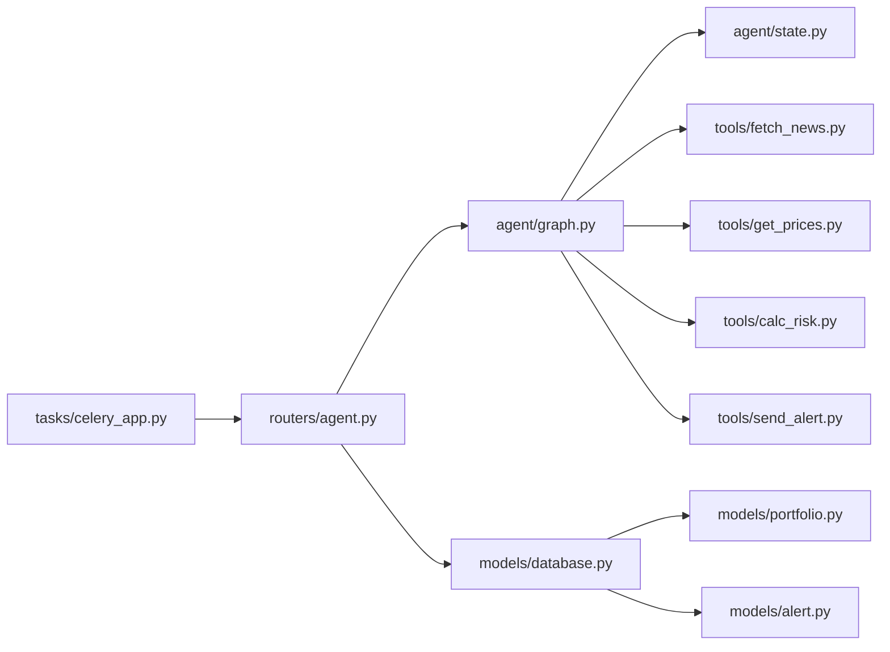

**Diagram sources**
- [agent.py:24-25](file://backend/routers/agent.py#L24-L25)
- [graph.py:28-32](file://backend/agent/graph.py#L28-L32)
- [database.py:38-42](file://backend/models/database.py#L38-L42)

**Section sources**
- [graph.py:28-32](file://backend/agent/graph.py#L28-L32)
- [agent.py:24-25](file://backend/routers/agent.py#L24-L25)
- [celery_app.py:68-68](file://backend/tasks/celery_app.py#L68-L68)

## Performance Considerations
- Concurrency:
  - Use separate Celery workers behind Redis for parallelized daily runs across portfolios.
  - Router’s SSE streaming is async-friendly; ensure Nginx/X-Accel-Buffering headers are configured for production.
- Memory Management:
  - Tools compute arrays and NumPy arrays; avoid retaining unnecessary intermediate structures beyond the minimal needed for the next node.
  - Consider chunking long reasoning_logs and limiting retained news items if scaling to many concurrent runs.
- Scalability Patterns:
  - Offload DB writes to thread pool executors in streaming route to keep the event loop responsive.
  - Use Redis-backed Celery for horizontal scaling; tune concurrency and queues per workload.
- Network Resilience:
  - Tools already include fallbacks (mock data) to prevent stalls; ensure timeouts and retries are tuned for external APIs.

[No sources needed since this section provides general guidance]

## Troubleshooting Guide
- Logging and Tracing:
  - Tools append reasoning_steps and collect errors; inspect these lists to diagnose failures.
  - Router logs exceptions and emits error events over SSE.
- Common Issues:
  - Missing API keys: Tools fall back to mock modes; verify environment variables and package availability.
  - DB connectivity: Ensure DATABASE_URL is set and tables are created on startup.
  - SSE disconnects: Router detects client disconnection and stops streaming gracefully.
- Debugging Techniques:
  - Use the standalone runner to reproduce runs locally with verbose reasoning logs.
  - Inspect Alert records for persisted reasoning logs and errors.
  - Enable Celery worker logs for scheduled runs.

**Section sources**
- [run_agent.py:68-84](file://backend/agent/run_agent.py#L68-L84)
- [agent.py:123-127](file://backend/routers/agent.py#L123-L127)
- [database.py:38-42](file://backend/models/database.py#L38-L42)
- [celery_app.py:113-124](file://backend/tasks/celery_app.py#L113-L124)

## Conclusion
The LangGraph agent workflow engine provides a modular, testable, and scalable solution for portfolio risk analysis. Its four-node pipeline with a deterministic conditional edge, typed state schema, and robust tool implementations enables reliable streaming and batch execution. With SSE endpoints, scheduled automation, and comprehensive persistence, it integrates cleanly into both interactive dashboards and automated monitoring systems.

[No sources needed since this section summarizes without analyzing specific files]

## Appendices

### API Endpoints
- GET /api/agent/stream/{portfolio_id}: Server-Sent Events stream of reasoning steps, risk updates, alert triggers, and errors; persists results on completion.
- POST /api/agent/run/{portfolio_id}: Synchronous run returning a JSON summary and persisting results.
- GET /api/agent/status: Health check for the agent service.

**Section sources**
- [agent.py:39-243](file://backend/routers/agent.py#L39-L243)

### Example State Transitions and Tool Invocations
- Transition: fetch_news adds news_items and avg_sentiment; get_prices adds price_data and daily_returns; calc_risk adds risk_metrics, risk_score, risk_level, should_alert, and alert_message; conditional branch routes to send_alert or log_and_end; log_and_end finalizes reasoning_steps.
- Tool Invocation Examples:
  - fetch_news invoked with portfolio dict.
  - get_prices invoked with portfolio dict.
  - calc_risk invoked with portfolio, daily_returns, avg_sentiment.
  - send_alert invoked with portfolio, risk_score, risk_level, risk_metrics, news_items, alert_message, user_email, user_phone.

**Section sources**
- [graph.py:45-142](file://backend/agent/graph.py#L45-L142)
- [fetch_news.py:98-164](file://backend/agent/tools/fetch_news.py#L98-L164)
- [get_prices.py:84-139](file://backend/agent/tools/get_prices.py#L84-L139)
- [calc_risk.py:149-255](file://backend/agent/tools/calc_risk.py#L149-L255)
- [send_alert.py:157-231](file://backend/agent/tools/send_alert.py#L157-L231)