# Execution Control

<cite>
**Referenced Files in This Document**
- [graph.py](file://backend/agent/graph.py)
- [state.py](file://backend/agent/state.py)
- [run_agent.py](file://backend/agent/run_agent.py)
- [calc_risk.py](file://backend/agent/tools/calc_risk.py)
- [send_alert.py](file://backend/agent/tools/send_alert.py)
- [fetch_news.py](file://backend/agent/tools/fetch_news.py)
- [get_prices.py](file://backend/agent/tools/get_prices.py)
- [agent.py](file://backend/routers/agent.py)
- [main.py](file://backend/main.py)
- [alert.py](file://backend/models/alert.py)
- [portfolio.py](file://backend/models/portfolio.py)
- [database.py](file://backend/models/database.py)
- [sse.js](file://frontend/src/services/sse.js)
- [AgentFeed.jsx](file://frontend/src/components/AgentFeed.jsx)
</cite>

## Table of Contents
1. [Introduction](#introduction)
2. [Project Structure](#project-structure)
3. [Core Components](#core-components)
4. [Architecture Overview](#architecture-overview)
5. [Detailed Component Analysis](#detailed-component-analysis)
6. [Dependency Analysis](#dependency-analysis)
7. [Performance Considerations](#performance-considerations)
8. [Troubleshooting Guide](#troubleshooting-guide)
9. [Conclusion](#conclusion)
10. [Appendices](#appendices)

## Introduction
This document explains agent execution control and workflow orchestration for a LangGraph-based portfolio risk analysis agent. It covers the StateGraph assembly process, node registration, edge definitions, and conditional routing logic. It details the four-node workflow architecture with linear processing and conditional branching, the conditional edge implementation using a deterministic risk threshold, and the graph compilation process supporting synchronous invocation and asynchronous streaming. It also documents the standalone agent runner for testing and development, including command-line interface and debugging capabilities, and provides examples of agent execution, state delta streaming for SSE, and error handling strategies. Finally, it addresses performance optimization, memory management, and scalability considerations for concurrent agent executions.

## Project Structure
The execution control system spans backend orchestration, tooling, API endpoints, and frontend streaming. The backend is organized into:
- Agent runtime: StateGraph assembly, state typing, and standalone runner
- Tools: Data ingestion and analytics (news, prices, risk calculation, alert dispatch)
- API: SSE streaming and synchronous execution endpoints
- Models: Database schema for portfolios and alerts
- Frontend: SSE client and UI feed component

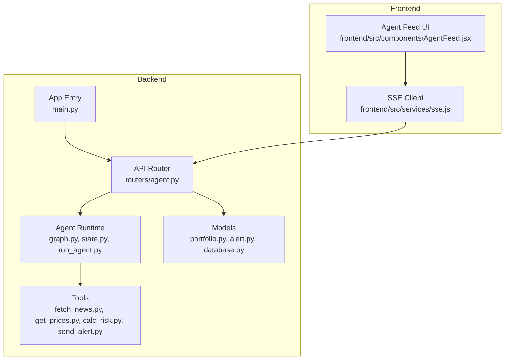

**Diagram sources**
- [graph.py:162-203](file://backend/agent/graph.py#L162-L203)
- [agent.py:39-168](file://backend/routers/agent.py#L39-L168)
- [main.py:38-44](file://backend/main.py#L38-L44)
- [sse.js:21-62](file://frontend/src/services/sse.js#L21-L62)
- [AgentFeed.jsx:28-77](file://frontend/src/components/AgentFeed.jsx#L28-L77)

**Section sources**
- [main.py:12-59](file://backend/main.py#L12-L59)
- [agent.py:1-243](file://backend/routers/agent.py#L1-243)
- [graph.py:162-203](file://backend/agent/graph.py#L162-L203)

## Core Components
- StateGraph assembly and compilation: Defines nodes, edges, and conditional routing; exposes compiled graph for synchronous and streaming execution.
- Typed state: AgentState defines the shared state structure flowing through nodes.
- Toolset: Four tools implement the four-node workflow and alert dispatch.
- API endpoints: SSE streaming and synchronous execution with persistence.
- Standalone runner: CLI-driven execution for testing and development.
- Frontend SSE client: Real-time rendering of agent reasoning and risk metrics.

**Section sources**
- [graph.py:162-203](file://backend/agent/graph.py#L162-L203)
- [state.py:28-58](file://backend/agent/state.py#L28-L58)
- [agent.py:39-168](file://backend/routers/agent.py#L39-L168)
- [run_agent.py:46-93](file://backend/agent/run_agent.py#L46-L93)

## Architecture Overview
The agent follows a deterministic, four-node linear workflow with a conditional branch after risk computation:
- fetch_news → get_prices → calc_risk → [conditional edge] → send_alert → log_and_end
- Conditional edge: if risk_score ≥ threshold, route to send_alert; otherwise route to log_and_end
- Both paths converge to log_and_end and terminate

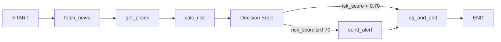

**Diagram sources**
- [graph.py:173-199](file://backend/agent/graph.py#L173-L199)
- [graph.py:146-155](file://backend/agent/graph.py#L146-L155)

**Section sources**
- [graph.py:6-20](file://backend/agent/graph.py#L6-L20)
- [graph.py:146-155](file://backend/agent/graph.py#L146-L155)

## Detailed Component Analysis

### StateGraph Assembly and Compilation
- Nodes registered: fetch_news, get_prices, calc_risk, send_alert, log_and_end
- Edges:
  - Linear: fetch_news → get_prices → calc_risk
  - Conditional: calc_risk → send_alert or log_and_end based on risk threshold
  - Terminal: send_alert → log_and_end → END
- Compilation: Returns a compiled StateGraph supporting synchronous invoke and streaming astream
- Initial state factory: make_initial_state constructs a clean AgentState with defaults

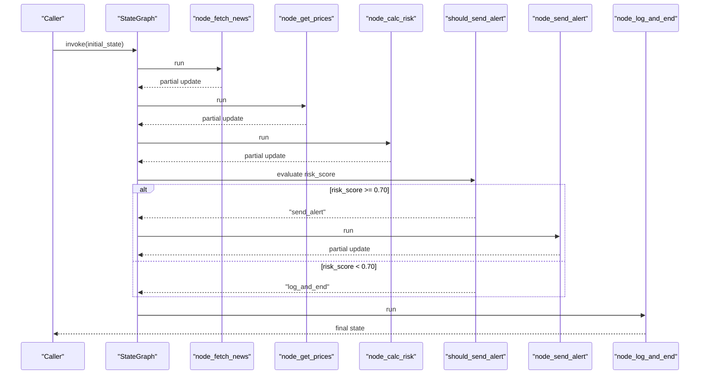

**Diagram sources**
- [graph.py:162-203](file://backend/agent/graph.py#L162-L203)
- [graph.py:45-140](file://backend/agent/graph.py#L45-L140)
- [graph.py:146-155](file://backend/agent/graph.py#L146-L155)

**Section sources**
- [graph.py:162-203](file://backend/agent/graph.py#L162-L203)
- [graph.py:210-242](file://backend/agent/graph.py#L210-L242)

### Conditional Routing Logic
- Deterministic decision: should_send_alert compares risk_score against a fixed threshold
- Threshold: HIGH_RISK_THRESHOLD = 0.70
- Routes:
  - Yes: send_alert
  - No: log_and_end
- Risk computation integrates sentiment into composite risk score, enabling the decision

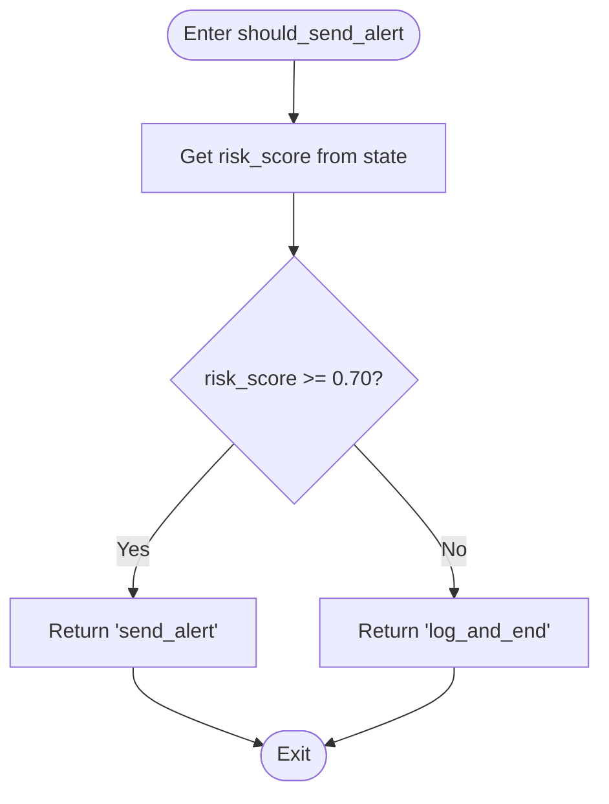

**Diagram sources**
- [graph.py:146-155](file://backend/agent/graph.py#L146-L155)
- [calc_risk.py:222-229](file://backend/agent/tools/calc_risk.py#L222-L229)

**Section sources**
- [graph.py:146-155](file://backend/agent/graph.py#L146-L155)
- [calc_risk.py:50-53](file://backend/agent/tools/calc_risk.py#L50-L53)

### Node Functions and State Updates
- fetch_news: Retrieves headlines, computes average sentiment, appends reasoning steps and errors
- get_prices: Downloads 1-year price history, computes daily returns, appends reasoning steps and errors
- calc_risk: Computes Sharpe, Sortino, volatility, max drawdown, builds composite risk_score, sets risk_level and should_alert, and prepares alert_message
- send_alert: Sends email/SMS when risk level is HIGH, logs steps and errors; operates in mock mode when credentials are missing
- log_and_end: Summarizes run and appends final reasoning steps

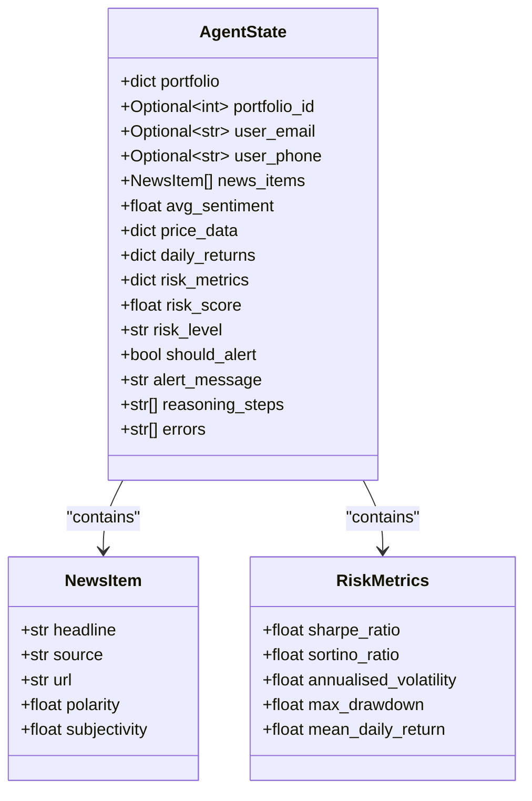

**Diagram sources**
- [state.py:28-58](file://backend/agent/state.py#L28-L58)

**Section sources**
- [graph.py:45-140](file://backend/agent/graph.py#L45-L140)
- [state.py:28-58](file://backend/agent/state.py#L28-L58)

### Tool Implementations
- fetch_news: Uses NewsAPI or mock headlines; computes avg_sentiment; logs reasoning and errors
- get_prices: Uses yfinance or synthetic data; computes daily_returns; logs reasoning and errors
- calc_risk: Computes portfolio returns, ratios, and composite risk score; determines risk_level and should_alert; integrates avg_sentiment
- send_alert: Builds rich HTML email and SMS body; sends via SendGrid/Twilio or logs in mock mode; records steps and errors

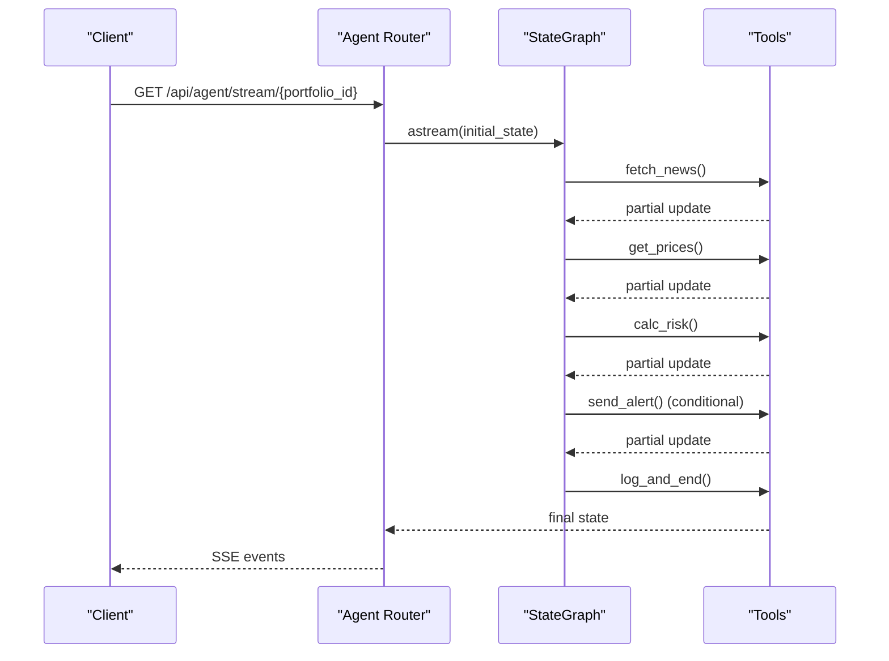

**Diagram sources**
- [agent.py:39-168](file://backend/routers/agent.py#L39-L168)
- [graph.py:162-203](file://backend/agent/graph.py#L162-L203)
- [fetch_news.py:98-164](file://backend/agent/tools/fetch_news.py#L98-L164)
- [get_prices.py:84-139](file://backend/agent/tools/get_prices.py#L84-L139)
- [calc_risk.py:149-255](file://backend/agent/tools/calc_risk.py#L149-L255)
- [send_alert.py:157-231](file://backend/agent/tools/send_alert.py#L157-L231)

**Section sources**
- [fetch_news.py:98-164](file://backend/agent/tools/fetch_news.py#L98-L164)
- [get_prices.py:84-139](file://backend/agent/tools/get_prices.py#L84-L139)
- [calc_risk.py:149-255](file://backend/agent/tools/calc_risk.py#L149-L255)
- [send_alert.py:157-231](file://backend/agent/tools/send_alert.py#L157-L231)

### API Endpoints and SSE Streaming
- GET /api/agent/stream/{portfolio_id}: Streams agent reasoning steps, risk metrics, alert trigger, and errors via SSE; persists results to DB
- POST /api/agent/run/{portfolio_id}: Synchronous run returning JSON summary
- GET /api/agent/status: Health check
- SSE event types: start, step, risk, alert, done, error
- DB persistence: Alert ORM model captures risk metrics, delivery status, reasoning steps, and errors

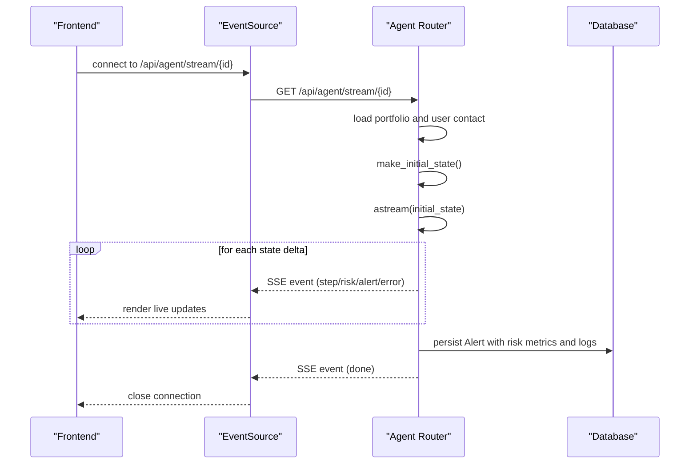

**Diagram sources**
- [agent.py:39-168](file://backend/routers/agent.py#L39-L168)
- [agent.py:171-182](file://backend/routers/agent.py#L171-L182)
- [alert.py:14-77](file://backend/models/alert.py#L14-L77)

**Section sources**
- [agent.py:39-168](file://backend/routers/agent.py#L39-L168)
- [agent.py:171-182](file://backend/routers/agent.py#L171-L182)
- [alert.py:14-77](file://backend/models/alert.py#L14-L77)

### Standalone Agent Runner
- Purpose: Test and develop agent execution without API dependencies
- CLI: python -m agent.run_agent [portfolio_name]
- Behavior: Creates initial state, streams deltas via astream, prints reasoning steps and errors, and summarizes risk results
- Portfolios: conservative, aggressive, balanced

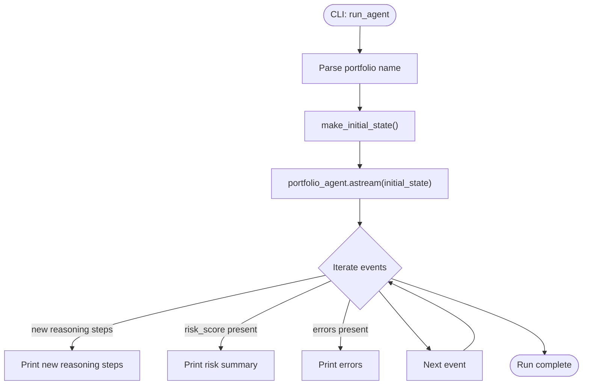

**Diagram sources**
- [run_agent.py:46-93](file://backend/agent/run_agent.py#L46-L93)
- [graph.py:210-242](file://backend/agent/graph.py#L210-L242)

**Section sources**
- [run_agent.py:46-93](file://backend/agent/run_agent.py#L46-L93)

### Frontend SSE Integration
- SSE client: connectAgentStream wraps EventSource, dispatches events to handlers
- UI feed: AgentFeed renders live reasoning steps, risk metrics, alert triggers, and errors; supports start/stop/reset controls

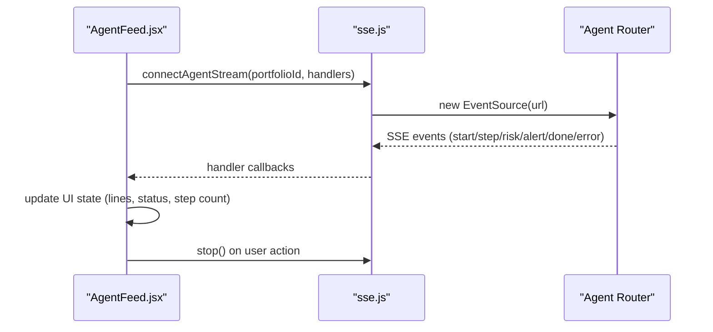

**Diagram sources**
- [AgentFeed.jsx:28-77](file://frontend/src/components/AgentFeed.jsx#L28-L77)
- [sse.js:21-62](file://frontend/src/services/sse.js#L21-L62)

**Section sources**
- [AgentFeed.jsx:28-77](file://frontend/src/components/AgentFeed.jsx#L28-L77)
- [sse.js:21-62](file://frontend/src/services/sse.js#L21-L62)

## Dependency Analysis
- Backend dependencies:
  - FastAPI app includes agent router and initializes DB
  - Agent router depends on StateGraph and models
  - StateGraph depends on tools and state
  - Tools depend on external libraries (yfinance, newsapi, textblob, sendgrid, twilio)
- Frontend depends on SSE client and UI components
- No circular dependencies observed among major modules

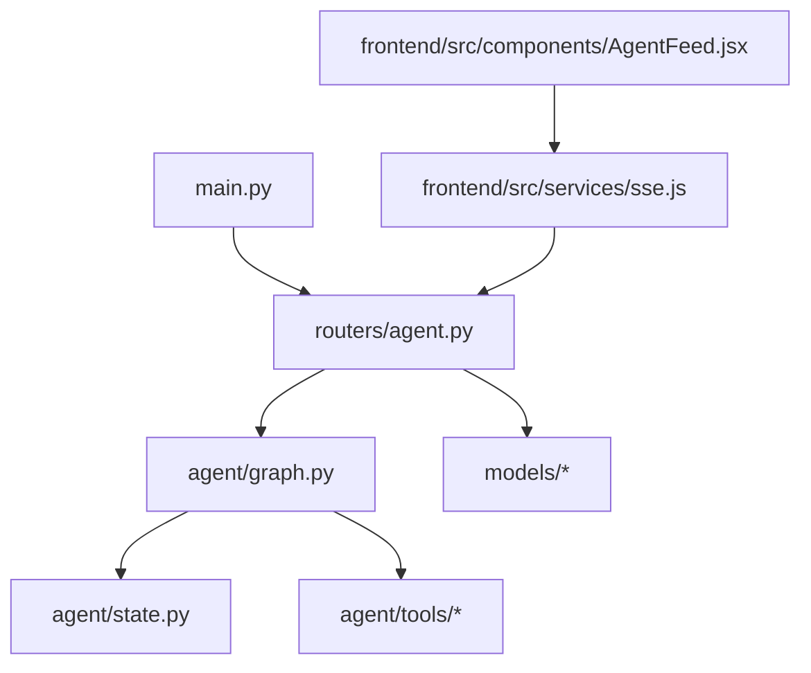

**Diagram sources**
- [main.py:38-44](file://backend/main.py#L38-L44)
- [agent.py:24-24](file://backend/routers/agent.py#L24-L24)
- [graph.py:28-32](file://backend/agent/graph.py#L28-L32)

**Section sources**
- [main.py:38-44](file://backend/main.py#L38-L44)
- [agent.py:24-24](file://backend/routers/agent.py#L24-L24)
- [graph.py:28-32](file://backend/agent/graph.py#L28-L32)

## Performance Considerations
- Concurrency and scalability:
  - Use separate processes or containers for high concurrency to avoid Python GIL contention
  - Offload DB writes to thread pool executors to keep async loops responsive
  - Limit SSE broadcast fan-out; consider a lightweight pub/sub layer for multiple clients
- Memory management:
  - Keep state deltas minimal; avoid storing large intermediate artifacts unless needed
  - Prefer streaming deltas over buffering entire state in memory
- Network I/O:
  - Batch external API calls where possible (e.g., combine ticker requests)
  - Implement retries with exponential backoff for NewsAPI/yfinance
- CPU-bound tasks:
  - Use vectorized NumPy operations for returns and risk metrics
  - Cache expensive computations (e.g., static risk thresholds) in constants
- Database:
  - Use connection pooling and batch inserts for alert persistence
  - Index frequently queried columns (portfolio_id, created_at)

[No sources needed since this section provides general guidance]

## Troubleshooting Guide
- Missing credentials:
  - SendGrid/Twilio: Alerts fall back to logging; verify environment variables and packages
  - NewsAPI/yfinance: Falls back to mock data; verify keys and network connectivity
- SSE disconnects:
  - Client-side: EventSource reconnects automatically; ensure CORS and Nginx buffering headers are set
  - Server-side: Check request.is_disconnected() and handle gracefully
- Risk threshold tuning:
  - Adjust HIGH_RISK_THRESHOLD in graph and tool logic consistently
- Error propagation:
  - Tools append errors to state; SSE emits error events; ensure UI surfaces errors clearly
- DB persistence failures:
  - Save in executor; log exceptions and still emit done event with alert_id=None

**Section sources**
- [send_alert.py:125-155](file://backend/agent/tools/send_alert.py#L125-L155)
- [agent.py:86-89](file://backend/routers/agent.py#L86-L89)
- [agent.py:155-158](file://backend/routers/agent.py#L155-L158)

## Conclusion
The agent execution control system combines a deterministic StateGraph with a modular toolset to deliver a robust, observable, and scalable portfolio risk analysis pipeline. The four-node workflow with conditional routing ensures clear decision logic, while streaming SSE enables real-time UI feedback. The standalone runner and API endpoints support both development and production scenarios. With careful attention to concurrency, memory, and I/O bottlenecks, the system scales to concurrent agent executions and multiple clients.

[No sources needed since this section summarizes without analyzing specific files]

## Appendices

### API Definitions
- GET /api/agent/stream/{portfolio_id}
  - Description: Server-Sent Events stream of agent reasoning, risk metrics, alert trigger, and errors
  - Response: SSE events (start, step, risk, alert, done, error)
- POST /api/agent/run/{portfolio_id}
  - Description: Synchronous run; returns JSON summary with alert_id, risk_score, risk_level, should_alert, risk_metrics
- GET /api/agent/status
  - Description: Health check

**Section sources**
- [agent.py:39-168](file://backend/routers/agent.py#L39-L168)
- [agent.py:186-232](file://backend/routers/agent.py#L186-L232)
- [agent.py:235-242](file://backend/routers/agent.py#L235-L242)

### Data Models
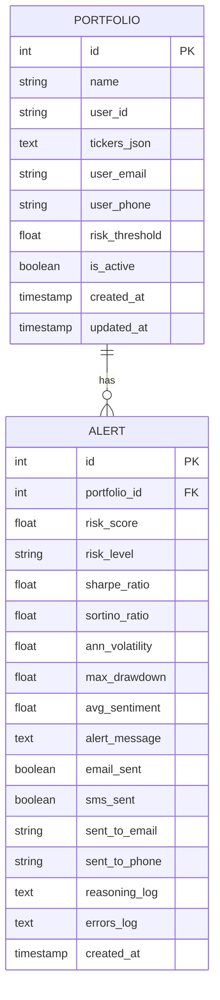

**Diagram sources**
- [portfolio.py:16-63](file://backend/models/portfolio.py#L16-L63)
- [alert.py:14-77](file://backend/models/alert.py#L14-L77)

**Section sources**
- [portfolio.py:16-63](file://backend/models/portfolio.py#L16-L63)
- [alert.py:14-77](file://backend/models/alert.py#L14-L77)