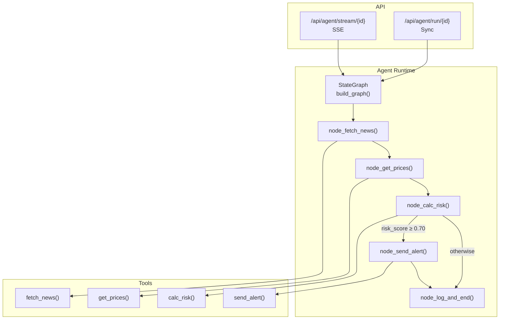
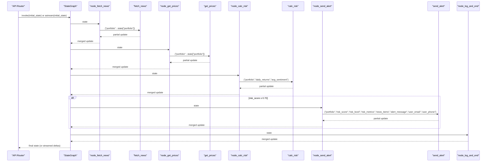
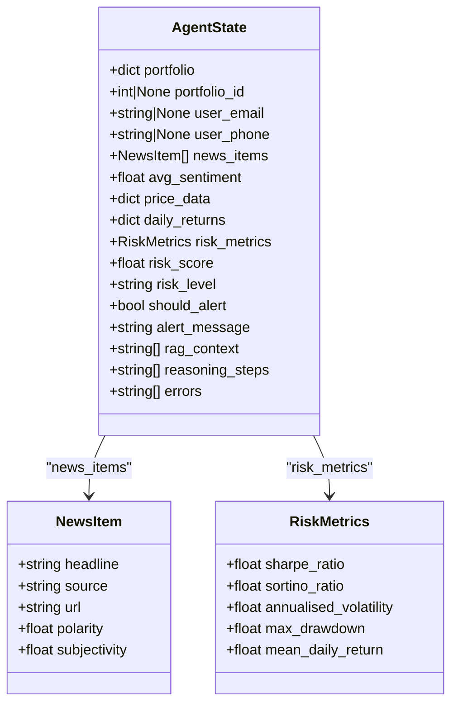
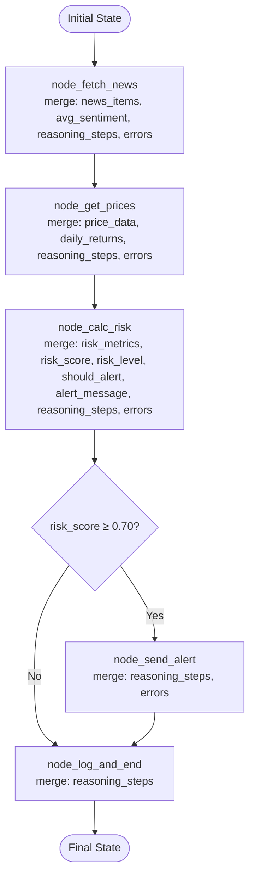
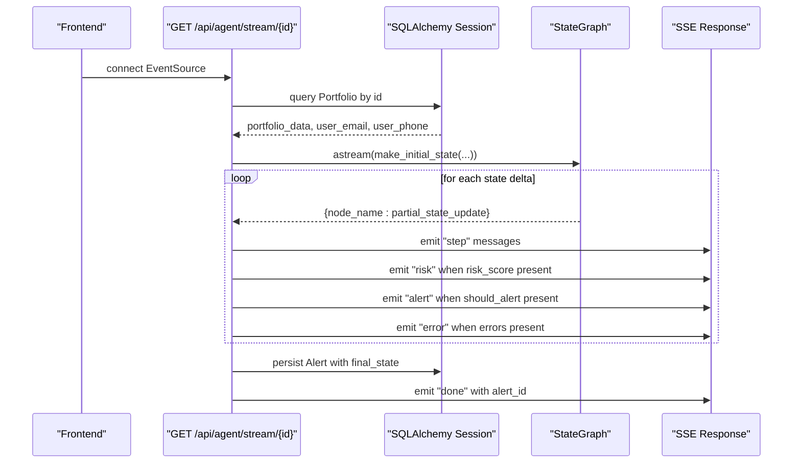
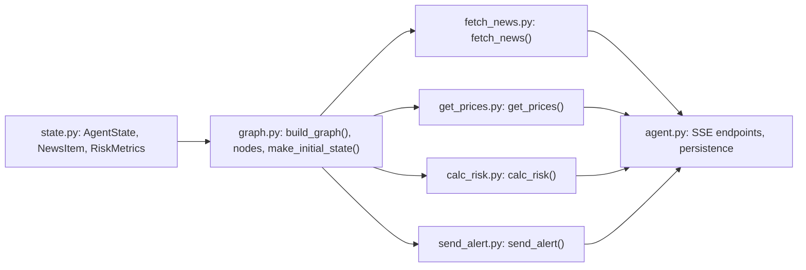

# State Management

<cite>
**Referenced Files in This Document**
- [state.py](file://backend/agent/state.py)
- [graph.py](file://backend/agent/graph.py)
- [run_agent.py](file://backend/agent/run_agent.py)
- [fetch_news.py](file://backend/agent/tools/fetch_news.py)
- [get_prices.py](file://backend/agent/tools/get_prices.py)
- [calc_risk.py](file://backend/agent/tools/calc_risk.py)
- [send_alert.py](file://backend/agent/tools/send_alert.py)
- [agent.py](file://backend/routers/agent.py)
- [portfolio.py](file://backend/models/portfolio.py)
- [alert.py](file://backend/models/alert.py)
- [main.py](file://backend/main.py)
</cite>

## Table of Contents
1. [Introduction](#introduction)
2. [Project Structure](#project-structure)
3. [Core Components](#core-components)
4. [Architecture Overview](#architecture-overview)
5. [Detailed Component Analysis](#detailed-component-analysis)
6. [Dependency Analysis](#dependency-analysis)
7. [Performance Considerations](#performance-considerations)
8. [Troubleshooting Guide](#troubleshooting-guide)
9. [Conclusion](#conclusion)
10. [Appendices](#appendices)

## Introduction
This document explains the AgentState TypedDict structure and the state management system powering the LangGraph-based portfolio risk agent. It covers the complete state schema, including portfolio data, risk metrics, news sentiment, price data, and reasoning logs. It documents how state flows through each node in the workflow, how data is passed and transformed, and how the initial state factory constructs a clean starting point. It also details validation, type safety, error handling patterns, state transitions during execution, best practices for state manipulation, and memory management considerations.

## Project Structure
The state management system is centered around a single TypedDict that flows through all nodes in a linear workflow with a conditional branch. Tools compute partial updates to the state, and LangGraph merges them automatically. The API exposes endpoints that stream state deltas via Server-Sent Events (SSE) and persist results to the database.

**Diagram sources**
- [graph.py:162-203](file://backend/agent/graph.py#L162-L203)
- [graph.py:45-140](file://backend/agent/graph.py#L45-L140)
- [fetch_news.py:98-164](file://backend/agent/tools/fetch_news.py#L98-L164)
- [get_prices.py:84-139](file://backend/agent/tools/get_prices.py#L84-L139)
- [calc_risk.py:149-255](file://backend/agent/tools/calc_risk.py#L149-L255)
- [send_alert.py:157-231](file://backend/agent/tools/send_alert.py#L157-L231)
- [agent.py:39-168](file://backend/routers/agent.py#L39-L168)
- [agent.py:186-232](file://backend/routers/agent.py#L186-L232)

**Section sources**
- [graph.py:162-203](file://backend/agent/graph.py#L162-L203)
- [agent.py:39-168](file://backend/routers/agent.py#L39-L168)
- [agent.py:186-232](file://backend/routers/agent.py#L186-L232)

## Core Components
- AgentState TypedDict: Defines the shared state schema and lifecycle fields.
- Tools: Stateless functions that compute partial updates to AgentState.
- Nodes: Async functions that wrap tools and merge partial updates into the shared state.
- Graph: Assembles nodes and conditional edges; provides streaming via astream().
- Initial State Factory: Creates a clean AgentState for a run.
- API Layer: Exposes SSE streaming and sync execution; persists results to the database.

**Section sources**
- [state.py:28-58](file://backend/agent/state.py#L28-L58)
- [graph.py:45-140](file://backend/agent/graph.py#L45-L140)
- [graph.py:210-242](file://backend/agent/graph.py#L210-L242)
- [agent.py:39-168](file://backend/routers/agent.py#L39-L168)
- [agent.py:186-232](file://backend/routers/agent.py#L186-L232)

## Architecture Overview
The agent follows a deterministic, data-driven workflow:
- Start with make_initial_state() to construct a clean AgentState.
- fetch_news populates news_items and avg_sentiment.
- get_prices populates price_data and daily_returns.
- calc_risk computes risk_metrics, risk_score, risk_level, should_alert, and alert_message.
- Conditional edge routes to send_alert (HIGH risk) or log_and_end (otherwise).
- Terminal node logs a summary and returns the final state.

**Diagram sources**
- [graph.py:45-140](file://backend/agent/graph.py#L45-L140)
- [graph.py:146-155](file://backend/agent/graph.py#L146-L155)
- [fetch_news.py:98-164](file://backend/agent/tools/fetch_news.py#L98-L164)
- [get_prices.py:84-139](file://backend/agent/tools/get_prices.py#L84-L139)
- [calc_risk.py:149-255](file://backend/agent/tools/calc_risk.py#L149-L255)
- [send_alert.py:157-231](file://backend/agent/tools/send_alert.py#L157-L231)

## Detailed Component Analysis

### AgentState TypedDict Schema
AgentState defines the shared state across all nodes. It is composed of:
- Inputs: portfolio, portfolio_id, user_email, user_phone
- News: news_items, avg_sentiment
- Prices: price_data, daily_returns
- Risk: risk_metrics, risk_score, risk_level
- Decisions: should_alert, alert_message
- RAG context: rag_context
- Audit trail: reasoning_steps, errors

**Diagram sources**
- [state.py:12-18](file://backend/agent/state.py#L12-L18)
- [state.py:20-26](file://backend/agent/state.py#L20-L26)
- [state.py:28-58](file://backend/agent/state.py#L28-L58)

**Section sources**
- [state.py:28-58](file://backend/agent/state.py#L28-L58)

### Initial State Factory
make_initial_state constructs a clean AgentState with:
- portfolio: weights dictionary
- portfolio_id: optional database row identifier
- user_email, user_phone: contact info for alerts
- Defaults for computed fields: empty lists/zeroes for news/prices/risk, empty dict for risk_metrics, zero risk_score, LOW risk_level, False should_alert, empty alert_message, empty rag_context, initial reasoning step, empty errors

It ensures downstream nodes can safely read optional fields and that the graph’s conditional edge has a fallback when thresholds are not met.

**Section sources**
- [graph.py:210-242](file://backend/agent/graph.py#L210-L242)

### Node Functions and State Transitions
Each node is an async function receiving the full AgentState and returning a partial update. LangGraph merges the partial update back into the shared state automatically. The nodes are:
- node_fetch_news: calls fetch_news and merges news_items, avg_sentiment, reasoning_steps, errors
- node_get_prices: calls get_prices and merges price_data, daily_returns, reasoning_steps, errors
- node_calc_risk: calls calc_risk and merges risk_metrics, risk_score, risk_level, should_alert, alert_message, reasoning_steps, errors
- node_send_alert: calls send_alert and merges reasoning_steps, errors
- node_log_and_end: logs a summary and appends lines to reasoning_steps

**Diagram sources**
- [graph.py:45-140](file://backend/agent/graph.py#L45-L140)
- [graph.py:146-155](file://backend/agent/graph.py#L146-L155)

**Section sources**
- [graph.py:45-140](file://backend/agent/graph.py#L45-L140)
- [graph.py:146-155](file://backend/agent/graph.py#L146-L155)

### Tools and Their Contributions
- fetch_news: returns news_items, avg_sentiment, reasoning_steps, errors; depends on portfolio keys
- get_prices: returns price_data, daily_returns, reasoning_steps, errors; depends on portfolio keys
- calc_risk: validates inputs, computes risk_metrics, risk_score, risk_level, should_alert, alert_message, reasoning_steps, errors
- send_alert: conditionally sends email/SMS, logs steps, and returns reasoning_steps, errors

These tools encapsulate domain logic and produce deterministic, partial updates to AgentState.

**Section sources**
- [fetch_news.py:98-164](file://backend/agent/tools/fetch_news.py#L98-L164)
- [get_prices.py:84-139](file://backend/agent/tools/get_prices.py#L84-L139)
- [calc_risk.py:149-255](file://backend/agent/tools/calc_risk.py#L149-L255)
- [send_alert.py:157-231](file://backend/agent/tools/send_alert.py#L157-L231)

### API Integration and SSE Streaming
The API layer:
- Loads portfolio data and user contacts from the database
- Constructs initial state via make_initial_state
- Streams state deltas via astream to the client using Server-Sent Events
- Emits structured events: step, risk, alert, done, error
- Persists final results to the Alert model after streaming completes

**Diagram sources**
- [agent.py:39-168](file://backend/routers/agent.py#L39-L168)
- [agent.py:171-182](file://backend/routers/agent.py#L171-L182)
- [graph.py:210-242](file://backend/agent/graph.py#L210-L242)

**Section sources**
- [agent.py:39-168](file://backend/routers/agent.py#L39-L168)
- [agent.py:171-182](file://backend/routers/agent.py#L171-L182)

### State Validation, Type Safety, and Error Handling
- Type safety: AgentState is a TypedDict, enabling static type checking and IDE support. Tools declare their inputs and outputs as dictionaries keyed by AgentState fields.
- Validation:
  - calc_risk validates non-empty inputs and minimum observations; returns defaults and logs errors when insufficient data is available.
  - fetch_news and get_prices handle missing external APIs by falling back to mock data and appending errors.
  - send_alert gracefully handles missing credentials by logging alert details in mock mode.
- Error propagation: Each tool appends errors to the state’s errors list; nodes merge these into the shared state. The API emits error events to the client.
- Conditional routing: The graph’s edge checks risk_score and routes deterministically, avoiding LLM decisions.

**Section sources**
- [calc_risk.py:178-202](file://backend/agent/tools/calc_risk.py#L178-L202)
- [fetch_news.py:120-130](file://backend/agent/tools/fetch_news.py#L120-L130)
- [get_prices.py:106-116](file://backend/agent/tools/get_prices.py#L106-L116)
- [send_alert.py:198-224](file://backend/agent/tools/send_alert.py#L198-L224)
- [graph.py:146-155](file://backend/agent/graph.py#L146-L155)

### Best Practices for State Manipulation
- Always return a partial update dictionary keyed by AgentState fields; do not mutate state in place.
- Append reasoning_steps rather than replacing them to preserve audit trails.
- Merge errors from tools into the shared errors list to centralize error reporting.
- Use get(...) with defaults for optional fields to avoid KeyError exceptions.
- Keep nodes pure: rely only on inputs and previous state updates; avoid global mutable state.

**Section sources**
- [graph.py:49-54](file://backend/agent/graph.py#L49-L54)
- [graph.py:61-66](file://backend/agent/graph.py#L61-L66)
- [graph.py:94-102](file://backend/agent/graph.py#L94-L102)
- [graph.py:118-121](file://backend/agent/graph.py#L118-L121)
- [graph.py:137-139](file://backend/agent/graph.py#L137-L139)

### Memory Management and Cleanup Strategies
- State growth: reasoning_steps and errors accumulate across nodes. For long-running or frequent runs, consider truncating these lists or periodically summarizing logs to limit memory usage.
- Price data: price_data and daily_returns can grow large (252 days of prices per ticker). If you plan to store intermediate results, consider downsampling or clearing unnecessary fields after use.
- Alerts persistence: The API writes a final Alert record with serialized reasoning_steps and errors_log. Ensure periodic cleanup of old alerts if storage becomes constrained.
- Async streaming: The SSE endpoint streams deltas and persists results after streaming completes. Avoid holding large intermediate state in memory beyond the streaming window.

[No sources needed since this section provides general guidance]

## Dependency Analysis
The state management system exhibits clear separation of concerns:
- State schema is defined centrally in state.py.
- Nodes depend on tools; tools depend on external libraries (NewsAPI, yfinance, SendGrid, Twilio).
- Graph composes nodes and conditional edges; API orchestrates state creation, streaming, and persistence.

**Diagram sources**
- [state.py:28-58](file://backend/agent/state.py#L28-L58)
- [graph.py:28-32](file://backend/agent/graph.py#L28-L32)
- [agent.py:24-24](file://backend/routers/agent.py#L24-L24)

**Section sources**
- [state.py:28-58](file://backend/agent/state.py#L28-L58)
- [graph.py:28-32](file://backend/agent/graph.py#L28-L32)
- [agent.py:24-24](file://backend/routers/agent.py#L24-L24)

## Performance Considerations
- Streaming: astream() yields deltas, enabling responsive UI updates without buffering the entire run.
- Parallelism: Tools are independent; LangGraph executes nodes sequentially in this workflow. For future scaling, consider parallelizing independent branches if the graph grows more complex.
- Data sizes: price_data and daily_returns contain 252 observations per ticker. Consider lazy loading or caching strategies if the number of tickers increases.
- Network resilience: Tools already include fallbacks (mock data) to prevent stalls; keep these fallbacks enabled for production stability.

[No sources needed since this section provides general guidance]

## Troubleshooting Guide
Common issues and resolutions:
- Missing external credentials:
  - NewsAPI key: falls back to mock headlines; verify reasoning_steps indicate mock mode.
  - yfinance: falls back to geometric Brownian motion; verify errors list for failures.
  - SendGrid/Twilio: logs mock alert details when credentials are missing; verify errors list for actual failures.
- Insufficient data:
  - calc_risk requires daily_returns and portfolio; if empty or short, defaults are returned and errors are logged.
- SSE disconnects:
  - The API checks for client disconnection and stops streaming; reconnect to resume.
- Persistence failures:
  - The API writes Alert records asynchronously; check database connectivity and permissions.

**Section sources**
- [fetch_news.py:120-130](file://backend/agent/tools/fetch_news.py#L120-L130)
- [get_prices.py:106-116](file://backend/agent/tools/get_prices.py#L106-L116)
- [calc_risk.py:178-202](file://backend/agent/tools/calc_risk.py#L178-L202)
- [agent.py:87-89](file://backend/routers/agent.py#L87-L89)
- [agent.py:155-158](file://backend/routers/agent.py#L155-L158)

## Conclusion
AgentState provides a robust, typed foundation for the portfolio risk agent. The workflow is deterministic, auditable, and resilient: nodes pass partial updates, tools encapsulate domain logic, and the API streams results in real time while persisting outcomes. By following best practices for state manipulation, validating inputs, and managing memory, teams can extend the system confidently and scale it to more complex scenarios.

## Appendices

### Example State Transitions During Execution
- Initial: portfolio, portfolio_id, user_email, user_phone, reasoning_steps with a startup message, others empty.
- After fetch_news: news_items populated, avg_sentiment computed, reasoning_steps appended, errors collected.
- After get_prices: price_data and daily_returns populated, reasoning_steps appended, errors collected.
- After calc_risk: risk_metrics, risk_score, risk_level, should_alert, alert_message computed, reasoning_steps appended, errors collected.
- Conditional: if should_alert is True, send_alert adds delivery logs; otherwise skip.
- Final: log_and_end appends a summary to reasoning_steps.

**Section sources**
- [graph.py:49-54](file://backend/agent/graph.py#L49-L54)
- [graph.py:61-66](file://backend/agent/graph.py#L61-L66)
- [graph.py:94-102](file://backend/agent/graph.py#L94-L102)
- [graph.py:118-121](file://backend/agent/graph.py#L118-L121)
- [graph.py:137-139](file://backend/agent/graph.py#L137-L139)

### API Endpoints Related to State
- GET /api/agent/stream/{portfolio_id}: Streams reasoning steps, risk metrics, alert triggers, and errors via SSE; persists final result.
- POST /api/agent/run/{portfolio_id}: Runs agent synchronously and returns a JSON summary; persists final result.
- GET /api/agent/status: Health check for the agent service.

**Section sources**
- [agent.py:39-168](file://backend/routers/agent.py#L39-L168)
- [agent.py:186-232](file://backend/routers/agent.py#L186-L232)
- [agent.py:235-242](file://backend/routers/agent.py#L235-L242)

### Database Models for State Persistence
- Portfolio: stores tickers, user contact info, and risk threshold.
- Alert: persists risk metrics, alert delivery flags, alert_message, reasoning_steps, and errors_log.

**Section sources**
- [portfolio.py:16-63](file://backend/models/portfolio.py#L16-L63)
- [alert.py:14-77](file://backend/models/alert.py#L14-L77)