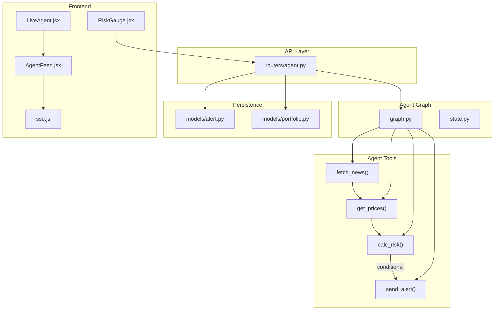
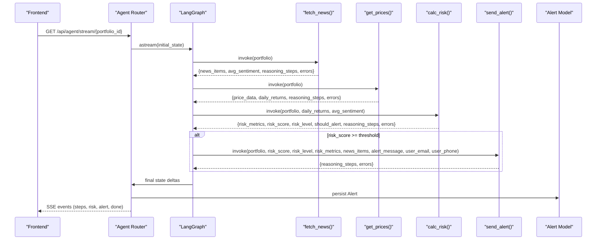
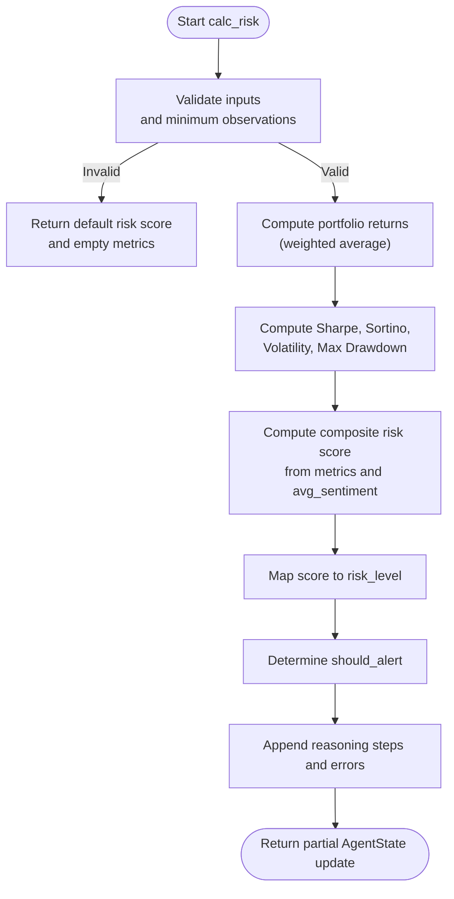
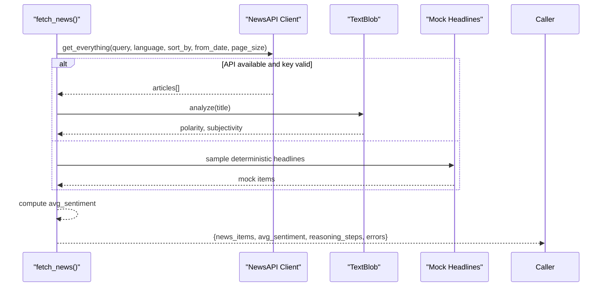
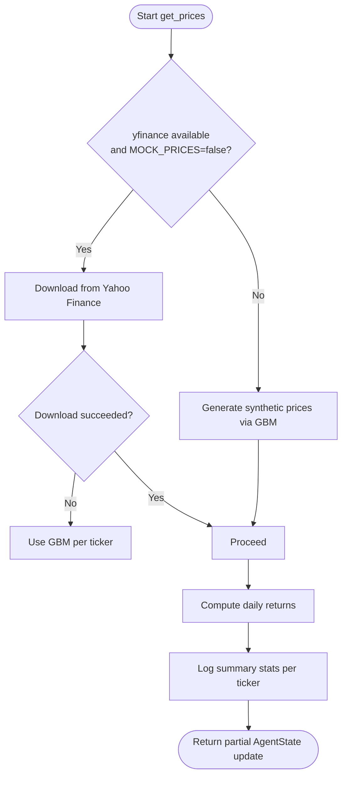
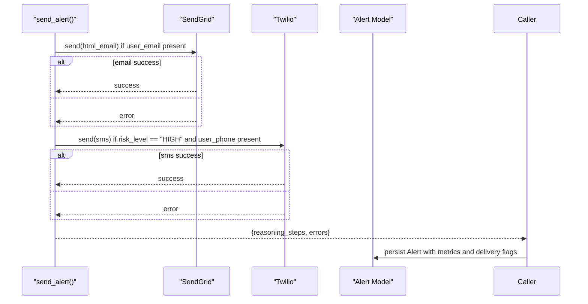
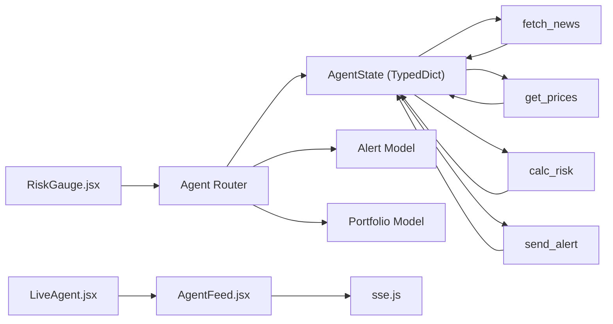

# Tool Implementations

<cite>
**Referenced Files in This Document**
- [calc_risk.py](file://backend/agent/tools/calc_risk.py)
- [fetch_news.py](file://backend/agent/tools/fetch_news.py)
- [get_prices.py](file://backend/agent/tools/get_prices.py)
- [send_alert.py](file://backend/agent/tools/send_alert.py)
- [graph.py](file://backend/agent/graph.py)
- [state.py](file://backend/agent/state.py)
- [agent.py](file://backend/routers/agent.py)
- [alert.py](file://backend/models/alert.py)
- [portfolio.py](file://backend/models/portfolio.py)
- [AgentFeed.jsx](file://frontend/src/components/AgentFeed.jsx)
- [RiskGauge.jsx](file://frontend/src/components/RiskGauge.jsx)
- [LiveAgent.jsx](file://frontend/src/pages/LiveAgent.jsx)
- [sse.js](file://frontend/src/services/sse.js)
</cite>

## Table of Contents
1. [Introduction](#introduction)
2. [Project Structure](#project-structure)
3. [Core Components](#core-components)
4. [Architecture Overview](#architecture-overview)
5. [Detailed Component Analysis](#detailed-component-analysis)
6. [Dependency Analysis](#dependency-analysis)
7. [Performance Considerations](#performance-considerations)
8. [Troubleshooting Guide](#troubleshooting-guide)
9. [Conclusion](#conclusion)
10. [Appendices](#appendices)

## Introduction
This document provides comprehensive documentation for the agent tool implementations that power the portfolio risk analysis pipeline. It covers:
- Risk calculation algorithm (Sharpe ratio, Sortino ratio, volatility, and max drawdown) with mathematical formulations and implementation details
- News fetching mechanism (API integration, sentiment analysis, and data processing)
- Price data retrieval system (historical data fetching, daily return computation, and validation)
- Alert delivery system (email/SMS notifications, user contact integration, and persistence)
- Tool function signatures, input/output schemas, error handling strategies, and performance considerations
- Example invocations and integration patterns with the agent workflow

## Project Structure
The tools are part of a LangGraph-based agent that orchestrates four distinct steps:
- Fetch financial news and compute sentiment
- Retrieve price history and compute daily returns
- Calculate risk metrics and composite risk score
- Dispatch alerts via email and/or SMS when thresholds are exceeded

**Diagram sources**
- [graph.py:1-243](file://backend/agent/graph.py#L1-L243)
- [state.py:1-58](file://backend/agent/state.py#L1-L58)
- [agent.py:1-243](file://backend/routers/agent.py#L1-L243)
- [alert.py:1-77](file://backend/models/alert.py#L1-L77)
- [portfolio.py:1-63](file://backend/models/portfolio.py#L1-L63)
- [AgentFeed.jsx:1-175](file://frontend/src/components/AgentFeed.jsx#L1-L175)
- [RiskGauge.jsx:1-101](file://frontend/src/components/RiskGauge.jsx#L1-L101)
- [LiveAgent.jsx:1-95](file://frontend/src/pages/LiveAgent.jsx#L1-L95)
- [sse.js:1-63](file://frontend/src/services/sse.js#L1-L63)

**Section sources**
- [graph.py:1-243](file://backend/agent/graph.py#L1-L243)
- [state.py:1-58](file://backend/agent/state.py#L1-L58)
- [agent.py:1-243](file://backend/routers/agent.py#L1-L243)

## Core Components
- fetch_news(): Retrieves recent financial news for portfolio tickers and computes an average sentiment score using TextBlob.
- get_prices(): Downloads 1-year daily close prices via yfinance (or synthetic data) and computes daily returns.
- calc_risk(): Computes Sharpe ratio, Sortino ratio, annualized volatility, and max drawdown; builds a composite risk score and determines alert eligibility.
- send_alert(): Sends email (SendGrid) and/or SMS (Twilio) alerts when risk exceeds thresholds; logs to console in mock mode.

Each tool is decorated with a LangChain tool decorator and returns a partial update to the shared AgentState, enabling seamless state propagation across nodes.

**Section sources**
- [fetch_news.py:1-164](file://backend/agent/tools/fetch_news.py#L1-L164)
- [get_prices.py:1-139](file://backend/agent/tools/get_prices.py#L1-L139)
- [calc_risk.py:1-255](file://backend/agent/tools/calc_risk.py#L1-L255)
- [send_alert.py:1-231](file://backend/agent/tools/send_alert.py#L1-L231)

## Architecture Overview
The agent follows a linear pipeline with a conditional edge:
- fetch_news → get_prices → calc_risk → [conditional edge] → send_alert → log_and_end
- Conditional routing depends on the composite risk score; HIGH risk triggers alerting, otherwise the run ends.

**Diagram sources**
- [graph.py:45-121](file://backend/agent/graph.py#L45-L121)
- [agent.py:39-168](file://backend/routers/agent.py#L39-L168)
- [alert.py:14-43](file://backend/models/alert.py#L14-L43)

## Detailed Component Analysis

### Risk Calculation Tool (calc_risk)
Computes portfolio-level risk metrics and a composite risk score:
- Portfolio daily returns: weighted average of individual ticker returns aligned to the shortest return series
- Sharpe ratio: mean excess return divided by standard deviation, annualized by √252
- Sortino ratio: mean excess return divided by downside deviation (only negative returns), annualized
- Annualized volatility: standard deviation of daily returns × √252
- Max drawdown: minimum of (cumulative_value - running_peak) / running_peak
- Composite risk score: normalized contributions from Sharpe, Sortino, volatility, and news sentiment, with configurable weights and thresholds

Inputs:
- portfolio: ticker → weight mapping
- daily_returns: ticker → daily return series
- avg_sentiment: average headline polarity from fetch_news()

Outputs:
- risk_metrics: dictionary containing sharpe_ratio, sortino_ratio, annualised_volatility, max_drawdown, mean_daily_return
- risk_score: composite score in [0.0, 1.0]
- risk_level: LOW | MEDIUM | HIGH
- should_alert: True if risk_score exceeds HIGH_RISK_THRESHOLD
- reasoning_steps: audit trail of computations and decisions
- errors: list of encountered issues

Error handling:
- Graceful fallback when inputs are empty or insufficient observations
- Validation of minimum observation length before computing ratios

Performance considerations:
- Uses vectorized NumPy operations for efficient computation
- Normalizes weights to avoid invalid sums
- Rounds numeric outputs for consistent presentation

**Diagram sources**
- [calc_risk.py:149-255](file://backend/agent/tools/calc_risk.py#L149-L255)

**Section sources**
- [calc_risk.py:149-255](file://backend/agent/tools/calc_risk.py#L149-L255)

### News Fetching Tool (fetch_news)
Retrieves recent financial news for each ticker and computes sentiment:
- API integration: NewsAPI client with fallback to mock data when key is missing or package unavailable
- Sentiment analysis: TextBlob polarity and subjectivity scores per headline
- Aggregation: Average polarity across all headlines becomes avg_sentiment for risk scoring

Inputs:
- portfolio: ticker → weight mapping

Outputs:
- news_items: list of headline records with source, URL, polarity, subjectivity
- avg_sentiment: float in [-1.0, 1.0]
- reasoning_steps: audit trail of retrieval and sentiment computation
- errors: list of API-related issues

Error handling:
- Catches API exceptions and falls back to deterministic mock headlines
- Provides informative logs for debugging

**Diagram sources**
- [fetch_news.py:98-164](file://backend/agent/tools/fetch_news.py#L98-L164)

**Section sources**
- [fetch_news.py:98-164](file://backend/agent/tools/fetch_news.py#L98-L164)

### Price Data Retrieval Tool (get_prices)
Downloads 1-year daily close prices and computes daily returns:
- Real data: yfinance with automatic adjustment and fallback per ticker
- Synthetic data: Geometric Brownian Motion for offline/demo scenarios
- Daily returns: percentage change series for each ticker

Inputs:
- portfolio: ticker → weight mapping

Outputs:
- price_data: ticker → 252-day close price series
- daily_returns: ticker → 251-day return series
- reasoning_steps: summary statistics per ticker (observations, YTD percent, annualized volatility)
- errors: list of download failures

Error handling:
- Per-ticker fallback to synthetic data on failure
- Graceful degradation to mock prices when yfinance is unavailable

**Diagram sources**
- [get_prices.py:84-139](file://backend/agent/tools/get_prices.py#L84-L139)

**Section sources**
- [get_prices.py:84-139](file://backend/agent/tools/get_prices.py#L84-L139)

### Alert Delivery Tool (send_alert)
Dispatches alerts via email and/or SMS based on risk level:
- Email: SendGrid HTML email with rich metrics and news highlights
- SMS: Twilio SMS for HIGH risk only
- Mock mode: logs alert payload to console when recipients are not configured
- Persistence: Alert model captures risk metrics, delivery status, and reasoning logs

Inputs:
- portfolio, risk_score, risk_level, risk_metrics, news_items, alert_message
- user_email, user_phone (optional)

Outputs:
- reasoning_steps: delivery attempts and outcomes
- errors: API errors collected during delivery

**Diagram sources**
- [send_alert.py:157-231](file://backend/agent/tools/send_alert.py#L157-L231)
- [alert.py:14-77](file://backend/models/alert.py#L14-L77)

**Section sources**
- [send_alert.py:157-231](file://backend/agent/tools/send_alert.py#L157-L231)
- [alert.py:14-77](file://backend/models/alert.py#L14-L77)

## Dependency Analysis
- Tools depend on shared AgentState typed dictionaries and are invoked by LangGraph nodes.
- The agent router constructs initial state from portfolio metadata and user contacts, streams updates via SSE, and persists results to the Alert model.
- Frontend components consume SSE events to render live reasoning steps, risk metrics, and alert triggers.

**Diagram sources**
- [state.py:28-58](file://backend/agent/state.py#L28-L58)
- [graph.py:45-121](file://backend/agent/graph.py#L45-L121)
- [agent.py:39-168](file://backend/routers/agent.py#L39-L168)
- [alert.py:14-77](file://backend/models/alert.py#L14-L77)
- [portfolio.py:16-63](file://backend/models/portfolio.py#L16-L63)
- [AgentFeed.jsx:1-175](file://frontend/src/components/AgentFeed.jsx#L1-L175)
- [LiveAgent.jsx:1-95](file://frontend/src/pages/LiveAgent.jsx#L1-L95)
- [RiskGauge.jsx:1-101](file://frontend/src/components/RiskGauge.jsx#L1-L101)
- [sse.js:1-63](file://frontend/src/services/sse.js#L1-L63)

**Section sources**
- [state.py:28-58](file://backend/agent/state.py#L28-L58)
- [graph.py:45-121](file://backend/agent/graph.py#L45-L121)
- [agent.py:39-168](file://backend/routers/agent.py#L39-L168)

## Performance Considerations
- Vectorization: NumPy-based computations minimize Python loops for returns and risk metric calculations.
- Early exits: Tools validate inputs and minimum observations to avoid unnecessary computation.
- Fallbacks: Synthetic data generation ensures pipeline continuity in offline or network-constrained environments.
- Streaming: SSE endpoints emit incremental updates, reducing frontend latency and improving UX.
- Asynchronous execution: LangGraph’s async nodes and FastAPI’s async router enable concurrent processing.

[No sources needed since this section provides general guidance]

## Troubleshooting Guide
Common issues and resolutions:
- Missing API keys:
  - NEWS_API_KEY missing: falls back to mock headlines
  - SENDGRID_API_KEY or TWILIO credentials missing: logs alert payload to console (mock mode)
- Network failures:
  - yfinance download errors: synthetic data fallback per ticker
  - NewsAPI errors: logs error and continues with mock data
- Insufficient data:
  - calc_risk requires minimum observations; returns default risk score and logs warnings
- Delivery failures:
  - send_alert collects errors and logs outcomes; verify credentials and recipient formats

Operational checks:
- Verify environment variables for APIs and packages
- Confirm portfolio weights sum approximately to 1.0
- Ensure user_email and user_phone are set for alert delivery
- Monitor SSE connectivity and event types in the frontend

**Section sources**
- [fetch_news.py:120-131](file://backend/agent/tools/fetch_news.py#L120-L131)
- [get_prices.py:106-117](file://backend/agent/tools/get_prices.py#L106-L117)
- [calc_risk.py:178-202](file://backend/agent/tools/calc_risk.py#L178-L202)
- [send_alert.py:197-225](file://backend/agent/tools/send_alert.py#L197-L225)

## Conclusion
The agent tool suite integrates robust financial data retrieval, sentiment-driven risk scoring, and reliable alert delivery. The modular design enables clear separation of concerns, while LangGraph and SSE provide a scalable, observable workflow. The included fallbacks and error handling ensure resilience across diverse operational environments.

[No sources needed since this section summarizes without analyzing specific files]

## Appendices

### Tool Function Signatures and Schemas
- fetch_news(portfolio: dict) -> dict
  - Inputs: portfolio {ticker: weight}
  - Outputs: news_items, avg_sentiment, reasoning_steps, errors
- get_prices(portfolio: dict) -> dict
  - Inputs: portfolio {ticker: weight}
  - Outputs: price_data, daily_returns, reasoning_steps, errors
- calc_risk(portfolio: dict, daily_returns: dict, avg_sentiment: float) -> dict
  - Inputs: portfolio, daily_returns, avg_sentiment
  - Outputs: risk_metrics, risk_score, risk_level, should_alert, reasoning_steps, errors
- send_alert(portfolio: dict, risk_score: float, risk_level: str, risk_metrics: dict, news_items: list, alert_message: str, user_email: str="", user_phone: str="") -> dict
  - Inputs: portfolio, risk_score, risk_level, risk_metrics, news_items, alert_message, user_email, user_phone
  - Outputs: reasoning_steps, errors

**Section sources**
- [fetch_news.py:98-164](file://backend/agent/tools/fetch_news.py#L98-L164)
- [get_prices.py:84-139](file://backend/agent/tools/get_prices.py#L84-L139)
- [calc_risk.py:149-255](file://backend/agent/tools/calc_risk.py#L149-L255)
- [send_alert.py:157-231](file://backend/agent/tools/send_alert.py#L157-L231)

### Integration Patterns with Agent Workflow
- Initial state construction: make_initial_state sets portfolio, user contacts, and empty placeholders for intermediate results.
- Node invocation: Each node invokes the corresponding tool with the current state and merges partial updates.
- Conditional routing: After calc_risk, should_send_alert routes to send_alert only when risk_score meets the threshold.
- SSE streaming: The router emits step deltas, risk updates, alert triggers, and completion events to the frontend.
- Persistence: Final state is persisted as an Alert record with risk metrics, delivery flags, and reasoning logs.

**Section sources**
- [graph.py:210-243](file://backend/agent/graph.py#L210-L243)
- [graph.py:146-156](file://backend/agent/graph.py#L146-L156)
- [agent.py:39-168](file://backend/routers/agent.py#L39-L168)
- [alert.py:14-77](file://backend/models/alert.py#L14-L77)

### Frontend Integration
- SSE consumption: sse.js wraps EventSource and dispatches events to handlers.
- Live feed: AgentFeed.jsx renders incremental reasoning steps and classifies messages.
- Risk visualization: RiskGauge.jsx displays the composite risk score and key metrics.
- LiveAgent.jsx orchestrates portfolio selection and feeds risk updates to the gauge.

**Section sources**
- [sse.js:1-63](file://frontend/src/services/sse.js#L1-L63)
- [AgentFeed.jsx:1-175](file://frontend/src/components/AgentFeed.jsx#L1-L175)
- [RiskGauge.jsx:1-101](file://frontend/src/components/RiskGauge.jsx#L1-L101)
- [LiveAgent.jsx:1-95](file://frontend/src/pages/LiveAgent.jsx#L1-L95)