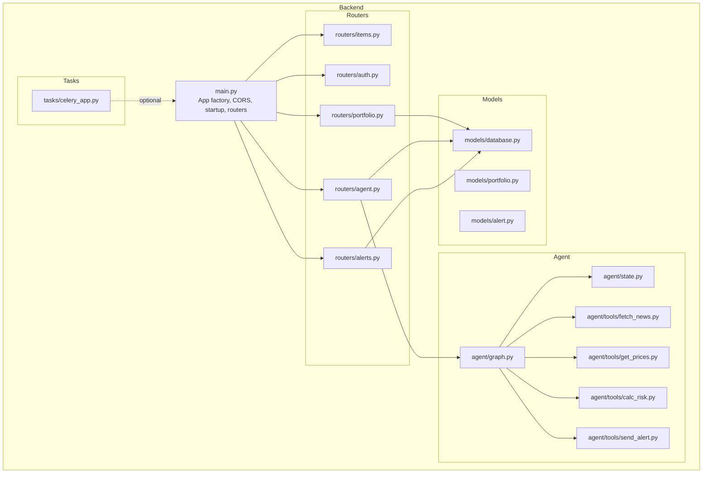
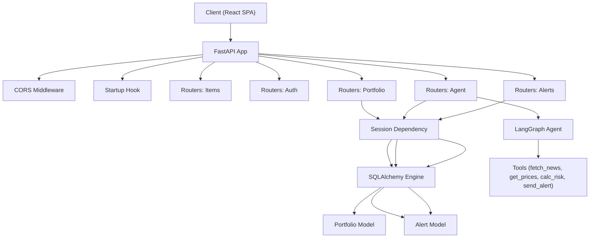
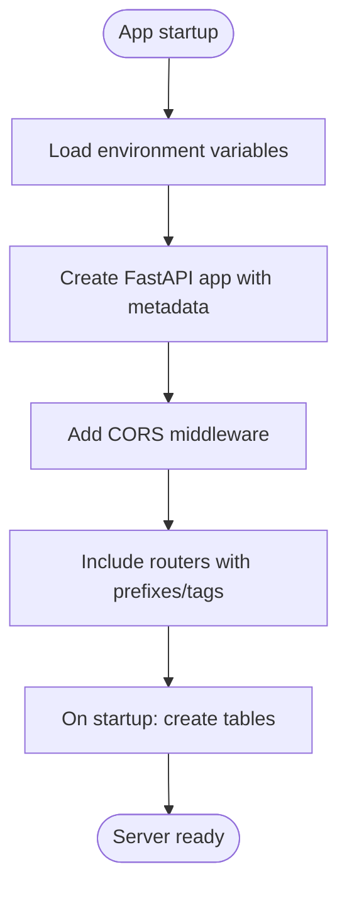
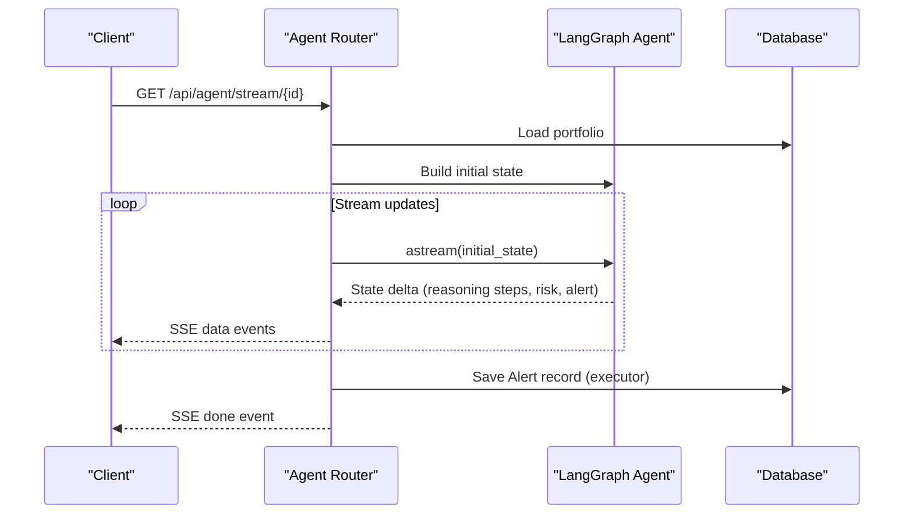
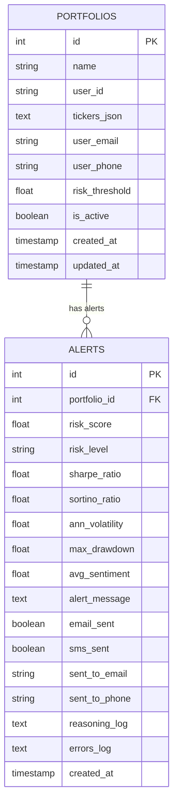
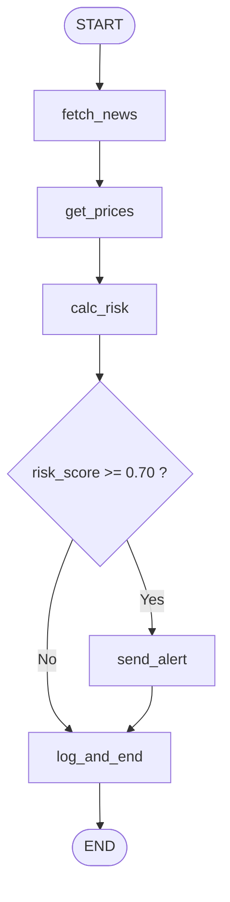
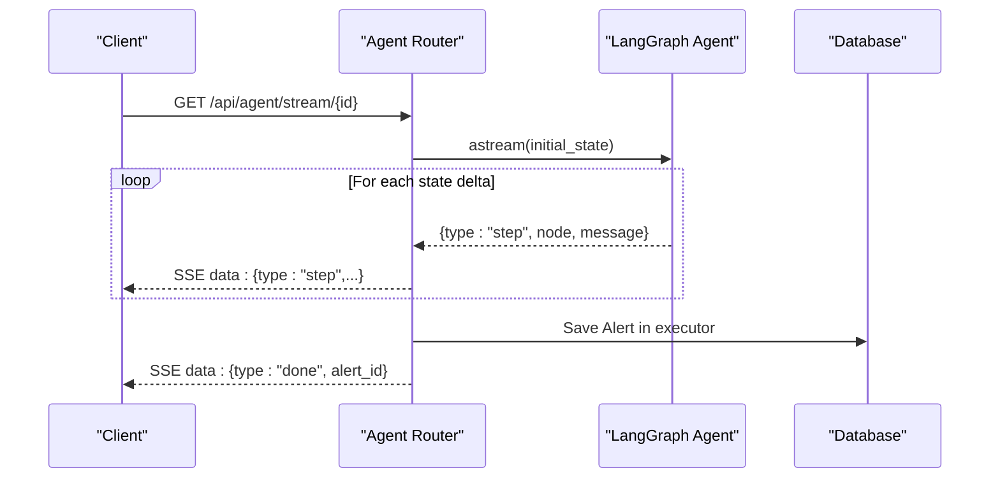
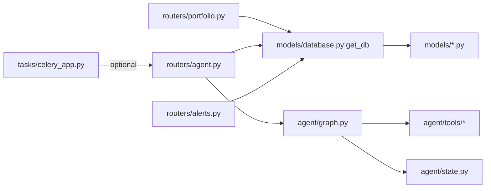

# Backend Architecture

<cite>
**Referenced Files in This Document**
- [backend/main.py](file://backend/main.py)
- [backend/routers/__init__.py](file://backend/routers/__init__.py)
- [backend/routers/items.py](file://backend/routers/items.py)
- [backend/routers/auth.py](file://backend/routers/auth.py)
- [backend/routers/portfolio.py](file://backend/routers/portfolio.py)
- [backend/routers/agent.py](file://backend/routers/agent.py)
- [backend/routers/alerts.py](file://backend/routers/alerts.py)
- [backend/models/__init__.py](file://backend/models/__init__.py)
- [backend/models/database.py](file://backend/models/database.py)
- [backend/models/portfolio.py](file://backend/models/portfolio.py)
- [backend/models/alert.py](file://backend/models/alert.py)
- [backend/agent/__init__.py](file://backend/agent/__init__.py)
- [backend/agent/graph.py](file://backend/agent/graph.py)
- [backend/agent/state.py](file://backend/agent/state.py)
- [backend/tasks/__init__.py](file://backend/tasks/__init__.py)
- [backend/tasks/celery_app.py](file://backend/tasks/celery_app.py)
</cite>

## Table of Contents
1. [Introduction](#introduction)
2. [Project Structure](#project-structure)
3. [Core Components](#core-components)
4. [Architecture Overview](#architecture-overview)
5. [Detailed Component Analysis](#detailed-component-analysis)
6. [Dependency Analysis](#dependency-analysis)
7. [Performance Considerations](#performance-considerations)
8. [Troubleshooting Guide](#troubleshooting-guide)
9. [Conclusion](#conclusion)
10. [Appendices](#appendices)

## Introduction
This document describes the backend architecture of the ishwarambare-app FastAPI application. It covers the modular structure separating routers, models, agent workflows, and tasks; the FastAPI configuration including CORS, middleware, startup events, and dependency injection; the routing architecture for portfolio management, agent workflows, alerts, and authentication; the SQLAlchemy ORM layer with models, relationships, and session management; and the LangGraph AI agent workflow system with state machines, tool implementations, and real-time streaming via Server-Sent Events. It also documents technical decisions around asynchronous processing, error handling, API versioning, security considerations, performance optimization, and scalability patterns.

## Project Structure
The backend is organized into clear packages:
- Routers: REST endpoints grouped by domain (/api/items, /api/auth, /api/portfolio, /api/agent, /api/alerts)
- Models: SQLAlchemy ORM definitions for database entities
- Agent: LangGraph workflow definition, state schema, and tool implementations
- Tasks: Celery-based asynchronous task orchestration
- Main: Application factory, middleware, startup hooks, and router registration

**Diagram sources**
- [backend/main.py:12-43](file://backend/main.py#L12-L43)
- [backend/routers/items.py:1-72](file://backend/routers/items.py#L1-L72)
- [backend/routers/auth.py:1-39](file://backend/routers/auth.py#L1-L39)
- [backend/routers/portfolio.py:1-124](file://backend/routers/portfolio.py#L1-L124)
- [backend/routers/agent.py:1-243](file://backend/routers/agent.py#L1-L243)
- [backend/routers/alerts.py:1-84](file://backend/routers/alerts.py#L1-L84)
- [backend/models/database.py:1-42](file://backend/models/database.py#L1-L42)
- [backend/models/portfolio.py:1-63](file://backend/models/portfolio.py#L1-L63)
- [backend/models/alert.py:1-77](file://backend/models/alert.py#L1-L77)
- [backend/agent/graph.py:1-243](file://backend/agent/graph.py#L1-L243)
- [backend/agent/state.py:1-58](file://backend/agent/state.py#L1-L58)
- [backend/tasks/celery_app.py](file://backend/tasks/celery_app.py)

**Section sources**
- [backend/main.py:12-43](file://backend/main.py#L12-L43)
- [backend/routers/__init__.py:1-2](file://backend/routers/__init__.py#L1-L2)
- [backend/models/__init__.py:1-2](file://backend/models/__init__.py#L1-L2)
- [backend/agent/__init__.py:1-2](file://backend/agent/__init__.py#L1-L2)
- [backend/tasks/__init__.py:1-2](file://backend/tasks/__init__.py#L1-L2)

## Core Components
- FastAPI Application Factory: Creates the app with metadata, CORS, startup hook, and router registrations.
- Routers: Modular endpoints for items, auth, portfolio, agent, and alerts.
- SQLAlchemy Layer: Engine, session maker, base class, dependency provider, and table creation.
- ORM Models: Portfolio and Alert entities with JSON fields and helper properties.
- LangGraph Agent: State machine with typed state, nodes, conditional edges, and initial state factory.
- Tools: Pluggable tool implementations for fetching news, prices, computing risk, and sending alerts.
- Tasks: Celery app placeholder for asynchronous job processing.

**Section sources**
- [backend/main.py:12-59](file://backend/main.py#L12-L59)
- [backend/models/database.py:29-42](file://backend/models/database.py#L29-L42)
- [backend/models/portfolio.py:16-63](file://backend/models/portfolio.py#L16-L63)
- [backend/models/alert.py:14-77](file://backend/models/alert.py#L14-L77)
- [backend/agent/graph.py:162-204](file://backend/agent/graph.py#L162-L204)
- [backend/agent/state.py:28-58](file://backend/agent/state.py#L28-L58)
- [backend/tasks/celery_app.py](file://backend/tasks/celery_app.py)

## Architecture Overview
The backend follows a layered architecture:
- Presentation Layer: FastAPI routers expose REST endpoints.
- Domain Layer: Routers encapsulate business logic per domain.
- Persistence Layer: SQLAlchemy ORM manages database operations.
- Intelligence Layer: LangGraph orchestrates agent workflows with streaming support.
- Task Layer: Celery provides asynchronous task execution capability.

**Diagram sources**
- [backend/main.py:12-59](file://backend/main.py#L12-L59)
- [backend/routers/portfolio.py:19-20](file://backend/routers/portfolio.py#L19-L20)
- [backend/routers/agent.py:21-24](file://backend/routers/agent.py#L21-L24)
- [backend/routers/alerts.py:16-17](file://backend/routers/alerts.py#L16-L17)
- [backend/models/database.py:29-42](file://backend/models/database.py#L29-L42)
- [backend/models/portfolio.py:16-63](file://backend/models/portfolio.py#L16-L63)
- [backend/models/alert.py:14-77](file://backend/models/alert.py#L14-L77)
- [backend/agent/graph.py:162-204](file://backend/agent/graph.py#L162-L204)

## Detailed Component Analysis

### FastAPI Application Configuration
- Metadata: Title, description, and version are set at the application level.
- CORS: Configured to allow all origins for SSE compatibility and credentials.
- Startup Event: On startup, database tables are created.
- Router Registration: Five routers registered under /api/* with tags for OpenAPI grouping.
- Health Checks: Root and /health endpoints exposed.

**Diagram sources**
- [backend/main.py:10-59](file://backend/main.py#L10-L59)

**Section sources**
- [backend/main.py:12-59](file://backend/main.py#L12-L59)

### Routing Architecture
- Items Router: CRUD endpoints for demonstration items with in-memory storage.
- Auth Router: Login and profile endpoints (placeholder for JWT).
- Portfolio Router: CRUD endpoints for portfolios with weight validation and database persistence.
- Agent Router: SSE streaming and sync run endpoints; persists results to alerts.
- Alerts Router: Read-only endpoints for alert history and statistics.

**Diagram sources**
- [backend/routers/agent.py:39-168](file://backend/routers/agent.py#L39-L168)
- [backend/agent/graph.py:162-204](file://backend/agent/graph.py#L162-L204)
- [backend/models/alert.py:14-77](file://backend/models/alert.py#L14-L77)

**Section sources**
- [backend/routers/items.py:1-72](file://backend/routers/items.py#L1-L72)
- [backend/routers/auth.py:1-39](file://backend/routers/auth.py#L1-L39)
- [backend/routers/portfolio.py:1-124](file://backend/routers/portfolio.py#L1-L124)
- [backend/routers/agent.py:1-243](file://backend/routers/agent.py#L1-L243)
- [backend/routers/alerts.py:1-84](file://backend/routers/alerts.py#L1-L84)

### SQLAlchemy ORM Layer
- Engine and Session: SQLite by default; configurable via DATABASE_URL; thread-safe for SQLite via connection args.
- Dependency Injection: get_db yields a scoped session per request and closes it afterward.
- Models:
  - Portfolio: Stores name, user identity, tickers as JSON, contact info, risk threshold, activity flag, timestamps; provides property to convert JSON to dict and vice versa.
  - Alert: Stores risk metrics, alert delivery flags, reasoning logs, errors, and timestamps; provides property to convert JSON logs to lists and vice versa.
- Table Creation: Called on startup to initialize schema.

**Diagram sources**
- [backend/models/portfolio.py:16-63](file://backend/models/portfolio.py#L16-L63)
- [backend/models/alert.py:14-77](file://backend/models/alert.py#L14-L77)

**Section sources**
- [backend/models/database.py:1-42](file://backend/models/database.py#L1-L42)
- [backend/models/portfolio.py:1-63](file://backend/models/portfolio.py#L1-L63)
- [backend/models/alert.py:1-77](file://backend/models/alert.py#L1-L77)

### LangGraph AI Agent Workflow
- State Schema: TypedDict AgentState defines the shared state flowing through nodes.
- Nodes:
  - fetch_news: Aggregates news and sentiment, updates reasoning steps and errors.
  - get_prices: Downloads historical prices and computes daily returns.
  - calc_risk: Computes risk metrics, composite score, level, alert decision, and constructs alert message.
  - send_alert: Conditionally sends email/SMS alerts.
  - log_and_end: Terminal node logging final summary.
- Conditional Edge: Routes to send_alert if risk score exceeds threshold; otherwise ends.
- Graph Assembly: Compiles the workflow supporting synchronous invocation and streaming.
- Initial State Factory: Builds clean initial state with portfolio context and empty accumulators.

**Diagram sources**
- [backend/agent/graph.py:146-156](file://backend/agent/graph.py#L146-L156)
- [backend/agent/graph.py:162-199](file://backend/agent/graph.py#L162-L199)
- [backend/agent/state.py:28-58](file://backend/agent/state.py#L28-L58)

**Section sources**
- [backend/agent/graph.py:1-243](file://backend/agent/graph.py#L1-L243)
- [backend/agent/state.py:1-58](file://backend/agent/state.py#L1-L58)

### Tool Implementations
- fetch_news: Computes average sentiment and aggregates news items for the portfolio.
- get_prices: Retrieves historical prices and daily returns.
- calc_risk: Calculates risk metrics and determines risk level and alert trigger.
- send_alert: Emits alert notifications based on risk level and user contact preferences.

These tools are invoked by nodes and return partial state updates merged by LangGraph.

**Section sources**
- [backend/agent/graph.py:45-121](file://backend/agent/graph.py#L45-L121)

### Real-Time Streaming via Server-Sent Events (SSE)
- SSE Endpoint: Streams structured events to the client as the agent traverses nodes.
- Event Types: start, step, risk, alert, error, done.
- Client Disconnection: Gracefully handles disconnects and stops streaming.
- Persistence: After streaming completes, saves alert records in a separate thread to avoid blocking the async loop.
- Headers: Includes cache-control and CORS headers suitable for SSE.

**Diagram sources**
- [backend/routers/agent.py:39-168](file://backend/routers/agent.py#L39-L168)

**Section sources**
- [backend/routers/agent.py:39-168](file://backend/routers/agent.py#L39-L168)

### Asynchronous Processing and Concurrency
- Async Routers: Agent streaming endpoint uses async generators and asyncio sleep for pacing.
- Executor for DB Writes: Saving alerts occurs in a thread executor to prevent blocking the event loop.
- LangGraph Async Support: Uses astream for incremental state updates and ainvoke for synchronous runs.

**Section sources**
- [backend/routers/agent.py:69-168](file://backend/routers/agent.py#L69-L168)
- [backend/agent/graph.py:162-204](file://backend/agent/graph.py#L162-L204)

### Error Handling Strategies
- Validation: Portfolio weight validation raises HTTP 422 when weights do not sum to ~1.0.
- Not Found: Portfolio and Alert endpoints raise HTTP 404 when resources are missing.
- Unauthorized/Credentials: Auth endpoint raises HTTP 401 for invalid demo credentials.
- Streaming Errors: Exceptions during agent runs are caught and emitted as SSE error events.
- Persistence Errors: DB save failures emit SSE error events and mark completion without alert id.

**Section sources**
- [backend/routers/portfolio.py:58-65](file://backend/routers/portfolio.py#L58-L65)
- [backend/routers/agent.py:58-60](file://backend/routers/agent.py#L58-L60)
- [backend/routers/alerts.py:37-40](file://backend/routers/alerts.py#L37-L40)
- [backend/routers/auth.py:31-32](file://backend/routers/auth.py#L31-L32)
- [backend/routers/agent.py:123-126](file://backend/routers/agent.py#L123-L126)
- [backend/routers/agent.py:155-158](file://backend/routers/agent.py#L155-L158)

### API Versioning
- The application sets a version field at the FastAPI level. No explicit route versioning is implemented in the routers.

**Section sources**
- [backend/main.py:15](file://backend/main.py#L15)

### Security Considerations
- CORS: Enabled with broad origin allowance for SSE compatibility; production deployments should restrict origins.
- Authentication: Demo login endpoint; replace with JWT and secure credential validation.
- Data Exposure: Ensure sensitive fields are not inadvertently exposed in responses; currently, demo endpoints return minimal data.

**Section sources**
- [backend/main.py:19-30](file://backend/main.py#L19-L30)
- [backend/routers/auth.py:18-32](file://backend/routers/auth.py#L18-L32)

### Scalability Patterns
- Database: SQLite for development; configure PostgreSQL for production scaling.
- Streaming: SSE enables real-time UI updates without polling.
- Task Queue: Celery app present for offloading long-running jobs.

**Section sources**
- [backend/models/database.py:15-18](file://backend/models/database.py#L15-L18)
- [backend/tasks/celery_app.py](file://backend/tasks/celery_app.py)

## Dependency Analysis
The application exhibits clear separation of concerns:
- Routers depend on SQLAlchemy sessions and models.
- Agent depends on tools and state; tools are pluggable and can be extended.
- Database dependency is injected via a single get_db provider.
- Celery app is available for asynchronous tasks.

**Diagram sources**
- [backend/routers/portfolio.py:19-20](file://backend/routers/portfolio.py#L19-L20)
- [backend/routers/agent.py:21-24](file://backend/routers/agent.py#L21-L24)
- [backend/routers/alerts.py:16-17](file://backend/routers/alerts.py#L16-L17)
- [backend/models/database.py:29-42](file://backend/models/database.py#L29-L42)
- [backend/agent/graph.py:28-32](file://backend/agent/graph.py#L28-L32)
- [backend/agent/state.py:28-58](file://backend/agent/state.py#L28-L58)
- [backend/tasks/celery_app.py](file://backend/tasks/celery_app.py)

**Section sources**
- [backend/routers/portfolio.py:19-20](file://backend/routers/portfolio.py#L19-L20)
- [backend/routers/agent.py:21-24](file://backend/routers/agent.py#L21-L24)
- [backend/routers/alerts.py:16-17](file://backend/routers/alerts.py#L16-L17)
- [backend/models/database.py:29-42](file://backend/models/database.py#L29-L42)
- [backend/agent/graph.py:28-32](file://backend/agent/graph.py#L28-L32)
- [backend/agent/state.py:28-58](file://backend/agent/state.py#L28-L58)
- [backend/tasks/celery_app.py](file://backend/tasks/celery_app.py)

## Performance Considerations
- Use PostgreSQL in production for concurrency and reliability.
- Keep SSE pacing reasonable; a small delay was introduced for readability.
- Offload blocking operations (DB writes) to executors to keep the event loop responsive.
- Consider pagination and limits for alert listing endpoints.
- Cache static assets and leverage CDN for frontend resources.

## Troubleshooting Guide
- Database Initialization: Ensure startup hook runs and DATABASE_URL is configured correctly.
- SQLite Threading: SQLite requires specific connection arguments; verify configuration.
- SSE Issues: Confirm headers and client-side EventSource usage; broad CORS allowed for SSE compatibility.
- Weight Validation: Portfolio weight validation requires weights to sum near 1.0.
- Missing Resources: Verify portfolio and alert existence before streaming or retrieving details.

**Section sources**
- [backend/models/database.py:38-42](file://backend/models/database.py#L38-L42)
- [backend/models/database.py:17-18](file://backend/models/database.py#L17-L18)
- [backend/routers/agent.py:58-60](file://backend/routers/agent.py#L58-L60)
- [backend/routers/alerts.py:37-40](file://backend/routers/alerts.py#L37-L40)

## Conclusion
The backend employs a clean, modular FastAPI architecture with well-defined routers, SQLAlchemy ORM, and a LangGraph-driven agent workflow. SSE streaming provides real-time feedback, while dependency injection and executor-based persistence maintain responsiveness. The design supports future enhancements such as JWT authentication, PostgreSQL migration, and Celery-based task processing.

## Appendices
- Environment Variables:
  - ALLOWED_ORIGINS: Comma-separated list of allowed origins for CORS.
  - DATABASE_URL: SQLAlchemy database URL (SQLite default; PostgreSQL recommended for production).

**Section sources**
- [backend/main.py:19-22](file://backend/main.py#L19-L22)
- [backend/models/database.py:15](file://backend/models/database.py#L15)