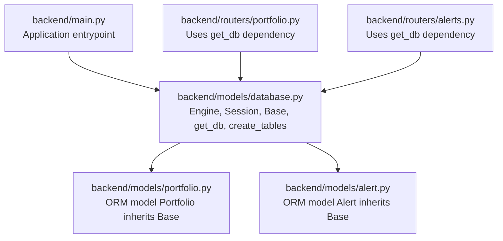
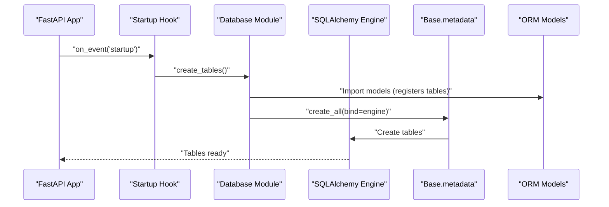
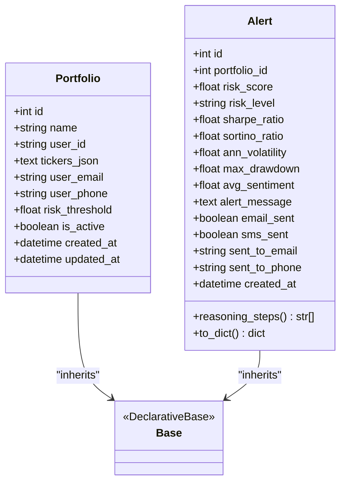
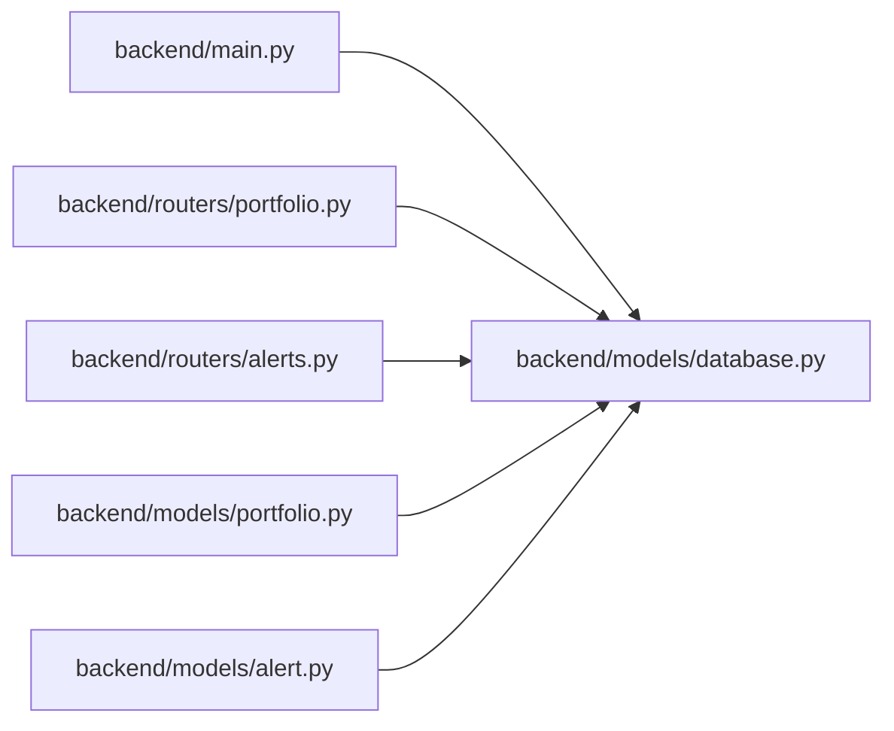

# Database Configuration

<cite>
**Referenced Files in This Document**
- [database.py](file://backend/models/database.py)
- [main.py](file://backend/main.py)
- [portfolio.py](file://backend/models/portfolio.py)
- [alert.py](file://backend/models/alert.py)
- [portfolio.py](file://backend/routers/portfolio.py)
- [alerts.py](file://backend/routers/alerts.py)
- [requirements.txt](file://backend/requirements.txt)
- [README.md](file://README.md)
</cite>

## Table of Contents
1. [Introduction](#introduction)
2. [Project Structure](#project-structure)
3. [Core Components](#core-components)
4. [Architecture Overview](#architecture-overview)
5. [Detailed Component Analysis](#detailed-component-analysis)
6. [Dependency Analysis](#dependency-analysis)
7. [Performance Considerations](#performance-considerations)
8. [Security Considerations](#security-considerations)
9. [Troubleshooting Guide](#troubleshooting-guide)
10. [Conclusion](#conclusion)

## Introduction
This document explains the database configuration and SQLAlchemy engine setup used by the backend. It covers:
- Default SQLite configuration and how to switch to PostgreSQL
- Environment variable configuration and connection arguments
- Engine creation, session factory, and FastAPI dependency injection
- Application startup table initialization
- The declarative base pattern and model inheritance
- Connection pooling defaults and how to extend them
- Security considerations for production deployments

## Project Structure
The database configuration is centralized in a dedicated module and consumed by routers and the application startup routine.

**Diagram sources**
- [main.py:32-36](file://backend/main.py#L32-L36)
- [database.py:25-41](file://backend/models/database.py#L25-L41)
- [portfolio.py:16-34](file://backend/models/portfolio.py#L16-L34)
- [alert.py:14-43](file://backend/models/alert.py#L14-L43)
- [portfolio.py:51](file://backend/routers/portfolio.py#L51)
- [alerts.py:26](file://backend/routers/alerts.py#L26)

**Section sources**
- [main.py:1-59](file://backend/main.py#L1-L59)
- [database.py:1-42](file://backend/models/database.py#L1-L42)

## Core Components
- Database URL configuration with environment variable fallback to SQLite
- SQLite-specific connection argument for multi-threaded environments
- SQLAlchemy engine creation and session factory
- Declarative base class for ORM models
- FastAPI dependency for database sessions
- Application startup hook to initialize tables

Key implementation references:
- Database URL and connection arguments: [database.py:15-18](file://backend/models/database.py#L15-L18)
- Engine creation: [database.py:20](file://backend/models/database.py#L20)
- Session factory: [database.py:22](file://backend/models/database.py#L22)
- Declarative base: [database.py:25-26](file://backend/models/database.py#L25-L26)
- Dependency injection: [database.py:29-35](file://backend/models/database.py#L29-L35)
- Startup table creation: [database.py:38-41](file://backend/models/database.py#L38-L41)
- Application startup hook: [main.py:32-36](file://backend/main.py#L32-L36)

**Section sources**
- [database.py:15-41](file://backend/models/database.py#L15-L41)
- [main.py:32-36](file://backend/main.py#L32-L36)

## Architecture Overview
The database architecture follows a standard FastAPI + SQLAlchemy pattern:
- Centralized engine and session factory in a single module
- Models inherit from a shared declarative base
- Routers depend on a database session via a FastAPI dependency
- Tables are created at application startup

**Diagram sources**
- [main.py:32-36](file://backend/main.py#L32-L36)
- [database.py:38-41](file://backend/models/database.py#L38-L41)

## Detailed Component Analysis

### Database URL Configuration and Environment Variables
- Default database URL falls back to SQLite when the environment variable is not set.
- Switching to PostgreSQL requires setting the environment variable accordingly.
- Example development and production URLs are documented in the module.

Implementation references:
- Environment variable usage and default: [database.py:15](file://backend/models/database.py#L15)
- Documentation comments for URL formats: [database.py:7-8](file://backend/models/database.py#L7-L8)

Operational guidance:
- Development: Use the default SQLite URL for zero-configuration local development.
- Production: Set the environment variable to a PostgreSQL URL for managed databases.

**Section sources**
- [database.py:7-8](file://backend/models/database.py#L7-L8)
- [database.py:15](file://backend/models/database.py#L15)

### SQLite Multi-threading and Connection Arguments
- SQLite requires a special connection argument to allow multi-threaded usage in FastAPI.
- The argument is conditionally applied when the database URL starts with the SQLite scheme.

Implementation references:
- Conditional connection argument: [database.py:17-18](file://backend/models/database.py#L17-L18)

Operational guidance:
- No action needed for SQLite; the argument is automatically configured.
- For other databases, the argument dictionary remains empty.

**Section sources**
- [database.py:17-18](file://backend/models/database.py#L17-L18)

### Engine Creation and Session Factory
- The engine is created from the database URL and connection arguments.
- Echo is disabled for production-grade logging.
- A session factory is created bound to the engine.

Implementation references:
- Engine creation: [database.py:20](file://backend/models/database.py#L20)
- Session factory: [database.py:22](file://backend/models/database.py#L22)

Operational guidance:
- The engine and session factory are global singletons used by all requests.
- No additional pooling parameters are configured in this module.

**Section sources**
- [database.py:20](file://backend/models/database.py#L20)
- [database.py:22](file://backend/models/database.py#L22)

### Declarative Base and Model Inheritance Pattern
- A shared declarative base class is defined for all ORM models.
- Models inherit from this base to participate in metadata and table creation.

Implementation references:
- Declarative base class: [database.py:25-26](file://backend/models/database.py#L25-L26)
- Portfolio model inheriting Base: [portfolio.py:13](file://backend/models/portfolio.py#L13)
- Alert model inheriting Base: [alert.py:11](file://backend/models/alert.py#L11)

Operational guidance:
- All new models should inherit from the shared base to ensure they are included in table creation.

**Section sources**
- [database.py:25-26](file://backend/models/database.py#L25-L26)
- [portfolio.py:13](file://backend/models/portfolio.py#L13)
- [alert.py:11](file://backend/models/alert.py#L11)

### FastAPI Dependency Injection Pattern
- A dependency function provides a database session for each request.
- The session is closed in a finally block to ensure cleanup.

Implementation references:
- Dependency function: [database.py:29-35](file://backend/models/database.py#L29-L35)
- Router usage of dependency: [portfolio.py:51](file://backend/routers/portfolio.py#L51), [alerts.py:26](file://backend/routers/alerts.py#L26)

Operational guidance:
- Routers should accept a session parameter typed as the SQLAlchemy Session to leverage automatic dependency injection.

**Section sources**
- [database.py:29-35](file://backend/models/database.py#L29-L35)
- [portfolio.py:51](file://backend/routers/portfolio.py#L51)
- [alerts.py:26](file://backend/routers/alerts.py#L26)

### Database Initialization on Application Startup
- On application startup, all registered models are imported and tables are created.
- This ensures the database schema is ready before serving requests.

Implementation references:
- Startup hook: [main.py:32-36](file://backend/main.py#L32-L36)
- Table creation function: [database.py:38-41](file://backend/models/database.py#L38-L41)

Operational guidance:
- Ensure all models are imported before calling table creation.
- This mechanism runs once at startup; subsequent runs will not recreate existing tables.

**Section sources**
- [main.py:32-36](file://backend/main.py#L32-L36)
- [database.py:38-41](file://backend/models/database.py#L38-L41)

### Example Configurations: SQLite vs PostgreSQL
- SQLite (default): Zero-configuration local development
- PostgreSQL: Managed database for production

Implementation references:
- URL documentation: [database.py:7-8](file://backend/models/database.py#L7-L8)
- Environment variable usage: [database.py:15](file://backend/models/database.py#L15)

Operational guidance:
- Set the environment variable to a PostgreSQL URL to enable PostgreSQL.
- Ensure the database server is reachable and credentials are valid.

**Section sources**
- [database.py:7-8](file://backend/models/database.py#L7-L8)
- [database.py:15](file://backend/models/database.py#L15)

### Data Models Overview
Two primary models demonstrate the declarative base pattern and typical ORM usage.

**Diagram sources**
- [database.py:25-26](file://backend/models/database.py#L25-L26)
- [portfolio.py:16-34](file://backend/models/portfolio.py#L16-L34)
- [alert.py:14-77](file://backend/models/alert.py#L14-L77)

**Section sources**
- [portfolio.py:16-34](file://backend/models/portfolio.py#L16-L34)
- [alert.py:14-77](file://backend/models/alert.py#L14-L77)

## Dependency Analysis
- The application depends on the database module for engine, sessions, and table creation.
- Routers depend on the database dependency function for per-request sessions.
- Models depend on the declarative base for metadata registration.

**Diagram sources**
- [main.py:32-36](file://backend/main.py#L32-L36)
- [database.py:29-41](file://backend/models/database.py#L29-L41)
- [portfolio.py:51](file://backend/routers/portfolio.py#L51)
- [alerts.py:26](file://backend/routers/alerts.py#L26)
- [portfolio.py:13](file://backend/models/portfolio.py#L13)
- [alert.py:11](file://backend/models/alert.py#L11)

**Section sources**
- [main.py:32-36](file://backend/main.py#L32-L36)
- [database.py:29-41](file://backend/models/database.py#L29-L41)
- [portfolio.py:51](file://backend/routers/portfolio.py#L51)
- [alerts.py:26](file://backend/routers/alerts.py#L26)
- [portfolio.py:13](file://backend/models/portfolio.py#L13)
- [alert.py:11](file://backend/models/alert.py#L11)

## Performance Considerations
- Connection pooling: The current engine does not configure explicit pooling parameters. SQLAlchemy uses default settings, which are suitable for development but may require tuning for production.
- Recommendations:
  - Configure pool_size and max_overflow for PostgreSQL in production.
  - Enable pool_recycle and pool_pre_ping for robust connection lifecycle management.
  - Monitor connection usage and adjust parameters based on concurrent request patterns.

[No sources needed since this section provides general guidance]

## Security Considerations
- Connection encryption:
  - For PostgreSQL, use a secure connection URL scheme and ensure the server supports TLS.
  - Consider adding SSL parameters in the connection arguments if required by your deployment.
- Credential management:
  - Store database credentials in environment variables.
  - Avoid committing secrets to version control.
  - Use platform-specific secret management in production deployments.
- Access control:
  - Limit database user privileges to the minimum required by the application.
  - Restrict network access to the database server.

[No sources needed since this section provides general guidance]

## Troubleshooting Guide
Common issues and resolutions:
- SQLite threading errors:
  - Symptom: Operational errors related to thread affinity.
  - Resolution: Ensure the environment variable is set to a PostgreSQL URL or rely on the automatic connection argument for SQLite.
  - Reference: [database.py:17-18](file://backend/models/database.py#L17-L18)
- Missing tables:
  - Symptom: Operational errors indicating missing tables.
  - Resolution: Verify the startup hook runs and imports all models before table creation.
  - References: [main.py:32-36](file://backend/main.py#L32-L36), [database.py:38-41](file://backend/models/database.py#L38-L41)
- Session lifecycle:
  - Symptom: Resource leaks or stale sessions.
  - Resolution: Ensure the dependency closes the session in a finally block.
  - Reference: [database.py:29-35](file://backend/models/database.py#L29-L35)
- Router dependency usage:
  - Symptom: Type errors or missing session.
  - Resolution: Accept a Session parameter with the dependency in routers.
  - References: [portfolio.py:51](file://backend/routers/portfolio.py#L51), [alerts.py:26](file://backend/routers/alerts.py#L26)

**Section sources**
- [database.py:17-18](file://backend/models/database.py#L17-L18)
- [main.py:32-36](file://backend/main.py#L32-L36)
- [database.py:29-35](file://backend/models/database.py#L29-L35)
- [portfolio.py:51](file://backend/routers/portfolio.py#L51)
- [alerts.py:26](file://backend/routers/alerts.py#L26)

## Conclusion
The database configuration provides a clean, minimal setup for both development and production:
- Defaults to SQLite for easy local development
- Supports PostgreSQL with environment variable configuration
- Uses a declarative base and dependency injection for consistent session management
- Initializes tables at startup to ensure schema readiness

For production, extend the engine configuration with appropriate pooling and security settings, and manage credentials securely.