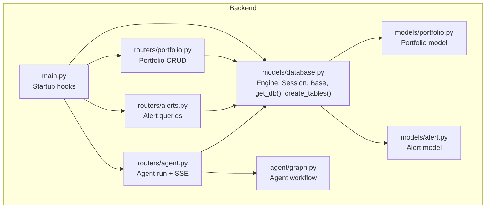
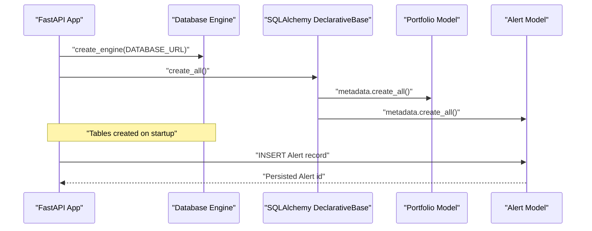
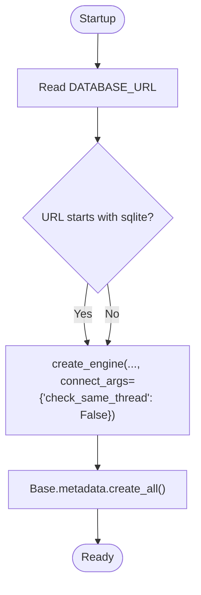
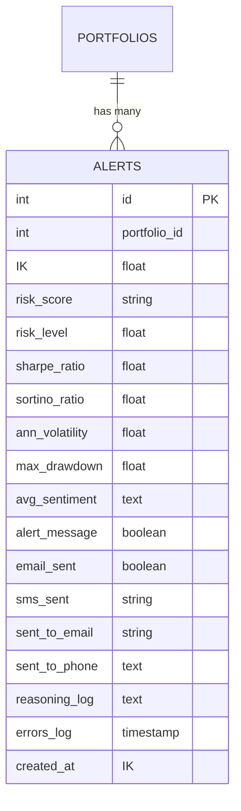
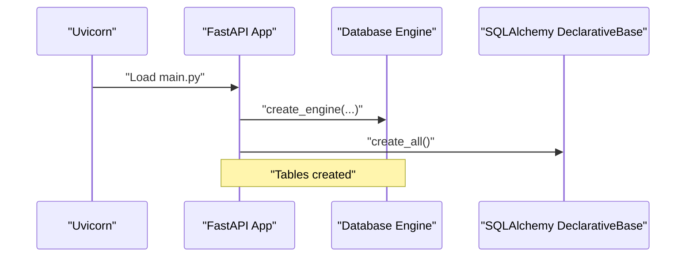
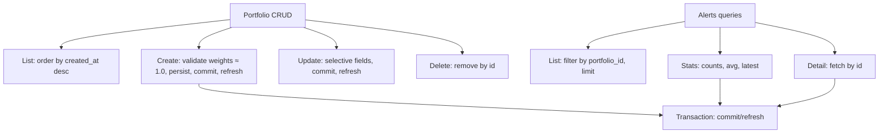
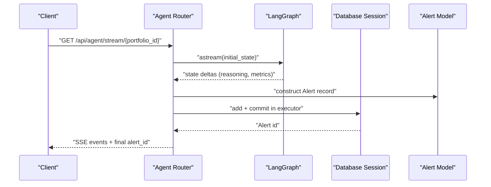
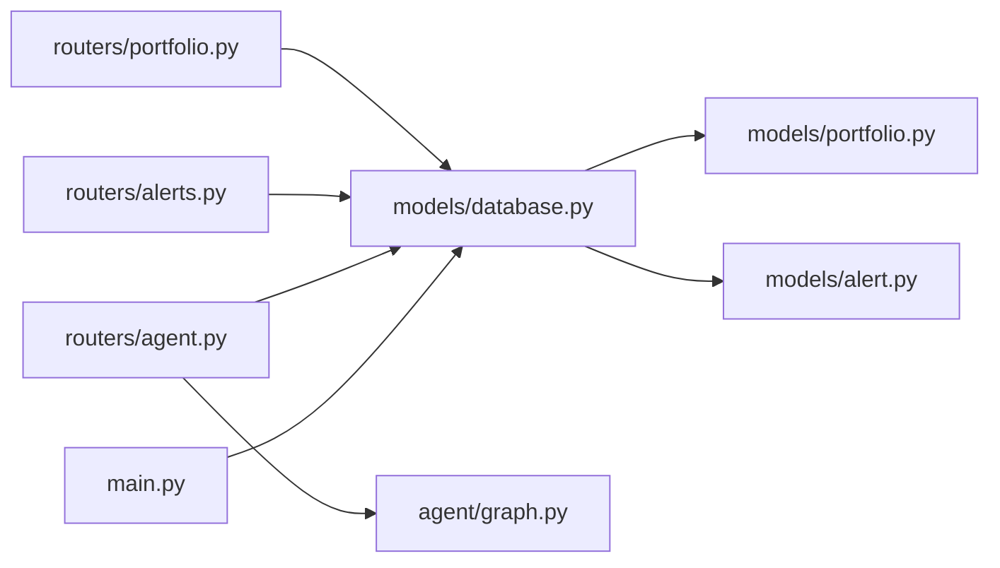

# Database Layer

<cite>
**Referenced Files in This Document**
- [database.py](file://backend/models/database.py)
- [portfolio.py](file://backend/models/portfolio.py)
- [alert.py](file://backend/models/alert.py)
- [main.py](file://backend/main.py)
- [portfolio.py](file://backend/routers/portfolio.py)
- [alerts.py](file://backend/routers/alerts.py)
- [agent.py](file://backend/routers/agent.py)
- [graph.py](file://backend/agent/graph.py)
- [README.md](file://README.md)
</cite>

## Table of Contents
1. [Introduction](#introduction)
2. [Project Structure](#project-structure)
3. [Core Components](#core-components)
4. [Architecture Overview](#architecture-overview)
5. [Detailed Component Analysis](#detailed-component-analysis)
6. [Dependency Analysis](#dependency-analysis)
7. [Performance Considerations](#performance-considerations)
8. [Troubleshooting Guide](#troubleshooting-guide)
9. [Conclusion](#conclusion)
10. [Appendices](#appendices)

## Introduction
This document describes the database layer built with SQLAlchemy ORM in the backend. It covers engine and session configuration, table creation on startup, models and relationships, indexes, and operational aspects such as transactions, bulk operations, security, and monitoring. It also documents how the agent writes alert records and how the frontend consumes alert history.

## Project Structure
The database layer is organized around a small set of modules:
- Engine and session factory are defined centrally.
- Two ORM models represent portfolios and alerts.
- Application startup triggers table creation.
- Routers orchestrate CRUD and read operations against the models.
- The agent writes alert records after computing risk.



**Diagram sources**
- [main.py:32-35](file://backend/main.py#L32-L35)
- [database.py:25-41](file://backend/models/database.py#L25-L41)
- [portfolio.py:16-63](file://backend/models/portfolio.py#L16-L63)
- [alert.py:14-77](file://backend/models/alert.py#L14-L77)
- [portfolio.py:50-123](file://backend/routers/portfolio.py#L50-L123)
- [alerts.py:22-83](file://backend/routers/alerts.py#L22-L83)
- [agent.py:39-242](file://backend/routers/agent.py#L39-L242)
- [graph.py:162-203](file://backend/agent/graph.py#L162-L203)

**Section sources**
- [main.py:32-35](file://backend/main.py#L32-L35)
- [database.py:25-41](file://backend/models/database.py#L25-L41)

## Core Components
- Engine and sessions
  - Centralized engine creation with DATABASE_URL environment variable defaults to a local SQLite file.
  - Session factory configured for autocommit and autoflush disabled.
  - FastAPI dependency provides per-request sessions and ensures closure.
- Table creation
  - Startup hook invokes metadata creation to ensure tables exist before serving requests.
- Models
  - Portfolio: stores user portfolio configuration with JSON-based ticker weights and user contact info.
  - Alert: stores risk metrics, delivery flags, reasoning logs, and timestamps.

**Section sources**
- [database.py:15-22](file://backend/models/database.py#L15-L22)
- [database.py:29-35](file://backend/models/database.py#L29-L35)
- [database.py:38-41](file://backend/models/database.py#L38-L41)
- [portfolio.py:16-63](file://backend/models/portfolio.py#L16-L63)
- [alert.py:14-77](file://backend/models/alert.py#L14-L77)

## Architecture Overview
The runtime flow for creating tables and writing alerts is as follows:



**Diagram sources**
- [main.py:32-35](file://backend/main.py#L32-L35)
- [database.py:38-41](file://backend/models/database.py#L38-L41)
- [alert.py:14-77](file://backend/models/alert.py#L14-L77)

## Detailed Component Analysis

### Database Configuration and Session Management
- Engine setup
  - Reads DATABASE_URL from environment; defaults to SQLite for zero-config development.
  - For SQLite, passes a connection argument to disable thread checks for multi-threaded environments.
- Session factory
  - Autocommit disabled; autoflush disabled; bound to engine.
- Dependency provider
  - Yields a session per request and closes it in a finally block.
- Table creation
  - Called at startup to ensure all models are represented in the database.



**Diagram sources**
- [database.py:15-22](file://backend/models/database.py#L15-L22)
- [database.py:38-41](file://backend/models/database.py#L38-L41)

**Section sources**
- [database.py:15-22](file://backend/models/database.py#L15-L22)
- [database.py:29-35](file://backend/models/database.py#L29-L35)
- [database.py:38-41](file://backend/models/database.py#L38-L41)
- [main.py:32-35](file://backend/main.py#L32-L35)

### Portfolio Model
- Purpose
  - Stores user-defined portfolios with a human-friendly name, associated user identifier, and JSON-encoded ticker weights.
- Key fields
  - Identifier, name, user_id, tickers stored as JSON, optional user contact, risk threshold, activation flag, timestamps.
- JSON handling
  - Property converts JSON string to dict and setter serializes dict to JSON.
- Indexes
  - Primary key index on id; secondary index on user_id for filtering by user.

```mermaid
erDiagram
PORTFOLIOS {
int id PK
string name
string user_id IK
text tickers_json
string user_email
string user_phone
float risk_threshold
boolean is_active
timestamp created_at
timestamp updated_at
}
```

**Diagram sources**
- [portfolio.py:19-34](file://backend/models/portfolio.py#L19-L34)

**Section sources**
- [portfolio.py:16-63](file://backend/models/portfolio.py#L16-L63)

### Alert Model
- Purpose
  - Persists every alert run with risk metrics, delivery flags, and full reasoning/log for UI.
- Key fields
  - Foreign key to Portfolio, risk metrics, alert delivery flags, recipient addresses, reasoning log, errors log, timestamps.
- JSON handling
  - Property exposes reasoning steps as a list; setter serializes list to JSON.
- Indexes
  - Primary key index on id; secondary index on portfolio_id; secondary index on created_at for chronological queries.



**Diagram sources**
- [alert.py:17-42](file://backend/models/alert.py#L17-L42)
- [portfolio.py:19-21](file://backend/models/portfolio.py#L19-L21)

**Section sources**
- [alert.py:14-77](file://backend/models/alert.py#L14-L77)

### Relationships, Constraints, and Indexing
- Relationship
  - Alerts belong to a Portfolio via portfolio_id foreign key.
- Constraints
  - Primary keys are implicit via SQLAlchemy ORM Column definitions.
  - Not-null constraints are applied on risk_score, risk_level, and related fields.
- Indexes
  - Primary key indices are implicit.
  - Additional indices declared on user_id (Portfolio), portfolio_id (Alert), and created_at (Alert).

**Section sources**
- [portfolio.py:21](file://backend/models/portfolio.py#L21)
- [alert.py:18](file://backend/models/alert.py#L18)
- [alert.py:42](file://backend/models/alert.py#L42)

### Table Creation and Application Startup
- On startup, the application creates all tables defined by the declarative Base.
- The routers import models to ensure their metadata participates in table creation.



**Diagram sources**
- [main.py:32-35](file://backend/main.py#L32-L35)
- [database.py:38-41](file://backend/models/database.py#L38-L41)

**Section sources**
- [main.py:32-35](file://backend/main.py#L32-L35)
- [database.py:38-41](file://backend/models/database.py#L38-L41)

### Query Patterns and Transactions
- Portfolio CRUD
  - Listing: orders by created_at descending.
  - Creation: validates weights approximately sum to 1.0; persists and refreshes.
  - Updates: selective field updates; commits and refreshes.
  - Deletion: removes by id.
- Alerts queries
  - Listing: supports portfolio-scoped filtering and pagination via limit.
  - Detail retrieval: returns full reasoning log and errors.
  - Stats aggregation: counts by risk level, delivery flags, average risk score, and latest run.
- Transactions
  - Per-request sessions commit or rollback via explicit commit and refresh.
  - Agent writes use a dedicated executor-backed session to avoid blocking async loops.



**Diagram sources**
- [portfolio.py:50-123](file://backend/routers/portfolio.py#L50-L123)
- [alerts.py:22-83](file://backend/routers/alerts.py#L22-L83)
- [agent.py:171-181](file://backend/routers/agent.py#L171-L181)

**Section sources**
- [portfolio.py:50-123](file://backend/routers/portfolio.py#L50-L123)
- [alerts.py:22-83](file://backend/routers/alerts.py#L22-L83)
- [agent.py:171-181](file://backend/routers/agent.py#L171-L181)

### Agent Writes Alerts
- The agent computes risk and optionally sends alerts.
- After computation, it constructs an Alert record and persists it.
- For SSE streaming, persistence runs in a thread pool executor to keep the async loop responsive.



**Diagram sources**
- [agent.py:39-168](file://backend/routers/agent.py#L39-L168)
- [agent.py:171-181](file://backend/routers/agent.py#L171-L181)
- [alert.py:14-77](file://backend/models/alert.py#L14-L77)

**Section sources**
- [agent.py:39-168](file://backend/routers/agent.py#L39-L168)
- [agent.py:171-181](file://backend/routers/agent.py#L171-L181)
- [graph.py:162-203](file://backend/agent/graph.py#L162-L203)

## Dependency Analysis
- Coupling
  - Routers depend on models and the session dependency provider.
  - Agent router depends on the compiled graph and writes to Alert.
- Cohesion
  - Models encapsulate persistence and JSON helpers.
  - Database module centralizes engine/session concerns.
- External dependencies
  - SQLAlchemy ORM and engine creation.
  - Environment-driven DATABASE_URL.



**Diagram sources**
- [database.py:25-41](file://backend/models/database.py#L25-L41)
- [portfolio.py:16-63](file://backend/models/portfolio.py#L16-L63)
- [alert.py:14-77](file://backend/models/alert.py#L14-L77)
- [portfolio.py:50-123](file://backend/routers/portfolio.py#L50-L123)
- [alerts.py:22-83](file://backend/routers/alerts.py#L22-L83)
- [agent.py:39-242](file://backend/routers/agent.py#L39-L242)
- [graph.py:162-203](file://backend/agent/graph.py#L162-L203)
- [main.py:32-35](file://backend/main.py#L32-L35)

**Section sources**
- [database.py:25-41](file://backend/models/database.py#L25-L41)
- [portfolio.py:50-123](file://backend/routers/portfolio.py#L50-L123)
- [alerts.py:22-83](file://backend/routers/alerts.py#L22-L83)
- [agent.py:39-242](file://backend/routers/agent.py#L39-L242)
- [graph.py:162-203](file://backend/agent/graph.py#L162-L203)
- [main.py:32-35](file://backend/main.py#L32-L35)

## Performance Considerations
- Indexing
  - Secondary indexes on user_id (Portfolio), portfolio_id (Alert), and created_at (Alert) support filtering and chronological ordering.
- Query patterns
  - Prefer filtered queries with limits for alert listing to avoid scanning entire histories.
  - Use selectivity-aware filters (portfolio_id) to reduce result sets.
- Bulk operations
  - No explicit bulk inserts observed; consider bulk operations for high-volume ingestion scenarios.
- Transaction management
  - Keep transactions short; commit immediately after writes to reduce lock contention.
- Asynchronous writes
  - Executor-based persistence for SSE prevents blocking the async event loop.

[No sources needed since this section provides general guidance]

## Troubleshooting Guide
- Database URL misconfiguration
  - Ensure DATABASE_URL is set appropriately; defaults to a local SQLite file.
- Table creation failures
  - Verify startup hook executes and that models are imported before metadata creation.
- Session lifecycle
  - Sessions are closed after each request; ensure no long-lived references are kept outside request scope.
- SQLite threading
  - For SQLite, the engine is configured to allow multi-threaded access; avoid sharing sessions across threads.
- Alert persistence errors
  - When streaming, persistence occurs in an executor; errors are surfaced via SSE error events.

**Section sources**
- [database.py:15-22](file://backend/models/database.py#L15-L22)
- [database.py:29-35](file://backend/models/database.py#L29-L35)
- [database.py:38-41](file://backend/models/database.py#L38-L41)
- [agent.py:171-181](file://backend/routers/agent.py#L171-L181)

## Conclusion
The database layer uses a minimal, pragmatic SQLAlchemy setup with centralized engine/session configuration, declarative models, and startup-driven table creation. The Portfolio and Alert models capture the essential domain data, with JSON fields enabling flexible ticker storage and reasoning logs. Queries leverage indexes and filters to remain efficient, and asynchronous persistence avoids blocking the event stream. Security and migration practices are outlined in the appendices.

[No sources needed since this section summarizes without analyzing specific files]

## Appendices

### Database Security Considerations
- Connection encryption
  - For production PostgreSQL deployments, transport encryption is handled by the database provider; configure DATABASE_URL accordingly.
- Credential management
  - Store credentials in environment variables; avoid committing secrets to version control.
- Access control
  - Restrict database permissions to least privilege; separate read-only accounts for reporting endpoints if needed.

**Section sources**
- [database.py:15-22](file://backend/models/database.py#L15-L22)
- [README.md:86-93](file://README.md#L86-L93)

### Migration Procedures
- Current state
  - Tables are created on startup via metadata creation; no explicit Alembic migrations are present.
- Recommended approach
  - Initialize a migration environment and generate initial revision after confirming schema stability.
  - Use versioned migrations for subsequent schema changes; apply upgrades in deployment pipelines.

**Section sources**
- [database.py:38-41](file://backend/models/database.py#L38-L41)

### Backup and Recovery
- SQLite
  - Back up the SQLite file regularly; restore by replacing the file atomically.
- PostgreSQL
  - Use logical backups (e.g., SQL dumps) and test restores periodically.
- Monitoring
  - Track database connection counts, slow queries, and alert volume; integrate with platform monitoring.

**Section sources**
- [database.py:15-22](file://backend/models/database.py#L15-L22)

### Query Optimization Techniques
- Use indexes on frequently filtered columns (portfolio_id, user_id, created_at).
- Limit result sets for paginated lists; prefer offset-free designs if possible.
- Avoid N+1 selects by eager-loading related data when needed.
- Batch writes for high-throughput ingestion.

**Section sources**
- [portfolio.py:21](file://backend/models/portfolio.py#L21)
- [alert.py:18](file://backend/models/alert.py#L18)
- [alert.py:42](file://backend/models/alert.py#L42)

### Examples of Complex Queries and Aggregations
- Alerts statistics
  - Count by risk level and delivery flags; compute average risk score across all alerts; retrieve latest run timestamp.
- Portfolio-scoped alert history
  - Filter alerts by portfolio_id and limit results to recent entries.

**Section sources**
- [alerts.py:59-83](file://backend/routers/alerts.py#L59-L83)
- [alerts.py:43-56](file://backend/routers/alerts.py#L43-L56)