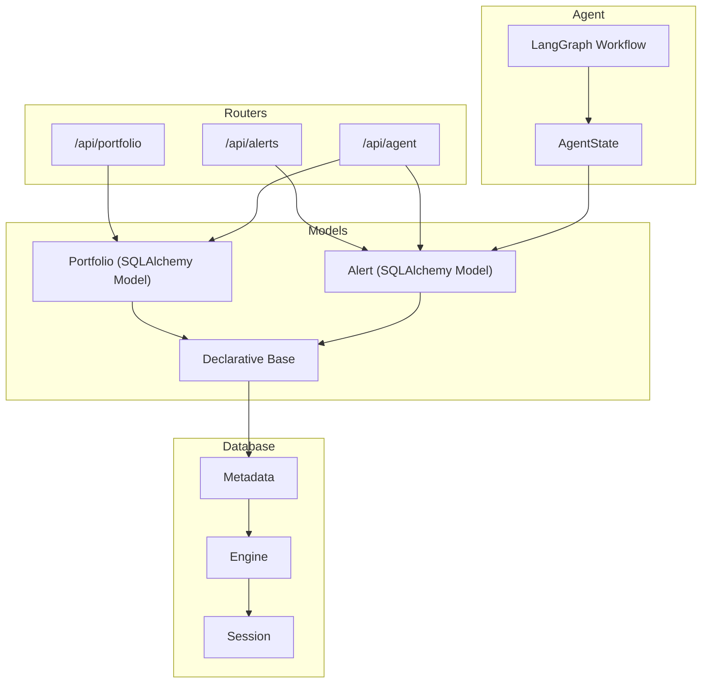
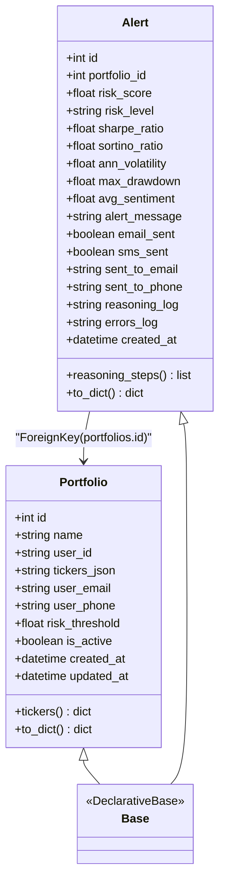
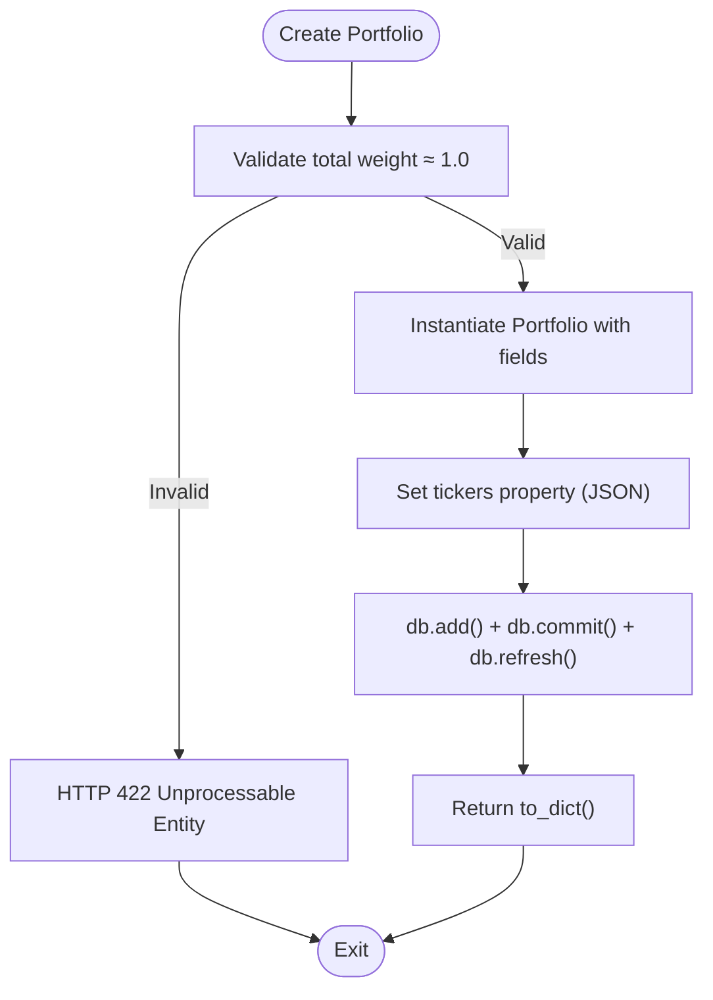
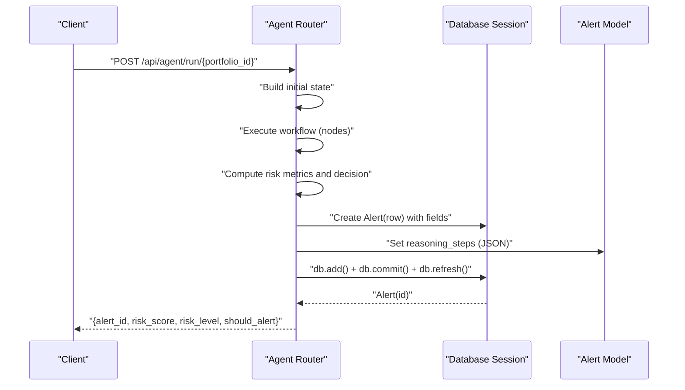
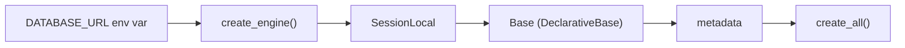
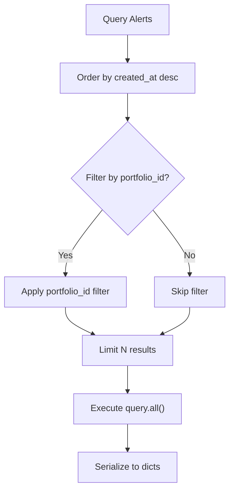
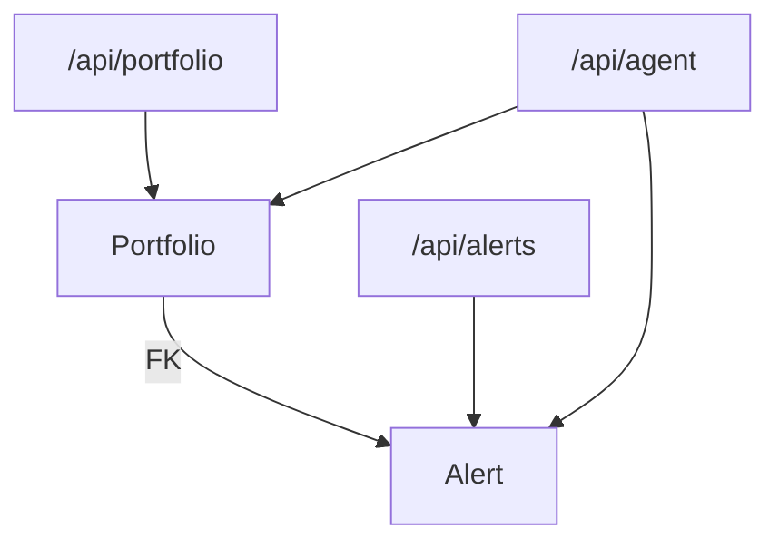

# ORM Models

<cite>
**Referenced Files in This Document**
- [portfolio.py](file://backend/models/portfolio.py)
- [alert.py](file://backend/models/alert.py)
- [database.py](file://backend/models/database.py)
- [portfolio.py](file://backend/routers/portfolio.py)
- [alerts.py](file://backend/routers/alerts.py)
- [agent.py](file://backend/routers/agent.py)
- [graph.py](file://backend/agent/graph.py)
- [state.py](file://backend/agent/state.py)
- [main.py](file://backend/main.py)
</cite>

## Table of Contents
1. [Introduction](#introduction)
2. [Project Structure](#project-structure)
3. [Core Components](#core-components)
4. [Architecture Overview](#architecture-overview)
5. [Detailed Component Analysis](#detailed-component-analysis)
6. [Dependency Analysis](#dependency-analysis)
7. [Performance Considerations](#performance-considerations)
8. [Troubleshooting Guide](#troubleshooting-guide)
9. [Conclusion](#conclusion)
10. [Appendices](#appendices)

## Introduction
This document provides comprehensive documentation for the SQLAlchemy ORM models used in the financial portfolio risk monitoring application. It focuses on two core entities:
- Portfolio: stores user-defined portfolios with ticker-weight allocations persisted as JSON, plus user contact preferences and risk thresholds.
- Alert: persists every alert run performed by the agent, including risk metrics, delivery status, reasoning logs, and timestamps.

The documentation covers model definitions, relationships, constraints, indexing, CRUD usage, query patterns, and operational considerations derived from the codebase.

## Project Structure
The models are defined under the backend models package and integrated with FastAPI routers and the agent pipeline.

**Diagram sources**
- [portfolio.py:16-63](file://backend/models/portfolio.py#L16-L63)
- [alert.py:14-77](file://backend/models/alert.py#L14-L77)
- [database.py:25-42](file://backend/models/database.py#L25-L42)
- [portfolio.py:50-123](file://backend/routers/portfolio.py#L50-L123)
- [alerts.py:22-84](file://backend/routers/alerts.py#L22-L84)
- [agent.py:39-242](file://backend/routers/agent.py#L39-L242)
- [graph.py:162-203](file://backend/agent/graph.py#L162-L203)
- [state.py:28-58](file://backend/agent/state.py#L28-L58)

**Section sources**
- [main.py:32-36](file://backend/main.py#L32-L36)
- [database.py:25-42](file://backend/models/database.py#L25-L42)

## Core Components
- Portfolio model
  - Purpose: Stores user portfolio configurations with JSON-based ticker-to-weight mapping, user contact fields, risk threshold, and timestamps.
  - Key fields: id, name, user_id, tickers_json, user_email, user_phone, risk_threshold, is_active, created_at, updated_at.
  - Indexes: primary key index on id; secondary indexes on user_id and created_at.
  - Helpers: property-based conversion between JSON string and dictionary for tickers, and a serialization helper to_dict().
- Alert model
  - Purpose: Persists every agent-run alert with risk metrics, delivery flags, reasoning logs, and timestamps.
  - Key fields: id, portfolio_id (foreign key to Portfolio), risk_score, risk_level, Sharpe/Sortino/volatility/max drawdown, alert_message, email_sent, sms_sent, sent_to_email, sent_to_phone, reasoning_log (JSON), errors_log (JSON), created_at.
  - Indexes: primary key index on id; secondary indexes on portfolio_id and created_at.
  - Helpers: property-based conversion between JSON string and list for reasoning_steps, and a serialization helper to_dict().

**Section sources**
- [portfolio.py:16-63](file://backend/models/portfolio.py#L16-L63)
- [alert.py:14-77](file://backend/models/alert.py#L14-L77)

## Architecture Overview
The models are built on a shared Declarative Base and use a single engine/session factory. Tables are created on application startup. The agent pipeline writes Alert records after computing risk and optionally sending notifications. Routers expose CRUD and read-only endpoints for Portfolio and Alert.

**Diagram sources**
- [portfolio.py:16-63](file://backend/models/portfolio.py#L16-L63)
- [alert.py:14-77](file://backend/models/alert.py#L14-L77)
- [database.py:25-26](file://backend/models/database.py#L25-L26)

## Detailed Component Analysis

### Portfolio Model
- Table metadata
  - Table name: portfolios
  - Columns and types:
    - id: Integer, primary key, indexed
    - name: String(120), not null, default "My Portfolio"
    - user_id: String(80), not null, default "admin", indexed
    - tickers_json: Text, not null, default "{}"
    - user_email: String(200), nullable
    - user_phone: String(30), nullable
    - risk_threshold: Float, not null, default 0.70
    - is_active: Boolean, not null, default True
    - created_at: DateTime, default UTC now
    - updated_at: DateTime, default UTC now, on update UTC now
  - Constraints:
    - Not-null constraints on name, user_id, tickers_json, risk_threshold, is_active
    - Default values for name, user_id, tickers_json, risk_threshold, is_active, created_at, updated_at
  - Indexing:
    - Primary key index on id
    - Secondary indexes on user_id and created_at
- Helper properties and methods
  - tickers property: JSON parsing of tickers_json into a dict; safe fallback to empty dict on decode errors
  - tickers setter: JSON serialization of dict into tickers_json
  - to_dict(): serializes model fields to a dictionary, including ISO-formatted timestamps
- Validation and usage
  - Weight validation occurs in the Portfolio router during creation to ensure weights approximately sum to 1.0
  - The model supports CRUD operations via FastAPI routers

**Diagram sources**
- [portfolio.py:56-77](file://backend/routers/portfolio.py#L56-L77)
- [portfolio.py:38-48](file://backend/models/portfolio.py#L38-L48)

**Section sources**
- [portfolio.py:16-63](file://backend/models/portfolio.py#L16-L63)
- [portfolio.py:56-77](file://backend/routers/portfolio.py#L56-L77)

### Alert Model
- Table metadata
  - Table name: alerts
  - Columns and types:
    - id: Integer, primary key, indexed
    - portfolio_id: Integer, foreign key to portfolios.id, indexed
    - risk_score: Float, not null
    - risk_level: String(10), not null ("LOW" | "MEDIUM" | "HIGH")
    - sharpe_ratio, sortino_ratio, ann_volatility, max_drawdown, avg_sentiment: Float, nullable
    - alert_message: Text, nullable
    - email_sent, sms_sent: Boolean, default False
    - sent_to_email: String(200), nullable
    - sent_to_phone: String(30), nullable
    - reasoning_log: Text, nullable (JSON list of strings)
    - errors_log: Text, nullable (JSON list)
    - created_at: DateTime, default UTC now, indexed
  - Constraints:
    - Not-null constraints on risk_score, risk_level
    - Foreign key constraint portfolio_id -> portfolios.id
  - Indexing:
    - Primary key index on id
    - Secondary indexes on portfolio_id and created_at
- Helper properties and methods
  - reasoning_steps property: JSON parsing of reasoning_log into a list; safe fallback to empty list on decode errors
  - reasoning_steps setter: JSON serialization of list into reasoning_log
  - to_dict(): serializes model fields to a dictionary, including ISO-formatted timestamps and parsed JSON lists
- Persistence lifecycle
  - Alerts are created by the agent router after running the workflow and computing risk metrics
  - The agent sets delivery flags based on user contact and risk level, then persists the Alert record

**Diagram sources**
- [agent.py:186-232](file://backend/routers/agent.py#L186-L232)
- [alert.py:14-77](file://backend/models/alert.py#L14-L77)

**Section sources**
- [alert.py:14-77](file://backend/models/alert.py#L14-L77)
- [agent.py:186-232](file://backend/routers/agent.py#L186-L232)

### Declarative Base and Database Configuration
- Base class
  - A minimal DeclarativeBase subclass used by both models
- Engine and session
  - Engine configured from DATABASE_URL environment variable with SQLite as default
  - SQLite requires check_same_thread=False for multi-threaded environments
  - SessionLocal sessionmaker bound to the engine
- Table creation
  - create_tables() creates all tables by importing model modules and calling Base.metadata.create_all()

**Diagram sources**
- [database.py:15-42](file://backend/models/database.py#L15-L42)

**Section sources**
- [database.py:15-42](file://backend/models/database.py#L15-L42)
- [main.py:32-36](file://backend/main.py#L32-L36)

### CRUD Operations and Query Patterns
- Portfolio CRUD
  - List: GET /api/portfolio (ordered by created_at desc)
  - Create: POST /api/portfolio (validates weight sum ≈ 1.0)
  - Retrieve: GET /api/portfolio/{id}
  - Update: PUT /api/portfolio/{id}
  - Delete: DELETE /api/portfolio/{id}
- Alert queries
  - List all: GET /api/alerts (optionally filtered by portfolio_id and limited)
  - Detail: GET /api/alerts/detail/{alert_id}
  - Portfolio alerts: GET /api/alerts/portfolio/{portfolio_id}
  - Stats: GET /api/alerts/stats (aggregates counts and average risk score)
- Query patterns
  - Ordering by created_at desc for recent-first views
  - Filtering by portfolio_id for portfolio-scoped queries
  - Aggregation counts for risk level distribution and delivery statistics

**Diagram sources**
- [alerts.py:22-56](file://backend/routers/alerts.py#L22-L56)

**Section sources**
- [portfolio.py:50-123](file://backend/routers/portfolio.py#L50-L123)
- [alerts.py:22-84](file://backend/routers/alerts.py#L22-L84)

## Dependency Analysis
- Model relationships
  - Alert.portfolio_id references Portfolio.id (foreign key)
  - No explicit backref is defined; reverse navigation would require a relationship declaration
- Coupling and cohesion
  - Models are cohesive around their domain concerns and depend on the shared Base
  - Routers depend on models for persistence and expose standardized endpoints
  - Agent pipeline depends on Alert model for persistence after workflow completion
- External dependencies
  - SQLAlchemy for ORM and database abstraction
  - JSON serialization/deserialization for embedded arrays and dictionaries
  - FastAPI for routing and dependency injection

**Diagram sources**
- [portfolio.py:16-63](file://backend/models/portfolio.py#L16-L63)
- [alert.py:14-77](file://backend/models/alert.py#L14-L77)
- [portfolio.py:50-123](file://backend/routers/portfolio.py#L50-L123)
- [alerts.py:22-84](file://backend/routers/alerts.py#L22-L84)
- [agent.py:39-242](file://backend/routers/agent.py#L39-L242)

**Section sources**
- [portfolio.py:16-63](file://backend/models/portfolio.py#L16-L63)
- [alert.py:14-77](file://backend/models/alert.py#L14-L77)

## Performance Considerations
- Indexing strategy
  - Primary key indexes on id are implicit and efficient for equality filters
  - Additional indexes on user_id, portfolio_id, and created_at support frequent filtering and ordering
- Query patterns
  - Ordering by created_at desc is common; ensure created_at is indexed (already indexed)
  - Filtering by portfolio_id is used in alert queries; ensure portfolio_id is indexed (already indexed)
- JSON fields
  - tickers_json and reasoning_log are stored as Text; parsing occurs in Python; consider JSONB for PostgreSQL if future migrations are introduced
- Concurrency
  - SQLite engine uses check_same_thread=False for multi-threaded environments; production-grade deployments should consider PostgreSQL
- Batch operations
  - Alerts are inserted individually; batch inserts could reduce overhead if throughput increases

[No sources needed since this section provides general guidance]

## Troubleshooting Guide
- JSON parsing errors
  - tickers property safely falls back to an empty dict if JSON is malformed
  - reasoning_steps property safely falls back to an empty list if JSON is malformed
- Validation failures
  - Portfolio creation enforces weight sum ≈ 1.0; adjust weights accordingly
- Missing records
  - Queries returning None raise HTTP 404; ensure IDs exist before querying
- Timestamp handling
  - created_at and updated_at use UTC; ensure client-side handling aligns with ISO format serialization

**Section sources**
- [portfolio.py:38-48](file://backend/models/portfolio.py#L38-L48)
- [alert.py:46-55](file://backend/models/alert.py#L46-L55)
- [portfolio.py:58-65](file://backend/routers/portfolio.py#L58-L65)
- [portfolio.py:82-85](file://backend/routers/portfolio.py#L82-L85)
- [alerts.py:37-40](file://backend/routers/alerts.py#L37-L40)

## Conclusion
The Portfolio and Alert models provide a clear, JSON-backed representation of portfolio configurations and risk alert history. They integrate seamlessly with FastAPI routers and the agent pipeline, enabling real-time risk analysis and persistent audit trails. The design balances simplicity with extensibility, leveraging SQLAlchemy’s ORM capabilities and JSON serialization for flexible data structures.

[No sources needed since this section summarizes without analyzing specific files]

## Appendices

### Model Field Definitions and Constraints
- Portfolio
  - id: Integer, primary key, index
  - name: String(120), not null, default "My Portfolio"
  - user_id: String(80), not null, default "admin", index
  - tickers_json: Text, not null, default "{}"
  - user_email: String(200), nullable
  - user_phone: String(30), nullable
  - risk_threshold: Float, not null, default 0.70
  - is_active: Boolean, not null, default True
  - created_at: DateTime, default UTC now
  - updated_at: DateTime, default UTC now, on update UTC now
- Alert
  - id: Integer, primary key, index
  - portfolio_id: Integer, foreign key portfolios.id, index
  - risk_score: Float, not null
  - risk_level: String(10), not null ("LOW" | "MEDIUM" | "HIGH")
  - sharpe_ratio: Float, nullable
  - sortino_ratio: Float, nullable
  - ann_volatility: Float, nullable
  - max_drawdown: Float, nullable
  - avg_sentiment: Float, nullable
  - alert_message: Text, nullable
  - email_sent: Boolean, default False
  - sms_sent: Boolean, default False
  - sent_to_email: String(200), nullable
  - sent_to_phone: String(30), nullable
  - reasoning_log: Text, nullable (JSON list)
  - errors_log: Text, nullable (JSON list)
  - created_at: DateTime, default UTC now, index

**Section sources**
- [portfolio.py:16-63](file://backend/models/portfolio.py#L16-L63)
- [alert.py:14-77](file://backend/models/alert.py#L14-L77)

### Instantiation and CRUD Examples
- Instantiate Portfolio
  - Use constructor with name, user_email, user_phone, risk_threshold
  - Assign tickers as a dict; the property handles JSON serialization
  - Commit and refresh via SQLAlchemy session
- CRUD endpoints
  - List portfolios: GET /api/portfolio
  - Create portfolio: POST /api/portfolio with validated weights
  - Get portfolio: GET /api/portfolio/{id}
  - Update portfolio: PUT /api/portfolio/{id}
  - Delete portfolio: DELETE /api/portfolio/{id}
- Alert persistence
  - After agent run, construct Alert with computed fields and reasoning steps
  - Persist via db.add(), db.commit(), db.refresh()

**Section sources**
- [portfolio.py:56-123](file://backend/routers/portfolio.py#L56-L123)
- [agent.py:128-158](file://backend/routers/agent.py#L128-L158)

### Complex Queries, Joins, and Aggregations
- Portfolio-scoped alerts
  - Filter alerts by portfolio_id and order by created_at desc
- Statistics aggregation
  - Count alerts by risk level
  - Count delivered emails and SMS
  - Average risk score across all alerts
  - Latest run timestamp

**Section sources**
- [alerts.py:43-84](file://backend/routers/alerts.py#L43-L84)

### Migration Procedures and Schema Evolution
- Current state
  - Tables are created on startup via Base.metadata.create_all()
  - No Alembic migrations are present in the repository
- Recommended approach
  - Introduce Alembic for controlled schema evolution
  - Generate initial revision from existing Base metadata
  - Add indexes and constraints incrementally
  - Use JSONB for reasoning_log and errors_log if moving to PostgreSQL
- Operational safety
  - Back up database before migrations
  - Test migrations in staging environment
  - Preserve backward compatibility for JSON fields

[No sources needed since this section provides general guidance]