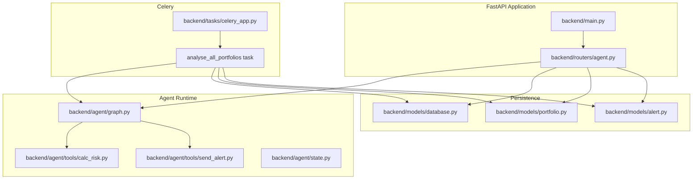
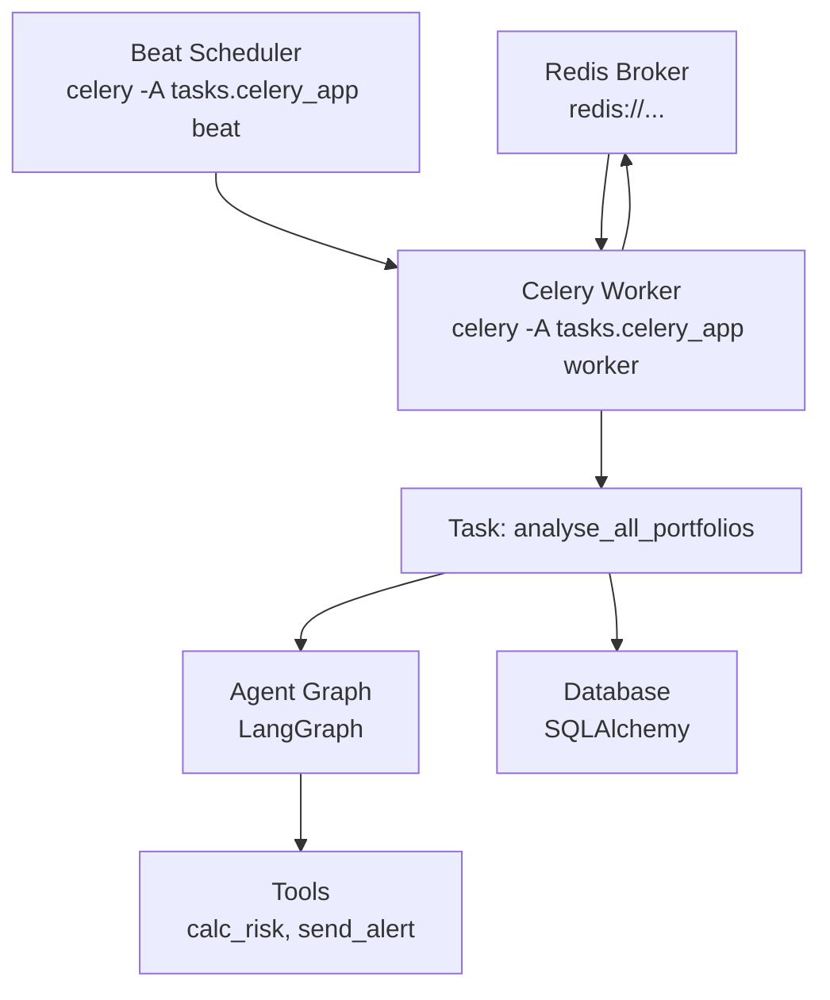
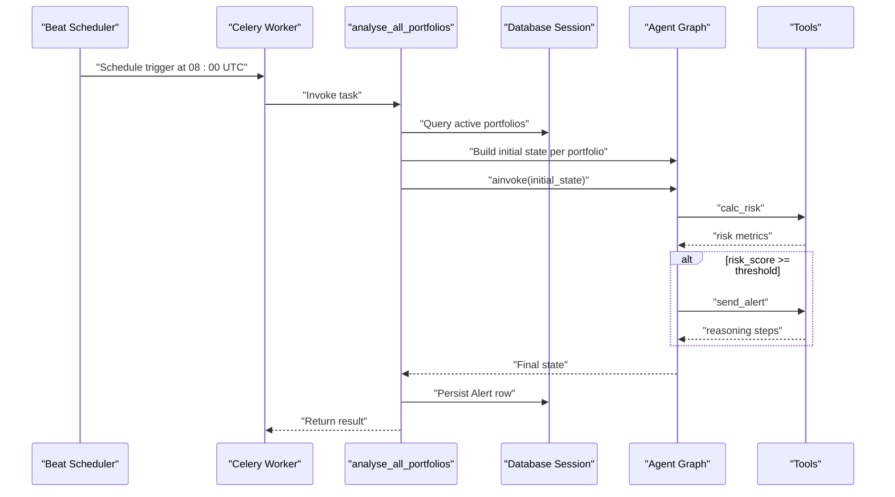
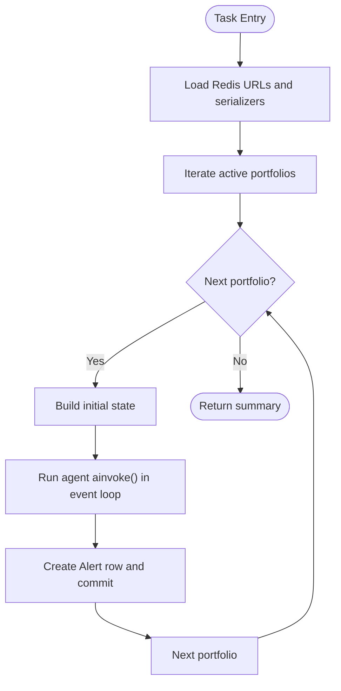
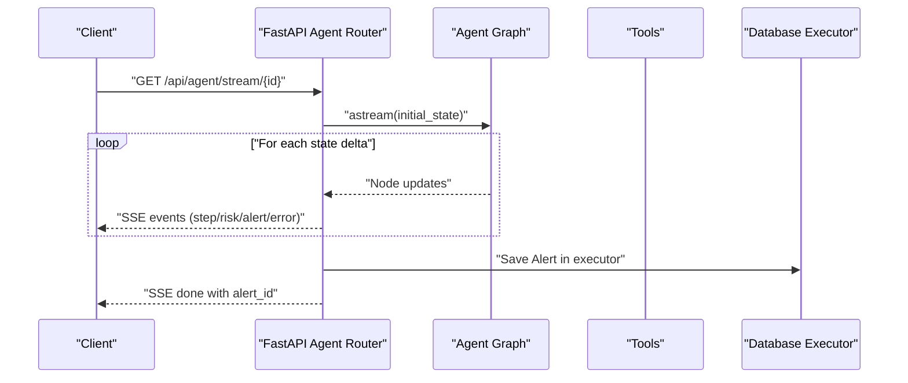
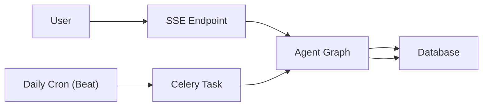
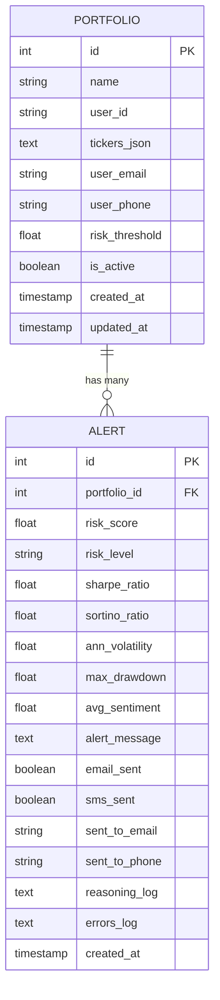
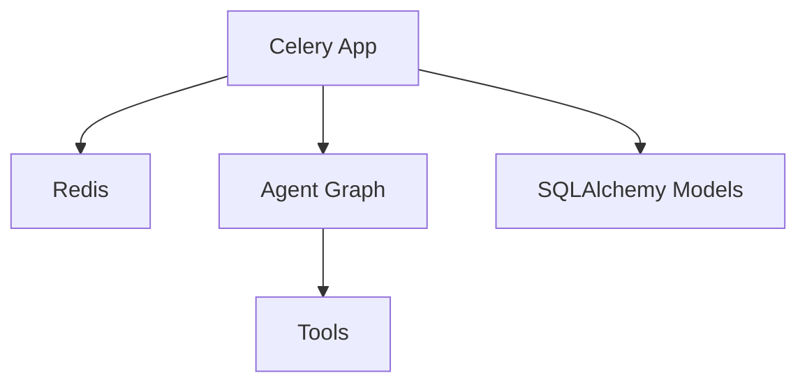

# Celery Background Tasks

<cite>
**Referenced Files in This Document**
- [celery_app.py](file://backend/tasks/celery_app.py)
- [main.py](file://backend/main.py)
- [agent.py](file://backend/routers/agent.py)
- [graph.py](file://backend/agent/graph.py)
- [database.py](file://backend/models/database.py)
- [portfolio.py](file://backend/models/portfolio.py)
- [alert.py](file://backend/models/alert.py)
- [calc_risk.py](file://backend/agent/tools/calc_risk.py)
- [send_alert.py](file://backend/agent/tools/send_alert.py)
- [state.py](file://backend/agent/state.py)
</cite>

## Table of Contents
1. [Introduction](#introduction)
2. [Project Structure](#project-structure)
3. [Core Components](#core-components)
4. [Architecture Overview](#architecture-overview)
5. [Detailed Component Analysis](#detailed-component-analysis)
6. [Dependency Analysis](#dependency-analysis)
7. [Performance Considerations](#performance-considerations)
8. [Troubleshooting Guide](#troubleshooting-guide)
9. [Conclusion](#conclusion)
10. [Appendices](#appendices)

## Introduction
This document explains the Celery background task system in the ishwarambare-app. It covers Celery application configuration (broker and result backend), task scheduling with Celery Beat, task registration and execution, and how Celery integrates with the main FastAPI application. It also documents task scheduling, retries, failure recovery, monitoring approaches, and how background processing complements the real-time Server-Sent Events (SSE) streaming architecture.

## Project Structure
The Celery integration resides under backend/tasks and is orchestrated by the Celery app module. The FastAPI application lives under backend/main.py and exposes endpoints that integrate with the agent’s streaming and batch processing capabilities. The agent graph and tools define the work executed by Celery tasks.

**Diagram sources**
- [main.py:1-59](file://backend/main.py#L1-L59)
- [agent.py:1-243](file://backend/routers/agent.py#L1-L243)
- [celery_app.py:1-136](file://backend/tasks/celery_app.py#L1-L136)
- [graph.py:1-243](file://backend/agent/graph.py#L1-L243)
- [calc_risk.py:1-255](file://backend/agent/tools/calc_risk.py#L1-L255)
- [send_alert.py:1-231](file://backend/agent/tools/send_alert.py#L1-L231)
- [state.py:1-58](file://backend/agent/state.py#L1-L58)
- [database.py:1-42](file://backend/models/database.py#L1-L42)
- [portfolio.py:1-63](file://backend/models/portfolio.py#L1-L63)
- [alert.py:1-77](file://backend/models/alert.py#L1-L77)

**Section sources**
- [main.py:1-59](file://backend/main.py#L1-L59)
- [celery_app.py:1-136](file://backend/tasks/celery_app.py#L1-L136)

## Core Components
- Celery application and configuration: Defines broker and result backend, serializer settings, timezone, and Beat schedule.
- Scheduled task: Runs daily at 08:00 UTC to iterate active portfolios and execute the agent graph for each.
- FastAPI integration: Exposes endpoints for real-time streaming and synchronous runs; Celery complements these with periodic, asynchronous work.
- Persistence: SQLAlchemy models for portfolios and alerts; Celery writes results to the database.

Key configuration highlights:
- Broker and result backend: Redis URL from environment variable with a fallback to localhost.
- Serialization: JSON serializer for tasks and results.
- Beat schedule: Daily cron job at 08:00 UTC.
- Task metadata: Name, binding, and retry policy.

**Section sources**
- [celery_app.py:29-55](file://backend/tasks/celery_app.py#L29-L55)
- [celery_app.py:57-128](file://backend/tasks/celery_app.py#L57-L128)
- [database.py:15-22](file://backend/models/database.py#L15-L22)
- [portfolio.py:16-34](file://backend/models/portfolio.py#L16-L34)
- [alert.py:14-42](file://backend/models/alert.py#L14-L42)

## Architecture Overview
The Celery architecture consists of:
- Celery worker processes that execute tasks.
- Celery Beat scheduler that triggers periodic tasks according to the schedule.
- Broker (Redis) for task transport and result backend for outcomes.
- The agent graph and tools performing the computational work inside the Celery context.

**Diagram sources**
- [celery_app.py:35-55](file://backend/tasks/celery_app.py#L35-L55)
- [graph.py:162-203](file://backend/agent/graph.py#L162-L203)
- [calc_risk.py:149-255](file://backend/agent/tools/calc_risk.py#L149-L255)
- [send_alert.py:157-231](file://backend/agent/tools/send_alert.py#L157-L231)
- [database.py:15-22](file://backend/models/database.py#L15-L22)

## Detailed Component Analysis

### Celery Application and Task Scheduling
- Configuration:
  - Broker and result backend set to the same Redis URL from environment variable.
  - JSON serialization enabled for tasks and results.
  - UTC timezone enabled.
  - Beat schedule defines a daily task at 08:00 UTC.
- Task definition:
  - Registered with a specific dotted name and bound to the Celery app instance.
  - Includes a retry limit.
- Execution context:
  - Iterates active portfolios from the database.
  - Builds initial state for each portfolio.
  - Invokes the agent graph asynchronously within the Celery worker’s event loop.
  - Persists results to the alerts table and logs outcomes.

**Diagram sources**
- [celery_app.py:49-54](file://backend/tasks/celery_app.py#L49-L54)
- [celery_app.py:57-128](file://backend/tasks/celery_app.py#L57-L128)
- [graph.py:162-203](file://backend/agent/graph.py#L162-L203)
- [calc_risk.py:149-255](file://backend/agent/tools/calc_risk.py#L149-L255)
- [send_alert.py:157-231](file://backend/agent/tools/send_alert.py#L157-L231)
- [database.py:29-35](file://backend/models/database.py#L29-L35)

**Section sources**
- [celery_app.py:29-55](file://backend/tasks/celery_app.py#L29-L55)
- [celery_app.py:57-128](file://backend/tasks/celery_app.py#L57-L128)

### Task Registration and Execution Flow
- Registration:
  - Celery app includes the current module so tasks defined within are discoverable.
  - Task decorator registers the function with a fully qualified name.
- Execution:
  - Bound task method receives a reference to the task instance for retries and metadata.
  - Uses an event loop to run the agent graph’s async invocation.
  - Writes results to the alerts table and returns a summary.

**Diagram sources**
- [celery_app.py:57-128](file://backend/tasks/celery_app.py#L57-L128)
- [graph.py:210-242](file://backend/agent/graph.py#L210-L242)

**Section sources**
- [celery_app.py:39-40](file://backend/tasks/celery_app.py#L39-L40)
- [celery_app.py:57-128](file://backend/tasks/celery_app.py#L57-L128)

### Integration with FastAPI Application
- Real-time streaming:
  - SSE endpoint streams agent reasoning deltas and metrics live to clients.
  - Uses an executor to persist results to the database without blocking the async loop.
- Synchronous run:
  - Endpoint executes the agent and returns a JSON summary after persisting to the database.
- Health checks:
  - Agent status endpoint confirms readiness.

**Diagram sources**
- [agent.py:39-168](file://backend/routers/agent.py#L39-L168)
- [graph.py:162-203](file://backend/agent/graph.py#L162-L203)
- [calc_risk.py:149-255](file://backend/agent/tools/calc_risk.py#L149-L255)
- [send_alert.py:157-231](file://backend/agent/tools/send_alert.py#L157-L231)
- [database.py:17-18](file://backend/models/database.py#L17-L18)
- [database.py:171-181](file://backend/models/database.py#L171-L181)

**Section sources**
- [agent.py:39-168](file://backend/routers/agent.py#L39-L168)
- [agent.py:184-232](file://backend/routers/agent.py#L184-L232)
- [agent.py:235-242](file://backend/routers/agent.py#L235-L242)

### Relationship Between Celery Tasks and Real-Time Streaming
- Celery handles periodic, batch work (daily portfolio analysis) outside the request-response cycle.
- SSE endpoints handle interactive, real-time runs initiated by users.
- Both pathways share the same agent graph and persistence models, ensuring consistent state and reporting.

**Diagram sources**
- [agent.py:39-168](file://backend/routers/agent.py#L39-L168)
- [celery_app.py:49-54](file://backend/tasks/celery_app.py#L49-L54)
- [graph.py:162-203](file://backend/agent/graph.py#L162-L203)
- [database.py:29-35](file://backend/models/database.py#L29-L35)

**Section sources**
- [agent.py:39-168](file://backend/routers/agent.py#L39-L168)
- [celery_app.py:49-54](file://backend/tasks/celery_app.py#L49-L54)

### Data Models Used by Celery Tasks
- Portfolio: Stores portfolio configuration and flags for active status and user contact info.
- Alert: Stores risk metrics, alert decisions, and audit trails for UI and history.

**Diagram sources**
- [portfolio.py:16-34](file://backend/models/portfolio.py#L16-L34)
- [alert.py:14-42](file://backend/models/alert.py#L14-L42)

**Section sources**
- [portfolio.py:16-63](file://backend/models/portfolio.py#L16-L63)
- [alert.py:14-77](file://backend/models/alert.py#L14-L77)

## Dependency Analysis
- Celery depends on:
  - Redis for broker and result backend.
  - The agent graph and tools for computation.
  - SQLAlchemy models for persistence.
- FastAPI depends on:
  - The agent router for SSE and sync runs.
  - Database dependency for ORM sessions.
- Coupling:
  - Celery task imports agent graph and tools to execute computations.
  - FastAPI endpoints reuse the same agent graph and models.

**Diagram sources**
- [celery_app.py:35-40](file://backend/tasks/celery_app.py#L35-L40)
- [graph.py:162-203](file://backend/agent/graph.py#L162-L203)
- [calc_risk.py:149-255](file://backend/agent/tools/calc_risk.py#L149-L255)
- [send_alert.py:157-231](file://backend/agent/tools/send_alert.py#L157-L231)
- [database.py:15-22](file://backend/models/database.py#L15-L22)

**Section sources**
- [celery_app.py:35-40](file://backend/tasks/celery_app.py#L35-L40)
- [graph.py:162-203](file://backend/agent/graph.py#L162-L203)
- [database.py:15-22](file://backend/models/database.py#L15-L22)

## Performance Considerations
- Throughput:
  - Use multiple Celery worker processes to parallelize portfolio analysis.
  - Scale Redis for increased concurrency and throughput.
- Task prioritization:
  - Configure queues and routing to prioritize critical tasks if needed.
- Resource management:
  - Limit concurrent executions per worker to prevent memory spikes.
  - Monitor CPU and memory usage of the worker processes.
- Serialization:
  - Keep task/result serialization to JSON to ensure compatibility and simplicity.
- Database writes:
  - Celery writes results synchronously; consider batching or optimizing writes if volume increases.

[No sources needed since this section provides general guidance]

## Troubleshooting Guide
- Celery not installed:
  - The Celery app gracefully falls back to a disabled state with a warning when Celery is unavailable.
- Redis connectivity:
  - Ensure the Redis URL environment variable is set correctly; otherwise, the default localhost URL is used.
- Task failures:
  - The task includes a retry limit; review logs for exceptions raised during portfolio processing.
  - Database transactions are rolled back on errors to maintain consistency.
- SSE vs Celery:
  - SSE endpoints persist results using an executor to avoid blocking the async loop.
  - Confirm database configuration supports multi-threaded access.

**Section sources**
- [celery_app.py:132-135](file://backend/tasks/celery_app.py#L132-L135)
- [celery_app.py:121-126](file://backend/tasks/celery_app.py#L121-L126)
- [agent.py:149-158](file://backend/routers/agent.py#L149-L158)
- [database.py:17-18](file://backend/models/database.py#L17-L18)

## Conclusion
The Celery integration in ishwarambare-app provides robust, scheduled background processing for daily portfolio analysis, complementing the real-time SSE streaming endpoints. With JSON serialization, UTC scheduling, and clear persistence to the database, the system balances reliability and performance. The agent graph and tools encapsulate the core logic, ensuring consistency across both streaming and batch execution modes.

[No sources needed since this section summarizes without analyzing specific files]

## Appendices

### Environment Variables and Commands
- Redis URL:
  - Set REDIS_URL to configure the broker and result backend.
- Celery commands:
  - Start worker: celery -A tasks.celery_app worker --loglevel=info
  - Start Beat: celery -A tasks.celery_app beat --loglevel=info

**Section sources**
- [celery_app.py:29-17](file://backend/tasks/celery_app.py#L29-L17)

### Example Execution Patterns
- Triggering a real-time run:
  - Use the SSE endpoint to stream agent progress and metrics live.
- Triggering a synchronous run:
  - Use the sync endpoint to receive a JSON summary after the agent completes.
- Scheduling a daily run:
  - Beat schedules the task to run at 08:00 UTC daily.

**Section sources**
- [agent.py:39-168](file://backend/routers/agent.py#L39-L168)
- [agent.py:184-232](file://backend/routers/agent.py#L184-L232)
- [celery_app.py:49-54](file://backend/tasks/celery_app.py#L49-L54)