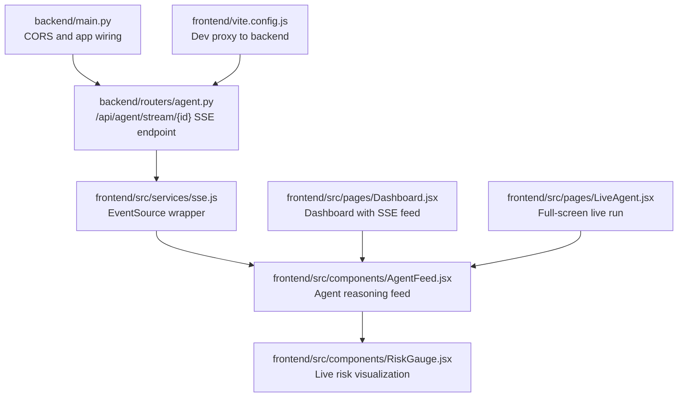
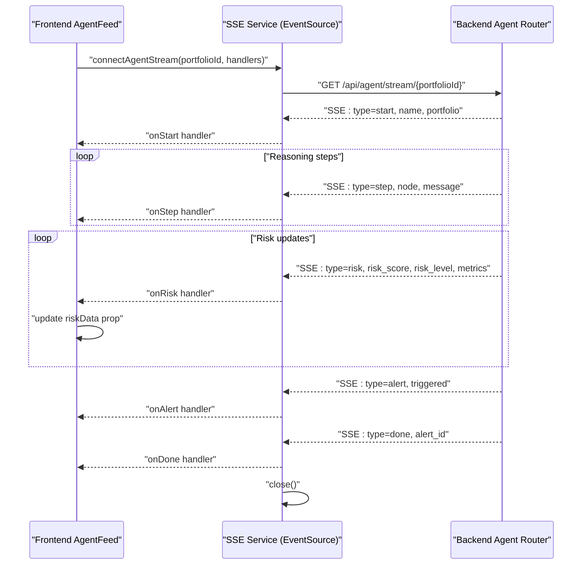
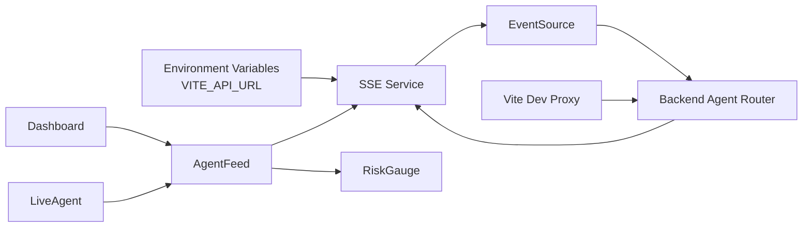

# Frontend SSE Client Integration

<cite>
**Referenced Files in This Document**
- [frontend/src/services/sse.js](file://frontend/src/services/sse.js)
- [frontend/src/components/AgentFeed.jsx](file://frontend/src/components/AgentFeed.jsx)
- [frontend/src/components/RiskGauge.jsx](file://frontend/src/components/RiskGauge.jsx)
- [frontend/src/pages/LiveAgent.jsx](file://frontend/src/pages/LiveAgent.jsx)
- [frontend/src/pages/Dashboard.jsx](file://frontend/src/pages/Dashboard.jsx)
- [backend/routers/agent.py](file://backend/routers/agent.py)
- [backend/main.py](file://backend/main.py)
- [frontend/vite.config.js](file://frontend/vite.config.js)
- [frontend/package.json](file://frontend/package.json)
</cite>

## Table of Contents
1. [Introduction](#introduction)
2. [Project Structure](#project-structure)
3. [Core Components](#core-components)
4. [Architecture Overview](#architecture-overview)
5. [Detailed Component Analysis](#detailed-component-analysis)
6. [Dependency Analysis](#dependency-analysis)
7. [Performance Considerations](#performance-considerations)
8. [Troubleshooting Guide](#troubleshooting-guide)
9. [Conclusion](#conclusion)

## Introduction
This document explains the frontend Server-Sent Events (SSE) client integration in the ishwarambare-app React application. It covers how the EventSource establishes a persistent connection to the backend, how streaming events are parsed and dispatched to React components, and how the AgentFeed and RiskGauge visualize live agent reasoning and risk metrics. It also documents lifecycle management, error handling, and the coordination between frontend and backend streaming responses.

## Project Structure
The SSE integration spans three primary areas:
- Frontend services: a thin EventSource wrapper that normalizes SSE messages into typed events
- Frontend components: AgentFeed consumes and renders live reasoning steps; RiskGauge displays live risk metrics
- Backend router: FastAPI endpoint emits structured SSE events for each agent node and state update

**Diagram sources**
- [frontend/src/services/sse.js:1-63](file://frontend/src/services/sse.js#L1-L63)
- [frontend/src/components/AgentFeed.jsx:1-175](file://frontend/src/components/AgentFeed.jsx#L1-L175)
- [frontend/src/components/RiskGauge.jsx:1-101](file://frontend/src/components/RiskGauge.jsx#L1-L101)
- [frontend/src/pages/Dashboard.jsx:1-211](file://frontend/src/pages/Dashboard.jsx#L1-L211)
- [frontend/src/pages/LiveAgent.jsx:1-95](file://frontend/src/pages/LiveAgent.jsx#L1-L95)
- [backend/routers/agent.py:1-243](file://backend/routers/agent.py#L1-L243)
- [backend/main.py:1-59](file://backend/main.py#L1-L59)
- [frontend/vite.config.js:1-23](file://frontend/vite.config.js#L1-L23)

**Section sources**
- [frontend/src/services/sse.js:1-63](file://frontend/src/services/sse.js#L1-L63)
- [frontend/src/components/AgentFeed.jsx:1-175](file://frontend/src/components/AgentFeed.jsx#L1-L175)
- [frontend/src/components/RiskGauge.jsx:1-101](file://frontend/src/components/RiskGauge.jsx#L1-L101)
- [frontend/src/pages/Dashboard.jsx:1-211](file://frontend/src/pages/Dashboard.jsx#L1-L211)
- [frontend/src/pages/LiveAgent.jsx:1-95](file://frontend/src/pages/LiveAgent.jsx#L1-L95)
- [backend/routers/agent.py:1-243](file://backend/routers/agent.py#L1-L243)
- [backend/main.py:1-59](file://backend/main.py#L1-L59)
- [frontend/vite.config.js:1-23](file://frontend/vite.config.js#L1-L23)

## Core Components
- SSE Service: Wraps EventSource, parses JSON messages, dispatches typed events, and exposes a stop method to close the connection.
- AgentFeed: React component that starts/stops the SSE stream, appends reasoning steps, tracks status, and notifies parent components of risk updates and completion.
- RiskGauge: Recharts-based radial gauge that renders live risk score, risk level, and metrics.

Key responsibilities:
- SSE Service: Establishes connection, handles onmessage/onerror, routes events to handlers, and ensures cleanup.
- AgentFeed: Manages component state, scroll behavior, and user controls; integrates with RiskGauge via props.
- RiskGauge: Pure visualization component receiving numeric risk score, level, and metrics.

**Section sources**
- [frontend/src/services/sse.js:21-62](file://frontend/src/services/sse.js#L21-L62)
- [frontend/src/components/AgentFeed.jsx:28-96](file://frontend/src/components/AgentFeed.jsx#L28-L96)
- [frontend/src/components/RiskGauge.jsx:20-99](file://frontend/src/components/RiskGauge.jsx#L20-L99)

## Architecture Overview
The frontend SSE client connects to the backend’s SSE endpoint and streams agent reasoning and risk updates in real time. The backend emits structured JSON events with a type field and associated data. The frontend parses and routes these events to appropriate handlers.

**Diagram sources**
- [frontend/src/services/sse.js:21-62](file://frontend/src/services/sse.js#L21-L62)
- [frontend/src/components/AgentFeed.jsx:41-77](file://frontend/src/components/AgentFeed.jsx#L41-L77)
- [backend/routers/agent.py:39-168](file://backend/routers/agent.py#L39-L168)

## Detailed Component Analysis

### SSE Service: connectAgentStream
- Purpose: Wrap EventSource to normalize incoming SSE messages into typed events and expose a stop controller.
- Connection establishment: Constructs URL from environment variable and portfolio ID, instantiates EventSource.
- Event routing: Parses JSON from event.data and switches on data.type to invoke optional handlers (onStart, onStep, onRisk, onAlert, onDone, onError).
- Lifecycle: Closes the EventSource on 'done' and on 'error'; exposes stop() to callers.
- Error handling: onerror handler triggers onError and closes the connection.

Implementation highlights:
- URL construction and base URL resolution from environment.
- JSON parsing with defensive try/catch around event.data.
- Event type handling for 'start', 'step', 'risk', 'alert', 'done', 'error'.
- Cleanup via stop() returning es.close().

**Section sources**
- [frontend/src/services/sse.js:19-23](file://frontend/src/services/sse.js#L19-L23)
- [frontend/src/services/sse.js:25-57](file://frontend/src/services/sse.js#L25-L57)
- [frontend/src/services/sse.js:59-62](file://frontend/src/services/sse.js#L59-L62)

### AgentFeed Component: Real-time Agent Reasoning Feed
- Responsibilities: Manage feed state, start/stop the SSE stream, append reasoning steps, track status and step count, and notify parents of risk updates and completion.
- Initialization: startStream() clears previous state, sets status to running, and calls connectAgentStream with handlers.
- Handlers:
  - onStart: logs agent start with portfolio name.
  - onStep: appends node and message, increments step count.
  - onRisk: invokes onRiskUpdate callback to update parent risk state.
  - onAlert: logs alert trigger/no-trigger outcome.
  - onDone: logs completion, stops stream, sets status to done, invokes onDone callback.
  - onError: logs error, stops stream, sets status to error.
- Cleanup: stopStream() closes the stream and resets UI state; reset() clears state and stops stream.
- Rendering: Auto-scrolls to bottom on new lines; displays status bar and step count.

Integration points:
- Consumes portfolioId prop to drive SSE URL.
- Receives onRiskUpdate and onDone callbacks from parent.
- Uses NODE_COLORS mapping for node categorization.

**Section sources**
- [frontend/src/components/AgentFeed.jsx:28-96](file://frontend/src/components/AgentFeed.jsx#L28-L96)
- [frontend/src/components/AgentFeed.jsx:41-77](file://frontend/src/components/AgentFeed.jsx#L41-L77)
- [frontend/src/components/AgentFeed.jsx:136-157](file://frontend/src/components/AgentFeed.jsx#L136-L157)

### RiskGauge Component: Live Risk Visualization
- Purpose: Render a radial gauge for risk score with color-coded risk level and metrics grid.
- Props: riskScore (0..1), riskLevel (LOW/MEDIUM/HIGH/UNKNOWN), metrics (object).
- Behavior: Computes percentage, selects color based on score thresholds, renders Recharts RadialBarChart, and displays metrics in a responsive grid.

**Section sources**
- [frontend/src/components/RiskGauge.jsx:20-99](file://frontend/src/components/RiskGauge.jsx#L20-L99)

### LiveAgent Page: Full-Screen Live Run
- Purpose: Dedicated page for full-width AgentFeed and side-by-side RiskGauge.
- Data flow: Fetches portfolios, allows selection, passes selected portfolioId to AgentFeed, and forwards risk updates to RiskGauge.

**Section sources**
- [frontend/src/pages/LiveAgent.jsx:15-94](file://frontend/src/pages/LiveAgent.jsx#L15-L94)

### Dashboard Page: Integrated SSE Experience
- Purpose: Provides a compact dashboard with AgentFeed and RiskGauge integrated into the main view.
- Data flow: Passes selected portfolioId to AgentFeed and manages riskData state for RiskGauge.

**Section sources**
- [frontend/src/pages/Dashboard.jsx:16-48](file://frontend/src/pages/Dashboard.jsx#L16-L48)
- [frontend/src/pages/Dashboard.jsx:133-137](file://frontend/src/pages/Dashboard.jsx#L133-L137)
- [frontend/src/pages/Dashboard.jsx:160-164](file://frontend/src/pages/Dashboard.jsx#L160-L164)

### Backend SSE Endpoint: Streaming Responses
- Endpoint: GET /api/agent/stream/{portfolio_id}
- Behavior: Emits structured SSE events:
  - start: initial handshake with portfolio metadata.
  - step: node name and reasoning message delta.
  - risk: risk_score, risk_level, and risk_metrics.
  - alert: should_alert decision.
  - error: error messages surfaced to client.
  - done: finalization with alert_id.
- Connection handling: Checks request.is_disconnected() to gracefully stop streaming; yields done after persistence; includes CORS and cache-control headers.

**Section sources**
- [backend/routers/agent.py:39-168](file://backend/routers/agent.py#L39-L168)
- [backend/routers/agent.py:50-56](file://backend/routers/agent.py#L50-L56)
- [backend/routers/agent.py:86-127](file://backend/routers/agent.py#L86-L127)
- [backend/routers/agent.py:128-158](file://backend/routers/agent.py#L128-L158)

## Dependency Analysis
- Frontend-to-backend communication:
  - SSE Service depends on environment-provided API base URL and portfolioId to construct the SSE endpoint.
  - AgentFeed depends on SSE Service and RiskGauge.
  - RiskGauge is a pure presentation component depending on Recharts.
- Backend-to-frontend:
  - Backend router emits structured JSON events with a type field; frontend routes based on type.
- Cross-origin and proxy:
  - Dev proxy in Vite forwards /api requests to the backend server.
  - Backend enables CORS for SSE compatibility.

**Diagram sources**
- [frontend/src/services/sse.js:19](file://frontend/src/services/sse.js#L19)
- [frontend/vite.config.js:9-16](file://frontend/vite.config.js#L9-L16)
- [backend/main.py:24-30](file://backend/main.py#L24-L30)

**Section sources**
- [frontend/src/services/sse.js:19](file://frontend/src/services/sse.js#L19)
- [frontend/vite.config.js:9-16](file://frontend/vite.config.js#L9-L16)
- [backend/main.py:24-30](file://backend/main.py#L24-L30)

## Performance Considerations
- High-frequency updates:
  - Backend intentionally delays small intervals between step emissions for visual pacing; frontend should avoid unnecessary re-renders by using minimal state updates per event.
  - Consider batching risk updates if the rate becomes excessive; currently, each risk update triggers a re-render of RiskGauge.
- Memory management:
  - AgentFeed stores all log lines in state; for long runs, consider limiting retained lines (e.g., keep last N entries) to prevent memory growth.
  - Use keys based on stable identifiers when rendering lists to improve reconciliation.
- Component unmounting:
  - Ensure stop() is called on unmount to close the EventSource and prevent leaks.
  - The current implementation stores the controller in a ref; confirm cleanup in useEffect return to avoid lingering subscriptions.
- Network resilience:
  - The SSE client does not implement automatic reconnect; if reconnect is desired, integrate a retry/backoff strategy with exponential backoff and jitter.
- Rendering efficiency:
  - Memoize derived values (e.g., risk color computation) and avoid deep equality checks in downstream components.

[No sources needed since this section provides general guidance]

## Troubleshooting Guide
Common issues and remedies:
- Connection failures:
  - Verify backend is reachable and CORS is enabled; the backend allows all origins for SSE compatibility.
  - Confirm Vite dev proxy is configured to forward /api to the backend server.
- Malformed events:
  - SSE Service defensively parses event.data as JSON; malformed data is ignored. Ensure backend emits valid JSON with a type field.
- Network interruptions:
  - SSE Service triggers onError and closes the connection on onerror; the frontend should surface user-facing errors and allow restart.
- Stuck or incomplete runs:
  - Check backend logs for exceptions; the backend emits error events and yields done even if persistence fails.

Operational checks:
- Environment variable: Ensure VITE_API_URL resolves to the backend host/port.
- Port selection: AgentFeed requires a valid portfolioId; otherwise, the stream is not started.
- Status indicators: Use AgentFeed’s status bar to detect idle, running, done, or error states.

**Section sources**
- [backend/main.py:24-30](file://backend/main.py#L24-L30)
- [frontend/vite.config.js:9-16](file://frontend/vite.config.js#L9-L16)
- [frontend/src/services/sse.js:54-57](file://frontend/src/services/sse.js#L54-L57)
- [frontend/src/components/AgentFeed.jsx:41-77](file://frontend/src/components/AgentFeed.jsx#L41-L77)

## Conclusion
The frontend SSE client provides a clean abstraction over EventSource, enabling robust real-time streaming of agent reasoning and risk updates. The AgentFeed component orchestrates the stream lifecycle and integrates with RiskGauge for live visualization. The backend’s SSE endpoint emits structured events that the frontend consumes deterministically. With careful attention to memory management, component cleanup, and potential reconnect strategies, the integration delivers a responsive and reliable user experience.