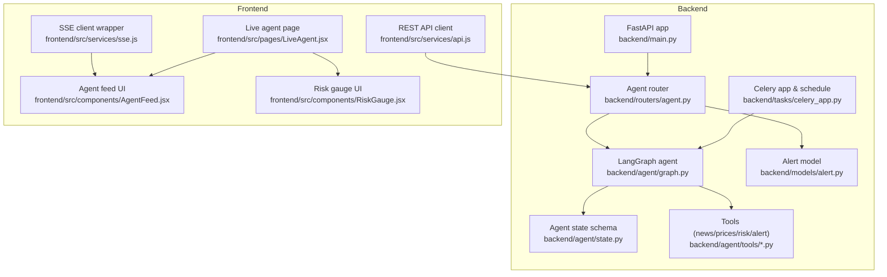
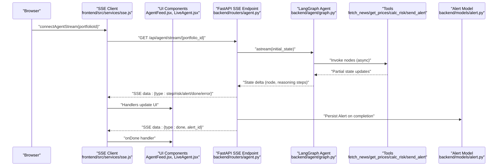
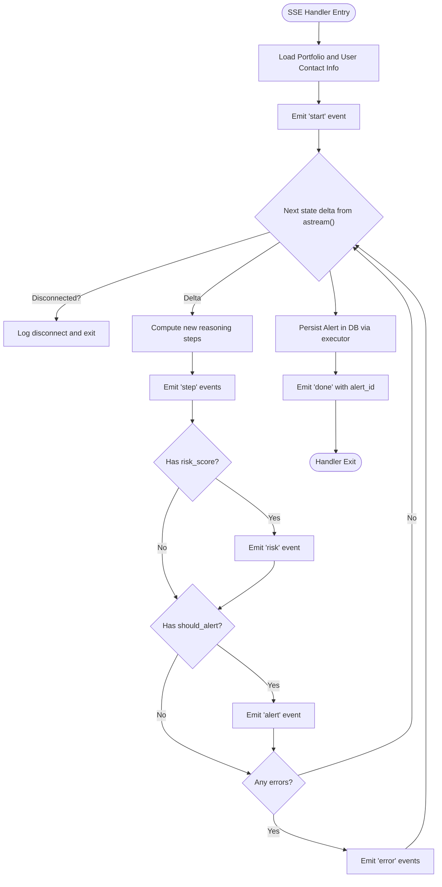
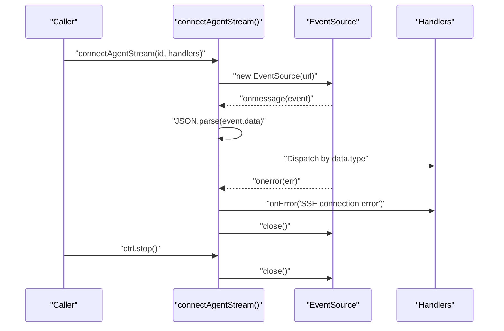
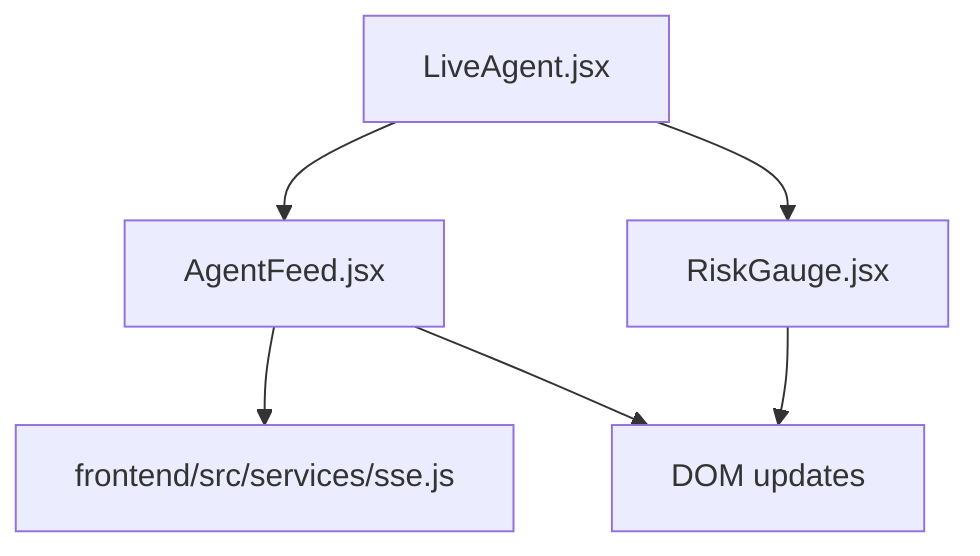
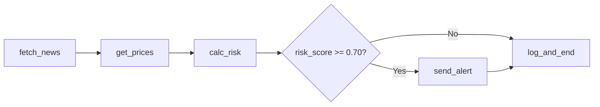
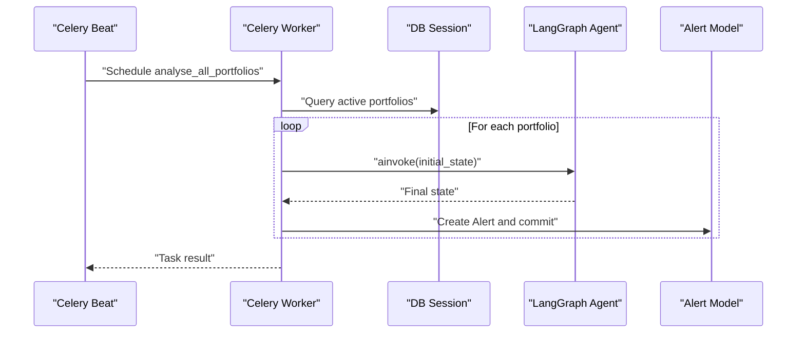
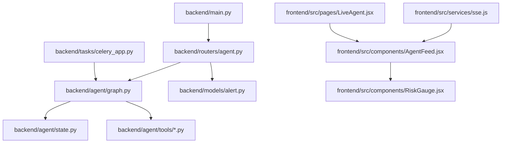

# Real-time Communication

<cite>
**Referenced Files in This Document**
- [backend/main.py](file://backend/main.py)
- [backend/routers/agent.py](file://backend/routers/agent.py)
- [backend/agent/graph.py](file://backend/agent/graph.py)
- [backend/agent/state.py](file://backend/agent/state.py)
- [backend/agent/tools/fetch_news.py](file://backend/agent/tools/fetch_news.py)
- [backend/agent/tools/get_prices.py](file://backend/agent/tools/get_prices.py)
- [backend/agent/tools/calc_risk.py](file://backend/agent/tools/calc_risk.py)
- [backend/agent/tools/send_alert.py](file://backend/agent/tools/send_alert.py)
- [backend/models/alert.py](file://backend/models/alert.py)
- [backend/tasks/celery_app.py](file://backend/tasks/celery_app.py)
- [frontend/src/services/sse.js](file://frontend/src/services/sse.js)
- [frontend/src/components/AgentFeed.jsx](file://frontend/src/components/AgentFeed.jsx)
- [frontend/src/pages/LiveAgent.jsx](file://frontend/src/pages/LiveAgent.jsx)
- [frontend/src/components/RiskGauge.jsx](file://frontend/src/components/RiskGauge.jsx)
- [frontend/src/services/api.js](file://frontend/src/services/api.js)
</cite>

## Table of Contents
1. [Introduction](#introduction)
2. [Project Structure](#project-structure)
3. [Core Components](#core-components)
4. [Architecture Overview](#architecture-overview)
5. [Detailed Component Analysis](#detailed-component-analysis)
6. [Dependency Analysis](#dependency-analysis)
7. [Performance Considerations](#performance-considerations)
8. [Troubleshooting Guide](#troubleshooting-guide)
9. [Conclusion](#conclusion)
10. [Appendices](#appendices)

## Introduction
This document explains the real-time communication system in the ishwarambare-app, focusing on Server-Sent Events (SSE) for live agent execution streaming, the SSE endpoint configuration, frontend client behavior, and the Celery-based background task system. It also covers the integration between agent workflow execution and real-time visualization, including state updates, progress tracking, and live metrics rendering. Guidance is included for error recovery, connection resilience, and performance tuning for high-concurrency scenarios, along with practical debugging and monitoring approaches.

## Project Structure
The real-time system spans backend FastAPI endpoints, a LangGraph agent pipeline, and a React frontend with an SSE client. Background tasks are orchestrated via Celery and Redis.

**Diagram sources**
- [backend/main.py:12-59](file://backend/main.py#L12-L59)
- [backend/routers/agent.py:39-243](file://backend/routers/agent.py#L39-L243)
- [backend/agent/graph.py:162-204](file://backend/agent/graph.py#L162-L204)
- [backend/agent/state.py:28-58](file://backend/agent/state.py#L28-L58)
- [backend/agent/tools/fetch_news.py:98-164](file://backend/agent/tools/fetch_news.py#L98-L164)
- [backend/agent/tools/get_prices.py:84-139](file://backend/agent/tools/get_prices.py#L84-L139)
- [backend/agent/tools/calc_risk.py:149-255](file://backend/agent/tools/calc_risk.py#L149-L255)
- [backend/agent/tools/send_alert.py:157-231](file://backend/agent/tools/send_alert.py#L157-L231)
- [backend/models/alert.py:14-77](file://backend/models/alert.py#L14-L77)
- [backend/tasks/celery_app.py:35-136](file://backend/tasks/celery_app.py#L35-L136)
- [frontend/src/services/sse.js:21-63](file://frontend/src/services/sse.js#L21-L63)
- [frontend/src/components/AgentFeed.jsx:28-175](file://frontend/src/components/AgentFeed.jsx#L28-L175)
- [frontend/src/pages/LiveAgent.jsx:15-95](file://frontend/src/pages/LiveAgent.jsx#L15-L95)
- [frontend/src/components/RiskGauge.jsx:20-101](file://frontend/src/components/RiskGauge.jsx#L20-L101)
- [frontend/src/services/api.js:12-35](file://frontend/src/services/api.js#L12-L35)

**Section sources**
- [backend/main.py:12-59](file://backend/main.py#L12-L59)
- [backend/routers/agent.py:39-243](file://backend/routers/agent.py#L39-L243)
- [frontend/src/services/sse.js:21-63](file://frontend/src/services/sse.js#L21-L63)
- [frontend/src/components/AgentFeed.jsx:28-175](file://frontend/src/components/AgentFeed.jsx#L28-L175)
- [frontend/src/pages/LiveAgent.jsx:15-95](file://frontend/src/pages/LiveAgent.jsx#L15-L95)
- [frontend/src/components/RiskGauge.jsx:20-101](file://frontend/src/components/RiskGauge.jsx#L20-L101)
- [frontend/src/services/api.js:12-35](file://frontend/src/services/api.js#L12-L35)

## Core Components
- SSE Endpoint: Streams agent execution events to the browser using Server-Sent Events.
- Agent Graph: LangGraph StateGraph orchestrates nodes and emits state deltas suitable for streaming.
- Frontend SSE Client: Wraps EventSource, parses events, and updates UI components.
- Celery Tasks: Periodic background analysis of all active portfolios.
- Persistence: Alert records capture risk metrics, reasoning logs, and errors.

**Section sources**
- [backend/routers/agent.py:39-168](file://backend/routers/agent.py#L39-L168)
- [backend/agent/graph.py:162-204](file://backend/agent/graph.py#L162-L204)
- [frontend/src/services/sse.js:21-63](file://frontend/src/services/sse.js#L21-L63)
- [backend/tasks/celery_app.py:57-128](file://backend/tasks/celery_app.py#L57-L128)
- [backend/models/alert.py:14-77](file://backend/models/alert.py#L14-L77)

## Architecture Overview
The real-time pipeline connects a React UI to a FastAPI SSE endpoint, which streams agent execution events produced by a LangGraph workflow. Background Celery tasks periodically run the agent across all portfolios and persist results.

**Diagram sources**
- [backend/routers/agent.py:39-168](file://backend/routers/agent.py#L39-L168)
- [backend/agent/graph.py:162-204](file://backend/agent/graph.py#L162-L204)
- [backend/agent/tools/fetch_news.py:98-164](file://backend/agent/tools/fetch_news.py#L98-L164)
- [backend/agent/tools/get_prices.py:84-139](file://backend/agent/tools/get_prices.py#L84-L139)
- [backend/agent/tools/calc_risk.py:149-255](file://backend/agent/tools/calc_risk.py#L149-L255)
- [backend/agent/tools/send_alert.py:157-231](file://backend/agent/tools/send_alert.py#L157-L231)
- [backend/models/alert.py:14-77](file://backend/models/alert.py#L14-L77)
- [frontend/src/services/sse.js:21-63](file://frontend/src/services/sse.js#L21-L63)
- [frontend/src/components/AgentFeed.jsx:48-77](file://frontend/src/components/AgentFeed.jsx#L48-L77)

## Detailed Component Analysis

### SSE Endpoint Implementation
- Endpoint: GET /api/agent/stream/{portfolio_id}
- Media type: text/event-stream
- Headers: Cache-Control: no-cache, X-Accel-Buffering: no, Access-Control-Allow-Origin: *
- Event stream format:
  - start: Initial snapshot with portfolio metadata
  - step: Per-reasoning-step delta with node and message
  - risk: risk_score, risk_level, metrics when computed
  - alert: should_alert decision
  - error: error messages
  - done: alert_id when persistence completes
- Connection management:
  - Checks request.is_disconnected() to exit early
  - Emits a small delay between steps for visual pacing
  - On exceptions, emits error and stops gracefully
  - After streaming, persists Alert asynchronously using a thread executor

**Diagram sources**
- [backend/routers/agent.py:69-168](file://backend/routers/agent.py#L69-L168)

**Section sources**
- [backend/routers/agent.py:39-168](file://backend/routers/agent.py#L39-L168)

### SSE Endpoint Configuration and Headers
- Media type: text/event-stream
- Cache-Control: no-cache
- X-Accel-Buffering: no (required for Nginx)
- Access-Control-Allow-Origin: * (permissive for SSE)
- CORS middleware allows all origins/methods/headers

**Section sources**
- [backend/main.py:18-30](file://backend/main.py#L18-L30)
- [backend/routers/agent.py:160-168](file://backend/routers/agent.py#L160-L168)

### Event Types and Data Serialization
- Event types emitted by the SSE endpoint:
  - start: { type: "start", portfolio: dict, name: string }
  - step: { type: "step", node: string, message: string }
  - risk: { type: "risk", risk_score: float, risk_level: string, metrics: dict }
  - alert: { type: "alert", triggered: bool }
  - error: { type: "error", message: string }
  - done: { type: "done", alert_id: int }
- Data serialization: JSON-encoded event data; each event is a single line with "data:" prefix followed by newline separators

**Section sources**
- [backend/routers/agent.py:45-56](file://backend/routers/agent.py#L45-L56)
- [backend/routers/agent.py:32-34](file://backend/routers/agent.py#L32-L34)

### Frontend SSE Client Implementation
- Wrapper around EventSource:
  - connectAgentStream(portfolioId, handlers)
  - Handlers: onStart, onStep, onRisk, onAlert, onDone, onError
  - onmessage parses event.data JSON and dispatches to appropriate handler
  - onerror triggers onError and closes the connection
  - Returns a controller with stop() to close the EventSource

**Diagram sources**
- [frontend/src/services/sse.js:21-63](file://frontend/src/services/sse.js#L21-L63)

**Section sources**
- [frontend/src/services/sse.js:21-63](file://frontend/src/services/sse.js#L21-L63)

### Frontend UI Integration
- AgentFeed.jsx:
  - Maintains a list of log lines and step count
  - Starts/stops the SSE stream via connectAgentStream
  - Updates risk data via onRiskUpdate prop
  - Handles onDone to finalize UI state
  - onError sets status to error and stops stream
- LiveAgent.jsx:
  - Provides a full-screen layout with AgentFeed and RiskGauge side-by-side
  - Selects portfolio and resets risk data on selection change
- RiskGauge.jsx:
  - Renders a radial gauge for risk score and displays metrics grid

**Diagram sources**
- [frontend/src/pages/LiveAgent.jsx:27-91](file://frontend/src/pages/LiveAgent.jsx#L27-L91)
- [frontend/src/components/AgentFeed.jsx:28-175](file://frontend/src/components/AgentFeed.jsx#L28-L175)
- [frontend/src/components/RiskGauge.jsx:20-101](file://frontend/src/components/RiskGauge.jsx#L20-L101)
- [frontend/src/services/sse.js:21-63](file://frontend/src/services/sse.js#L21-L63)

**Section sources**
- [frontend/src/pages/LiveAgent.jsx:15-95](file://frontend/src/pages/LiveAgent.jsx#L15-L95)
- [frontend/src/components/AgentFeed.jsx:28-175](file://frontend/src/components/AgentFeed.jsx#L28-L175)
- [frontend/src/components/RiskGauge.jsx:20-101](file://frontend/src/components/RiskGauge.jsx#L20-L101)

### Agent Workflow Execution and Streaming
- LangGraph StateGraph:
  - Nodes: fetch_news → get_prices → calc_risk → [conditional] → send_alert/log_and_end
  - Conditional edge routes based on risk_score threshold
  - .astream() yields state deltas suitable for SSE
- Tool behaviors:
  - fetch_news: retrieves headlines and computes avg_sentiment
  - get_prices: downloads price histories and daily returns (with fallbacks)
  - calc_risk: computes Sharpe/Sortino/volatility/max_drawdown and composite risk_score
  - send_alert: emails/SMS when risk is high (mock mode supported)
- State schema:
  - AgentState defines typed fields for portfolio, metrics, decisions, and audit trails

**Diagram sources**
- [backend/agent/graph.py:162-204](file://backend/agent/graph.py#L162-L204)
- [backend/agent/state.py:28-58](file://backend/agent/state.py#L28-L58)
- [backend/agent/tools/fetch_news.py:98-164](file://backend/agent/tools/fetch_news.py#L98-L164)
- [backend/agent/tools/get_prices.py:84-139](file://backend/agent/tools/get_prices.py#L84-L139)
- [backend/agent/tools/calc_risk.py:149-255](file://backend/agent/tools/calc_risk.py#L149-L255)
- [backend/agent/tools/send_alert.py:157-231](file://backend/agent/tools/send_alert.py#L157-L231)

**Section sources**
- [backend/agent/graph.py:162-204](file://backend/agent/graph.py#L162-L204)
- [backend/agent/state.py:28-58](file://backend/agent/state.py#L28-L58)
- [backend/agent/tools/fetch_news.py:98-164](file://backend/agent/tools/fetch_news.py#L98-L164)
- [backend/agent/tools/get_prices.py:84-139](file://backend/agent/tools/get_prices.py#L84-L139)
- [backend/agent/tools/calc_risk.py:149-255](file://backend/agent/tools/calc_risk.py#L149-L255)
- [backend/agent/tools/send_alert.py:157-231](file://backend/agent/tools/send_alert.py#L157-L231)

### Celery Task System for Background Processing
- Celery app configured with Redis broker/backend
- Scheduled task: analyse_all_portfolios runs daily at 08:00 UTC
- Task iterates active portfolios, constructs initial state, runs agent via ainvoke, and persists Alert records
- Uses a new event loop to run async agent in sync Celery context

**Diagram sources**
- [backend/tasks/celery_app.py:49-54](file://backend/tasks/celery_app.py#L49-L54)
- [backend/tasks/celery_app.py:57-128](file://backend/tasks/celery_app.py#L57-L128)

**Section sources**
- [backend/tasks/celery_app.py:35-136](file://backend/tasks/celery_app.py#L35-L136)

### Integration Between Agent Execution and Real-time Streaming
- State deltas from LangGraph’s astream() are transformed into SSE events
- Frontend handlers update AgentFeed and RiskGauge in real time
- Persistence occurs after streaming completes, emitting a final done event with alert_id

**Section sources**
- [backend/routers/agent.py:84-158](file://backend/routers/agent.py#L84-L158)
- [frontend/src/components/AgentFeed.jsx:48-77](file://frontend/src/components/AgentFeed.jsx#L48-L77)
- [frontend/src/components/RiskGauge.jsx:20-101](file://frontend/src/components/RiskGauge.jsx#L20-L101)

## Dependency Analysis
- Backend FastAPI app includes agent router and enables CORS for SSE compatibility.
- Agent router depends on LangGraph agent and SQLAlchemy models.
- Frontend depends on the SSE client and UI components.
- Celery depends on Redis and invokes the agent graph for batch runs.

**Diagram sources**
- [backend/main.py:39-43](file://backend/main.py#L39-L43)
- [backend/routers/agent.py:24-25](file://backend/routers/agent.py#L24-L25)
- [backend/agent/graph.py:26-33](file://backend/agent/graph.py#L26-L33)
- [backend/models/alert.py:14-43](file://backend/models/alert.py#L14-L43)
- [backend/tasks/celery_app.py:35-40](file://backend/tasks/celery_app.py#L35-L40)
- [frontend/src/services/sse.js:21-63](file://frontend/src/services/sse.js#L21-L63)
- [frontend/src/components/AgentFeed.jsx:8-10](file://frontend/src/components/AgentFeed.jsx#L8-L10)
- [frontend/src/pages/LiveAgent.jsx:9-12](file://frontend/src/pages/LiveAgent.jsx#L9-L12)
- [frontend/src/components/RiskGauge.jsx:8](file://frontend/src/components/RiskGauge.jsx#L8)

**Section sources**
- [backend/main.py:39-43](file://backend/main.py#L39-L43)
- [backend/routers/agent.py:24-25](file://backend/routers/agent.py#L24-L25)
- [backend/agent/graph.py:26-33](file://backend/agent/graph.py#L26-L33)
- [backend/models/alert.py:14-43](file://backend/models/alert.py#L14-L43)
- [backend/tasks/celery_app.py:35-40](file://backend/tasks/celery_app.py#L35-L40)
- [frontend/src/services/sse.js:21-63](file://frontend/src/services/sse.js#L21-L63)
- [frontend/src/components/AgentFeed.jsx:8-10](file://frontend/src/components/AgentFeed.jsx#L8-L10)
- [frontend/src/pages/LiveAgent.jsx:9-12](file://frontend/src/pages/LiveAgent.jsx#L9-L12)
- [frontend/src/components/RiskGauge.jsx:8](file://frontend/src/components/RiskGauge.jsx#L8)

## Performance Considerations
- SSE buffering and Nginx compatibility:
  - X-Accel-Buffering: no header ensures streamed events are not buffered behind proxies.
- Concurrency and backpressure:
  - Use a small delay between step emissions to prevent overwhelming the UI.
  - Monitor client disconnections promptly to free resources.
- Database writes:
  - Persist Alert in a thread executor to avoid blocking the async event loop.
- Background tasks:
  - Celery workers should be scaled horizontally; tune concurrency and queues.
  - Consider task routing and result backends for observability.
- Network and timeouts:
  - Frontend Axios timeout is set; adjust based on expected streaming duration.
  - EventSource reconnection behavior is handled by the SSE client wrapper.

[No sources needed since this section provides general guidance]

## Troubleshooting Guide
- SSE connection errors:
  - The SSE client’s onerror handler notifies the user and closes the connection.
  - Check CORS configuration and allowed origins.
- Missing or invalid portfolio:
  - The SSE endpoint returns 404 if the portfolio is not found.
- Agent runtime errors:
  - Exceptions are caught and emitted as SSE error events; the stream terminates after emitting error.
- Persistence failures:
  - On DB save failure, an error is emitted and a done event with alert_id=None is sent.
- Frontend UI:
  - AgentFeed tracks status and step counts; onDone clears running state and shows completion.
- Monitoring:
  - Use the agent status endpoint to verify readiness.
  - Inspect backend logs for agent execution and tool invocations.
  - For Celery, monitor task schedules and worker logs.

**Section sources**
- [frontend/src/services/sse.js:54-57](file://frontend/src/services/sse.js#L54-L57)
- [backend/routers/agent.py:58-60](file://backend/routers/agent.py#L58-L60)
- [backend/routers/agent.py:123-126](file://backend/routers/agent.py#L123-L126)
- [backend/routers/agent.py:155-158](file://backend/routers/agent.py#L155-L158)
- [frontend/src/components/AgentFeed.jsx:71-75](file://frontend/src/components/AgentFeed.jsx#L71-L75)
- [backend/routers/agent.py:235-242](file://backend/routers/agent.py#L235-L242)

## Conclusion
The ishwarambare-app implements a robust real-time communication system using FastAPI SSE and LangGraph. The SSE endpoint streams agent execution events to the React UI, enabling live visualization of reasoning steps, risk metrics, and alert decisions. Celery complements this with periodic background analysis. The design emphasizes resilience, clear event semantics, and separation of concerns between streaming, persistence, and UI rendering.

[No sources needed since this section summarizes without analyzing specific files]

## Appendices

### Event Stream Format Reference
- start: { type: "start", portfolio: dict, name: string }
- step: { type: "step", node: string, message: string }
- risk: { type: "risk", risk_score: float, risk_level: string, metrics: dict }
- alert: { type: "alert", triggered: bool }
- error: { type: "error", message: string }
- done: { type: "done", alert_id: int }

**Section sources**
- [backend/routers/agent.py:45-56](file://backend/routers/agent.py#L45-L56)

### Frontend SSE Client API
- connectAgentStream(portfolioId, handlers)
- Handlers: onStart, onStep, onRisk, onAlert, onDone, onError
- Returned controller: stop()

**Section sources**
- [frontend/src/services/sse.js:21-63](file://frontend/src/services/sse.js#L21-L63)

### Agent Status Endpoint
- GET /api/agent/status returns readiness and metadata

**Section sources**
- [backend/routers/agent.py:235-242](file://backend/routers/agent.py#L235-L242)