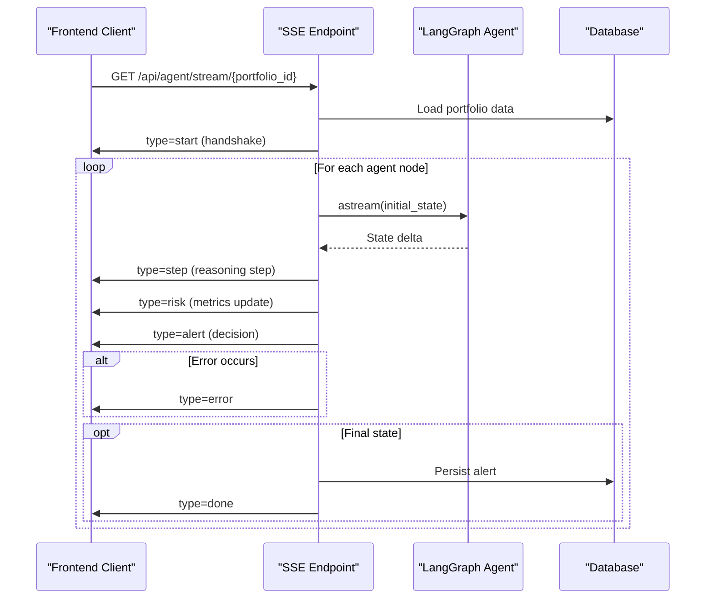
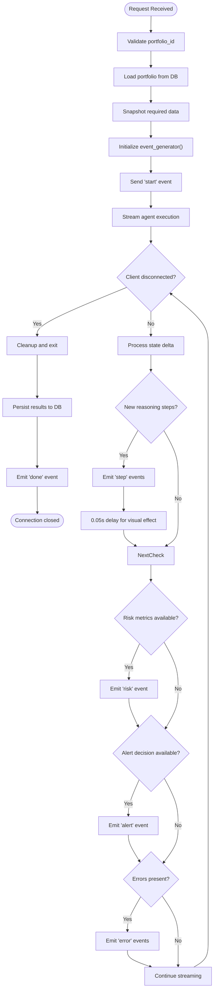
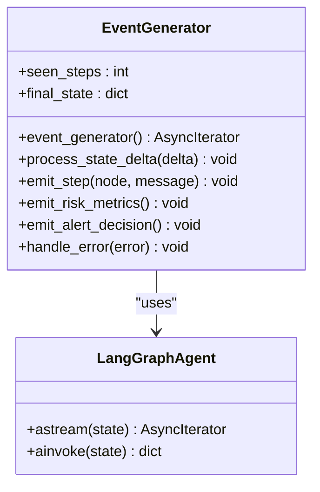
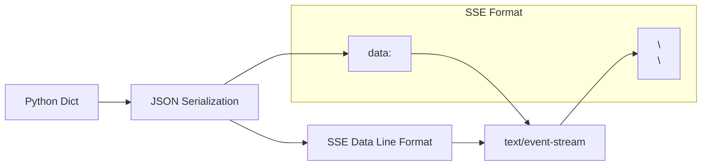
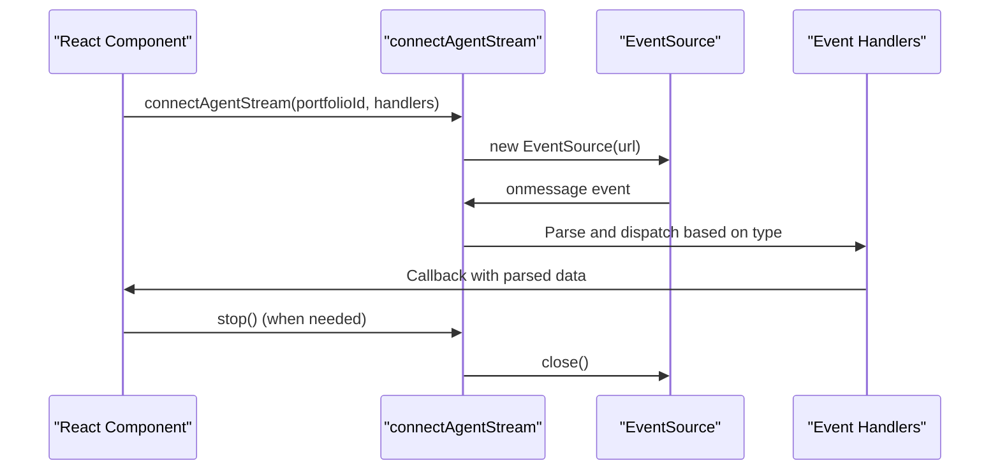
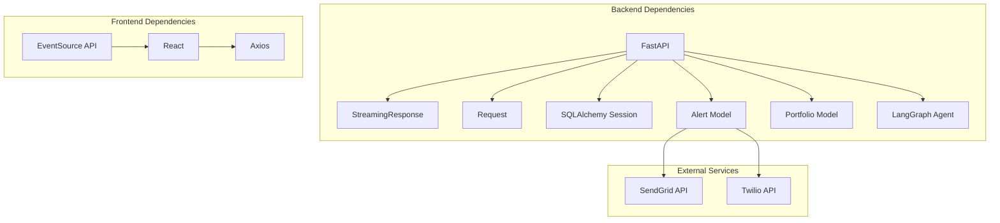

# Server-Sent Events Implementation

<cite>
**Referenced Files in This Document**
- [backend/routers/agent.py](file://backend/routers/agent.py)
- [backend/main.py](file://backend/main.py)
- [backend/agent/graph.py](file://backend/agent/graph.py)
- [backend/agent/state.py](file://backend/agent/state.py)
- [backend/models/alert.py](file://backend/models/alert.py)
- [backend/models/portfolio.py](file://backend/models/portfolio.py)
- [backend/models/database.py](file://backend/models/database.py)
- [frontend/src/services/sse.js](file://frontend/src/services/sse.js)
- [frontend/src/components/AgentFeed.jsx](file://frontend/src/components/AgentFeed.jsx)
</cite>

## Table of Contents
1. [Introduction](#introduction)
2. [Project Structure](#project-structure)
3. [Core Components](#core-components)
4. [Architecture Overview](#architecture-overview)
5. [Detailed Component Analysis](#detailed-component-analysis)
6. [Dependency Analysis](#dependency-analysis)
7. [Performance Considerations](#performance-considerations)
8. [Troubleshooting Guide](#troubleshooting-guide)
9. [Conclusion](#conclusion)

## Introduction
This document provides comprehensive documentation for the Server-Sent Events (SSE) implementation in the ishwarambare-app. It covers the SSE endpoint configuration, event stream format, event generator function implementation, data serialization, and connection management. The SSE system enables real-time streaming of agent reasoning steps, risk metrics updates, alert decisions, and completion notifications to the frontend.

## Project Structure
The SSE implementation spans backend and frontend components:

- Backend:
  - FastAPI router with SSE endpoint at `/api/agent/stream/{portfolio_id}`
  - LangGraph agent that produces state deltas suitable for SSE streaming
  - SQLAlchemy models for portfolio and alert persistence
  - Database configuration supporting multi-threaded operation

- Frontend:
  - EventSource wrapper for connecting to the SSE endpoint
  - Agent feed component that renders streaming events in real-time

```mermaid
graph TB
subgraph "Backend"
FastAPI[FastAPI App]
Router[Agent Router]
SSE[SSE Endpoint<br/>/api/agent/stream/{portfolio_id}]
Graph[LangGraph Agent]
DB[(SQLAlchemy DB)]
end
subgraph "Frontend"
FE[React App]
SSEClient[EventSource Client]
Feed[Agent Feed Component]
end
FE --> SSEClient
SSEClient --> SSE
SSE --> Graph
Graph --> DB
SSE --> DB
```

**Diagram sources**
- [backend/routers/agent.py:39-168](file://backend/routers/agent.py#L39-L168)
- [backend/main.py:12-43](file://backend/main.py#L12-L43)
- [frontend/src/services/sse.js:21-62](file://frontend/src/services/sse.js#L21-L62)

**Section sources**
- [backend/routers/agent.py:1-243](file://backend/routers/agent.py#L1-L243)
- [backend/main.py:1-59](file://backend/main.py#L1-L59)

## Core Components
The SSE implementation consists of several key components:

### SSE Endpoint Configuration
The backend exposes a dedicated SSE endpoint with specific headers and media type:

- Route: `GET /api/agent/stream/{portfolio_id}`
- Media Type: `text/event-stream`
- Headers:
  - `Cache-Control: no-cache`
  - `X-Accel-Buffering: no` (for Nginx compatibility)
  - `Access-Control-Allow-Origin: *`

### Event Generator Function
The event generator manages the complete lifecycle of an agent run:

1. Initial handshake with portfolio metadata
2. Streaming of reasoning steps with delta-based updates
3. Risk metrics updates when computed
4. Alert decision notifications
5. Error handling and graceful termination
6. Database persistence of results

### Data Serialization
Events are serialized using a simple helper that formats JSON data according to SSE specifications.

**Section sources**
- [backend/routers/agent.py:39-168](file://backend/routers/agent.py#L39-L168)
- [backend/routers/agent.py:32-34](file://backend/routers/agent.py#L32-L34)

## Architecture Overview
The SSE architecture follows a producer-consumer pattern where the backend produces state deltas and the frontend consumes them in real-time.



**Diagram sources**
- [backend/routers/agent.py:69-168](file://backend/routers/agent.py#L69-L168)
- [backend/agent/graph.py:162-203](file://backend/agent/graph.py#L162-L203)

## Detailed Component Analysis

### SSE Endpoint Implementation
The `/api/agent/stream/{portfolio_id}` endpoint serves as the central hub for real-time communication:



**Diagram sources**
- [backend/routers/agent.py:69-168](file://backend/routers/agent.py#L69-L168)

#### Event Types and Payloads
The SSE endpoint emits five distinct event types with specific payload structures:

1. **start** - Initial handshake event
   - Payload: `{ type: "start", portfolio: dict, name: string }`
   - Purpose: Provides portfolio metadata for UI initialization

2. **step** - Reasoning step event
   - Payload: `{ type: "step", node: string, message: string }`
   - Purpose: Streams individual reasoning steps from agent nodes

3. **risk** - Risk metrics event
   - Payload: `{ type: "risk", risk_score: float, risk_level: string, metrics: dict }`
   - Purpose: Updates risk assessment with computed metrics

4. **alert** - Alert decision event
   - Payload: `{ type: "alert", triggered: boolean }`
   - Purpose: Indicates whether risk threshold was exceeded

5. **done** - Completion event
   - Payload: `{ type: "done", alert_id: int }`
   - Purpose: Signals successful completion and provides alert ID

6. **error** - Error event
   - Payload: `{ type: "error", message: string }`
   - Purpose: Reports exceptions or failures during execution

#### Connection Management
The implementation includes robust connection management:

- Client disconnection detection using `request.is_disconnected()`
- Graceful cleanup when clients disconnect
- Automatic connection closure upon completion
- Error handling with fallback events

**Section sources**
- [backend/routers/agent.py:39-168](file://backend/routers/agent.py#L39-L168)

### Event Generator Function Implementation
The event generator coordinates the entire streaming process:

#### Async Iteration Over Agent States
The generator uses LangGraph's `astream()` method to iterate over state changes:



**Diagram sources**
- [backend/routers/agent.py:69-127](file://backend/routers/agent.py#L69-L127)
- [backend/agent/graph.py:162-203](file://backend/agent/graph.py#L162-L203)

#### Delta-Based Reasoning Step Emission
The implementation efficiently streams only new reasoning steps:

- Maintains a counter (`seen_steps`) of previously emitted steps
- Extracts new steps from the latest state update
- Emits only incremental changes to reduce bandwidth
- Applies a small delay (0.05 seconds) for better visual presentation

#### Connection Resilience Mechanisms
Multiple layers ensure reliable streaming:

- Periodic disconnection checks prevent resource leaks
- Exception handling ensures graceful degradation
- Database operations executed in separate threads
- Automatic cleanup on client disconnect

**Section sources**
- [backend/routers/agent.py:69-127](file://backend/routers/agent.py#L69-L127)

### Data Serialization and Helper Functions
The `_sse` helper function provides standardized event formatting:



**Diagram sources**
- [backend/routers/agent.py:32-34](file://backend/routers/agent.py#L32-L34)

#### JSON Formatting Details
- Uses `json.dumps()` for safe serialization
- Handles nested dictionaries and lists
- Ensures proper escaping of special characters
- Maintains event boundaries with blank line separators

**Section sources**
- [backend/routers/agent.py:32-34](file://backend/routers/agent.py#L32-L34)

### Frontend Integration
The frontend consumes the SSE stream through a dedicated service:

#### EventSource Wrapper
The frontend service provides a clean interface for SSE consumption:



**Diagram sources**
- [frontend/src/services/sse.js:21-62](file://frontend/src/services/sse.js#L21-L62)

#### Real-Time Rendering
The AgentFeed component renders events as they arrive:

- Maintains a scrollable log of reasoning steps
- Color-codes messages based on content
- Tracks step count and execution status
- Provides controls for starting, stopping, and resetting streams

**Section sources**
- [frontend/src/services/sse.js:1-62](file://frontend/src/services/sse.js#L1-L62)
- [frontend/src/components/AgentFeed.jsx:1-175](file://frontend/src/components/AgentFeed.jsx#L1-L175)

## Dependency Analysis
The SSE implementation involves several interconnected dependencies:



**Diagram sources**
- [backend/routers/agent.py:17-24](file://backend/routers/agent.py#L17-L24)
- [backend/models/alert.py:14-43](file://backend/models/alert.py#L14-L43)
- [backend/agent/graph.py:26-33](file://backend/agent/graph.py#L26-L33)

### Database Thread Safety
The implementation addresses thread safety concerns through:

- Separate database sessions for different threads
- Executor-based database operations
- Proper session lifecycle management
- SQLite configuration allowing multi-threaded access

**Section sources**
- [backend/routers/agent.py:171-181](file://backend/routers/agent.py#L171-L181)
- [backend/models/database.py:17-22](file://backend/models/database.py#L17-L22)

## Performance Considerations
Several performance optimizations are implemented:

### Visual Effect Delay
A 0.05-second delay is applied between step emissions to improve visual presentation:

- Prevents overwhelming the frontend with rapid updates
- Allows users to follow the reasoning process
- Balances responsiveness with readability

### Asynchronous Database Operations
Database writes are performed asynchronously to avoid blocking the event loop:

- Uses `loop.run_in_executor()` for blocking operations
- Creates fresh database sessions in separate threads
- Prevents request timeouts during long-running operations

### Efficient State Streaming
Delta-based reasoning step emission reduces bandwidth usage:

- Only new steps are transmitted
- State aggregation prevents duplicate emissions
- Minimal payload sizes for each event

### Connection Management
Proper connection lifecycle management prevents resource leaks:

- Immediate cleanup on client disconnect
- Automatic connection closure on completion
- Error handling prevents hanging connections

**Section sources**
- [backend/routers/agent.py:101](file://backend/routers/agent.py#L101)
- [backend/routers/agent.py:149-151](file://backend/routers/agent.py#L149-L151)

## Troubleshooting Guide

### Common Issues and Solutions

#### Connection Problems
- **Symptom**: Client cannot establish SSE connection
- **Causes**: CORS configuration, network issues, server restart
- **Solutions**: Verify CORS settings, check network connectivity, ensure server stability

#### Disconnection Handling
- **Symptom**: Stream stops unexpectedly
- **Causes**: Client-side disconnection, server timeout, network interruption
- **Solutions**: Implement reconnection logic, monitor connection status, handle errors gracefully

#### Performance Issues
- **Symptom**: Slow event delivery or lag
- **Causes**: High latency, large payloads, insufficient resources
- **Solutions**: Optimize payload sizes, implement batching, scale infrastructure

#### Error Handling
The system includes comprehensive error handling:

- Database operation failures emit error events
- Agent execution errors are caught and reported
- Client disconnection is detected and handled gracefully
- Logging provides visibility into execution issues

**Section sources**
- [backend/routers/agent.py:123-126](file://backend/routers/agent.py#L123-L126)
- [backend/routers/agent.py:155-158](file://backend/routers/agent.py#L155-L158)

## Conclusion
The SSE implementation in ishwarambare-app provides a robust, real-time communication channel between the backend agent execution and the frontend user interface. The implementation demonstrates best practices in event-driven architecture, including efficient delta-based streaming, proper connection management, and comprehensive error handling. The modular design allows for easy extension and maintenance while providing excellent user experience through real-time feedback.

The system successfully balances performance considerations with reliability, ensuring smooth operation under various conditions. The clear separation between backend streaming logic and frontend consumption makes the implementation maintainable and extensible for future enhancements.