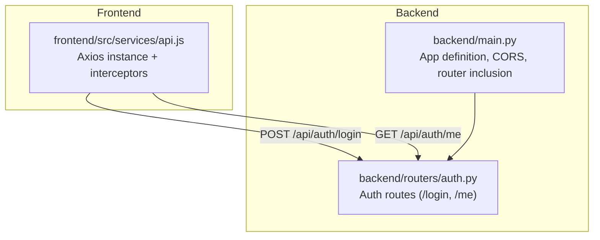
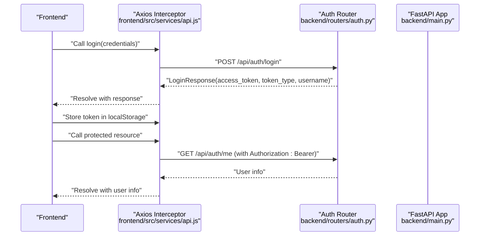
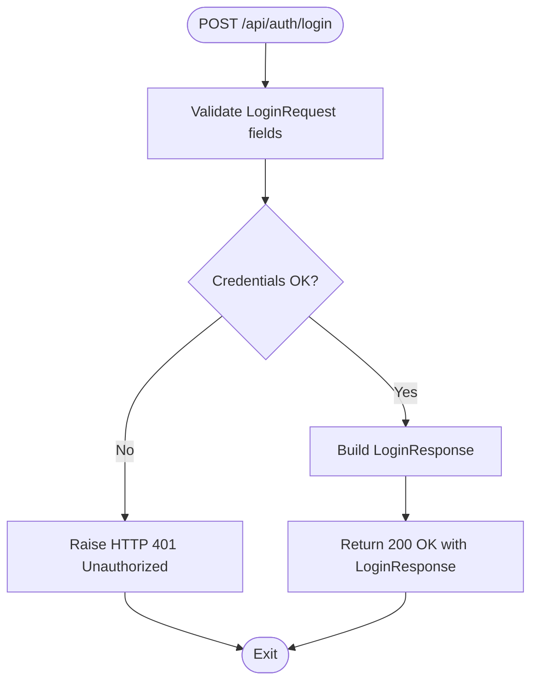
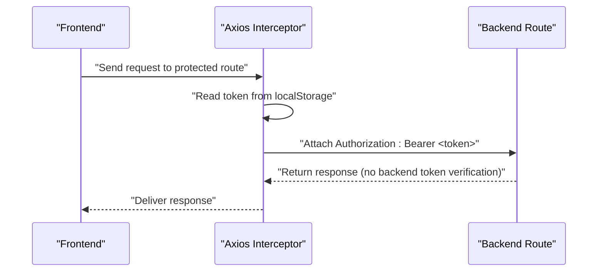
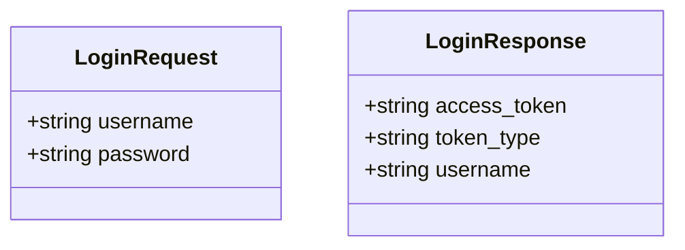
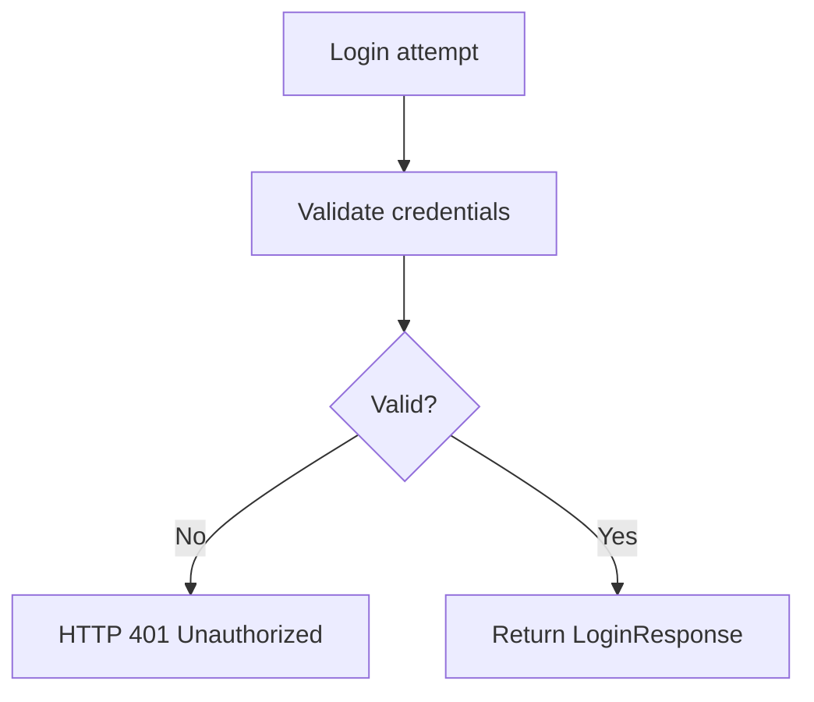
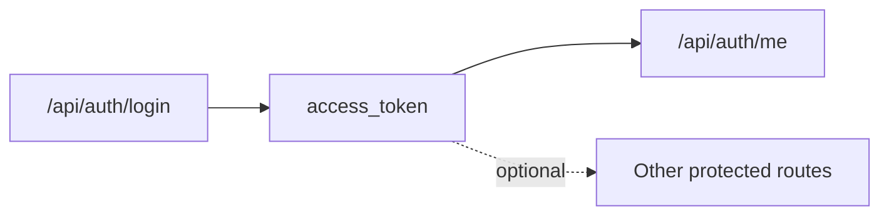
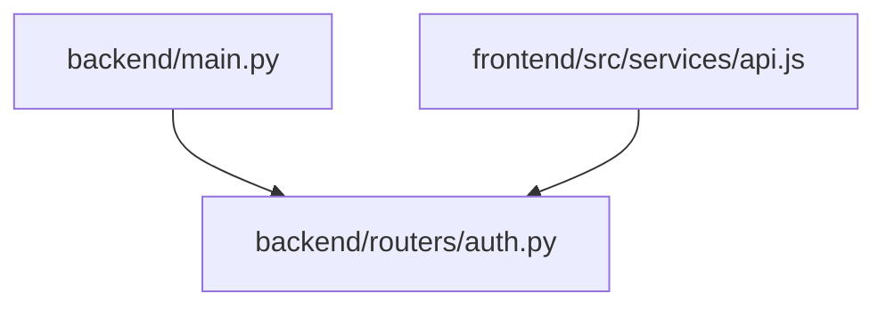

# Authentication System

<cite>
**Referenced Files in This Document**
- [backend/main.py](file://backend/main.py)
- [backend/routers/auth.py](file://backend/routers/auth.py)
- [frontend/src/services/api.js](file://frontend/src/services/api.js)
- [README.md](file://README.md)
</cite>

## Table of Contents
1. [Introduction](#introduction)
2. [Project Structure](#project-structure)
3. [Core Components](#core-components)
4. [Architecture Overview](#architecture-overview)
5. [Detailed Component Analysis](#detailed-component-analysis)
6. [Dependency Analysis](#dependency-analysis)
7. [Performance Considerations](#performance-considerations)
8. [Troubleshooting Guide](#troubleshooting-guide)
9. [Conclusion](#conclusion)

## Introduction
This document explains the authentication system implementation for the ishwarambare application. It focuses on the login endpoint, request and response schemas, token-based authentication flow, Pydantic validation, error handling, and integration with the frontend. It also outlines security considerations, token storage, and best practices for protecting routes.

## Project Structure
The authentication system spans the backend FastAPI application and the frontend Axios service layer:
- Backend exposes authentication routes under /api/auth and includes a demo login endpoint and a user info endpoint.
- Frontend integrates with the backend via an Axios instance that attaches Authorization headers for authenticated requests.

**Diagram sources**
- [backend/main.py:10-33](file://backend/main.py#L10-L33)
- [backend/routers/auth.py:18-38](file://backend/routers/auth.py#L18-L38)
- [frontend/src/services/api.js:3-28](file://frontend/src/services/api.js#L3-L28)

**Section sources**
- [backend/main.py:10-33](file://backend/main.py#L10-L33)
- [README.md:111-123](file://README.md#L111-L123)

## Core Components
- Login endpoint: POST /api/auth/login validates credentials and returns a token response model.
- Token-based authentication: Frontend attaches Authorization: Bearer <token> to subsequent requests.
- User info endpoint: GET /api/auth/me returns current user stub data.
- Pydantic models: LoginRequest and LoginResponse define request/response schemas.

Key implementation references:
- Login endpoint and response model: [backend/routers/auth.py:18-32](file://backend/routers/auth.py#L18-L32)
- Pydantic models: [backend/routers/auth.py:7-16](file://backend/routers/auth.py#L7-L16)
- Frontend Axios interceptor and auth endpoints: [frontend/src/services/api.js:9-23](file://frontend/src/services/api.js#L9-L23)
- Router registration: [backend/main.py:30-32](file://backend/main.py#L30-L32)

**Section sources**
- [backend/routers/auth.py:7-16](file://backend/routers/auth.py#L7-L16)
- [backend/routers/auth.py:18-32](file://backend/routers/auth.py#L18-L32)
- [frontend/src/services/api.js:9-23](file://frontend/src/services/api.js#L9-L23)
- [backend/main.py:30-32](file://backend/main.py#L30-L32)

## Architecture Overview
The authentication flow connects the frontend and backend as follows:
- The frontend sends login credentials to the backend.
- On successful validation, the backend responds with an access token and user identity.
- Subsequent requests include the token in the Authorization header for protected resources.

**Diagram sources**
- [backend/routers/auth.py:18-38](file://backend/routers/auth.py#L18-L38)
- [frontend/src/services/api.js:9-23](file://frontend/src/services/api.js#L9-L23)
- [backend/main.py:30-32](file://backend/main.py#L30-L32)

## Detailed Component Analysis

### Login Endpoint and Schemas
- Endpoint: POST /api/auth/login
- Request schema: LoginRequest with username and password.
- Response schema: LoginResponse with access_token, token_type, and username.
- Validation and error handling:
  - Demo validation checks for hardcoded credentials.
  - On invalid credentials, raises HTTP 401 Unauthorized.

**Diagram sources**
- [backend/routers/auth.py:18-32](file://backend/routers/auth.py#L18-L32)

**Section sources**
- [backend/routers/auth.py:18-32](file://backend/routers/auth.py#L18-L32)
- [backend/routers/auth.py:7-16](file://backend/routers/auth.py#L7-L16)

### Token-Based Authentication Flow
- Frontend interceptor automatically attaches Authorization: Bearer <token> when present in localStorage.
- Protected routes (e.g., /api/auth/me) rely on the presence of a valid token in the Authorization header.
- The current implementation does not enforce token verification at the backend for /api/auth/me; it returns stub data.

**Diagram sources**
- [frontend/src/services/api.js:9-13](file://frontend/src/services/api.js#L9-L13)
- [backend/routers/auth.py:35-38](file://backend/routers/auth.py#L35-L38)

**Section sources**
- [frontend/src/services/api.js:9-13](file://frontend/src/services/api.js#L9-L13)
- [backend/routers/auth.py:35-38](file://backend/routers/auth.py#L35-L38)

### Pydantic Models and Validation
- LoginRequest: Defines required fields username and password.
- LoginResponse: Defines access_token, token_type, and username.
- Validation behavior:
  - Requests are validated against LoginRequest; invalid payloads produce structured errors.
  - Responses are validated against LoginResponse before serialization.

**Diagram sources**
- [backend/routers/auth.py:7-16](file://backend/routers/auth.py#L7-L16)

**Section sources**
- [backend/routers/auth.py:7-16](file://backend/routers/auth.py#L7-L16)

### Error Handling Strategy
- Invalid credentials trigger HTTP 401 Unauthorized with a descriptive detail.
- Frontend should handle this error to inform users and prevent further authenticated requests until re-authentication.

**Diagram sources**
- [backend/routers/auth.py:31-32](file://backend/routers/auth.py#L31-L32)

**Section sources**
- [backend/routers/auth.py:31-32](file://backend/routers/auth.py#L31-L32)

### Relationship Between Authentication and Protected Routes
- The /api/auth/me endpoint currently returns stub data without enforcing token verification.
- To secure routes, implement middleware or dependency functions to verify tokens and attach user identity to requests.

**Diagram sources**
- [backend/routers/auth.py:18-38](file://backend/routers/auth.py#L18-L38)

**Section sources**
- [backend/routers/auth.py:35-38](file://backend/routers/auth.py#L35-L38)

## Dependency Analysis
- Router registration:
  - The app includes the auth router under /api/auth.
- Endpoint exposure:
  - Login and user info endpoints are exposed via the auth router.
- Frontend integration:
  - Axios instance defines base URL and attaches Authorization headers.
  - Exposes login and getMe functions for consumption by UI components.

**Diagram sources**
- [backend/main.py:30-32](file://backend/main.py#L30-L32)
- [frontend/src/services/api.js:22-23](file://frontend/src/services/api.js#L22-L23)

**Section sources**
- [backend/main.py:30-32](file://backend/main.py#L30-L32)
- [frontend/src/services/api.js:22-23](file://frontend/src/services/api.js#L22-L23)

## Performance Considerations
- Token verification overhead: Implement efficient token decoding and validation to avoid latency on protected routes.
- Caching: Cache non-sensitive user metadata to reduce repeated computations.
- Network efficiency: Minimize token size and avoid unnecessary headers.

## Troubleshooting Guide
Common issues and resolutions:
- 401 Unauthorized on login:
  - Verify credentials match the demo validation logic.
  - Confirm frontend sends JSON payload with username and password.
- Missing Authorization header:
  - Ensure the interceptor reads token from localStorage and attaches the Bearer header.
- CORS errors:
  - Confirm ALLOWED_ORIGINS includes the frontend origin.
- Protected route returns unexpected data:
  - The /api/auth/me endpoint currently returns stub data; implement backend token verification to enforce protection.

**Section sources**
- [backend/routers/auth.py:25-32](file://backend/routers/auth.py#L25-L32)
- [frontend/src/services/api.js:9-13](file://frontend/src/services/api.js#L9-L13)
- [backend/main.py:17-28](file://backend/main.py#L17-L28)
- [backend/routers/auth.py:35-38](file://backend/routers/auth.py#L35-L38)

## Conclusion
The authentication system provides a foundation for login and token-based access:
- The backend defines robust Pydantic models and a demo login endpoint.
- The frontend integrates seamlessly via Axios interceptors and exposes convenient auth functions.
To harden the system:
- Replace demo login logic with database-backed credential validation and JWT issuance.
- Enforce token verification on protected routes.
- Securely store tokens and implement refresh strategies.
- Add rate limiting, secure headers, and consider short-lived access tokens with refresh tokens.