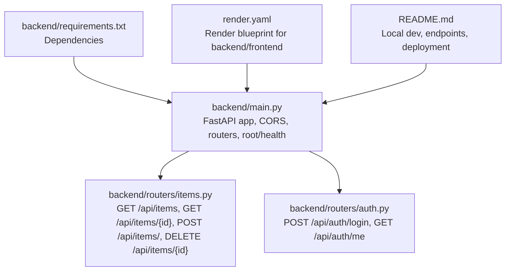
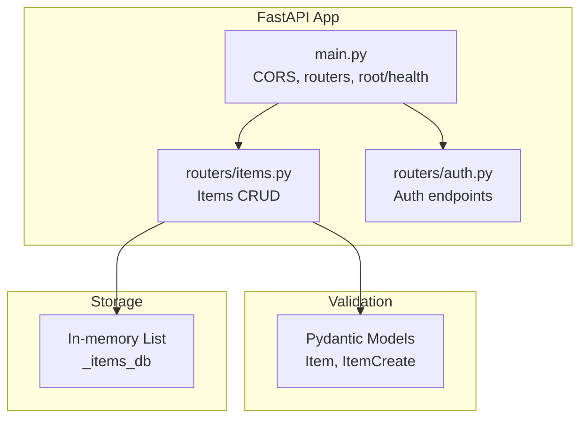
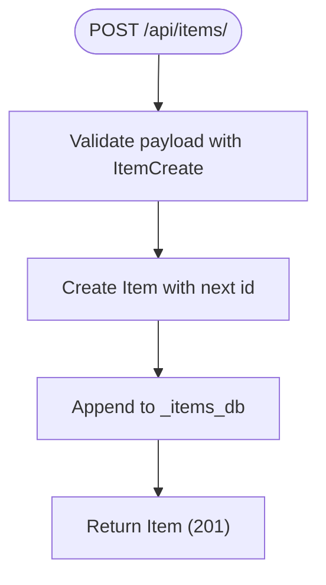
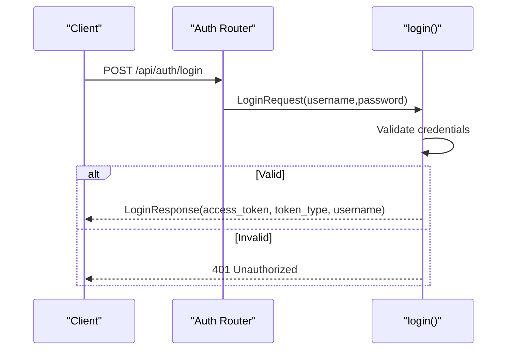
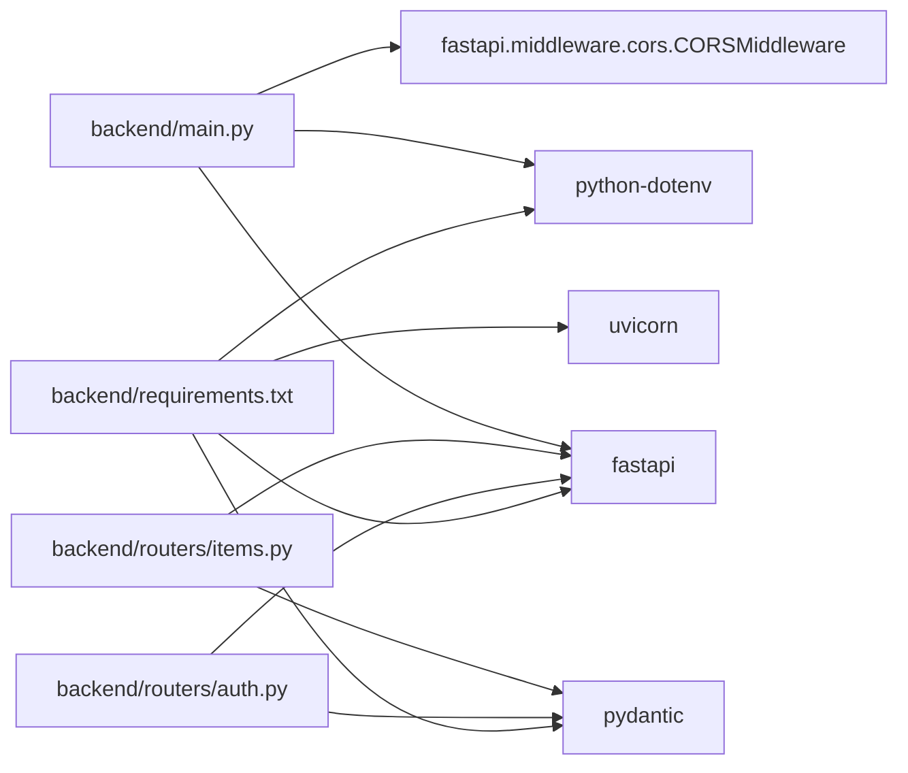

# Backend System

<cite>
**Referenced Files in This Document**
- [backend/main.py](file://backend/main.py)
- [backend/routers/items.py](file://backend/routers/items.py)
- [backend/routers/auth.py](file://backend/routers/auth.py)
- [backend/requirements.txt](file://backend/requirements.txt)
- [render.yaml](file://render.yaml)
- [README.md](file://README.md)
</cite>

## Table of Contents
1. [Introduction](#introduction)
2. [Project Structure](#project-structure)
3. [Core Components](#core-components)
4. [Architecture Overview](#architecture-overview)
5. [Detailed Component Analysis](#detailed-component-analysis)
6. [Dependency Analysis](#dependency-analysis)
7. [Performance Considerations](#performance-considerations)
8. [Troubleshooting Guide](#troubleshooting-guide)
9. [Conclusion](#conclusion)
10. [Appendices](#appendices)

## Introduction
This document explains the backend system built with FastAPI for the ishwarambare-app project. It covers the application architecture, CORS middleware configuration, router registration patterns, authentication system (login endpoints, token handling, and user stubs), item management (CRUD operations, Pydantic validation, and in-memory storage), API endpoint documentation, request/response schemas, error handling strategies, dependency injection patterns, middleware configuration, security considerations, CORS configuration, environment variable management, and practical API usage examples.

## Project Structure
The backend is organized around a FastAPI application with modular routers for items and authentication. Environment variables are loaded via python-dotenv, and CORS is configured centrally. Deployment is orchestrated via Render’s blueprint.

**Diagram sources**
- [backend/main.py:1-44](file://backend/main.py#L1-L44)
- [backend/routers/items.py:1-72](file://backend/routers/items.py#L1-L72)
- [backend/routers/auth.py:1-39](file://backend/routers/auth.py#L1-L39)
- [backend/requirements.txt:1-20](file://backend/requirements.txt#L1-L20)
- [render.yaml:1-48](file://render.yaml#L1-L48)
- [README.md:1-129](file://README.md#L1-L129)

**Section sources**
- [backend/main.py:1-44](file://backend/main.py#L1-L44)
- [README.md:5-25](file://README.md#L5-L25)

## Core Components
- Application entrypoint and configuration:
  - FastAPI app creation with metadata (title, description, version).
  - Environment loading via python-dotenv.
  - CORS middleware configured with origins from environment variables.
  - Router registration for items and auth under /api prefixes.
  - Root and health endpoints exposed for diagnostics.
- Routers:
  - Items router: CRUD endpoints for items with Pydantic models for validation and responses.
  - Auth router: Login endpoint returning a demo token and a stub for current user info.

Key implementation references:
- App initialization and CORS: [backend/main.py:10-28](file://backend/main.py#L10-L28)
- Router registration: [backend/main.py:30-32](file://backend/main.py#L30-L32)
- Root and health endpoints: [backend/main.py:35-43](file://backend/main.py#L35-L43)
- Items router: [backend/routers/items.py:1-72](file://backend/routers/items.py#L1-L72)
- Auth router: [backend/routers/auth.py:1-39](file://backend/routers/auth.py#L1-L39)

**Section sources**
- [backend/main.py:10-43](file://backend/main.py#L10-L43)
- [backend/routers/items.py:1-72](file://backend/routers/items.py#L1-L72)
- [backend/routers/auth.py:1-39](file://backend/routers/auth.py#L1-L39)

## Architecture Overview
The backend follows a layered architecture:
- Entry point: FastAPI app with middleware and router mounts.
- Routers: Feature-based routing for items and auth.
- Validation: Pydantic models define schemas for requests and responses.
- Storage: In-memory lists serve as the temporary data store for items.
- Security: CORS configured centrally; authentication is a placeholder for JWT.

**Diagram sources**
- [backend/main.py:10-32](file://backend/main.py#L10-L32)
- [backend/routers/items.py:9-31](file://backend/routers/items.py#L9-L31)
- [backend/routers/auth.py:7-16](file://backend/routers/auth.py#L7-L16)

## Detailed Component Analysis

### Application Entry Point and Middleware
- FastAPI app creation with metadata.
- Environment variables loaded via python-dotenv.
- CORS middleware configured with origins from ALLOWED_ORIGINS, allowing credentials and all methods/headers.
- Router registration with prefixes and tags for API grouping.
- Root and health endpoints for quick checks.

Implementation highlights:
- CORS configuration: [backend/main.py:17-28](file://backend/main.py#L17-L28)
- Router registration: [backend/main.py:31-32](file://backend/main.py#L31-L32)
- Root and health endpoints: [backend/main.py:36-43](file://backend/main.py#L36-L43)

**Section sources**
- [backend/main.py:10-43](file://backend/main.py#L10-L43)

### Items Management Router
Endpoints:
- GET /api/items/ — List all items.
- GET /api/items/{id} — Retrieve a single item by ID.
- POST /api/items/ — Create a new item.
- DELETE /api/items/{id} — Delete an item by ID.

Data models:
- Item: response model with id, name, description, price, in_stock.
- ItemCreate: request model for creation with optional description and defaults for in_stock.

Storage:
- In-memory list (_items_db) initialized with seed data and a counter for next ID.

Error handling:
- 404 Not Found raised when item not found in GET or DELETE.

Processing logic:
- GET by ID iterates the list to match id.
- POST creates a new item with next id and appends to list.
- DELETE filters out items by id; raises 404 if no change occurs.

**Diagram sources**
- [backend/routers/items.py:52-59](file://backend/routers/items.py#L52-L59)

**Section sources**
- [backend/routers/items.py:36-71](file://backend/routers/items.py#L36-L71)
- [backend/routers/items.py:9-31](file://backend/routers/items.py#L9-L31)

### Authentication Router
Endpoints:
- POST /api/auth/login — Demo login returning a token stub and username.
- GET /api/auth/me — Stub to return current user info.

Data models:
- LoginRequest: username and password.
- LoginResponse: access_token, token_type, username.

Security note:
- Demo login validates hardcoded credentials and raises 401 for invalid ones.
- Token is a placeholder; replace with JWT and database validation.

**Diagram sources**
- [backend/routers/auth.py:18-32](file://backend/routers/auth.py#L18-L32)

**Section sources**
- [backend/routers/auth.py:18-39](file://backend/routers/auth.py#L18-L39)
- [backend/routers/auth.py:7-16](file://backend/routers/auth.py#L7-L16)

### API Endpoint Documentation
- Root: GET /
  - Response: message and status.
- Health: GET /health
  - Response: status.
- Items:
  - GET /api/items/ → List[Item]
  - GET /api/items/{id} → Item
  - POST /api/items/ → Item (201)
  - DELETE /api/items/{id} → {"detail": "Item deleted"}
- Auth:
  - POST /api/auth/login → LoginResponse
  - GET /api/auth/me → Current user stub

Request/Response schemas:
- Item: id, name, description (optional), price, in_stock (default true).
- ItemCreate: name, description (optional), price, in_stock (default true).
- LoginRequest: username, password.
- LoginResponse: access_token, token_type, username.

Error handling:
- 404 Not Found for missing items in GET and DELETE.
- 401 Unauthorized for invalid credentials in login.

**Section sources**
- [backend/main.py:36-43](file://backend/main.py#L36-L43)
- [backend/routers/items.py:36-71](file://backend/routers/items.py#L36-L71)
- [backend/routers/auth.py:18-39](file://backend/routers/auth.py#L18-L39)
- [README.md:111-123](file://README.md#L111-L123)

## Dependency Analysis
- FastAPI and Pydantic are the primary framework dependencies.
- python-dotenv enables environment-driven configuration.
- Uvicorn is used for local development and Render start command.
- CORS middleware depends on ALLOWED_ORIGINS environment variable.

**Diagram sources**
- [backend/main.py:1-6](file://backend/main.py#L1-L6)
- [backend/routers/items.py:1-3](file://backend/routers/items.py#L1-L3)
- [backend/routers/auth.py:1-2](file://backend/routers/auth.py#L1-L2)
- [backend/requirements.txt:1-20](file://backend/requirements.txt#L1-L20)

**Section sources**
- [backend/requirements.txt:1-20](file://backend/requirements.txt#L1-L20)
- [backend/main.py:1-6](file://backend/main.py#L1-L6)

## Performance Considerations
- In-memory storage:
  - Linear scan for GET by id and filtering for DELETE are O(n). For larger datasets, consider indexing or a real database.
- CORS overhead:
  - Allow-all headers and methods simplify cross-origin requests but should be restricted in production if needed.
- Uvicorn:
  - Use production-grade ASGI servers (e.g., uvicorn with workers) for higher concurrency in production.

[No sources needed since this section provides general guidance]

## Troubleshooting Guide
Common issues and resolutions:
- CORS errors:
  - Ensure ALLOWED_ORIGINS includes the frontend origin(s). The default includes localhost and production domains.
  - Verify environment loading via python-dotenv and that .env is present locally.
- 404 Not Found on items:
  - Confirm the item id exists in the in-memory list or create items via POST.
- 401 Unauthorized on login:
  - Demo credentials are admin/admin; update to real validation and JWT signing.
- Health check failures:
  - Confirm /health endpoint is reachable and returns healthy status.

Operational references:
- CORS origins and middleware: [backend/main.py:17-28](file://backend/main.py#L17-L28)
- Items CRUD and error handling: [backend/routers/items.py:42-71](file://backend/routers/items.py#L42-L71)
- Auth login and error handling: [backend/routers/auth.py:18-32](file://backend/routers/auth.py#L18-L32)

**Section sources**
- [backend/main.py:17-28](file://backend/main.py#L17-L28)
- [backend/routers/items.py:42-71](file://backend/routers/items.py#L42-L71)
- [backend/routers/auth.py:18-32](file://backend/routers/auth.py#L18-L32)

## Conclusion
The backend provides a clean, modular FastAPI foundation with:
- Centralized CORS configuration and router registration.
- Feature-based routers for items and auth.
- Pydantic models for robust request/response validation.
- In-memory storage suitable for prototyping.
- Clear extension points for JWT authentication, persistent storage, and stricter CORS policies.

[No sources needed since this section summarizes without analyzing specific files]

## Appendices

### Security Considerations
- CORS:
  - Origins are configurable via ALLOWED_ORIGINS. Restrict to known domains in production.
- Authentication:
  - Demo login must be replaced with secure credential validation and JWT issuance.
  - SECRET_KEY should be set in production environments.
- Environment management:
  - Never commit secrets (.env, venv/, node_modules/). Use platform-managed secrets (e.g., Render env vars).

References:
- CORS configuration: [backend/main.py:17-28](file://backend/main.py#L17-L28)
- Render secrets: [render.yaml:15-21](file://render.yaml#L15-L21)
- README secrets guidance: [README.md:88-92](file://README.md#L88-L92)

**Section sources**
- [backend/main.py:17-28](file://backend/main.py#L17-L28)
- [render.yaml:15-21](file://render.yaml#L15-L21)
- [README.md:88-92](file://README.md#L88-L92)

### Environment Variable Management
- Local development:
  - Copy .env.example to .env and set ALLOWED_ORIGINS and SECRET_KEY.
  - Run uvicorn with reload for development.
- Production (Render):
  - ALLOWED_ORIGINS and SECRET_KEY are managed by Render blueprint.
  - Health check path is /health.

References:
- Local dev steps: [README.md:29-56](file://README.md#L29-L56)
- Render blueprint: [render.yaml:15-21](file://render.yaml#L15-L21)

**Section sources**
- [README.md:29-56](file://README.md#L29-L56)
- [render.yaml:15-21](file://render.yaml#L15-L21)

### Practical API Usage Examples
- List items:
  - GET /api/items/
- Get item by id:
  - GET /api/items/{id}
- Create item:
  - POST /api/items/ with JSON body containing name, description (optional), price, in_stock (optional)
- Delete item:
  - DELETE /api/items/{id}
- Login:
  - POST /api/auth/login with username and password
- Current user:
  - GET /api/auth/me

References:
- Endpoints table: [README.md:111-123](file://README.md#L111-L123)
- Items router endpoints: [backend/routers/items.py:36-71](file://backend/routers/items.py#L36-L71)
- Auth router endpoints: [backend/routers/auth.py:18-39](file://backend/routers/auth.py#L18-L39)

**Section sources**
- [README.md:111-123](file://README.md#L111-L123)
- [backend/routers/items.py:36-71](file://backend/routers/items.py#L36-L71)
- [backend/routers/auth.py:18-39](file://backend/routers/auth.py#L18-L39)