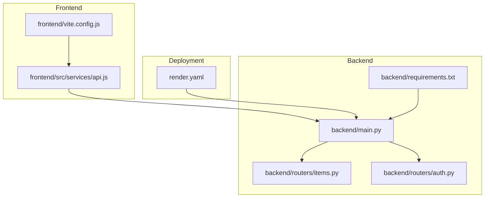
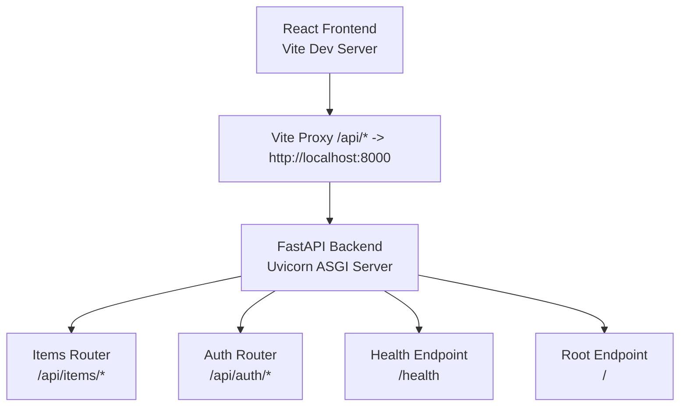
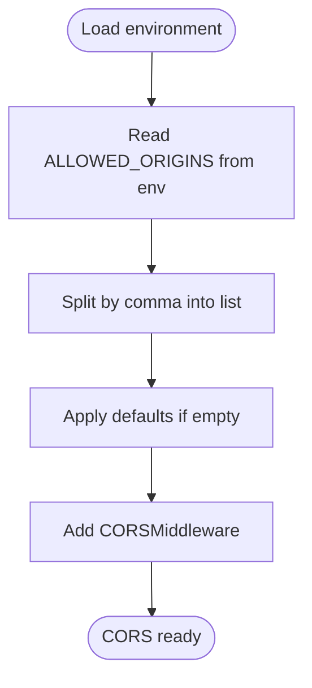
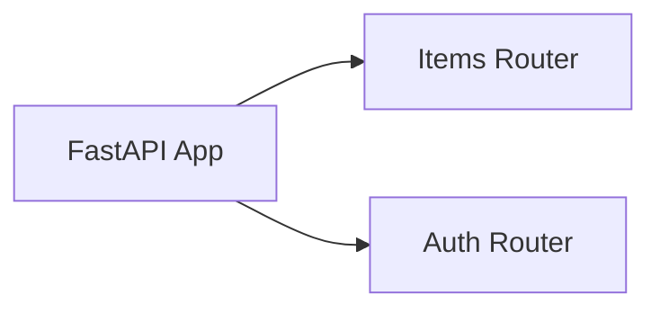
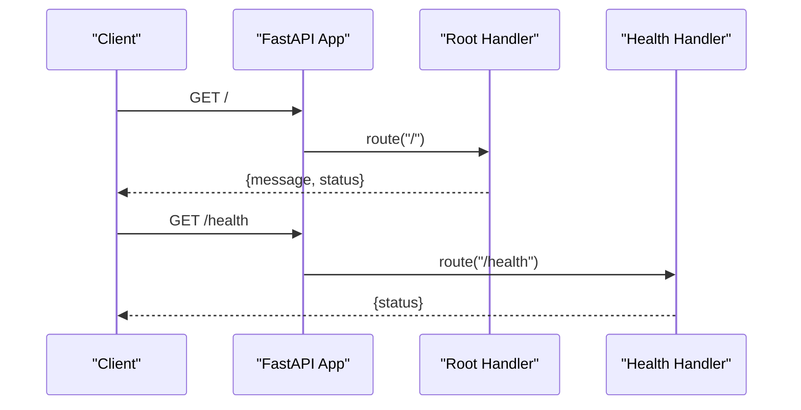
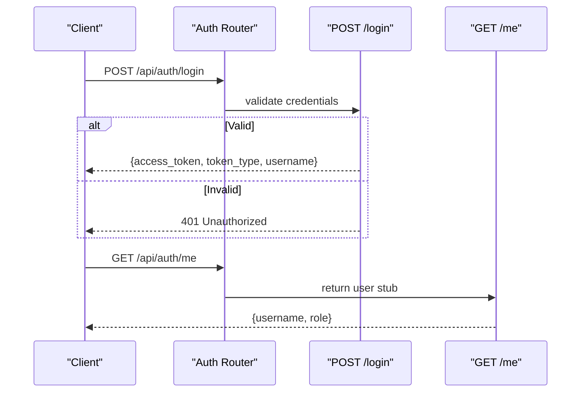
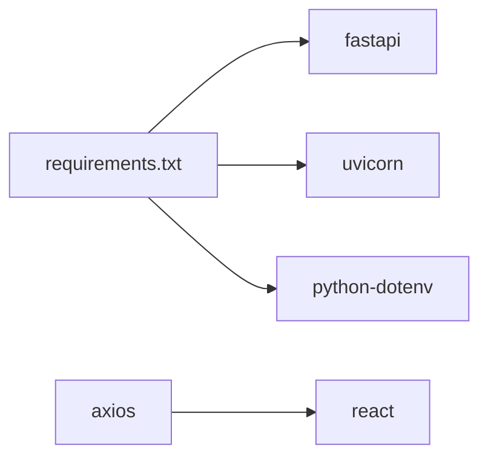

# FastAPI Application

<cite>
**Referenced Files in This Document**
- [backend/main.py](file://backend/main.py)
- [backend/routers/items.py](file://backend/routers/items.py)
- [backend/routers/auth.py](file://backend/routers/auth.py)
- [backend/requirements.txt](file://backend/requirements.txt)
- [README.md](file://README.md)
- [render.yaml](file://render.yaml)
- [frontend/src/services/api.js](file://frontend/src/services/api.js)
- [frontend/vite.config.js](file://frontend/vite.config.js)
</cite>

## Table of Contents
1. [Introduction](#introduction)
2. [Project Structure](#project-structure)
3. [Core Components](#core-components)
4. [Architecture Overview](#architecture-overview)
5. [Detailed Component Analysis](#detailed-component-analysis)
6. [Dependency Analysis](#dependency-analysis)
7. [Performance Considerations](#performance-considerations)
8. [Troubleshooting Guide](#troubleshooting-guide)
9. [Conclusion](#conclusion)
10. [Appendices](#appendices)

## Introduction
This document explains the FastAPI application configuration and setup for the ishwarambare.online project. It covers application initialization, CORS middleware configuration, router registration patterns, environment variable loading, allowed origins configuration, security settings, application metadata, and the root and health check endpoints. Practical examples demonstrate CORS configuration, middleware setup, and router inclusion patterns. Deployment considerations and environment-specific configurations are addressed for local development and production on Render.

## Project Structure
The application follows a layered structure:
- Backend: FastAPI application with routers for items and authentication
- Frontend: React + Vite client that proxies API requests during development
- Deployment: Render blueprint defining build and runtime commands, environment variables, and health checks



**Diagram sources**
- [backend/main.py:1-44](file://backend/main.py#L1-L44)
- [backend/routers/items.py:1-72](file://backend/routers/items.py#L1-L72)
- [backend/routers/auth.py:1-39](file://backend/routers/auth.py#L1-L39)
- [backend/requirements.txt:1-20](file://backend/requirements.txt#L1-L20)
- [frontend/src/services/api.js:1-28](file://frontend/src/services/api.js#L1-L28)
- [frontend/vite.config.js:1-22](file://frontend/vite.config.js#L1-L22)
- [render.yaml:1-48](file://render.yaml#L1-L48)

**Section sources**
- [README.md:5-25](file://README.md#L5-L25)
- [backend/main.py:1-44](file://backend/main.py#L1-L44)
- [frontend/vite.config.js:1-22](file://frontend/vite.config.js#L1-L22)
- [render.yaml:1-48](file://render.yaml#L1-L48)

## Core Components
- Application initialization: Creates a FastAPI app with metadata (title, description, version) and loads environment variables from a .env file.
- CORS middleware: Configures cross-origin allowances using environment variables with defaults for local development and production domains.
- Router registration: Includes two routers under prefixed paths with tags for API documentation organization.
- Root and health endpoints: Provide a welcome message and a health status for monitoring and readiness checks.

Key configuration highlights:
- Metadata: title, description, version set on the FastAPI app instance.
- Environment variable loading: Uses python-dotenv to load variables from .env.
- Allowed origins: Loaded from ALLOWED_ORIGINS with a sensible default list.
- Middleware: Adds CORSMiddleware with broad allow-all settings for development and production domains.
- Routers: Registered with prefixes "/api/items" and "/api/auth" and tagged for OpenAPI documentation.

**Section sources**
- [backend/main.py:8-14](file://backend/main.py#L8-L14)
- [backend/main.py:17-28](file://backend/main.py#L17-L28)
- [backend/main.py:31-32](file://backend/main.py#L31-L32)
- [backend/main.py:36-43](file://backend/main.py#L36-L43)

## Architecture Overview
The application architecture integrates a FastAPI backend with a React frontend. During development, Vite proxies API requests to the backend. In production, the frontend and backend are deployed as separate services on Render, with the frontend configured to call the backend API URL.



**Diagram sources**
- [frontend/vite.config.js:9-16](file://frontend/vite.config.js#L9-L16)
- [backend/main.py:31-32](file://backend/main.py#L31-L32)
- [backend/main.py:41-43](file://backend/main.py#L41-L43)
- [backend/main.py:36-38](file://backend/main.py#L36-L38)

## Detailed Component Analysis

### Application Initialization and Metadata
- The FastAPI app is initialized with metadata fields for title, description, and version.
- Environment variables are loaded from .env using python-dotenv before any configuration.
- The app instance is the central registry for middleware, routers, and endpoints.

Practical example references:
- [Application creation and metadata:10-14](file://backend/main.py#L10-L14)
- [Environment loading](file://backend/main.py#L8)

**Section sources**
- [backend/main.py:10-14](file://backend/main.py#L10-L14)
- [backend/main.py:8](file://backend/main.py#L8)

### CORS Middleware Configuration
- Allowed origins are loaded from the ALLOWED_ORIGINS environment variable, split into a list.
- Defaults include localhost for development and production domains.
- The middleware allows credentials, all methods, and all headers.

Practical example references:
- [Allowed origins loading and splitting:17-20](file://backend/main.py#L17-L20)
- [CORSMiddleware configuration:22-28](file://backend/main.py#L22-L28)



**Diagram sources**
- [backend/main.py:17-28](file://backend/main.py#L17-L28)

**Section sources**
- [backend/main.py:17-28](file://backend/main.py#L17-L28)

### Router Registration Patterns
- Two routers are included:
  - Items router registered under "/api/items" with tag "Items"
  - Auth router registered under "/api/auth" with tag "Auth"
- Tags improve OpenAPI documentation organization.

Practical example references:
- [Items router registration](file://backend/main.py#L31)
- [Auth router registration](file://backend/main.py#L32)



**Diagram sources**
- [backend/main.py:31-32](file://backend/main.py#L31-L32)

**Section sources**
- [backend/main.py:31-32](file://backend/main.py#L31-L32)

### Root and Health Check Endpoints
- Root endpoint ("/") returns a welcome message and a running status.
- Health endpoint ("/health") returns a simple health status for monitoring and readiness checks.

Practical example references:
- [Root endpoint definition:36-38](file://backend/main.py#L36-L38)
- [Health endpoint definition:41-43](file://backend/main.py#L41-L43)



**Diagram sources**
- [backend/main.py:36-43](file://backend/main.py#L36-L43)

**Section sources**
- [backend/main.py:36-43](file://backend/main.py#L36-L43)

### Items Router
- Defines Pydantic models for Item and ItemCreate.
- Implements CRUD endpoints:
  - GET "/" lists all items
  - GET "/{item_id}" retrieves a single item
  - POST "/" creates a new item
  - DELETE "/{item_id}" deletes an item
- Uses an in-memory list as a temporary data store.

Practical example references:
- [Models and in-memory DB:9-31](file://backend/routers/items.py#L9-L31)
- [GET /api/items/:36-39](file://backend/routers/items.py#L36-L39)
- [GET /api/items/{id}:42-49](file://backend/routers/items.py#L42-L49)
- [POST /api/items/:52-59](file://backend/routers/items.py#L52-L59)
- [DELETE /api/items/{id}:62-71](file://backend/routers/items.py#L62-L71)

```mermaid
flowchart TD
Start(["Incoming Request"]) --> Route{"Route?"}
Route --> |GET /api/items/| List["Return all items"]
Route --> |GET /api/items/{id}| Fetch["Find item by id"]
Route --> |POST /api/items/| Create["Create new item"]
Route --> |DELETE /api/items/{id}| Remove["Remove item by id"]
Fetch --> Found{"Found?"}
Found --> |Yes| ReturnItem["Return item"]
Found --> |No| NotFound["Raise 404"]
Remove --> Deleted{"Deleted?"}
Deleted --> |No| NotFound
Deleted --> |Yes| ReturnOk["Return success"]
```

**Diagram sources**
- [backend/routers/items.py:36-71](file://backend/routers/items.py#L36-L71)

**Section sources**
- [backend/routers/items.py:9-31](file://backend/routers/items.py#L9-L31)
- [backend/routers/items.py:36-71](file://backend/routers/items.py#L36-L71)

### Auth Router
- Defines Pydantic models for LoginRequest and LoginResponse.
- Provides:
  - POST "/login" demo login returning a bearer token stub
  - GET "/me" returns current user info (stub)
- Raises HTTP exceptions for invalid credentials.

Practical example references:
- [Login model and response model:7-16](file://backend/routers/auth.py#L7-L16)
- [POST /api/auth/login:18-32](file://backend/routers/auth.py#L18-L32)
- [GET /api/auth/me:35-38](file://backend/routers/auth.py#L35-L38)



**Diagram sources**
- [backend/routers/auth.py:18-38](file://backend/routers/auth.py#L18-L38)

**Section sources**
- [backend/routers/auth.py:7-16](file://backend/routers/auth.py#L7-L16)
- [backend/routers/auth.py:18-38](file://backend/routers/auth.py#L18-L38)

## Dependency Analysis
- Runtime dependencies are declared in requirements.txt, including FastAPI, Uvicorn, and python-dotenv.
- The application imports routers and registers them with the FastAPI app.
- Frontend uses Axios to communicate with the backend API and Vite for development proxying.



**Diagram sources**
- [backend/requirements.txt:1-20](file://backend/requirements.txt#L1-L20)

**Section sources**
- [backend/requirements.txt:1-20](file://backend/requirements.txt#L1-L20)
- [backend/main.py:6](file://backend/main.py#L6)
- [frontend/src/services/api.js:1-6](file://frontend/src/services/api.js#L1-L6)

## Performance Considerations
- In-memory storage in the items router is suitable for demos but should be replaced with a persistent database in production.
- CORS allows all methods and headers for convenience; restrict these in production environments if needed.
- Health checks are lightweight and suitable for platform health monitoring.

[No sources needed since this section provides general guidance]

## Troubleshooting Guide
Common issues and resolutions:
- CORS errors: Ensure ALLOWED_ORIGINS includes the frontend origin(s). Defaults include localhost and production domains.
- Environment variables not loaded: Confirm .env exists and contains required keys; verify python-dotenv is installed.
- Health check failures: Verify the /health endpoint responds with a healthy status; check Render healthCheckPath configuration.
- Frontend API calls failing: Confirm VITE_API_URL points to the correct backend URL; verify proxy settings in development.

**Section sources**
- [backend/main.py:17-20](file://backend/main.py#L17-L20)
- [backend/main.py:41-43](file://backend/main.py#L41-L43)
- [frontend/src/services/api.js:4](file://frontend/src/services/api.js#L4)
- [frontend/vite.config.js:9-16](file://frontend/vite.config.js#L9-L16)
- [render.yaml:14](file://render.yaml#L14)

## Conclusion
The FastAPI application is configured with clear separation of concerns: metadata and environment loading, CORS middleware, modular routers, and simple endpoints. The setup supports local development with Vite proxying and production deployment on Render with environment variables and health checks. Extend the demo endpoints with real authentication and a persistent database for production readiness.

[No sources needed since this section summarizes without analyzing specific files]

## Appendices

### Environment Variable Loading Mechanism
- Environment variables are loaded from .env using python-dotenv before application configuration.
- ALLOWED_ORIGINS is read and split into a list for CORS configuration.
- Additional environment variables can be added for secrets and configuration.

Practical example references:
- [Environment loading](file://backend/main.py#L8)
- [Allowed origins loading:17-20](file://backend/main.py#L17-L20)

**Section sources**
- [backend/main.py:8](file://backend/main.py#L8)
- [backend/main.py:17-20](file://backend/main.py#L17-L20)

### Allowed Origins Configuration
- Defaults include localhost for development and production domains.
- Customize ALLOWED_ORIGINS for staging or additional domains.

Practical example references:
- [Default origins list](file://backend/main.py#L19)

**Section sources**
- [backend/main.py:19](file://backend/main.py#L19)

### Security Settings
- CORS allows credentials, all methods, and all headers for convenience.
- Consider tightening CORS policies in production.
- Store sensitive configuration like SECRET_KEY in environment variables managed by the platform.

Practical example references:
- [CORSMiddleware configuration:22-28](file://backend/main.py#L22-L28)
- [Render secret key generation:20-21](file://render.yaml#L20-L21)

**Section sources**
- [backend/main.py:22-28](file://backend/main.py#L22-L28)
- [render.yaml:20-21](file://render.yaml#L20-L21)

### Application Metadata
- Title, description, and version are set on the FastAPI app instance.

Practical example references:
- [Metadata fields:11-13](file://backend/main.py#L11-L13)

**Section sources**
- [backend/main.py:11-13](file://backend/main.py#L11-L13)

### Root and Health Endpoints
- Root endpoint returns a welcome message and status.
- Health endpoint returns a simple health status.

Practical example references:
- [Root endpoint:36-38](file://backend/main.py#L36-L38)
- [Health endpoint:41-43](file://backend/main.py#L41-L43)

**Section sources**
- [backend/main.py:36-43](file://backend/main.py#L36-L43)

### Router Inclusion Patterns
- Items router registered under "/api/items" with tag "Items".
- Auth router registered under "/api/auth" with tag "Auth".

Practical example references:
- [Items router registration](file://backend/main.py#L31)
- [Auth router registration](file://backend/main.py#L32)

**Section sources**
- [backend/main.py:31-32](file://backend/main.py#L31-L32)

### Deployment Considerations
- Build command installs dependencies from requirements.txt.
- Start command runs Uvicorn with host and port from environment variables.
- Health check path is set to /health.
- Environment variables include ALLOWED_ORIGINS, ENVIRONMENT, and SECRET_KEY.

Practical example references:
- [Build and start commands:12-13](file://render.yaml#L12-L13)
- [Health check path](file://render.yaml#L14)
- [Environment variables:15-21](file://render.yaml#L15-L21)

**Section sources**
- [render.yaml:12-13](file://render.yaml#L12-L13)
- [render.yaml:14](file://render.yaml#L14)
- [render.yaml:15-21](file://render.yaml#L15-L21)

### Environment-Specific Configurations
- Local development uses Vite proxy to forward /api requests to the backend.
- Production uses Render-managed environment variables and health checks.
- Frontend uses VITE_API_URL to target the production backend URL.

Practical example references:
- [Vite proxy configuration:9-16](file://frontend/vite.config.js#L9-L16)
- [Frontend API base URL](file://frontend/src/services/api.js#L4)
- [Render API URL](file://render.yaml#L42)

**Section sources**
- [frontend/vite.config.js:9-16](file://frontend/vite.config.js#L9-L16)
- [frontend/src/services/api.js:4](file://frontend/src/services/api.js#L4)
- [render.yaml:42](file://render.yaml#L42)