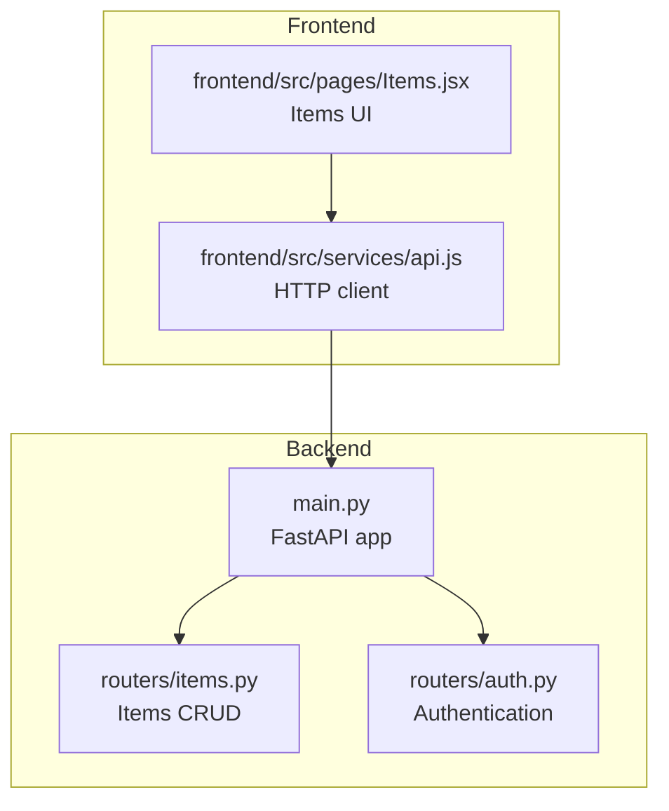
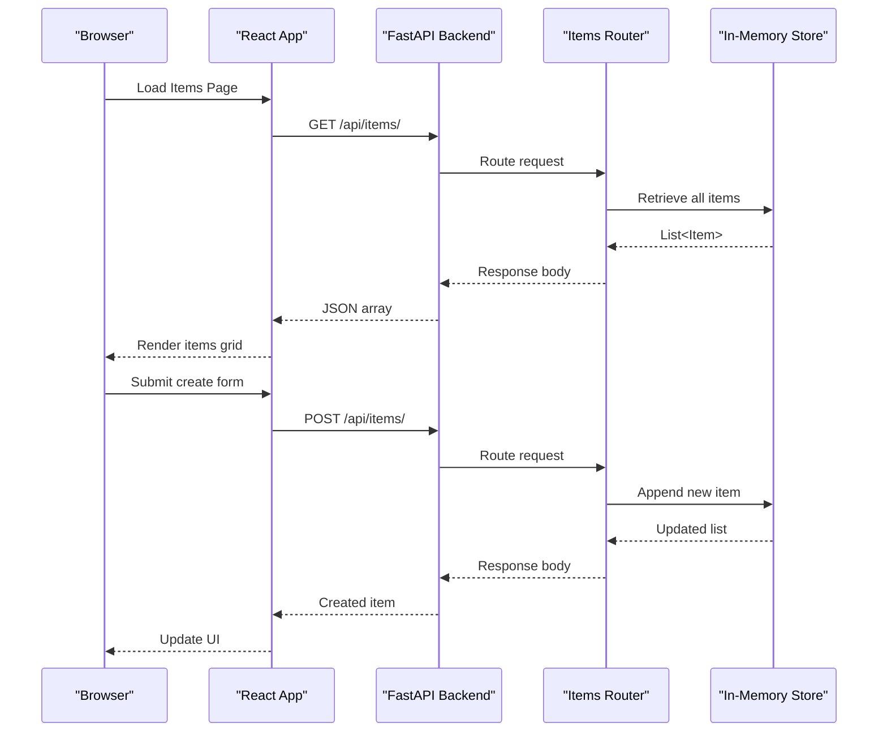
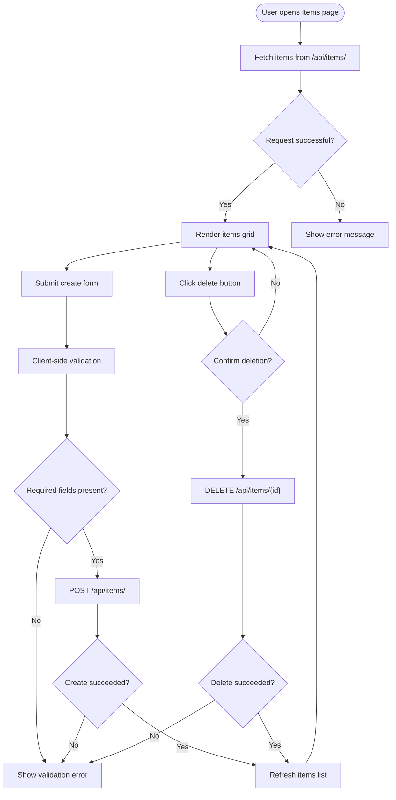
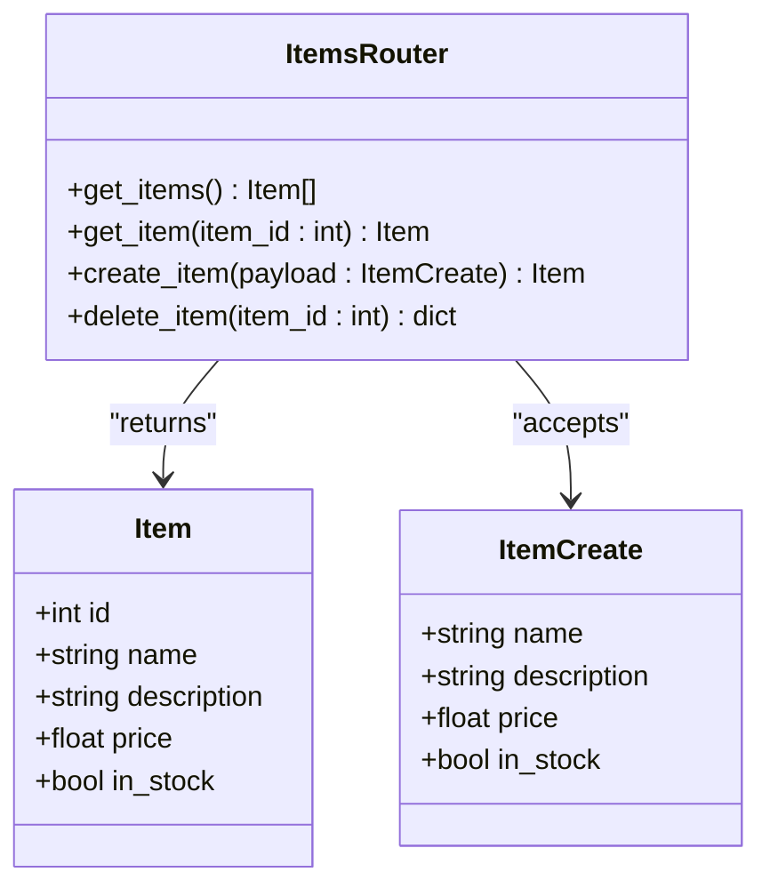
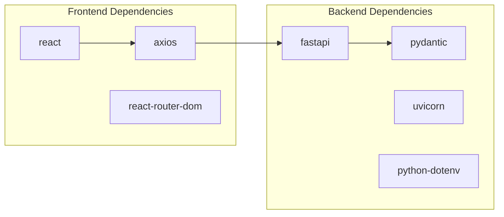

# Items Management System

<cite>
**Referenced Files in This Document**
- [backend/routers/items.py](file://backend/routers/items.py)
- [backend/main.py](file://backend/main.py)
- [backend/routers/auth.py](file://backend/routers/auth.py)
- [frontend/src/pages/Items.jsx](file://frontend/src/pages/Items.jsx)
- [frontend/src/services/api.js](file://frontend/src/services/api.js)
- [README.md](file://README.md)
- [backend/requirements.txt](file://backend/requirements.txt)
- [frontend/package.json](file://frontend/package.json)
</cite>

## Table of Contents
1. [Introduction](#introduction)
2. [Project Structure](#project-structure)
3. [Core Components](#core-components)
4. [Architecture Overview](#architecture-overview)
5. [Detailed Component Analysis](#detailed-component-analysis)
6. [Dependency Analysis](#dependency-analysis)
7. [Performance Considerations](#performance-considerations)
8. [Troubleshooting Guide](#troubleshooting-guide)
9. [Conclusion](#conclusion)
10. [Appendices](#appendices)

## Introduction
This document provides comprehensive documentation for the items management system built with FastAPI (Python) and React (JavaScript). It covers the complete CRUD operations for items, including data validation rules, in-memory storage implementation, API endpoints, request/response schemas, error handling, and practical usage examples. It also addresses in-memory storage limitations, data persistence considerations, and potential migration strategies to persistent databases.

## Project Structure
The project follows a clear separation of concerns:
- Backend: FastAPI application with two primary routers: items and auth
- Frontend: React application with a dedicated page for items and an API service module
- Shared configuration: CORS middleware and router registration in the main application

**Diagram sources**
- [backend/main.py:10-32](file://backend/main.py#L10-L32)
- [backend/routers/items.py:5-71](file://backend/routers/items.py#L5-L71)
- [backend/routers/auth.py:4-38](file://backend/routers/auth.py#L4-L38)
- [frontend/src/pages/Items.jsx:1-124](file://frontend/src/pages/Items.jsx#L1-L124)
- [frontend/src/services/api.js:15-26](file://frontend/src/services/api.js#L15-L26)

**Section sources**
- [README.md:5-25](file://README.md#L5-L25)
- [backend/main.py:10-32](file://backend/main.py#L10-L32)
- [frontend/package.json:11-22](file://frontend/package.json#L11-L22)

## Core Components
This section documents the Pydantic models used for data validation and the in-memory storage implementation.

- Item model
  - Fields: id (int), name (str), description (optional), price (float), in_stock (bool, default True)
  - Validation: Pydantic automatically enforces field types and presence of required fields
  - Purpose: Response model for item data

- ItemCreate model
  - Fields: name (str), description (optional), price (float), in_stock (bool, default True)
  - Validation: Pydantic ensures correct types and defaults
  - Purpose: Request model for creating new items

- In-memory storage
  - Data structure: List of Item objects
  - Initial seed data: Three sample items
  - ID management: Global counter (_next_id) for unique identifiers
  - Persistence: No persistence; data is lost when the process restarts

Key implementation details:
- Data validation occurs automatically via Pydantic models
- Response models define the exact JSON structure returned to clients
- Storage operations are linear-time O(n) for lookups and deletions

**Section sources**
- [backend/routers/items.py:9-21](file://backend/routers/items.py#L9-L21)
- [backend/routers/items.py:24-31](file://backend/routers/items.py#L24-L31)

## Architecture Overview
The system follows a client-server architecture with a FastAPI backend serving REST endpoints and a React frontend consuming those endpoints.

**Diagram sources**
- [frontend/src/pages/Items.jsx:13-23](file://frontend/src/pages/Items.jsx#L13-L23)
- [frontend/src/services/api.js:16-19](file://frontend/src/services/api.js#L16-L19)
- [backend/routers/items.py:36-59](file://backend/routers/items.py#L36-L59)

## Detailed Component Analysis

### API Endpoints
The items router exposes four primary endpoints:

- GET /api/items/
  - Purpose: Retrieve all items
  - Response: Array of Item objects
  - Status codes: 200 OK
  - Implementation: Returns the in-memory list directly

- GET /api/items/{id}
  - Purpose: Retrieve a single item by ID
  - Path parameter: item_id (int)
  - Response: Single Item object
  - Status codes: 200 OK, 404 Not Found
  - Implementation: Linear search through items; raises HTTPException if not found

- POST /api/items/
  - Purpose: Create a new item
  - Request body: ItemCreate object
  - Response: Created Item object
  - Status codes: 201 Created, 422 Unprocessable Entity
  - Implementation: Assigns next available ID, validates via Pydantic, appends to list

- DELETE /api/items/{id}
  - Purpose: Delete an item by ID
  - Path parameter: item_id (int)
  - Response: Success message
  - Status codes: 200 OK, 404 Not Found
  - Implementation: Filters out matching item; raises HTTPException if none removed

Request/response schemas:
- Request schema: ItemCreate (fields: name, description, price, in_stock)
- Response schema: Item (fields: id, name, description, price, in_stock)

Error handling patterns:
- 404 Not Found: Returned when retrieving or deleting non-existent items
- 422 Unprocessable Entity: Automatically generated by FastAPI/Pydantic for invalid requests
- 401 Unauthorized: Authentication endpoints (not covered here)

**Section sources**
- [backend/routers/items.py:36-71](file://backend/routers/items.py#L36-L71)
- [README.md:111-122](file://README.md#L111-L122)

### Frontend Integration
The React frontend integrates with the backend through a dedicated API service:

- Items page
  - Fetches items on mount
  - Displays loading states and errors
  - Provides form for creating new items
  - Handles item deletion with confirmation

- API service
  - Base URL configurable via environment variable
  - Automatic JWT token injection for authenticated requests
  - Convenience functions for all CRUD operations

**Diagram sources**
- [frontend/src/pages/Items.jsx:13-56](file://frontend/src/pages/Items.jsx#L13-L56)
- [frontend/src/services/api.js:16-19](file://frontend/src/services/api.js#L16-L19)

**Section sources**
- [frontend/src/pages/Items.jsx:1-124](file://frontend/src/pages/Items.jsx#L1-L124)
- [frontend/src/services/api.js:15-26](file://frontend/src/services/api.js#L15-L26)

### Data Validation Patterns
The system employs Pydantic models for robust validation:

- Automatic type enforcement: name must be string, price must be numeric, in_stock must be boolean
- Optional field handling: description defaults to null when omitted
- Response shaping: FastAPI serializes models to JSON with consistent field ordering
- Request validation: Pydantic validates incoming data and generates 422 responses for invalid payloads

Validation rules:
- name: required string
- description: optional string
- price: required numeric (float)
- in_stock: optional boolean (defaults to True)

**Section sources**
- [backend/routers/items.py:9-21](file://backend/routers/items.py#L9-L21)

### In-Memory Storage Implementation
The storage layer uses a simple in-memory list with global state:

- Data structure: List[Item]
- Initialization: Pre-populated with three sample items
- ID assignment: Sequential integers starting from 1
- Operations:
  - Lookup: O(n) linear scan by ID
  - Insertion: O(1) append operation
  - Deletion: O(n) filtering operation
- Limitations:
  - Data persists only during process lifetime
  - No concurrent access protection
  - No transaction support
  - No indexing for efficient lookups

**Diagram sources**
- [backend/routers/items.py:9-21](file://backend/routers/items.py#L9-L21)
- [backend/routers/items.py:36-71](file://backend/routers/items.py#L36-L71)

**Section sources**
- [backend/routers/items.py:24-31](file://backend/routers/items.py#L24-L31)
- [backend/routers/items.py:36-71](file://backend/routers/items.py#L36-L71)

## Dependency Analysis
The system has minimal external dependencies:

Backend dependencies (selected):
- fastapi: Web framework and automatic OpenAPI generation
- pydantic: Data validation and serialization
- uvicorn: ASGI server for development
- python-dotenv: Environment variable loading

Frontend dependencies (selected):
- react: UI library
- axios: HTTP client for API communication
- react-router-dom: Client-side routing

**Diagram sources**
- [backend/requirements.txt:7,12,19](file://backend/requirements.txt#L7,L12,L19)
- [frontend/package.json:11-16](file://frontend/package.json#L11-L16)

**Section sources**
- [backend/requirements.txt:1-20](file://backend/requirements.txt#L1-L20)
- [frontend/package.json:11-22](file://frontend/package.json#L11-L22)

## Performance Considerations
Current implementation characteristics:
- Time complexity:
  - Retrieving all items: O(1) array return
  - Retrieving single item: O(n) linear search
  - Creating item: O(1) append
  - Deleting item: O(n) filtering
- Space complexity: O(n) for stored items plus constant overhead
- Scalability limitations:
  - Linear search for lookups becomes slow with large datasets
  - No concurrent write protection
  - Memory usage grows unbounded

Recommendations for improvement:
- Replace linear search with dictionary keyed by ID for O(1) lookups
- Implement pagination for large result sets
- Add caching layer (Redis) for frequently accessed items
- Introduce concurrency controls (locks or atomic operations)
- Add database indexing for common query patterns

## Troubleshooting Guide
Common issues and resolutions:

- Backend not running
  - Symptom: Frontend shows "Failed to load items"
  - Cause: Backend server not started or port blocked
  - Resolution: Start backend with uvicorn, verify port 8000 is free

- CORS errors
  - Symptom: Browser console shows CORS policy errors
  - Cause: Origin not included in ALLOWED_ORIGINS
  - Resolution: Configure ALLOWED_ORIGINS environment variable

- Item not found errors
  - Symptom: 404 responses when accessing items
  - Cause: Non-existent item ID or incorrect route
  - Resolution: Verify item exists in database or use existing IDs

- Validation errors
  - Symptom: 422 responses with validation messages
  - Cause: Missing required fields or wrong types
  - Resolution: Ensure name and price are provided, price is numeric

- Authentication failures
  - Symptom: 401 responses on protected routes
  - Cause: Invalid credentials or missing token
  - Resolution: Use valid admin/admin credentials for demo

**Section sources**
- [backend/main.py:16-28](file://backend/main.py#L16-L28)
- [backend/routers/items.py:48,68-70](file://backend/routers/items.py#L48,L68-L70)
- [backend/routers/auth.py:25,31](file://backend/routers/auth.py#L25,L31)

## Conclusion
The items management system provides a solid foundation for CRUD operations with clean separation between frontend and backend. While the in-memory storage is suitable for development and small-scale usage, production deployments require persistent storage, improved performance characteristics, and enhanced error handling. The modular architecture allows for straightforward migration to a database-backed solution while maintaining the existing API contract.

## Appendices

### Practical Usage Examples

Creating an item:
1. Navigate to the Items page in the React frontend
2. Fill the form with required fields (name, price)
3. Click "Add Item"
4. Observe success message and updated item list

Retrieving items:
1. Visit the Items page
2. Items automatically load from /api/items/
3. View the grid of available items

Deleting an item:
1. On the Items page, click the Delete button for the desired item
2. Confirm the deletion in the browser prompt
3. Verify the item disappears from the list

### Migration Strategies to Persistent Databases

Recommended approaches:
- SQLAlchemy ORM with PostgreSQL/MySQL
- MongoDB with Pydantic models for schema validation
- SQLite for lightweight embedded solutions
- Redis for high-performance caching with persistence

Implementation steps:
1. Define database models mirroring Item schema
2. Replace in-memory operations with database queries
3. Add connection pooling and transaction management
4. Implement proper error handling and retry logic
5. Add database migrations for schema changes
6. Consider adding database indexing for performance