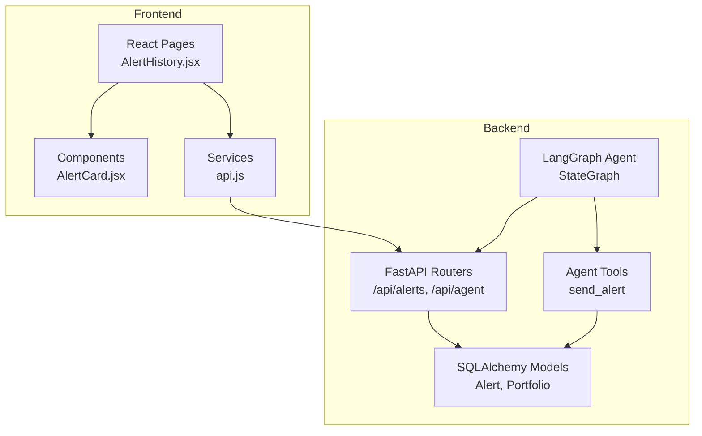
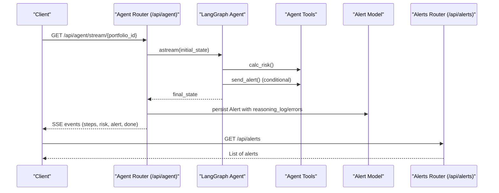
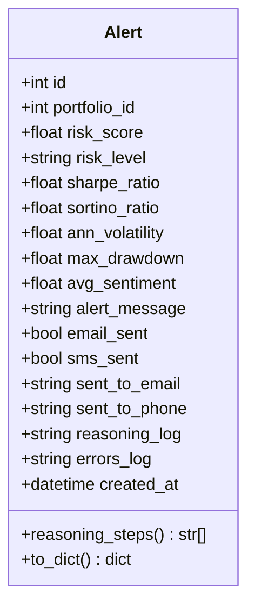
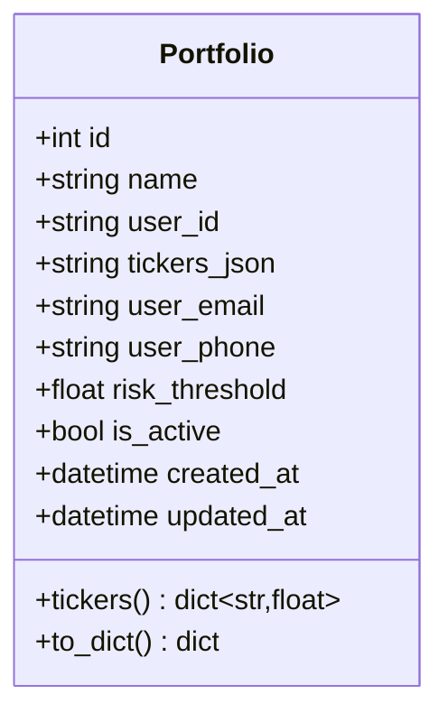
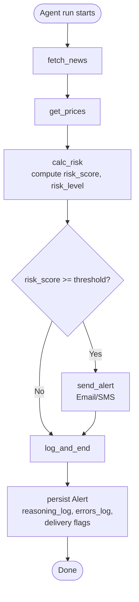
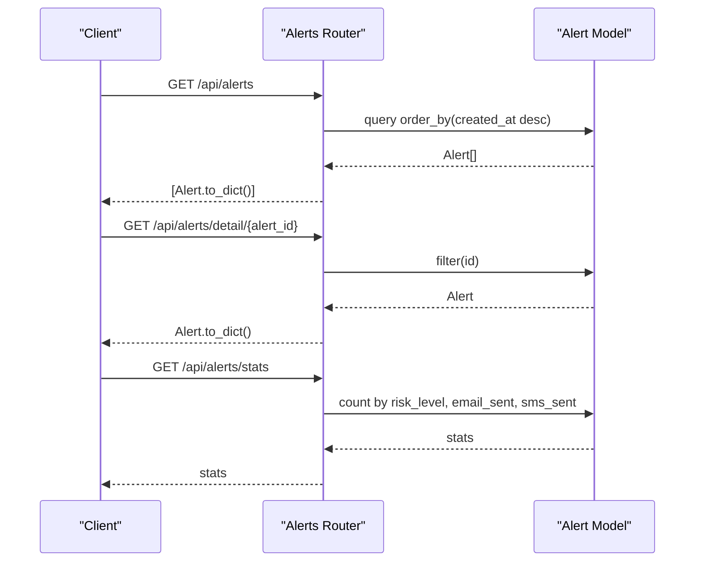
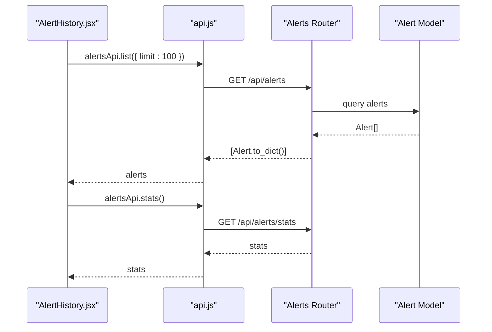
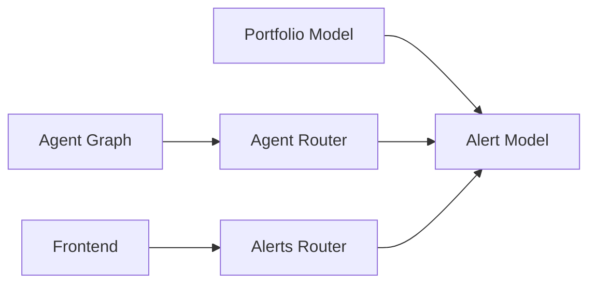

# Alert and Audit Trail Schema

<cite>
**Referenced Files in This Document**
- [backend/models/alert.py](file://backend/models/alert.py)
- [backend/models/portfolio.py](file://backend/models/portfolio.py)
- [backend/models/database.py](file://backend/models/database.py)
- [backend/routers/alerts.py](file://backend/routers/alerts.py)
- [backend/routers/agent.py](file://backend/routers/agent.py)
- [backend/agent/graph.py](file://backend/agent/graph.py)
- [backend/agent/state.py](file://backend/agent/state.py)
- [backend/agent/tools/send_alert.py](file://backend/agent/tools/send_alert.py)
- [backend/main.py](file://backend/main.py)
- [frontend/src/pages/AlertHistory.jsx](file://frontend/src/pages/AlertHistory.jsx)
- [frontend/src/components/AlertCard.jsx](file://frontend/src/components/AlertCard.jsx)
- [frontend/src/services/api.js](file://frontend/src/services/api.js)
</cite>

## Table of Contents
1. [Introduction](#introduction)
2. [Project Structure](#project-structure)
3. [Core Components](#core-components)
4. [Architecture Overview](#architecture-overview)
5. [Detailed Component Analysis](#detailed-component-analysis)
6. [Dependency Analysis](#dependency-analysis)
7. [Performance Considerations](#performance-considerations)
8. [Troubleshooting Guide](#troubleshooting-guide)
9. [Conclusion](#conclusion)
10. [Appendices](#appendices)

## Introduction
This document provides comprehensive data model documentation for the Alert entity and the audit trail functionality. It explains the Alert ORM model structure, including alert identification, portfolio association, risk score tracking, threshold comparison, and notification delivery status. It documents the reasoning log storage mechanism for capturing agent decision-making processes and audit trail requirements. It also covers alert lifecycle management from detection through resolution, including status tracking and historical preservation, and details the relationship between alerts and portfolios, foreign key constraints, and cascade behaviors. Field definitions for risk metrics, timestamps, user notifications, and system-generated logs are included, along with examples of alert creation, status updates, and historical querying patterns. Compliance, data retention, and privacy considerations for financial audit trails are addressed, as well as integration with the agent workflow and real-time alert delivery mechanisms.

## Project Structure
The alert and audit trail system spans backend models, routers, agent workflow, and frontend presentation. The backend uses SQLAlchemy ORM models for persistence, FastAPI routers for read-only alert history and agent orchestration, and LangGraph for the agent workflow. The frontend consumes alert history and displays reasoning logs.

**Diagram sources**
- [backend/models/alert.py:14-77](file://backend/models/alert.py#L14-L77)
- [backend/models/portfolio.py:16-63](file://backend/models/portfolio.py#L16-L63)
- [backend/routers/alerts.py:1-84](file://backend/routers/alerts.py#L1-L84)
- [backend/routers/agent.py:1-243](file://backend/routers/agent.py#L1-L243)
- [backend/agent/graph.py:1-243](file://backend/agent/graph.py#L1-L243)
- [backend/agent/tools/send_alert.py:1-231](file://backend/agent/tools/send_alert.py#L1-L231)
- [frontend/src/pages/AlertHistory.jsx:1-163](file://frontend/src/pages/AlertHistory.jsx#L1-L163)
- [frontend/src/components/AlertCard.jsx:1-89](file://frontend/src/components/AlertCard.jsx#L1-L89)
- [frontend/src/services/api.js:1-35](file://frontend/src/services/api.js#L1-L35)

**Section sources**
- [backend/main.py:12-59](file://backend/main.py#L12-L59)
- [backend/models/database.py:38-42](file://backend/models/database.py#L38-L42)

## Core Components
- Alert ORM model: Stores alert metadata, risk metrics, delivery status, and audit trail logs.
- Portfolio ORM model: Stores portfolio configuration and user contact preferences.
- Agent workflow: Executes risk analysis and conditionally triggers alert delivery.
- Alert history endpoints: Provide read-only access to alert records and statistics.
- Frontend alert history page: Displays alert cards, filters, and reasoning logs.

**Section sources**
- [backend/models/alert.py:14-77](file://backend/models/alert.py#L14-L77)
- [backend/models/portfolio.py:16-63](file://backend/models/portfolio.py#L16-L63)
- [backend/routers/alerts.py:1-84](file://backend/routers/alerts.py#L1-L84)
- [backend/routers/agent.py:1-243](file://backend/routers/agent.py#L1-L243)
- [frontend/src/pages/AlertHistory.jsx:1-163](file://frontend/src/pages/AlertHistory.jsx#L1-L163)

## Architecture Overview
The alert lifecycle begins when the agent runs against a portfolio. Risk metrics are computed, and if the risk score exceeds a threshold, the agent invokes the alert tool to dispatch notifications. The agent’s final state is persisted as an Alert record, including the reasoning log and errors. Clients can stream agent progress via SSE or fetch historical alerts via read-only endpoints.

**Diagram sources**
- [backend/routers/agent.py:39-168](file://backend/routers/agent.py#L39-L168)
- [backend/agent/graph.py:69-121](file://backend/agent/graph.py#L69-L121)
- [backend/agent/tools/send_alert.py:157-231](file://backend/agent/tools/send_alert.py#L157-L231)
- [backend/models/alert.py:14-77](file://backend/models/alert.py#L14-L77)
- [backend/routers/alerts.py:22-56](file://backend/routers/alerts.py#L22-L56)

## Detailed Component Analysis

### Alert ORM Model
The Alert model captures:
- Identification: id (primary key), portfolio_id (foreign key to portfolios)
- Risk snapshot: risk_score, risk_level, and multiple risk metrics (Sharpe, Sortino, annualized volatility, max drawdown, average sentiment)
- Delivery status: alert_message, email_sent, sms_sent, sent_to_email, sent_to_phone
- Audit trail: reasoning_log (JSON list of strings), errors_log (JSON list)
- Timestamp: created_at

It exposes helpers:
- reasoning_steps property to serialize/deserialize reasoning_log
- to_dict() for API serialization

**Diagram sources**
- [backend/models/alert.py:14-77](file://backend/models/alert.py#L14-L77)

**Section sources**
- [backend/models/alert.py:14-77](file://backend/models/alert.py#L14-L77)

### Portfolio ORM Model
The Portfolio model captures:
- Identification: id (primary key), user_id
- Configuration: name, tickers_json (weights), user_email, user_phone
- Threshold: risk_threshold (alert if risk_score > this)
- Lifecycle: created_at, updated_at
- Helpers: tickers property to serialize/deserialize tickers_json

**Diagram sources**
- [backend/models/portfolio.py:16-63](file://backend/models/portfolio.py#L16-L63)

**Section sources**
- [backend/models/portfolio.py:16-63](file://backend/models/portfolio.py#L16-L63)

### Agent Workflow and Alert Persistence
The agent workflow computes risk and conditionally sends alerts. After execution, the agent router persists the final state as an Alert record:
- Risk metrics mapped to Alert fields
- Delivery flags derived from portfolio contact info and risk level
- reasoning_steps serialized to reasoning_log
- errors serialized to errors_log

**Diagram sources**
- [backend/agent/graph.py:69-121](file://backend/agent/graph.py#L69-L121)
- [backend/agent/tools/send_alert.py:157-231](file://backend/agent/tools/send_alert.py#L157-L231)
- [backend/routers/agent.py:128-158](file://backend/routers/agent.py#L128-L158)

**Section sources**
- [backend/agent/graph.py:36-36](file://backend/agent/graph.py#L36-L36)
- [backend/agent/graph.py:146-155](file://backend/agent/graph.py#L146-L155)
- [backend/agent/tools/send_alert.py:157-231](file://backend/agent/tools/send_alert.py#L157-L231)
- [backend/routers/agent.py:128-158](file://backend/routers/agent.py#L128-L158)

### Alert History Endpoints
The alerts router provides:
- List all alerts (latest first), optionally filtered by portfolio_id
- Retrieve a single alert with full reasoning log
- Retrieve alerts for a specific portfolio
- Summary statistics across alerts (counts by risk level, delivery counts, average risk score, latest run)

**Diagram sources**
- [backend/routers/alerts.py:22-83](file://backend/routers/alerts.py#L22-L83)
- [backend/models/alert.py:57-76](file://backend/models/alert.py#L57-L76)

**Section sources**
- [backend/routers/alerts.py:22-83](file://backend/routers/alerts.py#L22-L83)

### Frontend Integration
The frontend displays alert history with filtering and expandable reasoning logs. It fetches alerts and stats via the API service and renders cards with delivery indicators.

**Diagram sources**
- [frontend/src/pages/AlertHistory.jsx:19-32](file://frontend/src/pages/AlertHistory.jsx#L19-L32)
- [frontend/src/services/api.js:26-32](file://frontend/src/services/api.js#L26-L32)
- [backend/routers/alerts.py:59-83](file://backend/routers/alerts.py#L59-L83)

**Section sources**
- [frontend/src/pages/AlertHistory.jsx:1-163](file://frontend/src/pages/AlertHistory.jsx#L1-L163)
- [frontend/src/components/AlertCard.jsx:1-89](file://frontend/src/components/AlertCard.jsx#L1-L89)
- [frontend/src/services/api.js:1-35](file://frontend/src/services/api.js#L1-L35)

## Dependency Analysis
- Alert depends on Portfolio via portfolio_id foreign key.
- Agent workflow depends on tools and state to compute risk and decide alerting.
- Agent router persists Alert records and streams progress via SSE.
- Alerts router depends on Alert model for read-only queries.
- Frontend depends on alerts router for data.

**Diagram sources**
- [backend/models/alert.py:18-18](file://backend/models/alert.py#L18-L18)
- [backend/routers/agent.py:128-158](file://backend/routers/agent.py#L128-L158)
- [backend/routers/alerts.py:16-17](file://backend/routers/alerts.py#L16-L17)

**Section sources**
- [backend/models/alert.py:18-18](file://backend/models/alert.py#L18-L18)
- [backend/routers/agent.py:128-158](file://backend/routers/agent.py#L128-L158)
- [backend/routers/alerts.py:16-17](file://backend/routers/alerts.py#L16-L17)

## Performance Considerations
- Indexing: Alert created_at and portfolio_id are indexed to support sorting and filtering.
- Asynchronous persistence: The agent router persists Alert in a thread executor to avoid blocking the SSE loop.
- JSON serialization: reasoning_log and errors_log are stored as JSON text to preserve structured audit trails.
- Read-only endpoints: Alerts router uses efficient queries with ordering and limits.

[No sources needed since this section provides general guidance]

## Troubleshooting Guide
Common issues and resolutions:
- Alert not persisted: Verify agent run completed and SSE or sync endpoint was invoked. Check for DB save exceptions in server logs.
- Missing reasoning log: Ensure reasoning_steps is populated in final state and persisted via Alert.reasoning_steps property.
- No alerts returned: Confirm portfolio_id exists and alerts were generated. Use /api/alerts/stats to confirm presence.
- Notification delivery failures: Review errors captured in errors_log and tool-specific error messages.

**Section sources**
- [backend/routers/agent.py:155-158](file://backend/routers/agent.py#L155-L158)
- [backend/agent/tools/send_alert.py:185-231](file://backend/agent/tools/send_alert.py#L185-L231)
- [backend/routers/alerts.py:59-83](file://backend/routers/alerts.py#L59-L83)

## Conclusion
The Alert and audit trail system integrates agent-driven risk analysis with persistent records and real-time streaming. The Alert model captures risk metrics, delivery status, and a complete reasoning log for compliance and transparency. The agent workflow ensures deterministic alerting based on thresholds, and the frontend provides intuitive access to historical alerts and reasoning traces.

[No sources needed since this section summarizes without analyzing specific files]

## Appendices

### Data Model Definitions
- Alert fields:
  - Identification: id, portfolio_id
  - Risk: risk_score, risk_level, sharpe_ratio, sortino_ratio, ann_volatility, max_drawdown, avg_sentiment
  - Delivery: alert_message, email_sent, sms_sent, sent_to_email, sent_to_phone
  - Audit: reasoning_log, errors_log
  - Timestamp: created_at
- Portfolio fields:
  - Identification: id, name, user_id
  - Config: tickers_json, user_email, user_phone
  - Threshold: risk_threshold
  - Status: is_active
  - Timestamps: created_at, updated_at

**Section sources**
- [backend/models/alert.py:17-42](file://backend/models/alert.py#L17-L42)
- [backend/models/portfolio.py:19-34](file://backend/models/portfolio.py#L19-L34)

### Alert Lifecycle Management
- Detection: Agent computes risk_score and risk_level.
- Threshold comparison: If risk_score >= threshold, send_alert is invoked.
- Persistence: Final state is persisted as Alert with reasoning_log and errors_log.
- Historical preservation: Alerts are queryable via read-only endpoints with filtering and statistics.

**Section sources**
- [backend/agent/graph.py:36-36](file://backend/agent/graph.py#L36-L36)
- [backend/agent/graph.py:146-155](file://backend/agent/graph.py#L146-L155)
- [backend/routers/agent.py:128-158](file://backend/routers/agent.py#L128-L158)
- [backend/routers/alerts.py:22-83](file://backend/routers/alerts.py#L22-L83)

### Audit Trail and Compliance
- Full reasoning log: Stored as JSON list in reasoning_log for complete audit trail.
- Errors capture: Tool errors are aggregated in errors_log for traceability.
- Timestamps: created_at enables chronological auditing.
- Exposure: Read-only endpoints provide auditors with historical views.

**Section sources**
- [backend/models/alert.py:36-40](file://backend/models/alert.py#L36-L40)
- [backend/agent/tools/send_alert.py:185-231](file://backend/agent/tools/send_alert.py#L185-L231)
- [backend/routers/alerts.py:59-83](file://backend/routers/alerts.py#L59-L83)

### Real-time Alert Delivery
- SSE streaming: /api/agent/stream/{portfolio_id} emits step deltas, risk metrics, alert decisions, and completion signals.
- Delivery channels: Email via SendGrid, SMS via Twilio, with channel selection based on risk_level.
- Mock mode: When credentials are missing, alerts are logged to console.

**Section sources**
- [backend/routers/agent.py:39-168](file://backend/routers/agent.py#L39-L168)
- [backend/agent/tools/send_alert.py:157-231](file://backend/agent/tools/send_alert.py#L157-L231)

### Examples
- Alert creation: Trigger agent run via /api/agent/run/{portfolio_id} or stream via /api/agent/stream/{portfolio_id}. On completion, an Alert record is persisted.
- Status updates: Monitor SSE events for risk and alert decisions; view final alert via /api/alerts/detail/{alert_id}.
- Historical querying: Use /api/alerts with optional portfolio_id and limit; retrieve stats via /api/alerts/stats.

**Section sources**
- [backend/routers/agent.py:186-232](file://backend/routers/agent.py#L186-L232)
- [backend/routers/agent.py:39-168](file://backend/routers/agent.py#L39-L168)
- [backend/routers/alerts.py:22-83](file://backend/routers/alerts.py#L22-L83)