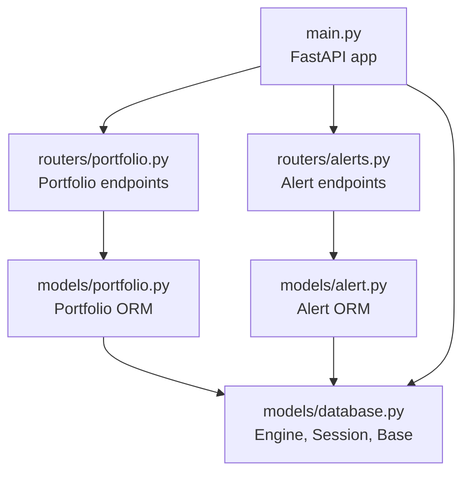
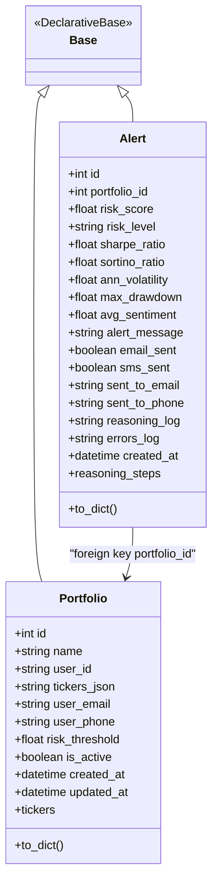
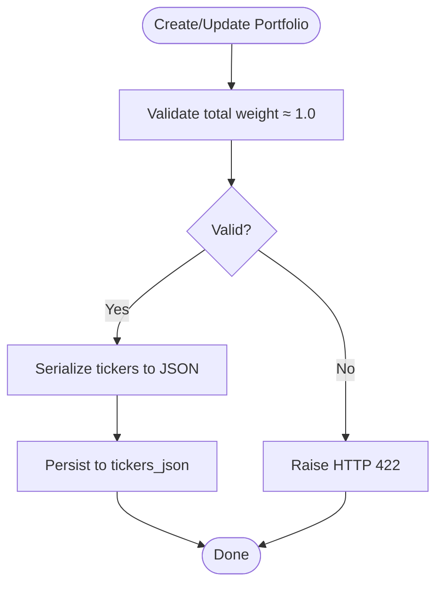
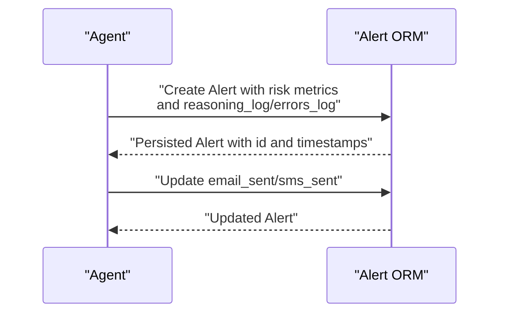
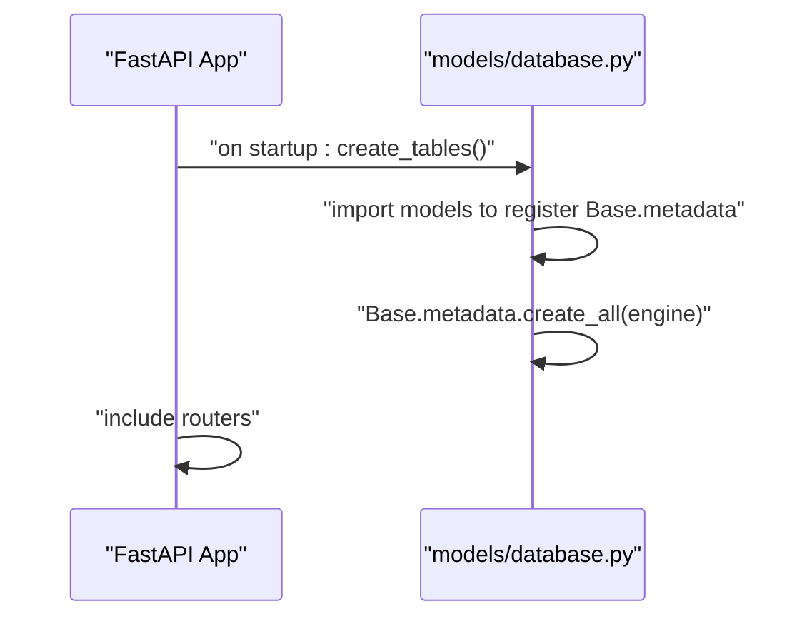
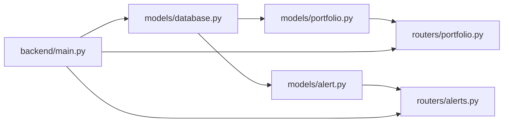
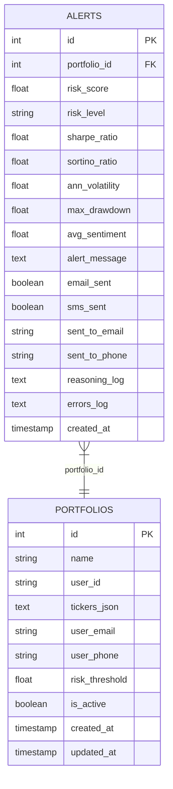

# Data Models and Database Schema

<cite>
**Referenced Files in This Document**
- [portfolio.py](file://backend/models/portfolio.py)
- [alert.py](file://backend/models/alert.py)
- [database.py](file://backend/models/database.py)
- [main.py](file://backend/main.py)
- [portfolio.py](file://backend/routers/portfolio.py)
- [alerts.py](file://backend/routers/alerts.py)
- [README.md](file://README.md)
</cite>

## Table of Contents
1. [Introduction](#introduction)
2. [Project Structure](#project-structure)
3. [Core Components](#core-components)
4. [Architecture Overview](#architecture-overview)
5. [Detailed Component Analysis](#detailed-component-analysis)
6. [Dependency Analysis](#dependency-analysis)
7. [Performance Considerations](#performance-considerations)
8. [Troubleshooting Guide](#troubleshooting-guide)
9. [Conclusion](#conclusion)
10. [Appendices](#appendices)

## Introduction
This document provides comprehensive data model documentation for the ishwarambare-app database schema and SQLAlchemy ORM models. It focuses on two primary entities:
- Portfolio: stores user-defined investment portfolios with ticker-weight mappings persisted as JSON, along with user contact and risk threshold metadata.
- Alert: persists risk assessment outcomes, delivery status for notifications, and a full reasoning log for auditability and UI.

It explains relationships, constraints, indexing strategies, validation rules, ORM configuration, session management, and operational patterns. It also outlines performance considerations, data lifecycle, and security practices for handling financial data.

## Project Structure
The backend is organized around FastAPI routes (routers), SQLAlchemy models, and a shared database module. The application initializes tables on startup and exposes read/write endpoints for portfolios and read-only endpoints for alerts.

**Diagram sources**
- [main.py:12-59](file://backend/main.py#L12-L59)
- [portfolio.py:1-124](file://backend/routers/portfolio.py#L1-L124)
- [alerts.py:1-84](file://backend/routers/alerts.py#L1-L84)
- [portfolio.py:16-63](file://backend/models/portfolio.py#L16-L63)
- [alert.py:14-77](file://backend/models/alert.py#L14-L77)
- [database.py:25-42](file://backend/models/database.py#L25-L42)

**Section sources**
- [main.py:12-59](file://backend/main.py#L12-L59)
- [README.md:111-124](file://README.md#L111-L124)

## Core Components
This section documents the two primary ORM models and their associated routers.

### Portfolio Model
- Purpose: Stores user portfolios with a human-friendly name, user identity markers, ticker-to-weight mapping, optional contact info, risk threshold, activity flag, and timestamps.
- Storage: Ticker weights are stored as JSON in a single column and exposed via a property for typed access.
- Validation: Router enforces that weights sum approximately to 1.0.

Key attributes and constraints:
- id: integer, primary key, indexed
- name: string, up to 120 chars, not null, default "My Portfolio"
- user_id: string, up to 80 chars, not null, default "admin", indexed
- tickers_json: text, not null, default "{}"
- user_email: string, up to 200 chars, nullable
- user_phone: string, up to 30 chars, nullable (E.164 format recommended)
- risk_threshold: float, not null, default 0.70
- is_active: boolean, not null, default true
- created_at: datetime UTC, default current UTC time
- updated_at: datetime UTC, default current UTC time, updated on write

Helper methods:
- tickers property: returns a dictionary parsed from JSON; returns empty dict on parse failure
- tickers setter: serializes a dict to JSON
- to_dict(): returns a normalized dictionary for serialization

**Section sources**
- [portfolio.py:16-63](file://backend/models/portfolio.py#L16-L63)
- [portfolio.py:38-48](file://backend/models/portfolio.py#L38-L48)
- [portfolio.py:50-62](file://backend/models/portfolio.py#L50-L62)

### Alert Model
- Purpose: Persists risk snapshots, delivery status for email/SMS, and a full reasoning log for auditability and UI.
- Relationship: Foreign key to Portfolio via portfolio_id.

Key attributes and constraints:
- id: integer, primary key, indexed
- portfolio_id: integer, foreign key to portfolios.id, indexed
- risk_score: float, not null
- risk_level: string, up to 10 chars, not null ("LOW" | "MEDIUM" | "HIGH")
- sharpe_ratio: float, nullable
- sortino_ratio: float, nullable
- ann_volatility: float, nullable
- max_drawdown: float, nullable
- avg_sentiment: float, nullable
- alert_message: text, nullable
- email_sent: boolean, default false
- sms_sent: boolean, default false
- sent_to_email: string, up to 200 chars, nullable
- sent_to_phone: string, up to 30 chars, nullable
- reasoning_log: text, JSON-encoded list of strings, nullable
- errors_log: text, JSON-encoded list, nullable
- created_at: datetime UTC, default current UTC time, indexed

Helper methods:
- reasoning_steps property: returns list of strings parsed from JSON; returns empty list on parse failure
- reasoning_steps setter: serializes list of strings to JSON
- to_dict(): returns a normalized dictionary for serialization

**Section sources**
- [alert.py:14-77](file://backend/models/alert.py#L14-L77)
- [alert.py:46-55](file://backend/models/alert.py#L46-L55)
- [alert.py:57-76](file://backend/models/alert.py#L57-L76)

### Router Integrations
- Portfolio router:
  - Validates that weights sum approximately to 1.0 before persisting
  - Supports listing, creation, retrieval, updates, and deletion
- Alerts router:
  - Provides read-only endpoints for listing alerts, fetching details with reasoning logs, filtering by portfolio, and summary statistics

**Section sources**
- [portfolio.py:27-46](file://backend/routers/portfolio.py#L27-L46)
- [portfolio.py:56-77](file://backend/routers/portfolio.py#L56-L77)
- [portfolio.py:88-113](file://backend/routers/portfolio.py#L88-L113)
- [alerts.py:22-56](file://backend/routers/alerts.py#L22-L56)
- [alerts.py:59-83](file://backend/routers/alerts.py#L59-L83)

## Architecture Overview
The data layer uses SQLAlchemy declarative base with a synchronous engine. Sessions are dependency-injected via a generator that yields a scoped session per request and closes it afterward. Tables are created on application startup.

**Diagram sources**
- [database.py:25-26](file://backend/models/database.py#L25-L26)
- [portfolio.py:16-63](file://backend/models/portfolio.py#L16-L63)
- [alert.py:14-77](file://backend/models/alert.py#L14-L77)

## Detailed Component Analysis

### Portfolio Entity
- JSON-based ticker storage:
  - The tickers property converts JSON to a dict and the setter writes JSON back to the database column.
  - Business logic ensures weights approximately sum to 1.0 at creation/update.
- User association:
  - user_id is stored as a string identifier; user_email and user_phone capture contact details.
- Timestamps:
  - created_at and updated_at track lifecycle with UTC timezone.
- Indexing:
  - id and user_id are indexed; created_at is indexed on Alert but not on Portfolio.

**Diagram sources**
- [portfolio.py:58-65](file://backend/routers/portfolio.py#L58-L65)
- [portfolio.py:47-48](file://backend/models/portfolio.py#L47-L48)

**Section sources**
- [portfolio.py:16-63](file://backend/models/portfolio.py#L16-L63)
- [portfolio.py:27-46](file://backend/routers/portfolio.py#L27-L46)
- [portfolio.py:56-77](file://backend/routers/portfolio.py#L56-L77)
- [portfolio.py:88-113](file://backend/routers/portfolio.py#L88-L113)

### Alert Entity
- Audit trail:
  - reasoning_log captures the agent’s reasoning steps as a JSON-encoded list of strings.
  - errors_log captures encountered errors as a JSON-encoded list.
- Delivery status:
  - email_sent and sms_sent flags indicate whether notifications were dispatched.
  - sent_to_email and sent_to_phone record destination identifiers.
- Risk metrics:
  - risk_score and risk_level summarize risk; other metrics (Sharpe, Sortino, volatility, drawdown, sentiment) are optional.
- Indexing:
  - portfolio_id and created_at are indexed to support filtering and sorting.

**Diagram sources**
- [alert.py:14-77](file://backend/models/alert.py#L14-L77)
- [alerts.py:22-56](file://backend/routers/alerts.py#L22-L56)

**Section sources**
- [alert.py:14-77](file://backend/models/alert.py#L14-L77)
- [alerts.py:22-83](file://backend/routers/alerts.py#L22-L83)

### Database Initialization and Session Management
- Engine and Base:
  - Engine configured from DATABASE_URL with SQLite-specific connection args when applicable.
  - Declarative Base subclass used by models.
- Session factory:
  - SessionLocal bound to the engine; dependency injection via get_db yields a session per request and closes it afterward.
- Startup:
  - create_tables() reflects model metadata into the database on application startup.

**Diagram sources**
- [main.py:33-35](file://backend/main.py#L33-L35)
- [database.py:38-41](file://backend/models/database.py#L38-L41)

**Section sources**
- [database.py:15-41](file://backend/models/database.py#L15-L41)
- [main.py:32-35](file://backend/main.py#L32-L35)

## Dependency Analysis
- Models depend on a shared Base from models.database.
- Routers depend on models and inject sessions via get_db.
- Application startup triggers table creation.

**Diagram sources**
- [database.py:25-26](file://backend/models/database.py#L25-L26)
- [portfolio.py:16-63](file://backend/models/portfolio.py#L16-L63)
- [alert.py:14-77](file://backend/models/alert.py#L14-L77)
- [portfolio.py:19-20](file://backend/routers/portfolio.py#L19-L20)
- [alerts.py:16-17](file://backend/routers/alerts.py#L16-L17)
- [main.py:32-35](file://backend/main.py#L32-L35)

**Section sources**
- [database.py:25-41](file://backend/models/database.py#L25-L41)
- [portfolio.py:19-20](file://backend/routers/portfolio.py#L19-L20)
- [alerts.py:16-17](file://backend/routers/alerts.py#L16-L17)
- [main.py:32-35](file://backend/main.py#L32-L35)

## Performance Considerations
- Indexes:
  - Portfolio: id (primary key), user_id (indexed), created_at (not indexed on Portfolio).
  - Alert: id (primary key), portfolio_id (indexed), created_at (indexed).
- Query patterns:
  - Portfolio listing orders by created_at desc; Alert listing supports filtering by portfolio_id and ordering by created_at desc.
  - Stats endpoint aggregates counts and average risk score.
- Recommendations:
  - Consider adding composite indexes if querying by user_id and created_at is frequent.
  - For high-volume alert generation, consider partitioning or retention policies to cap historical rows.
  - Use pagination and limits on alert listings to avoid large result sets.

**Section sources**
- [portfolio.py:50-53](file://backend/routers/portfolio.py#L50-L53)
- [alerts.py:22-32](file://backend/routers/alerts.py#L22-L32)
- [alerts.py:43-56](file://backend/routers/alerts.py#L43-L56)
- [alerts.py:59-83](file://backend/routers/alerts.py#L59-L83)

## Troubleshooting Guide
- JSON parsing failures:
  - If tickers_json or reasoning_log is malformed, properties return safe defaults (empty dict or empty list). Verify data integrity and ensure proper serialization.
- Weight validation:
  - Creation/updates reject portfolios whose weights do not approximately sum to 1.0. Adjust weights accordingly.
- Not found errors:
  - Queries for missing portfolios or alerts return HTTP 404; confirm IDs and existence.
- Session lifecycle:
  - Sessions are closed automatically after requests; ensure no long-lived transactions and handle exceptions to prevent leaks.

**Section sources**
- [portfolio.py:41-44](file://backend/models/portfolio.py#L41-L44)
- [alert.py:48-51](file://backend/models/alert.py#L48-L51)
- [portfolio.py:58-65](file://backend/routers/portfolio.py#L58-L65)
- [portfolio.py:82-85](file://backend/routers/portfolio.py#L82-L85)
- [alerts.py:37-40](file://backend/routers/alerts.py#L37-L40)
- [database.py:29-35](file://backend/models/database.py#L29-L35)

## Conclusion
The ishwarambare-app data model centers on two closely related entities:
- Portfolio: flexible JSON-based ticker storage with strong validation and user metadata.
- Alert: comprehensive audit trail with reasoning logs and delivery status.

The SQLAlchemy setup is minimal and effective, with explicit indexes on foreign keys and timestamps. Operational patterns emphasize correctness (weight validation), auditability (reasoning logs), and performance (indexing and limits). The design supports future enhancements such as composite indexes, retention policies, and richer analytics.

## Appendices

### Database Schema Diagram

**Diagram sources**
- [portfolio.py:19-34](file://backend/models/portfolio.py#L19-L34)
- [alert.py:17-42](file://backend/models/alert.py#L17-L42)

### Sample Data Examples
- Portfolio example:
  - name: "Tech Growth"
  - user_id: "user_abc"
  - tickers: {"AAPL": 0.5, "MSFT": 0.3, "NVDA": 0.2}
  - user_email: "user@example.com"
  - user_phone: "+1234567890"
  - risk_threshold: 0.75
  - is_active: true
- Alert example:
  - portfolio_id: 1
  - risk_score: 0.82
  - risk_level: "HIGH"
  - sharpe_ratio: 1.2
  - sortino_ratio: 1.5
  - ann_volatility: 0.18
  - max_drawdown: 0.25
  - avg_sentiment: 0.1
  - alert_message: "Risk level increased above threshold"
  - email_sent: true
  - sms_sent: false
  - sent_to_email: "user@example.com"
  - sent_to_phone: null
  - reasoning_log: ["Loaded prices", "Computed volatilities", "Threshold exceeded"]
  - errors_log: []
  - created_at: "2025-01-01T12:00:00Z"

### Common Query Patterns
- List portfolios ordered by newest first.
- Create portfolio with validated weights.
- Retrieve a single portfolio by ID.
- Update portfolio fields including tickers.
- List alerts globally, filtered by portfolio, or by ID with full reasoning logs.
- Compute summary statistics across alerts.

**Section sources**
- [portfolio.py:50-53](file://backend/routers/portfolio.py#L50-L53)
- [portfolio.py:56-77](file://backend/routers/portfolio.py#L56-L77)
- [portfolio.py:80-85](file://backend/routers/portfolio.py#L80-L85)
- [portfolio.py:88-113](file://backend/routers/portfolio.py#L88-L113)
- [alerts.py:22-56](file://backend/routers/alerts.py#L22-L56)
- [alerts.py:59-83](file://backend/routers/alerts.py#L59-L83)

### Data Lifecycle, Backup, and Migration
- Lifecycle:
  - Portfolios are created/updated/deleted by users; alerts are generated by the agent and persisted for audit.
- Backup:
  - For SQLite, back up the database file; for PostgreSQL, use native database backup tools.
- Migration:
  - The current setup uses declarative Base and create_all on startup. For production, adopt a dedicated migration tool (e.g., Alembic) to manage schema changes safely.

**Section sources**
- [database.py:38-41](file://backend/models/database.py#L38-L41)
- [README.md:78-93](file://README.md#L78-L93)

### Security and Privacy Considerations
- Financial data sensitivity:
  - Protect user_email and user_phone; enforce transport encryption (HTTPS/TLS) and restrict access via authentication/authorization.
- Environment configuration:
  - Store DATABASE_URL and secrets in environment variables; avoid committing secrets to version control.
- Access control:
  - Enforce user scoping so users can only access their own portfolios and alerts; validate user_id against authenticated identity.
- Logging and audit:
  - Keep reasoning logs for transparency; sanitize logs to avoid exposing sensitive data.

**Section sources**
- [portfolio.py:20](file://backend/models/portfolio.py#L20)
- [portfolio.py:26-27](file://backend/models/portfolio.py#L26-L27)
- [alert.py:33-34](file://backend/models/alert.py#L33-L34)
- [README.md:88-92](file://README.md#L88-L92)