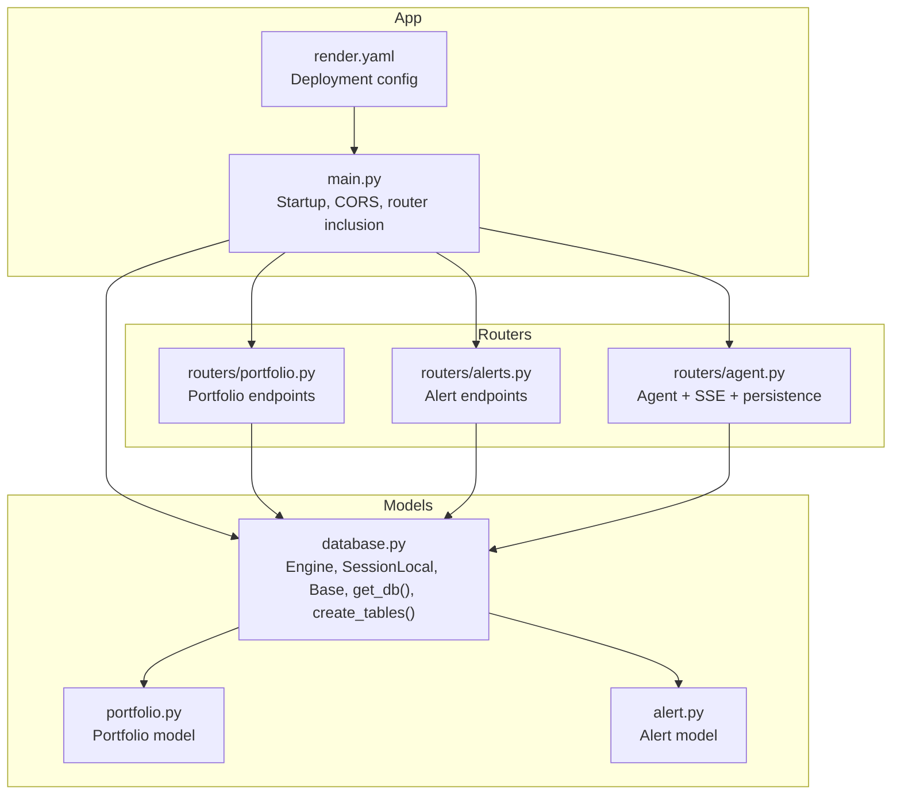
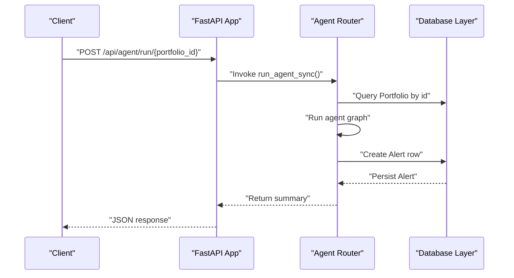
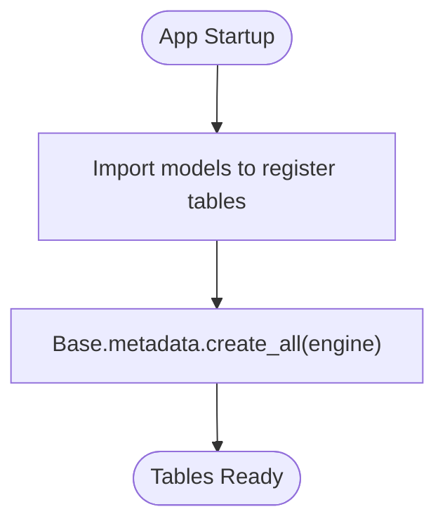
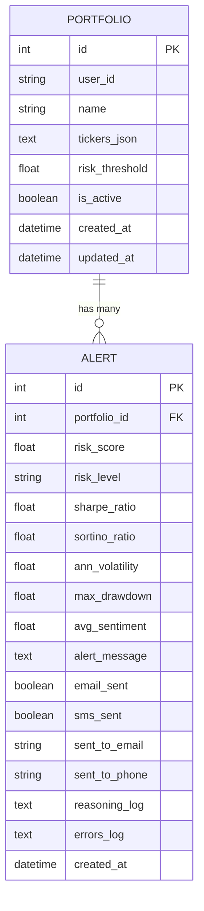
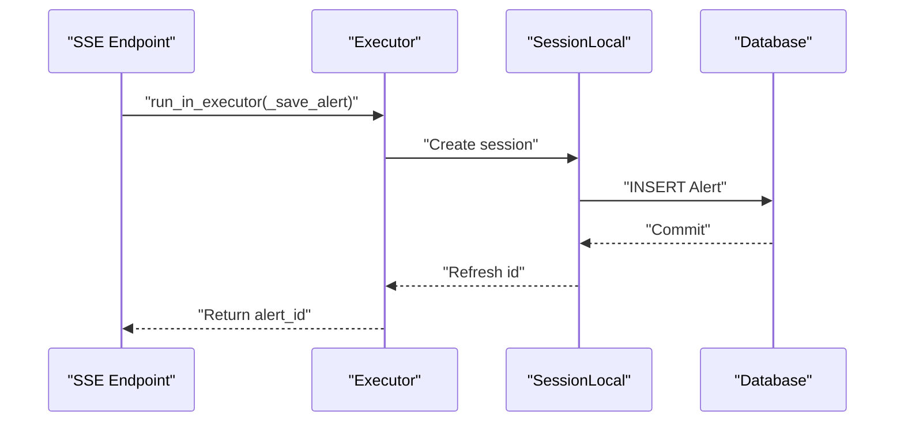
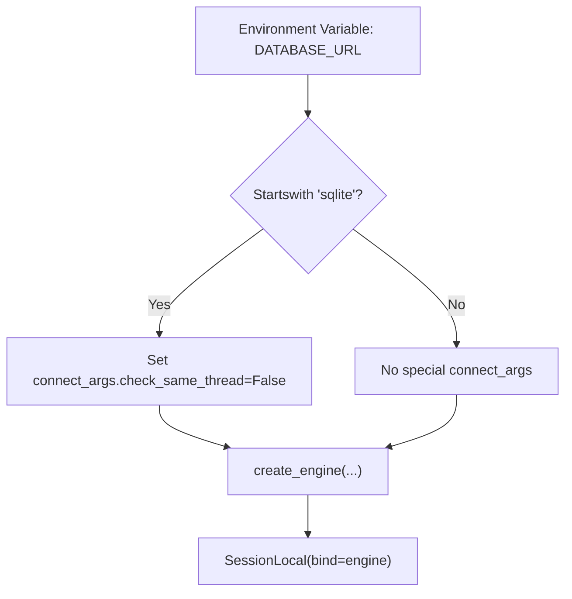
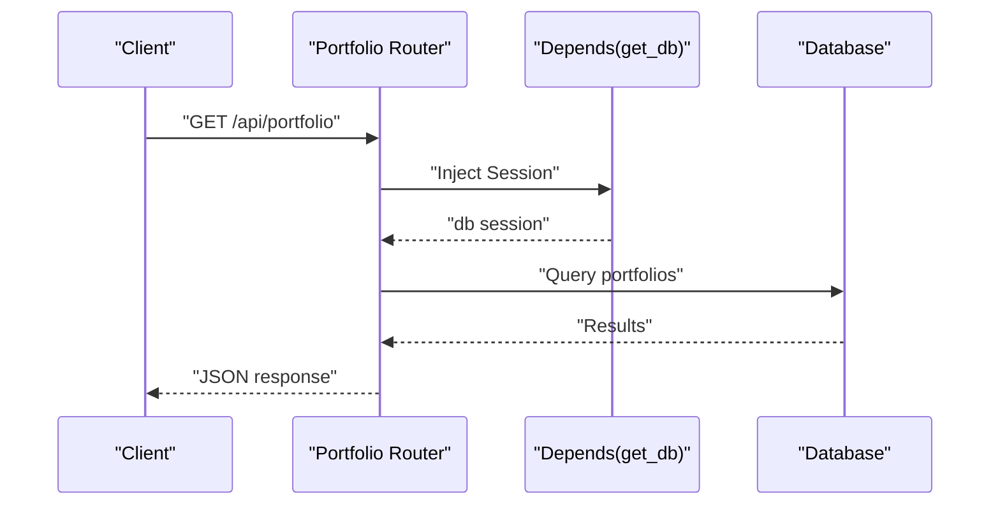
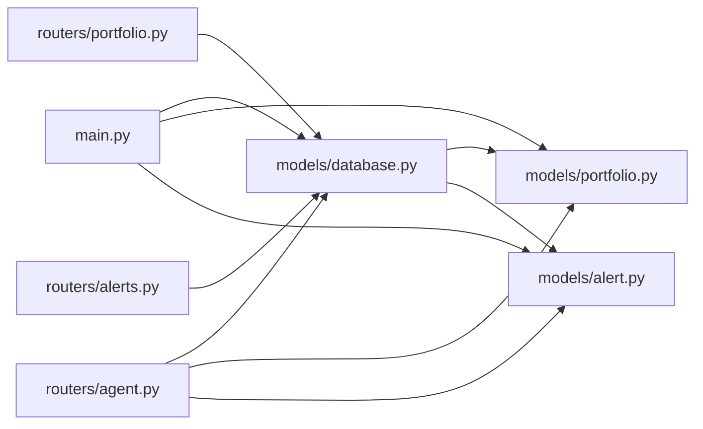

# Database Configuration and Relationships

<cite>
**Referenced Files in This Document**
- [database.py](file://backend/models/database.py)
- [portfolio.py](file://backend/models/portfolio.py)
- [alert.py](file://backend/models/alert.py)
- [main.py](file://backend/main.py)
- [portfolio router](file://backend/routers/portfolio.py)
- [alerts router](file://backend/routers/alerts.py)
- [agent router](file://backend/routers/agent.py)
- [render.yaml](file://render.yaml)
- [README.md](file://README.md)
</cite>

## Table of Contents
1. [Introduction](#introduction)
2. [Project Structure](#project-structure)
3. [Core Components](#core-components)
4. [Architecture Overview](#architecture-overview)
5. [Detailed Component Analysis](#detailed-component-analysis)
6. [Dependency Analysis](#dependency-analysis)
7. [Performance Considerations](#performance-considerations)
8. [Troubleshooting Guide](#troubleshooting-guide)
9. [Conclusion](#conclusion)
10. [Appendices](#appendices)

## Introduction
This document explains the database configuration layer and relationship management for the financial portfolio agent application. It covers SQLAlchemy engine setup, session management patterns, connection pooling configuration, declarative base configuration, database initialization, and environment-specific settings for development and production. It also documents the relationship between Portfolio and Alert entities, foreign key constraints, referential integrity, indexing strategies, connection string configuration, SSL/TLS considerations, and integration with FastAPI’s dependency injection system for database sessions. Finally, it outlines transaction handling patterns, scaling considerations, backup and disaster recovery procedures, and operational guidance.

## Project Structure
The database layer is organized under backend/models with supporting routers and application bootstrap logic. The key files are:
- Engine and session factory: backend/models/database.py
- ORM models: backend/models/portfolio.py, backend/models/alert.py
- Application bootstrap and table creation: backend/main.py
- FastAPI routers using database sessions: backend/routers/portfolio.py, backend/routers/alerts.py, backend/routers/agent.py
- Deployment configuration: render.yaml

**Diagram sources**
- [database.py:15-41](file://backend/models/database.py#L15-L41)
- [portfolio.py:16-63](file://backend/models/portfolio.py#L16-L63)
- [alert.py:14-77](file://backend/models/alert.py#L14-L77)
- [main.py:32-43](file://backend/main.py#L32-L43)
- [portfolio router:50-123](file://backend/routers/portfolio.py#L50-L123)
- [alerts router:22-83](file://backend/routers/alerts.py#L22-L83)
- [agent router:39-242](file://backend/routers/agent.py#L39-L242)
- [render.yaml:4-22](file://render.yaml#L4-L22)

**Section sources**
- [database.py:1-42](file://backend/models/database.py#L1-L42)
- [portfolio.py:1-63](file://backend/models/portfolio.py#L1-L63)
- [alert.py:1-77](file://backend/models/alert.py#L1-L77)
- [main.py:1-59](file://backend/main.py#L1-L59)
- [portfolio router:1-124](file://backend/routers/portfolio.py#L1-L124)
- [alerts router:1-84](file://backend/routers/alerts.py#L1-L84)
- [agent router:1-243](file://backend/routers/agent.py#L1-L243)
- [render.yaml:1-48](file://render.yaml#L1-L48)

## Core Components
- SQLAlchemy engine and session factory:
  - Engine configured from DATABASE_URL with optional SQLite-specific connect_args.
  - SessionLocal bound to the engine for per-request sessions.
  - get_db() FastAPI dependency that yields a session and ensures closure.
- Declarative base:
  - Base extends DeclarativeBase and is used by all models.
- Database initialization:
  - create_tables() creates all tables on application startup by importing models and invoking Base.metadata.create_all().
- Environment configuration:
  - DATABASE_URL defaults to SQLite for zero-config local development; production uses PostgreSQL via environment variable.
  - ALLOWED_ORIGINS and SECRET_KEY configured for deployment.

**Section sources**
- [database.py:15-41](file://backend/models/database.py#L15-L41)
- [main.py:32-35](file://backend/main.py#L32-L35)
- [render.yaml:15-21](file://render.yaml#L15-L21)

## Architecture Overview
The application initializes the database on startup, exposes REST endpoints that depend on database sessions, and writes alert records after agent runs. The agent router persists results using a dedicated session created inside an executor to avoid blocking the async event loop.

**Diagram sources**
- [agent router:186-232](file://backend/routers/agent.py#L186-L232)
- [database.py:29-35](file://backend/models/database.py#L29-L35)

**Section sources**
- [agent router:186-232](file://backend/routers/agent.py#L186-L232)
- [database.py:29-35](file://backend/models/database.py#L29-L35)

## Detailed Component Analysis

### Database Engine and Session Management
- Engine setup:
  - Reads DATABASE_URL from environment with a SQLite default.
  - Applies SQLite-specific connect_args for multi-threaded operation.
  - Disables echo for production-grade logs.
- Session factory:
  - SessionLocal configured with autocommit=False and autoflush=False.
  - Bound to the engine for scoped sessions.
- Dependency injection:
  - get_db() creates a session, yields it to the route handler, and closes it in a finally block.
- Initialization:
  - create_tables() imports models and creates all tables on startup.

**Diagram sources**
- [database.py:38-41](file://backend/models/database.py#L38-L41)
- [main.py:32-35](file://backend/main.py#L32-L35)

**Section sources**
- [database.py:15-41](file://backend/models/database.py#L15-L41)
- [main.py:32-35](file://backend/main.py#L32-L35)

### Relationship Between Portfolio and Alert Entities
- Foreign key constraint:
  - Alert.portfolio_id references Portfolio.id with a foreign key relationship.
- Referential integrity:
  - The foreign key enforces referential integrity at the database level.
- Relationship semantics:
  - One Portfolio can have many Alerts; each Alert belongs to exactly one Portfolio.
- Indexing:
  - Alert.portfolio_id is indexed to optimize filtering by portfolio.
  - Additional indexes exist on Alert.created_at and Portfolio.user_id to accelerate common queries.

**Diagram sources**
- [portfolio.py:16-34](file://backend/models/portfolio.py#L16-L34)
- [alert.py:14-42](file://backend/models/alert.py#L14-L42)

**Section sources**
- [portfolio.py:16-34](file://backend/models/portfolio.py#L16-L34)
- [alert.py:14-42](file://backend/models/alert.py#L14-L42)

### Indexing Strategies for Performance
- Portfolio.user_id is indexed to speed up user-scoped queries.
- Alert.portfolio_id is indexed to accelerate filtering by portfolio.
- Alert.created_at is indexed to support time-series queries and ordering.
- Composite indexes are not present; consider adding composite indexes if queries frequently filter by user_id and created_at or similar combinations.

**Section sources**
- [portfolio.py](file://backend/models/portfolio.py#L21)
- [alert.py](file://backend/models/alert.py#L18)
- [alert.py](file://backend/models/alert.py#L42)

### Transaction Handling Patterns
- Route handlers use explicit transactions:
  - db.add(entity), db.commit(), db.refresh(entity) for create/update operations.
  - db.delete(entity), db.commit() for deletions.
- Async executor pattern:
  - _save_alert() creates a new SessionLocal within an executor to persist results without blocking the async event loop.
- Session lifecycle:
  - get_db() ensures sessions are closed after each request.
  - _save_alert() ensures sessions are closed after persistence.

**Diagram sources**
- [agent router:149-151](file://backend/routers/agent.py#L149-L151)
- [agent router:171-181](file://backend/routers/agent.py#L171-L181)
- [database.py](file://backend/models/database.py#L22)

**Section sources**
- [portfolio router:74-76](file://backend/routers/portfolio.py#L74-L76)
- [portfolio router:111-112](file://backend/routers/portfolio.py#L111-L112)
- [alerts router:61-72](file://backend/routers/alerts.py#L61-L72)
- [agent router:171-181](file://backend/routers/agent.py#L171-L181)

### Environment-Specific Settings and Connection Strings
- Development:
  - DATABASE_URL defaults to SQLite (zero configuration).
  - FastAPI dev server started with hot reload.
- Production:
  - DATABASE_URL set to PostgreSQL via environment variable.
  - Render deployment blueprint defines start command, health check, and environment variables.
- Allowed origins and secrets:
  - ALLOWED_ORIGINS configured for frontend domains.
  - SECRET_KEY generated automatically by Render.

**Diagram sources**
- [database.py:15-20](file://backend/models/database.py#L15-L20)
- [database.py:17-18](file://backend/models/database.py#L17-L18)
- [database.py](file://backend/models/database.py#L20)
- [database.py](file://backend/models/database.py#L22)

**Section sources**
- [database.py:7-8](file://backend/models/database.py#L7-L8)
- [database.py:15-20](file://backend/models/database.py#L15-L20)
- [README.md:49-53](file://README.md#L49-L53)
- [render.yaml:15-21](file://render.yaml#L15-L21)

### Security Considerations and SSL/TLS
- Connection string security:
  - Store DATABASE_URL in environment variables; do not hardcode credentials.
  - Use strong credentials and rotate SECRET_KEY periodically.
- Transport security:
  - For PostgreSQL, use SSL/TLS connections by configuring the connection string scheme and parameters as supported by the SQLAlchemy URL format.
  - Ensure certificates are validated appropriately in production environments.
- Access control:
  - Restrict database network access to application servers only.
  - Use firewall rules and private networks for internal deployments.

[No sources needed since this section provides general guidance]

### Migration Strategies
- Current state:
  - create_tables() is invoked on startup to create tables.
- Recommended migration approach:
  - Adopt Alembic for structured migrations with version control.
  - Keep DATABASE_URL environment-driven; switch to PostgreSQL in production.
  - Automate migrations in CI/CD pipelines and apply them before deploying new application versions.

[No sources needed since this section provides general guidance]

### FastAPI Dependency Injection Integration
- get_db() dependency:
  - Provides a database session to route handlers via Depends(get_db).
  - Ensures proper cleanup after each request.
- Router usage:
  - Portfolio, Alerts, and Agent routers depend on get_db() to perform database operations.
- Executor-based writes:
  - Agent router uses run_in_executor to persist Alert records without blocking the async event loop.

**Diagram sources**
- [portfolio router:50-53](file://backend/routers/portfolio.py#L50-L53)
- [database.py:29-35](file://backend/models/database.py#L29-L35)

**Section sources**
- [database.py:29-35](file://backend/models/database.py#L29-L35)
- [portfolio router:50-53](file://backend/routers/portfolio.py#L50-L53)
- [alerts router:22-32](file://backend/routers/alerts.py#L22-L32)
- [agent router](file://backend/routers/agent.py#L43)

## Dependency Analysis
- Model dependencies:
  - Both Portfolio and Alert inherit from Base.
  - Alert depends on Portfolio via foreign key.
- Router dependencies:
  - All routers import get_db() from models.database.
  - Agent router additionally imports Portfolio and Alert models.
- Application bootstrap:
  - main.py imports create_tables() and invokes it on startup.

**Diagram sources**
- [database.py:25-26](file://backend/models/database.py#L25-L26)
- [portfolio.py](file://backend/models/portfolio.py#L13)
- [alert.py](file://backend/models/alert.py#L11)
- [main.py](file://backend/main.py#L8)
- [portfolio router:19-20](file://backend/routers/portfolio.py#L19-L20)
- [alerts router:16-17](file://backend/routers/alerts.py#L16-L17)
- [agent router:21-23](file://backend/routers/agent.py#L21-L23)

**Section sources**
- [database.py:25-26](file://backend/models/database.py#L25-L26)
- [portfolio.py](file://backend/models/portfolio.py#L13)
- [alert.py](file://backend/models/alert.py#L11)
- [main.py](file://backend/main.py#L8)
- [portfolio router:19-20](file://backend/routers/portfolio.py#L19-L20)
- [alerts router:16-17](file://backend/routers/alerts.py#L16-L17)
- [agent router:21-23](file://backend/routers/agent.py#L21-L23)

## Performance Considerations
- Indexing:
  - Ensure Alert.portfolio_id and Alert.created_at are indexed for efficient filtering and sorting.
  - Consider adding an index on Portfolio.user_id for user-scoped queries.
- Query patterns:
  - Use filtered queries with ORDER BY and LIMIT to avoid scanning entire tables.
  - Prefer primary key lookups for single-record retrieval.
- Connection pooling:
  - For production PostgreSQL, configure pool_size and max_overflow in the engine URL or via engine options to manage concurrency.
- Asynchronous writes:
  - Persist Alert records in an executor to keep SSE streaming responsive.

[No sources needed since this section provides general guidance]

## Troubleshooting Guide
- SQLite threading errors:
  - Ensure DATABASE_URL starts with sqlite and connect_args includes check_same_thread=False for multi-threaded environments.
- Session leaks:
  - Verify that get_db() is used with Depends() so sessions are closed in the finally block.
- Missing tables:
  - Confirm create_tables() is called on startup and models are imported before metadata.create_all().
- Foreign key violations:
  - Ensure Portfolio exists before creating Alert rows referencing it.
- Slow queries:
  - Add missing indexes on frequently filtered columns (user_id, portfolio_id, created_at).

**Section sources**
- [database.py:17-18](file://backend/models/database.py#L17-L18)
- [database.py:29-35](file://backend/models/database.py#L29-L35)
- [main.py:32-35](file://backend/main.py#L32-L35)
- [agent router:57-60](file://backend/routers/agent.py#L57-L60)

## Conclusion
The database layer uses a clean, minimal SQLAlchemy configuration with a declarative base, explicit session management via FastAPI dependencies, and straightforward initialization on startup. The relationship between Portfolio and Alert is enforced by a foreign key with appropriate indexing for performance. The design supports both development (SQLite) and production (PostgreSQL) deployments through environment variables. To evolve toward production-grade operations, adopt Alembic migrations, tune connection pooling, and implement robust backup and disaster recovery procedures.

[No sources needed since this section summarizes without analyzing specific files]

## Appendices

### Appendix A: Example Workflows

- Database initialization on startup:
  - On app startup, create_tables() is invoked to ensure all tables exist.
  - Models are imported to register them with the declarative base.

- Session lifecycle in a route:
  - get_db() creates a session, yields it to the handler, and closes it afterward.

- Transaction handling for writes:
  - Add entity, commit, refresh for inserts; delete, commit for removals.

- Asynchronous persistence:
  - Use run_in_executor to persist Alert records outside the async event loop.

**Section sources**
- [main.py:32-35](file://backend/main.py#L32-L35)
- [database.py:29-35](file://backend/models/database.py#L29-L35)
- [portfolio router:74-76](file://backend/routers/portfolio.py#L74-L76)
- [agent router:149-151](file://backend/routers/agent.py#L149-L151)

### Appendix B: Deployment Notes
- Render configuration sets environment variables and health checks suitable for production.
- Ensure DATABASE_URL points to a managed PostgreSQL instance in production.

**Section sources**
- [render.yaml:15-21](file://render.yaml#L15-L21)