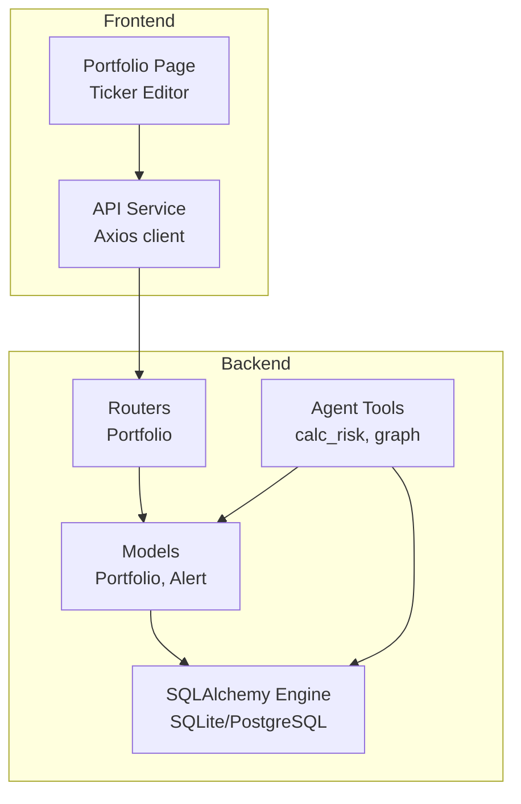
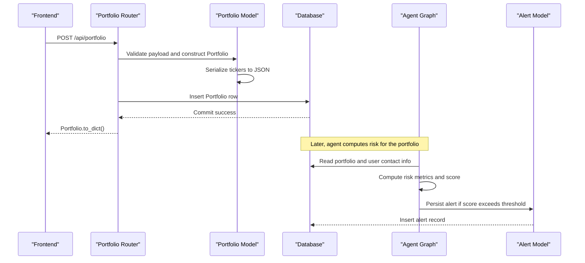
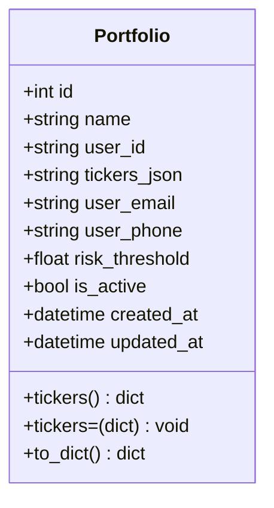
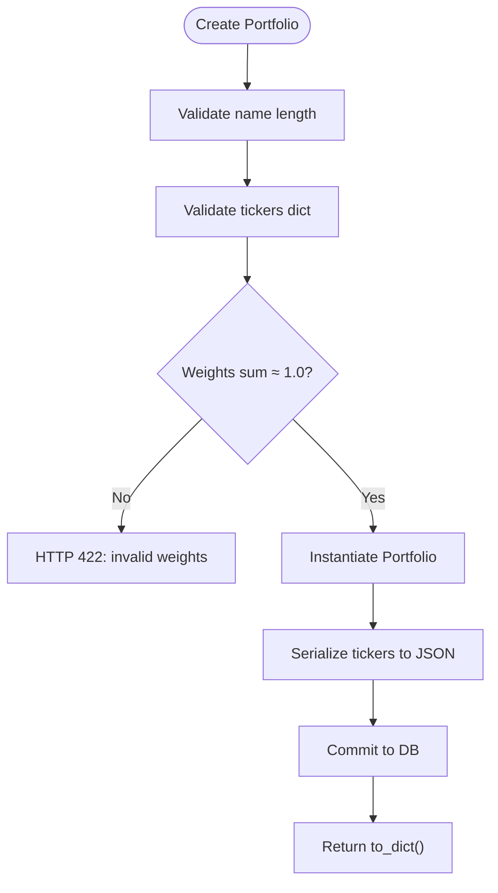
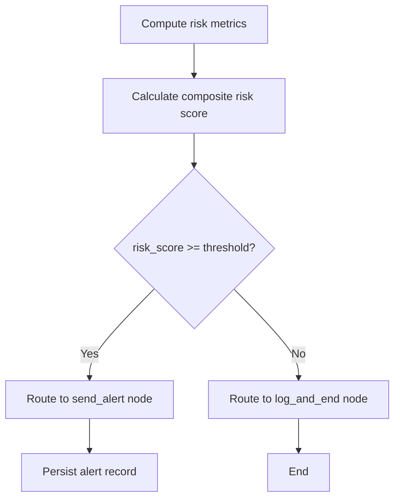
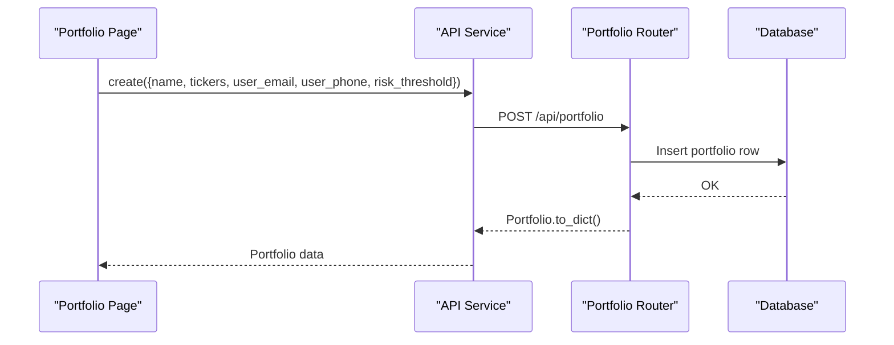
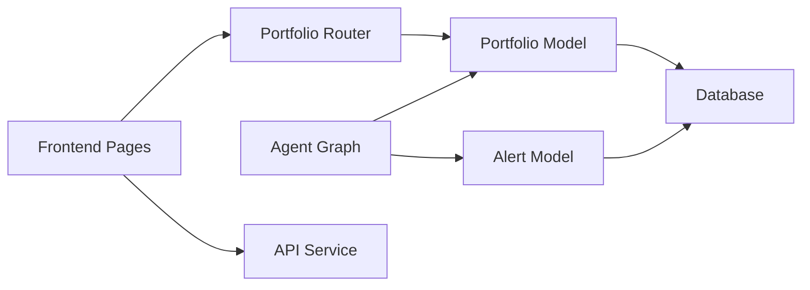

# Portfolio Management Schema

<cite>
**Referenced Files in This Document**
- [backend/models/portfolio.py](file://backend/models/portfolio.py)
- [backend/routers/portfolio.py](file://backend/routers/portfolio.py)
- [backend/models/database.py](file://backend/models/database.py)
- [backend/main.py](file://backend/main.py)
- [backend/models/alert.py](file://backend/models/alert.py)
- [backend/agent/tools/calc_risk.py](file://backend/agent/tools/calc_risk.py)
- [backend/agent/graph.py](file://backend/agent/graph.py)
- [backend/agent/run_agent.py](file://backend/agent/run_agent.py)
- [frontend/src/pages/Portfolio.jsx](file://frontend/src/pages/Portfolio.jsx)
- [frontend/src/services/api.js](file://frontend/src/services/api.js)
</cite>

## Table of Contents
1. [Introduction](#introduction)
2. [Project Structure](#project-structure)
3. [Core Components](#core-components)
4. [Architecture Overview](#architecture-overview)
5. [Detailed Component Analysis](#detailed-component-analysis)
6. [Dependency Analysis](#dependency-analysis)
7. [Performance Considerations](#performance-considerations)
8. [Troubleshooting Guide](#troubleshooting-guide)
9. [Conclusion](#conclusion)
10. [Appendices](#appendices)

## Introduction
This document provides comprehensive data model documentation for the Portfolio entity and its associated schema. It covers the ORM model definition, JSON-based ticker storage, user association fields, risk threshold configuration, validation rules, helper properties, and practical usage patterns. It also explains how portfolios integrate with the agent-driven risk analysis pipeline and alerting system, and offers guidance on performance and security considerations.

## Project Structure
The Portfolio feature spans backend models, routers, and frontend components:
- Backend ORM model defines the Portfolio table and JSON-based ticker storage.
- Backend router validates and persists portfolios, exposing CRUD endpoints.
- Frontend provides a user interface for creating/editing portfolios and configuring risk thresholds.
- Agent tools compute risk metrics and drive alert decisions based on the configured threshold.

**Diagram sources**
- [backend/models/database.py:15-42](file://backend/models/database.py#L15-L42)
- [backend/models/portfolio.py:16-63](file://backend/models/portfolio.py#L16-L63)
- [backend/models/alert.py:14-77](file://backend/models/alert.py#L14-L77)
- [backend/routers/portfolio.py:14-124](file://backend/routers/portfolio.py#L14-L124)
- [backend/agent/tools/calc_risk.py:149-255](file://backend/agent/tools/calc_risk.py#L149-L255)
- [backend/agent/graph.py:162-204](file://backend/agent/graph.py#L162-L204)
- [frontend/src/pages/Portfolio.jsx:153-250](file://frontend/src/pages/Portfolio.jsx#L153-L250)
- [frontend/src/services/api.js:11-18](file://frontend/src/services/api.js#L11-L18)

**Section sources**
- [backend/models/database.py:15-42](file://backend/models/database.py#L15-L42)
- [backend/main.py:32-44](file://backend/main.py#L32-L44)

## Core Components
This section documents the Portfolio ORM model, its fields, constraints, defaults, and helper properties.

- Table: portfolios
- Primary key: id (Integer, auto-increment)
- Fields and constraints:
  - id: Integer, primary key, indexed
  - name: String(120), not null, default "My Portfolio"
  - user_id: String(80), not null, default "admin", indexed
  - tickers_json: Text, not null, default "{}" (JSON string)
  - user_email: String(200), nullable
  - user_phone: String(30), nullable (E.164 format)
  - risk_threshold: Float, not null, default 0.70
  - is_active: Boolean, not null, default True
  - created_at: DateTime, default UTC now
  - updated_at: DateTime, default UTC now on create/update

- Helper properties and methods:
  - tickers property: returns a Python dict parsed from tickers_json; returns empty dict on parse failure
  - tickers setter: serializes a dict to JSON and stores it in tickers_json
  - to_dict(): returns a normalized dictionary representation suitable for API responses

- Validation rules enforced by the router:
  - name length: 1–120 characters
  - tickers: required; weights must approximately sum to 1.0 (within ±0.05)
  - risk_threshold: numeric, bounded 0.0–1.0
  - user_email, user_phone: optional; user-defined format (no strict validation)
  - is_active: optional boolean

- Timestamps:
  - created_at and updated_at are managed by SQLAlchemy defaults and onupdate hooks

**Section sources**
- [backend/models/portfolio.py:16-63](file://backend/models/portfolio.py#L16-L63)
- [backend/routers/portfolio.py:27-46](file://backend/routers/portfolio.py#L27-L46)
- [backend/routers/portfolio.py:56-77](file://backend/routers/portfolio.py#L56-L77)

## Architecture Overview
The Portfolio data model integrates with the agent-driven risk analysis pipeline. The agent computes risk metrics and determines whether to trigger alerts based on the portfolio’s risk threshold. Alerts are persisted to the alerts table and can be queried via dedicated endpoints.

**Diagram sources**
- [backend/routers/portfolio.py:56-77](file://backend/routers/portfolio.py#L56-L77)
- [backend/models/portfolio.py:38-62](file://backend/models/portfolio.py#L38-L62)
- [backend/models/alert.py:14-77](file://backend/models/alert.py#L14-L77)
- [backend/agent/tools/calc_risk.py:149-255](file://backend/agent/tools/calc_risk.py#L149-L255)
- [backend/agent/graph.py:146-156](file://backend/agent/graph.py#L146-L156)

## Detailed Component Analysis

### Portfolio ORM Model
The Portfolio model encapsulates portfolio metadata, user contact information, and JSON-encoded ticker-weight allocations. It exposes helper properties for seamless conversion between JSON and Python dictionaries.

**Diagram sources**
- [backend/models/portfolio.py:16-63](file://backend/models/portfolio.py#L16-L63)

**Section sources**
- [backend/models/portfolio.py:16-63](file://backend/models/portfolio.py#L16-L63)

### Router and Validation
The portfolio router defines Pydantic schemas for create and update requests, enforces field constraints, and performs weight validation for ticker allocations.

**Diagram sources**
- [backend/routers/portfolio.py:56-77](file://backend/routers/portfolio.py#L56-L77)

**Section sources**
- [backend/routers/portfolio.py:27-46](file://backend/routers/portfolio.py#L27-L46)
- [backend/routers/portfolio.py:56-77](file://backend/routers/portfolio.py#L56-L77)

### Risk Threshold and Alerting
Risk threshold configuration controls alerting behavior. The agent computes a composite risk score and compares it against the threshold to decide whether to send alerts.

- Threshold constant in agent tools: 0.70
- Portfolio risk_threshold default: 0.70
- Conditional routing in agent graph: risk_score >= threshold triggers alert

**Diagram sources**
- [backend/agent/tools/calc_risk.py:222-229](file://backend/agent/tools/calc_risk.py#L222-L229)
- [backend/agent/graph.py:146-156](file://backend/agent/graph.py#L146-L156)
- [backend/models/alert.py:14-77](file://backend/models/alert.py#L14-L77)

**Section sources**
- [backend/agent/tools/calc_risk.py:50-53](file://backend/agent/tools/calc_risk.py#L50-L53)
- [backend/agent/graph.py:36-36](file://backend/agent/graph.py#L36-L36)
- [backend/models/alert.py:14-77](file://backend/models/alert.py#L14-L77)

### Frontend Integration
The frontend provides a user-friendly interface for creating and editing portfolios, including a ticker editor that validates weight totals and allows users to configure risk thresholds and contact information.

- TickerEditor validates that weights sum to approximately 100%
- PortfolioForm binds name, tickers, user_email, user_phone, and risk_threshold
- API service calls backend endpoints for list/create/update/delete

**Diagram sources**
- [frontend/src/pages/Portfolio.jsx:153-250](file://frontend/src/pages/Portfolio.jsx#L153-L250)
- [frontend/src/services/api.js:11-18](file://frontend/src/services/api.js#L11-L18)
- [backend/routers/portfolio.py:56-77](file://backend/routers/portfolio.py#L56-L77)

**Section sources**
- [frontend/src/pages/Portfolio.jsx:153-250](file://frontend/src/pages/Portfolio.jsx#L153-L250)
- [frontend/src/services/api.js:11-18](file://frontend/src/services/api.js#L11-L18)

## Dependency Analysis
The following diagram shows key dependencies among components involved in portfolio management and risk analysis.

**Diagram sources**
- [backend/routers/portfolio.py:14-124](file://backend/routers/portfolio.py#L14-L124)
- [backend/models/portfolio.py:16-63](file://backend/models/portfolio.py#L16-L63)
- [backend/models/alert.py:14-77](file://backend/models/alert.py#L14-L77)
- [backend/agent/graph.py:162-204](file://backend/agent/graph.py#L162-L204)
- [frontend/src/pages/Portfolio.jsx:252-387](file://frontend/src/pages/Portfolio.jsx#L252-L387)
- [frontend/src/services/api.js:11-18](file://frontend/src/services/api.js#L11-L18)

**Section sources**
- [backend/models/database.py:38-42](file://backend/models/database.py#L38-L42)
- [backend/main.py:32-44](file://backend/main.py#L32-L44)

## Performance Considerations
- JSON field operations:
  - tickers_json is stored as Text and serialized/deserialized on access. This avoids relational normalization but requires parsing on every read/write.
  - Consider adding a generated column or materialized JSON index if frequent filtering by specific tickers becomes necessary.
- Indexing:
  - Primary key and user_id are indexed by default; consider adding an index on user_id for multi-user queries.
  - No explicit index on tickers_json; filtering by ticker presence would require scanning JSON text.
- Query patterns:
  - Listing portfolios sorts by created_at desc; ensure appropriate ordering and pagination for large datasets.
  - Updates modify individual fields; batch operations should minimize repeated commits.
- Serialization overhead:
  - JSON serialization occurs in Python; consider caching or precomputed summaries if tickers change frequently and are accessed often.

[No sources needed since this section provides general guidance]

## Troubleshooting Guide
Common issues and resolutions:
- Invalid ticker weights:
  - Symptom: HTTP 422 when creating/updating portfolio.
  - Cause: Total weight not within expected bounds.
  - Resolution: Adjust weights so their sum is approximately 1.0.
- JSON parse errors:
  - Symptom: Unexpected empty tickers dict.
  - Cause: Corrupted or malformed tickers_json.
  - Resolution: Recreate portfolio with valid ticker-weight pairs.
- Risk threshold mismatch:
  - Symptom: Alerts not triggering as expected.
  - Cause: Discrepancy between portfolio risk_threshold and agent threshold.
  - Resolution: Verify portfolio threshold and agent threshold alignment.
- Contact information security:
  - Risk: Storing user_email and user_phone increases PII exposure.
  - Mitigation: Apply transport encryption, limit access logs, and follow privacy policies.

**Section sources**
- [backend/routers/portfolio.py:59-65](file://backend/routers/portfolio.py#L59-L65)
- [backend/models/portfolio.py:38-48](file://backend/models/portfolio.py#L38-L48)
- [backend/agent/tools/calc_risk.py:50-53](file://backend/agent/tools/calc_risk.py#L50-L53)

## Conclusion
The Portfolio model provides a flexible, JSON-backed structure for storing ticker-weight allocations alongside user contact and risk threshold configuration. Combined with robust router validation and an agent-driven risk analysis pipeline, it enables dynamic portfolio management with configurable alerting. For production deployments, consider indexing strategies for JSON fields, input sanitization, and security hardening around sensitive user data.

[No sources needed since this section summarizes without analyzing specific files]

## Appendices

### Field Reference and Defaults
- id: Integer, primary key, auto-generated
- name: String, not null, default "My Portfolio"
- user_id: String, not null, default "admin"
- tickers_json: Text, not null, default "{}"
- user_email: String, nullable
- user_phone: String, nullable
- risk_threshold: Float, not null, default 0.70
- is_active: Boolean, not null, default True
- created_at: DateTime, UTC default
- updated_at: DateTime, UTC default and onupdate

**Section sources**
- [backend/models/portfolio.py:19-34](file://backend/models/portfolio.py#L19-L34)

### Example Usage Patterns
- Creating a portfolio:
  - Request payload includes name, tickers (dict), optional user_email, user_phone, and risk_threshold.
  - Router validates weights and persists the portfolio.
- Updating tickers:
  - Use PUT /api/portfolio/{id} with tickers field; the model serializes to JSON.
- Querying portfolios:
  - GET /api/portfolio lists all portfolios ordered by creation time.
  - GET /api/portfolio/{id} retrieves a single portfolio.

**Section sources**
- [backend/routers/portfolio.py:56-77](file://backend/routers/portfolio.py#L56-L77)
- [backend/routers/portfolio.py:80-85](file://backend/routers/portfolio.py#L80-L85)
- [backend/routers/portfolio.py:50-53](file://backend/routers/portfolio.py#L50-L53)